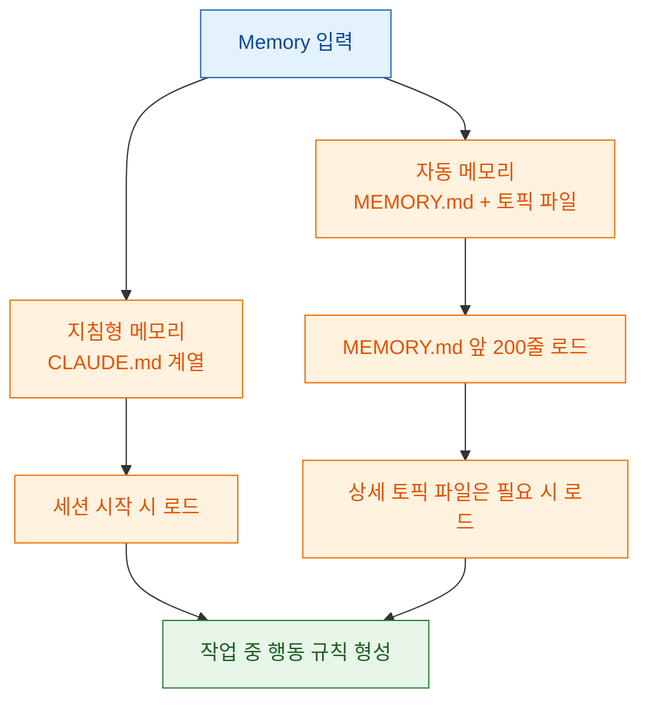
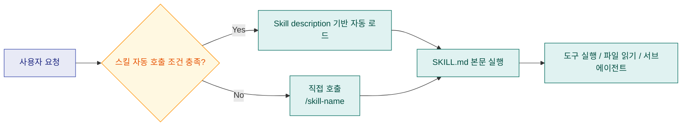
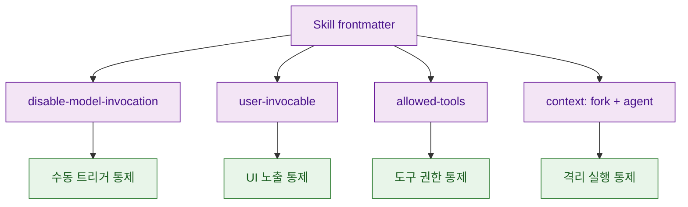
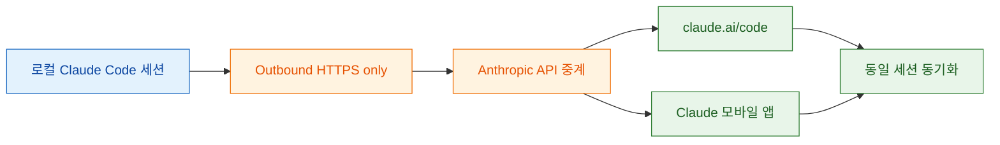
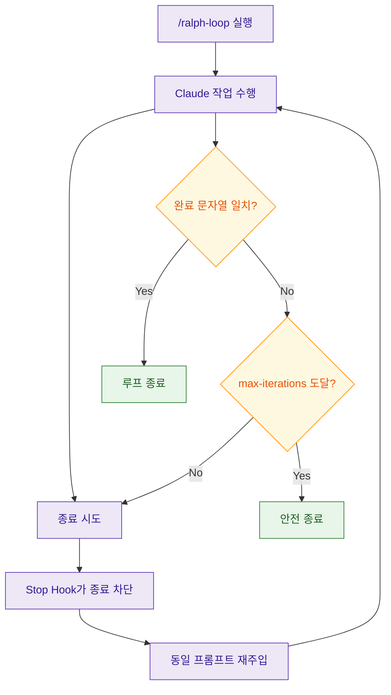
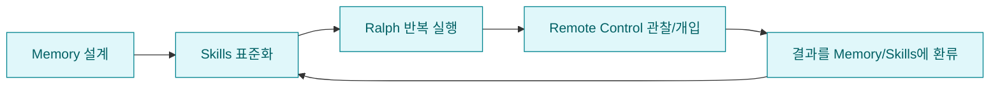

이번 글은 아래 5개 공식 링크를 기준으로 Claude Code의 핵심 업데이트를 "기능 소개"가 아니라 "운영 설계" 관점에서 다시 정리한 문서입니다.<br>특히 Memory, Skills, Remote Control, Ralph Loop를 각각 이해한 뒤, 마지막에 하나의 루프로 합치는 방법까지 다룹니다.<br>문서 확인 시점은 **2026-03-02** 입니다.

<!--more-->

## Sources

- https://code.claude.com/docs/ko/memory
- https://code.claude.com/docs/en/skills#bundled-skills
- https://code.claude.com/docs/en/remote-control
- https://claude.com/plugins/ralph-loop
- https://github.com/anthropics/claude-code/blob/main/plugins/ralph-wiggum/README.md

## 1) Memory: "지침"과 "학습"을 분리하는 계층 설계

Memory 문서의 핵심은 메모리를 한 종류로 보지 않는 것입니다.<br>Claude Code는 크게 아래 두 축을 함께 사용합니다.

- **지침형 메모리**: `CLAUDE.md` 계열 (사용자/팀/조직이 규칙을 명시)
- **자동 메모리**: Claude가 세션 중 학습한 내용을 저장하는 `~/.claude/projects/<project>/memory/` 계열



### 메모리 위치와 우선순위 핵심

문서 기준으로 메모리 레이어는 조직/프로젝트/사용자/로컬/자동 메모리로 분리됩니다.<br>실무에서 중요한 포인트는 아래입니다.

- 더 구체적인 지침이 더 넓은 지침보다 우선합니다.
- `cwd` 기준 상위 디렉토리의 `CLAUDE.md`를 재귀적으로 읽습니다.
- 하위 디렉토리의 `CLAUDE.md`는 시작 시 전부 로드하지 않고, 해당 하위 트리 파일을 읽을 때 지연 로드됩니다.

### 자동 메모리의 실제 동작

- 엔트리 파일: `MEMORY.md` (세션 시작 시 앞 200줄만 자동 로드)
- 상세 파일: `debugging.md`, `api-conventions.md` 같은 토픽 파일 (필요 시 읽기)
- 저장 위치: `~/.claude/projects/<project>/memory/`
- git worktree는 별도 메모리 디렉토리를 가집니다.

### 제어 스위치

- `/memory` 명령으로 메모리 파일을 직접 열고 편집 가능
- `autoMemoryEnabled` 설정으로 사용자/프로젝트 단위 on/off
- `CLAUDE_CODE_DISABLE_AUTO_MEMORY` 환경 변수가 `/memory` 토글 및 settings보다 우선

```bash
# ~/.claude/settings.json
{ "autoMemoryEnabled": false }

# .claude/settings.json
{ "autoMemoryEnabled": false }

export CLAUDE_CODE_DISABLE_AUTO_MEMORY=1
```

### 구조화 팁

Memory 문서에서 실전적으로 특히 중요한 부분은 아래 3개입니다.

1. `.claude/rules/*.md`로 규칙을 모듈화하고, 필요하면 YAML `paths`로 경로별 규칙을 건다.
2. `@path/to/import`로 규칙 파일을 분리하되, 임포트 깊이(최대 5 hops)를 의식한다.
3. 대형 리포는 "공통 규칙(상위) + 모듈 규칙(하위) + 자동 메모리(프로젝트 학습)" 3층 구조로 운영한다.

## 2) Skills: 프롬프트 자산을 "실행 가능한 단위"로 관리

Skills 문서의 핵심은 "명령어 확장"이 아니라 "Claude의 실행 정책 확장"입니다.<br>스킬은 `SKILL.md`와 frontmatter로 정의되고, 필요 시 자동 호출되거나 `/skill-name`으로 직접 호출됩니다.



### 번들 스킬(Bundled skills)

문서에 명시된 기본 번들 스킬은 아래입니다.

- `/simplify`: 최근 변경 파일을 병렬 리뷰하고 개선 적용
- `/batch <instruction>`: 대규모 변경을 5~30개 단위로 분해, 승인 후 병렬 에이전트/워크트리 기반 실행
- `/debug [description]`: 현재 세션 디버그 로그 기반 문제 분석

추가로 Anthropic SDK import 시 자동 활성화되는 개발자 플랫폼 번들 스킬이 있다고 문서에 명시돼 있습니다.

### 스킬 저장 위치와 충돌 우선순위

- Enterprise
- Personal: `~/.claude/skills/<skill-name>/SKILL.md`
- Project: `.claude/skills/<skill-name>/SKILL.md`
- Plugin: `<plugin>/skills/<skill-name>/SKILL.md`

우선순위는 `enterprise > personal > project` 입니다.<br>플러그인 스킬은 `plugin-name:skill-name` 네임스페이스를 사용해 충돌을 피합니다.

### 운영에 바로 쓰는 frontmatter 핵심

- `disable-model-invocation: true`: 모델 자동 호출 금지 (수동 실행 전용)
- `user-invocable: false`: `/` 메뉴에서 숨김, 모델 자동 호출 전용
- `allowed-tools`: 스킬 활성 시 무승인 사용 가능한 도구 범위
- `context: fork` + `agent`: 분리된 subagent에서 실행



### 고급 패턴 2가지

1. `!\`command\`` 구문으로 스킬 실행 전 동적 데이터 주입<br>예: `gh pr diff` 결과를 프롬프트에 선반영
2. 스킬 설명 문자열 예산 관리<br>문서 기준으로 스킬 설명은 컨텍스트 예산(동적 2%, fallback 16,000 chars) 내에서 로드

## 3) Remote Control: 로컬 실행을 유지한 채 멀티디바이스로 이어붙이기

Remote Control 문서 핵심은 "웹에서 조작"이 아니라 "로컬 세션을 원격에서 이어서 제어"입니다.<br>즉 실행 위치는 계속 내 머신이고, 브라우저/모바일은 그 세션의 창 역할을 합니다.



### 시작 방법

- 새 원격 세션: `claude remote-control`
- 기존 세션 이어붙이기: `/remote-control` 또는 `/rc`
- URL/QR/세션 목록으로 다른 디바이스에서 접속

`claude remote-control` 에서만 아래 플래그 사용 가능:

- `--verbose`
- `--sandbox` / `--no-sandbox`

### 문서 기준 요구사항과 현재 상태

문서 상단에는 "research preview, Max/Pro" 표기가 있고, Requirements 섹션에는 "현재 Max 필요, Pro 곧 지원"이라고 명시되어 있습니다.<br>즉 같은 페이지 안에서도 안내 문구가 섹션별로 다를 수 있으므로, 실제 사용 전 계정 플랜에서 즉시 확인이 필요합니다.

추가 요구사항:

- `/login` 인증 필요
- 프로젝트 디렉토리에서 한 번 실행해 workspace trust 승인 필요
- API key 방식은 Remote Control에서 지원되지 않음

### 보안/네트워크 관점 핵심

- 인바운드 포트를 열지 않음
- 로컬 프로세스가 아웃바운드 HTTPS로 등록/폴링
- 트래픽은 TLS 위에서 전송
- 용도별 단기 credential 사용

### 제한사항

- Claude Code 인스턴스당 원격 세션 1개
- 터미널/프로세스 종료 시 세션 종료
- 약 10분 이상 네트워크 단절 시 timeout 후 프로세스 종료

## 4) Ralph Loop: Stop Hook 기반 반복 개선 루프

Ralph Loop 플러그인 페이지와 `ralph-wiggum` README가 공통으로 강조하는 포인트는 동일합니다.<br>한 번 실행한 프롬프트를 세션 내부에서 반복 재투입해, 실패를 다음 반복의 입력으로 쓰는 구조입니다.



### 명령과 제약

- 시작: `/ralph-loop "<prompt>" --max-iterations <n> --completion-promise "<text>"`
- 중단: `/cancel-ralph`
- `--completion-promise`는 정확 문자열 매칭
- 다중 종료 조건을 completion-promise 하나로 표현하기 어렵기 때문에 `--max-iterations`를 항상 안전장치로 두는 것을 README가 권장

### 어떤 작업에 적합한가

적합:

- 성공 조건이 명확한 작업
- 테스트/린트 등 자동 검증 가능한 반복 개선 작업
- 그린필드 구현처럼 일정 시간 무인 반복이 가능한 작업

부적합:

- 인간 판단/디자인 결정이 핵심인 작업
- 성공 조건이 불명확한 작업
- 프로덕션 장애처럼 즉시 정밀 판단이 필요한 디버깅

### 플러그인 페이지 메타

- Anthropic verified 표기
- 작성 주체: Anthropic
- 설치 수 표기(확인 시점 2026-03-02 기준): **83,061 installs**

## 5) 4개 기능을 한 루프로 묶는 실전 운영 패턴

실무에서는 아래 순서가 가장 안정적입니다.

1. `Memory`로 규칙/학습 축적 구조를 먼저 고정
2. `Skills`로 반복 작업 절차를 명령화
3. `Ralph Loop`로 자동 반복 개선 구동
4. `Remote Control`로 이동 중 관찰/개입



이 루프의 장점은 "한 번 잘한 작업"을 "다음에도 재현 가능한 작업"으로 바꾼다는 점입니다.<br>결국 핵심은 기능 사용법 자체보다, 실패와 개선 흔적을 구조화해 다음 실행에 자동 반영하는 운영 체계입니다.

## Evidence Notes

| claim | evidence | url | confidence |
|---|---|---|---|
| 자동 메모리와 CLAUDE.md 계열이 함께 로드되며 MEMORY.md 앞 200줄만 시작 시 로드 | memory 문서 본문에 자동 메모리/200줄/메모리 위치 명시 | https://code.claude.com/docs/ko/memory | High |
| 번들 스킬로 `/simplify`, `/batch`, `/debug`가 제공됨 | skills 문서 Bundled skills 섹션 | https://code.claude.com/docs/en/skills#bundled-skills | High |
| Remote Control은 로컬 실행 유지 + 원격 인터페이스 동기화 방식 | remote-control 문서의 개념/보안/비교 섹션 | https://code.claude.com/docs/en/remote-control | High |
| Ralph Loop는 Stop hook 기반 self-referential loop이며 `/ralph-loop`, `/cancel-ralph` 제공 | ralph-wiggum README 명령/코어 컨셉 | https://github.com/anthropics/claude-code/blob/main/plugins/ralph-wiggum/README.md | High |
| Ralph Loop 플러그인 페이지에서 Anthropic verified/설치 수가 표시됨 | plugin 페이지 카드 메타 정보 | https://claude.com/plugins/ralph-loop | High |
