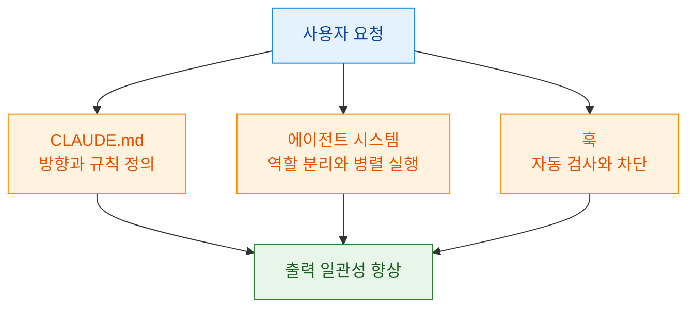
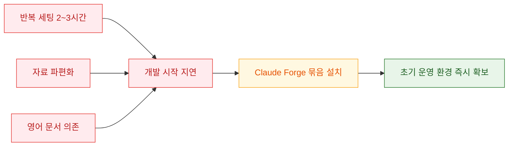
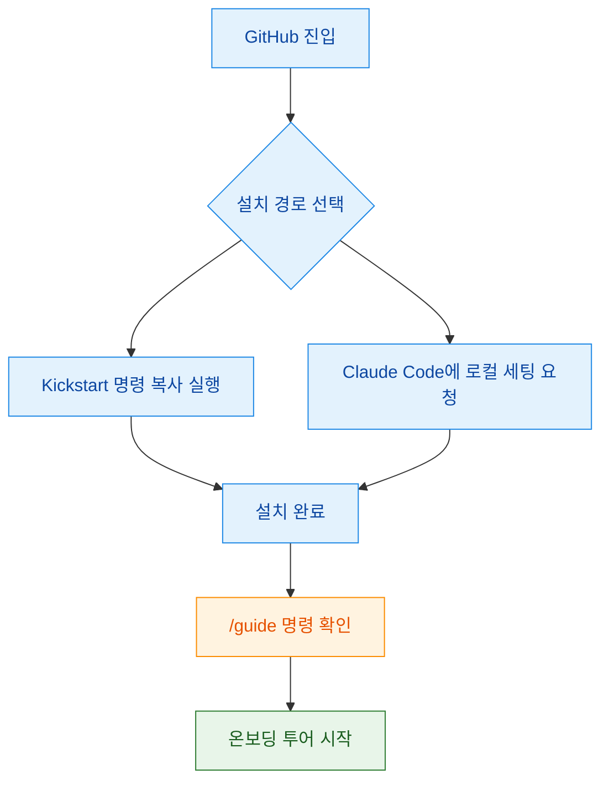
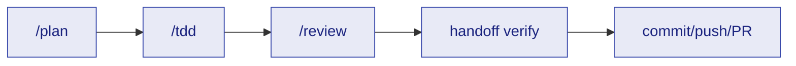
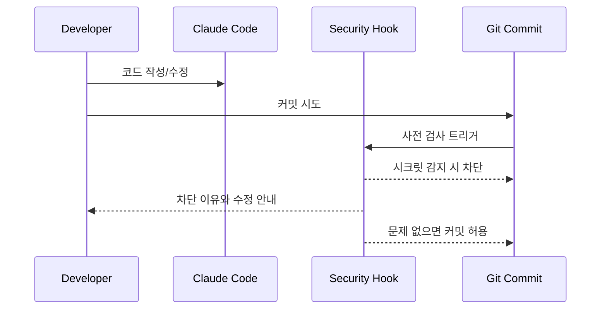
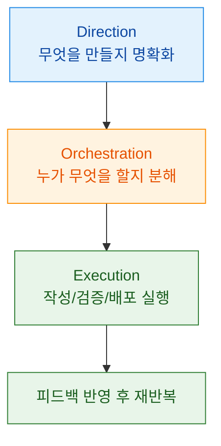

이 영상의 핵심 메시지는 단순합니다. Claude Code를 기본값으로만 쓰면 잠재력의 일부만 쓰게 되고, `CLAUDE.md` + 에이전트 + 훅을 함께 설계해야 실제 개발 생산성이 올라간다는 주장입니다. 영상 화자는 이를 "밀키트" 비유로 설명하면서, 수동 반복 세팅을 줄이는 패키지형 접근(Claude Forge)을 제안합니다. [근거 1](https://youtu.be/3lMjX5Gq1zE?t=13), [근거 2](https://youtu.be/3lMjX5Gq1zE?t=45), [근거 3](https://youtu.be/3lMjX5Gq1zE?t=166)

추가로, 영상 자막은 자동 생성(ko)이라 일부 고유명사는 문맥 보정이 필요합니다. 이 글에서는 영상 타임스탬프 근거를 우선으로 두고, 숫자/구성 요소(에이전트 수, 커맨드 수 등)는 영상 설명란의 GitHub README를 교차 확인해 정확도를 보완했습니다. [영상 설명 근거](https://youtu.be/3lMjX5Gq1zE?t=222), [README](https://github.com/sangrokjung/claude-forge)

<!--more-->

## Sources

- https://www.youtube.com/watch?v=3lMjX5Gq1zE

## 1) 왜 "설정"이 성능을 결정하는가: CLAUDE.md, 에이전트, 훅의 3축

영상은 Claude Code 활용도를 결정하는 3요소로 `CLAUDE.md`, 에이전트 시스템, 훅을 제시합니다. 요지는 "좋은 모델을 쓰는 것"보다 "반복 가능한 운영 규칙을 먼저 심는 것"이 결과 품질을 안정화한다는 것입니다. 특히 `CLAUDE.md`를 신입 매뉴얼에 비유한 점은, 지시문이 아니라 팀 운영 규약이라는 관점을 강조합니다. [근거](https://youtu.be/3lMjX5Gq1zE?t=45), [근거](https://youtu.be/3lMjX5Gq1zE?t=51)

### 증거 노트

- claim: 활용도 차이는 설정 유무에서 크게 벌어진다.
  - transcript quote/time marker: "기본으로 쓰시면 ... 10%밖에 활용" (00:13-00:17)
  - video url: https://youtu.be/3lMjX5Gq1zE?t=13
  - confidence: high
- claim: 핵심 3요소는 `CLAUDE.md`, 에이전트, 훅이다.
  - transcript quote/time marker: "클로드 MD 그리고 에이전트 그리고 훅" (00:45-00:48)
  - video url: https://youtu.be/3lMjX5Gq1zE?t=45
  - confidence: high

## 2) Claude Forge가 해결하려는 문제: 반복 세팅 비용과 정보 파편화

영상에서 가장 실무적인 문제정의는 "프로젝트마다 2~3시간 세팅 반복"입니다. 단순히 귀찮음 이슈가 아니라, 개발 시간이 초기 세팅으로 소모되고 시작 속도가 느려지는 구조적 손실로 설명합니다. 동시에 자료가 YouTube/블로그/커뮤니티로 흩어져 있어, 개인이 운영 가능한 형태로 합치는 비용이 크다고 말합니다. [근거](https://youtu.be/3lMjX5Gq1zE?t=116), [근거](https://youtu.be/3lMjX5Gq1zE?t=137)

이 지점에서 Claude Forge는 "밀키트" 전략으로 제시됩니다. 즉, 개별 기능을 하나씩 학습/조립하기보다, 기본 운영 부품을 미리 결합한 환경을 먼저 설치해 진입비용을 낮추는 방식입니다. [근거](https://youtu.be/3lMjX5Gq1zE?t=166), [근거](https://youtu.be/3lMjX5Gq1zE?t=170)

### 증거 노트

- claim: 프로젝트마다 세팅 반복 비용이 크다.
  - transcript quote/time marker: "프로젝트마다 최소 두시간씩" (01:56-02:00), "두시간씩 세시간씩 세팅만" (02:09-02:14)
  - video url: https://youtu.be/3lMjX5Gq1zE?t=116
  - confidence: high
- claim: 정보가 파편화돼 있고 한국어 자료는 상대적으로 적다고 설명한다.
  - transcript quote/time marker: "정보가 ... 파편화", "한국어 자료는 잘 없죠" (02:17-02:31)
  - video url: https://youtu.be/3lMjX5Gq1zE?t=137
  - confidence: high

## 3) 5분 설치 플로우: GitHub 킥스타트와 `/guide` 검증 포인트

설치 시연은 두 가지 경로를 보여 줍니다. 첫째는 GitHub의 킥스타트 명령을 복사해 터미널에서 실행하는 경로, 둘째는 Claude Code 내부에서 저장소 링크를 지정해 로컬 세팅을 요청하는 경로입니다. 어떤 경로를 택하든 "설치 완료 확인은 `/guide` 노출 여부"라는 체크포인트를 명확히 제시합니다. [근거](https://youtu.be/3lMjX5Gq1zE?t=239), [근거](https://youtu.be/3lMjX5Gq1zE?t=272)

또한 영상 설명란의 GitHub README에는 `/guide`가 "3-minute tour"로 적혀 있어, 영상의 온보딩 주장과 저장소 문서가 같은 방향을 가리킵니다. [README](https://raw.githubusercontent.com/sangrokjung/claude-forge/main/README.md)

### 증거 노트

- claim: 설치 후 `/guide`가 보이면 세팅 완료로 검증한다.
  - transcript quote/time marker: "슬래시에서 가이드를 ... 세팅 완료" (04:32-04:39)
  - video url: https://youtu.be/3lMjX5Gq1zE?t=272
  - confidence: high
- claim: 설치 시간이 매우 짧다고 강조한다.
  - transcript quote/time marker: "5분도 안 걸립니다" (04:49-04:53)
  - video url: https://youtu.be/3lMjX5Gq1zE?t=289
  - confidence: medium

## 4) 워크플로 파이프라인: Plan -> TDD -> Review -> Verify -> Commit/PR

영상의 중반부는 도구 소개보다 운영 시퀀스 제시에 가깝습니다. 핵심은 "무작정 개발" 대신 계획-테스트-검토-검증-배포를 단계적으로 강제하는 것입니다. 특히 `Plan`을 별도 계획 에이전트로 분리하고, TDD와 리뷰/검증 단계를 끼워 넣어 결과물 안정성을 높이는 흐름을 강조합니다. [근거](https://youtu.be/3lMjX5Gq1zE?t=322), [근거](https://youtu.be/3lMjX5Gq1zE?t=340), [근거](https://youtu.be/3lMjX5Gq1zE?t=355)

### 증거 노트

- claim: 계획 이후 TDD로 테스트를 먼저 작성하는 흐름을 설명한다.
  - transcript quote/time marker: "계획이 완료가 되면 TDD를 통해서 테스트를 먼저" (05:40-05:44)
  - video url: https://youtu.be/3lMjX5Gq1zE?t=340
  - confidence: high
- claim: 코드 리뷰/검증/커밋 푸시까지 하나의 프로세스로 제시한다.
  - transcript quote/time marker: "리뷰", "핸드오프 ... 검증", "커밋 푸쉬" (05:55-06:35)
  - video url: https://youtu.be/3lMjX5Gq1zE?t=355
  - confidence: high

## 5) 보안 자동화: API 키 커밋 차단 시나리오의 실무 의미

보안 파트에서 영상은 "API 키를 코드에 넣고 커밋하려고 할 때 훅이 차단"하는 시나리오를 반복해서 설명합니다. 이 메시지는 단순 기능 자랑이 아니라, AI 보조개발에서도 시크릿 누출 사고를 기본 가정하고 예방 단계를 자동화해야 한다는 운영 원칙으로 해석할 수 있습니다. [근거](https://youtu.be/3lMjX5Gq1zE?t=420), [근거](https://youtu.be/3lMjX5Gq1zE?t=428)

다만 "6단계 보안 파이프라인" 같은 숫자 표현은 영상 자막만으로 세부 정의를 완전히 복원하기 어렵습니다. 이 부분은 저장소 문서(보안 훅 목록)와 함께 확인하는 방식이 안전합니다. [README](https://raw.githubusercontent.com/sangrokjung/claude-forge/main/README.md)

### 증거 노트

- claim: API 키가 코드에 있으면 훅이 커밋을 차단한다고 설명한다.
  - transcript quote/time marker: "API 키를 ... 커밋 ... 훅 시스템이 ... 감지" (07:00-07:14)
  - video url: https://youtu.be/3lMjX5Gq1zE?t=420
  - confidence: high
- claim: 보안 파이프라인이 자동으로 동작한다고 주장한다.
  - transcript quote/time marker: "자동으로 돌아가고", "자동으로 검사" (07:27-07:35)
  - video url: https://youtu.be/3lMjX5Gq1zE?t=447
  - confidence: high

## 6) DOE 프레임워크로 보는 운영 관점: Direction, Orchestration, Execution

영상 후반의 DOE 설명은 사실상 앞선 3요소를 운영 프레임으로 재정리한 것입니다. Direction(방향 제시)은 `CLAUDE.md`와 지시 설계, Orchestration(조율)은 에이전트 분업, Execution(실행)은 실제 코드 생성/검증 단계에 대응됩니다. 즉 "도구 설치"보다 "일을 분해하고 통제하는 방식"이 성과를 만든다는 메시지입니다. [근거](https://youtu.be/3lMjX5Gq1zE?t=487), [근거](https://youtu.be/3lMjX5Gq1zE?t=509)

### 증거 노트

- claim: DOE를 방향-조율-실행 프레임으로 제시한다.
  - transcript quote/time marker: "DOE ... Directives, Orchestration, Execution" (08:07-08:26)
  - video url: https://youtu.be/3lMjX5Gq1zE?t=487
  - confidence: high
- claim: 이 프레임을 Claude Forge 구성요소와 연결해 설명한다.
  - transcript quote/time marker: "방향 ... 클라우드 MD, 조율 ... 에이전트, 실행 ... 훅" (08:29-08:37)
  - video url: https://youtu.be/3lMjX5Gq1zE?t=509
  - confidence: high

## 실전 적용 포인트

1. 먼저 `CLAUDE.md`를 "규칙 문서"로 작성하고, 코드 생성 요청보다 운영 제약(테스트 필수, 보안 기준, 리뷰 단계)을 선명하게 고정하세요.
2. 에이전트는 역할별로 3개만 먼저 분리해도 효과가 큽니다(기획/구현/검증). 처음부터 많은 역할을 도입하기보다 팀 병목부터 분해하세요.
3. 설치 직후에는 `/guide` 같은 온보딩 커맨드로 실제 동작을 확인하고, 안 보이면 설치 실패로 간주해 바로 원인 점검을 권장합니다.
4. 워크플로는 "Plan -> TDD -> Review -> Verify -> PR"를 기본 파이프라인으로 고정하고, 예외 작업만 별도 분기하는 방식이 유지보수에 유리합니다.
5. 보안 훅은 선택 기능이 아니라 기본 장치로 두세요. 특히 시크릿 차단은 사고를 줄이는 비용 대비 효과가 가장 큰 자동화입니다.

## 결론

이 영상을 한 줄로 정리하면, Claude Code 생산성의 핵심은 모델 자체보다 운영 구조에 있습니다. Claude Forge는 그 구조를 빠르게 가져오는 방법으로 제시되며, 실제 현업에서는 `CLAUDE.md` 규칙화, 역할 분리, 훅 기반 자동 검증을 함께 묶어야 효과가 커집니다.

다만 영상은 소개 성격이 강하므로, 숫자/구성 디테일은 저장소 문서로 반드시 재확인한 뒤 팀 환경에 맞게 축소 도입하는 접근이 안전합니다. 즉 "한 번에 완성"보다 "작은 파이프라인을 먼저 고정"하는 전략이 장기적으로 더 실용적입니다.
