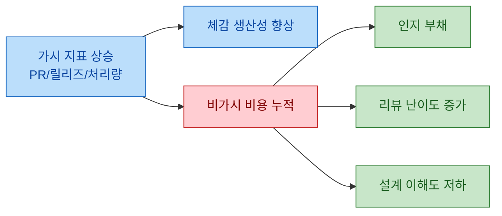
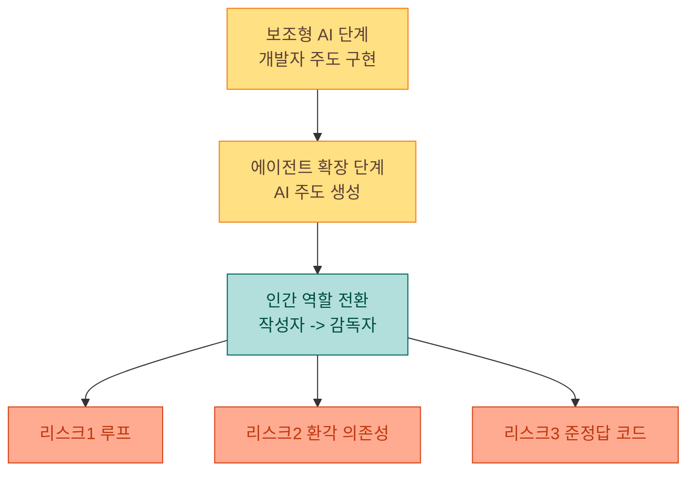
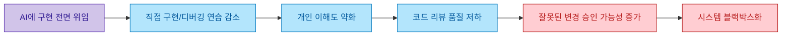

AI 코딩 도구는 이미 개발 생산성의 표준이 됐습니다. 문제는 "쓰느냐/안 쓰느냐"가 아니라, 어느 지점부터 생산성 이득이 장기 역량 손실로 바뀌는지를 팀이 어떻게 관리하느냐입니다. Tom Wojcik의 글은 이 지점을 개인 경험, 연구 인용, 조직 운영 사례를 함께 엮어 설명합니다.

<!--more-->

## Sources

- https://tomwojcik.com/posts/2026-02-15/finding-the-right-amount-of-ai/
- (보강 검증) https://arxiv.org/abs/2601.20245
- (보강 검증) https://margaretstorey.com/blog/2026/02/09/cognitive-debt/
- (보강 검증) https://simonwillison.net/tags/cognitive-debt/

## 1) 핵심 문제 정의: AI 코딩은 이득이 맞지만, 비용은 대시보드에 잘 안 잡힌다

원문의 출발점은 단순합니다. 개발자 대부분이 AI를 쓰고 있고, 속도 이득도 분명하지만 보이지 않는 비용이 존재한다는 주장입니다.

> "The productivity gains are real, but there are costs that don’t show up on any dashboard."

이 문장은 이후 모든 논의를 관통하는 전제입니다. 즉, 팀이 보는 지표(PR 처리량, 릴리즈 속도, 코드 생성량)가 좋아져도, 개발자 개인의 문제 해결 능력과 팀의 시스템 이해도가 동시에 떨어질 수 있다는 것입니다. 이 관점은 "AI 성과 = 단기 산출"로만 측정하면 놓치기 쉬운 리스크를 드러냅니다.

## 2) 도구 진화의 전환: "AI-보조 코딩"에서 "인간-보조 AI 코딩"으로

글은 2023년 전후의 보조형 AI(자동완성/챗/코드 검색)에서, 에이전트 중심 워크플로로 중심축이 이동했다고 설명합니다. 이때 중요한 문구가 다음입니다.

> "It was no longer an AI-assisted human coding, but a human-assisted AI coding."

의미는 명확합니다. 개발자가 직접 구현하는 비중이 줄고, 에이전트가 만든 산출물을 감시/보정하는 비중이 커졌다는 것입니다. 저자는 초기 에이전트 단계에서 루프, 의존성 환각, "거의 맞아 보이지만 틀린 코드"를 반복적으로 경험했다고 말합니다.

> "Agents often got stuck in loops, hallucinate dependencies, and produced code that looks almost right but isn’t."

이 지점에서 실무 판단 포인트는 "자동화 정도" 자체가 아니라, 실패 모드를 인간이 어디까지 통제 가능한지입니다.

## 3) 인지 부채와 리뷰 역설: 왜 "검토만 하는 개발"이 위험해지는가

원문은 핵심 위험을 "인지 부채(cognitive debt)"로 명명합니다. 코드는 남아 있어도 팀의 머릿속 모델이 무너지면, 변경 비용이 폭증한다는 논리입니다. 이 주장은 Margaret-Anne Storey의 글과도 일치합니다.

> "Technical debt lives in the code; cognitive debt lives in developers' minds"

원문은 더 나아가 "리뷰 역설"을 제시합니다. AI가 코드를 더 많이 쓸수록, 인간은 그 코드를 깊이 검증할 자격을 잃어간다는 역설입니다.

> "The more AI writes, the less qualified humans become to review what it wrote."

저자가 인용한 Shen/Tamkin 연구(52명 무작위 비교)는 이 위험에 정량 힌트를 제공합니다. 원문 요약 기준으로 AI 보조 그룹이 개념 이해/디버깅/코드 읽기에서 낮은 성과를 보였고, 특히 디버깅 격차가 컸다는 점이 강조됩니다. 다만 이 부분은 단일 연구 인용이며 표본 규모가 작기 때문에, "방향성 신호"로 해석하는 것이 안전합니다.

## 4) 조직 관점의 함정: AI 사용량 KPI는 Goodhart의 법칙을 부른다

원문이 강하게 비판하는 지점은 "AI 사용량 자체를 성과 지표로 강제"하는 운영입니다. 사용량을 목표로 두면, 실제 품질 개선 대신 지표 맞추기 행동이 늘어날 수 있다는 것입니다.

> "When a measure becomes a target, it ceases to be a good measure."

저자가 제시한 커뮤니티 사례에서는, 엔지니어가 실제 가치와 무관한 작업을 AI에게 던져 사용량만 올리는 행동이 관찰됩니다. 이런 상황에서는 조직이 기대한 "생산성 향상" 대신 "컴플라이언스 시어터"가 생깁니다. 즉, 측정은 늘었지만 개선은 줄어드는 상태입니다.

이 문제는 경영진의 예측 과열과도 연결됩니다. 원문은 다양한 "n개월 내 대체"류 전망이 반복적으로 과신됐다고 지적하며, 실제 도입 역량은 팀의 맥락(도메인, 테스트 문화, 리뷰 품질, 운영 성숙도)에 크게 좌우된다고 봅니다.

## 5) 결론적 제안: 0도 100도 아닌, "인지적으로 참여하는 사용"이 기준

저자가 제시하는 결론은 극단 회피입니다.

> "The right amount of AI is not zero. And it’s not maximum."

핵심은 AI 사용 여부가 아니라, 사용 방식입니다. 원문은 AI 상호작용 패턴 중에서 학습을 망가뜨리는 패턴(전면 위임, 점진 의존, 디버깅 외주화)과 유지하는 패턴(설명 요구, 개념 질문, 직접 작성+AI 보조)을 구분합니다. 보강 검증 자료에서도 공통적으로 강조되는 메시지는 동일합니다. 개발자의 인지적 개입이 끊기면, 속도는 남아도 역량은 사라집니다.

## 실전 적용 포인트

1. AI 사용률 대신 "변경 이해도"를 측정하세요. 예: "이 PR의 핵심 설계 선택을 3문장으로 설명 가능한가?"를 배포 전 체크리스트로 둡니다.
2. 전면 위임 구간을 제한하세요. 신규 도메인/핵심 로직/장애 대응 경로는 직접 구현 비중을 높이고, 반복 작업(스캐폴딩/보일러플레이트)은 AI 비중을 높입니다.
3. 코드 리뷰 기준을 "동작 확인"에서 "이해 확인"으로 확장하세요. 리뷰어가 "왜 이렇게 설계했는가"에 답할 수 없으면 병합을 미룹니다.
4. 팀 차원의 인지 부채 상환 루틴을 만드세요. 주간 리팩터링 회고, 기능별 아키텍처 설명 세션, 변경 의도 기록을 운영 기본값으로 둡니다.
5. 온콜/장애 대응 리허설을 통해 의존도를 점검하세요. "에이전트 없이도 원인 추적 가능한가"는 AI 활용 적정선을 가늠하는 현실 지표입니다.

## 결론

이 글의 실질적 메시지는 "AI를 덜 써라"가 아닙니다. "AI를 쓰되, 개발자의 이해 능력과 팀의 설계 기억을 훼손하지 않는 방식으로 써라"에 가깝습니다. 단기 속도는 자동화로 쉽게 올릴 수 있지만, 장기 경쟁력은 여전히 사람이 축적한 문제 모델과 디버깅 감각에서 나옵니다.

결국 적정선은 도구의 성능이 아니라 팀의 운영 규칙으로 결정됩니다. AI 도입 전략의 성패는 사용량이 아니라, 인지적 참여를 얼마나 시스템으로 강제하느냐에 달려 있습니다.
