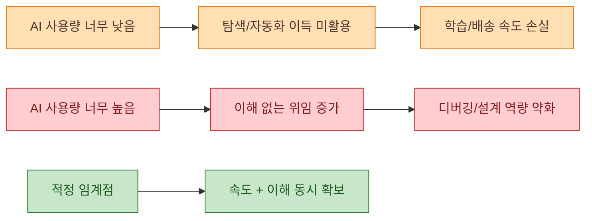
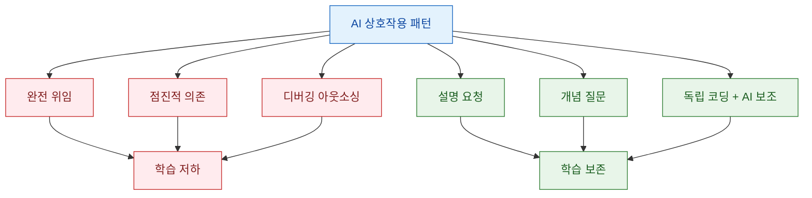

요즘 개발 조직에서 AI 코딩 도구는 사실상 기본값이 되었습니다. 문제는 "써야 하냐"가 아니라, 어느 지점부터 팀 역량을 키우는 도구가 되고 어느 지점부터 팀 역량을 깎아 먹는 의존이 되는가입니다. Tom Wojcik의 글은 이 경계를 "too little"과 "too much"의 양극단으로 나누고, 생산성 지표만으로는 보이지 않는 비용을 정면으로 다룹니다 (근거: https://tomwojcik.com/posts/2026-02-15/finding-the-right-amount-of-ai/).

<!--more-->

## Sources

- https://tomwojcik.com/posts/2026-02-15/finding-the-right-amount-of-ai/

수집 메모:
- extraction_method: `http` (webfetch)
- fallback_used: `false`

## 1) "AI를 너무 적게"도, "너무 많이"도 위험한 이유

원문이 던지는 핵심 질문은 HN 인용문 그대로입니다. "Which is higher risk, using AI too much, or using AI too little?" 저자는 이 질문에 대해 한쪽만 정답이 아니라고 답합니다. 실제 결론 문장도 "The right amount of AI is not zero. And it’s not maximum."으로 못 박습니다 (근거: https://tomwojcik.com/posts/2026-02-15/finding-the-right-amount-of-ai/).

저자가 말하는 "too little"의 비용은 명확합니다. 코드베이스 탐색, 보일러플레이트 작성, 조사-계획-구현-검증 루프에서 AI가 이미 실질적 시간 단축을 제공한다는 점입니다. 반대로 "too much"의 비용은 더 은밀합니다. 테스트/CI를 통과해도 논리 결함이 숨어 있는 코드, 인간이 설계 이유를 설명하지 못하는 코드베이스, 그리고 스스로 디버깅할 수 있는 근육의 약화가 누적된다는 것입니다 (근거: https://tomwojcik.com/posts/2026-02-15/finding-the-right-amount-of-ai/).

## 2) 인지 부채와 리뷰 패러독스: 속도는 오르는데 실력은 떨어지는 구조

이 글에서 가장 중요한 개념은 technical debt가 아니라 cognitive debt입니다. 저자는 Margaret-Anne Storey의 정의를 빌려, 코드는 빨리 늘어나지만 팀 머릿속의 시스템 이론이 비는 현상을 핵심 리스크로 봅니다. 즉, 코드 부채는 저장소에 남지만 인지 부채는 사람의 이해력에서 빠져나갑니다 (근거: https://tomwojcik.com/posts/2026-02-15/finding-the-right-amount-of-ai/, https://margaretstorey.com/blog/2026/02/09/cognitive-debt/).

저자가 말하는 리뷰 패러독스도 여기서 나옵니다. AI가 코드를 더 많이 쓸수록 사람은 리뷰만 하게 되는데, 리뷰 실력은 원래 "직접 만들고 망가뜨려 보고 고치는 과정"에서 형성됩니다. 쓰는 행위를 줄일수록 리뷰 능력의 기반도 줄어든다는 역설입니다. 그래서 Storey의 "배포 전 인간 이해 강제" 원칙("require humans to understand each AI-generated change before deployment")을 운영 규칙으로 삼아야 한다는 결론이 나옵니다 (근거: https://tomwojcik.com/posts/2026-02-15/finding-the-right-amount-of-ai/, https://margaretstorey.com/blog/2026/02/09/cognitive-debt/).

## 3) 연구 근거로 본 "속도"와 "학습"의 분리

원문은 Shen-Tamkin(2026) 실험을 근거로, AI 지원이 학습 형성과 어떻게 충돌하는지 설명합니다. 글에서 제시한 핵심 수치는 새 라이브러리 학습 과제에서 AI 보조 그룹이 개념 이해/디버깅/코드 읽기 평가에서 17% 낮았고, 특히 디버깅 격차가 컸다는 점입니다 (근거: https://tomwojcik.com/posts/2026-02-15/finding-the-right-amount-of-ai/, https://arxiv.org/abs/2601.20245).

중요한 포인트는 "AI 사용 여부"가 아니라 "사용 방식"입니다. 글은 같은 연구를 인용해 학습을 깎는 패턴(완전 위임, 점진적 의존, 디버깅 아웃소싱)과 학습을 지키는 패턴(설명 요청, 개념 질문, 독립 코딩+AI 보조)을 구분합니다. 즉, 도구 자체보다 인지적 관여를 남겨 두는 설계가 성패를 가릅니다 (근거: https://tomwojcik.com/posts/2026-02-15/finding-the-right-amount-of-ai/).

## 4) 조직 관점: AI 사용량 KPI가 실패하는 메커니즘

저자는 C-level의 자동화 기대를 이해하면서도, "사용량 지표"를 성과 지표로 오인하는 순간 조직이 왜곡된다고 지적합니다. 글에 인용된 개발자 사례처럼, 사용량을 추적하면 실제 품질 향상보다 "툴 사용 흔적 만들기"가 목표가 되기 쉽습니다. 이는 Goodhart's law("When a measure becomes a target, it ceases to be a good measure.")가 그대로 작동한 결과입니다 (근거: https://tomwojcik.com/posts/2026-02-15/finding-the-right-amount-of-ai/).

실무적으로는 "AI 사용량"보다 "변경을 설명할 수 있는가", "온콜에서 에이전트 없이도 원인 분석이 가능한가", "왜 이 설계를 선택했는지 팀이 공유하는가" 같은 지표가 더 본질적입니다. 이 기준은 단기 속도는 덜 화려해 보여도, 장기적으로는 사고 대응력과 설계 일관성을 유지하는 안전장치가 됩니다 (근거: https://tomwojcik.com/posts/2026-02-15/finding-the-right-amount-of-ai/).

## 실전 적용 포인트

1. AI 코딩 정책을 "사용 강제"가 아니라 "인지 관여 강제"로 바꾸세요. 예: 배포 전 변경 이유를 작성자 본인이 설명하지 못하면 머지 보류.
2. PR 템플릿에 `문제 정의`, `설계 선택 이유`, `대안 대비 트레이드오프`를 필수 항목으로 넣어 이해 부채를 드러내세요.
3. 디버깅 단계만큼은 AI에 완전 위임하지 말고, 1차 가설 수립은 사람이 먼저 하도록 팀 규칙을 두세요.
4. 개인 성과 지표에서 AI 호출량/토큰량을 제외하고, 장애 복구 리드타임·재발률·리뷰 품질 같은 결과 지표를 우선하세요.
5. 주 1회 "AI가 만든 변경 재설명" 세션을 운영해 팀의 공유 멘탈 모델이 비는 지점을 조기에 복구하세요.

## 결론

이 글의 메시지는 단순한 찬반이 아닙니다. AI 코딩의 본질적 질문은 "얼마나 자주 쓰는가"가 아니라 "쓰는 동안 사고력을 얼마나 유지하는가"입니다.

결국 적정선은 팀이 스스로 코드를 설명·디버깅·재설계할 수 있는 상태를 유지하면서, 반복 작업에서는 AI의 속도 이점을 가져오는 지점입니다. 속도만 보면 이미 이긴 것처럼 보이지만, 이해를 잃는 순간 그 승리는 오래가지 않습니다.
