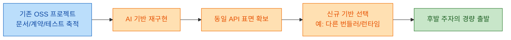
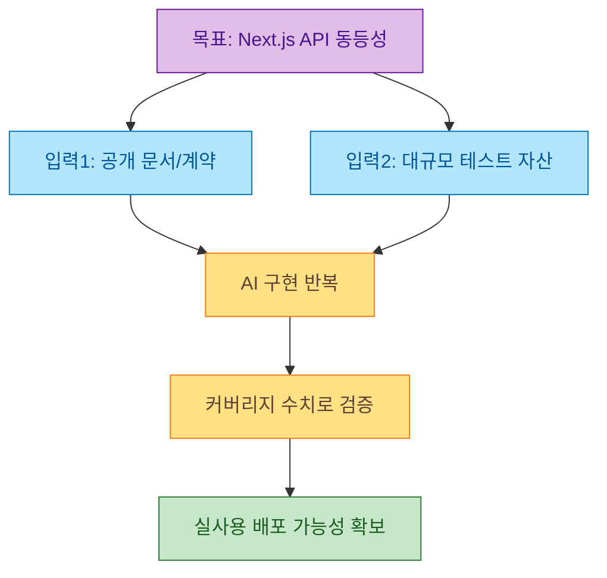
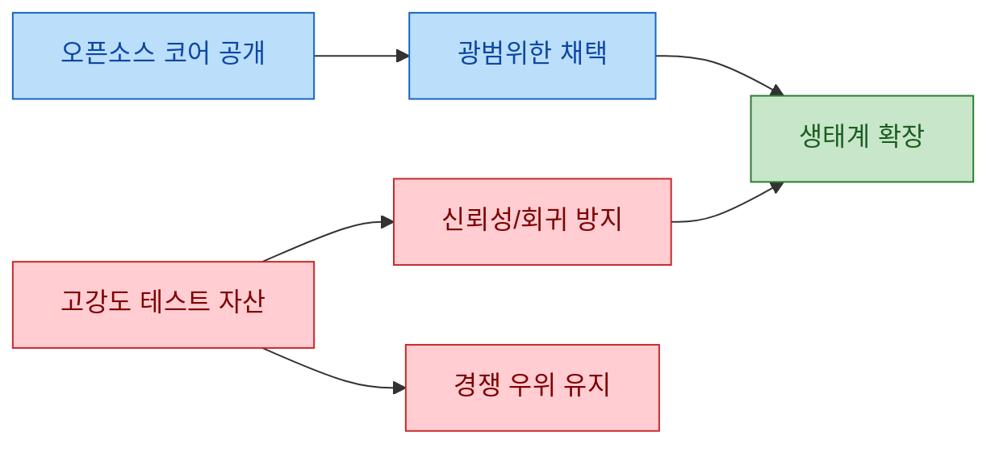

Daniel Saewitz의 "Tests Are The New Moat"는 AI가 코드 작성 비용을 급격히 낮춘 환경에서, 오픈소스의 경쟁력이 어디로 이동하는지 짚습니다. 핵심 주장은 단순합니다. 문서와 API 계약, 그리고 특히 테스트가 잘 정리된 프로젝트일수록, 경쟁자가 동일한 인터페이스를 다른 기반 위에 빠르게 재구현할 수 있다는 것입니다. 이 글은 그 주장을 Cloudflare vinext 사례, SQLite 테스트 전략, tldraw 이슈까지 연결해 상업 오픈소스의 딜레마를 보여줍니다.

<!--more-->

## Sources

- https://saewitz.com/tests-are-the-new-moat
- (보강 검증) https://blog.cloudflare.com/vinext/
- (보강 검증) https://www.sqlite.org/testing.html
- (보강 검증) https://github.com/tldraw/tldraw/issues/8082

## 1) 왜 "테스트"가 해자로 떠오르는가: 코드보다 계약 복제가 쉬워진 환경

원문은 오픈소스 프로젝트의 성장 경로(점진적 확장, 하위 호환성 유지, 기술 부채 누적)를 먼저 짚은 뒤, AI 시대에는 이 구조가 역설적으로 약점이 될 수 있다고 봅니다. 기존 프로젝트는 과거 사용자와 호환성이라는 무게를 지지만, 후발 재구현은 최신 스택만 선택해 가볍게 시작할 수 있기 때문입니다.

> "Prompt an AI to read all of their docs, import their tests, and change the foundation."

이 문장이 의미하는 바는 "코드 자체"보다 "행동 명세"가 재현의 중심이 되었다는 점입니다. 테스트가 풍부하면 풍부할수록, 재구현 프로젝트는 "무엇이 정답 동작인지"를 빠르게 고정할 수 있습니다. 즉, 구현 난이도는 낮아지고 검증 가능성이 높아집니다.

## 2) Cloudflare vinext 사례: "문서+테스트"가 재구현 속도를 만든다

원문이 가장 강하게 드는 사례는 Cloudflare의 vinext입니다. 실제 Cloudflare 글 제목부터 "How we rebuilt Next.js with AI in one week"로 명시되어 있고, "drop-in replacement"를 전면에 내세웁니다.

> "one engineer and an AI model rebuilt the most popular front-end framework from scratch"

또한 해당 글은 다음과 같은 수치를 함께 제시합니다.

- API coverage: "94% of the Next.js 16 API surface"
- 테스트 규모: "over 1,700 Vitest tests and 380 Playwright E2E tests"

Saewitz 글의 주장과 연결하면, 이는 "문서가 좋아서 이해가 쉬웠다" 수준이 아니라 "테스트가 있어서 동작 동등성을 기계적으로 검증할 수 있었다"는 지점이 핵심입니다. 즉, 테스트는 품질 보증 자산인 동시에 재구현 가속 자산이 됩니다.

## 3) SQLite의 선택: 코어는 열고, 테스트 자산 일부는 닫는다

Saewitz 글은 "미래를 먼저 본 그룹"으로 SQLite를 언급합니다. SQLite 공식 테스트 문서에서도 테스트 규모와 구조를 매우 상세하게 공개합니다.

> "the project has 590 times as much test code and test scripts - 92053.1 KSLOC"

동시에 같은 문서에는 TH3가 "proprietary tests"라고 명시됩니다.

> "The TH3 test harness is a set of proprietary tests"

즉, SQLite는 오픈소스 코어와 비공개 테스트 자산을 혼합 운영해 왔습니다. 이는 커뮤니티 관점에서는 논쟁적일 수 있지만, 상업 지속 가능성 관점에서는 "검증 자산을 해자로 관리"하는 전략으로 읽힙니다. Saewitz의 문제의식은 바로 이 지점에서 강화됩니다. AI가 구현 비용을 낮출수록, 테스트 자산의 전략적 가치가 상대적으로 커집니다.

## 4) 인센티브 충돌: 사용자 이익과 기업 생존 사이의 긴장

원문은 "완전한 이타성"과 "사업 인센티브"가 상업 OSS에서 계속 충돌한다고 봅니다. 사용자 입장에서는 테스트/문서가 모두 공개될수록 좋지만, 기업 입장에서는 그 자산이 경쟁 복제 속도를 높일 수 있습니다.

이 논점은 2026-02-25에 올라온 tldraw 이슈("Move tests to closed source repo")를 통해 현실 사례로도 관찰됩니다. 다만 원문 addendum에 따르면 tldraw는 다음날 "농담이었다"고 밝힙니다. 따라서 이 사건은 "실행된 정책 변화"라기보다 "유지보수자들이 실제로 고민 중인 압력"을 보여주는 신호로 해석하는 것이 안전합니다.

> 불확실성 표기: tldraw 사례는 최종 정책 변화의 확정 증거가 아니라, 테스트 공개 범위에 대한 커뮤니티 민감도와 유지보수자의 문제의식을 보여주는 사건으로 제한 해석해야 합니다.

## 핵심 내용

정리하면 Saewitz 글의 통찰은 "코드가 아니라 검증 가능한 행위 정의가 경쟁력의 중심이 된다"로 압축됩니다. AI는 구현을 빠르게 만들지만, 시장에서 중요한 것은 결국 "동일 인터페이스를 안정적으로 재현하고 운영할 수 있는가"입니다. 이때 테스트와 API 계약은 품질 자산이자 전략 자산이라는 이중 성격을 갖습니다.

또한 이 변화는 오픈소스의 도덕성 논쟁으로만 끝나지 않습니다. 제품을 운영하는 조직은 사용자 이익(투명성, 기여 유도, 생태계 확장)과 기업 생존(투자 회수, 차별화 유지)을 동시에 관리해야 합니다. 앞으로 더 많은 상업 OSS가 "무엇을 공개하고 무엇을 비공개로 둘지"를 테스트 자산 중심으로 재설계할 가능성이 큽니다.

## 실전 적용 포인트

1. 테스트를 "품질팀 산출물"이 아니라 "제품 전략 자산"으로 분류하세요. 공개 범위와 라이선스 정책을 코드 공개 정책과 분리해 설계하는 것이 필요합니다.
2. API 계약 문서화와 테스트 설계를 분리 관리하세요. 문서는 채택 확장에 유리하지만, 테스트 세부 자산은 경쟁 환경에 따라 공개 수준을 다르게 가져갈 수 있습니다.
3. 내부적으로는 재현 가능성 지표를 강화하세요. 예: 버전별 회귀율, 계약 위반 탐지 시간, E2E 안정성 같은 지표를 해자 운영 지표로 관리합니다.
4. 커뮤니티 신뢰를 위해 경계선을 명확히 공지하세요. "무엇을 왜 닫는지"를 숨기면 반발이 커지고, 명시하면 정책적 합의 가능성이 올라갑니다.
5. 과도한 일반화를 피하세요. 모든 프로젝트가 테스트 비공개 전략을 취해야 하는 것은 아니며, 프로젝트 성격(인프라/라이브러리/SaaS 연계)에 따라 최적점이 다릅니다.

## 결론

"테스트는 새로운 해자"라는 주장은 AI 시대에 충분히 설득력이 있습니다. 구현 난이도는 낮아지고, 동작 동등성을 보장하는 검증 자산의 가치가 상대적으로 올라가고 있기 때문입니다. 다만 이것이 곧 "테스트는 무조건 닫아야 한다"를 뜻하지는 않습니다. 핵심은 프로젝트의 미션, 사업 구조, 커뮤니티 계약에 맞춰 공개와 보호의 경계를 의도적으로 설계하는 것입니다.

앞으로 상업 오픈소스의 경쟁력은 "얼마나 좋은 코드를 쓰는가"만이 아니라, "어떤 검증 체계를 어떻게 운영하고 어디까지 공유하는가"에서 더 선명하게 갈릴 가능성이 큽니다.
