바이브 코딩을 할 때 MCP 서버라는 용어를 많이 들어보셨을 겁니다. 아직 들어보지 못했다면 바이브 코딩의 핵심을 놓치고 계신 겁니다. 이 글을 끝까지 읽으시면 MCP를 바이브 코딩에 과연 써야 할지 말아야 할지, 무조건 설치하는 게 좋은 것인지, 2026년에 어떤 MCP가 살아남아 선택받고 있는지 모두 알 수 있을 것입니다.

<!--more-->

## Sources

- [개발자가 실무에서 사용해보고 MCP 9개 정리해봤습니다 - 2026 최신](https://www.youtube.com/watch?v=jHejYZLz6_U)

## MCP란 무엇인가

먼저 MCP가 왜 필요한지부터 이해해 봅시다. 바이브 코딩을 할 때 이런 경험이 있으신가요?

- 클로드에게 "이 DB 구조 보고 API 만들어줘"라고 하면 → 클로드가 "DB 스키마 복사해 주세요, 주인님"이라고 답합니다.
- "이 에러 고쳐줘"라고 하면 → "에러 로그 보여주세요"라고 되묻습니다.
- "이 디자인대로 만들어줘"라고 하면 → "스크린샷 보여주세요"라고 요청합니다.

그러면 여러분이 DB를 열고 스키마를 복사하고, 터미널이나 크롬 개발자 도구를 열고 스택 트레이스를 복사하고, 피그마를 열고 캡처해서 이미지를 업로드합니다. 눈치채셨나요? **AI가 시키는 걸 여러분이 하고 있는 겁니다.** 마치 AI가 주인이고 여러분이 심부름꾼이 된 셈입니다. 복사 붙여넣기 셔틀로 전락한 거죠.

MCP는 이 관계를 뒤집어 줍니다. AI에게 눈과 손을 달아 줘서 AI가 직접 DB를 보고, 에러를 확인하고, 디자인을 읽게 하는 것입니다.

## MCP의 핵심 개념과 작동 원리

### MCP는 AI 세계의 USB-C

MCP는 **Model Context Protocol**의 약자로, AI 세계의 USB-C라고 할 수 있습니다. USB-C가 나오기 전에 삼성은 마이크로 USB를 썼고 아이폰은 라이트닝을 썼습니다. 기기마다 케이블이 달랐죠. USB-C가 나오면서 하나로 통일됐습니다.

MCP 이전에는 클로드에게 깃허브를 연동하려면 클로드용 코드를, 커서에는 커서용 코드를 따로 만들어야 했습니다. AI 도구 3개, 서비스 5개면 15개의 연동이 필요했습니다. MCP가 있으면 깃허브 MCP 서버 하나만 만들면 어디서든 쓸 수 있습니다. 15개가 5개로 줄어듭니다.

앤스로픽이 2024년 말에 오픈 프로토콜로 공개했고, 현재는 거의 모든 AI 코딩 도구가 지원합니다[[1]](https://youtu.be/jHejYZLz6_U?t=210).

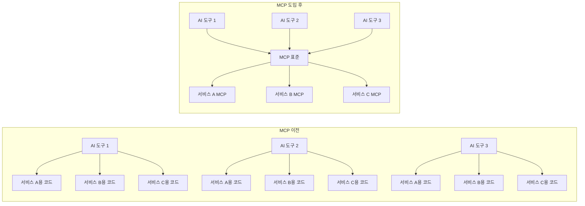

### MCP의 3가지 핵심 구성요소

MCP를 이해하려면 등장 인물 세 명을 알아야 합니다.

1. **호스트 (Host)**: 여러분이 쓰는 앱입니다. 클로드 코드, 커서, 클로드 데스크탑, 코덱스, Cline 같은 클라이언트 앱입니다.
2. **MCP 서버**: 외부 서비스를 감싸는 래퍼입니다. 깃허브 MCP 서버는 깃허브 API를 MCP 형식으로 제공합니다.
3. **연결 (Connection)**: 호스트에 "이 MCP 서버를 써라"라고 JSON 설정 파일에 적어주면 끝입니다.

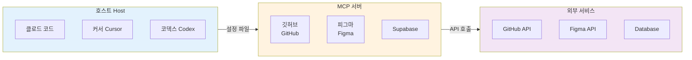

### MCP가 AI에게 제공하는 것

MCP 서버가 AI에게 제공하는 것은 크게 두 가지입니다.

- **툴즈 (Tools)**: AI가 실행하는 액션입니다. 쿼리 실행, PR 만들기 등
- **리소스 (Resources)**: AI가 읽는 데이터입니다. 파일 내용, DB 스키마, 문서 등

설치하면 AI가 알아서 판단해서 호출합니다. 여러분이 "MCP 써"라고 굳이 명령하지 않아도 됩니다.

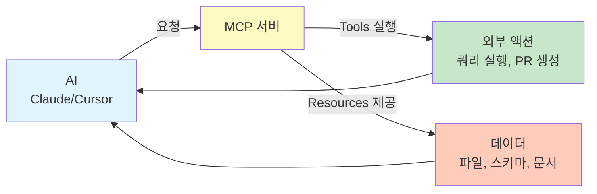

## 글로벌 필수 MCP (무조건 설치)

글로벌 필수 MCP는 어떤 프로젝트를 하든 항상 켜져 있어야 하는 MCP입니다. 두 가지만 기억하세요.

### 1. Context7 (★★★★★ 필수)

AI 코딩 도구의 가장 흔한 불만이 무엇일까요? "Next.js 15 문법을 물어봤는데 13 문법을 알려줘요." 새로 바뀐 API를 AI가 잘 모를 때가 있습니다. 당연합니다. LLM은 학습 데이터 시점까지만 알거든요.

**Context7**을 설치하면 AI가 Next.js 관련 질문을 받았을 때 학습 데이터가 아니라 **현재 공식 문서를 가져와서 답합니다**. 최신뿐만 아니라 여러분이 쓰는 정확한 버전의 문서를 검색합니다[[2]](https://youtu.be/jHejYZLz6_U?t=420).

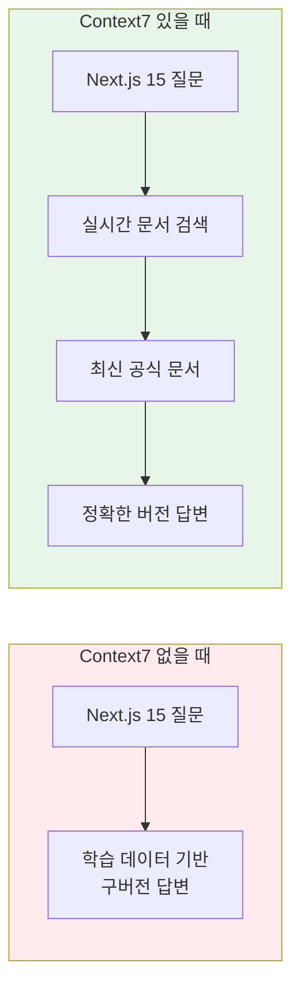

**장점**
- 항상 최신 문서를 참조
- 버전별 정확한 답변 가능
- 안 깔 이유가 없음

**단점**
- 문서가 잘 정리된 라이브러리에서만 잘 작동
- 마이너한 라이브러리나 문서가 부실한 프로젝트에서는 효과 제한적

**설치 방법**
```bash
# 글로벌 설치
npx -y @modelcontextprotocol/insights init

# 한 가지 주의점: 프롬프트에서 Context7을 언급 안 하면 안 볼 때가 가끔 있습니다
```

### 2. Playwright MCP (★★★★☆ 거의 필수)

한 줄로 설명하면 **AI가 코드를 만들고 직접 브라우저(크로미움)에서 확인합니다**. 마이크로소프트가 만든 공식 서버입니다.

AI가 프론트엔드 코드를 짰는데 실제로 돌아가는지 어떻게 알까요? 지금까지는 여러분이 브라우저를 열고 확인하고 스크린샷을 찍어서 보여줬습니다. Playwright MCP를 설치하면 AI가 직접 브라우저를 열고 페이지를 탐색하고 버튼을 클릭하고 결과를 확인합니다[[3]](https://youtu.be/jHejYZLz6_U?t=510).

**중요한 특징**
- 스크린샷 기반이 아니라 **접근성 트리(Accessibility Tree)** 기반
- 텍스트 기반으로 페이지 구조를 파악하므로 빠르고 정확함
- 토큰도 적게 씀
- localhost:3000을 열어서 로그인 테스트도 가능

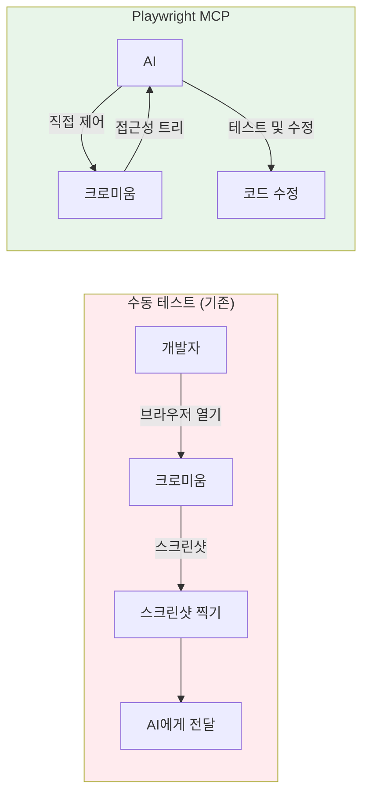

**장점**
- AI가 능동적으로 테스트를 돌림 (차원이 다름)
- 빠르고 정확한 접근성 트리 기반
- 클로드 코드의 필수

**단점**
- 로컬 개발 서버가 돌아가고 있어야 함
- 시각적 디자인 확인보다는 기능 확인에 강함
- CSS가 깨졌는지는 사람이 직접 스크린샷이 더 나을 수 있음

**대안**
그냥 수동으로 스크린샷 기반 확인도 여전히 괜찮습니다. 클로드 코드는 스크린샷을 직접 받을 수 있으니까요. 하지만 Playwright가 있으면 AI가 능동적으로 테스트를 돌린다는 점이 차원이 다릅니다.

**참고** - Anti-gravity처럼 자체 내장 브라우저가 있는 AI는 필요 없습니다.

## 프로젝트별 선택적 MCP (상황에 따라 선택)

여기부터는 모든 프로젝트에 꼭 필요한 것은 아닙니다. 상황에 따라 골라 쓰세요.

### 3. GitHub MCP (★★★☆☆)

AI가 깃허브에서 **코드 검색, PR 확인, 이슈 관리**를 직접 합니다. 깃허브 공식 서버입니다.

"이 함수가 어디서 호출되는지 찾아줘" 하면 모노레포 전체를 검색하고 PR을 보여주고 이슈를 만들 수도 있습니다[[4]](https://youtu.be/jHejYZLz6_U?t=600). 팀 프로젝트를 하시거나 오픈소스 기여를 하시거나 PR 리뷰가 빈번한 분들에게 유용합니다.

**하지만 솔직히 말씀드리면 깃허브 CLI(GH 명령어)로 거의 다 됩니다.** `gh pr list`, `gh issue create` 같은 명령어를 클로드 코드가 터미널에서 직접 실행할 수 있습니다[[5]](https://youtu.be/jHejYZLz6_U?t=630).

**MCP가 있으면**: AI가 알아서 깃허브를 참조
**MCP가 없으면**: "GH 써서 PR 목록 보여줘" 한 마디 더 하면 됨

이건 편의성의 문제입니다. 클로드 코드 사용자라면 GH CLI만으로도 충분합니다. 개인 프로젝트에서는 굳이라는 느낌이 있습니다. 팀 프로젝트에서 `mcp.json`에 넣어두면 팀원 전체가 같은 환경을 쓸 수 있다는 점은 큰 장점입니다.

### 4. Figma MCP (★★★★☆ 디자이너와 협업 시)

AI가 피그마 **디자인 데이터를 직접 읽어서 코드로 변환**합니다. 피그마 공식 Dev Mode MCP 서버입니다.

이건 스크린샷을 붙여넣는 것과 차원이 다릅니다. **레이어 구조, 오토레이아웃, 텍스트 스타일, 디자인 토큰을 구조화된 데이터로 받으므로** AI가 훨씬 정확한 코드를 생성합니다[[6]](https://youtu.be/jHejYZLz6_U?t=690).

디자이너와 협업하는 프론트엔드 프로젝트, 디자인 시스템이 있는 팀이라면 정말 좋습니다.

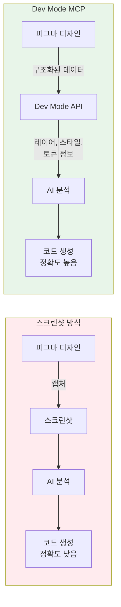

**단점**
- 피그마 Dev Mode가 유료 (프로페셔널 플랜 이상 필요)[[7]](https://youtu.be/jHejYZLz6_U?t=705)
- 디자인이 잘 정리되어 있어야 효과가 큼
- 레이어 이름이 "Frame 237" 이런 상태면 AI도 헷갈림
- 복잡한 인터랙션이나 애니메이션은 여전히 사람이 직접 구현하는 게 낫음

**대안**
스크린샷에 상세 프롬프트를 붙이는 것. 완벽하진 않지만 간단한 UI는 이걸로도 충분합니다.

### 5. Sequential Thinking MCP (★★☆☆☆)

이건 좀 독특한 MCP입니다. 다른 MCP들이 AI에게 **눈과 손**을 주는 거라면 이건 **뇌를 업그레이드**하는 것입니다.

외부 서비스에 연결하는 게 아니라 AI가 복잡한 문제를 단계별로 분해하고, 대안을 탐색하고, 계획을 수정할 수 있게 해 줍니다[[8]](https://youtu.be/jHejYZLz6_U?t=750).

"인증 시스템 마이그레이션 해줘" 같은 큰 작업을 분석 → 설계 → 구현 → 테스트로 나눠서 체계적으로 진행하게 합니다. 아키텍처 변경이나 큰 리팩토링, 기술 의사결정이 필요한 프로젝트에서 유용합니다.


**하지만 체감이 미묘할 수 있습니다.** 클로드 코드의 Extended Thinking이나 플랜 모드를 잘 쓰면 비슷한 효과를 낼 수 있습니다[[9]](https://youtu.be/jHejYZLz6_U?t=780).

모든 작업에 쓸 필요는 없고 정말 복잡한 의사결정이 필요할 때 켜는 용도입니다. 요즘은 **Opus 4.6이 너무 똑똑해져서 점점 필요성이 줄고 있다**는 것이 영상 제작자의 의견입니다.

**대안**
Plan Mode와 함께 사람이 개입할 수 있어서 좋은 경우가 많습니다. Sequential Thinking은 AI가 혼자 사고하는 것이고, Plan Mode는 사람과 AI가 함께 사고하는 것이니까요.

### 6. Supabase DB MCP (★★☆☆☆ 주의 필요)

편의상 Supabase MCP라고 했지만 **DB 입출력 관련 MCP 모두**를 의미합니다. AI가 DB 스키마를 보고 직접 쿼리를 실행합니다[[10]](https://youtu.be/jHejYZLz6_U?t=825).

여기부터는 **진지하게 주의**가 필요합니다. 편리한 건 맞습니다. "Users 테이블 구조 보고 API 만들어줘" 하면 AI가 스키마를 직접 읽고 정확한 코드를 짭니다. 복사 붙여넣을 필요가 없습니다.

**하지만 이게 독이 될 수 있습니다.**

AI가 SQL을 알아서 짜고 마이그레이션을 알아서 만들고 인덱스를 알아서 추가합니다. 여러분은 전혀 개입하지 않게 됩니다. **그러다 프로덕션에서 슬로우 쿼리가 터지면 N+1 문제가 생기면 여러분이 DB 구조를 모르니까 원인 파악에 시간이 몇 배로 걸립니다**[[11]](https://youtu.be/jHejYZLz6_U?t=840).

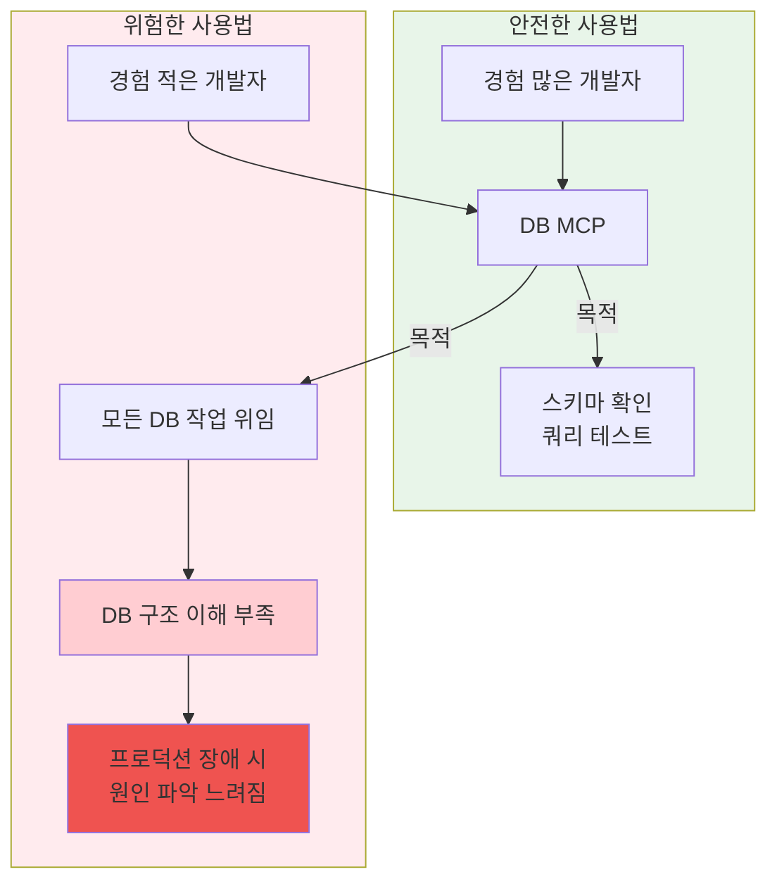

**권장 사용법**
- 경험 많은 개발자가 편의 독으로 사용
- 스키마 확인하고 쿼리 테스트하는 용도로만 사용
- DB를 잘 모르는 상태에서 AI에게 전부 맡기면 나중에 반드시 대가를 치름
- AI가 **동작하는 쿼리는 잘 만들지만 효율적인 쿼리는 보장 못 함**
- **프로덕션 DB에 연결하면 사고 가능성이 있으므로 반드시 읽기 전용 계정으로 사용**

**대안**
DB 스키마를 마크다운으로 뽑아서 프로젝트에 넣어두는 것입니다. 스키마 MD 파일 하나면 AI가 MCP 없이도 구조를 이해합니다. MCP보다는 느리지만 여러분이 스키마를 직접 관리하니까 이해도가 유지됩니다.

### 7. Vercel MCP (★★☆☆☆)

AI가 **배포 상태 확인, 환경 변수 설정, 프로젝트 관리**를 합니다.

"프로덕션 빌드 왜 실패했어?" 하면 AI가 빌드 로그를 직접 보고 원인을 분석합니다[[12]](https://youtu.be/jHejYZLz6_U?t=900). 편리합니다.

**하지만 솔직히 말씀드리면 Vercel CLI로 다 됩니다.** `vercel logs`, `vercel deploy` 같은 명령어를 클로드 코드가 터미널에서 직접 실행할 수 있습니다[[13]](https://youtu.be/jHejYZLz6_U?t=915).

**MCP를 쓰면**: AI가 자동으로 Vercel 상태를 참조
**CLI를 쓰면**: "Vercel 로그 확인해봐" 한 마디 해야 함

Vercel 프로젝트를 여러 개 관리하거나 환경 변수를 자주 바꾸는 팀이라면 의미가 있지만, 혼자 하는 사이드 프로젝트에서는 CLI면 충분합니다.

**주의사항**
배포 프로세스를 AI에게 맡기면 편하긴 하지만 **배포 파이프라인을 이해하는 감각이 무뎌질 수 있습니다**[[14]](https://youtu.be/jHejYZLz6_U?t=930). 특히 초보라면 CLI로 직접 해 보시거나 웹 대시보드를 통해서 배포 과정을 체득하는 게 먼저입니다.

Netlify도 마찬가지로 Netlify CLI가 있고, CLI를 AI에게 시키는 것만으로도 90%는 커버됩니다.

### 8. Sentry MCP (★★☆☆☆)

AI가 **실시간 에러를 직접 보고 분석**합니다. 스택 트레이스를 복사 붙여넣기 안 해도 AI가 Sentry에서 직접 에러를 가져오고 최신 릴리스와 연관 분석까지 합니다[[15]](https://youtu.be/jHejYZLz6_U?t=960).

프로덕션 서비스를 운용하고 있고 Sentry를 이미 쓰고 있는 팀이라면 유용합니다.

**하지만 Sentry를 안 쓰면 당연히 소용 없고,** 에러를 AI에게 맡기면 **근본 원인보다 증상 처리에 치우칠 수 있습니다**. AI가 에러 하나하나는 잘 고치지만, "왜 이런 에러가 반복되는지" 패턴을 파악하는 건 아직은 사람이 낫습니다[[16]](https://youtu.be/jHejYZLz6_U?t=975).

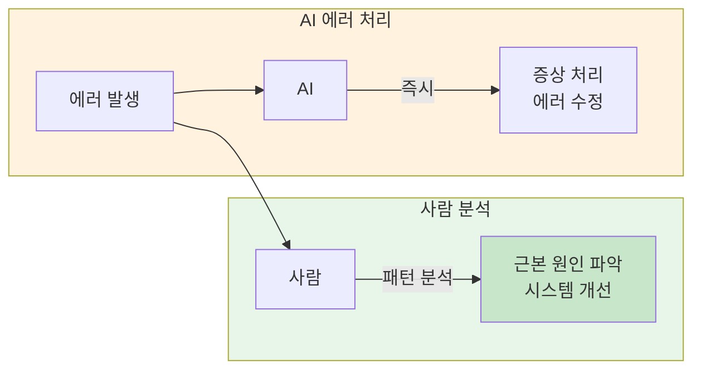

**대안**
Sentry 대시보드에서 에러 URL을 복사해서 Claude에게 넣어 주는 것입니다. MCP만큼 매끄럽진 않지만 동작은 합니다.

### 9. Serena MCP (★★★★☆ 대형 프로젝트용)

이건 비개발자분들보다는 **개발자에게 추천**할 수 있는 MCP입니다. 오픈소스 코딩 에이전트 툴킷인데, 한마디로 말하면 **AI에게 IDE의 눈을 달아 주는 것**입니다.

보통 AI가 코드를 볼 때 파일 전체를 통째로 읽습니다. 천 줄짜리 파일이면 천 줄 다 읽습니다. 그래서 토큰을 많이 쓰고 프로젝트가 커지면 컨텍스트 윈도우가 금방 찹니다.

하지만 여러분이 IDE에서 코딩할 때는 그렇게 하지 않습니다. Definition으로 함수 정의로 점프하고, Find References로 어디서 호출하는지 찾고, **심볼 단위로 탐색**합니다. Serena가 AI에게 바로 이걸 줍니다[[17]](https://youtu.be/jHejYZLz6_U?t=1020).

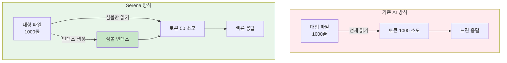

**핵심 구조**는 MCP와 **LSP(Language Server Protocol)**의 조합입니다.
- MCP가 AI와 Serena 사이의 통신 다리 역할
- LSP가 IDE 기능을 제공

덕분에 AI가 코드를 텍스트 덩어리가 아니라 **함수, 클래스, 변수 같은 심볼 단위로 의미적으로 이해**할 수 있게 됩니다.

**차이점은 무엇인가?**
- 일반적으로 AI는 응답하기 전에 관련 코드를 전부 읽습니다
- Serena는 먼저 인덱스를 만들어서 **필요한 코드만 효율적으로 읽습니다**
- 큰 프로젝트에서 **토큰을 절약하고 응답 속도와 코드 품질이 동시에 올라갑니다**[[18]](https://youtu.be/jHejYZLz6_U?t=1035)

특히 **클로드 코드 사용자에게 시너지가 큽니다.** 커서는 이미 자체 인덱싱 시스템이 있지만 클로드 코드는 그런 게 없어서, Serena를 붙이면 클로드 코드의 코드 이해 능력이 극적으로 달라집니다.

**단점**
- 설치가 다른 MCP에 비해 좀 복잡함 (파이썬 환경 필요, 언어별 언어 서버 필요)
- npx 한 줄로 끝나는 Context7과는 진입 장벽이 다름[[19]](https://youtu.be/jHejYZLz6_U?t=1065)
- 작은 프로젝트에서는 오버킬 (파일 10~20개짜리 프로젝트에 쓰면 오히려 세팅 시간이 더 걸림)
- 언어별 지원 수준이 다름 (Python, TypeScript는 안정적, 일부 언어는 커뮤니티 테스트 수준)

**대안**
`claude.md` 또는 `plan.md`에 프로젝트 구조와 주요 파일 위치를 정리해 두도록 시키는 것입니다. 프로젝트가 수만 줄 넘어가면 이것만으로는 한계가 오고, 그때 Serena를 고려해 보면 좋습니다.

## MCP 보안 주의사항

MCP는 편리한만큼 사고도 한 줄이면 납니다. 다음 주의사항을 꼭 기억하세요.

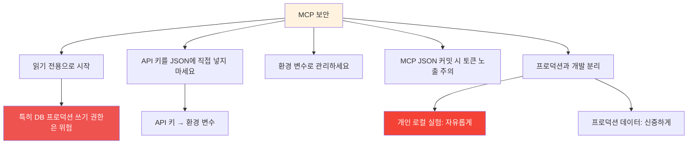

1. **읽기 전용으로 시작하세요**. 특히 DB 프로덕션 쓰기 권한은 위험합니다[[20]](https://youtu.be/jHejYZLz6_U?t=1110)
2. **API 키를 JSON에 직접 넣지 마세요**. 환경 변수로 관리해야 합니다[[21]](https://youtu.be/jHejYZLz6_U?t=1115)
3. **MCP JSON을 git 커밋할 때 토큰 노출 주의**하세요[[22]](https://youtu.be/jHejYZLz6_U?t=1120)
4. **프로덕션과 개발을 분리**하세요. 개인 로컬 실험은 자유롭게, 프로덕션 데이터는 신중하게

## MCP의 미래와 에이전트 시대

오늘 소개한 건 전부 **사람이 AI에게 도구를 달아주는 이야기**였습니다. 사람이 Context7을 설치해주고, Playwright를 깔아주고, 깃허브를 연결해 줍니다.

하지만 **MCP의 진짜 미래는 여기서 끝이 아닙니다.**

지금은 개발자가 AI에게 MCP를 연결해 주는 구조지만, **앞으로는 에이전트가 스스로 필요한 MCP 서비스를 찾아서 쓰는 세상**이 올 겁니다[[23]](https://youtu.be/jHejYZLz6_U?t=1170).

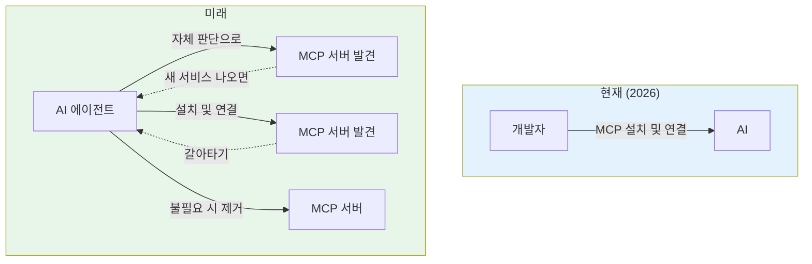

생각해 보세요. 지금 우리가 앱스토어에서 앱을 깔아 쓰듯이, AI 에이전트가 MCP 서버를 자기 판단으로 찾아서 연결하고, 필요 없으면 끊고, 새로운 서비스가 나오면 갈아타는 세상입니다.

그래서 오늘 MCP를 설치해 보시는 건 단순히 지금 편해지려는 게 아닙니다. **앞으로 올 에이전트 시대의 기본 문법을 익히는 것**입니다. MCP가 어떻게 동작하는지, 서버와 클라이언트가 어떻게 연결되는지 그 감각을 지금 잡아두면 나중에 큰 차이가 납니다.

## MCP 선택 가이드

어떤 MCP를 설치해야 할지 고민된다면 이 흐름도를 참고하세요.

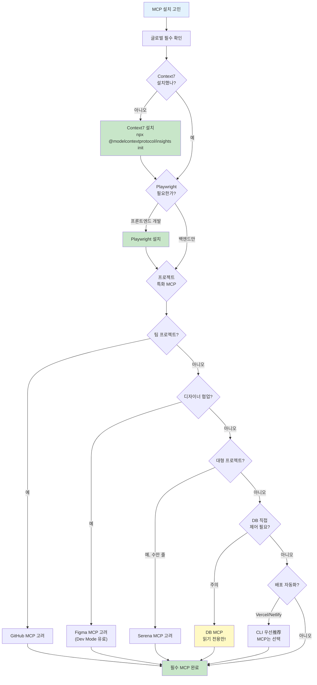

## 핵심 요약

| MCP | 별점 | 대상 | 핵심 기능 | 주의사항 |
|-----|------|------|-----------|----------|
| **Context7** | ★★★★★ | 모든 개발자 | 최신 문서 실시간 참조 | 문서가 잘 정리된 라이브러리에만 효과적 |
| **Playwright** | ★★★★☆ | 프론트엔드 개발자 | AI가 직접 브라우저 테스트 | 로컬 서버 필요, 시각적 확인은 한계 |
| **GitHub** | ★★★☆☆ | 팀 프로젝트 | 코드 검색, PR/이슈 관리 | GH CLI로 대부분 가능 |
| **Figma** | ★★★★☆ | 디자이너 협업 팀 | 디자인 데이터 구조화 | Dev Mode 유료, 디자인 정리 필요 |
| **Sequential Thinking** | ★★☆☆☆ | 복잡한 의사결정 시 | 단계별 문제 분해 | Opus 4.6으로 필요성 감소 |
| **DB MCP** | ★★☆☆☆ | 경험 개발자만 | 스키마 확인, 쿼리 실행 | **독이 될 수 있음**, 읽기 전용만 |
| **Vercel** | ★★☆☆☆ | Vercel 다중 프로젝트 | 배포 상태, 로그 확인 | CLI로 충분, 배포 감각 저하 우려 |
| **Sentry** | ★★☆☆☆ | Sentry 사용 팀 | 에러 직접 분석 | 증상 처리 위험, 패턴 파악은 사람 |
| **Serena** | ★★★★☆ | 대형 프로젝트 | IDE 수준 코드 이해 | 설치 복잡, 소 프로젝트엔 오버킬 |

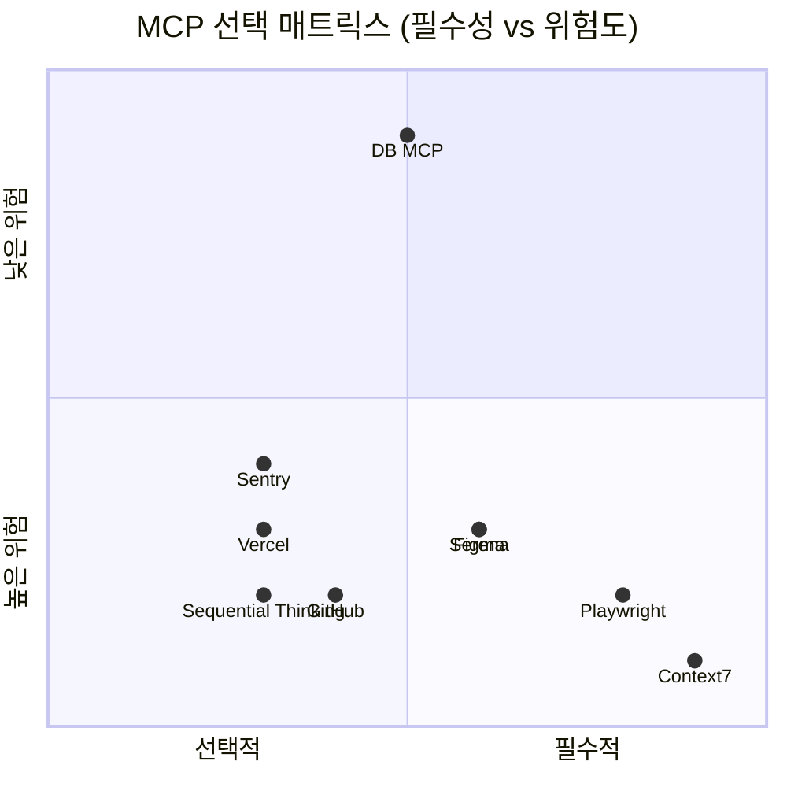

## 결론

지금 당장 **Context7 하나만 깔아 보세요**. 5분도 안 걸립니다. 그 차이를 느끼면 나머지는 자연스럽게 따라옵니다.

MCP는 절대 필수적인 요소는 아닙니다. 오늘 말씀드린 것처럼 **CLI로 되는 건 CLI로 하고**, AI에게 맡기면 나중에 기술 부채가 될 건 직접 하고, **진짜 AI에게 맡겨야 효율이 나는 것만 MCP로 연결**하세요.

바이브 코딩을 할 때 클로드에게 "코딩하지 마세요. 계획을 먼저 세우세요"라고 하는 게 첫 단계였다면, 오늘은 그다음 단계입니다. **계획을 세웠으면 AI에게 눈과 손을 달아 주세요. 단, 꼭 필요한 만큼만요.**

아무 MCP나 다 깔지 마세요. MCP는 도구이지 목적이 아닙니다. 여러분의 개발 워크플로우를 실제로 개선하는 MCP만 선택적으로 사용하세요.
