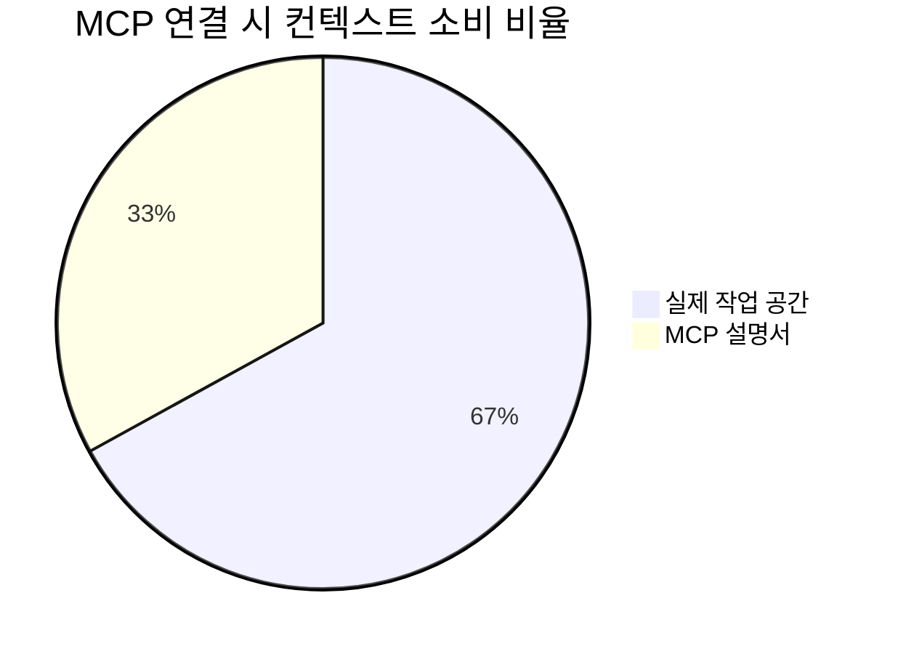
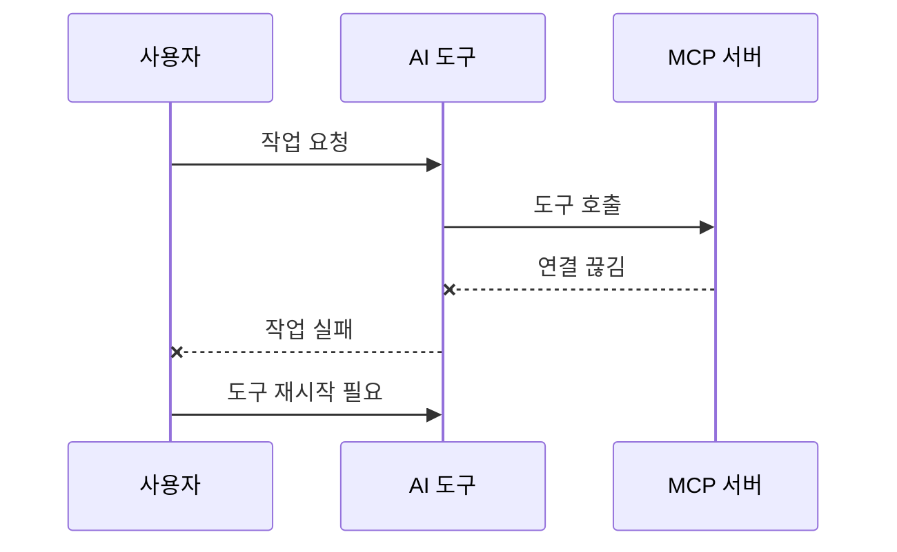
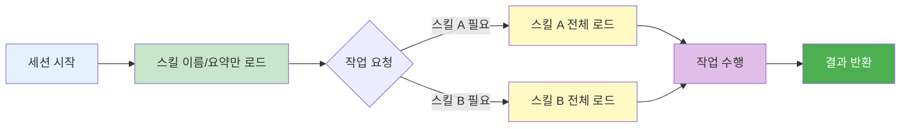
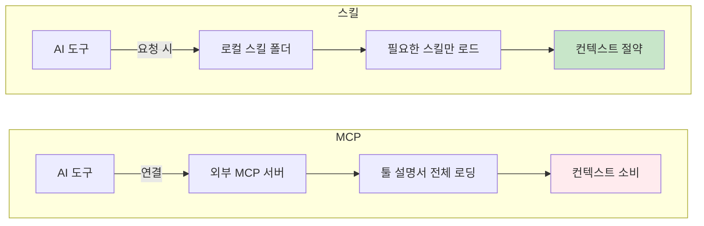
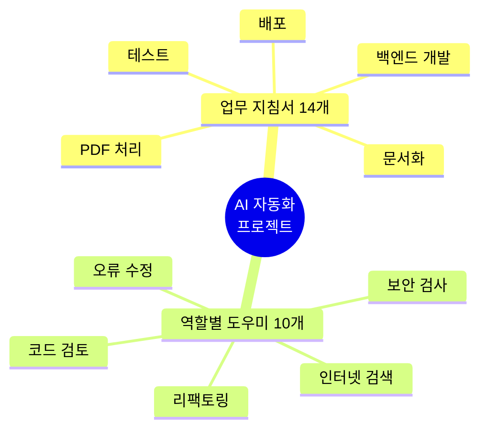
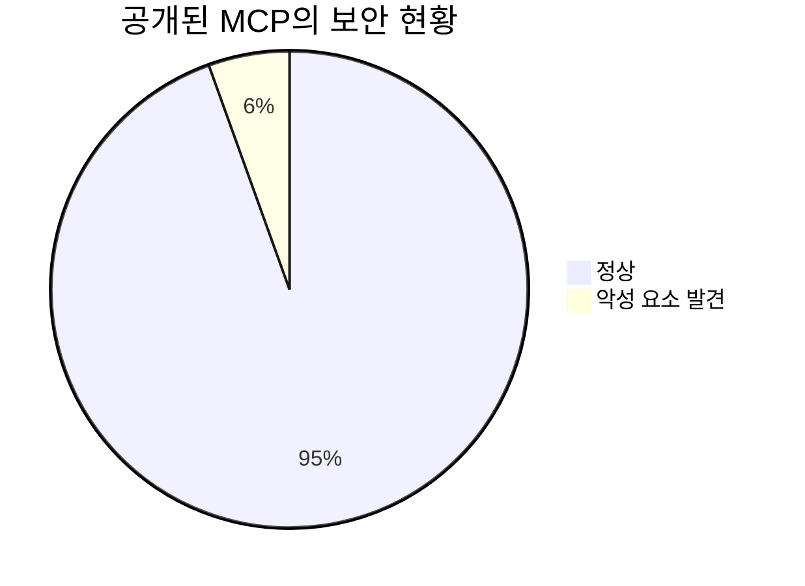

최근 AI 코딩 도구를 사용하는 개발자들 사이에서 MCP(Model Context Protocol)에 대한 회의론이 커지고 있다. 클로드 코드(Claude Code)나 코덱스 같은 AI 코딩 도구에 GitHub, Notion, Slack 등 외부 서비스를 연결할 수 있는 MCP 기술이 처음에는 매력적으로 보였지만, 실제 사용에서는 심각한 문제들이 드러났다.

<!--more-->

## Sources

- https://youtu.be/JZW2W5rwsD4

## MCP란 무엇인가

MCP는 AI 코딩 도구에 외부 앱을 연결해 주는 방식이다. GitHub MCP를 연결하면 AI가 코드 저장소를 직접 조회할 수 있고, Notion MCP는 문서를 읽어오며, Slack MCP는 메시지를 보낼 수 있다. 심지어 로컬 컴퓨터의 파일을 AI가 직접 열어보게 할 수도 있다.

처음에는 연결만 해 놓으면 AI가 알아서 모든 것을 처리해 주는 것처럼 보였지만, 바로 그 지점에서 문제가 시작되었다.

## MCP의 핵심 문제: 컨텍스트 예산 낭비

AI에게는 한 번에 볼 수 있는 정보의 양이 제한되어 있다. 이 공간이 충분해야 AI도 제대로 일할 수 있다. 쉽게 말해 AI의 단기 기억 용량인 셈이다.

MCP를 연결하면 대화가 시작되는 순간 **연결된 모든 MCP의 도구 설명서가 이 공간에 통째로 loaded된다**. 오늘 그 도구를 쓸지 안 쓸지와 상관없이 말이다. GitHub 관련 작업이 전혀 없어도 GitHub MCP가 연결되어 있으면 GitHub 설명서가 자동으로 로딩된다.

레스토랑에 비유하면 이렇다: 파스타 하나를 시키려고 들어갔는데 웨이터가 메뉴 200페이지를 처음부터 끝까지 전부 읽어준다. 그 낭비되는 시간이 MCP가 먹는 공간이다.

### 컨텍스트 소비 규모

더 심각한 건 MCP가 많을수록 이 낭비가 기하급수적으로 커진다는 점이다.

| MCP 구성 | 도구 수 | 컨텍스트 소비 | 남은 공간 |
|---------|--------|--------------|---------|
| 단일 MCP | ~50개 | 10-15% | 85-90% |
| 5개 MCP | ~250개 | 33%+ | 67% 미만 |

MCP 하나에 도구 50개가 들어있으면 그 MCP 하나가 AI 작업 공간의 10-15%를 차지한다. MCP 서버 다섯 개를 연결해 놓으면 시작 전부터 작업 공간의 1/3 가까이가 사라진다.

이것은 단순히 느려지는 문제가 아니다. AI가 한 번에 볼 수 있는 공간이 줄어들수록:
- 긴 대화를 기억하지 못한다
- 복잡한 작업을 중간에 놓친다
- 코드가 길어지면 앞부분을 잊어버린다

마치 사무실 책상 위에 아무도 안 읽는 서류 박스를 잔뜩 쌓아두고 그 위에서 노트북으로 일하는 것과 같다.

## MCP의 실제 운영 문제들

공간 낭비 문제는 시작일 뿐이다. 실제로 MCP를 써본 개발자들이 겪는 문제는 더 구체적이다.

### 1. MCP 잦다운 (Instability)

MCP는 AI 뒤에서 별도로 돌아가는 프로그램이다. 그런데 이게 생각보다 자꾸 꺼진다.

- 갑자기 연결이 끊김
- 처음부터 실행이 안 됨
- AI 도구 전체를 껐다 켜야 하는 경우 발생

비유하자면 회의하다가 통역사가 갑자기 자리를 비우는 것과 같다. 통역사 없이 진행하면 되는데, 이 시스템에서는 통역사가 없으면 아무것도 못 한다.

### 2. 반복 인증 문제

Notion, GitHub, Slack 같은 서비스를 연결하려면 인증이 필요하다. 그런데 MCP는 이 인증을 안정적으로 유지하는 것이 생각보다 어렵다. 좀 쓰다 보면 "다시 로그인해 주세요"가 자주 뜬다.

### 3. 권한 제어 부제

AI에게 파일을 읽기만 하게 하고 싶은데 MCP는 읽기/쓰기 권한을 세밀하게 나눌 수 있긴 하지만 보통은 둘 다 열어버리는 경우가 많다. 그냥 연결하면 AI가 모든 것에 접근할 수 있는 구조다. 보안적으로 찜찜한 부분이다.

### 4. 디버깅 어려움

뭔가 잘못됐을 때 원인을 찾기가 너무 어렵다. MCP에서 오류가 나면 JSON 형식의 로그를 직접 뒤져야 한다. 비개발자는 물론이고 개발자도 고통스러운 작업이다. 반면 일반 명령어는 화면에 에러가 그대로 뜬다.

## MCP의 마케팅 체크리스트화

최근에 이런 이야기도 나오고 있다: **"MCP를 지원한다는 게 이제 마케팅 체크리스트처럼 됐다."**

회사들이 실제로 MCP가 필요해서 만드는 게 아니라 "우리도 MCP 됩니다"라는 말을 홍보에 쓰기 위해 만든다는 것이다. 실속은 없는데 타이틀만 붙이는 것이다.

실제로 일부 AI 코딩 도구들은 MCP 지원을 조용히 줄이거나 다른 방식으로 전환하는 추세다. Claude를 만든 Anthropic도 이 문제들을 인지하고 있는 상황이다.

## 더 나은 대안: 스킬(Skills)

그럼 더 나은 방법은 무엇일까? 그것은 바로 **스킬(Skills)** 시스템이다.

도서관 사서로 비유하면 이해가 빠르다. 사서는 도서관에 있는 책 수만 권을 전부 외우고 있지 않다. 어느 서가에 어떤 분야 책이 있는지만 알고 있다. 누군가 "요리책 필요해요"라고 하면 그때 요리 서가로 가서 딱 그 책만 꺼내준다. 나머지 수만 권은 그냥 서가에 꽂혀 있다.

스킬이 정확히 이 방식이다.

### 스킬의 작동 방식

1. AI가 세션을 시작할 때 각 스킬의 **이름과 한 줄 요약만** 읽는다
2. 실제로 그 스킬이 필요한 작업이 들어왔을 때 **그때만** 해당 스킬의 내용 전체를 꺼내 읽는다
3. 그 외 스킬들은 서가에 꽂혀 있는 책처럼 공간을 거의 차지하지 않는다

결과적으로 AI의 작업 공간 대부분이 진짜 일을 위해 남아 있게 된다:
- 더 긴 대화를 기억한다
- 더 복잡한 코드를 다룬다
- 더 정확하게 일한다

MCP가 일단 다 꺼내놓고 시작하는 방식이라면, 스킬은 필요할 때만 꺼내는 방식이다.

### 스킬의 구조적 장점

| 특징 | MCP | 스킬 |
|-----|-----|-----|
| **연결 방식** | 외부 서버 연결 | 로컬 폴더 |
| **투명성** | 서버 동작 불투명 | 내용 직접 확인 가능 |
| **수정 용이성** | 서버 측 변경 필요 | 파일 직접 수정 |
| **디버깅** | JSON 로그 분석 | 일반 에러 메시지 |
| **컨텍스트** | 시작 시 전체 로드 | 필요 시만 로드 |

스킬은 구조 자체가 다르다:
- MCP는 외부 서버에 연결되어 그 서버가 뭘 하는지 사용자가 알기 어렵다
- 스킬은 그냥 폴더다. 외부 서버도 없고 연결도 없다
- 내 컴퓨터에 있는 폴더를 AI가 읽는 것이다
- 내용을 직접 확인할 수 있고 언제든 열어서 볼 수 있고 수정할 수 있다
- 뭔가 이상하면 그냥 파일을 지우면 된다

## 실전 검증 사례

이것은 이론이 아니라 실전에서 이미 증명되었다. GitHub에 MCP 없이 스킬만 써서 AI 자동화 시스템을 구축한 오픈소스 프로젝트가 있다.

- AI에게 줄 업무 지침서를 14개 제작
- 백엔드 만들 때는 이렇게, PDF 처리할 때는 이렇게, 테스트할 때는 이렇게
- 역할별 AI 도우미를 10개 제작
- 코드 검토 전문, 오류 수정 전문, 인터넷 검색 전문

이것이 다 MCP 없이 돌아간다. 무거운 도구를 잔뜩 연결하는 게 아니라 AI에게 일하는 방법을 잘 가르쳐 주는 것이다. 이것이 지금 AI를 잘 쓰는 팀들이 실제로 가는 방향이다.

## MCP가 빛나는 순간

그렇다고 MCP를 꼭 안 쓰는 것은 아니다. MCP가 진짜 빛나는 순간도 있다.

- AI가 실시간으로 데이터베이스에서 숫자를 가져와야 할 때
- 외부 API를 직접 호출해야 할 때
- 외부 시스템과 실시간으로 연결이 꼭 필요한 상황

하지만 대부분의 경우는 그렇지 않다. AI에게 "이 방식으로 이렇게 해라"고 알려주는 거라면 스킬로도 충분히 가능하다.

## 보안 우려

보안 문제도 있다. 공개된 MCP 중 5.5%에서 악성 요소가 발견되었다는 보고서도 있다. 사용자 모르게 정보를 빼가는 방식이 이미 실증되었다는 이야기도 있다.

## 핵심 요약

### MCP의 주요 문제점

1. **컨텍스트 예산 낭비**: 모든 MCP 도구 설명서가 대화 시작 시 로딩되어 작업 공간 소비
2. **안정성 문제**: MCP 서버가 잦다운하며 연결이 끊기면 AI 도구 전체 재시작 필요
3. **반복 인증**: Notion, GitHub, Slack 등 인증이 자주 만료되어 재로그인 필요
4. **권한 제어 부제**: 읽기/쓰기 권한 세분화 어려움
5. **디버깅 어려움**: JSON 로그를 직접 분석해야 하는 복잡한 오류 처리
6. **마케팅 체크리스트화**: 실제 필요성보다 홍보용 타이틀로 전락
7. **보안 우려**: 일부 공개 MCP에서 악성 요소 발견

### 스킬의 장점

1. **효율적 컨텍스트 관리**: 필요할 때만 해당 스킬 로드
2. **투명성**: 로컬 폴더로 내용 직접 확인 및 수정 가능
3. **안정성**: 외부 서버 의존 없이 안정적 동작
4. **디버깅 용이**: 일반 에러 메시지로 쉬운 문제 해결
5. **실전 검증**: 복잡한 자동화 시스템에서 이미 입증

## 결론

MCP를 잔뜩 연결해 놓으면 AI가 대화를 시작하기도 전에 작업 공간이 설명서로 꽉 찬다. 쓰지도 않을 도구 설명서를 매번 전부 읽는 구조이기 때문이다. Claude를 만든 회사도 이것을 버그가 아니라 정상 동작이라고 했다.

거기에 MCP는 안정성 문제, 반복 인증, 권한 제어 부제, 디버깅 어려움까지 줄줄이 따라온다. 그래서 개발자들 사이에서 "MCP는 죽었다"라는 말이 나오는 것이다.

스킬은 다르다. 필요할 때만 꺼내 본다. 도서관 사서처럼 요청이 왔을 때 그 책만 가져온다. 외부 서버 없이 내 폴더, 내 파일로 투명하게 운영이 가능하다. 실전에서도 이미 검증되었다. MCP 없이도 복잡한 자동화를 전부 돌릴 수 있다.

방향은 정해져 있다. 잔뜩 연결하는 게 아니라 잘 가르치는 스킬을 쓰는 것이 핵심이다.
