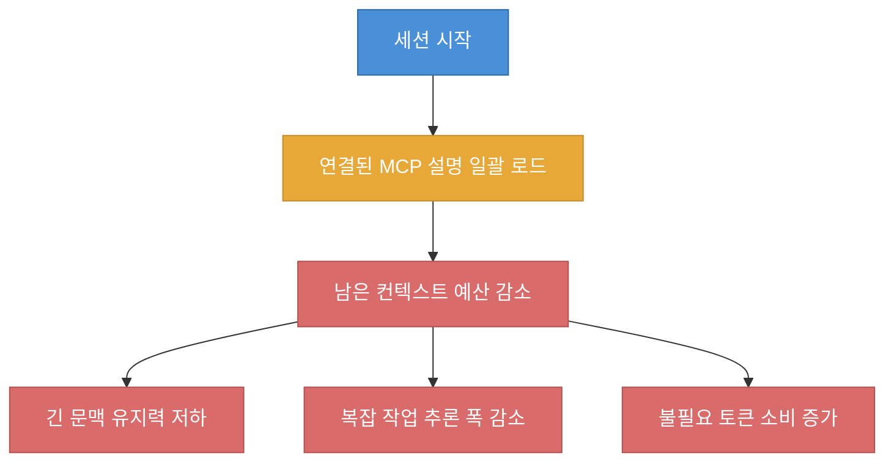
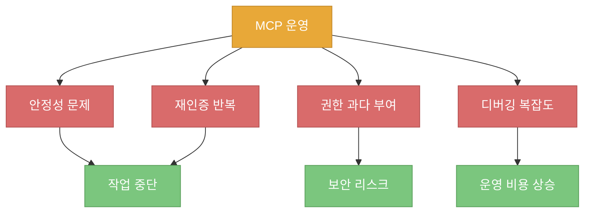
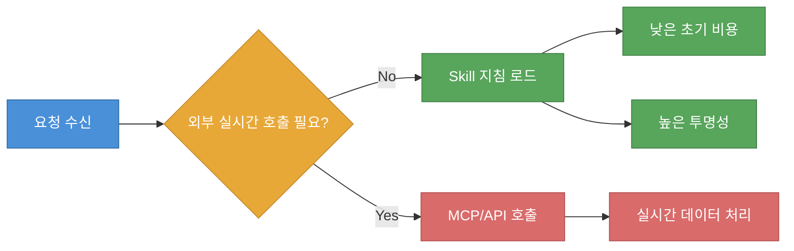

"MCP는 죽었다"라는 표현은 자극적이지만, 영상의 핵심은 기술 종말 선언이 아니라 **컨텍스트 예산 배분 문제**입니다. 연결 가능한 도구를 늘리는 것과 실제 작업 품질을 높이는 것은 같은 일이 아니며, 오히려 연결 전략이 잘못되면 시작 전부터 AI의 작업 공간이 줄어든다는 주장입니다 ([t=16](https://youtu.be/JZW2W5rwsD4?t=16), [t=56](https://youtu.be/JZW2W5rwsD4?t=56)).

<!--more-->

## Sources

- https://youtu.be/JZW2W5rwsD4?si=4i7CRI97YlXCRzie

## 1) 왜 "MCP is DEAD"라는 말이 나왔는가

영상 초반의 메시지는 명확합니다. MCP 자체가 "기능적으로 불가능"하다는 뜻이 아니라, 실무 체감에서 **비용 대비 효용이 나빠지는 지점**이 빠르게 온다는 문제 제기입니다. 발표자는 인사 한마디만 입력해도 작업 공간이 줄어드는 체감 예시를 던지며 논의를 시작합니다 ([t=0](https://youtu.be/JZW2W5rwsD4?t=0), [t=11](https://youtu.be/JZW2W5rwsD4?t=11)).

MCP의 본질적 장점도 함께 설명됩니다. GitHub/Notion/Slack/로컬 파일 같은 외부 시스템에 AI를 연결해 실제 작업 범위를 넓힐 수 있다는 점입니다. 즉, 문제는 "연결" 자체가 아니라 **연결 비용을 언제, 얼마나, 어떤 방식으로 지불하느냐**에 있습니다 ([t=30](https://youtu.be/JZW2W5rwsD4?t=30), [t=40](https://youtu.be/JZW2W5rwsD4?t=40)).

## 2) 핵심 쟁점: 컨텍스트 예산은 "시작 전에" 소모된다

발표자가 가장 강하게 말하는 대목은 "MCP 도구 설명이 세션 시작 시점에 먼저 적재된다"는 구조입니다. 오늘 그 도구를 실제 호출할지와 무관하게 설명서가 먼저 들어오면, 모델이 본업(추론/코드 생성/문맥 유지)에 써야 할 예산이 줄어든다는 논리입니다 ([t=65](https://youtu.be/JZW2W5rwsD4?t=65), [t=72](https://youtu.be/JZW2W5rwsD4?t=72)).

영상에는 MCP 하나당 10~15%, 5개면 시작 전 1/3 가까이 소모된다는 수치가 제시됩니다. 이 수치는 화자의 경험 기반 주장으로 해석하는 게 안전하지만, "사용하지 않을 도구 설명도 매 세션에 실리는 구조" 자체가 비효율을 만든다는 문제의식은 분명합니다 ([t=100](https://youtu.be/JZW2W5rwsD4?t=100), [t=108](https://youtu.be/JZW2W5rwsD4?t=108)).

## 3) 실무에서 반복되는 4가지 운영 리스크

영상 중반부는 "이론"보다 운영 문제를 나열합니다. 첫째는 MCP 프로세스 안정성으로, 연결이 죽으면 세션 흐름 전체가 끊긴다는 점입니다. 둘째는 재인증 반복으로, 업무 맥락보다 인증 복구에 시간을 쓰게 되는 상황입니다 ([t=136](https://youtu.be/JZW2W5rwsD4?t=136), [t=161](https://youtu.be/JZW2W5rwsD4?t=161)).

셋째는 세밀한 권한 제어의 어려움입니다. 읽기 전용처럼 최소 권한을 강제하지 못하고 넓은 권한으로 열리는 관성이 생기면, 보안/감사 관점에서 위험이 커집니다. 넷째는 장애 분석 난이도로, 로그 추적 비용이 일반 사용자와 개발자 모두에게 큰 부담이 된다는 주장입니다 ([t=173](https://youtu.be/JZW2W5rwsD4?t=173), [t=189](https://youtu.be/JZW2W5rwsD4?t=189)).

## 4) Skills가 대안이 되는 이유: "전부 로드"가 아니라 "필요 시 로드"

영상은 Skills를 도서관 사서 비유로 설명합니다. 모든 책을 머리에 넣고 시작하는 대신, 요청이 들어왔을 때 해당 서가의 책만 꺼내는 방식이라는 것입니다. 기술적으로는 초기 세션에 메타 정보만 얕게 두고, 실제 필요 시 지침 본문을 불러오는 접근으로 요약할 수 있습니다 ([t=227](https://youtu.be/JZW2W5rwsD4?t=227), [t=250](https://youtu.be/JZW2W5rwsD4?t=250)).

또한 Skills는 외부 서버 의존보다 로컬 파일 중심 운영이라는 점이 강조됩니다. 이 방식은 "무엇이 실행되는지 보인다"는 투명성, 수정/삭제의 단순성, 운영 소유권 확보 측면에서 유리합니다. 특히 업무 매뉴얼형 자동화에서는 연결형 도구보다 지침형 자산이 재사용성이 높다는 메시지로 이어집니다 ([t=272](https://youtu.be/JZW2W5rwsD4?t=272), [t=280](https://youtu.be/JZW2W5rwsD4?t=280)).

## 5) 그래도 MCP가 필요한 순간은 분명하다

영상도 MCP를 전면 부정하지는 않습니다. 실시간 데이터베이스 조회, 외부 API 호출처럼 "지금 이 순간의 외부 상태"를 가져와야 하는 작업에서는 MCP(혹은 동급의 연결 메커니즘)가 여전히 유효하다고 말합니다. 즉, 결론은 "MCP 폐기"가 아니라 **MCP의 사용 조건을 좁히는 전략**에 가깝습니다 ([t=331](https://youtu.be/JZW2W5rwsD4?t=331), [t=336](https://youtu.be/JZW2W5rwsD4?t=336)).

보안 이슈(공개 MCP의 악성 요소 비율 주장)는 영상에서도 강한 경고로 제시되지만, 수치 자체는 별도 2차 출처 검증이 필요합니다. 따라서 실무 문서에 인용할 때는 "화자 주장"으로 표기하고, 조직 정책에는 독립 검증 값을 쓰는 것이 안전합니다 ([t=368](https://youtu.be/JZW2W5rwsD4?t=368), [t=374](https://youtu.be/JZW2W5rwsD4?t=374)).

## 핵심 요약

- 영상의 핵심은 "MCP 사망 선언"이 아니라 **컨텍스트 예산을 누가 선점하느냐**의 문제입니다 ([t=56](https://youtu.be/JZW2W5rwsD4?t=56)).
- 연결된 MCP 설명이 세션 시작 시 선적재되면, 실제 작업 전에 메모리 예산이 줄어들 수 있다는 구조적 비판이 제시됩니다 ([t=65](https://youtu.be/JZW2W5rwsD4?t=65)).
- 실무 리스크는 안정성, 재인증, 권한 설계, 디버깅 비용으로 요약됩니다 ([t=136](https://youtu.be/JZW2W5rwsD4?t=136)).
- Skills는 필요 시 로드/로컬 투명성이라는 운영 장점을 가지며, 지침형 자동화에 특히 강합니다 ([t=250](https://youtu.be/JZW2W5rwsD4?t=250)).
- 실시간 외부 상태 접근이 필요한 작업에서는 MCP를 제한적으로 사용하는 하이브리드 전략이 합리적입니다 ([t=331](https://youtu.be/JZW2W5rwsD4?t=331)).

### 실전 적용 포인트

- 기본 모드는 `Skills 우선`, 예외 모드는 `MCP 제한 사용`으로 운영 정책을 이원화합니다.
- MCP를 붙일 때는 "실시간 조회가 정말 필요한가"를 먼저 확인하고, 아니면 지침형 실행으로 전환합니다.
- 권한은 읽기/쓰기 분리와 토큰 범위 최소화 원칙으로 시작하고, 필요 시에만 확장합니다.
- 장애 대응은 "재인증 루틴 + 로그 관측 포인트"를 사전에 문서화해 세션 중단 비용을 낮춥니다.

## 결론

이 영상은 "도구를 더 많이 붙이면 더 똑똑해진다"는 직관을 뒤집습니다. 실제로는 어떤 도구를 연결했는지보다, **언제 로드하고 얼마나 오래 컨텍스트를 점유하는지**가 성능과 품질을 좌우합니다. 실무에서는 Skills를 기본값으로 두고, 실시간 외부 연동이 꼭 필요한 구간에만 MCP를 투입하는 계층형 설계가 가장 현실적인 운영 전략입니다 ([t=346](https://youtu.be/JZW2W5rwsD4?t=346), [t=391](https://youtu.be/JZW2W5rwsD4?t=391)).
