AI 코딩 도구가 쏟아지는 시대, 바이브 코딩의 화려한 데모 뒤에는 "이 코드를 내가 정말 이해하고 있는가?"라는 불안이 있다. 15년 경력의 전 CTO인 Flowkater는 켄트 백(Kent Beck)의 증강형 코딩에서 영감을 받아, **tdd-go-loop** 이라는 워크플로우 오케스트레이터를 만들었다. 이 글은 그 실전 방법론의 전체 구조를 해부한다.

<!--more-->

## Sources

- [15년차 CTO가 바이브 코딩하는 방법 - Flowkater.io](https://flowkater.io/posts/2026-01-09-15-year-cto-vibe-coding/)
- [Augmented Coding: Beyond the Vibes - Kent Beck](https://tidyfirst.substack.com/p/augmented-coding-beyond-the-vibes)

## 저자 배경: 15년차 개발자, 전 CTO

Flowkater는 글 서두에 솔직하게 밝힌다.

> "먼저 어그로 끌어서 미안하다. 나는 15년차 CTO가 아니다. (15년째 개발을 하고 있는 건 맞음) 그 다음 현재 CTO도 아니다. (작년에 퇴사함.)"

15년간 개발을 해온 경력자이며, CTO를 역임한 후 퇴사하여 현재는 개인 프로젝트를 진행 중이다. 회사에서는 회의, 기획 조율, 팀원 코드 리뷰에 시간을 쏟느라 AI 워크플로우를 깊이 실험할 여유가 없었지만, 혼자 개발하면서 자유롭게 이것저것 시도할 수 있었다고 한다. OpenCode(+oh-my-opencode) 열풍을 경험했으나 ToS 이슈 등으로 현재는 Claude Code를 주력으로 사용하고 있다.

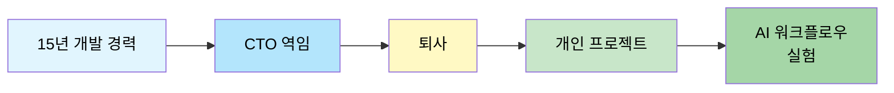

## 켄트 백의 증강형 코딩(Augmented Coding)

Flowkater의 워크플로우는 켄트 백의 **증강형 코딩** 개념에서 출발한다. 켄트 백은 자신의 서브스택 글 [Augmented Coding: Beyond the Vibes](https://tidyfirst.substack.com/p/augmented-coding-beyond-the-vibes)에서 바이브 코딩과 증강형 코딩의 차이를 명확히 구분했다.

> "In vibe coding you don't care about the code, just the behavior of the system. If there's an error, you feed it back into the genie in hopes of a good enough fix. In augmented coding you care about the code, its complexity, the tests, & their coverage."

바이브 코딩에서는 코드 자체를 신경 쓰지 않고 시스템의 동작만 본다. 에러가 나면 AI에게 다시 던져서 고쳐지길 바랄 뿐이다. 반면 **증강형 코딩에서는 코드, 코드의 복잡도, 테스트, 테스트 커버리지 모두를 신경 쓴다.** 가치 체계 자체가 전통적인 수작업 코딩과 동일하다 — 깔끔하고 동작하는 코드. 다만 그 코드를 직접 타이핑하지 않을 뿐이다.

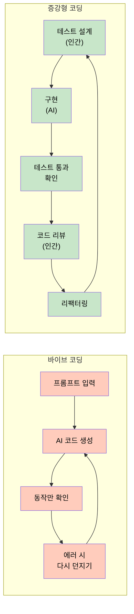

증강형 코딩에서 TDD의 역할은 핵심적이다. 전통적 TDD에서는 테스트도 구현도 인간이 했다. 증강형 코딩에서는 **테스트는 인간이 설계하고, 구현은 AI가 한다.** 테스트를 먼저 설계한다는 것은 "내가 뭘 원하는지"를 명확하게 정의한다는 의미이고, AI는 그 정의에 맞춰 코드를 생성한다. 테스트가 통과하면 구현이 맞는 거고, 실패하면 틀린 거다. 단순하지만 강력하다.

여기서 핵심은 **"작은 단위"** 다. AI에게 "회원가입 기능 만들어줘"가 아니라 "이메일 유효성 검증 로직의 실패 케이스 테스트 작성해줘"처럼 쪼개서 요청한다. 테스트 실패를 확인하고, 최소한의 코드로 통과시키고, 리뷰하는 사이클을 반복한다.

### 켄트 백의 BPlusTree3 프로젝트

켄트 백은 이 개념을 자신의 B+ Tree 라이브러리 구현(Rust & Python)에 직접 적용했다. 처음 두 번의 시도(BPlusTree1, 2)는 복잡도가 누적되면서 AI가 완전히 멈췄고, 세 번째 시도에서 더 적극적으로 설계에 개입하면서 성공했다.

AI가 잘못된 방향으로 가는 경고 신호로 세 가지를 꼽았다:

1. **루프** — AI가 같은 문제를 반복적으로 시도
2. **요청하지 않은 기능 구현** — 합리적인 다음 단계라 해도 요청하지 않았으면 위험 신호
3. **치팅** — 테스트를 비활성화하거나 삭제하는 행위

Rust의 소유권 모델이 복잡도를 가중시키자, Python으로 먼저 알고리즘을 구현한 뒤 Rust로 transliteration하는 전략을 사용했다. 결과적으로 Rust의 BTreeMap과 비교해 경쟁력 있는 성능을 달성했고, Python 버전은 C 확장까지 작성하여 Python 내장 자료구조에 근접하는 속도를 얻었다. 켄트 백 본인도 **"13 hours one day. This stuff is ADDICTIVE!"** 라고 표현할 정도로 몰입감이 있었다고 한다.

## 바이브 코딩의 불안감

Flowkater는 AI 코딩 도구의 생산성 향상 이면에 있는 불안감을 솔직하게 고백한다.

> "너무 코드 자체를 인지하지 못하고 진행하다 보니 내가 제대로 프로젝트를 매니징하는 느낌이 들지 않았다."

구체적으로 세 가지 문제를 지적한다:

1. **코드 인지 부족** — AI가 만든 코드가 돌아가긴 하는데, 진짜 이해하고 있는 건지 확신이 없다. "이 코드 어디서 뭘 하는 거지?"라는 질문에 스스로 답할 수 없을 때 오는 막막함.

2. **몰입(Flow) 부재** — AI가 코드를 생성하는 동안 뭘 해야 할지 모르겠는 애매한 시간. 다른 일을 하자니 곧 결과가 나올 것 같고, 기다리자니 시간이 아깝다. 그래서 Threads나 유튜브를 보게 되고, 결과가 나왔을 때 집중력은 이미 바닥이다. 심리학자 미하이 칙센트미하이가 말한 Flow 상태 — 적당히 어렵고, 적당히 쉽고, 피드백이 즉각적일 때 인간은 몰입한다. 바이브 코딩은 이 조건을 충족하지 못한다.

3. **디버깅 난이도 상승** — '내가 이 코드를 모른다'는 인식이 커지면서 오히려 생산성이 떨어졌다.

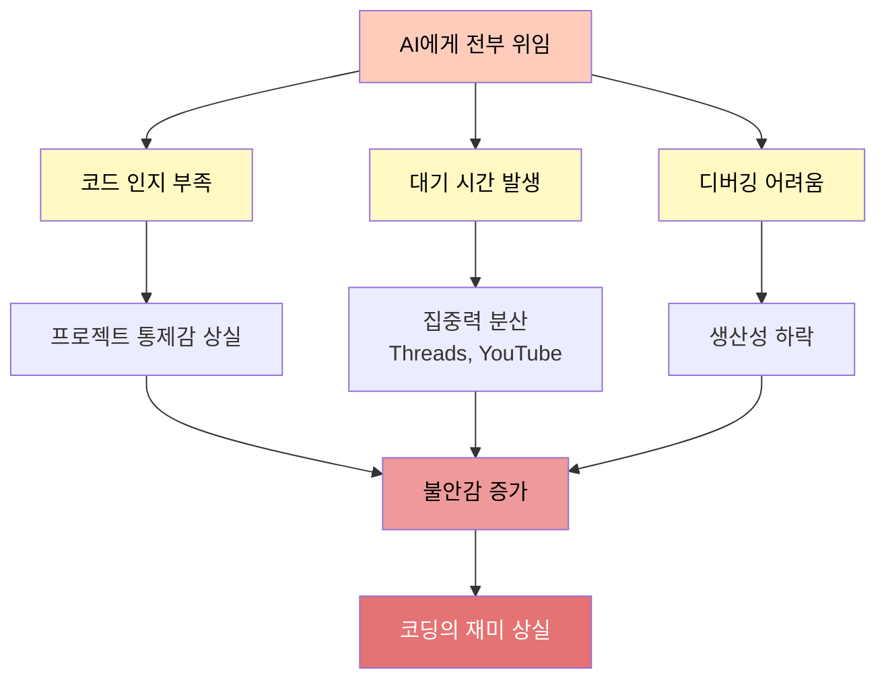

심리학적으로도 이건 설명이 된다. 인간은 자신이 통제하고 있다는 느낌이 없으면 불안해한다. 특히 본인의 전문 영역에서 그렇다. 자율주행 기술이 아무리 발전해도 운전대를 완전히 놓는 게 불안한 것처럼, AI 코딩도 마찬가지다.

## "딱히 바이브하지 않다" — 페어 프로그래밍 비유

Flowkater의 방식은 일종의 **페어 프로그래밍** 이다. AI가 드라이버(키보드를 잡는 사람)이고, 인간이 네비게이터(방향을 잡아주는 사람)다.

모든 체크리스트를 하나하나 실행하고, 코드를 확인하고, 아쉬운 점이나 개선할 점이 있으면 피드백한다. 문제가 없으면 다음 체크리스트로 넘어간다. 코딩을 직접 안 하는 건 맞지만 거의 다름없다.

실제로 이 방식에서 한 사이클은 **5분에서 10분** 정도 걸린다:

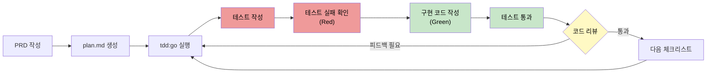

일반적인 페어 프로그래밍과 다른 점은, AI는 지치지 않고, 불평하지 않고, 피드백하면 바로 수정한다는 것이다. 반면 체크리스트 하나씩 클리어하는 TDD 방식은 정확히 몰입의 조건을 충족한다 — 작업이 너무 크지 않아서 부담이 없고, 테스트 결과가 바로 나오니까 피드백이 즉각적이다.

다만 큰 단점이 있다. **느리다.** 이 트레이드오프를 해결하기 위해 tdd-go-loop가 탄생했다.

## 명세만으로는 부족했다 — 아키텍처 판단은 인간의 영역

Flowkater는 처음에 명세만 잘 쓰면 AI가 알아서 코딩해줄 거라 생각했다. 디자인 패턴, DDD, 클린 아키텍처를 한번 잘 정리해두면 될 줄 알았다. 간단한 CRUD 앱은 그렇게 만들 수 있었지만, 현실은 달랐다.

> "아무리 좋은 명세서를 써도 실제 코드를 작성하면서 '이건 아닌데?' 싶은 순간들이 온다."

주니어들과 협업해본 경험이 있는 사람이라면 알 것이다. 간단한 요구사항이 아닌 이상, 함수를 어떻게 쪼개고, 어댑터와 프로토콜을 어느 레이어에 둘지, 객체와 서비스 범위를 어디까지 묶을지 — 아키텍처 판단이 계속 바뀌는 순간들이 있다. AI는 명세에 적힌 대로 열심히 코드를 작성하지만, 맥락을 완전히 이해하진 못한다.

- "이 함수는 나중에 확장될 가능성이 있으니까 미리 인터페이스로 빼놓자"
- "여기는 지금은 간단하지만 도메인 특성상 복잡해질 거니까 별도 서비스로 분리하자"

이런 판단은 아직 인간의 영역이다. 엔터프라이즈급 대규모 SaaS를 1년 반 동안 레거시에서 마이그레이션하고 운영하면서 느낀 것 — 코드에서 손을 떼는 순간 아무리 개념적으로 가이드를 만들어도 실제 코드는 항상 작성자의 판단이 필요하다.

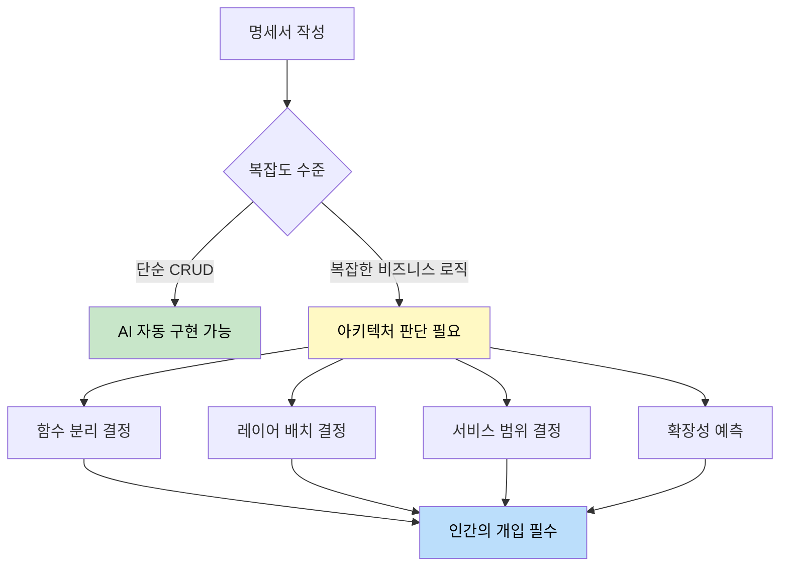

물론 바이브 코딩 시대에 모든 코드를 다 팔로업할 필요는 없다. 비전공자거나 코드 모르고 제품만 만들고 싶다면 코드를 안 봐도 된다. Flowkater는 "단일 컨트롤러에 raw SQL 남발하는 3000줄짜리 API 코드가 있는 회사가 이미 시리즈 B를 받았다. 고객 가치가 목적이지 코드는 수단이다"라고 현실을 인정한다. 다만 자신은 개발자이기 때문에 코드를 보는 것을 선택했을 뿐이다.

## tdd-go-loop 워크플로우 오케스트레이터

tdd-go-loop은 이 글의 **핵심 혁신** 이다. 단순히 `/tdd:go` 커맨드를 반복 실행하는 것이 아니라, spec-review, codex-review, sql-review, apply-feedback 같은 **여러 하위 에이전트들을 조율하면서 전체 TDD 사이클을 관리하는 워크플로우 오케스트레이터** 다.

Flowkater는 이를 오케스트라 지휘자에 비유한다. 각 악기(에이전트)가 언제 어떤 역할을 해야 하는지 정의해둔 것이다.

핵심 설계 원칙:
- 파악해야 하는 **핵심 엔진 코드나 로직** 이 들어가는 API 코드, 처음 프로젝트 구조를 잡아갈 때는 무조건 `/tdd:go` 방식으로 진행
- 이미 한번 `tdd:go` 로 개발한 **같은 패턴과 구조를 가진 API** 는 빠르게 진행
- 처음 보는 패턴이나 복잡한 비즈니스 로직 부분만 꼼꼼하게, 나머지는 신뢰

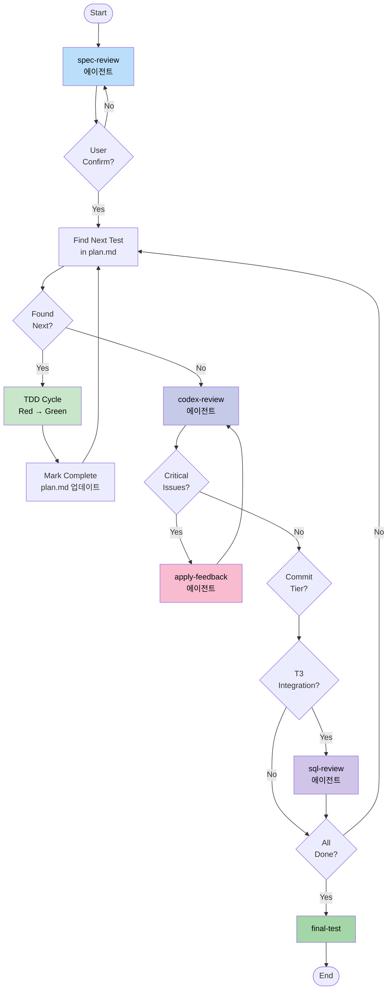

핵심 메커니즘:
- **Tier가 끝날 때마다** codex-review 에이전트가 자동으로 실행된다
- Codex가 Critical/Major 이슈를 찾으면 apply-feedback 에이전트가 자동으로 피드백을 적용
- Minor 이슈는 로깅만 한다
- **리뷰가 3회 이상 반복되면 강제로 다음으로 넘어간다** (무한 루프 방지)
- T3(Integration) 단계에서는 sql-review 에이전트가 추가로 N+1 쿼리나 인덱스 누락 같은 성능 이슈를 체크

## /tdd:go 커맨드

`/tdd:go` 는 plan.md에서 `[ ]`로 표시된 체크리스트를 하나 찾고, Red-Green TDD 사이클을 실행하는 커맨드다. 실제 커맨드 정의는 놀라울 정도로 단순하다:

1. **Identify** — plan.md에서 첫 번째 `[ ]` 테스트를 찾는다
2. **Announce** — 어떤 테스트를 구현할 것인지 알려준다
3. **Red Phase** — 실패하는 테스트를 작성하고, `go test -v ./...` 으로 실패를 확인
4. **Green Phase** — 테스트를 통과시키는 최소한의 코드를 작성하고, 전체 테스트 통과 확인
5. **Update** — plan.md에서 해당 테스트를 `[x]` 로 마킹
6. **Report** — 수행한 작업을 요약

Critical Rules:
- 현재 테스트를 통과시키기 위한 코드**만** 작성 (미래 테스트를 위한 구현 금지)
- 새 파일에 항상 `go fmt` 실행
- 예상치 못한 테스트 실패 시 즉시 중단 후 보고

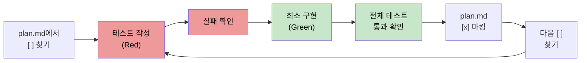

## plan.md 구조와 Tier 시스템

plan.md는 PRD를 기반으로 Phase와 체크리스트로 구성된다. 각 Phase에는 **Tier 마커** 가 붙는다. Tier별로 리뷰 강도가 다르며, 이것이 생산성과 품질 사이의 균형을 잡는 핵심이다.

| Tier | 의미 | 실행 방식 | 리뷰 강도 |
|:---:|:---|:---|:---:|
| T1 | Scaffold (구조 정의) | 자동 진행 | Light |
| T2 | Core (비즈니스 로직) | 세밀한 리뷰 | **Deep** |
| T3 | Integration (Repository) | 자동 진행 | Medium |
| T4 | Surface (Handler/E2E) | 자동 진행 | Light |

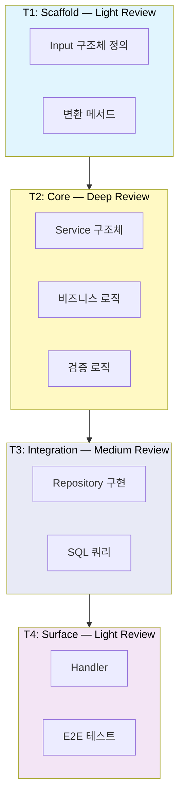

**T2(비즈니스 로직)에서만 Deep Review를 하고, 나머지는 자동으로 넘긴다.** 모든 코드를 같은 강도로 리뷰하는 건 비효율적이다. 핵심 로직에 집중하고, 나머지는 테스트가 통과하면 신뢰하는 것이다.

실제 plan.md 예시 (Plan 생성 API):

```
## Phase 1: Application Layer - Input 구조체 <!-- T1:auto -->

### [ ] 1.1 CreatePlanInput 정의
- CreatePlanInput 구조체가 모든 필수 필드를 포함한다
- ScheduleInput 구조체가 Type과 Days 필드를 포함한다

## Phase 5: UseCase Layer - Create Service <!-- T2:deep -->

### [ ] 5.1 Service 구조체
- createService 구조체가 Logger, TransactionManager, PlanWriter 의존성을 갖는다

### [ ] 5.2 Create - 검증 로직
- Create() 유효한 입력으로 Plan을 생성한다
- Create() 지원하지 않는 TemplateID에 ErrInvalidTemplate 반환한다
```

TDD 단위로 최대한 잘게 쪼개는 것이 핵심이며, Phase별로 작업 진행을 확인할 수 있게 하는 것이 목적이다.

## api-final-review: 4개 병렬 에이전트

API 개발이 완료되면 최종 리뷰 워크플로우가 실행된다. 이것도 4개의 전문 에이전트가 **병렬로** 리뷰를 수행한다. 하나씩 순차적으로 돌리면 10분 걸릴 일이 병렬로 돌리면 3분이면 끝난다.

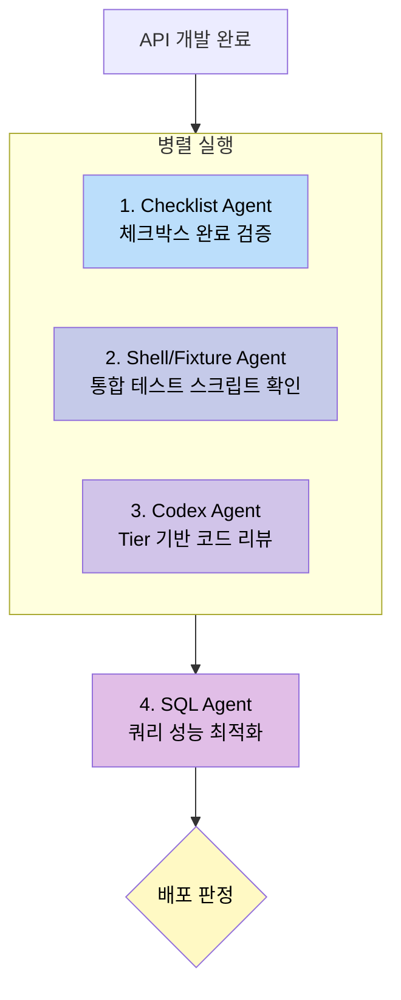

### 각 에이전트의 역할

**1. Checklist Agent** — plan.md의 체크박스 완료 상태를 검증한다. 완료율, 미완료 항목 목록, 판정 결과를 출력한다.

**2. Shell/Fixture Agent** — 통합 테스트 실행에 필요한 스크립트와 픽스처 파일을 확인한다. `tests/scripts/{feature}/test_{api_name}.sh`와 `tests/fixtures/{feature}/{api_name}/` 경로의 valid/invalid request JSON이 존재하는지 체크한다.

**3. Codex Agent** — Tier 기반 리뷰를 수행한다. T1(Domain Entity)이 가장 엄격하고, T2(Application Service)가 엄격하며, T3/T4는 표준 수준이다.

**4. SQL Agent** — 데이터베이스 쿼리 성능 및 최적화를 검토한다. N+1 쿼리, 누락 인덱스, 과다 조회(`SELECT *`), 트랜잭션 범위를 체크한다.

### 배포 판정 기준

| Critical | Major | Minor | 판정 |
|:---:|:---:|:---:|:---|
| 0 | 0 | 0-2 | ✅ 배포 가능 |
| 0 | 0 | 3+ | ⚠️ Minor 정리 권장 |
| 0 | 1+ | - | ❌ Major 수정 필요 |
| 1+ | - | - | ❌ Critical 수정 필수 |

## .claude/ 폴더 구조

Claude Code에서는 `.claude/` 폴더에 마크다운 파일로 커맨드와 스킬을 정의한다. Flowkater의 프로젝트 구조:

```
.claude/
├── commands/                      # 단일 실행 커맨드
│   ├── tdd/
│   │   ├── go.md                 # /tdd:go - 체크리스트 하나씩 실행
│   │   ├── batch.md              # /tdd:batch - Tier 단위 배치 실행
│   │   ├── fast.md               # /tdd:fast - 전체 자동화
│   │   └── status.md             # /tdd:status - 진행 상황 확인
│   ├── tdd-go-loop.md            # 워크플로우 오케스트레이터 (핵심!)
│   ├── spec-review.md            # 스펙 리뷰
│   ├── codex-review.md           # 코드 리뷰
│   ├── sql-review.md             # SQL 리뷰
│   └── final-test.md             # 최종 테스트
│
├── skills/                        # 복합 스킬 (에이전트 포함)
│   ├── go-gin-ddd-bun/           # Go 프로젝트 아키텍처 가이드
│   │   ├── SKILL.md
│   │   ├── ARCHITECTURE.md
│   │   └── TESTING.md
│   └── api-final-review/         # 최종 리뷰 스킬
│       ├── SKILL.md              # 6단계 리뷰 워크플로우 정의
│       ├── AGENTS.md             # 4개 병렬 에이전트 상세 구성
│       └── templates/
│           └── test_script_template.sh
│
├── templates/                     # 문서 템플릿
│   ├── plan-template-v2.md       # plan.md 템플릿
│   └── api-review-guide.md       # 코드 리뷰 가이드
│
└── agents/                        # 하위 에이전트 정의
    ├── codex-review.md           # Codex 리뷰 에이전트
    ├── sql-review.md             # SQL 리뷰 에이전트
    └── apply-feedback.md         # 피드백 적용 에이전트
```

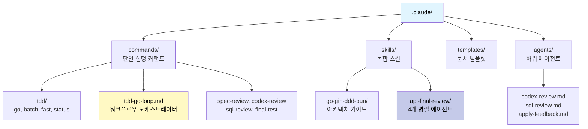

핵심은 두 가지다:
1. **tdd-go-loop.md** — 단순한 커맨드가 아니라 워크플로우 오케스트레이터. 여러 하위 에이전트들을 조율하면서 전체 TDD 사이클을 자동화한다.
2. **api-final-review/** — API 개발 완료 후 4개 전문 에이전트가 병렬로 최종 리뷰를 수행하는 스킬.

## 코드 리뷰 가이드

코드 리뷰 자체가 어려울 때를 위해, 어떤 순서로 어떻게 코드를 보면 좋을지 가이드라인을 만들어뒀다. T2(Core) 리뷰 체크리스트 예시:

| Check | Question |
|:---|:---|
| Pure Functions | Are helper functions pure (no side effects)? |
| Explicit Mutations | Are all mutations visible in main method? |
| Error Wrapping | Are errors wrapped with context? |
| No Business in Helpers | Is business logic in Execute, not helpers? |

GOOD 패턴과 BAD 패턴을 명시적으로 구분한다:

```go
// GOOD: Pure function (data in, data out)
func buildListOptions(input *ListPlansInput) plan.ListOptions {
    return plan.ListOptions{
        Limit:  input.Limit,
        Status: input.Status,
    }
}

// BAD: Impure (modifies input)
func buildListOptions(input *ListPlansInput, opts *plan.ListOptions) {
    opts.Limit = input.Limit  // mutates!
}
```

이런 가이드가 있으면 Claude가 리뷰할 때도 이 기준에 맞춰 체크하고, 개발자도 코드를 볼 때 어디를 집중해서 봐야 하는지 명확해진다. Flowkater는 Go에서 Usecase 레이어 구축 시 mock 테스트로 아웃라인을 잡고, mutation을 함수 최상단에 정의하며 private 함수를 최대한 순수 함수로 구성하도록 지시하는데, 이렇게 하면 **human readable code** 가 생성되어 코드 리뷰가 편해진다고 한다.

## 시작하는 방법

Flowkater는 Claude Code 설정이나 하위 에이전트 사용법에 대한 FOMO에 휘둘리지 말라고 조언한다.

> "Claude Code 지금 바로 설치하고 그냥 물어봐라. 어떤 걸 할 수 있는지. 그리고 내가 하고 싶은 일들을 물어가면서 스스로 시스템을 구축하길 바란다."

시작 4단계:

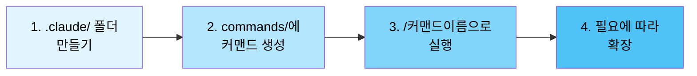

1. **`.claude/` 폴더 만들기** — 프로젝트 루트에 폴더 하나 만들면 된다
2. **`commands/` 폴더에 간단한 커맨드 만들기** — 마크다운 파일 하나가 커맨드 하나
3. **`/커맨드이름` 으로 실행해보기** — Claude Code에서 바로 실행된다
4. **필요에 따라 확장하기** — 에이전트, 스킬, 템플릿 등으로 점점 키워가면 된다

처음부터 완벽한 시스템을 만들려고 하지 말고, 작게 시작해서 필요할 때마다 붙여나가면 된다. Flowkater 본인의 Command, Agent 다수도 Claude Code에게 요청해서 만든 것이 대부분이라고 한다.

## 핵심 요약

- **증강형 코딩** 은 바이브 코딩과 달리 코드, 복잡도, 테스트, 커버리지 모두를 신경 쓰는 방식이다. AI가 코드를 작성하더라도 인간이 통제력을 유지한다.
- **tdd-go-loop** 은 단순한 커맨드가 아니라 여러 하위 에이전트(spec-review, codex-review, sql-review, apply-feedback)를 조율하는 **워크플로우 오케스트레이터** 다.
- **plan.md의 Tier 시스템** (T1~T4)으로 리뷰 강도를 차등 적용한다. T2(Core 비즈니스 로직)에서만 Deep Review를 하고 나머지는 테스트 통과 시 신뢰한다.
- **api-final-review** 에서 4개 전문 에이전트가 병렬로 최종 리뷰를 수행하며, Critical/Major/Minor 기준으로 배포 판정을 내린다.
- 켄트 백의 BPlusTree3 프로젝트는 증강형 코딩의 실전 사례로, AI가 잘못 가는 경고 신호(루프, 요청하지 않은 기능, 치팅)를 모니터링하며 설계에 적극 개입하는 것이 핵심이다.
- 바이브 코딩의 불안감(코드 인지 부족, 몰입 부재, 디버깅 난이도)을 해소하면서도 AI 시대의 생산성을 확보하는 중간 지점이 이 워크플로우의 목표다.

## 결론

CTO 시절에 익힌 감각이 AI 시대에도 그대로 적용된다. **위임하되 품질을 챙기고, 전체를 파악하되 세부는 신뢰하는 균형.** AI를 유능한 주니어 개발자처럼 대하면 된다 — 명확하게 지시하고, 결과물을 검토하고, 필요하면 피드백하고, 잘하면 다음 일을 맡긴다.

직접 코드를 치든, AI에게 맡기든, 결국 **무엇을 만들지 정의하고 품질을 책임지는 건 나** 다. 생산성만 쫓다가 코딩의 재미를 잃으면 그게 진짜 손해다. 내가 코드를 만드는 이 일이 여전히 재밌다면, 어떤 도구가 나와도 결국 적응하게 되어 있다.
