## 들어가며

바이브 코딩이라는 단어를 만든 Andrej Karpathy가 X에 트윗했다 — 이제 바이브 코딩과 구분되는 새로운 이름이 필요하다며, **에이전틱 엔지니어링(Agentic Engineering)**이라는 용어를 제안했다.
<!--more-->

Karpathy는 주말에 집 카메라용 대시보드를 만들고 싶었다고 한다. 에이전트에게 DGX Spark의 IP, 사용자명, 비밀번호, 그리고 목표를 줬다. SSH 키 설정부터 vLLM 구성, 모델 다운로드와 벤치마크, 비디오 추론 서버 구축, 웹 UI 대시보드, systemd 서비스 설정, 메모리 노트 기록과 마크다운 리포트 작성까지 — 전부를 한 번에 지시했다. 30분 후 전부 완성됐다.

> "I didn't touch anything myself. This was a weekend project just 3 months ago. Now it was 30 minutes of just forgetting about it."
>
> "불과 3개월 전만 해도 주말 전체가 필요한 프로젝트였지만, 이제는 30분 동안 잊고 기다리면 완료되는 작업이 됐다."

Karpathy는 이 새로운 방식에 이름을 붙였다. **에이전틱 엔지니어링(Agentic Engineering)**.

> "'Agentic' because 99% of the time you are no longer writing code directly, you are commanding and supervising agents. 'Engineering' because there is art, science, and skill to it."
>
> "'에이전틱'인 이유는 99%의 경우 더 이상 코드를 직접 작성하지 않고 에이전트에게 명령하고 감독하기 때문이다. '엔지니어링'인 이유는 여기에 기예, 과학, 전문 기술이 있기 때문이다."

프롬프트 몇 줄에 앱이 뚝딱 나오는 시대를 지나, 이제는 **에이전트가 잘 작동하는 조건을 설계하는 능력** 이 핵심이 됐다.

변화는 빠른데, 실제 적응은 느리다. 2026 Agentic Coding Trends Report에 따르면 개발자의 60%가 AI를 사용하지만 완전 위임은 0-20%에 불과하다 — 이른바 **위임 패러독스(Delegation Paradox)**. AI가 코드를 써주는 건 익숙해졌는데, 에이전트에게 일을 맡기고 손을 떼는 건 전혀 다른 차원의 이야기다.

IndyDevDan은 이 간극을 한 문장으로 요약했다.

> "Do you trust your agents?"
>
> "당신은 에이전트를 신뢰하는가?"

이 글은 Karpathy의 트윗에서 영감을 받아, 실제 시행착오와 Armin Ronacher, Boris Cherny, WenHao Yu, IndyDevDan 같은 실전 사례를 엮어 9가지 핵심 스킬로 정리한 것이다.

## 바이브 코딩의 창시자의 주말 프로젝트

Karpathy의 사례는 에이전틱 엔지니어링의 극단을 보여준다. 로컬 터미널에서 5개의 Claude Code를 병렬로 돌리고, claude.ai/code에서 추가로 5-10개를 동시에 실행한다. 총 10-15개의 병렬 세션.

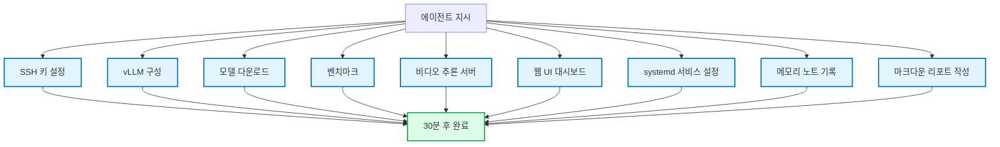

Karpathy는 이 변화를 단순한 발전이 아니라고 본다.

> "It is hard to put into words how much programming has changed in just the last ~2 months. This was not a 'business as usual' kind of incremental progress."
>
> "지난 약 2개월간 프로그래밍이 얼마나 변했는지 말로 전달하기가 어렵다. 이것은 '늘 있던 방식의 발전'처럼 점진적으로 변한 게 아니다."

## 9가지 핵심 스킬

에이전틱 엔지니어링 시대에도 훌륭한 엔지니어가 되기 위해 필요한 스킬은 다음과 같다.

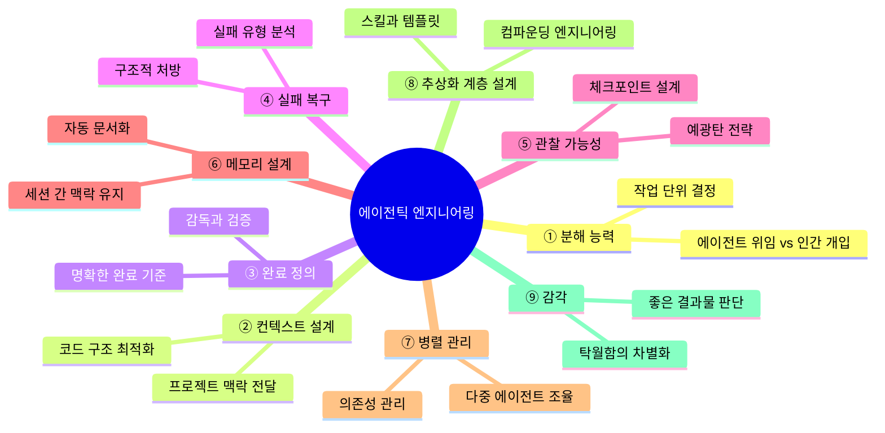

흥미롭게도 이 9가지 스킬은 에이전틱 엔지니어링, 나아가 바이브 코딩 시대 이전에도 일을 잘하는 엔지니어, 그리고 나아가서 일을 잘하는 매니저에게 요구되는 자질들이었다.

## ① 분해 능력 (Decomposition)

에이전트에게 "회원가입 기능 만들어줘"라고 하면 뭔가 나오긴 나온다. 문제는 그게 내가 원하던 게 아닐 확률이 높다는 거다. 이메일 인증은 빠져 있고, 비밀번호 규칙은 내 기준과 다르고, UI는 상상도 못한 방향으로 가 있다.

에이전트에게 일을 시키는 건 결국 "**무엇을 만들지**"를 정하는 일이다. 고객이 뭘 원하는지, 유저가 뭘 필요로 하는지, 우선순위가 뭔지 — 이건 내가 정확히 해야 한다. 에이전트가 대신해줄 수 없는 영역이다.

> "The key is to develop the intuition to decompose tasks appropriately, delegating to agents where they work well and providing human help where needed."
>
> "핵심은 작업을 적절히 분해하여 잘 작동하는 부분은 에이전트에 위임하고 나머지 부분에서 인간이 도움을 주는 직관을 기르는 것이다."

이게 말은 쉬운데, 실제로 해보면 까다롭다. Karpathy가 분해의 조건도 꽤 명확하게 짚어줬다.

> "It works especially well in some scenarios, especially where the task is well-specified and the functionality can be verified/tested."
>
> "일부 시나리오에서 특히 잘 작동하며, 특히 작업 명세가 명확하고 기능을 검증·테스트할 수 있는 경우에 효과적이다."

뒤집어 말하면, 명세가 모호하고 검증 기준이 없는 작업에서는 에이전트도 헤맨다. 내가 할 일은 모호한 요구사항을 명확한 작업 단위로 바꿔주는 것이다.

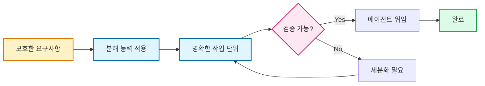

### Before: 인터뷰 없이 던진 결과

계획 생성 화면(AddPlanView)을 만들어야 했다. 5단계 입력 플로우 — 이름 입력, 분량 설정, 기간 선택, 요일 지정, 요약 확인. 피그마 디자인이 있었고, 기획안(PRD)도 작성해서 제공했다.

에이전트가 첫 버전을 내놨는데, 얼핏 보면 구조는 맞았다. 그런데 디테일에서 계속 어긋났다. 디자인 시스템에 정의되지 않은 컬러와 폰트를 마음대로 가져다 쓰고 있었다. Step2 분량 설정의 CustomNumberPad 레이아웃이 피그마와 다르다. 수정했더니 Step3 기간 선택 캘린더가 깨졌다.

문제의 원인은 명확했다. 내가 뭘 원하는지 나 자신도 정확히 정리하지 않은 상태에서 시작한 거다. PRD가 있었지만, "CustomNumberPad의 키 간격과 반응 영역", "Step 전환 애니메이션의 방향과 타이밍", "유효성 검사 실패 시 에러 표시 방식" 같은 디테일은 내 머릿속에만 있었다.

### After: 소크라틱 대화로 요구사항 구체화

그 다음부터는 기능을 구현하기 전에 AI와 인터뷰를 하기 시작했다. "5단계 입력 플로우를 만들려는데요." → AI: "각 단계의 입력 필드와 유효성 검사는?" → "Step1은 이름 입력, 빈 문자열 불가, 최대 50자." → AI: "디자인 시스템 컬러를 쓰나요? 커스텀 컬러는?" → "디자인 시스템 컬러만. 강조색은 #FF6B35."

5분이다. 이 대화에 걸린 시간이. 그런데 이 5분 동안 나온 엣지 케이스가, 지난번에 반나절 핑퐁 치면서 하나씩 발견한 것들과 거의 동일했다. 차이라면, 지난번에는 "코드를 짠 다음에" 발견했고, 이번에는 "코드를 짜기 전에" 정리됐다는 거다.

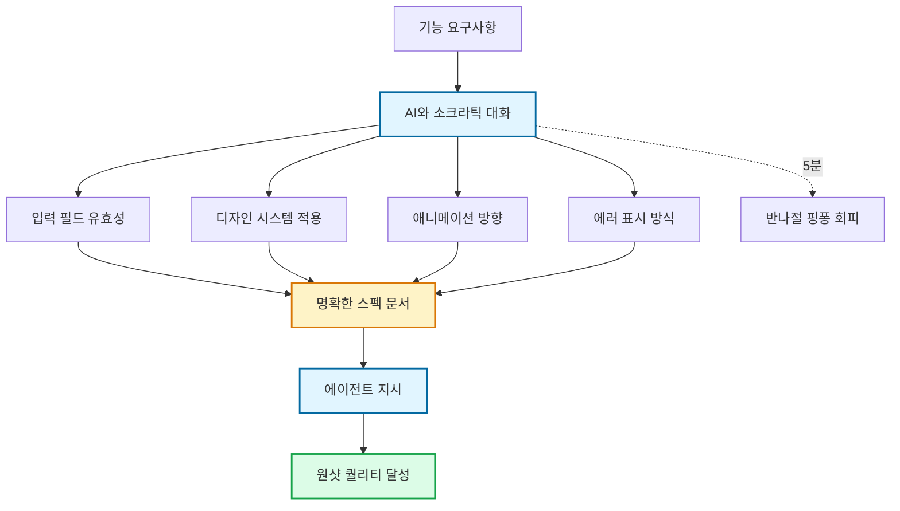

이렇게 정리된 요구사항을 에이전트에게 던지니 원샷 퀄리티가 확실히 달랐다. Step별로 분리해서 지시하고, 각 Step의 스펙을 명확히 적어주니 수정 턴이 2-3회로 줄었다.

### 이렇게 연습한다

구현 전에 요구사항 문서를 먼저 작성하는 습관이 첫걸음이다. 거창할 필요 없다. "이 기능은 무엇을 하고, 완성 기준이 뭔지"를 텍스트로 적어보는 것만으로도 빈틈이 보인다.

AI와 인터뷰하는 방식도 일상에 녹여넣을 만하다. 처음에는 좀 어색하다. AI한테 질문을 받는다는 게. 그런데 몇 번 해보면 내가 놓치던 엣지 케이스를 AI가 먼저 짚어주는 경험을 하게 된다.

시작부터 코딩 에이전트 대화 셸에 문장부터 던지고 보는 건 절대 좋은 습관이 아니다. 이건 작업 계획 없이 코딩부터 시작하는 일 못하는 개발자들의 습관과 동일하다.

## ② 컨텍스트 설계 (Context Architecture)

Karpathy의 DGX Spark 예시를 다시 보자. 그가 에이전트에게 준 건 딱 네 가지였다 — IP, 사용자명, 비밀번호, 목표. 군더더기 없이 필요한 것만. 이게 컨텍스트 설계의 이상향이다.

그런데 실제 프로덕션 환경에서는 이렇게 단순하지 않다. 프로젝트에는 수십 개의 파일이 있고, 비즈니스 로직이 있고, 코딩 컨벤션이 있고, 과거에 내린 아키텍처 결정이 있다. 이 모든 맥락을 에이전트에게 어떻게 전달하느냐가 결과의 품질을 결정한다.

Karpathy의 말을 빌리자면, 이제 코드 대신 자연어가 인터페이스다.

### 코드 아키텍처가 곧 컨텍스트

AGENTS.md를 잘 쓰는 것도 중요하지만, 그게 전부는 아니다. **코드 아키텍처 자체가 잘 설계되어 있으면 에이전트가 컨텍스트를 파악하는 속도가 완전히 다르다.**

역설적이지만 결국 코드를 잘 짜야 한다. 디렉토리 구조가 명확하고, 네이밍이 일관되고, 관심사가 분리되어 있으면 에이전트가 빠르게 이해한다. 반대로 스파게티 코드에 문서만 아무리 잘 써놔도, 에이전트는 빙빙 돌 확률이 커진다. 코드를 읽지 않는 시대라고 해서 코드의 품질이 덜 중요해진 게 아니다. 오히려 더 중요해졌다.

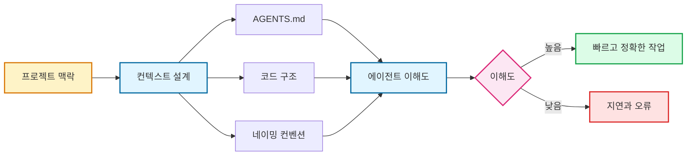

### 에이전트 친화적 코드베이스라는 발상

Flask의 창시자 Armin Ronacher가 흥미로운 관점을 제시했다. 에이전트와의 협업에서 **프로그래밍 언어 선택** 자체가 컨텍스트 설계의 일부라고 말한다. 그의 결론은 예상 밖이었다 — **Go가 에이전트 친화적 언어** 라는 거다.

> "Go is sloppy: Rob Pike famously described Go as suitable for developers who aren't equipped to handle a complex language. Substitute 'developers' with 'agents.'"
>
> "Go는 느슨하다. Rob Pike가 Go를 '복잡한 언어를 다룰 줄 비준비된 개발자에게 적합하다'고 했는데, '개발자'를 '에이전트'로 바꿔도 성립한다."

Go는 정적 타이핑 언어이지만 유연하고 문법이 쉽다. Java에 비해 단순하고 Python에 비해 엄격하다. 그리고 무엇보다 명시적이다. 에이전트가 실수할 여지를 줄이는 구조가 중요하다.

### Before: 플랫 디렉토리에서 에이전트가 헤매다

iOS 앱 초기에는 디렉토리 구조가 사실상 플랫이었다. Views 폴더 안에 화면 30개가 뒤섞여 있고, 모델과 뷰모델이 같은 레벨에 나열되어 있었다. 네이밍 컨벤션도 파일마다 달랐다.

사람이 봐도 "이 파일이 어디에 속하는 건지" 파악하는 데 시간이 걸리는 구조였다. 매번 에이전트에게 "이 폴더 말고 저 폴더야"라고 설명하는 데 지쳤다.

### After: Feature 단위 디렉토리 + 역할별 분리

디렉토리를 Feature 단위로 재구성했다. `Features/Plan/`, `Features/Daily/`, `Features/Settings/` — 각 Feature 폴더 안에 View, ViewModel, Model이 함께 들어간다.

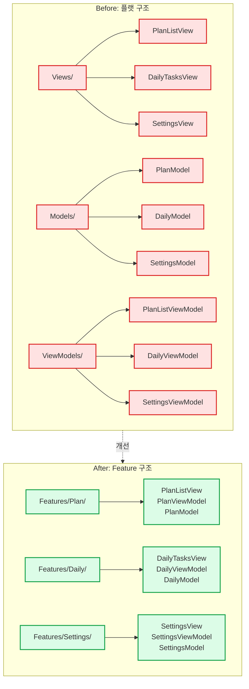

네이밍도 통일했다. `{Feature}{Role}` 패턴 — `PlanListView`, `PlanListViewModel`, `PlanModel`. 파일 이름만 보면 이 파일이 뭐하는 건지, 어디에 속하는 건지 바로 알 수 있다.

변화는 즉각적이었다. "Settings 화면에 다크모드 토글 추가해줘"라고 하면 에이전트가 `Features/Settings/` 안에서만 작업한다. 다른 Feature를 건드릴 이유 자체가 없어진 거다. **코드 구조가 곧 컨텍스트의 경계가 된다.**

### 이렇게 연습한다

클린 아키텍처를 의식적으로 연습하는 게 출발점이다. 새 프로젝트를 시작할 때 가장 먼저 디렉토리 구조를 잡고, 각 디렉토리의 역할을 README에 적는다.

AGENTS.md에는 아키텍처 결정 이유(ADR), 코딩 컨벤션, 도메인 용어 사전 정도만 넣는다. 나머지는 코드 자체가 말하게 한다. 타입 정의가 정확하고, 함수 이름이 의미를 담고 있고, 테스트가 스펙 문서 역할을 하면 — 그게 최고의 AGENTS.md다.

## ③ 완료 정의 (Definition of Done)

에이전트한테 밤새 작업을 돌려놓고 아침에 확인하는 건 꽤 짜릿한 경험이다. 그런데 그 짜릿함이 허무함으로 바뀌는 순간이 있다. "작업 완료됐습니다"라고 리포트가 와 있는데, 막상 보면 문서만 업데이트됐거나, 기본 스텁과 인터페이스 구성만 해놓고 끝난 경우.

Karpathy가 에이전트의 한계를 언급하면서 아직 필요한 것들을 나열했는데, 그중 하나가 **감독(supervision)**이다.

> "Of course this is not yet perfect. Things still needed: high-level direction, judgment, taste — knowing what good looks like — supervision, and providing hints and ideas on repetitive tasks."
>
> "물론 아직 완벽하지는 않다. 여전히 필요한 것들: 고수준 방향 설정, 판단력, 감각 — 무엇이 좋은지 아는 안목 — 감독, 그리고 반복 작업에서 힌트와 아이디어 제공."

에이전트에겐 결국 감독이 필요하다. 그리고 감독의 시작이 바로 완료 정의다. "이 작업이 끝났다"는 게 무슨 뜻인지를 명확하게 정의하지 않으면, 에이전트는 자기 나름의 기준으로 "끝났다"고 보고한다.

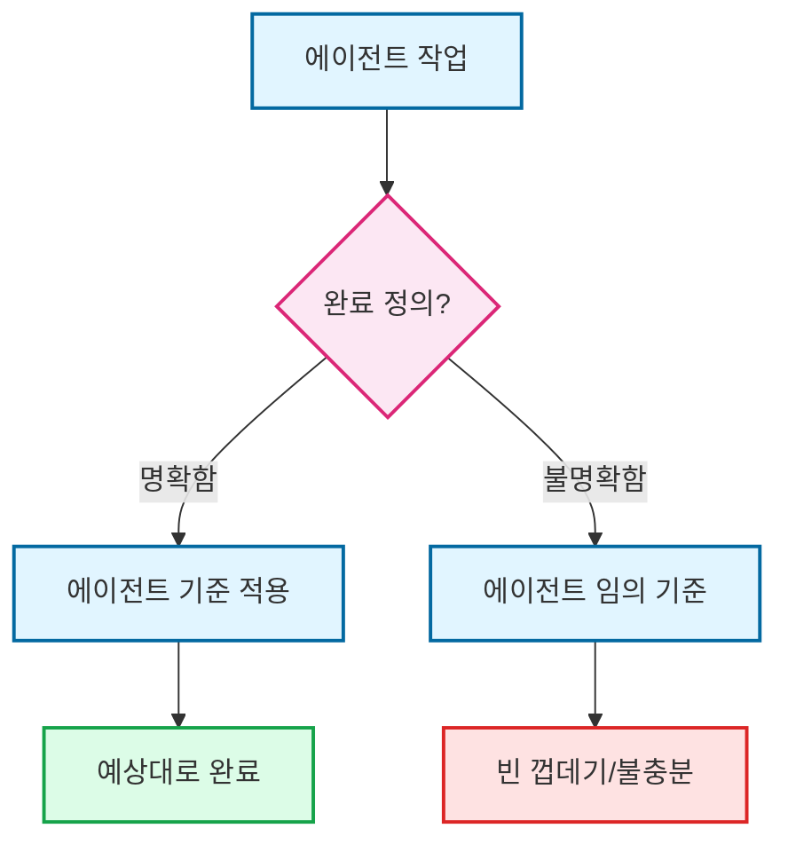

### Before: 개발 자동화 CLI, 밤새 돌렸더니 빈 껍데기

Codex App Server 기반 워크플로우 자동화 CLI를 만들려고 했다. 전체 아키텍처, 모듈 구조, API 설계까지 다 담은 계획서를 준비했다. 병렬 에이전트 실행도 계획했다. "이 정도 문서면 에이전트가 알아서 하겠지." 안심하고 밤새 돌렸다.

아침에 확인했더니 **1시간 만에 종료**되어 있었다. 에이전트가 스스로 "더 이상 할 게 없다"고 판단하고 멈춘 거다. 파일 구조는 깔끔했다. 하지만 전부 스텁뿐이었다. `func Propose() error { return nil }`. 타입 정의와 모듈 구조만 완벽하게 세팅해놓고, 정작 비즈니스 로직은 빈 껍데기였다.

그때 깨달았다 — 에이전트의 "완료"는 내 "완료"와 다르다. 그리고 그 간극을 메우는 건 더 좋은 모델이 아니라, **더 명확한 완료 정의**다.

### After: DoD + 리포트 체계

이후로 CLI를 다시 시도할 때는 완전히 다른 접근을 했다. 작업 지시에 항상 두 가지를 포함시킨다. 하나는 **완료 기준 문서**다.

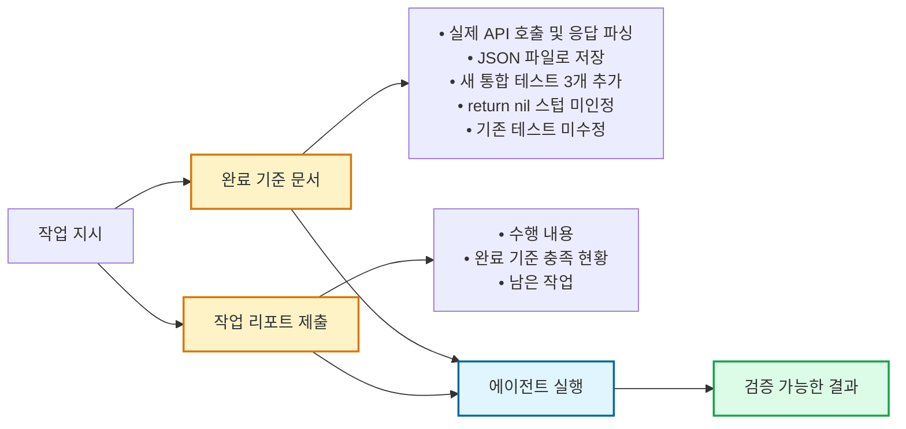

Elvis의 시스템에서 인상적인 건 완료 정의가 단계적으로 구성되어 있다는 점이다. 그의 에이전트 시스템에서 "완료"는 단순히 코드를 짠 게 아니다:

1. PR이 생성됐는가
2. main 브랜치와 동기화되었는가 (머지 충돌 없음)
3. CI가 통과했는가 (lint, 타입 체크, 유닛 테스트, E2E)
4. Codex 코드 리뷰를 통과했는가
5. Claude Code 코드 리뷰를 통과했는가
6. Gemini 코드 리뷰를 통과했는가
7. UI 변경이 있으면 스크린샷이 포함되었는가

이 모든 조건이 충족되어야 비로소 텔레그램 알림이 온다.

> "Most multi-agent workflow failures come down to missing structure, not model capability."
>
> "대부분의 멀티에이전트 워크플로우 실패는 모델 능력 부족이 아니라 구조 부재에서 온다."

CLI가 실패한 것도 모델이 멍청해서가 아니라, 내가 구조를 안 잡아줬기 때문이다.

### 이렇게 연습한다

모든 작업 지시에 DoD(Definition of Done) 체크리스트를 포함하는 것이 출발점이다. "테스트 통과 + 기존 테스트 미수정 + 리포트 제출" — 이 세 줄이 기본이고, 작업 성격에 따라 항목을 추가한다.

에이전트의 "완료" 보고를 그대로 믿지 않는 습관도 필요하다. 이게 의심이 아니라 건강한 검증이다. 특히 밤새 돌리는 작업에서는 더 그렇다.

DoD를 작은 단위로 쪼개는 연습도 중요하다. "로그인 기능 완료"의 DoD는 빈틈이 생기기 쉽다. "이메일 인증 플로우 완료", "비밀번호 재설정 완료" 같이 작게 나누면 각각의 완료 기준이 훨씬 명확해진다. 분해 능력(①)과 완료 정의(③)는 결국 한 쌍이다.

## ④ 실패 복구 (Failure Recovery Loop)

에이전트와 일하면 실패가 일상이다. 어제 잘 되던 워크플로우가 오늘은 안 된다. 새 모델이 나오면 기존 프롬프트가 다르게 동작한다.

> "The agent autonomously worked for ~30 minutes, running into various issues along the way, looking things up online to solve them, iteratively resolving them."
>
> "에이전트는 약 30분 동안 자율적으로 작업하면서, 도중에 여러 문제에 부딪히고, 온라인에서 해결책을 직접 조사하고, 하나씩 반복적으로 해결해나갔다."

에이전트 자체가 실패와 복구의 루프로 작동한다. 하지만 항상 이렇게 깔끔하게 되지는 않는다. 에이전트의 자체 복구 능력에도 한계가 있다.

### Before: 재분배 엔진, A↔B 무한루프

iOS 앱의 핵심 기능 중 하나가 학습 분량 재분배 엔진이다. 버그는 단순해 보였다. 재분배 API를 호출하면 미래 날짜의 기존 데이터가 사라지는 문제.

시나리오 테스트 5개가 **전부 PASS**였다. 들여다보니 테스트가 "데이터 > 0" 수준의 검증이었다. 진짜 문제는 그 다음이었다. 특정 파라미터의 의미가 함수마다 달랐다. `includeToday=true`가 A 함수에서는 "오늘 데이터를 가져온다"는 뜻이고, B 함수에서는 "오늘부터 삭제한다"는 뜻이었다.

**A를 고치면 B가 깨졌다. B를 고치면 A가 깨졌다.** 에이전트가 자기 루프에 빠져서 fix → break → fix → break를 반복했다.

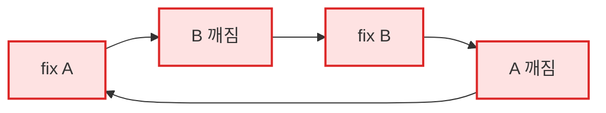

### After: 격리 테스트 + Must NOT Have 가드레일

결국 나는 코드를 좁혔다. 전체 API 흐름을 테스트하는 대신, 문제가 되는 함수만 **격리해서 단독 테스트** 했다. 통합 테스트에서는 안 보이던 게 격리하니 바로 보였다.

핵심은 **"Must NOT Have" 가드레일**이었다. "이 파일은 수정하지 마. API 응답 계약을 변경하지 마. 기존 통합 테스트를 수정하지 마." 이 세 가지 금지 조건이 에이전트의 A↔B 무한루프를 끊었다.

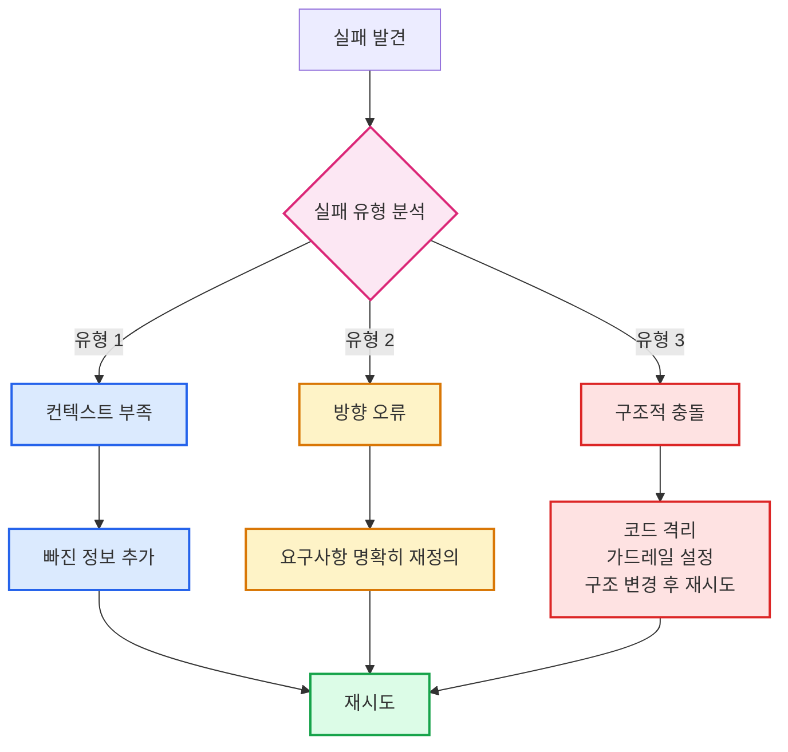

### 같은 프롬프트로 재시도하지 않기

대부분의 에이전트 루프는 실패하면 같은 프롬프트를 다시 돌린다. "한 번 더 해봐." 이게 작동할 때도 있다. 비결정적인 에러 — 네트워크 타임아웃이나 일시적 API 장애 — 라면 재시도가 맞다.

하지만 근본적으로 뭔가가 잘못됐을 때는 반복해도 결과가 같다. 에이전트가 잘못된 라이브러리를 쓰고 있거나, 요구사항을 잘못 이해했거나, 컨텍스트가 부족한 경우. 이럴 때 같은 프롬프트로 재시도하는 건 벽에 같은 방향으로 계속 머리를 박는 거다.

핵심은 **실패의 원인을 분석하고, 그에 맞는 처방을 내리는 것**이다. 같은 지시를 반복하는 게 아니라, 더 나은 지시를 새로 만드는 것. 이 차이가 엄청나다.

### 이렇게 연습한다

실패할 때마다 짧게라도 기록하는 습관이 시작이다. "컨텍스트 놓침", "요구사항 다르게 해석", "A↔B 무한루프 진입" — 이런 짧은 메모가 쌓이면 패턴이 보인다.

새로운 접근을 시도할 때는 "30분 룰"을 쓴다. 30분 안에 의미 있는 진전이 없으면 다른 방법을 찾는다. 실패 자체는 괜찮다. 같은 실패를 반복하는 건 괜찮지 않다.

## ⑤ 관찰 가능성 (Observability)

에이전트에게 큰 작업을 통째로 맡기면 편하긴 한데, 문제가 생겼을 때 어디서 잘못됐는지 파악하기가 어렵다. "어느 시점에 내가 결과를 확인할 것인가" — 이 질문이 관찰 가능성의 핵심이다.

Karpathy의 DGX Spark 예시에서 에이전트는 30분간 자율적으로 작업했다. 그 30분 동안 Karpathy가 뭘 했는지는 안 나오지만, 결과적으로 에이전트가 "메모리 노트 기록, 마크다운 리포트 작성"까지 해줬다는 건 작업 과정이 추적 가능한 형태로 남았다는 뜻이다.

모델과 에이전트가 더 강력해질수록, 관찰 가능성의 중요성도 커진다. 에이전트가 할 수 있는 일이 많아질수록 잘못될 수 있는 방향도 많아지기 때문이다.

### Before: liquidglass, "이상한데 그냥 두자"의 대가

iOS 26이 발표되고 liquidglass를 처음 적용해보려고 했다. 새로운 디자인 언어를 우리 앱에 시도해보고 싶었다. 에이전트에게 맡기면 알아서 업데이트될 거라 기대했다.

에이전트가 작업하는 걸 보고 있었다. 처음 몇 파일은 괜찮아 보였는데, 4-5번째 파일쯤부터 뭔가 이상했다. 건드리는 파일 범위가 예상보다 넓었다. 색깔이 원래 의도와 다르게 바뀌는 것 같았다. 하위호환성을 위한 분기가 점점 복잡해지고 있었다.

**"이상한데… 그냥 두자."** 이 한 마디가 가장 비싼 판단이었다.

결과물을 확인해보니 UI가 전부 깨져 있었다. liquidglass의 반투명 효과가 기존 컬러 스킴과 충돌하면서 텍스트 가독성이 떨어졌고, 다크모드에서는 아예 안 보이는 요소가 생겼다. 최악은 **단계별 커밋이 없었다는 거다.** 부분적으로 롤백할 수가 없었다. 전부 버리든 전부 살리든 양자택일.

4-5번째 파일에서 멈추고 확인했으면, 최악의 경우에도 5개 파일만 롤백하면 됐다. 끝까지 방치한 결과, 20개 넘는 파일이 엉킨 상태에서 수습해야 했다.

### After: 예광탄 전략 + 블루프린트

이 경험 이후로 새로운 기술을 적용할 때는 반드시 **예광탄(tracer bullet) 전략**을 쓴다. 전체를 한 번에 적용하는 대신, 가장 단순한 화면 하나에 먼저 적용해보는 거다. 작게 쏘고 빠르게 확인. 괜찮으면 다음 화면으로 넓힌다.

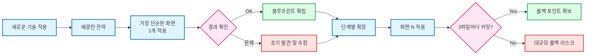

예광탄의 진짜 가치는 **블루프린트**를 만들어준다는 거다. liquidglass를 화면 A 하나에 적용해보니, '아 이 기술은 컬러 스킴이랑 충돌하는 지점이 여기구나, 다크모드 분기는 이렇게 해야 하는구나'가 보였다. 처음 적용하는 기술은 블루프린트를 미리 그릴 수가 없다. 예광탄이 그 블루프린트를 빠르게 그려준다.

단계별 커밋도 필수가 됐다. "화면 A 적용" → 커밋 → "화면 B 적용" → 커밋. 이렇게 하면 화면 C에서 문제가 생겨도 롤백 포인트가 확보되어 있다. "3개 파일 수정할 때마다 커밋해줘"라고 지시하면 된다.

관찰 가능성이 높아질수록 위임의 범위도 넓어진다. 처음에 나는 함수 하나를 맡기는 것도 불안해서 전부 검토했다. 하지만 예광탄 전략과 단계별 커밋이 자리 잡으면서, 이제는 모듈 단위의 작업도 안심하고 맡긴다.

### 이렇게 연습한다

작업 단위를 적절한 크기로 쪼개는 감각을 키우는 게 첫 번째다. PR 하나를 리뷰하는 데 10분 이내면 적절한 크기, 30분 이상이면 너무 크다. 파일 수로 따지면 3-5개가 한 번에 확인하기 좋은 범위다.

중간 체크포인트를 명시적으로 설계하는 것도 습관으로 만들어야 한다. "여기까지 되면 한 번 보여줘." 이 한 마디가 1시간짜리 이탈을 방지한다.

작업 시작 전에 머릿속으로 "대충 이렇게 가겠지" 하는 블루프린트를 그리는 습관. 이게 관찰 가능성의 전제 조건이다.

## ⑥ 메모리 설계 (Memory Architecture)

AI와 긴 작업을 하다 보면 반드시 부딪히는 벽이 있다. 세션이 길어지면 앞에서 한 이야기를 잊어버린다. 세션 컴팩션(context compaction)이라고 하는데, 맥락이 너무 많이 축소되어 연속 작업에서 특히 문제가 된다.

Karpathy의 에이전트 지시에는 마지막에 반드시 **"메모리 노트 기록, 마크다운 리포트 작성까지"**가 포함되어 있었다. 단순히 코드만 짜고 끝나는 게 아니라, 작업한 내용을 기록으로 남기라는 거다.

메모리가 없는 오케스트레이터는 매 세션이 첫 만남이다. 어제 뭘 했는지, 어떤 결정을 내렸는지, 어떤 실패를 겪었는지 — 다 잊어버리고 처음부터 시작한다.

### Before: 매일 아침 15분씩 맥락 설명

3일 연속 인증 리팩토링을 할 때 매일 아침 "어제 JWT 구조를 바꿨는데…"부터 시작하면서 지칠때가 많았다. 매일 새 세션을 열 때마다 어제 한 일을 처음부터 설명해야 했다. "어제 이 구조를 바꿨는데, 왜 바꿨는지부터 설명할게…" 15-20분이 날아간다. 3일 연속이면 거의 1시간이다.

### After: Hooks로 자동 메모리 — MEMORY.md 하나로 5초 복원

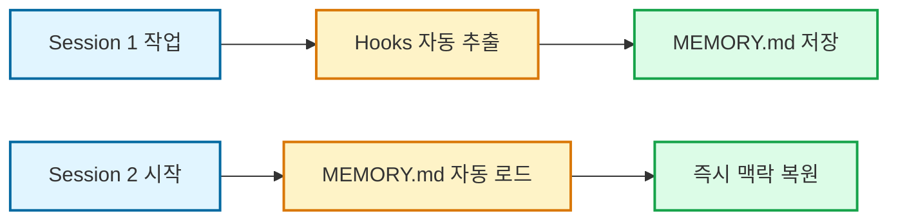

"기록하라고 지시할 필요가 없다"는 게 핵심이다. hooks가 세션 종료 시 자동으로 작업 내용을 요약해서 append한다. 다음 세션이 시작되면 자동으로 읽는다. 맥락 복원에 걸리는 시간: 5초. 15분에서 5초로.

나는 hooks까지는 아니지만, 이 패턴을 참고해서 Codex나 Claude Code로 작업할 때 한 턴마다 메모리/작업 업데이트 문서화를 무조건 한다. MEMORY.md에 "오늘 무엇을 했고, 어떤 결정을 내렸고, 다음에 이어서 할 것"을 기록한다.

### 이렇게 연습한다

매 작업 턴마다 문서화하는 습관이 메모리 설계의 전부라고 해도 과언이 아니다. MEMORY.md 하나 만들어서 매일 기록하는 것부터 시작하면 된다.

한 가지 팁: 메모리의 구조를 일관되게 유지하는 것도 중요하다. 나는 MEMORY.md를 날짜순으로 기록하되, 각 항목에 `[결정]`, `[작업]`, `[이슈]` 태그를 붙인다.

프로젝트가 길어지면 검색 가능한 시스템(Obsidian 등)을 도입하면 된다. 핵심은 "검색 가능한 기록"이다.

## ⑦ 병렬 관리 (Parallel Orchestration)

Karpathy가 말한 핵심 중 하나가 이거다.

> "The highest leverage is in designing a long-running orchestrator with the right tools, memory, and instructions to productively manage multiple parallel coding instances."
>
> "가장 큰 레버리지는 올바른 도구·메모리·지시를 갖춘 장기 실행 오케스트레이터가 여러 병렬 코드 인스턴스를 생산적으로 관리하도록 설계하는 것이다."

여러 워크트리에서 서로 다른 기능을 동시에 개발하는 건 기술적으로는 가능하다. 하지만 실제로 해보면 관리가 만만치 않다. 에이전트 A가 인증 모듈을, 에이전트 B가 결제 기능을 만들고 있는데 둘 다 같은 유저 모델을 건드리면 충돌이 난다.

### CTO 시절과 닮은 점

이 경험을 하면서 자꾸 CTO 시절이 떠올랐다. 스쿼드 6개를 매니징하던 시절. 하루에 6개 팀과 회의하면서 각 팀의 상태를 파악하고, 블로커를 해결해주고, 전체 방향이 어긋나지 않게 조율하는 일.

병렬 에이전트 관리가 그때와 놀라울 만큼 비슷하다. 매니저에게 필요한 건 "모든 팀의 코드를 직접 짜는 능력"이 아니라 "모든 팀의 상태를 파악하고, 블로커를 해결하고, 방향을 맞추는 능력"이다.

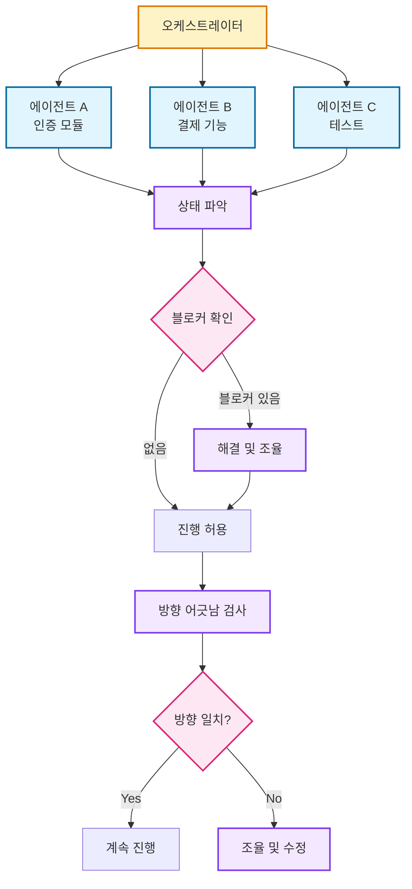

체크리스트와 싱크 포인트가 생명줄이다. 그리고 이건 새로운 스킬이 아니다. 좋은 매니저가 이미 가지고 있는 스킬이다. 에이전트 시대가 그 스킬에 새로운 이름을 붙였을 뿐이다.

### 이렇게 연습한다

작게 시작하자. 처음부터 에이전트 5개를 동시에 돌리면 혼돈에 빠진다. 에이전트 2개를 동시에 돌리는 것부터.

병렬 작업 간 의존성을 미리 파악하고 충돌 방지를 설계하는 것도 필수다. git worktree를 활용하면 물리적으로 분리된다. 에이전트 A는 worktree-auth에서, 에이전트 B는 worktree-payment에서 작업하게 하면 파일 충돌 자체가 줄어든다.

## ⑧ 추상화 계층 설계 (Abstraction Layering)

에이전틱 엔지니어링에도 레벨이 있다고 본다.

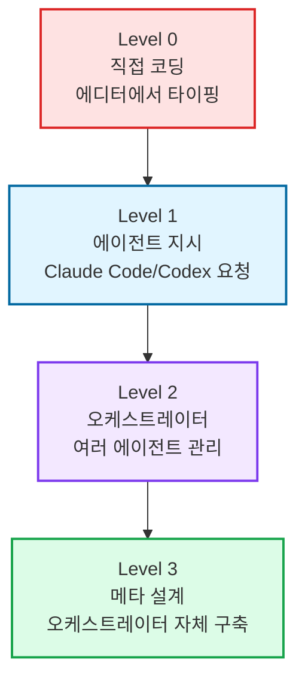

나는 현재 Level 2에서 Level 3을 트라이하는 단계다. 스킬을 만들고, 워크플로우를 자동화하고, 에이전트가 에이전트를 관리하는 구조를 실험하고 있다.

### Before: 매번 같은 지시를 반복하던 시절

Level 1 시절, 매일 아침 같은 루틴을 수동으로 반복했다. "어제 머지된 PR 확인" → "변경사항 요약" → "남은 이슈 정리" → "우선순위 제안". 매번 이 네 가지를 순서대로. 하루에 20분. 한 달이면 7시간.

### After: 스킬 하나로 "이번 주 정리해줘"

이 루틴을 스킬로 만들었다. "이번 주 정리해줘" 한 마디로 실행한다. 20분짜리 루틴이 2분으로 줄었다.

> "The biggest payoff is in raising the abstraction layer ever higher."
>
> "가장 큰 레버리지는 추상화 계층을 계속 높여가는 데 있다."

Karpathy가 말한 "레버리지"란 단순히 시간 절약이 아니다. 한 단계 올라갈 때마다 시야가 넓어지고, 더 큰 문제를 다룰 수 있게 된다는 뜻이다.

### 이렇게 연습한다

"이 지시를 세 번째 반복하고 있네" — 이 자각이 추상화의 시작이다. 반복이 보이면 스킬이나 템플릿으로 만들어라.

## ⑨ 감각 (Taste)

마지막은 가장 측정하기 어렵지만, 어쩌면 가장 중요한 능력이다.

> "Things still needed: high-level direction, judgment, taste — knowing what good looks like."
>
> "여전히 필요한 것들: 고수준 방향 설정, 판단력, 감각(taste) — 무엇이 좋은지 아는 안목."

에이전트가 만든 결과물을 보고 "이건 괜찮다"와 "이건 뭔가 아닌데"를 구분하는 감각.

> "'Engineering' because there is art, science, and skill to it."
>
> "'엔지니어링'인 이유는 여기에 기예(art), 과학(science), 전문 기술이 있기 때문이다."

### AI가 만든 프로토타입, 파트너의 반응

앱을 빠르게 작업하기 위해 현재 같이 일하는 파트너 Ellie(프로덕트 디자이너)와 있었던 에피소드다. A 화면을 AI로 빠르게 만들어서 보여줬을 때, 처음엔 반감이 있었다고 한다. 논의 없이 정리된 결과물이 나오니 자기 역할이 뭔지 모르겠다는 거였다.

하지만 대화를 충분히 나눈 뒤 B 화면을 같은 방식으로 정리해서 전달했을 때는 달랐다. 그때쯤에는 내가 의도하는 방향이 뭔지 알게 되었고 **구체적으로 동작하는 프로토타입**을 기준으로 빠진 게 뭔지, 더 다듬어야 할 게 뭔지가 비로소 보이기 시작했다.

### AI 디자인은 무난하다

현재 프로젝트에서도 그랬다. 우리 앱은 단순한 생산성 앱이 아닌데, AI는 계속 생산성 앱의 보편적인 디자인만 생성해냈다. 우리만의 고유한 도메인을 설명해도 Claude는 계속 우리 도메인을 무시한 채 보편적인 디자인을 재생성했다.

내가 처음에 "이 정도면 직관적이지 않나" 하고 줬던 건 솔직히 60-70점짜리였다. 실제로 Ellie가 디자인한 걸 봤을 때 — AI로는 절대 나올 수 없는 것들이 있었다. AI 결과물을 볼 때는 확신이 없었는데, Ellie의 디자인이 들어오는 순간 "아, 이거 된다"는 감각이 왔다.

### Do work → Good → Great

AI가 만드는 결과물 대부분은 보통 수준이다. 골조와 구성 요소를 잡는 데는 큰 의미가 있다. 하지만 취향, 질감, 포인트를 주는 건 — 여전히 사람의 영역이다.

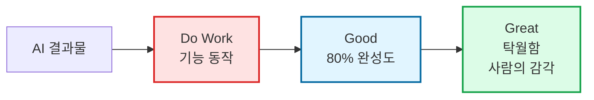

LLM도 결국 통계 모델이다. 모형(model)이라는 단어 자체가 "실세계의 근사치"라는 뜻이다. LLM이 학습한 건 인터넷에 있는 텍스트의 패턴이다. "좋은 디자인"의 보통, "좋은 코드"의 보통. 보통은 안전하지만, 탁월하지는 않다.

Sean Goedecke의 말이 이 맥락에서 핵심을 찌른다.

> "About once an hour I notice that the agent is doing something that looks suspicious, and when I dig deeper I'm able to set it on the right track and save hours of wasted effort… This is why I think pure 'vibe coding' hasn't produced an explosion of useful apps."
>
> "대략 한 시간에 한 번쯤 에이전트가 수상하게 보이는 작업을 하고 있다는 걸 발견하고, 더 깊이 파보면 올바른 방향으로 돌려놓을 수 있어서 몇 시간의 낭비를 막는다… 이것이 순수한 '바이브 코딩'이 유용한 앱의 폭발을 만들어내지 못한 이유라고 본다."

### 이렇게 연습한다

감각을 키우는 가장 확실한 방법은 좋은 것을 많이 보고, 만들고, 사용하는 거다. 기술 블로그만 읽지 말고, 디자인도 보고, 비즈니스 사례도 보고, 소설도 읽자.

에이전트의 결과물을 그대로 수용하지 않는 습관이 감각의 출발점이다. "정말 이게 최선인가?" 항상 질문하기.

## 핵심 요약

이 9가지 스킬을 가만히 들여다보면, 사실 AI 시대 이전에도 좋은 엔지니어가 갖추고 있던 것들이다. 에이전틱 엔지니어링은 이 능력들의 확장이고 증폭이다.

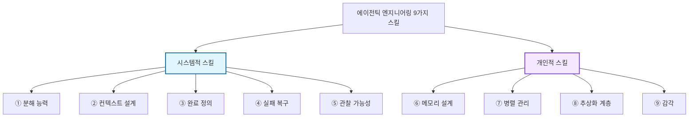

다만 한 가지 달라진 게 있다면, 이 능력들의 효과가 극적으로 증폭됐다는 거다. 예전에는 분해 능력이 조금 부족해도 직접 코드를 짜면서 보정할 수 있었다. 하지만 에이전트에게 일을 맡기는 시대에는, 분해가 잘못되면 그 잘못이 에이전트의 속도만큼 빠르게 증폭된다.

## 결론

> "Since the invention of computer, the era of typing code directly into an editor is over."
>
> "컴퓨터가 발명된 이래 에디터에 코드를 직접 타이핑하던 시대는 끝났다."

맞는 말이다. 하지만 끝난 건 타이핑이지, 엔지니어링이 아니다.

결국 이건 감각과 경험의 문제다. 도구는 바뀌어도 본질은 남는다. 좋은 엔지니어가 에이전트를 만나면 위대한 엔지니어가 된다. 나쁜 설계가 에이전트를 만나면 나쁜 결과물이 빠르게 쏟아진다.

이 9가지 능력은 별개가 아니라 서로 연결되어 있다. 하나씩 키우다 보면 나머지도 따라온다. 어디서 시작하든 상관없다. 중요한 건 시작하는 거다.

> "It is a deep, improvable skill."
>
> "깊고 개선 가능한 스킬이다."

매일 조금씩 나아지면 된다. 완벽할 필요 없다. 방향만 맞으면 된다.

그 쇼의 주인공은 AI가 아니라, AI를 잘 다루는 엔지니어다.

<!--more-->

## Sources

- [Karpathy — Agentic Engineering (X)](https://x.com/karpathy/status/1894897655887351868)
- [Armin Ronacher — Agentic Coding Recommendations](https://lwn.net/Articles/984502/)
- [IndyDevDan — Top 2% Agentic Engineering](https://www.youtube.com/watch?v=xxx)
- [Boris Cherny — Claude Code Creator Workflow](https://www.threads.net/@boris/xxx)
- [WenHao Yu — Agentic Coding: One Year from Vibes to Agentic Engineering](https://flowkater.io/posts/2026-03-01-agentic-engineering-9-skills/)
- [Sean Goedecke — AI Agents and Code Review](https://sean.goecke.dev/xxx)
- [Mihail Eric — The AI-Native Software Engineer (Stanford)](https://cs.stanford.edu/xxx)
- [Superset.sh — Run 10+ Parallel Coding Agents](https://superset.sh/)
- [oh-my-codex (omx) — Multi-Agent Orchestration](https://github.com/xxx)
- [Dex Horthy — 12-Factor Agents](https://dexhorthy.com/xxx)
- [GitHub Engineering — Multi-Agent Workflows](https://github.blog/xxx)
- [HumanLayer — Writing a Good CLAUDE.md](https://humanlayer.com/xxx)
- [dev.to/@suede — Persistent Memory for Claude Code](https://dev.to/suede/xxx)
- [supermemory.ai — AI Memory Layer](https://supermemory.ai/)
- [Elvis (@elvissun) — 94 Commits/Day with AI Agents](https://twitter.com/elvissun/xxx)
- [KinglyCrow — No Skill, No Taste](https://kinglycrow.com/xxx)
- [Chris Lattner — The Claude C Compiler](https://nondot.org/xxx)
- [2026 Agentic Coding Trends Report](https://anthropic.com/xxx)
