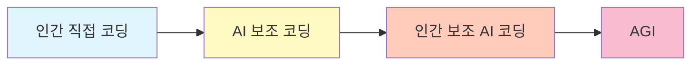
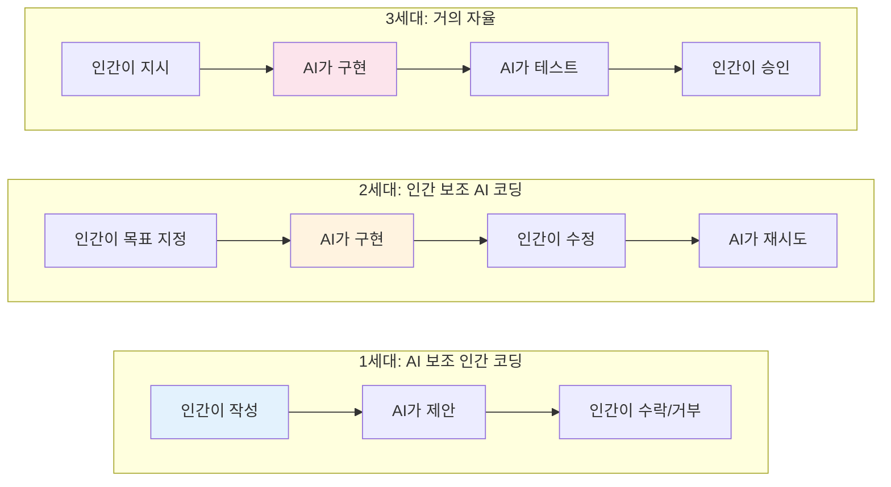
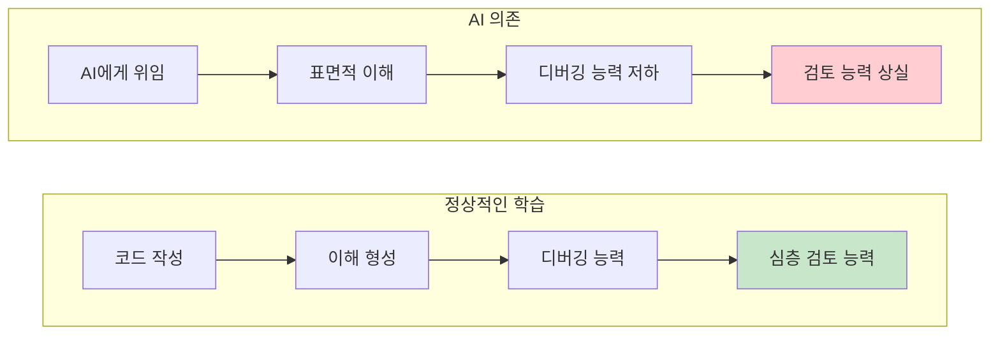
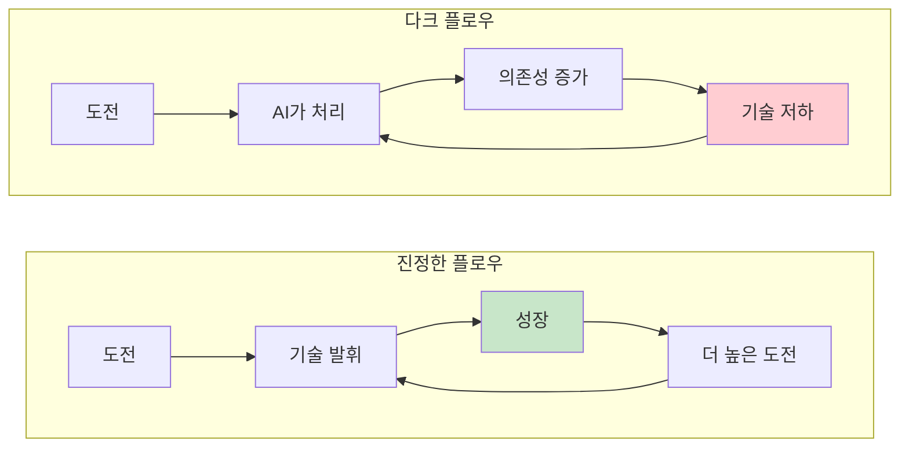
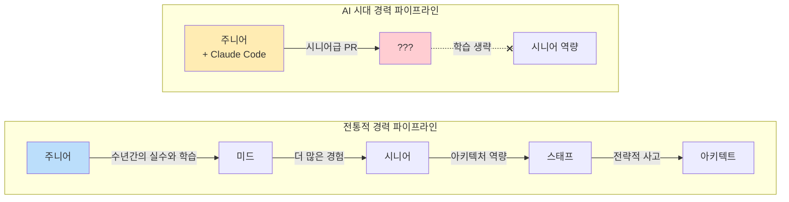
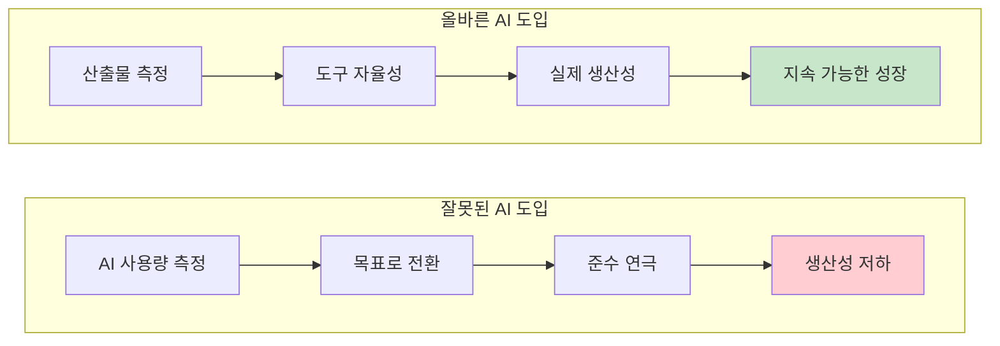
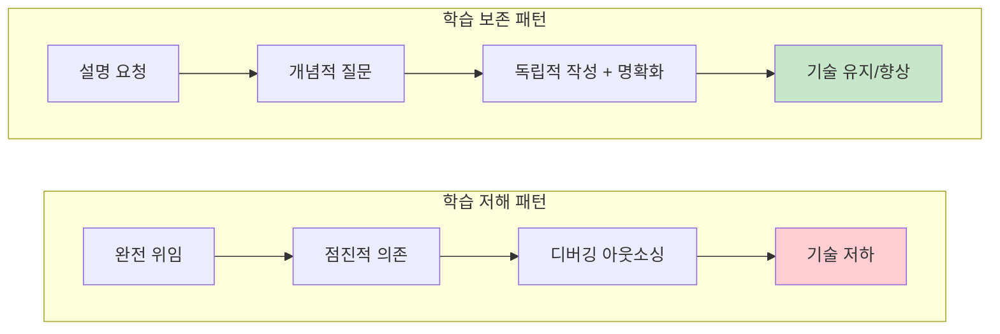
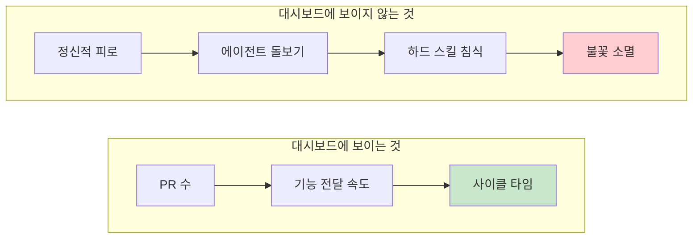

AI 코딩 도구는 개발 생산성을 비약적으로 높였다. 하지만 대시보드에 잡히지 않는 비용이 있다.

<!--more-->

## Sources

- [What AI coding costs you - Tom Wojcik](https://tomwojcik.com/posts/2026-02-15/finding-the-right-amount-of-ai/)

## AI 코딩의 스펙트럼

AI 코딩 도구의 발전을 하나의 스펙트럼으로 생각해보자. 왼쪽 끝은 키보드를 직접 두드리며 IDE에서 코드를 보는 인간이다. 오른쪽 끝은 AGI다. 모든 것을 완벽하게, 인간의 개입 없이 구현한다. 그 사이 어딘가에 오늘날 AI를 사용하는 우리가 있다.

이 임계점은 매주 오른쪽으로 이동한다. 모델이 개선되고, 도구가 성숙하며, 워크플로가 정교해지기 때문이다.

## AI 코딩 도구의 진화

### 1세대: AI 보조 인간 코딩 (2022-2023)

Cursor(2023), Copilot(2022) 같은 첫 번째 AI 코딩 도구들이 등장했다. 이들은 RAG를 통해 코드베이스를 빠르게 인덱싱해서 로컬 컨텍스트를 확보했다. 모델의 외부 지식까지 결합해서 StackOverflow 검색이 더 이상 필요 없어졌다.

Cursor는 AI 기반 자동완성과 채팅을 IDE에 통합해 일관된 경험을 제공했다.

### 2세대: 에이전트의 약속 (2024)

MCP, 자율 워크플로, 밤샘 실행 에이전트에 대한 기사가 쏟아져 나왔다. 이것은 Cursor와는 다른 방식이었다. **더 이상 AI가 보조하는 인간 코딩이 아니라, 인간이 보조하는 AI 코딩**이었다.

많은 개발자가 시도했다가 화를 입었다. 에이전트는 수많은 작은 실수를 저질렀다. AI 우선 프로세스는 개발자가 코딩을 생각하는 방식 자체를 완전히 바꿔야만 좋은 결과를 얻을 수 있었다. 에이전트는 종종 루프에 빠지고, 의존성을 환각하고, 거의 맞지만 실제로는 아닌 코드를 생산했다.

소프트웨어는 예전에 결정론적이었다. if/else 분기, 명시적 상태 머신, 명확한 로직으로 제어했다. 새로운 현실은 프롬프트, 시스템 지시사항, CLAUDE.md 파일로 개발 프로세스를 제어하면서 모델이 기대한 출력을 내기를 바라는 것이다.

### 3세대: Opus 4.5 시대 (2025-2026)

Opus 4.5가 나왔다. 모두가 이야기하던 워크플로가 (항상은 아니지만) 더 자주 바로 작동했다. 엔지니어들은 Forward Deployed Engineers로 전환해 코딩 외에 많은 것을 담당하게 됐다. 때로는 직접 코딩을 전혀 하지 않기도 한다.

Spotify 공동 CEO Gustav Söderström의 말:

> Spotify 엔지니어는 아침 출근길에 휴대폰의 Slack에서 Claude에게 iOS 앱의 버그를 고치거나 새 기능을 추가하라고 지시할 수 있다. Claude가 작업을 마치면 엔지니어는 휴대폰의 Slack으로 새 버전의 앱을 받아서, 사무실에 도착하기도 전에 프로덕션에 머지할 수 있다.

코드를 머지하기 전에 최소한 검토는 하길 바란다.

## 당신의 뇌가 겪는 일: 인지 부채

### 디지털 치매와 신경가소성

2012년 신경과학자 Manfred Spitzer는 "Digital Dementia"를 출판했다. 그는 정신적 작업을 디지털 기기에 아웃소싱하면 그 작업을 담당하는 뇌 경로가 위축된다고 주장했다. 쓰거나 잃거나(use it or lose it). 모든 것이 과학적으로 입증된 것은 아니지만, 신경가소성 연구는 뇌가 사용되는 경로를 강화하고 사용되지 않는 경로를 약화시킨다는 것을 보여준다. 이 책의 핵심 원칙은 연습을 중단하는 인지 능력은 저하된다는 것이다.

### 인지 부채의 정의

소프트웨어 엔지니어링 연구자 Margaret-Anne Storey는 이것에 더 정확한 이름을 붙였다: **인지 부채(Cognitive Debt)**. 기술 부채는 코드에 존재한다. 인지 부채는 개발자의 머릿속에 존재한다. 무엇을 빌드했는지 이해하지 못한 채 빠르게 빌드할 때 발생하는 누적된 이해력 상실이다.

Storey는 Peter Naur의 1985년 이론에 근거를 둔다. 프로그램은 개발자의 마음속에 존재하는 이론이다. 그것이 무엇을 하는지, 의도가 구현에 어떻게 매핑되는지, 어떻게 진화할 수 있는지를 담고 있다. 그 이론이 파편화되면 시스템은 블랙박스가 된다.

이것을 완전한 에이전트 코딩에 직접 적용해보자. 코드 작성을 중단하고 AI 출력만 검토하면, 코드에 대해 추론하는 능력이 위축된다. 천천히, 눈에 보이지 않게, 그러나 필연적으로. 더 이상 깊이 이해할 수 없는 것을 깊이 검토할 수는 없다.

### Shen-Tamkin 연구: 1시간의 AI 작업이 만든 차이

이것은 이론만이 아니다. 2026년 Shen과 Tamkin의 무작위 연구가 이것을 직접 테스트했다. 52명의 전문 개발자가 새로운 비동기 라이브러리를 학습할 때 AI 지원 그룹과 비지원 그룹으로 나뉘었다.

AI 그룹은 **개념적 이해, 디버깅, 코드 읽기에서 17% 낮은 점수**를 기록했다. 가장 큰 격차는 디버깅, 즉 AI가 틀리는 것을 잡아내는 데 정확히 필요한 기술이었다. 1시간의 수동적 AI 지원 작업이 측정 가능한 기술 침식을 만들어냈다.

```mermaid
xychart-beta
    title "AI 지원 vs 비지원 그룹 점수 비교 (Shen-Tamkin 연구)"
    x-axis ["개념적 이해", "디버깅", "코드 읽기", "전체 평균"]
    y-axis "점수 (%)" 0 --> 100
    bar [78, 72, 80, 77]
    bar [92, 89, 95, 92]
```

### 다크 플로우: 생산성의 환상

교활한 부분은 도구가 저하를 보상해주기 때문에 본인이 그 저하를 알아차리지 못한다는 것이다. 생산적이라고 느낀다. PR이 배포된다. 심지어 흐름 상태에 들어간 것 같기도 하다.

Mihaly Csikszentmihalyi의 연구에 따르면 흐름 상태는 도전과 기술 사이의 균형에 달려 있다. 마음이 적당히 늘어나야 한다. 진정한 흐름은 성장을 만들어낸다. Rachel Thomas는 AI 지원 작업이 만들어내는 것을 "다크 플로우"라고 불렀다. 도박 연구에서 차용한 용어로, 슬롯머신이 유도하도록 설계된 몽환적 상태를 묘사한다.

몰입했다고 느끼지만, 도전-기술 균형은 사라졌다. AI가 도전을 처리하기 때문이다. 깊은 작업의 흐름 상태처럼 느껴지지만, 피드백 루프는 망가졌다. 더 좋아지는 것이 아니라, 의존하게 된다.

## 리뷰 역설: AI가 다 쓰면 누가 검토하나?

"AI가 모든 코드를 작성하고 당신이 그것만 검토한다면, 검토할 기술은 어디서 오는가?"라는 관찰이 HN 댓글에서 계속 올라온다. 하나 없이 다른 하나를 가질 수 없다. 교과서나 PR에서 읽는다고 좋은 코드를 인식하는 법을 배우는 것이 아니다. 나쁜 코드를 작성하고, 그것이 찢겨나가고, 수년간의 연습을 통해 직관을 구축하면서 배운다.

이것이 **리뷰 역설(review paradox)**을 만든다: AI가 많이 작성할수록, 인간은 AI가 작성한 것을 검토할 자격이 점점 떨어진다. Shen-Tamkin 연구가 이것에 숫자를 붙였다. AI에게 완전히 위임한 개발자가 작업을 가장 빨리 완료했지만 평가에서 가장 낮은 점수를 받았다.

Storey의 제안된 해결책은 간단하다: "배포 전에 각 AI 생성 변경 사항을 인간이 이해하도록 요구하라." 그것이 올바른 대답이다. 또한 속도가 지표일 때 가장 먼저 건너뛰는 대답이기도 하다.

## 시니어리티 붕괴: 경력 파이프라인이 사라진다

이것은 개별 기술 저하보다 더 깊이 간다. 예전에는 주니어, 미드, 시니어, 스태프 엔지니어, 아키텍트가 있었다. 각 레벨이 수년간의 실전 경험 위에 구축되는 파이프라인이었다. 주니어는 수년간 코드를 작성하고, 주의 깊지 않아서가 아니라 더 잘 몤기 때문에 코드 리뷰에서 거절당한다. 함수를 작성할 수 있는 사람과 시스템을 아키텍팅할 수 있는 사람을 구분하는 판단력을 이렇게 구축한다. 시니어는 하룻밤 사이에 될 수 없다.

물론 AI를 사용하면 이야기가 다르다. 이제 Claude Code(Opus 4.5+)를 사용하는 주니어가 시니어 엔지니어 작업처럼 보이는 PR을 배포한다. 전반적으로 좋은 일이라고 생각한다. 하지만 그것이 시니어 모자가 이제 모두에게 맞는다는 의미인가? 첫날부터? 하지만 그 아래의 머리는 변하지 않았다. 그 주니어는 그 아키텍처가 왜 선택되었는지 모른다.

가끔 Claude Code는 새로운 DB 트랜잭션이 필요한 곳을 놓친다. 가끔은 여러 이유로 잠기지 말아야 할 리소스에 락을 건다. 나는 내 결정을 방어할 수 있고, 내 코드가 도전받을 때, 리뷰어가 동의하지 않을 때, 우리가 토론할 때 즐긴다. 주니어는 무엇을 할까? Claude에게 물어볼 것이다.

이것은 양면 붕괴다. 코드 작성을 중단하고 AI 출력만 검토하는 시니어는 자신의 깊이를 잃는다. 고난을 건너뛰는 주니어는 그것을 결코 구축하지 못한다. 조직은 매일 시니어 시간을 리뷰에 쓰면서 동시에 그것을 만드는 메커니즘을 망가뜨리고 있다. 나쁜 코드를 작성하고, 나쁜 코드를 리뷰받고, 실패를 통해 직관을 구축하며 시니어 엔지니어를 만들어내던 파이프라인이 완전히 우회되고 있다. 그 파이프라인이 말랐을 때 무슨 일이 벌어지는지 아무도 이야기하지 않는다.

## C레벨이 맞은 것과 틀린 것

### 극단적인 예측들

C레벨 책상에 매주 무엇이 도착하는지 보자:

- Microsoft AI 수장 Mustafa Suleyman은 모든 화이트칼라 작업이 18개월 내에 자동화될 것이라고 말한다.
- Anthropic CEO Dario Amodei는 AI가 6-12개월 내에 소프트웨어 엔지니어를 대체할 것이며, 엔지니어들이 더 이상 코드를 작성하지 않고 모델이 작성하게 한 다음 출력을 편집한다고 인용했다.
- Google CEO Sundar Pichai는 2024년 후반 Google의 새 코드 25%가 AI 생성이라고 보고했다. 몇 달 후, Google Research는 그 숫자가 코드 문자의 50%에 도달했다고 보고했다.

CTO로서 저 곡선을 보고 있다면, 당연히 팀을 밀어붙일 것이다.

### 예측의 문제점

문제는 예측이 AI를 파는 사람들이나 AI 과열로 주가를 떠받치려는 사람들에게서 나온다는 것이다. 그들은 채택을 가속화할 모든 인센티브가 있고, 역사적으로 항상 그렇듯 타임라인이 미끄러질 때 책임은 없다. 그리고 Google의 "코드 문자의 50%"는 자체 모델, 도구, 인프라를 처음부터 구축한 회사의 이야기일 뿐, 당신 팀이 기성 에이전트로 다음 월요일에 달성할 수 있는 것에 대해서는 거의 말해주지 않는다.

### Goodhart의 법칙: 측정이 목표가 되면

AI 채택은 스위치가 아니라 보정해야 하는 기술이다. 특정 도구를 의무화하고, "AI 우선" 정책을 설정하고, 개발자가 얼마나 많은 AI를 사용하는지 측정하는 것만큼 간단하지 않다. 디자인 패턴 사용, 적절한 테스트 커버리지, 머지 전 수동 테스트 같은 많은 좋은 관행이 요즘 종종 건너뛰어진다. 속도가 줄어들기 때문이다. AI가 망가뜨렸나? AI가 고칠 것이다. 리뷰가 필요한가? AI가 할 것이다. Greptile이나 CodeRabbit도 아니다. 그냥 PR을 Claude Code 리뷰어 에이전트에 위임하면 된다. 또는 Gemini. 또는 Codex. 독을 선택하라.

r/ExperiencedDevs의 한 개발자가 회사가 엔지니어별 AI 사용량을 추적하는 것을 묘사했다:

> "나는 봇에게 내가 신경도 쓰지 않는 무작위 일을 하도록 요청하기 시작했다. 얼마 전에는 Claude에게 무작위 디렉토리를 검사해서 '버그를 찾거나' 이미 답을 알고 있는 질문에 답하도록 했다."

이 스레드는 AI가 "기술 리드가 도구에서 충분히 떨어져 있어서 위험해진" AI 슬롭(slop) 때문에 코드 리뷰를 "무한히 어렵게" 만들었다고 보고하는 엔지니어들로 가득하다.

이것이 **Goodhart의 법칙**이다: "측정이 목표가 되면, 더 이상 좋은 측정이 아니다." 엔지니어별 AI 사용량을 추적하면 더 나은 엔지니어링을 얻는 것이 아니라 준수 연극(compliance theater)을 얻는다. 개발자는 지표를 게임하고, 도구를 resent하고, AI가 전달할 수 있었던 실제 생산성 이득이 조직 기능 장애 아래 묻힌다.

## 아무도 이야기하지 않는 비용

### 재정적 비용 vs 인적 비용

재정적 비용은 명백하다. 사소하지 않은 기능에 대한 에이전트 시간은 시간 단위로 측정되며, 그 시간은 무료가 아니다. 하지만 인적 비용은 잠재적으로 더 나쁘고, 거의 논의되지 않는다.

### 창작의 도파민 히트

코드를 작성하면 흐름 상태에 들어갈 수 있다. 깊고, 집중적이며, 창의적인 문제 해결. 시간이 사라지고 무언가를 구축하고 이해한 상태로 나타난다. 그리고 자랑스러워한다. 누군가가 PR 아래에 "잘했어!"라고 쓰고 승인을 줬다. AI 생성 코드를 검토하는 것은 이것을 하지 않는다. 반대다. 정신적 소모다.

개발자는 창작의 도파민 히트가 필요하다. 그것은 특권이 아니라 좋은 엔지니어를 참여시키고, 학습시키고, 유지하고, 번아웃을 방지하는 것이다. 코딩의 즐거움이 아마 그들을 경험 많은 개발자로 만들 수 있었던 것일 것이다. 창작을 감독으로 대체하면 더 빠른 배송이 아니라 더 빠른 번아웃을 얻는다. 엔지니어링이라는 창의적 작업을 최악의 형태의 QA로 바꾼 것이다. AI가 모든 예술을 하고, 인간은 빨래를 개킬 뿐이다.

## 올바른 AI 사용량 찾기

### Shen-Tamkin 연구의 6가지 패턴

Shen-Tamkin 연구는 개발자 사이의 6가지 뚜렷한 AI 상호작용 패턴을 식별했다.

**학습을 저해하는 3가지:**

1. 완전 위임(Full delegation)
2. 점진적 의존(Progressive reliance)
3. 디버깅을 AI에 아웃소싱

**완전한 AI 접근 권한으로도 학습을 보존하는 3가지:**

1. 설명 요청
2. 개념적 질문
3. AI는 명확화에만 사용하면서 독립적으로 코드 작성

차이점은 개발자가 AI를 사용했는지 여부가 아니라, **인지적으로 참여했는지 여부**였다.

### 너무 적게 쓰는 것의 위험 (2026년 기준)

2026년에 AI를 전혀 사용하지 않는다면, 실제 이득을 놓치고 있다:

- **검색과 컨텍스트.** AI는 낯선 코드베이스 탐색, 레거시 코드 이해, 관련 패턴 찾기에 Google보다 진정으로 낫다. 이것만으로도 워크플로에 있을 이유가 충분하다. (2023년부터, Cursor 등)
- **보일러플레이트와 스캐폴딩.** 에이전트가 몇 초 만에 생산할 수 있는 백 번째 CRUD 엔드포인트, 설정 파일, 테스트 스캐폴드를 손으로 작성하는 것은 장인 정신이 아니라 고집이다. 그냥 AI를 써라. 어차피 더 이상 CRUD 개발자가 아니다. 우리 모두 많은 모자를 쓰니까. (2025년 Sonnet 이후)
- **워크플로 자체.** 맞춤화된 에이전트와 작동하는 조사-계획-구현-테스트-검증 사이클은 기능이 배포되는 방식의 실질적인 개선이다. 사소하지 않은 작업에 며칠 대신 몇 시간. 약속된 10배는 아니지만, 확립된 코드베이스에서 2배나 4배는 손 닿는 과일이다. 하지만 출력과 AI가 내린 모든 결정을 이해해야 한다! (2025년 Opus 4.5 이후)
- **탐색.** "이 모듈은 무엇을 하는가? 이 API는 어떻게 작동하는가? 이것을 바꾸면 무엇이 깨질까?" AI는 이런 질문에 탁월하다. 코드 읽기를 대체하지는 않지만, 적절한 시간에 적절한 파일로 안내해 줄 것이다. (2023년부터)

원칙적으로 AI 사용을 거부하는 것은 과열 속에서 채택하는 것만큼 비이성적이다.

### 너무 많이 쓰는 것의 위험

자율 AI 코딩에 올인하면(특히 실제로 어떻게 작동하는지 배우지 않고), 느린 속도보다 더 나쁜 것을 위험하게 된다. **보이지 않는 저하**를:

- **기능처럼 보이는 버그.** AI 생성 코드는 CI를 통과한다. 타입이 맞다. 테스트가 녹색이다. 그리고 어딘가에 미묘한 로직 오류, 환각된 엣지 케이스, 부하 아래에서 무너질 패턴이 있다. 금융이나 의료 같은 도메인에서, 에러를 던지지 않는 잘못된 숫자는 크래시보다 나쁘다. (점점 덜 관련있지만 여전히 관련있음)
- **아무도 이해하지 못하는 코드베이스.** 에이전트가 모든 것을 작성하고 인간이 검토만 하면, 6개월 후 팀의 아무도 시스템이 왜 그렇게 아키텍팅되었는지 설명할 수 없다. AI가 선택을 했다. 테스트가 통과해서 아무도 질문하지 않았다. Storey는 정확히 이 벽에 부딪힌 학생 팀을 묘사한다: 그들은 간단한 변경을 해도 것을 깨뜨릴 수 없었다. 문제는 지저분한 코드가 아니라 아무도 특정 디자인 결정이 왜 내려졌는지 설명할 수 없다는 것이었다. 그녀의 결론: "이해 없는 속도는 지속 가능하지 않다." (항상 문제일 것, 제 의견으로는)
- **인지 위축.** 위의 디지털 치매 섹션의 모든 것. 연습을 중단하는 기술은 저하된다. (항상 문제일 것, 제 의견으로는)
- **시니어리티 파이프라인 말라붙기.** 위에서 다뤘다. 이것은 나타나는 데 수년이 걸리기 때문에 정확히 아무도 계획하지 않는다. (새로운 문제, 미래에 어떻게 보일지 모르겠다)
- **번아웃.** 창작의 도파민 없이 하루 종일 AI 출력을 검토하는 것은 지속 가능한 직무 기술서가 아니다. (오래된 문제, but potentially hits faster?)

## 조용한 저하: 대시보드에 잡히지 않는 것

이것이 밤잠을 못 자게 하는 것이다. 모든 대시보드의 모든 지표에서, AI 지원 인간 개발과 인간 지원 AI 개발은 개선되고 있다. 더 많은 PR 배포. 더 많은 기능 전달. 더 빠른 사이클 시간. 차트는 우상향한다.

하지만 지표는 그 아래에서 일어나는 것을 포착하지 못한다. 하루 종일 직접 작성하지 않은 코드를 검토하는 정신적 피로. 문제를 해결하는 대신 에이전트를 돌보는 지루함. 애초에 이 일을 잘하게 만든 하드 스킬의 느리고 보이지 않는 침식. 에이전트가 처리하니까 아키텍처를 머릿속에 유지하는 것을 중단한다. 테스트가 통과하니까 엣지 케이스를 생각하는 것을 중단한다. 프롬프트하고 승인하는 게 더 쉬우니까 깊이 파고들고 싶은 것을 중단한다. 더 이상 당신 안에 불꽃이 없다.

Simon Willison, 우리 시대의 가장 야심 찬 개발자 중 한 명이 이것이 이미 자신에게 일어나고 있다고 인정했다. 구현을 검토하지 않고 전체 기능을 프롬프트한 프로젝트에서, 그는 "그것들이 무엇을 할 수 있고 어떻게 작동하는지에 대한 확고한 멘탈 모델을 더 이상 가지고 있지 않다."

그리고 어느 날, 지표가 미끄러지기 시작한다... 도구가 나빠져서가 아니라, 당신이 나빠졌기 때문에. 노력 부족이 아니라, 연습 부족 때문에. 이것은 그렇지 않은 순간까지 진처럼 보이는 피드백 루프다.

어떤 임원도 이것을 측정하고 싶어 하지 않는다. "18개월 동안 AI 사용이 엔지니어의 인지 능력에 미치는 영향은 무엇인가?"는 쉬운 KPI가 아니다. 분기 리뷰에 맞지 않는다. 추적되지 않고, 추적되지 않는 것은 관리되지 않는다. 그러다 팀의 아무도 에이전트 없이 디버그할 수 없는 프로덕션 인시던트로 나타날 때까지. 그리고 에이전트도 디버그할 수 없다.

## 핵심 요약

- **인지 부채(Cognitive Debt)**: AI에 의존해 코드를 작성하면 표면적 이해만 남고, 깊은 이해력이 저하된다. Shen-Tamkin 연구에서 1시간의 AI 지원 작업만으로도 개념적 이해, 디버깅, 코드 읽기 점수가 17% 하락했다.
- **다크 플로우(Dark Flow)**: AI가 도전을 처리하는 '흐름 상태'처럼 느껴지지만, 실제로는 의존성만 커지고 성장은 없다.
- **리뷰 역설(Review Paradox)**: AI가 많이 작성할수록 인간은 그것을 검토할 자격이 떨어진다. 검토 능력은 직접 작성하며 얻는다.
- **시니어리티 파이프라인 붕괴**: 주니어가 AI로 시니어급 PR을 낼 수 있지만, 그 아래의 판단력과 경험은 없다. 동시에 시니어도 코드 작성을 중단하면 깊이를 잃는다.
- **Goodhart의 법칙**: AI 사용량을 목표로 삼으면 준수 연극만 얻는다. 개발자는 지표를 게임하고 실제 생산성 이득은 묻힌다.
- **올바른 AI 사용량은 0도 최대도 아니다**: Shen-Tamkin 연구는 6가지 패턴을 식별했다. 학습을 보존하는 3가지는 설명 요청, 개념적 질문, 독립적 작성+명확화다. 핵심은 **인지적 참여**를 유지하는 것이다.

## 결론

나는 매일 AI를 사용한다. 직장에서도 사이드 프로젝트에서도 AI를 많이 사용한다. 돌아가고 싶지 않다. 나는 그것을 사랑한다! 그래서 걱정이다. 내가 중독되고 의존하게 된 것 같다. 수많은 맞춤 명령, 스킬, 에이전트를 구현했다. 매일 Claude Code 릴리스 노트를 확인한다. 비슷한 상황에 있는 사람이 많고, 우리 모두 미래가 어떻게 될지 궁금해한다. AI로 스스로를 대체하게 될까? 아니면 AI 슬롭을 청소하는 책임을 맡게 될까? 나에게 올바른 AI 사용량은 무엇인가?

AI는 그저 도구다. 비범하게 강력한 도구지만, 어쨌든 도구다. 모든 엔지니어에게 특정 IDE를 사용하도록 의무화하거나, 하루에 몇 줄을 작성하는지 측정하지는 않을 것이다(…그렇지?). 그들이 가장 효과적인 도구를 선택하게 하고 실제로 중요한 것, 즉 배포되는 작업을 측정할 것이다.

올바른 AI 사용량은 0도 아니고 최대도 아니다.

소프트웨어 엔지니어링은 결코 코드 타이핑만이 아니었다. 문제를 잘 정의하고, 이해하고, 비즈니스에서 제품으로, 제품에서 코드로 언어를 번역하고, 모호성을 명확히 하고, 트레이드오프를 만들고, 무언가를 바꿨을 때 무엇이 깨지는지 이해하는 것이다. AGI 전에 누군가는 그것을 해야 하고, AGI는 아직 멀었다(다행히). 당신이 온콜이고, 새벽 3시에 전화가 울리면, 에이전트 없이 문제를 분류할 수 있는가? 할 수 없다면, 아마 AI 코딩을 너무 멀리 밀어붙인 것이다. AI 사용량이 개발자의 새로운 성과 지표가 된다면, 너무 자주, 너무 많이 AI를 사용하는 것도 discouraged되어야 할까? 이 도구들이 나쁘서가 아니라, 코딩 스킬은 유지할 가치가 있기 때문이다.
