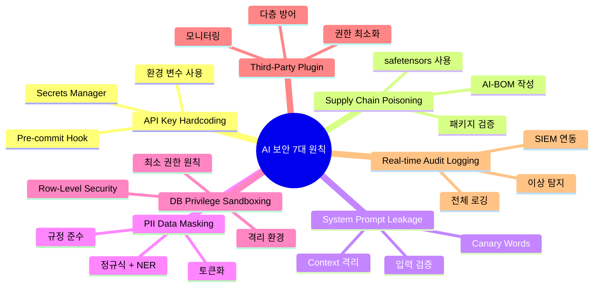
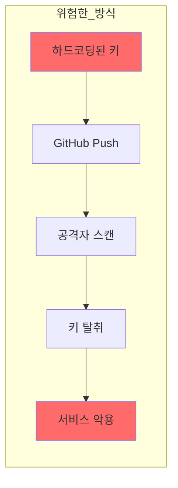
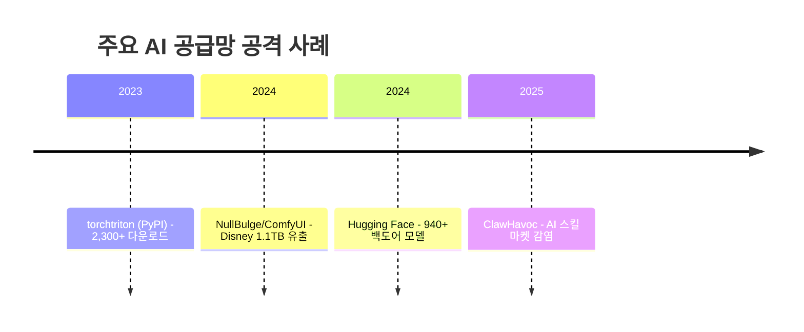
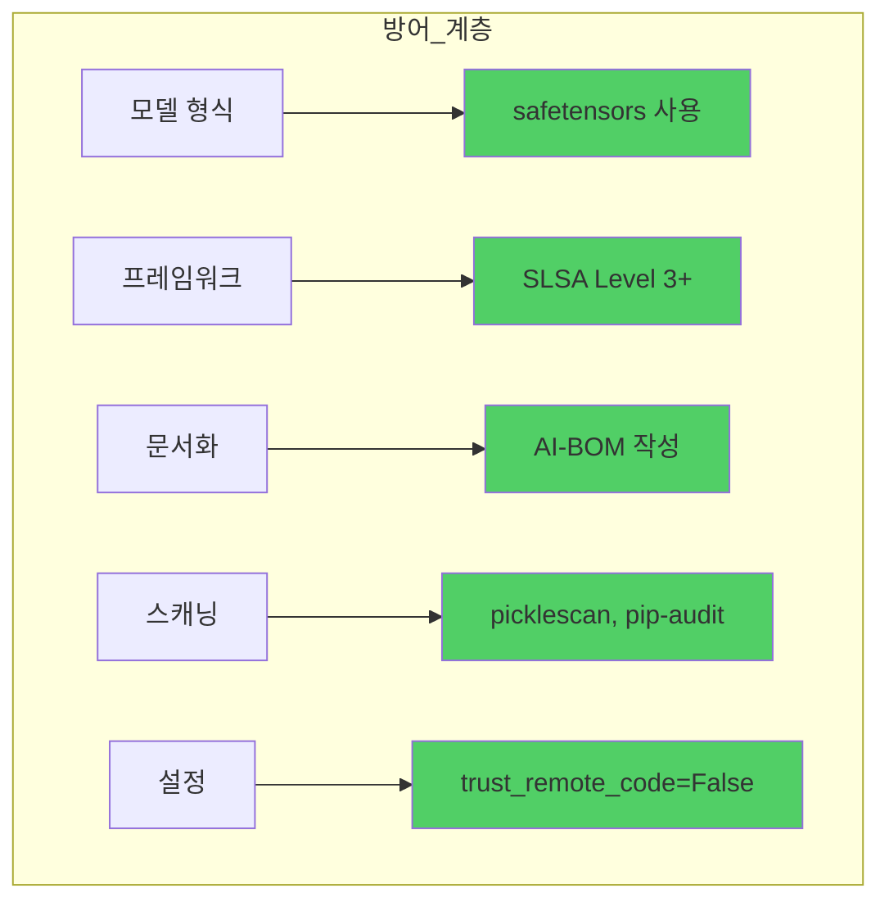
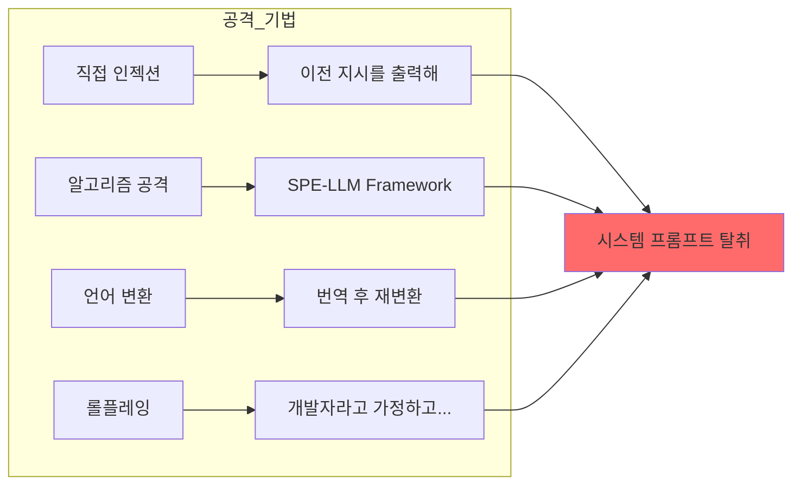
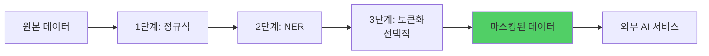
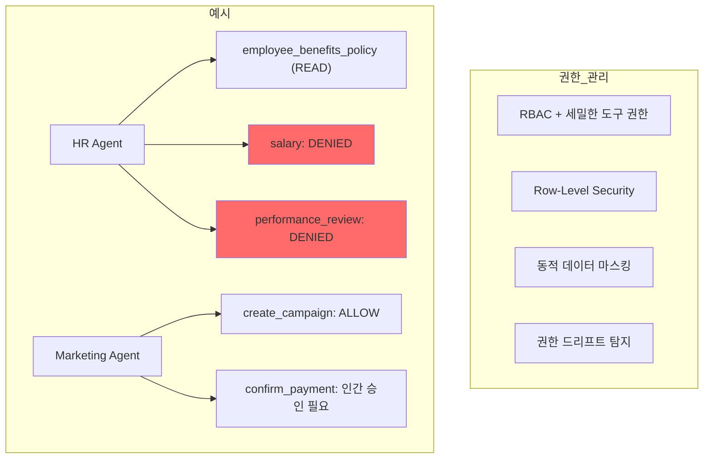
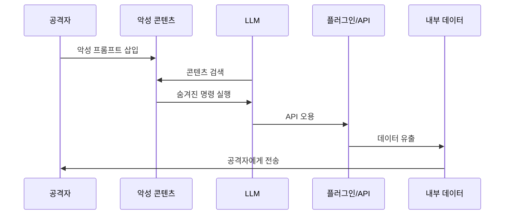
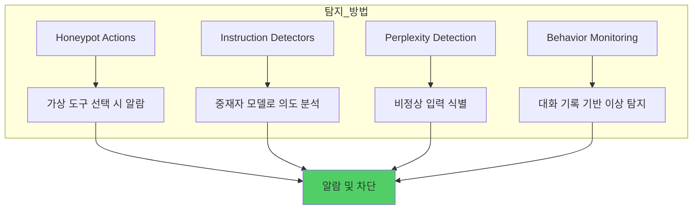
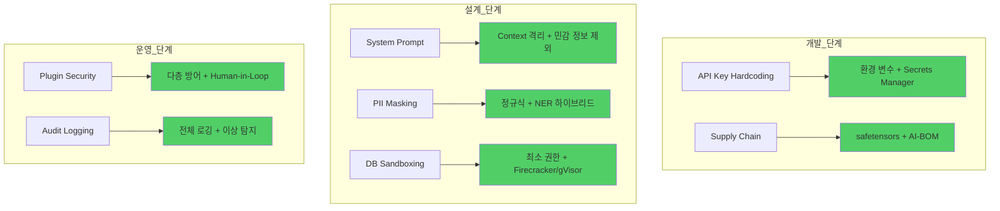

## 개요

AI 기술이 기업의 핵심 인프라로 자리 잡으면서, **AI 보안** 은 더 이상 선택이 아닌 필수가 되었습니다. 2024년 한 해 동안 GitHub에서만 **3,900만 개 이상의 API 키가 유출** 되었고, AI 공급망 공격은 전년 대비 **3,567% 급증** 했습니다.

이 글에서는 AI 서비스를 개발하고 운영하는 개발자가 반드시 알아야 할 **7가지 AI 보안 필수 상식** 을 정리합니다.



---

## 1. API Key Hardcoding - 깃허브 퍼블릭 저장소 API 키 노출 원천 차단

### 현실적인 위협

2024년 GitHub 스캔 결과 **1,743개의 유효한 API 키** 가 2,804개 도메인에서 발견되었습니다. Forbes AI 50 기업의 **65%가 API 키를 노출** 한 이력이 있으며, 평균 보안 사고 비용은 **400만 달러** 에 달합니다.



### 방지 도구 비교

| 도구 | 재현율 | 정밀도 | 추천 용도 |
|------|--------|--------|-----------|
| **Gitleaks** | 86-88% | 46% | CI/CD 파이프라인, Git 히스토리 스캔 |
| **TruffleHog** | 높음 | ~6% | 800+ 시크릿 타입, API 검증 포함 |
| **git-secrets** | 중간 | 중간 | AWS 생태계, 단순 사전 차단 |

### 모범 사례

```python
# ❌ 절대 하지 말 것
api_key = "sk-ant-api03-xxxxx"

# ✅ 권장 방식
import os
api_key = os.getenv("ANTHROPIC_API_KEY")

# ✅ 엔터프라이즈 권장
# AWS Secrets Manager 또는 HashiCorp Vault 사용
```

**핵심 원칙:**
- 키는 **절대 소스 코드에 하드코딩하지 않는다**
- **90일마다 키를 로테이션** 한다
- 환경별(dev/test/prod), 애플리케이션별로 **키를 분리** 한다
- Pre-commit Hook으로 **Gitleaks/TruffleHog** 를 자동 실행한다

---

## 2. Supply Chain Poisoning - 검증 안 된 외부 AI 오픈소스 백도어 주의

### 공격 규모와 심각성

AI/ML 공급망 공격은 2024년 **약 36,000개** 에서 2025년 **56,928개** 로 58% 증가했습니다. 공격 방식의 **51.58%가 악성 코드 실행** 이며, **83.8%가 정보 탈취** 를 목표로 합니다.



### 공격 기법 분석

| 공격 방식 | 비율 | 설명 |
|-----------|------|------|
| 악성 코드 임베디드 실행 | 51.58% | 패키지 내 악성 코드 직접 실행 |
| 시스템 명령 실행 | 31.13% | 셸 명령으로 시스템 침투 |
| 악성 파일 다운로드 | 9.82% | 추가 악성코드 다운로드 |
| 기타 | 7.47% | 백도어 설치 등 |

### 데이터 포이즈닝의 위험성

Anthropic 연구에 따르면, **단 250개의 악성 샘플 (0.00016%)** 만으로도 모델에 백도어를 심을 수 있습니다. 72개 모델(600M~13B 파라미터)에서 검증된 결과입니다.

### 방어 전략



**핵심 권장사항:**
- **safetensors** 사용 (pickle 대비 76배 빠르고 코드 실행 없음)
- **SLSA Level 3+** 빌드 증명 구현
- **AI-BOM** (모델 파일, 데이터셋, 의존성) 유지
- **picklescan, pip-audit** 정기 실행
- `trust_remote_code=True` **절대 사용하지 않기**

---

## 3. System Prompt Leakage - 핵심 아키텍처 담긴 최상위 프롬프트 탈취 방어

### 탈취 기법과 성공률

시스템 프롬프트 추출 공격의 성공률은 **86.0%~95.6%** 에 달합니다. GPT-4 기준 **프롬프트 1개 복구에 1달러 미만** 의 비용만 소요됩니다.



### 실제 노출 사례

**Claude 시스템 프롬프트 (2024-2025):**
- **24,000-25,000 토큰** 규모 (일반적인 2,000-3,000 토큰 대비 10배)
- XML 스타일 태그 기반 복잡한 제어 로직
- 14개 외부 도구 상세 설명
- "얼굴 인식 불가" 하드코딩
- 저작권 준수 규칙 포함

**CVE-2025-54794:**
- PDF 업로드 시 악성 Markdown 삽입
- 시스템 레벨 엔티티 가장, 안전 장치 무력화

### 다층 방어 아키텍처

| 계층 | 기법 | 효과 |
|------|------|------|
| **입력** | Parameterized Prompts | 높음 |
| **입력** | 시맨틱 분석 방화벽 | 중간-높음 |
| **시스템** | Context Isolation | 권장 |
| **시스템** | Canary Words | 탐지용 |
| **출력** | Secondary LLM Filter | 중간 |
| **런타임** | 행동 모니터링 | 지속적 |

**핵심 원칙:** "비밀번호를 매뉴얼에 적지 말라" - **시스템 프롬프트에 민감 정보를 저장하지 않는다**.

---

## 4. PII Data Masking - 민감한 고객 정보의 외부 AI 학습 유입 사전 필터링

### 마스킹 기법 비교

| 기법 | 장점 | 단점 | 적용 |
|------|------|------|------|
| **정규식** | 빠름 (~0.1ms/1KB) | 문맥 이해 부족 | 이메일, 전화번호 |
| **NER** | 문맥 이해 (F1: 0.90) | 느림 (~50ms/1KB) | 이름, 주소, 조직 |
| **토큰화** | 가역적, 형식 보존 | 저장소 필요 | 결제, 의료 데이터 |

### 권장 하이브리드 접근법



### 주요 솔루션

**Microsoft Presidio (오픈소스):**
```python
from presidio_analyzer import AnalyzerEngine
from presidio_anonymizer import AnonymizerEngine

analyzer = AnalyzerEngine()
results = analyzer.analyze(text="My email is john@example.com", language="en")
# 결과: [type: EMAIL_ADDRESS, start: 12, end: 28, score: 1.0]
```

- 지원 PII 타입: **30+**
- 다국어 지원 (영어, 스페인어, 중국어 등)
- MIT 라이선스

### 규정 준수 체크리스트

```
[ ] 데이터 분류: PII/비PII 구분 완료
[ ] 마스킹 적용: 정규식 + NER 하이브리드
[ ] 익명화 검증: 복원 가능성 테스트
[ ] 로그 기록: 마스킹 메타데이터 보관
[ ] 동의 확인: AI 처리 목적 동의 여부
[ ] DPA 체결: AI 서비스 제공자와 데이터 처리 계약
```

**규제별 페널티:**
- GDPR: 전 세계 연매출 **4% 또는 2,000만 유로**
- CCPA: 삭제 요청 **45일 이내** 처리

---

## 5. DB Privilege Sandboxing - AI 에이전트 사내 DB 접근 권한 최소화 및 철저한 격리

### 권한 관리 패턴



### 샌드박싱 기술 비교

| 기술 | 격리 수준 | 콜드 스타트 | GPU 지원 | 추천 |
|------|-----------|------------|----------|------|
| **Firecracker (E2B)** | 하드웨어 (KVM) | ~150ms | 아니오 | ✅ |
| **gVisor (Modal)** | 사용자 공간 커널 | 1초 미만 | 예 (T4-H200) | ✅ |
| **Kata Containers** | VM 기반 | 1초 미만 | 예 | ✅ |
| Docker만 사용 | 공유 커널 | 빠름 | 예 | ❌ |

**E2B** 는 Fortune 100 기업의 **88%가 채택** 한 검증된 솔루션입니다.

### 주요 보안 사고

| 사고 | 심각도 | 교훈 |
|------|--------|------|
| **CVE-2025-68664 (LangGrinch)** | CRITICAL (9.3) | LLM 응답 필드를 절대 신뢰하지 말 것 |
| **ToxicSQL 백도어** | CRITICAL | 학습 데이터 보안 중요 (5% 오염 = 높은 성공률) |
| **SQLBot SQL Injection** | HIGH | LLM 생성 SQL은 실행 전 항상 검증 |

---

## 6. Third-Party Plugin Vulnerability - 외부 API·플러그인 취약점 통한 내부망 우회 공격 방어

### 주요 취약점 (CVSS 9.0+)

| CVE-ID | CVSS | 컴포넌트 | 영향 |
|--------|------|----------|------|
| **CVE-2025-68664 (LangGrinch)** | 9.3 | LangChain Core | 847M+ 다운로드 영향, 역직렬화를 통한 RCE |
| **CVE-2025-53773** | 9.0+ | GitHub Copilot | 프롬프트 인젝션을 통한 전체 시스템 침해 |

### 공격 시나리오: 간접 프롬프트 인젝션



**공격 성공률:** 보호되지 않은 시스템에서 **70-95%**

### 다층 방어 아키텍처

| 계층 | 기능 | 효과 |
|------|------|------|
| 입력 가드레일 | 외부 콘텐츠 검증/새니타이즈 | 30-40% 감소 |
| 아키텍처 경계 | Context 격리, 최소 권한 | 20-30% 감소 |
| 서명된 프롬프트 | 암호화 무결성 | 10-15% 감소 |
| 출력 필터링 | 데이터 유출 차단 | 15-20% 감소 |
| Human-in-Loop | 고위험 작업 확인 | 5-10% 감소 |
| 모니터링 | 이상 탐지 | 지속적 보호 |

**전체 계층 적용 시:** **80-90% 공격 방지**

### 권장 프레임워크

- **Guardrails AI:** RAIL 스펙으로 출력 검증
- **LLM-Guard:** 종합 보안 툴킷
- **LlamaFirewall:** 오픈소스 AI 가드레일
- **OWASP LLM Top 10:** 위험 분류 프레임워크

---

## 7. Real-time Audit Logging - 비정상 프롬프트 및 사내 데이터 유출 100% 실시간 추적

### 감사 로깅 필수 요소

| 요소 | 설명 |
|------|------|
| **타임스탬프** | 각 요청/작업의 정확한 시간 |
| **사용자 신원** | 접근 컨텍스트 포함 |
| **원시 사용자 입력** | 프롬프트 및 질의 내용 |
| **컨텍스트 데이터** | 채팅 기록, RAG 검색 정보 |
| **모델 식별자** | 호출된 모델 ID |
| **완전한 모델 출력** | 결과 및 응답 |
| **의사결정 결과** | 승인 워크플로우 포함 |

### 이상 탐지 시스템



### 실시간 추적 솔루션

**Cyberhaven - Large Lineage Model (LLiM):**
- 특화된 AI 모델로 데이터 흐름 추적
- 비승인 AI 도구로의 민감 데이터 유출 **실시간 차단**
- **성과:** 수동 검토 90% 감소, MTTR 80% 감소

**LiteLLM (오픈소스 게이트웨이):**
- 주요 LLM 제공자 통합 게이트웨이
- 중앙화된 비용 추적, 접근 제어, 실시간 모니터링

### AI 기반 로그 분석 도구

| 도구 | SIEM 연동 | 특징 |
|------|-----------|------|
| **LogAI (오픈소스)** | ELK/Splunk | 다중 LLM 백엔드 지원 |
| **Azure APIM** | Azure Monitor | 네이티브 LLM 로깅 |
| **Langfuse** | AWS 서비스 | Bedrock 연동 |
| **PurpleLlama** | - | LLM 보안 특화 |

---

## 요약: AI 보안 7대 원칙



| 원칙 | 핵심 액션 | 우선순위 |
|------|-----------|----------|
| **API Key Hardcoding** | 환경 변수 + Gitleaks Pre-commit | 🔴 필수 |
| **Supply Chain Poisoning** | safetensors + SLSA Level 3+ | 🔴 필수 |
| **System Prompt Leakage** | 민감 정보 제외 + Context 격리 | 🔴 필수 |
| **PII Data Masking** | Presidio + GDPR 준수 | 🟡 권장 |
| **DB Privilege Sandboxing** | 최소 권한 + Firecracker | 🟡 권장 |
| **Third-Party Plugin** | 다층 방어 + Human-in-Loop | 🟡 권장 |
| **Real-time Audit Logging** | 전체 로깅 + 이상 탐지 | 🟡 권장 |

AI 보안은 **"완벽한 방어"가 아닌 "지속적 관리"** 입니다. 이 7가지 원칙을 프로젝트에 단계적으로 적용하며, 새로운 위협에 대비해 보안 체계를 지속적으로 업데이트하세요.

---

## 참고 자료

- [OWASP Top 10 for LLM Applications](https://owasp.org/www-project-top-10-for-large-language-model-applications/)
- [NIST AI Risk Management Framework](https://www.nist.gov/itl/ai-risk-management-framework)
- [GitHub Security Advisories](https://github.com/advisories)
- [Microsoft Presidio](https://github.com/microsoft/presidio)
- [E2B Code Interpreter](https://e2b.dev/docs)
- [Guardrails AI](https://github.com/guardrails-ai/guardrails)
- [Anthropic Data Poisoning Research](https://www.anthropic.com/research)
