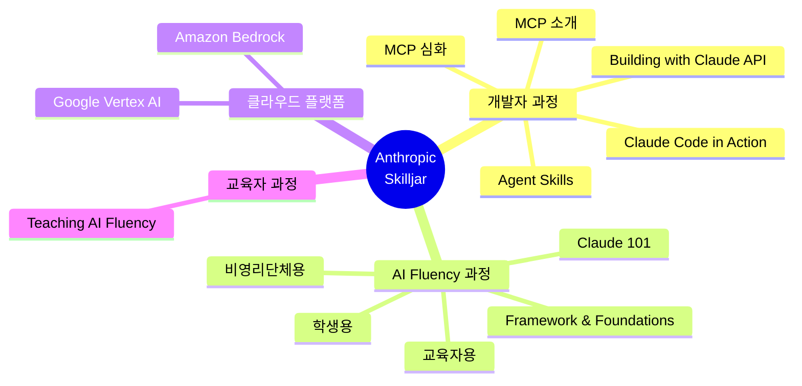
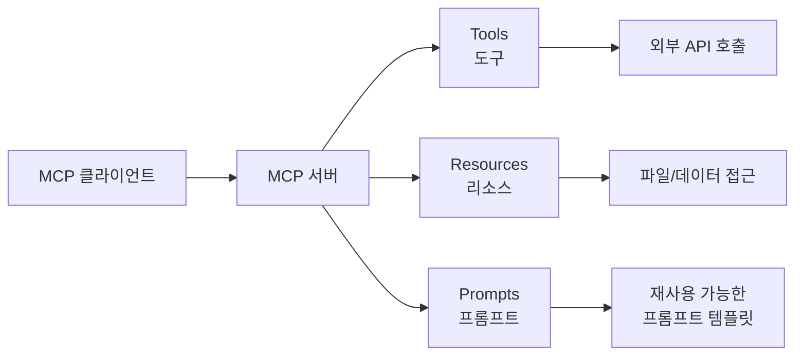
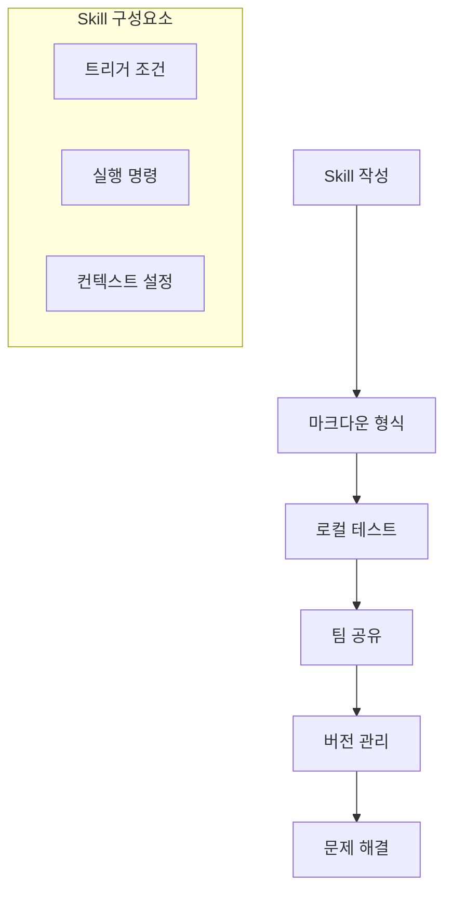
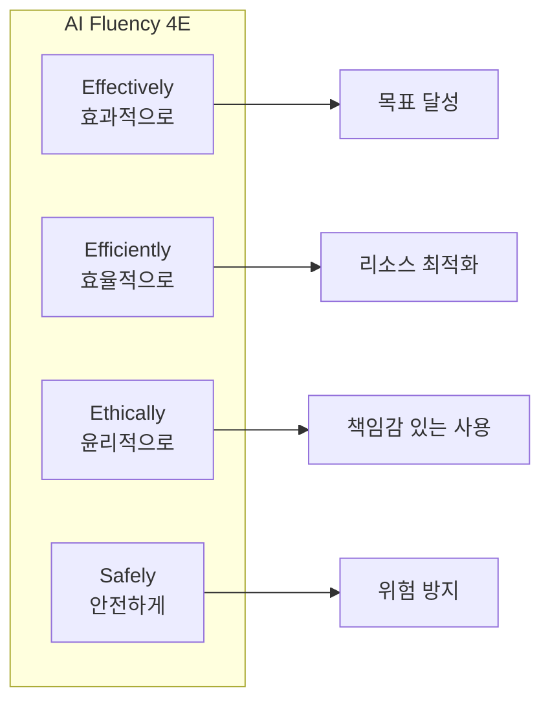
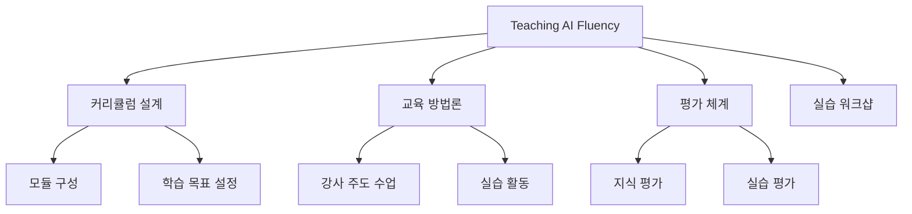
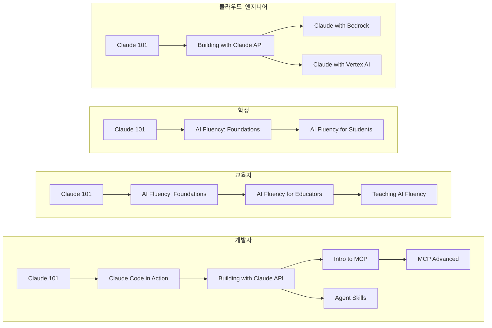

## 소개

Anthropic은 Claude AI를 효과적으로 활용할 수 있도록 다양한 공식 교육 과정을 **Skilljar** 플랫폼을 통해 무료로 제공하고 있습니다. 이 강좌들은 개발자, 교육자, 학생, 비영리 단체 등 다양한 대상을 위해 설계되었으며, Claude API 활용부터 Model Context Protocol(MCP), AI Fluency까지 폭넓은 주제를 다룹니다.

이 가이드에서는 Anthropic Skilljar에서 제공하는 **13개의 공식 강좌**를 카테고리별로 정리하고, 각 강좌의 학습 목표와 대상, 그리고 직접 수강할 수 있는 링크를 제공합니다.

<!--more-->

## Sources

- [Anthropic Courses](https://anthropic.skilljar.com/)

## 강좌 개요

Anthropic Skilljar는 다음 4개의 주요 카테고리로 강좌를 제공합니다:

---

## 개발자 과정 (Developer Courses)

개발자를 위한 과정은 Claude를 개발 워크플로우에 통합하고, API를 활용하며, Model Context Protocol을 구현하는 방법을 다룹니다.

### Claude Code in Action

**강좌 링크**: [https://anthropic.skilljar.com/claude-code-in-action](https://anthropic.skilljar.com/claude-code-in-action)

**설명**: Claude Code를 개발 워크플로우에 통합하는 방법을 배웁니다. 터미널 기반의 AI 코딩 어시스턴트를 효과적으로 활용하여 생산성을 극대화하는 방법을 다룹니다.

**대상**: Claude Code를 처음 사용하는 개발자, AI 기반 코딩 도구에 관심 있는 소프트웨어 엔지니어

**주요 학습 내용**:
- Claude Code 설치 및 설정
- 개발 워크플로우 통합 패턴
- 효과적인 프롬프트 작성 기법

---

### Building with the Claude API

**강좌 링크**: [https://anthropic.skilljar.com/building-with-the-claude-api](https://anthropic.skilljar.com/building-with-the-claude-api)

**설명**: Anthropic 모델을 Claude API를 통해 활용하는 전 과정을 포괄적으로 다루는 종합 과정입니다.

**대상**: Claude API를 활용한 애플리케이션 개발자, AI 서비스 구축 엔지니어

**주요 학습 내용**:
- API 인증 및 기본 요청
- 응답 처리 및 에러 핸들링
- 고급 기능 활용 (스트리밍, 토큰 관리 등)

---

### Introduction to Model Context Protocol

**강좌 링크**: [https://anthropic.skilljar.com/introduction-to-model-context-protocol](https://anthropic.skilljar.com/introduction-to-model-context-protocol)

**설명**: Python을 사용하여 Model Context Protocol(MCP) 서버와 클라이언트를 처음부터 구축하는 방법을 배웁니다. MCP의 세 가지 핵심 프리미티브인 **도구(Tools)**, **리소스(Resources)**, **프롬프트(Prompts)** 를 마스터하여 Claude를 외부 서비스와 연결합니다.

**대상**: MCP를 처음 접하는 개발자, Claude와 외부 시스템 연동에 관심 있는 엔지니어

**주요 학습 내용**:

- MCP 아키텍처 이해
- Python으로 MCP 서버 구축
- Tools, Resources, Prompts 구현

---

### Model Context Protocol: Advanced Topics

**강좌 링크**: [https://anthropic.skilljar.com/model-context-protocol-advanced-topics](https://anthropic.skilljar.com/model-context-protocol-advanced-topics)

**설명**: 프로덕션급 MCP 서버 개발을 위한 고급 구현 패턴을 다룹니다. 샘플링, 알림, 파일 시스템 접근, 전송 메커니즘 등을 학습합니다.

**대상**: MCP 기본 과정을 완료한 개발자, 프로덕션 환경에서 MCP를 활용하려는 엔지니어

**주요 학습 내용**:
- 샘플링(Sampling) 구현
- 알림(Notifications) 시스템
- 파일 시스템 접근 패턴
- 다양한 전송(Transport) 메커니즘

---

### Introduction to Agent Skills

**강좌 링크**: [https://anthropic.skilljar.com/introduction-to-agent-skills](https://anthropic.skilljar.com/introduction-to-agent-skills)

**설명**: Claude Code에서 **Skills**를 구축, 구성, 공유하는 방법을 배웁니다. Skills는 Claude가 적절한 작업에 적시에 자동으로 적용하는 재사용 가능한 마크다운 명령어입니다. 첫 번째 Skill 생성부터 팀 전체 배포 및 문제 해결까지 다룹니다.

**대상**: Claude Code 파워 유저, 팀 생산성 향상에 관심 있는 개발자

**주요 학습 내용**:

- Skill 기본 구조 이해
- 효과적인 Skill 작성 패턴
- 팀 내 배포 및 관리

---

## AI Fluency 과정 (AI Fluency Courses)

AI Fluency 과정은 AI 시스템과 효과적이고, 효율적이며, 윤리적이고 안전하게 협업하는 방법을 가르칩니다. 다양한 대상별로 맞춤화된 과정을 제공합니다.

### Claude 101

**강좌 링크**: [https://anthropic.skilljar.com/claude-101](https://anthropic.skilljar.com/claude-101)

**설명**: 일상 업무에 Claude를 활용하는 방법을 배우고, 핵심 기능을 이해하며, 다른 주제에 대한 고급 학습을 위한 리소스를 탐색합니다.

**대상**: Claude를 처음 사용하는 일반 사용자, AI 도구 입문자

**주요 학습 내용**:
- Claude 기본 기능 소개
- 일상 업무 활용 사례
- 고급 학습을 위한 로드맵

---

### AI Fluency: Framework & Foundations

**강좌 링크**: [https://anthropic.skilljar.com/ai-fluency-framework-foundations](https://anthropic.skilljar.com/ai-fluency-framework-foundations)

**설명**: AI 시스템과 **효과적(effectively)**, **효율적(efficiently)**, **윤리적(ethically)**, **안전하게(safely)** 협업하는 방법을 배웁니다.

**대상**: 모든 AI 사용자, AI 리터러시 향상이 필요한 전문가

**주요 학습 내용**:

- AI 협업 프레임워크
- 효과적인 프롬프팅
- 윤리적 AI 사용 가이드라인
- AI 안전성 기초

---

### AI Fluency for Educators

**강좌 링크**: [https://anthropic.skilljar.com/ai-fluency-for-educators](https://anthropic.skilljar.com/ai-fluency-for-educators)

**설명**: 교수, 교육 설계자, 교육 리더가 자신의 교육 실습과 기관 전략에 AI Fluency를 적용할 수 있도록 지원합니다.

**대상**: 대학 교수, 교육 설계자, 교육 기관 리더

**주요 학습 내용**:
- 교육 현장 AI 활용 전략
- AI 기반 교육 설계
- 기관 차원의 AI 도입 가이드

---

### AI Fluency for Students

**강좌 링크**: [https://anthropic.skilljar.com/ai-fluency-for-students](https://anthropic.skilljar.com/ai-fluency-for-students)

**설명**: 학생들이 책임감 있는 AI 협업을 통해 학습, 진로 계획, 학업 성공을 향상시키는 AI Fluency 스킬을 개발할 수 있도록 지원합니다.

**대상**: 고등교육 학생, AI 도구를 활용하려는 학습자

**주요 학습 내용**:
- 학습 효과 향상을 위한 AI 활용
- 진로 탐색과 AI
- 학업 성공을 위한 AI 스킬

---

### AI Fluency for Nonprofits

**강좌 링크**: [https://anthropic.skilljar.com/ai-fluency-for-nonprofits](https://anthropic.skilljar.com/ai-fluency-for-nonprofits)

**설명**: 비영리 단체 전문가가 조직의 영향력과 효율성을 높이면서도 미션과 가치를 유지할 수 있도록 AI Fluency를 개발합니다.

**대상**: 비영리 단체 직원, NGO 종사자, 사회적 영향력을 추구하는 전문가

**주요 학습 내용**:
- 비영리 분야 AI 활용 사례
- 조직 효율성 향상
- 미션 중심 AI 도입

---

## 클라우드 플랫폼 과정 (Cloud Platform Courses)

주요 클라우드 제공업체의 관리형 AI 서비스를 통해 Claude를 활용하는 방법을 다룹니다.

### Claude with Amazon Bedrock

**강좌 링크**: [https://anthropic.skilljar.com/claude-with-amazon-bedrock](https://anthropic.skilljar.com/claude-with-amazon-bedrock)

**설명**: AWS를 위해 만들어진 인증 프로그램의 일환으로, Anthropic이 AWS 직원을 위해 최초로 출시한 교육 과정의 전체 콘텐츠를 제공합니다.

**대상**: AWS 사용자, Amazon Bedrock에서 Claude를 활용하려는 개발자

**주요 학습 내용**:
- Amazon Bedrock 개요
- Claude 모델 배포 및 관리
- AWS 생태계 통합

---

### Claude with Google Cloud's Vertex AI

**강좌 링크**: [https://anthropic.skilljar.com/claude-with-google-cloud-vertex-ai](https://anthropic.skilljar.com/claude-with-google-cloud-vertex-ai)

**설명**: Google Cloud의 Vertex AI를 통해 Anthropic 모델을 활용하는 전 과정을 포괄적으로 다루는 과정입니다.

**대상**: Google Cloud 사용자, Vertex AI에서 Claude를 활용하려는 개발자

**주요 학습 내용**:
- Vertex AI 개요
- Claude 모델 배포 및 관리
- Google Cloud 생태계 통합

---

## 교육자 과정 (Teaching Courses)

AI Fluency를 다른 사람에게 가르치는 방법을 다루는 과정입니다.

### Teaching AI Fluency

**강좌 링크**: [https://anthropic.skilljar.com/teaching-ai-fluency](https://anthropic.skilljar.com/teaching-ai-fluency)

**설명**: 학계 교수, 교육 설계자 등이 강사 주도 환경에서 AI Fluency를 가르치고 평가할 수 있도록 지원합니다.

**대상**: AI Fluency 교육을 담당하는 교수자, 기업 교육 담당자

**주요 학습 내용**:

- AI Fluency 커리큘럼 설계
- 효과적인 교육 방법론
- 학습 성과 평가 방법

---

## 추천 학습 경로

대상별로 추천되는 학습 경로를 정리합니다:

### 대상별 추천 강좌

| 대상 | 첫 번째 강좌 | 필수 강좌 | 선택 강좌 |
|------|-------------|-----------|-----------|
| **개발자** | Claude 101 | Claude Code in Action, Building with Claude API | MCP 과정, Agent Skills |
| **교육자** | Claude 101 | AI Fluency: Foundations, AI Fluency for Educators | Teaching AI Fluency |
| **학생** | Claude 101 | AI Fluency: Foundations, AI Fluency for Students | - |
| **비영리 단체** | Claude 101 | AI Fluency: Foundations, AI Fluency for Nonprofits | - |
| **AWS 사용자** | Claude 101 | Claude with Amazon Bedrock | MCP 과정 |
| **GCP 사용자** | Claude 101 | Claude with Google Vertex AI | MCP 과정 |

---

## 핵심 요약

- **Anthropic Skilljar** 는 Claude AI 활용을 위한 **무료 공식 교육 플랫폼** 입니다
- 총 **13개의 강좌** 가 4개 카테고리(개발자, AI Fluency, 클라우드, 교육자)로 제공됩니다
- **개발자 과정** 은 Claude Code, API, MCP, Skills를 다룹니다
- **AI Fluency 과정** 은 효과적/효율적/윤리적/안전한 AI 협업을 가르칩니다
- **클라우드 과정** 은 Amazon Bedrock과 Google Vertex AI 통합을 다룹니다
- 모든 강좌는 **무료** 로 제공되며, 계정만 있으면 바로 수강할 수 있습니다

---

## 결론

Anthropic Skilljar는 Claude AI를 본격적으로 활용하고자 하는 모든 사용자에게 필수적인 학습 리소스입니다. 개발자라면 Claude Code와 MCP 과정부터 시작하고, 교육자와 학생은 AI Fluency 과정을 먼저 수강하는 것을 추천합니다. 모든 강좌가 무료로 제공되므로, Claude 생태계에 진입하는 데 비용 부담 없이 체계적으로 학습할 수 있습니다.

지금 바로 [Anthropic Courses](https://anthropic.skilljar.com/) 에서 학습을 시작해 보세요!
