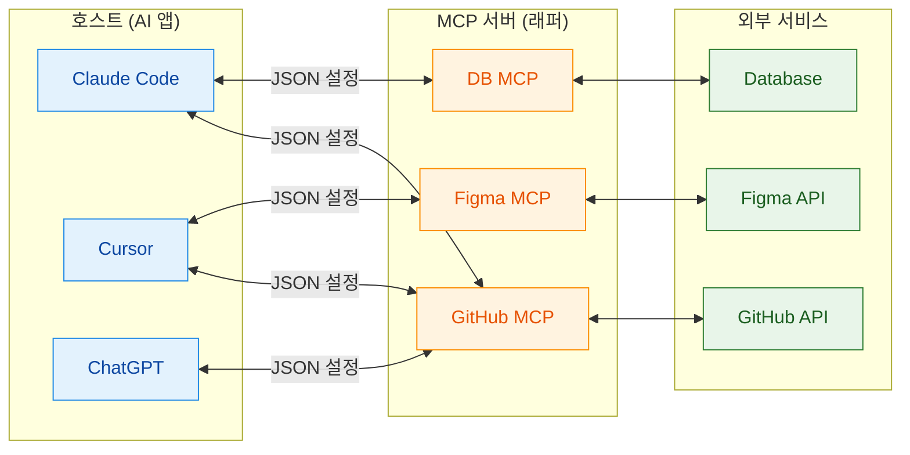
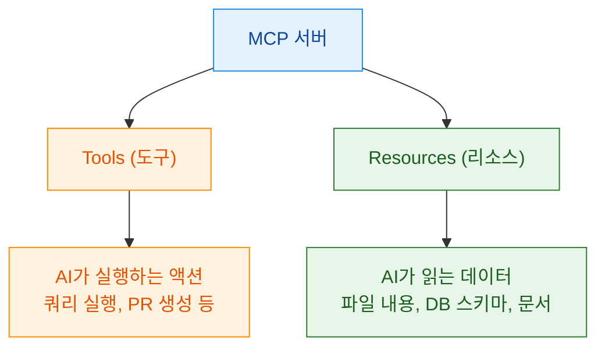
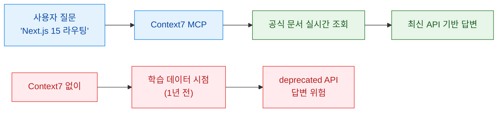
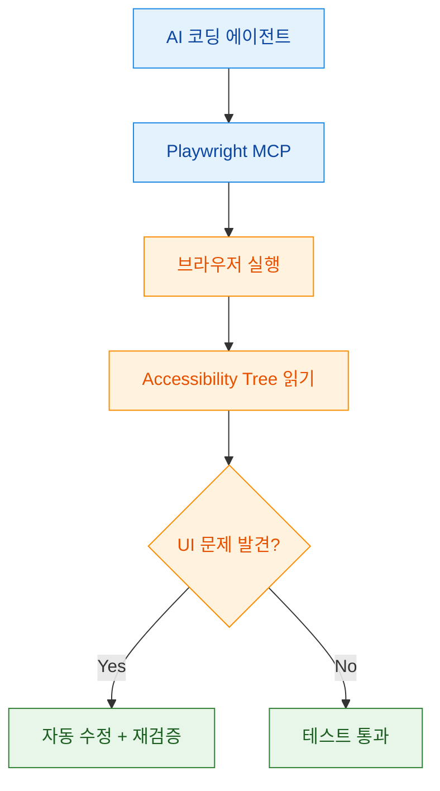
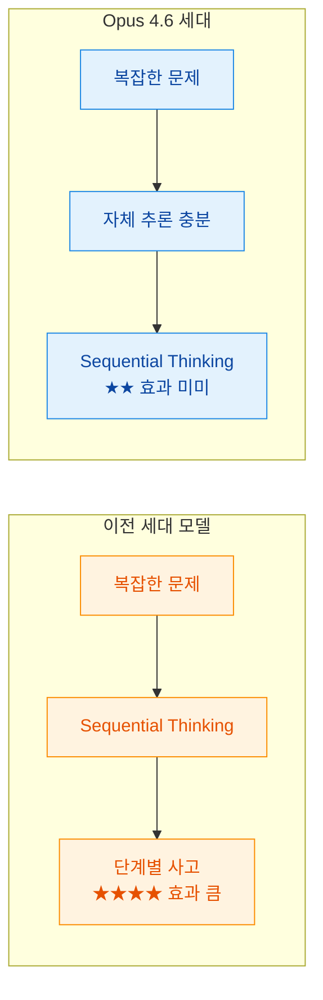
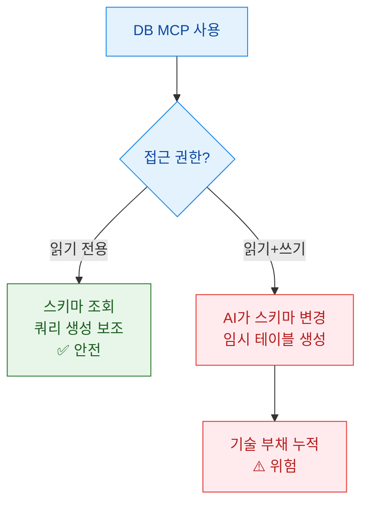
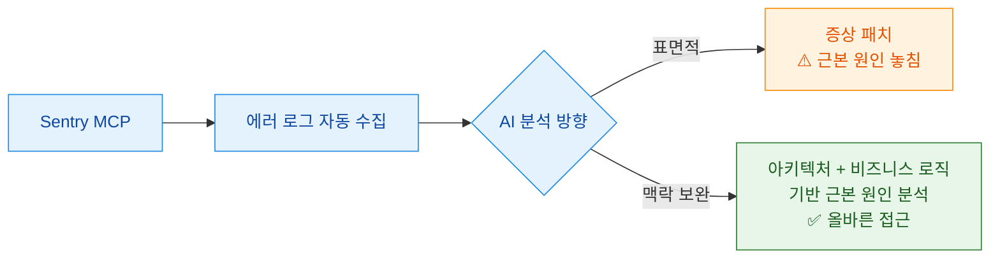
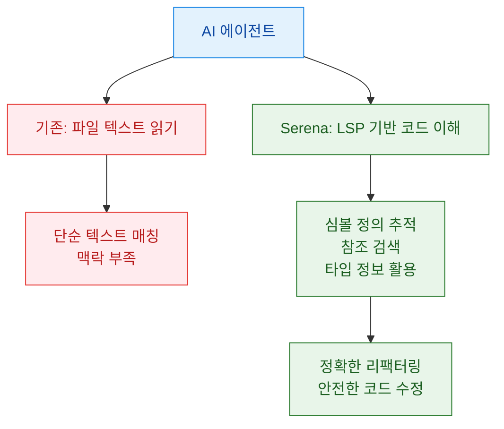
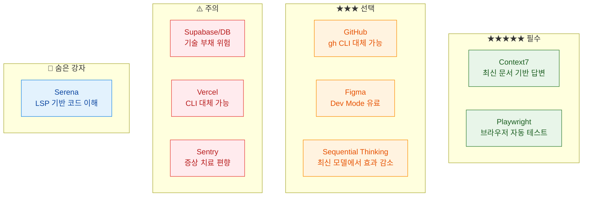
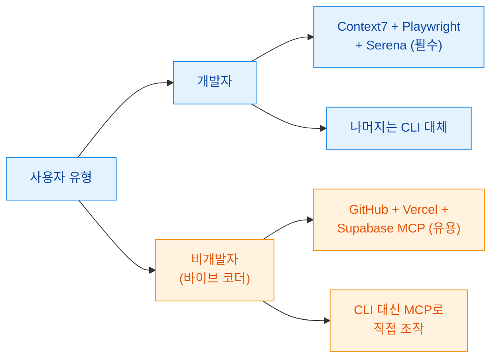

MCP(Model Context Protocol)는 AI에게 눈과 손을 달아주는 범용 연결 표준입니다. 하지만 영상 화자(김플립)의 핵심 메시지는 "무조건 깔아라"가 아니라 오히려 반대에 가깝습니다. MCP 서버가 수백 개지만 전부 설치할 필요 없고, 개발자라면 안 쓰는 게 더 나은 MCP도 많다는 것입니다. [근거](https://youtu.be/jHejYZLz6_U?t=60) 이 글에서는 10개월 실무 경험을 바탕으로 선별된 9개 MCP를 **필수**, **선택**, **주의** 로 분류해 정리합니다.

<!--more-->

## Sources

- https://www.youtube.com/watch?v=jHejYZLz6_U

## 1) MCP 개념과 아키텍처: AI 세계의 USB-C

MCP는 AI 도구(클로드 코드, 커서, ChatGPT 등)와 외부 서비스(GitHub, DB, Figma, Vercel 등)를 연결하는 **범용 표준 프로토콜** 입니다. 영상에서는 USB-C 비유로 설명합니다. 예전에 삼성은 마이크로 USB, 아이폰은 라이트닝으로 기기마다 케이블이 달랐듯이, MCP 이전에는 클로드용 연동 코드, 커서용 연동 코드를 각각 만들어야 했습니다. AI 도구 3개 × 서비스 5개면 15개의 연동이 필요했지만, MCP가 있으면 서비스당 MCP 서버 하나로 어디서든 쓸 수 있어 15개가 5개로 줄어듭니다. [근거](https://youtu.be/jHejYZLz6_U?t=130)

앤스로픽이 2024년 말에 오픈 프로토콜로 공개했고, 지금은 거의 모든 AI 코딩 도구가 지원합니다. [근거](https://youtu.be/jHejYZLz6_U?t=155)

### MCP 서버가 AI에게 주는 것

MCP 서버가 AI에게 제공하는 인터페이스는 크게 **두 가지** 입니다. [근거](https://youtu.be/jHejYZLz6_U?t=185)

### 설치 패턴

모든 클라이언트에서 설치 패턴이 동일합니다. JSON 설정 파일에 MCP 서버 정보를 적는 것이 핵심입니다. [근거](https://youtu.be/jHejYZLz6_U?t=200)

- **Claude Code**: 터미널에서 한 줄. `-s user`(글로벌) 또는 `-s project`(프로젝트 전용)
- **Cursor**: `mcp.json` 파일 편집
- **공통**: JSON 설정 파일이 생기고 자동 연결

### 증거 노트

- claim: MCP는 AI 세계의 USB-C — 범용 표준 연결 프로토콜
  - transcript quote/time marker: "USBC 같은 겁니다... 삼성은 마이크로 USB였고 아이폰은 라이트닝... MCP가 AI 세계의 USBC" (02:10~02:25)
  - video url: https://youtu.be/jHejYZLz6_U?t=130
  - confidence: high
- claim: MCP 이전에는 AI 도구 3개 × 서비스 5개 = 15개 연동 필요, MCP 후 5개로 감소
  - transcript quote/time marker: "AI 도구 세 개 서비스 다섯 개면 15개... MCP가 있으면... 5개로 줄어요" (02:25~02:40)
  - video url: https://youtu.be/jHejYZLz6_U?t=145
  - confidence: high
- claim: 앤스로픽이 2024년 말 오픈 프로토콜로 공개
  - transcript quote/time marker: "엔스로픽이 2024년 말에 오픈 프로토콜로 공개" (02:40~02:45)
  - video url: https://youtu.be/jHejYZLz6_U?t=155
  - confidence: high

## 2) 필수 MCP: Context7과 Playwright

### ★★★★★ Context7 MCP (#1 — 필수)

Context7은 AI가 **최신 공식 문서를 직접 가져와서 답변** 하도록 만드는 MCP입니다. 영상에서 "하나만 쓴다면 이것"이라고 강조한 만큼, 글로벌 설치가 필수라는 입장입니다. [근거](https://youtu.be/jHejYZLz6_U?t=240)

**왜 필요한가?** AI 모델은 학습 데이터 시점이 고정되어 있어서, 최신 라이브러리 업데이트를 모릅니다. Context7 없이 코딩하면 AI가 1년 전 API로 답변하는 상황이 발생합니다. Context7이 있으면 "Next.js 15 공식 문서 기반으로 답변해줘"라고 하면 실시간으로 최신 문서를 가져와 기반으로 답변합니다. [근거](https://youtu.be/jHejYZLz6_U?t=250)

**설치 팁**: 반드시 글로벌(`-s user`)로 설치해야 모든 프로젝트에서 사용 가능합니다. [근거](https://youtu.be/jHejYZLz6_U?t=265)

### ★★★★★ Playwright MCP (#2 — 거의 필수)

Playwright MCP는 AI가 **직접 브라우저를 열어서 테스트** 할 수 있게 해줍니다. 기존에는 "스크린샷 찍어서 보여줘"라고 사람이 해야 했던 걸, AI가 직접 브라우저를 열고 접근성 트리(accessibility tree)를 읽어서 요소를 파악합니다. [근거](https://youtu.be/jHejYZLz6_U?t=300)

**핵심 동작 방식**: 스크린샷 기반이 아니라 accessibility tree 기반입니다. 시각이 아닌 구조를 읽기 때문에 더 정확합니다. [근거](https://youtu.be/jHejYZLz6_U?t=315)

**글로벌 설치 권장** 이유: 프론트엔드 작업이 어느 프로젝트에서든 발생할 수 있으므로 글로벌이 편합니다. [근거](https://youtu.be/jHejYZLz6_U?t=310)

### 증거 노트

- claim: Context7은 "하나만 쓴다면 이것" — 글로벌 필수
  - transcript quote/time marker: "하나만 깔아라 하면 저는 이걸 깔라고 합니다" (04:00~04:05)
  - video url: https://youtu.be/jHejYZLz6_U?t=240
  - confidence: high
- claim: AI가 최신 공식 문서를 실시간으로 가져와 답변
  - transcript quote/time marker: "최신 공식 문서를 가져와서 그걸 기반으로 답변" (04:10~04:20)
  - video url: https://youtu.be/jHejYZLz6_U?t=250
  - confidence: high
- claim: Playwright MCP는 accessibility tree 기반으로 동작
  - transcript quote/time marker: "스크린샷이 아니라 접근성 트리를 읽어서" (05:15~05:20)
  - video url: https://youtu.be/jHejYZLz6_U?t=315
  - confidence: high

## 3) 선택적 MCP: GitHub, Figma, Sequential Thinking

### GitHub MCP (#3)

GitHub MCP는 AI가 직접 코드를 검색하고 PR을 만들고 이슈를 관리할 수 있게 합니다. 하지만 영상에서 명확하게 **`gh` CLI로 대부분 대체 가능** 하다고 언급합니다. 클로드 코드 사용자라면 터미널 접근이 가능하므로, `gh pr create`, `gh issue list` 같은 명령어로 같은 일을 할 수 있습니다. [근거](https://youtu.be/jHejYZLz6_U?t=360)

**추천 대상**: 비개발자로 터미널 사용이 어렵거나, Cursor처럼 직접 터미널 접근이 제한된 환경에서 유용합니다. [근거](https://youtu.be/jHejYZLz6_U?t=375)

### Figma MCP (#4)

Figma MCP는 AI가 **디자인 데이터를 직접 읽어서** 코드를 생성할 수 있게 합니다. 기존에 스크린샷을 캡처해서 전달하던 방식과 달리, 실제 디자인 토큰(색상, 간격, 타이포그래피)까지 정확히 가져옵니다. [근거](https://youtu.be/jHejYZLz6_U?t=420)

**주의점**: Figma **Dev Mode** 가 유료입니다. 무료 플랜에서는 제한적으로만 동작합니다. [근거](https://youtu.be/jHejYZLz6_U?t=440)

**대안**: 스크린샷 + AI 비전으로도 대략적인 결과를 얻을 수 있으므로, 정밀 디자인 시스템이 필요한 경우에만 도입을 고려하는 것이 합리적입니다.

### Sequential Thinking MCP (#5)

Sequential Thinking은 AI의 **사고 과정을 구조화** 하는 MCP입니다. 복잡한 문제를 단계별로 나눠서 생각하도록 유도합니다. [근거](https://youtu.be/jHejYZLz6_U?t=480)

**하지만** 영상에서 중요한 포인트를 짚습니다. **Opus 4.6 같은 최신 모델은 자체적으로 충분히 똑똑해졌기 때문에** 예전만큼 필요하지 않습니다. 이전 세대 모델(Sonnet 3.5 시절)에서는 효과가 컸지만, 최신 모델에서는 성능 향상이 미미하거나 오히려 토큰 낭비일 수 있습니다. [근거](https://youtu.be/jHejYZLz6_U?t=500)

### 증거 노트

- claim: GitHub MCP는 `gh` CLI로 대체 가능
  - transcript quote/time marker: "gh CLI로 다 됩니다... 클로드 코드 쓰면 터미널 접근 되니까" (06:00~06:10)
  - video url: https://youtu.be/jHejYZLz6_U?t=360
  - confidence: high
- claim: Figma MCP는 Dev Mode 유료 필요
  - transcript quote/time marker: "데브 모드가 유료예요" (07:20~07:25)
  - video url: https://youtu.be/jHejYZLz6_U?t=440
  - confidence: high
- claim: Sequential Thinking은 Opus 4.6에서 필요성 감소
  - transcript quote/time marker: "오퍼스 4.6이 너무 똑똑해져서... 예전만큼 효과가 크지 않" (08:20~08:25)
  - video url: https://youtu.be/jHejYZLz6_U?t=500
  - confidence: high

## 4) 주의가 필요한 MCP: Supabase/DB, Vercel, Sentry

### Supabase/DB MCP (#6 — 주의)

DB MCP는 AI가 **데이터베이스 스키마를 직접 읽고 쿼리를 실행** 할 수 있게 합니다. 편리하지만 영상에서 **기술 부채 위험** 을 강하게 경고합니다. [근거](https://youtu.be/jHejYZLz6_U?t=540)

**위험 시나리오**: AI가 빠른 구현을 위해 DB 스키마를 마음대로 변경하거나, 임시 테이블을 만들거나, 인덱스 없는 쿼리를 생성할 수 있습니다. MVP 수준에서는 괜찮지만, 프로덕션 환경에서는 심각한 기술 부채로 이어질 수 있습니다.

**실무 권장**: 읽기 전용으로 제한하거나, 스키마 변경은 별도 마이그레이션 도구를 통해서만 허용하는 것이 안전합니다. [근거](https://youtu.be/jHejYZLz6_U?t=560)

### Vercel MCP (#7 — 대체 가능)

Vercel MCP는 배포 상태 확인, 환경변수 관리, 로그 조회 등을 AI가 직접 할 수 있게 합니다. 하지만 **Vercel CLI로 대체 가능** 합니다. `vercel deploy`, `vercel env` 등의 커맨드로 같은 작업을 수행할 수 있습니다. [근거](https://youtu.be/jHejYZLz6_U?t=620)

**추천 대상**: Vercel을 주력 배포 플랫폼으로 사용하면서 CLI에 익숙하지 않은 경우에만 유용합니다.

### Sentry MCP (#8 — 주의)

Sentry MCP는 AI가 **실시간 에러 로그를 분석** 할 수 있게 합니다. 에러 발생 시 스택 트레이스를 자동으로 읽고 원인을 추론합니다. [근거](https://youtu.be/jHejYZLz6_U?t=680)

**주의점**: 영상에서 "증상 처리에 치우칠 수 있다"고 경고합니다. AI가 Sentry 에러 로그만 보면 근본 원인이 아닌 표면적 증상만 고치는 방향으로 갈 수 있습니다. 에러 로그는 "무엇이 깨졌는지"를 알려주지만 "왜 깨졌는지"는 별도의 맥락(아키텍처, 비즈니스 로직)이 필요합니다. [근거](https://youtu.be/jHejYZLz6_U?t=700)

### 증거 노트

- claim: DB MCP는 기술 부채 위험이 있어 읽기 전용 권장
  - transcript quote/time marker: "기술 부채가 엄청 쌓이기 시작... 읽기 전용으로" (09:00~09:15)
  - video url: https://youtu.be/jHejYZLz6_U?t=540
  - confidence: high
- claim: Vercel MCP는 Vercel CLI로 대체 가능
  - transcript quote/time marker: "버셀 CLI로 다 됩니다" (10:20~10:25)
  - video url: https://youtu.be/jHejYZLz6_U?t=620
  - confidence: high
- claim: Sentry MCP는 증상 처리에 치우칠 수 있음
  - transcript quote/time marker: "증상만 고치는 쪽으로... 근본 원인을 놓칠 수" (11:20~11:30)
  - video url: https://youtu.be/jHejYZLz6_U?t=700
  - confidence: high

## 5) 숨은 강자: Serena MCP

Serena MCP는 **MCP + LSP(Language Server Protocol)** 를 조합해서 AI에게 IDE 수준의 코드 이해력을 부여합니다. 단순히 파일을 텍스트로 읽는 것이 아니라, 심볼 정의, 참조, 타입 정보까지 파악할 수 있게 됩니다. [근거](https://youtu.be/jHejYZLz6_U?t=760)

**클로드 코드와의 시너지**: 클로드 코드가 이미 터미널 접근과 파일 편집을 할 수 있는 상태에서, Serena가 LSP 기반 코드 네비게이션을 추가하면 AI가 "이 함수를 누가 호출하는지", "이 타입의 정의가 어디인지"를 정확히 파악하면서 작업할 수 있습니다. [근거](https://youtu.be/jHejYZLz6_U?t=780)

### 증거 노트

- claim: Serena는 MCP+LSP 조합으로 AI에게 IDE 수준의 눈을 달아줌
  - transcript quote/time marker: "LSP를 사용해서... IDE가 보는 걸 AI도 본다" (12:40~12:50)
  - video url: https://youtu.be/jHejYZLz6_U?t=760
  - confidence: high
- claim: 클로드 코드와 시너지가 큼
  - transcript quote/time marker: "클로드 코드랑 쓰면 시너지가 엄청 큽니다" (13:00~13:05)
  - video url: https://youtu.be/jHejYZLz6_U?t=780
  - confidence: high

## 6) MCP 9개 한눈에 비교

| MCP | 등급 | 핵심 기능 | 대안 | 추천 대상 |
|-----|------|-----------|------|-----------|
| Context7 | ★★★★★ 필수 | 최신 공식 문서 기반 답변 | 없음 | 모든 개발자 |
| Playwright | ★★★★★ 필수 | 브라우저 자동 테스트 | 수동 스크린샷 | 프론트엔드 작업자 |
| GitHub | ★★★ 선택 | 코드 검색, PR, 이슈 | `gh` CLI | CLI 미숙련자 |
| Figma | ★★★ 선택 | 디자인 데이터 직접 읽기 | 스크린샷 + AI 비전 | 디자인 시스템 운영팀 |
| Sequential Thinking | ★★ 선택 | AI 사고 구조화 | 최신 모델 자체 추론 | 구형 모델 사용자 |
| Supabase/DB | ⚠️ 주의 | DB 스키마 읽기/쿼리 | 수동 스키마 전달 | 읽기 전용 한정 |
| Vercel | ★★ 선택 | 배포/환경변수 관리 | Vercel CLI | CLI 미숙련자 |
| Sentry | ⚠️ 주의 | 실시간 에러 분석 | 수동 로그 전달 | 맥락 보완 전제 하 |
| Serena | ★★★★ 추천 | LSP 기반 코드 이해 | 없음 | 대규모 코드베이스 |

## 실전 적용 포인트

영상 후반부에서 화자가 강조하는 실전 원칙들을 정리합니다. [근거](https://youtu.be/jHejYZLz6_U?t=900)

### 1. CLI로 되는 건 CLI로

MCP의 편리함에 빠져서 모든 걸 MCP로 해결하려 하지 말 것. `gh`, `vercel`, `supabase` 등 CLI 도구가 이미 있다면 MCP보다 CLI가 더 빠르고 안전합니다. MCP는 CLI로 할 수 없거나 비효율적인 작업에만 쓰는 것이 원칙입니다. [근거](https://youtu.be/jHejYZLz6_U?t=920)

### 2. 보안: 읽기 전용 + 환경변수

MCP를 통해 AI에게 서비스 접근 권한을 줄 때, **읽기 전용을 기본값** 으로 설정하고, API 키는 반드시 **환경변수** 로 관리해야 합니다. JSON 설정 파일에 직접 키를 넣으면 git에 올라갈 수 있습니다. [근거](https://youtu.be/jHejYZLz6_U?t=940)

### 3. 무조건 다 깔지 말 것

MCP 서버가 많아질수록 AI의 컨텍스트 윈도우를 차지합니다. 불필요한 MCP가 설치되어 있으면 AI가 더 혼란스러워질 수 있습니다. 필요한 것만 선택적으로 설치하는 것이 핵심입니다. [근거](https://youtu.be/jHejYZLz6_U?t=60)

### 4. 개발자 vs 비개발자 — MCP 전략이 다르다

- **개발자**: CLI와 IDE를 직접 사용할 수 있으므로, MCP는 Context7 + Playwright + Serena 정도만 필수. 나머지는 CLI로 대체 가능
- **비개발자(바이브 코더)**: 터미널 접근이 어려우므로, GitHub, Vercel, Supabase MCP가 오히려 게임 체인저. "내가 몰라도 AI가 알아서" 가능 [근거](https://youtu.be/jHejYZLz6_U?t=70)

### 증거 노트

- claim: CLI로 되는 건 CLI로 — MCP 남용 경계
  - transcript quote/time marker: "CLI로 되는 건 CLI로 하세요" (15:00~15:05)
  - video url: https://youtu.be/jHejYZLz6_U?t=920
  - confidence: high
- claim: 보안 — 읽기 전용 기본, 환경변수로 키 관리
  - transcript quote/time marker: "읽기 전용... 환경변수로 관리" (15:40~15:50)
  - video url: https://youtu.be/jHejYZLz6_U?t=940
  - confidence: high
- claim: 비개발자에게는 MCP가 게임 체인저
  - transcript quote/time marker: "바이브 코딩으로 빠르게 뭔가 만들어야 하는 분들한테는 MCP가 진짜 게임 체인저" (01:10~01:15)
  - video url: https://youtu.be/jHejYZLz6_U?t=70
  - confidence: high

## 결론

MCP의 미래에 대해 화자는 "에이전트가 스스로 MCP를 찾아서 연결하는 세상"을 전망합니다. 지금은 사람이 JSON 설정 파일에 수동으로 MCP를 등록하지만, 곧 AI가 필요한 도구를 스스로 발견하고 연결하는 시대가 올 것이라는 예측입니다. [근거](https://youtu.be/jHejYZLz6_U?t=1000)

하지만 현 시점에서의 실전 요약은 명확합니다.

1. **필수 설치**: Context7 (글로벌), Playwright (글로벌)
2. **강력 추천**: Serena (대규모 프로젝트)
3. **선택적 도입**: GitHub, Figma, Sequential Thinking (상황 따라)
4. **주의해서 사용**: Supabase/DB (읽기 전용), Sentry (맥락 보완 필수), Vercel (CLI 대체 가능)
5. **원칙**: CLI로 되는 건 CLI로, 읽기 전용 기본, 환경변수로 키 관리, 무조건 다 깔지 말 것

MCP는 강력한 도구지만, 도구의 가치는 선택과 제한에서 나옵니다.
