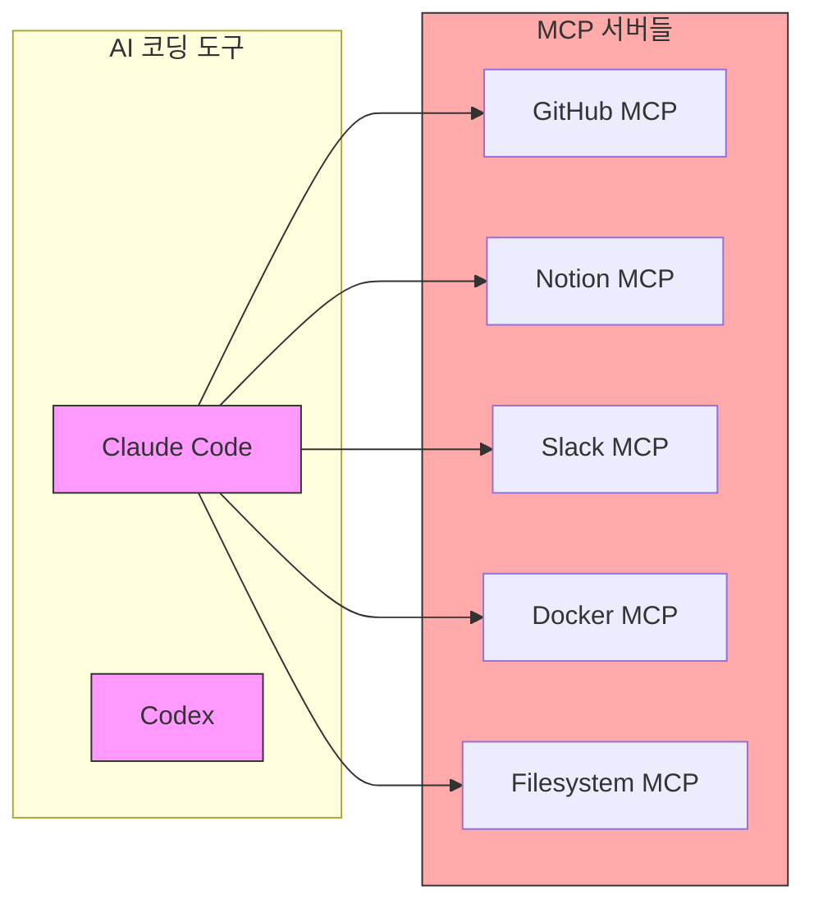
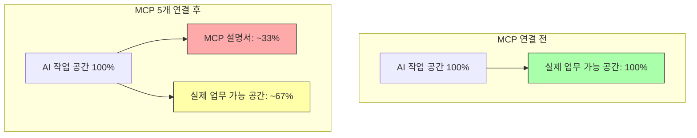
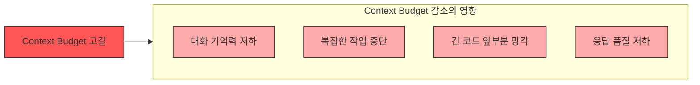
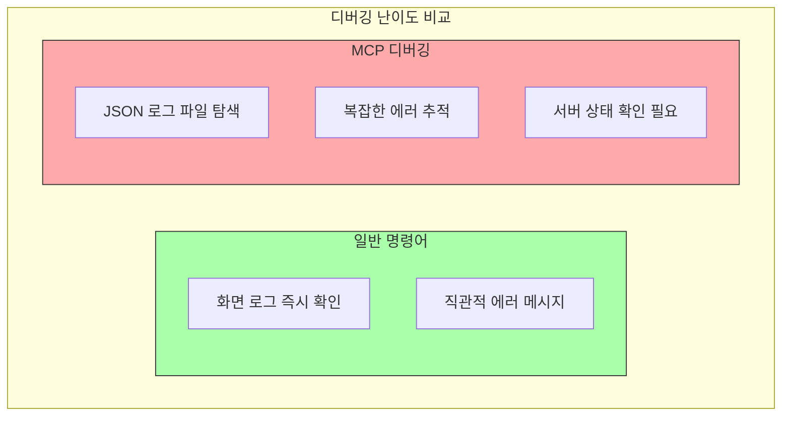
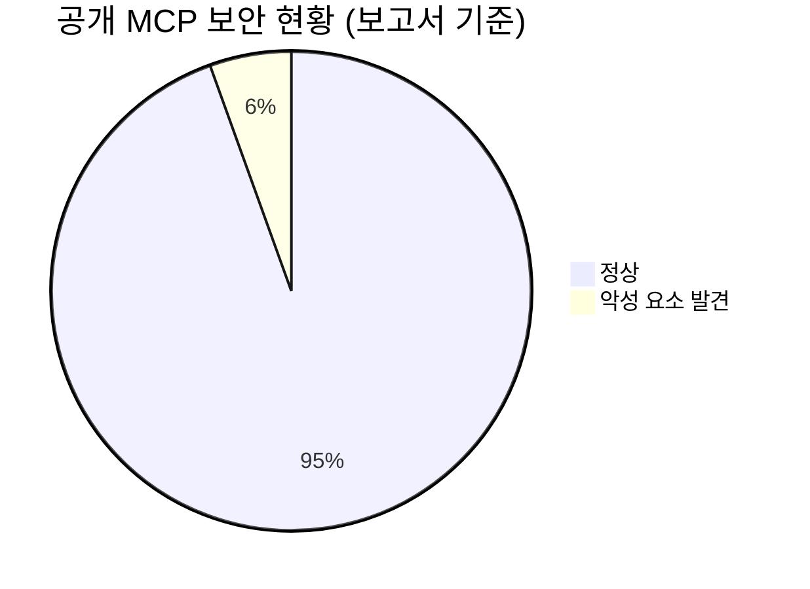
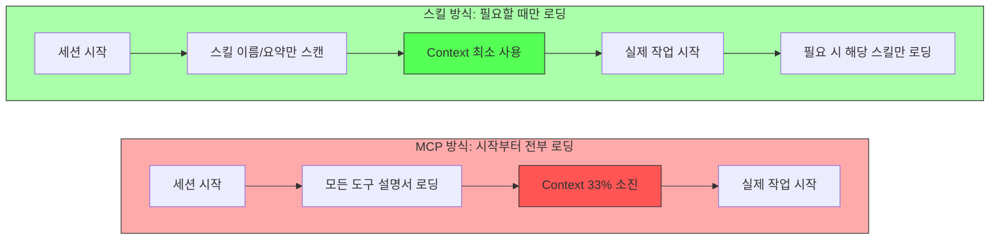
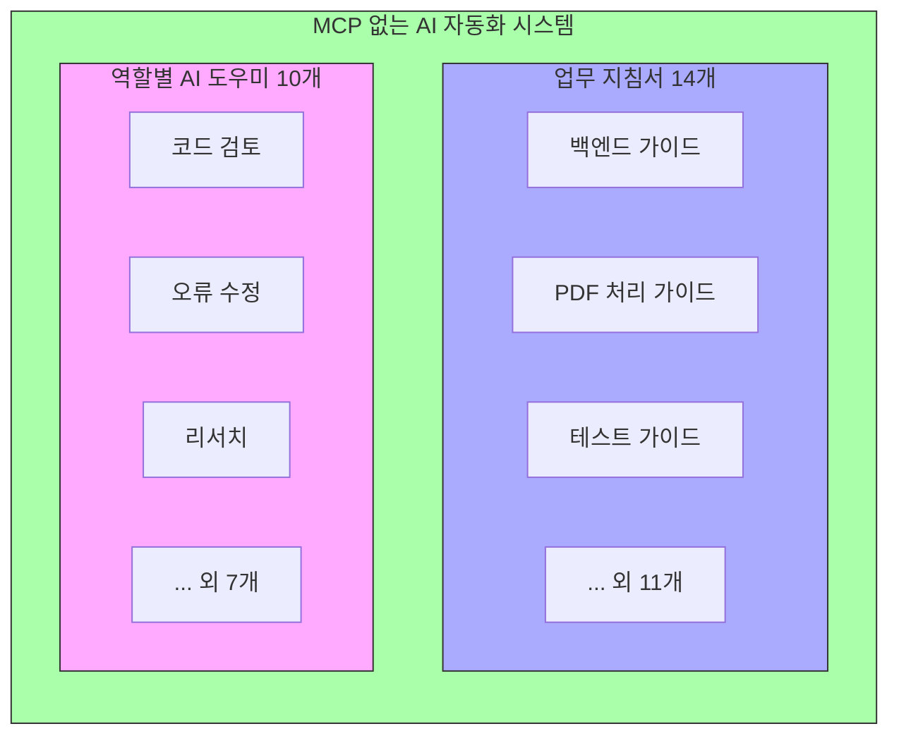
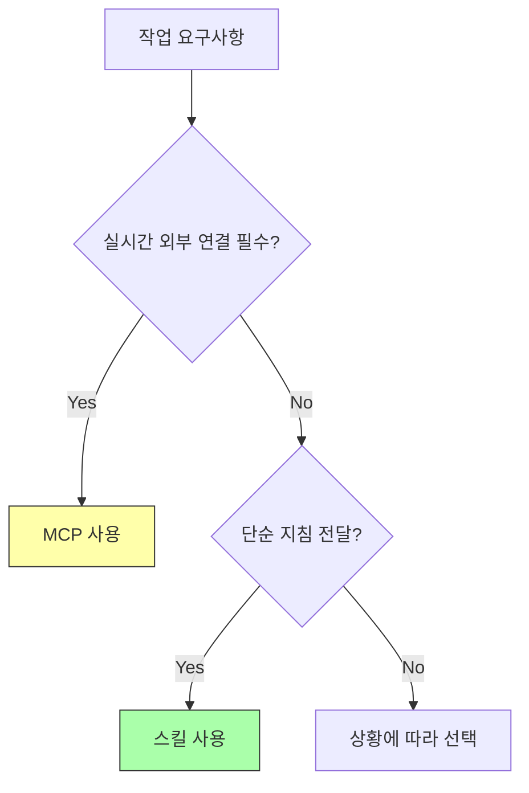

클로드한테 "안녕"이라고 한 마디 쳤더니 AI의 작업 공간 절반이 그냥 사라졌습니다. 코드 한 줄 안 썼어요. 그냥 인사 한 번 했는데요. AI 쓰시는 분들 혹시 이거 알고 계셨어요? 설정 하나 잘못해 놓으면 AI가 실제로 일할 공간이 절반도 안 남아요. 아무것도 안 했는데요.

<!--more-->

## Sources

- [MCP is DEAD - 메이커 에반 | Maker Evan](https://youtu.be/JZW2W5rwsD4)

---

## MCP란 무엇인가

요즘 클로드 코드(Claude Code)나 코덱스(Codex) 같은 AI 코딩 도구 쓰시는 분들 많잖아요. 이런 도구들에 **MCP**(Model Context Protocol)라는 걸 연결할 수 있어요.

- **GitHub MCP** 연결하면 AI가 코드 저장소를 직접 들여다보고
- **Notion MCP** 연결하면 문서를 읽어와요
- **Slack MCP** 연결하면 메시지도 보낼 수 있고요
- 심지어 내 컴퓨터 파일을 AI가 직접 열어보게 할 수도 있어요

MCP 이름은 복잡한데 그냥 **AI한테 외부 앱을 연결해 주는 방식**이에요. 처음엔 진짜 편해 보이거든요. 연결만 해 놓으면 AI가 알아서 다 해 주는 것 같고. 근데 있잖아요. 바로 거기서부터 문제가 시작돼요.

## 문제의 핵심: Context Budget 고갈

AI한테는 한 번에 볼 수 있는 정보의 양이 정해져 있어요. 이 공간이 충분해야 AI도 제대로 일할 수 있어요. 쉽게 말하면 **AI의 단기 기억 용량**이에요.

MCP를 연결하면 대화가 시작되는 순간 연결된 모든 MCP의 **도구 설명서가 이 공간에 통째로 쌓여요**. 오늘 그 도구를 쓸지 안 쓸지랑 상관없이요.

- GitHub 관련 작업이 전혀 없어도 GitHub MCP가 연결돼 있으면 GitHub 설명서가 자동으로 다 로딩돼요

### 레스토랑 비유

레스토랑에 비유하면 이래요.

> 파스타 하나 시키려고 들어갔는데 웨이터가 메뉴 2박 자리를 처음부터 끝까지 전부 읽어 줘요.

그 낭비되는 시간이 MCP가 먹는 공간이에요.

더 심각한 건 MCP가 많을수록 이 낭비가 **기하급수적으로 커진다**는 거예요. GitHub MCP, Notion MCP, Slack MCP, Docker MCP 다 연결해 놓으면 AI가 진짜 일을 시작하기도 전에 이미 작업 공간 상당 부분이 사용 안 할 설명서로 꽉 차 있는 거예요.

### 구체적인 수치

| MCP 구성 | 도구 수 | 작업 공간 점유율 |
|---------|--------|----------------|
| MCP 1개 (도구 50개) | 50개 | 10~15% |
| MCP 5개 연결 | ~250개 | **약 33%** |
| MCP 10개 연결 | ~500개 | **60% 이상** |

**MCP 서버 다섯 개 연결해 놓으면 시작 전부터 작업 공간에 1/3 가까이가 없어져요.** AI가 실제 작업할 공간이 그만큼 줄어드는 거예요.

### 왜 이게 치명적인가

이게 단순히 느려지는 문제가 아니에요. AI가 한 번에 볼 수 있는 공간이 줄어들수록:

- 긴 대화를 기억 못 하고
- 복잡한 작업을 중간에 놓치고
- 코드가 길어지면 앞부분을 잊어버려요

> 마치 사무실 책상 위에도 안 읽는 서류 박스를 잔뜩 쌓아두고 그 위에서 노트북으로 일하는 것처럼요.

## MCP의 실전 문제점들

공간 낭비 문제는 사실 시작일 뿐이에요. 실제로 MCP를 써본 개발자들이 겪는 문제는 더 구체적이에요.

### 1. MCP가 자주 죽어요

MCP는 AI 뒤에서 별도로 돌아가는 프로그램이에요. 근데 이게 생각보다 자주 꺼져요.

- 갑자기 연결이 끊기거나
- 아예 처음부터 실행이 안 되거나

그러면 클로드 코드 같은 AI 도구 전체를 껐다 켜야 되는 경우가 생겨요. 작업 중이던 흐름이 다 끊기는 거죠.

> 비유하자면 회의하다가 통역사가 갑자기 자리를 뜨는 것처럼요. 그냥 통역사 없이 진행하면 되는데 이 시스템에서는 통역사 없으면 아무것도 못 해요.

### 2. 계속 로그인을 다시 해야 돼요

Notion, GitHub, Slack 같은 서비스를 연결하려면 인증이 필요해요. 근데 MCP는 이 인증을 안정적으로 유지하는 게 생각보다 어려워요.

> 좀 쓰다 보면 "다시 로그인해 주세요"가 자주 뜨는 거예요. 번거롭죠?

### 3. 권한 제어가 불가능해요

AI한테 "이것만 봐" 하고 제한을 걸 수가 없어요.

- 예를 들어 AI한테 파일을 **읽기만** 하고 싶은데
- MCP는 읽기/쓰기 권한을 세밀하게 나눌 수가 있긴 한데
- 보통은 읽기/쓰기 권한 둘 다 열어 버리는 경우가 많아요

그냥 연결하면 AI가 다 접근할 수 있는 구조입니다. 보안적으로 찜찜한 부분이죠.

### 4. 디버깅이 너무 어려워요

뭔가 잘못됐을 때 원인을 찾기가 너무 어려워요.

- MCP에서 오류가 나면 **JSON 형식의 로그를 직접 뒤져야** 돼요
- 비개발자는 물론이고 개발자도 고통스러운 작업이에요
- 반면 일반 명령어는 화면에 로그가 그대로 뜨거든요

### 5. 마케팅 체크리스트가 돼버린 MCP

최근에 이런 이야기도 나오고 있어요.

> MCP를 지원한다는 게 이제 마케팅 체크리스트처럼 됐다.

무슨 말이냐면 회사들이 실제로 MCP가 필요해서 만드는 게 아니라 **"우리도 MCP 됩니다"라는 말을 홍보에 쓰기 위해 만든다**는 거예요. 실속은 없는데 타이틀만 붙이는 거죠.

실제로 일부 AI 도구들은 MCP 지원을 조용히 줄이거나 다른 방식으로 전환하는 추세예요. 클로드를 만든 Anthropic도 이 문제들을 인지하고 있는 상황입니다.

## 보안 문제: 5.5%의 악성 MCP

보안도 문제예요.

> 공개된 MCP 중 **5.5%에서 악성 요소가 발견됐다**는 보고서도 있어요.

사용자 모르게 정보를 빼가는 방식이 이미 실제로 발견됐다는 이야기예요. MCP는 외부 서버에 연결되어 그 서버가 뭘 하는지, 뭘 바꿨는지 사용자가 알기 어렵기 때문이에요.

## 더 나은 대안: 스킬(Skills)

그러면 뭐가 더 나은 방법이냐? 그건 바로 **스킬(Skills)** 이라고 생각합니다.

### 도서관 사서 비유

도서관 사서로 비유하면 이해가 빨라요.

- 사서는 도서관에 있는 책 수만 권을 **전부 외우고 있지 않아요**
- 어느 서가에 어떤 분야 책이 있는지만 알아요
- 누군가 "요리책 필요해요"라고 하면 그때 요리 서가로 가서 **딱 그 책만 꺼내 줘요**
- 나머지 수만 권은 그냥 서가에 꽂혀 있어요

### 스킬의 작동 방식

스킬이 정확히 이 방식이에요.

1. AI가 세션을 시작할 때 각 스킬의 **이름과 한 줄 요약만** 읽어요
2. 실제로 그 스킬이 필요한 작업이 들어왔을 때 **그때만** 해당 스킬의 내용 전체를 꺼내 읽어요
3. 그 외 스킬들은 서가에 꽂혀 있는 책처럼 **공간을 거의 차지하지 않아요**

**결과적으로 AI의 작업 공간 대부분이 진짜 일을 위해 남아 있어요.**

- 더 긴 대화를 기억하고
- 더 복잡한 코드를 다루고
- 더 정확하게 일해요

> MCP가 "일단 다 꺼내 놓고 시작하는 방식"이라면 스킬은 "필요할 때만 꺼내는 방식"이라고 보시면 될 것 같아요.

### 스킬의 구조적 장점

스킬은 구조 자체가 달라요.

| 특성 | MCP | 스킬 |
|-----|-----|------|
| 위치 | 외부 서버 | 내 컴퓨터 폴더 |
| 투명성 | 알기 어려움 | 파일 직접 확인 가능 |
| 수정 | 서버 의존 | 언제든 수정 가능 |
| 삭제 | 복잡한 연결 해제 | 파일 삭제로 완료 |
| 디버깅 | JSON 로그 분석 | 일반 텍스트 확인 |

> MCP가 AI 뒤에서 뭔가 돌아가는 복잡한 프로그램이라면 스킬은 **AI한테 주는 업무 매뉴얼**이에요.

## 실전 검증: MCP 없이 구축한 자동화 시스템

이게 이론이 아니라 실전에서 이미 증명이 됐어요.

GitHub에 **MCP 없이 스킬만 써서 AI 자동화 시스템을 구축한 오픈소스 프로젝트**가 있어요.

### 구축 내용

1. **AI한테 줄 업무 지침서 14개**
   - 백엔드 만들 때는 이렇게
   - PDF 처리할 때는 이렇게
   - 테스트할 때는 이렇게
   - 이런 것들이요

2. **역할별 AI 도우미 10개**
   - 코드 검토 전문
   - 오류 수정 전문
   - 인터넷 리서치 전문

**이게 다 MCP 없이 돌아가요.**

> 무거운 도구를 잔뜩 연결하는 게 아니라 **AI한테 일하는 방법을 잘 가르쳐 주는 것**. 이게 지금 AI를 잘 쓰는 팀들이 실제로 가는 방향이에요.

## MCP가 여전히 유용한 경우

그렇다고 MCP를 꼭 안 쓰는 건 아닙니다. MCP가 진짜 빛나는 순간도 있거든요.

### MCP가 필요한 상황

- AI가 **실시간으로 데이터베이스에서 숫자를 가져와야** 할 때
- **외부 API를 직접 호출해야** 할 때
- 외부 시스템과 **실시간 연결이 꼭 필요한** 상황

### 스킬로 충분한 상황

하지만 대부분의 경우는 그렇지 않아요.

- AI한테 "이 방식으로 이래라"고 알려주는 거라면 **스킬로도 충분히 가능해요**

## 핵심 요약

| 문제/해결 | 내용 |
|----------|------|
| **MCP의 근본 문제** | 연결된 모든 도구의 설명서를 세션 시작 시 전부 로딩하여 Context Budget 고갈 |
| **구체적 수치** | MCP 5개 연결 시 작업 공간 1/3 소진, 도구 50개당 10~15% 점유 |
| **실전 문제** | 잦은 크래시, 반복 인증 요구, 권한 제어 불가, 디버깅 난이도 높음 |
| **보안 이슈** | 공개 MCP의 5.5%에서 악성 요소 발견 |
| **스킬의 장점** | 필요할 때만 로딩, 폴더 기반 투명성, Context Budget 최소 사용 |
| **실전 검증** | MCP 없이 14개 지침서 + 10개 역할별 AI로 완전한 자동화 구축 가능 |
| **선택 기준** | 실시간 외부 연결 필수 시 MCP, 단순 지침 전달 시 스킬 |

## 결론

정리해 볼게요.

1. **MCP를 잔뜩 연결해 놓으면** AI가 대화 시작하기도 전에 작업 공간이 설명서로 꽉 차요. 쓰지도 않을 도구 설명서를 매번 전부 읽는 구조니까요. 클로드 만든 회사도 이걸 버그가 아닌 정상 동작이라고 했어요.

2. **거기다 MCP는** 안정성 문제, 반복 인증, 권한 제어 부재, 디버깅 어려움까지 줄줄이 따라와요. 그래서 개발자들 사이에서 **"MCP는 죽었다"** 라는 말이 나오는 거고요.

3. **보안도 문제예요.** 공개된 MCP 중 5.5%에서 악성 요소가 발견됐다는 보고서도 있어요. 사용자 모르게 정보를 빼가는 방식이 이미 실제로 발견됐다는 이야기도 있고요.

4. **스킬은 달라요.** 필요할 때만 꺼내 봐요. 도서관 사서처럼 요청이 왔을 때 그 책만 가져와요. 외부 서버 없이 내 폴더, 내 파일로 투명하게 운영이 가능합니다.

5. **실전에서도 이미 검증이 됐어요.** MCP 없이도 복잡한 자동화를 전부 돌릴 수 있어요.

**방향은 정해져 있습니다.** 잔뜩 연결하는 게 아니라 **잘 가르치는 스킬을 쓰는 게 핵심**입니다.
