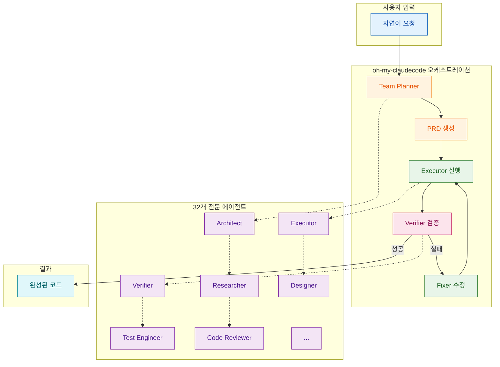
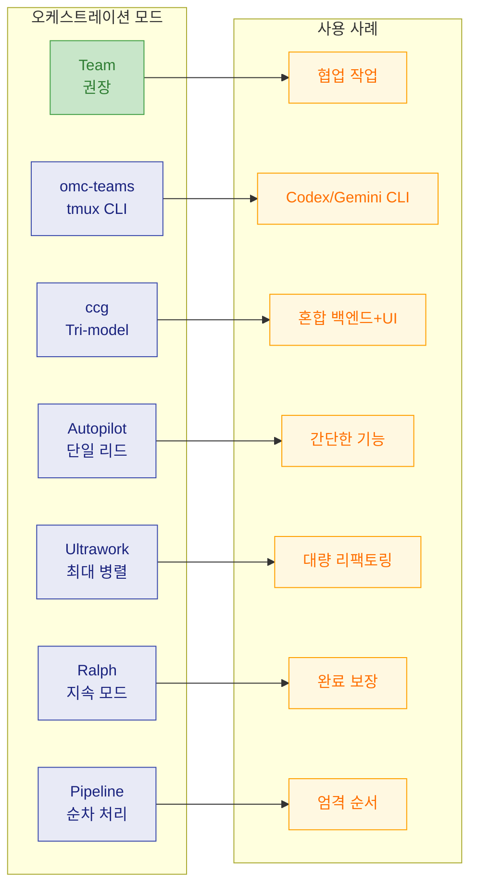
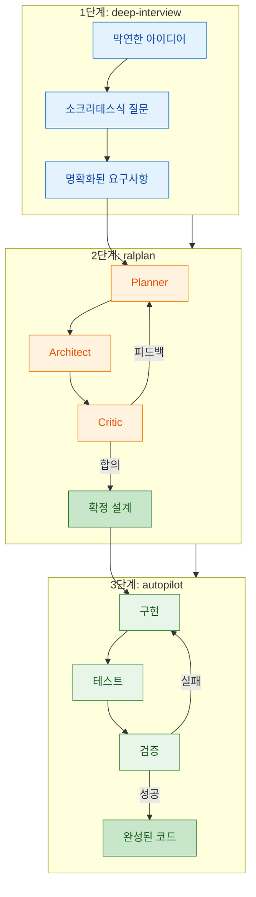
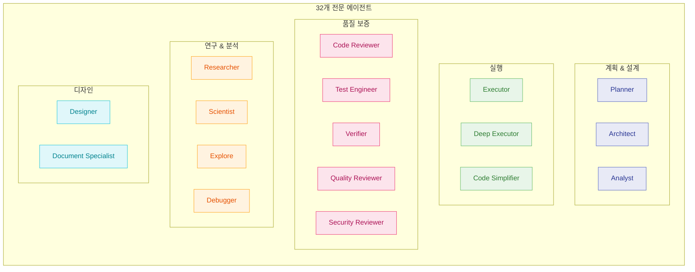
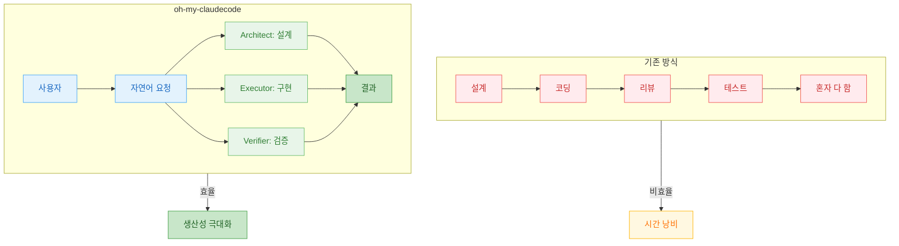

바이브 코딩(Vibe Coding) 시대에 혼자서 설계, 코딩, 리뷰, 테스트를 모두 처리하는 것은 비효율적이다. 한국인 개발자 **@bellman.pub** 가 개발한 **oh-my-claudecode** 는 Claude Code를 위한 oh-my-zsh 같은 올인원 플러그인으로, 32개 전문 에이전트가 역할별로 나누어 작업을 처리한다.

<!--more-->

## Sources

- [Threads - @vibe.tip 소개 포스트](https://www.threads.com/@vibe.tip/post/DVcxahkkzBh)
- [GitHub - Yeachan-Heo/oh-my-claudecode](https://github.com/Yeachan-Heo/oh-my-claudecode)

## oh-my-claudecode란?

oh-my-claudecode는 Claude Code CLI를 위한 **Teams-first Multi-agent orchestration** 플러그인이다. 핵심 철학은 "Claude Code를 배우지 말고 그냥 OMC를 쓰라"는 것으로, 제로 설정으로 동작하며 자연어로 작업을 지시하면 전문 에이전트들이 알아서 처리한다.



### 핵심 특징

| 특징 | 설명 |
|------|------|
| **제로 설정** | 지능형 기본값으로 별도 설정 없이 바로 사용 가능 |
| **Team-first 오케스트레이션** | Team 모드가 정식 오케스트레이션 표면 |
| **자연어 인터페이스** | 명령어를 외울 필요 없이 원하는 것을 설명하면 됨 |
| **자동 병렬화** | 복잡한 작업이 전문 에이전트에 분산됨 |
| **지속적 실행** | 작업이 완전히 검증될 때까지 포기하지 않음 |
| **비용 최적화** | 스마트 모델 라우팅으로 토큰 30-50% 절약 |
| **경험 학습** | 문제 해결 패턴을 자동으로 추출하여 재사용 |
| **실시간 가시성** | HUD statusline에서 내부 동작을 실시간 확인 |

## 오케스트레이션 모드

oh-my-claudecode는 다양한 사용 사례에 맞춰 여러 오케스트레이션 전략을 제공한다. v4.1.7부터 **Team** 모드가 정식 오케스트레이션 표면이며, 기존 swarm/ultrapilot은 Team으로 라우팅된다.



### Team 모드 (권장)

Team 모드는 스테이지드 파이프라인으로 동작한다:

```
team-plan → team-prd → team-exec → team-verify → team-fix (loop)
```

사용 예시:

```bash
/team 3:executor "fix all TypeScript errors"
```

Team 모드를 활성화하려면 `~/.claude/settings.json`에 다음을 추가한다:

```json
{
  "env": {
    "CLAUDE_CODE_EXPERIMENTAL_AGENT_TEAMS": "1"
  }
}
```

### omc-teams: tmux CLI 워커

v4.4.0부터 Codex/Gemini MCP 서버 대신 **실제 CLI 프로세스**를 tmux 분할 창에서 실행할 수 있다:

```bash
/omc-teams 2:codex   "review auth module for security issues"
/omc-teams 2:gemini  "redesign UI components for accessibility"
/omc-teams 1:claude  "implement the payment flow"
```

| 스킬 | 워커 | 용도 |
|------|------|------|
| `/omc-teams N:codex` | N개 Codex CLI 창 | 코드 리뷰, 보안 분석, 아키텍처 |
| `/omc-teams N:gemini` | N개 Gemini CLI 창 | UI/UX 디자인, 문서, 대형 컨텍스트 |
| `/omc-teams N:claude` | N개 Claude CLI 창 | tmux 내 Claude CLI 일반 작업 |
| `/ccg` | Codex 1 + Gemini 1 | 병렬 tri-model 오케스트레이션 |

워커는 필요시 생성되고 작업 완료 시 종료되어 유휴 리소스를 소비하지 않는다.

### 매직 키워드

파워 유저를 위한 선택적 단축어들이다. 자연어로도 충분히 동작한다:

| 키워드 | 효과 | 예시 |
|--------|------|------|
| `team` | 정식 Team 오케스트레이션 | `/team 3:executor "fix TypeScript errors"` |
| `omc-teams` | tmux CLI 워커 | `/omc-teams 2:codex "security review"` |
| `ccg` | Tri-model Codex+Gemini | `/ccg review this PR` |
| `autopilot` | 완전 자율 실행 | `autopilot: build a todo app` |
| `ralph` | 지속성 모드 | `ralph: refactor auth` |
| `ulw` | 최대 병렬성 | `ulw fix all errors` |
| `plan` | 계획 인터뷰 | `plan the API` |
| `ralplan` | 반복 합의 계획 | `ralplan this feature` |
| `deep-interview` | 소크라테스식 요구사항 명확화 | `deep-interview "vague idea"` |

## 워크플로우: 막연한 아이디어에서 완성된 코드까지

oh-my-claudecode의 대표적인 워크플로우는 세 단계로 구성된다:



### 1단계: deep-interview

요구사항이 불명확하거나 아이디어가 막연할 때 사용한다. 소크라테스식 질문을 통해 숨겨진 가정을 드러내고 가중치가 적용된 차원에서 명확성을 측정한다.

```bash
/deep-interview "I want to build a task management app"
```

### 2단계: ralplan

Planner, Architect, Critic 세 에이전트가 합의할 때까지 설계를 반복한다. 코드를 작성하기 전에 설계부터 확실히 잡는다.

```bash
/ralplan this feature
```

### 3단계: autopilot

구현부터 테스트까지 한 번에 끝낸다. 자주 쓰는 모드 중 하나로, 말하면 알아서 처리한다.

```bash
autopilot: build a REST API for managing tasks
```

## 32개 전문 에이전트

oh-my-claudecode는 아키텍처, 연구, 디자인, 테스트, 데이터 과학 등 다양한 영역의 **32개 전문 에이전트**를 제공한다:



주요 에이전트 역할:

| 에이전트 | 역할 |
|----------|------|
| **Architect** | 설계 및 구조 결정 |
| **Executor** | 구현 및 코드 작성 |
| **Verifier** | 검증 및 품질 확인 |
| **Code Reviewer** | 코드 리뷰 (보안, 성능, 모범 사례) |
| **Test Engineer** | 테스트 전략 및 커버리지 |
| **Security Reviewer** | 보안 취약점 탐지 (OWASP Top 10) |
| **Researcher** | 코드베이스 탐색 및 조사 |
| **Debugger** | 근본 원인 분석 및 디버깅 |
| **Designer** | UI/UX 디자인 |
| **Scientist** | 데이터 분석 및 연구 실행 |

## 설치 및 설정

### 설치

세 줄이면 설치 완료다:

```bash
# 1. 마켓플레이스 추가
/plugin marketplace add https://github.com/Yeachan-Heo/oh-my-claudecode

# 2. 플러그인 설치
/plugin install oh-my-claudecode

# 3. 설정 실행
/omc-setup
```

### 업데이트

```bash
# 1. 마켓플레이스 업데이트
/plugin marketplace update omc

# 2. 설정 새로고침
/omc-setup
```

### 요구사항

- Claude Code CLI
- Claude Max/Pro 구독 또는 Anthropic API 키

### 선택적 Multi-AI 오케스트레이션

OMC는 선택적으로 외부 AI 제공자를 오케스트레이션할 수 있다:

| 제공자 | 설치 | 활성화 기능 |
|--------|------|-------------|
| Gemini CLI | `npm install -g @google/gemini-cli` | 디자인 리뷰, UI 일관성 (1M 토큰 컨텍스트) |
| Codex CLI | `npm install -g @openai/codex` | 아키텍처 검증, 코드 리뷰 교차 확인 |

비용 측면에서 Claude + Gemini + ChatGPT Pro 3개 플랜으로 월 ~$60에 모든 것을 커버할 수 있다.

## 유틸리티 기능

### Rate Limit Wait

속도 제한이 리셋될 때 Claude Code 세션을 자동으로 재개한다:

```bash
omc wait          # 상태 확인 및 안내
omc wait --start  # 자동 재개 데몬 활성화
omc wait --stop   # 데몬 비활성화
```

### 알림 태그 (Telegram/Discord/Slack)

세션 요약을 전송할 때 태그할 사용자를 설정할 수 있다:

```bash
# 태그 목록 설정
omc config-stop-callback telegram --enable --token <bot_token> --chat <chat_id> --tag-list "@alice,bob"
omc config-stop-callback discord --enable --webhook <url> --tag-list "@here,123456789012345678"
omc config-stop-callback slack --enable --webhook <url> --tag-list "<!here>,<@U1234567890>"
```

## 왜 oh-my-claudecode인가?



| 구분 | 기존 방식 | oh-my-claudecode |
|------|----------|------------------|
| 설계 | 직접 구조 잡고 계획 | Architect 에이전트가 담당 |
| 코딩 | 직접 코드 작성 | Executor 에이전트가 구현 |
| 리뷰 + 테스트 | 직접 품질 확인 | Verifier 에이전트가 검증 |
| 실행 방식 | 순차 처리 | 병렬 실행 가능 |
| 합의 기반 | 개인 판단 | 다중 에이전트 합의 |

## 핵심 요약

- **oh-my-claudecode** 는 Claude Code를 위한 멀티 에이전트 오케스트레이션 플러그인이다
- **32개 전문 에이전트** 가 역할별로 나누어 설계, 구현, 검증을 처리한다
- **Team 모드** 가 정식 오케스트레이션 표면으로 `team-plan → team-prd → team-exec → team-verify → team-fix` 파이프라인으로 동작한다
- **omc-teams** 로 실제 Codex/Gemini CLI 프로세스를 tmux에서 실행할 수 있다
- **deep-interview → ralplan → autopilot** 워크플로우로 막연한 아이디어를 완성된 코드로 변환한다
- **제로 설정** 으로 자연어만으로 작업 지시가 가능하다
- **비용 최적화** 로 토큰 30-50% 절약 효과가 있다

## 결론

oh-my-claudecode는 바이브 코딩의 효율성을 극대화하는 도구다. 혼자서 설계, 코딩, 리뷰, 테스트를 모두 처리하는 대신, 32개 전문 에이전트가 역할별로 나누어 병렬로 작업한다. 모드를 외울 필요 없이 자연어로 원하는 것을 말하면 된다. 설치는 세 줄이면 충분하다. Claude Code를 쓰고 있다면 oh-my-claudecode로 "딸깍" 을 더 잘하는 방법을 경험해 보자.

```bash
/plugin marketplace add https://github.com/Yeachan-Heo/oh-my-claudecode
/plugin install oh-my-claudecode
/omc-setup
```

더 자세한 사용법은 `/omc-help` 를 입력하면 확인할 수 있다.
