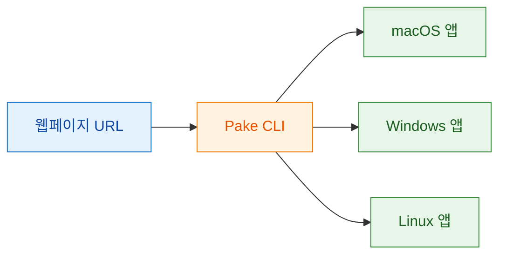
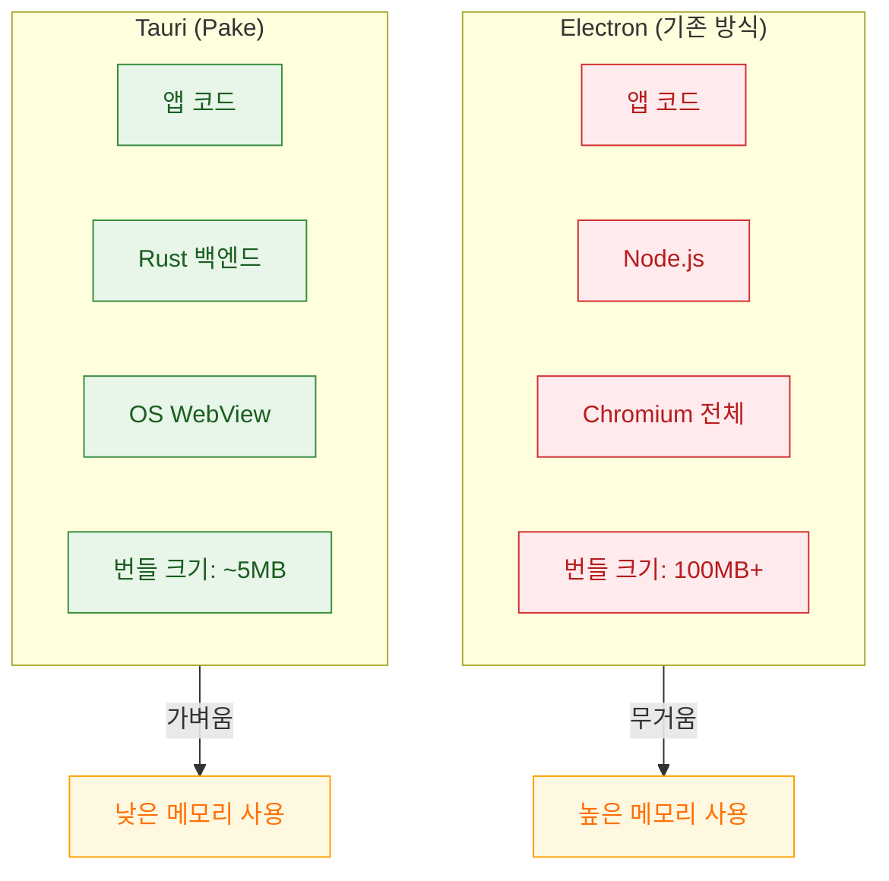
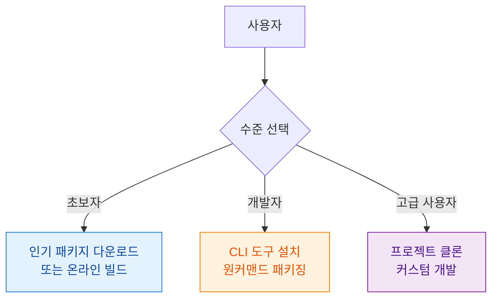
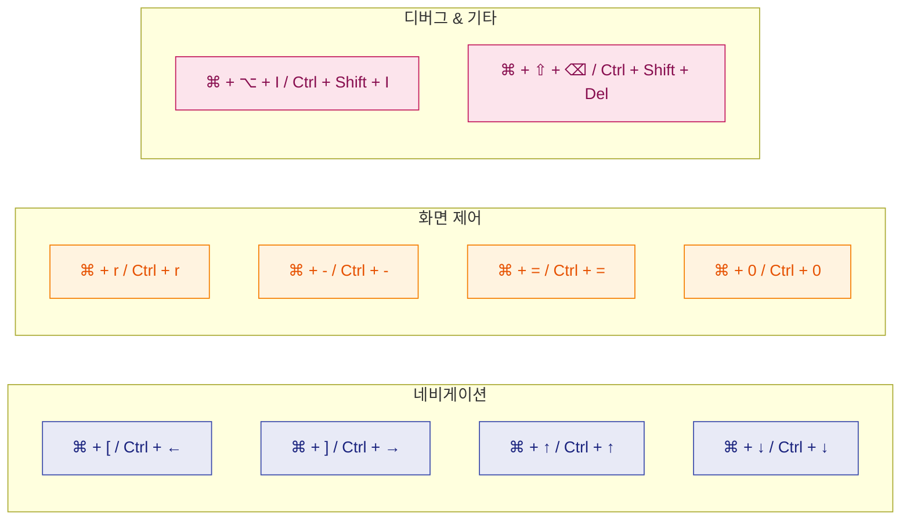
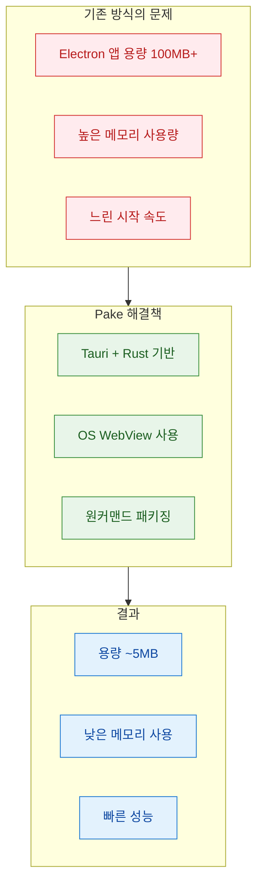

Electron 기반 데스크톱 앱은 무겁다. 슬랙, VS Code 같은 앱을 실행하면 메모리 수백 MB가 순식간에 사라진다. **Pake** 는 이 문제를 Rust 기반 Tauri 프레임워크로 해결한다. 하나의 명령어로 어떤 웹페이지든 데스크톱 앱으로 변환하며, Electron 대비 20배 작은 용량(약 5MB)을 자랑한다.

<!--more-->

## Sources

- [GitHub - tw93/Pake](https://github.com/tw93/Pake)

## Pake란?

Pake는 "Turn any webpage into a desktop app with one command" 라는 슬로건처럼, 웹페이지를 네이티브 데스크톱 애플리케이션으로 패키징하는 오픈소스 도구다. macOS, Windows, Linux를 모두 지원하며, 핵심 기술 스택으로 Rust와 Tauri를 사용한다.



### 핵심 특징

| 특징 | 설명 |
|------|------|
| **경량** | Electron 대비 20배 작은 용량, 일반적으로 약 5MB |
| **빠름** | Rust Tauri 기반, 전통적 JS 프레임워크보다 빠르고 메모리 사용량 낮음 |
| **간편함** | CLI 또는 온라인 빌드로 원커맨드 패키징, 복잡한 설정 불필요 |
| **풍부한 기능** | 단축키, 몰입형 윈도우, 드래그 앤 드롭, 스타일 커스텀, 광고 제거 지원 |

## 아키텍처: Electron vs Tauri

Pake가 가벼운 이유는 Tauri 아키텍처에 있다. Electron은 Chromium 전체를 번들에 포함하지만, Tauri는 운영체제의 기본 웹뷰를 사용한다.



| 비교 항목 | Electron | Tauri (Pake) |
|----------|----------|--------------|
| 렌더링 엔진 | Chromium 번들 포함 | OS 기본 WebView 사용 |
| 백엔드 | Node.js | Rust |
| 번들 크기 | 100MB+ | ~5MB |
| 메모리 사용 | 높음 | 낮음 |
| 보안 | 중간 | 높음 (Rust 메모리 안전성) |

## 사용 방법

Pake는 사용자 수준에 따라 세 가지 방식을 제공한다.



### 1. 초보자: 인기 패키지 다운로드

개발 환경 없이 바로 사용할 수 있는 패키지들을 Releases 에서 다운로드할 수 있다.

### 2. 개발자: CLI 도구

CLI 를 사용하면 어떤 웹사이트든 커맨드 한 줄로 앱으로 변환할 수 있다.

```bash
# Pake CLI 설치
pnpm install -g pake-cli

# 기본 사용법 - 웹사이트 아이콘 자동 가져오기
pake https://github.com --name GitHub

# 고급 옵션
pake https://weekly.tw93.fun --name Weekly \
  --icon https://cdn.tw93.fun/pake/weekly.icns \
  --width 1200 --height 800 --hide-title-bar
```

첫 패키징은 환경 설정 때문에 느릴 수 있지만, 이후 빌드는 빠르다.

### 3. 고급 사용자: 커스텀 개발

프로젝트를 클론하여 스타일 커스터마이징, 기능 확장, 컨테이너 통신 등 고급 기능을 사용할 수 있다.

**개발 환경 요구사항:**
- Rust >= 1.85
- Node >= 22

```bash
# 의존성 설치
pnpm i

# 로컬 개발 [우클릭으로 디버그 모드]
pnpm run dev

# 애플리케이션 빌드
pnpm run build
```

## 인기 패키지

Pake로 만들어진 인기 앱들은 Releases에서 다운로드할 수 있다:

| 앱 | 플랫폼 |
|----|--------|
| WeRead | macOS, Windows, Linux |
| Twitter | macOS, Windows, Linux |
| Grok | macOS, Windows, Linux |
| DeepSeek | macOS, Windows, Linux |
| ChatGPT | macOS, Windows, Linux |
| Gemini | macOS, Windows, Linux |
| YouTube Music | macOS, Windows, Linux |
| YouTube | macOS, Windows, Linux |
| Excalidraw | macOS, Windows, Linux |
| XiaoHongShu | macOS, Windows, Linux |

## 단축키

Pake 앱에서 사용할 수 있는 기본 단축키들이다.



| Mac | Windows/Linux | 기능 |
|-----|---------------|------|
| `⌘` + `[` | `Ctrl` + `←` | 이전 페이지 |
| `⌘` + `]` | `Ctrl` + `→` | 다음 페이지 |
| `⌘` + `↑` | `Ctrl` + `↑` | 페이지 맨 위로 스크롤 |
| `⌘` + `↓` | `Ctrl` + `↓` | 페이지 맨 아래로 스크롤 |
| `⌘` + `r` | `Ctrl` + `r` | 페이지 새로고침 |
| `⌘` + `w` | `Ctrl` + `w` | 윈도우 숨기기 (종료 아님) |
| `⌘` + `-` | `Ctrl` + `-` | 페이지 축소 |
| `⌘` + `=` | `Ctrl` + `=` | 페이지 확대 |
| `⌘` + `0` | `Ctrl` + `0` | 페이지 확대/축소 리셋 |
| `⌘` + `L` | `Ctrl` + `L` | 현재 페이지 URL 복사 |
| `⌘` + `⇧` + `⌥` + `V` | `Ctrl` + `Shift` + `V` | 스타일 일치 붙여넣기 |
| `⌘` + `⇧` + `H` | `Ctrl` + `Shift` + `H` | 홈페이지로 이동 |
| `⌘` + `⌥` + `I` | `Ctrl` + `Shift` + `I` | 개발자 도구 토글 (디버그 전용) |
| `⌘` + `⇧` + `⌫` | `Ctrl` + `Shift` + `Del` | 캐시 삭제 & 재시작 |

추가 기능:
- 타이틀바 더블클릭으로 전체화면 전환
- Mac 사용자: 제스처로 이전/다음 페이지 이동, 타이틀바 드래그로 윈도우 이동
- 새 메뉴에서 네비게이션, 확대/축소, 윈도우 제어 옵션 제공

## Pake를 선택해야 하는 이유



| 상황 | 권장 도구 |
|------|----------|
| 웹사이트를 데스크톱 앱처럼 사용하고 싶음 | Pake |
| Electron 앱의 무거움에 불만 | Pake |
| 개발 없이 바로 사용하고 싶음 | Pake (인기 패키지) |
| 커스텀 기능이 필요함 | Pake (커스텀 개발) |
| 복잡한 네이티브 기능 필요 | Electron 또는 Tauri 직접 개발 |

## 핵심 요약

- **Pake** 는 하나의 명령어로 웹페이지를 데스크톱 앱으로 변환한다
- **Electron 대비 20배 작은 용량** (약 5MB)과 **낮은 메모리 사용량** 이 특징이다
- **Rust Tauri** 기반으로 빠르고 안전하다
- **macOS, Windows, Linux** 를 모두 지원한다
- **CLI, 온라인 빌드, 커스텀 개발** 세 가지 사용 방식을 제공한다
- 단축키, 몰입형 윈도우, 스타일 커스텀, 광고 제거 등 풍부한 기능을 지원한다

## 결론

Pake는 웹 앱을 데스크톱 환경에서 사용하고 싶은 사용자에게 완벽한 솔루션이다. Electron 의 무거움 없이 네이티브 앱 경험을 제공하며, 개발자가 아니더라도 인기 패키지를 다운로드하거나 온라인 빌드로 바로 사용할 수 있다. ChatGPT, Gemini, DeepSeek 같은 AI 도구나 YouTube Music, WeRead 같은 서비스를 별도 브라우저 탭이 아닌 독립 앱으로 사용하고 싶다면 Pake를 시도해 보자.

```bash
pnpm install -g pake-cli
pake https://your-favorite-site.com --name MyApp
```
