## 들어가며

주가 예측은 머신러닝에서 가장 도전적인 문제 중 하나다. 단일 모델로는 시장의 복잡성을 포착하기 어렵기 때문에, 실무에서는 여러 기법을 파이프라인으로 결합한다.

Boris Banushev의 오픈소스 프로젝트 [stockpredictionai](https://github.com/borisbanushev/stockpredictionai)는 **Goldman Sachs(GS) 주가 예측** 을 목표로, GAN(Generative Adversarial Network), LSTM, CNN, 강화학습, BERT NLP, 푸리에 변환, ARIMA, Stacked Autoencoder, XGBoost, PCA까지 — 현대 딥러닝과 전통 통계 기법을 하나의 시스템으로 통합한 프로젝트다. GitHub 스타 5,500개 이상을 받은 이 프로젝트의 전체 아키텍처를 해부한다.

<!--more-->

**원본 소스:** [borisbanushev/stockpredictionai](https://github.com/borisbanushev/stockpredictionai)

---

## 시스템 전체 아키텍처

이 프로젝트의 핵심 구조는 크게 세 단계로 나뉜다: **데이터 수집 및 피처 엔지니어링**, **GAN 기반 예측 모델**, **강화학습 기반 하이퍼파라미터 최적화**.

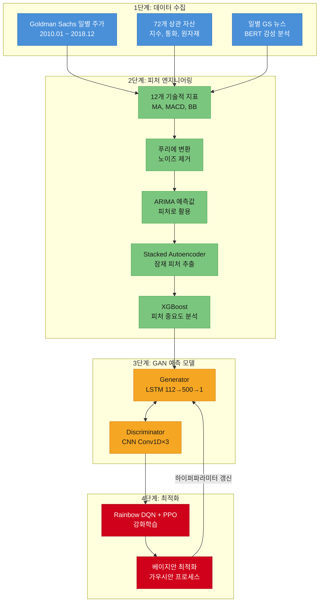

---

## 데이터 수집과 전처리

### 기본 데이터 구성

예측 대상은 **Goldman Sachs(GS)** 의 NYSE 일별 종가다. 데이터 기간은 2010년 1월부터 2018년 12월까지 총 **2,265 거래일** 이며, **70/30** 비율로 분할했다 — 학습 1,585일, 테스트 680일, 분할 기준일은 약 2016년 4월 20일이다.

### 72개 상관 자산

GS 단독 가격만으로는 시장 맥락이 빠진다. 프로젝트는 **72개 상관 자산** 을 함께 입력한다:

| 카테고리 | 포함 자산 예시 |
|----------|---------------|
| 투자은행 | JPMorgan, Morgan Stanley, Citigroup, Wells Fargo |
| 글로벌 지수 | NASDAQ, NYSE, FTSE100, Nikkei225, Hang Seng, BSE Sensex |
| 금리 | LIBOR USD, LIBOR GBP |
| 변동성 | VIX |
| 통화 | USDJPY, GBPUSD, CNYJPY |
| 원자재/채권 | 금, 은, 원유, 국채 |

이 데이터는 매크로 환경이 개별 종목 가격에 미치는 영향을 모델에 전달하는 역할을 한다.

### 통계적 품질 검증

피처를 모델에 넣기 전에 세 가지 통계 검정을 수행했다:

- **이분산성(Heteroskedasticity)** 검정 — 잔차 분산이 시간에 따라 변하는지 확인
- **다중공선성(Multicollinearity)** 검정 — 독립 변수 간 과도한 상관 확인
- **계열 상관(Serial Correlation)** 검정 — 잔차 간 자기상관 확인

데이터는 세 가지 검정을 모두 통과했다.

---

## 피처 엔지니어링 파이프라인

총 **112개 입력 피처** 가 최종 GAN 모델에 투입된다. 이 피처들은 여러 기법을 통해 단계적으로 구성된다.

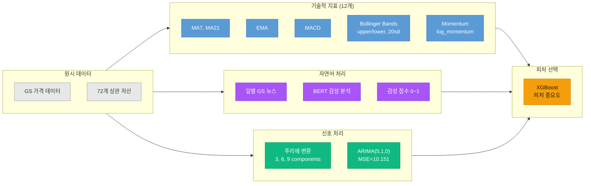

### 기술적 지표

12개 기술적 지표를 계산했다:

- **이동평균**: 7일(MA7), 21일(MA21) 단순 이동평균 + 지수 이동평균(EMA)
- **MACD**: 12일과 26일 EMA의 차이로 추세 전환 신호 포착
- **볼린저 밴드**: 20일 이동평균 ± 2σ (상한/하한) — 가격의 과매수/과매도 판단
- **모멘텀**: 가격 변화율과 log 모멘텀

XGBoost 피처 중요도 분석 결과, **MA7, MACD, 볼린저 밴드** 가 예측에 가장 큰 기여를 했다.

### BERT 감성 분석

매일의 Goldman Sachs 관련 뉴스를 수집하고, **BERT(Bidirectional Encoder Representations from Transformers)** 로 감성 점수를 추출했다. 출력은 sigmoid 함수를 거쳐 **0(부정)~1(긍정)** 사이 값으로 변환된다.

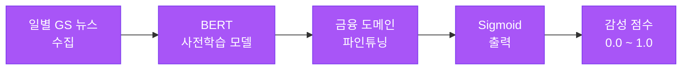

BERT의 핵심은 **전이 학습(Transfer Learning)** 이다. 대규모 텍스트로 사전학습된 언어 모델을 금융 뉴스 도메인에 파인튜닝하면, 적은 레이블 데이터로도 높은 정확도의 감성 분류가 가능하다. 최근 연구에 따르면, FinBERT 기반 접근은 전통 ML 대비 **F1-score 17~20% 향상** 을 보인다.

### 푸리에 변환을 이용한 노이즈 제거

주가 데이터에는 일상적 변동(noise)과 실제 추세(signal)가 섞여 있다. **푸리에 변환(Fourier Transform)** 은 시계열을 주파수 영역으로 분해하여 고주파 노이즈를 제거한다.

프로젝트에서는 **3, 6, 9개 주파수 성분** 을 유지하는 실험을 수행했다. 웨이블릿(wavelet) 변환도 시도했으나, 결과가 유사해 푸리에를 최종 채택했다.

**핵심 원리**: FFT는 시계열을 구성 주파수로 분해한다. 시장 노이즈는 주로 고주파 성분으로 나타나고, 실제 추세는 저주파에 집중된다. 특정 cutoff 이상의 주파수를 제거한 뒤 IFFT로 복원하면 더 깨끗한 신호를 얻는다.

### ARIMA — 전통 시계열 예측

**ARIMA(5,1,0)** 모델을 학습하여 테스트 MSE **10.151** 을 달성했다. 이 프로젝트에서 ARIMA는 최종 예측기가 아니라, **예측값을 추가 피처로** GAN에 공급하는 역할을 한다.

### Stacked Autoencoder (VAE)

**Stacked Autoencoder** 는 입력 데이터의 잠재 표현을 학습하여 새로운 피처를 생성한다.

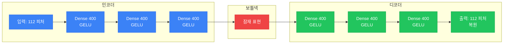

구성 세부사항:

- **구조**: 인코더/디코더 각 3개 레이어, 레이어당 400 뉴런
- **활성화 함수**: GELU — `0.5 * x * (1 + tanh(sqrt(2/π) * (x + 0.044715 * x³)))`
- **학습**: 150 에포크, 총 62초 소요
- **결과**: 112개 원본 피처에서 112개 추가 잠재 피처 생성

다만, PCA 분석 결과 80% 분산을 설명하는 데 **84개 주성분** 이 필요해 차원 축소 효과가 미미하여, 오토인코더 피처는 최종 모델에 포함되지 않았다.

**왜 Stacked 구조인가**: 각 레이어가 점진적으로 더 추상적인 시장 패턴을 포착한다. 압축(bottleneck)은 네트워크가 노이즈보다 신호를 학습하도록 강제하며, 비지도 사전학습은 레이블 없는 대량의 시장 데이터를 활용할 수 있게 한다.

### XGBoost 피처 중요도

모든 피처를 구성한 뒤, **XGBoost** 로 피처 중요도를 분석했다. 결과적으로 **MA7, MACD, 볼린저 밴드** 가 상위에 위치하며, 이는 기술적 지표의 예측력이 가장 강함을 확인해준다.

---

## GAN 기반 주가 예측 모델

프로젝트의 핵심 모델은 **GAN(Generative Adversarial Network)** 이다. Generator가 미래 주가를 생성하고, Discriminator가 실제 주가와 생성된 주가를 구분하려 시도하며, 이 적대적 학습을 통해 Generator의 예측 정확도가 올라간다.

### GAN 학습 원리

GAN의 손실 함수는 **minimax 게임** 으로 정의된다:

> L(D,G) = E[log D(x)] + E[log(1 - D(G(z)))]

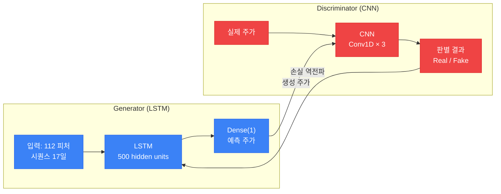

### Generator — LSTM 아키텍처

Generator는 **LSTM(Long Short-Term Memory)** 으로 구성된다. LSTM은 시계열 데이터에서 장기 의존성을 학습하는 데 특화된 RNN 변형이다.

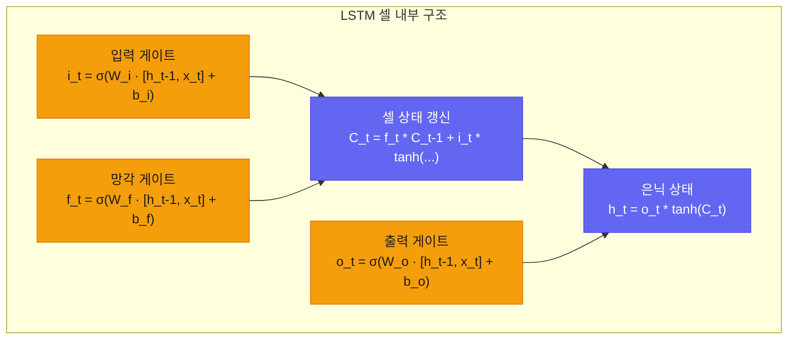

**Generator 구성 상세**:

| 파라미터 | 값 |
|---------|-----|
| 입력 차원 | 112 (피처 수) |
| LSTM hidden units | 500 |
| 출력 Dense | 1 (다음 날 종가) |
| 시퀀스 길이 | 17일 |
| 초기화 | Xavier |
| 손실 함수 | L1 Loss |
| 옵티마이저 | Adam (lr=0.01) |

LSTM이 GRU 대신 선택된 이유: LSTM은 별도의 셀 상태(cell state)를 유지하여 **장기 의존성 보존에 유리** 하고, GRU는 파라미터가 적어 빠르지만 복잡한 시계열에서는 LSTM이 더 나은 성능을 보인다.

### Discriminator — CNN 아키텍처

Discriminator는 **CNN(Convolutional Neural Network)** 으로 구성된다. 시계열 데이터에 대해 **1D 합성곱** 으로 국소 패턴을 감지한다.

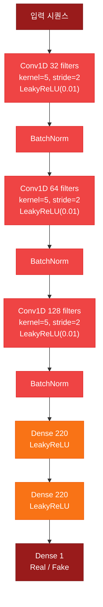

**왜 시계열에 CNN인가**: RNN과 달리 CNN은 국소 패턴(local pattern)을 병렬로 감지할 수 있어, 특정 시간 윈도우 내의 가격 패턴(상승 추세, 하락 추세, 횡보)을 효과적으로 포착한다. Generator가 LSTM으로 순차적 의존성을 학습하는 동안, Discriminator의 CNN은 국소적 진위 판별에 집중한다.

### Wasserstein GAN (WGAN)

표준 GAN은 학습이 불안정하다. Generator와 Discriminator의 균형이 무너지면 **mode collapse** 나 **vanishing gradient** 가 발생한다. 이를 해결하기 위해 **Wasserstein GAN** 을 채택했다.

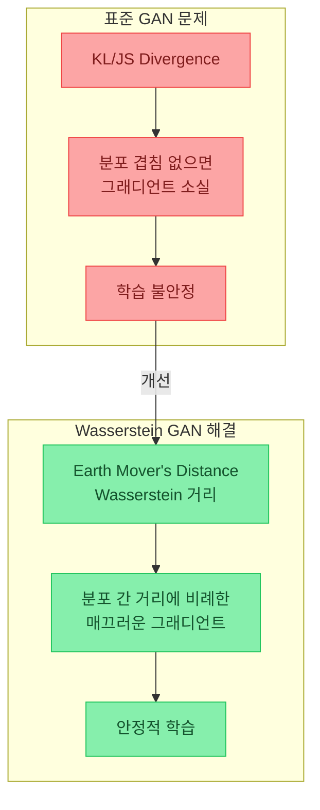

**Wasserstein 거리** 는 두 확률 분포 사이의 "지구를 옮기는 비용(Earth Mover's Distance)"으로, KL/JS Divergence와 달리 분포가 겹치지 않아도 의미 있는 그래디언트를 제공한다. 이것이 WGAN의 핵심 이점이다.

### Metropolis-Hastings GAN (MHGAN)

Uber에서 제안한 **MHGAN** 은 MCMC(Markov Chain Monte Carlo) 기반 샘플링을 GAN에 도입한다. Generator에서 **K개의 후보 샘플** 을 생성한 뒤, Discriminator의 판별 확률을 기반으로 **Metropolis-Hastings 수락 규칙** 에 따라 최적 샘플을 선택한다.

프로젝트는 **WGAN + MHGAN을 결합** 하여 사용했으며, 구현에 3일이 소요됐다고 기록되어 있다.

---

## 학습 안정화 기법

### Learning Rate 스케줄러

**Triangular + Cyclical Learning Rate** 방식을 채택했다:

| 파라미터 | 값 |
|---------|-----|
| min_lr | 0.5 |
| max_lr | 2 |
| cycle_length | 500 iterations |
| 총 반복 | 1,500 iterations |

학습률을 주기적으로 올렸다 내리면 **지역 최솟값(local minima)을 탈출** 하는 데 효과적이다.

### 과적합 방지

다섯 가지 기법을 동시에 적용했다:

1. **L1 정규화** — 가중치의 절대값 합을 페널티로 추가, 희소한(sparse) 모델 유도
2. **Dropout** — 학습 중 랜덤하게 뉴런을 비활성화
3. **Dense-Sparse-Dense(DSD) 학습** — 밀집 학습 → 가중치 pruning → 희소 학습 → 다시 밀집 학습의 3단계
4. **조기 종료(Early Stopping)** — 검증 손실이 개선되지 않으면 학습 중단
5. **데이터 품질 검증** — 이분산성, 다중공선성, 계열 상관 검정

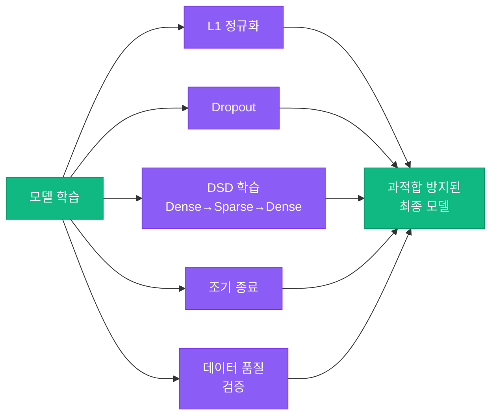

---

## 강화학습 기반 하이퍼파라미터 최적화

GAN 학습에서 가장 까다로운 부분은 **하이퍼파라미터 튜닝** 이다. 이 프로젝트는 수동 탐색 대신 **강화학습(RL)** 으로 자동화했다.

### 최적화 대상 하이퍼파라미터

| 파라미터 | 설명 |
|---------|------|
| batch_size | 배치 크기 |
| cnn_lr | Discriminator 학습률 |
| strides | CNN 스트라이드 |
| lrelu_alpha | LeakyReLU 기울기 |
| batchnorm_momentum | BatchNorm 모멘텀 |
| padding | CNN 패딩 |
| kernel_size | CNN 커널 크기 |
| dropout | 드롭아웃 비율 |
| filters | CNN 필터 수 |

### RL 환경 설계

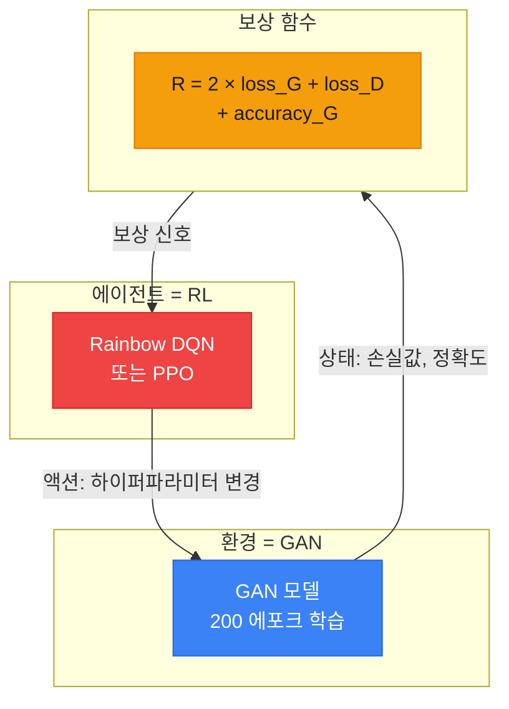

핵심 설계:

- **환경(Environment)** = GAN 모델 자체 (1 에피소드 = 200 에포크 GAN 학습)
- **액션(Action)** = 하이퍼파라미터 변경
- **보상(Reward)** = `R = 2 × loss_G + loss_D + accuracy_G`
- **총 10 에피소드** 실행 (각 에피소드에서 200 에포크 GAN을 처음부터 학습)

### Rainbow DQN — 7개 알고리즘의 통합

**Rainbow DQN** 은 Deep Q-Network의 6가지 핵심 개선을 하나로 통합한 알고리즘이다:

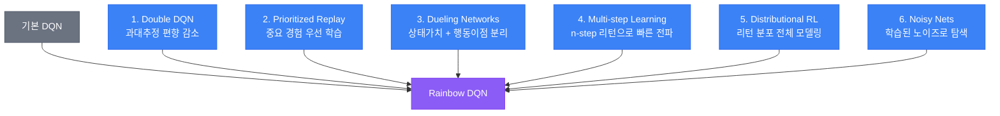

각 구성 요소의 역할:

| 알고리즘 | 해결하는 문제 |
|---------|-------------|
| **Double DQN** | Q-값 과대추정 편향 감소 — 행동 선택과 가치 추정을 분리 |
| **Prioritized Experience Replay** | 학습 효율 향상 — 정보량이 큰 경험을 우선 재생 |
| **Dueling Networks** | 상태 가치와 행동 이점을 별도 추정 후 결합 |
| **Multi-step Learning** | n-step 리턴으로 보상 전파 가속 |
| **Distributional RL** | 리턴의 기댓값만이 아닌 전체 분포를 모델링 — 불확실성 포착 |
| **Noisy Nets** | ε-greedy 대신 학습 가능한 노이즈로 상태 의존적 탐색 |

Ablation 연구에서 **Distributional RL** 과 **Prioritized Replay** 가 가장 큰 성능 향상을 제공했다.

### PPO — 안정적 정책 최적화

**PPO(Proximal Policy Optimization)** 는 OpenAI가 제안한 정책 경사(policy gradient) 알고리즘으로, 연속 행동 공간에서 동작한다.

핵심 메커니즘은 **Clipped Surrogate Objective** 이다:

> L^CLIP(θ) = E[min(r(θ) × A, clip(r(θ), 1-ε, 1+ε) × A)]

여기서 `r(θ) = π_new(a|s) / π_old(a|s)` 는 정책 비율, `A`는 어드밴티지 추정치, ε는 클리핑 범위(보통 0.2)다.

**왜 PPO가 안정적인가**: 정책 업데이트의 크기를 `[1-ε, 1+ε]` 범위로 제한하여, 한 번의 업데이트로 정책이 급격히 변하는 것을 방지한다. 이는 하이퍼파라미터 탐색에서 **탐색(exploration) vs 활용(exploitation) 균형** 을 유지하는 데 효과적이다.

### 베이지안 최적화

RL 외에도 **가우시안 프로세스(Gaussian Process) 기반 베이지안 최적화** 를 추가로 적용했다:

- **라이브러리**: `bayes_opt` (BayesianOptimization)
- **Utility 함수**: UCB (Upper Confidence Bound), kappa=2.5, xi=0.0
- **원리**: 이전 평가 결과를 기반으로 다음 탐색 지점을 지능적으로 선택 — 무작위 탐색보다 훨씬 효율적

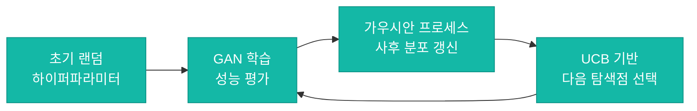

---

## 프레임워크와 학습 환경

- **딥러닝 프레임워크**: MXNet + Gluon API
- **GPU 지원**: 다중 GPU 학습 가능 (노트북에서는 `mx.cpu()` 사용)
- **GAN 학습**: 에포크당 200회, 총 10 RL 에피소드
- **GAN 구현 참고**: [soumith/ganhacks](https://github.com/soumith/ganhacks) — GAN 학습 안정화 팁 모음

---

## 실험 결과

프로젝트는 4단계에 걸친 예측 결과를 시각적으로 보여준다:

| 단계 | 설명 | 관찰 |
|------|------|------|
| 에포크 1 | 초기 랜덤 예측 | 실제 가격과 큰 괴리 |
| 에포크 50 | 중간 학습 | 추세 방향은 포착, 진폭 부정확 |
| 에포크 200 | GAN 학습 완료 | 패턴 근사, 일부 지연 |
| RL 10 에피소드 후 | 최적화 완료 | 가장 정확한 예측 |

프로젝트 README에는 최종 수치 정확도(RMSE, MAE 등)가 명시적으로 보고되지 않았으며, 4개의 시각적 예측 그래프만 제공된다.

> ⚠️ **주의**: 이 프로젝트는 교육 및 연구 목적이다. README에도 명시된 대로, 실제 투자 결정에 사용해서는 안 된다 — "The content of this notebook is not an investment advice and is for informational purpose only."

---

## 핵심 요약

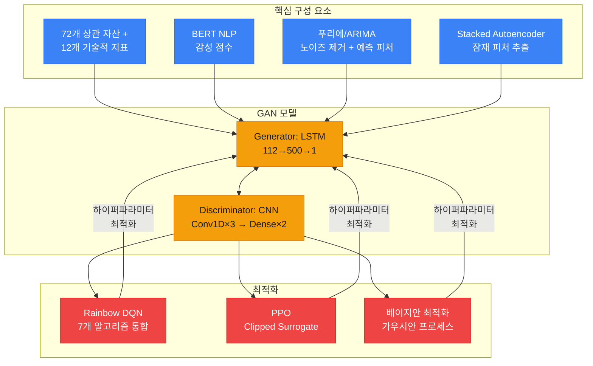

| 구성 요소 | 역할 | 핵심 기술 |
|-----------|------|----------|
| **데이터** | 다차원 시장 맥락 구성 | 72개 상관 자산, BERT 감성 분석, 12개 기술적 지표 |
| **피처 엔지니어링** | 노이즈 제거 + 피처 확장 | 푸리에 변환, ARIMA, Stacked Autoencoder, XGBoost |
| **GAN Generator** | 미래 주가 생성 | LSTM (112→500→1), 시퀀스 길이 17일 |
| **GAN Discriminator** | 생성 주가 진위 판별 | CNN Conv1D×3, LeakyReLU, BatchNorm |
| **GAN 안정화** | 학습 수렴 보장 | WGAN (Wasserstein 거리) + MHGAN (MCMC 샘플링) |
| **하이퍼파라미터 최적화** | 자동 탐색 | Rainbow DQN (6개 개선 통합), PPO (정책 클리핑) |
| **보조 최적화** | 효율적 탐색 | 베이지안 최적화 (UCB, 가우시안 프로세스) |

---

## 결론

이 프로젝트는 단일 모델의 한계를 인정하고, **각 기법이 고유한 역할을 수행하는 파이프라인** 을 설계했다는 점에서 가치가 있다:

- **데이터 레이어**: 상관 자산 + NLP 감성 + 기술적 지표로 다차원 시장 맥락 구성
- **신호 처리 레이어**: 푸리에 변환으로 노이즈 제거, ARIMA 예측을 보조 피처로 활용
- **생성 모델 레이어**: LSTM Generator + CNN Discriminator의 적대적 학습 (WGAN + MHGAN으로 안정화)
- **최적화 레이어**: Rainbow DQN + PPO로 하이퍼파라미터 자동 탐색, 베이지안 최적화로 보완

주가 예측 자체의 실용성에 대한 논쟁은 별도로, 이 프로젝트는 **현대 딥러닝 기법들이 하나의 시스템에서 어떻게 조합되는지** 를 보여주는 훌륭한 교육 자료다. GAN, LSTM, CNN, RL, NLP, 신호 처리, 전통 통계가 각각의 강점을 발휘하는 구조를 직접 따라가 보는 것만으로도 상당한 학습이 된다.

**참고 자료:**

- [stockpredictionai GitHub](https://github.com/borisbanushev/stockpredictionai)
- [BERT 논문](https://arxiv.org/abs/1810.04805)
- [WGAN 논문](https://arxiv.org/pdf/1701.07875.pdf)
- [Rainbow DQN 논문](https://arxiv.org/pdf/1710.02298.pdf)
- [PPO 논문](https://arxiv.org/pdf/1707.06347.pdf)
- [MHGAN (Uber)](https://eng.uber.com/mh-gan/?amp)
- [GAN 학습 팁](https://github.com/soumith/ganhacks)
- [BayesianOptimization 라이브러리](https://github.com/fmfn/BayesianOptimization)
