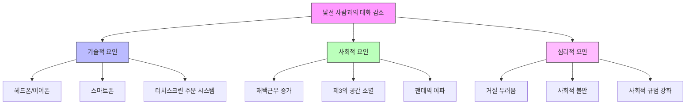
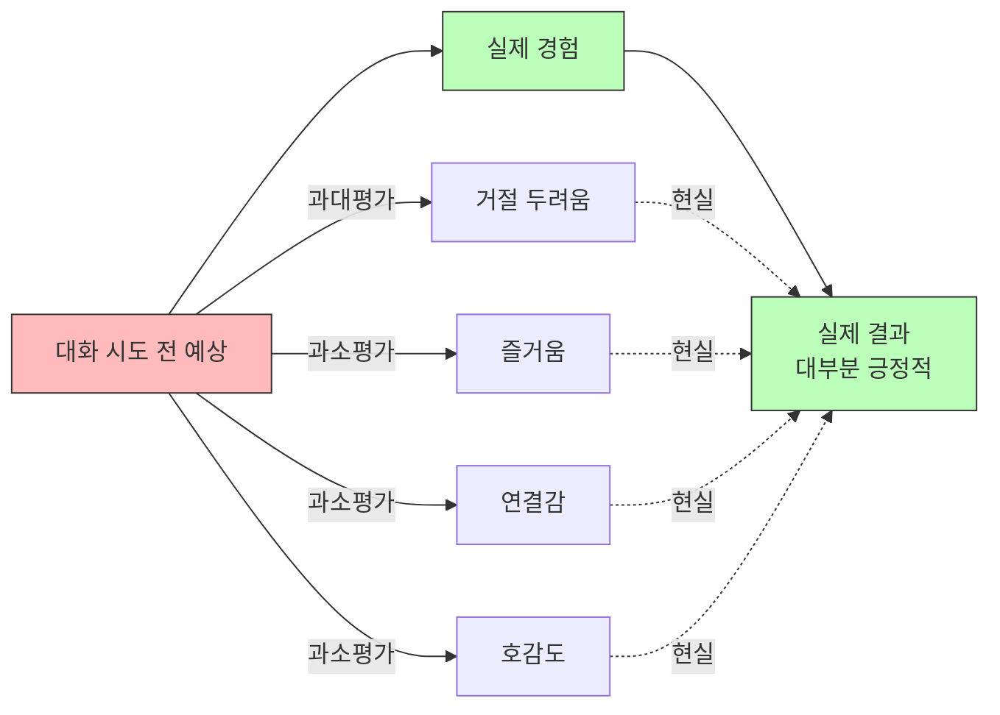
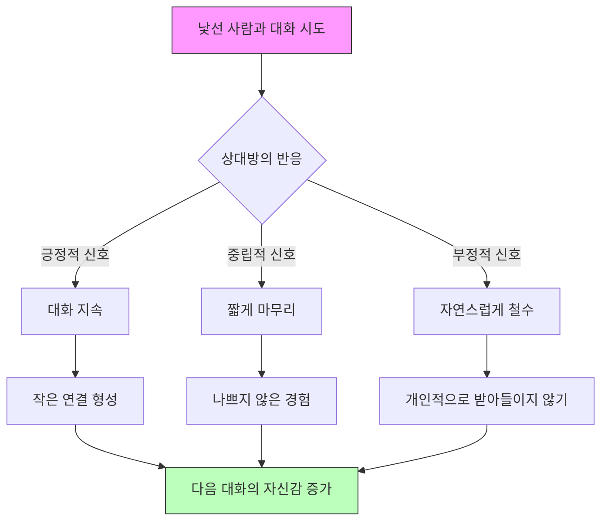
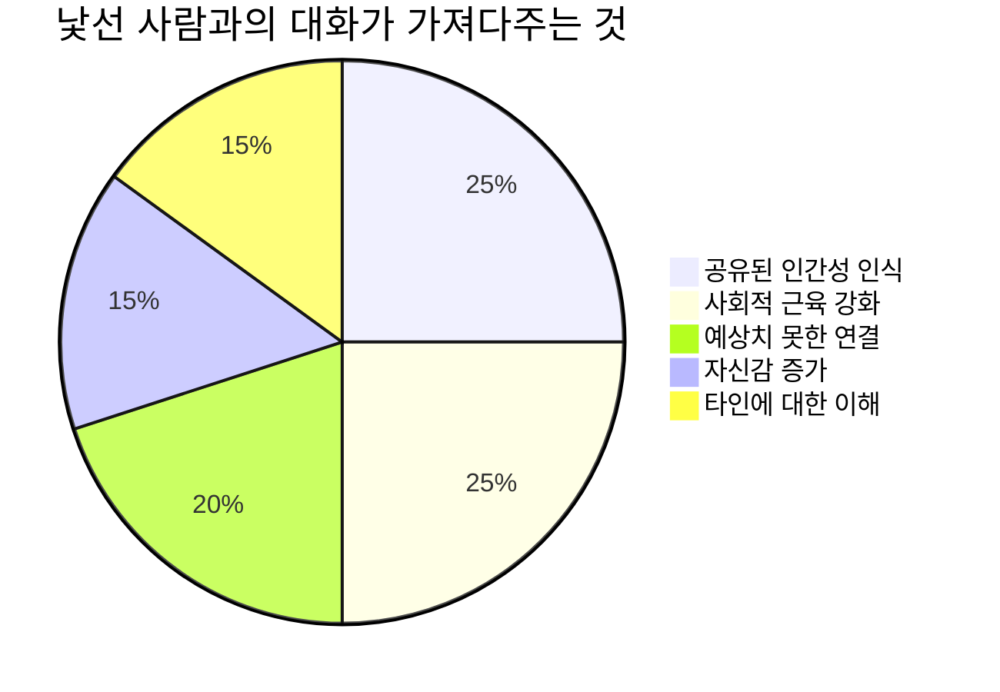

공개 발표에 대한 두려움은 널리 알려져 있지만, 더 근본적인 변화가 일어나고 있다. 많은 사람들이 이제 **'공공장소에서 아무에게도 말하지 않는 것'** 을 선호하게 되었다는 것이다. 이 글에서는 낯선 사람과의 대화가 왜 사라지고 있는지, 그것이 우리에게 미치는 영향, 그리고 어떻게 다시 연결을 시작할 수 있는지 살펴본다.

<!--more-->

## Sources

- [The stranger secret: how to talk to anyone – and why you should - The Guardian](https://www.theguardian.com/lifeandstyle/2026/feb/24/stranger-secret-how-to-talk-to-anyone-why-you-should)

## 낯선 사람과의 대화가 사라진 이유

기자 비브 그로스콥(Viv Groskop)은 열차에서 70대 여성이 다가와 자신의 힘든 하루를 이야기하는 경험을 했다. 그녀는 단지 누군가에게 자신의 이야기를 들려주고 싶었던 것이었다. 같은 날 저녁, 서울 출신의 식당 직원과 가볍게 한국 음식에 대해 이야기를 나눴다. 그런데 그녀의 15살 아들이 묻는다: **"그런 식으로 사람들에게 말해도 돼?"**

이 질문은 오늘날 우리가 처한 상황을 잘 보여준다. 낯선 사람과의 대화에 대한 **암묵적인 규칙** 을 배우는 과정이 사라지고 있는 것이다.

### 기술적 장벽

- **헤드폰/이어폰**: "나에게 말 걸지 마"라는 신호로 작용
- **스마트폰**: '팬텀 폰 사용(phantom phone use)' - 실제로 필요하지 않아도 폰을 보는 행위
- **터치스크린 주문**: 인간 상호작용 없이 주문이 가능해짐

### 사회적 변화

- **재택근모 증가**: 자연스러운 대화 기회 감소
- **제3의 공간(third spaces) 소멸**: 카페, 펍 등 비공식 모임 장소의 역할 축소
- **팬데믹 여파**: 2미터 거리 규칙이 여전히 심리적으로 작용

### 가장 큰 장애물: 사회적 규범 강화

> "아무도 당신에게 말을 걸지 않으면, 당신도 아무에게도 말을 걸지 않는다. 대기실에서 아무도 대화를 나누지 않는데 당신만 캐주얼하게 말을 건다는 것은 갑자기 그리 캐주얼하지 않게 느껴진다."

## 세대별 영향과 전문가들의 경고

### 인지 능력의 저하

인지신경과학자 **재러드 쿠니 호바스 박사(Dr Jared Cooney Horvath)** 의 경고는 충격적이다:

> "Z세대는 역사상 처음으로 이전 세대보다 인지 측정에서 저조한 성과를 보이는 세대이다."

베스트셀러 작가이자 두 십대 자녀의 아버지인 **랭건 채터지 박사(Dr Rangan Chatterjee)** 도 비슷한 우려를 표한다:

> "나는 우리가 자존감이 낮고 대화를 어떻게 이끌어야 하는지 모르는 아이들을 키우고 있다고 생각한다."

### 글로벌 관계 불황

심리학자 **에스더 페렐(Esther Perel)** 은 이를 **"글로벌 관계 불황(global relational recession)"** 이라고 부른다. 그녀는 말한다:

> "중요한 것은 깊이가 아니다. 중요한 것은 연습, 우리 사회적 근육의 부드러운 강화다."

```mermaid
mindmap
  root((낯선 사람과의<br/>대화 부재 영향))
    개인 차원
      자존감 저하
      대화 능력 상실
      사회적 불안 증가
      인지 능력 저하
    사회 차원
      공동체 약화
      분극 심화
      고립감 확산
      신뢰 감소
    세대적 차원
      Z세대 인지 저하
      사회적 근육 약화
      관계 형성 어려움
```

## 소셜 미디어의 역설

흥미롭게도 소셜 미디어에서는 '낯선 사람과의 대화'가 하나의 장르가 되었다. **"사회 불안"**, **"외향적"**, **"낯선 사람과 대화하기"** 카테고리 하에 영상들이 쏟아져 나오고 있다.

하지만 이런 콘텐츠에는 문제가 있다:

1. **퍼포먼스적 성격**: 대화 자체보다 촬영과 업로드가 목적
2. **일방적 연결**: 상대방은 '체크리스트의 과제'로 전락
3. **조작적 요소**: 클릭과 조회수를 위한 기획된 만남
4. **동의 불확실**: 촬영에 대한 동의가 명확하지 않은 경우가 많음

이는 낯선 사람과의 대화를 더욱 **인위적이고 위화감 있는 것** 으로 만든다.

## 과장된 두려움: 우리가 잘못 알고 있는 것들

### 버지니아 대학교 연구

버지니아 대학교의 연구(Talking with strangers is surprisingly informative)에 따르면, 우리는 대화의 즐거움을 과소평가한다:

> "사람들은 대화에서 얼마나 즐거움을 느낄지, 대화 파트너와 얼마나 연결감을 느낄지, 그리고 파트너가 자신을 얼마나 좋아할지 과소평가하는 경향이 있다."

### 스탠퍼드 대학교 연구

스탠퍼드 대학교의 **자밀 자키 교수(Prof Jamil Zaki)** 팀은 캠퍼스에 다가가기 쉬움과 따뜻함에 대한 메시지가 담긴 포스터를 붙였다. 연구진이 발견한 것은 학생들에게 가장 필요한 것이 **'허락'** 이었다는 점이다:

> "너무 자주, 우리는 대화와 연결이 우리를 지치게 하거나, 다른 사람들을 믿을 수 없을 것이라고 확신한다. 우리 마음속에서 우리는 사람들(그리고 우리 자신)을 극도로 실망스러운 존재로 그려낸다. 하지만 그들 - 그리고 우리 - 은 거의 그렇게 나쁘지 않다."

## 낯선 사람에게 말 걸기: 실천 가이드

### 1. 비용을 낮추라

서섹스 대학교 심리학자 **질리안 샌드스트롬(Gillian Sandstrom)** 은 이런 대화 시도를 **"작은 인간화 행위(small, humanising acts)"** 라고 부른다. 여기서 '작은' 이라는 점이 중요하다.

> "춥네요, 그렇죠?" 라고 말하는 것이다. 세계 평화를 위한 여정에 동찹해달라고 요청하는 것이 아니다.

### 2. 출구 전략을 마련하라

- **거절받았을 때**: "못 들었거나 힘든 날이겠지"라고 가정하고 넘어간다
- **불편할 때**: "지금은 대화하기 어렵네요"라고 명확히 말한다
- **나쁜 날일 때**: 친절할 의무가 없다. 자신의 상태를 존중하라

### 3. 자신을 알라

모든 사람이 대화하고 싶은 것은 아니다. 모든 사람이 대화를 받아들이고 싶은 것도 아니다. **그것도 괜찮다.** 날과 기분에 따라 다를 수 있다.

### 4. 사회적 신호를 읽어라

경험을 통해 어떤 상황에서 대화가 환영받을지 판단하는 능력을 키운다. 이는 나이가 들면서 자연스럽게 배우는 '암묵적인 코드'다.

## 왜 여전히 중요한가

### 개인적 차원

비가 올지 이야기하는 것이 인생을 바꿀까? 아마 아닐 것이다. 하지만 누군가의 하루를 밝게 할 **가장 작은 가능성** 조차 가치가 있다.

### 사회적 차원

> "스몰토크가 당신의 삶을 근본적으로 바꾸지 않을 수 있다. 하지만 그것의 부재는 우리가 아는 인간의 삶을 근본적으로 바꿀 것이다."

우리는 **불필요한 분열** 의 세계에 살고 있다. 스몰토크는 우리의 공유된 인간성에 대한 **작고, 무료이며, 어쩌면 무한히 가치 있는 상기** 다.

### 연결을 포기할 때의 결과

의도적으로 낯선 사람과의 대화를 포기하고, 폰 방패 뒤에 숨기로 결정한다면 그 결과는 끔찍할 것이다. **우리는 이미 그럴 위기에 처해 있다.**

## 핵심 요약

| 측면 | 핵심 내용 |
|------|----------|
| **현상** | 공공장소에서 낯선 사람과의 대화가 급격히 감소 |
| **원인** | 기술(폰, 헤드폰), 재택근무, 팬데믹, 사회적 규범 강화 |
| **영향** | Z세대 인지 능력 저하, 대화 능력 상실, 글로벌 관계 불황 |
| **오해** | 대화의 즐거움과 호감도를 과소평가, 거절 두려움을 과대평가 |
| **해법** | 낮은 비용의 시도, 출구 전략, 자기 이해, 사회적 신호 읽기 |
| **가치** | 공유된 인간성 확인, 사회적 근육 강화, 분열 완화 |

## 결론

낯선 사람에게 말을 거는 것은 더 이상 자연스러운 행동이 아니다. 우리는 기술과 팬데믹, 그리고 서로를 통해 그 능력을 잃어가고 있다. 하지만 전문가들의 연구는 명확하다: **우리의 두려움은 과장되어 있다.**

작은 대화, 작은 연결, 작은 인간화 행위. 이것들이 우리가 잃어가고 있는 것이다. 그리고 되찾는 방법은 의외로 간단하다: **"한 번 시도해 보는 것"**. 누군가에게 "춥네요"라고 말하는 것만으로도 충분하다.

> "어쨌든 우리의 최악의 두려움은 거의 현실이 되지 않는다. 그리고 설령 그렇게 되더라도, 나중에 당신에게 낯선 사람이 아닌 사람들에게 이야기할 좋은 이야기가 될 것이다."

**너무 늦기 전에, 대화를 시작하자.**
