AI를 쓴다고 모든 것이 빨라질 것이라고 생각하시나요? 안타깝게도 그렇지 않습니다. 어떤 사람들은 AI를 쓰면서 오히려 더 느려지기도 합니다. 하루 종일 AI와 대화하는데 결과물은 예전과 똑같은 사람들이 있습니다. 왜 그런 차이가 발생할까요?

<!--more-->

## Sources

- [AI 스킬 9가지… 이거 모르면 내년에 도태됩니다 | 메이커 에반](https://www.youtube.com/watch?v=v8T7u3IJZ7Q)

### 타임스탬프 참조

| 구간 | 주제 | 링크 |
|------|------|------|
| 도입 | AI 쓴다고 다 빨라지지 않는다 | [0:00](https://youtu.be/v8T7u3IJZ7Q?t=0) |
| 스킬 1 | 쪼개는 능력 | [1:00](https://youtu.be/v8T7u3IJZ7Q?t=60) |
| 스킬 2 | 실패 복구 능력 | [2:30](https://youtu.be/v8T7u3IJZ7Q?t=150) |
| 스킬 3 | 완료 기준 | [3:30](https://youtu.be/v8T7u3IJZ7Q?t=210) |
| 스킬 4 | 컨텍스트 설계 | [4:20](https://youtu.be/v8T7u3IJZ7Q?t=260) |
| 스킬 5 | 관찰 능력 | [5:20](https://youtu.be/v8T7u3IJZ7Q?t=320) |
| 중간 정리 | AI 관리의 본질 | [6:10](https://youtu.be/v8T7u3IJZ7Q?t=370) |
| 스킬 6 | 기억 설계 | [6:40](https://youtu.be/v8T7u3IJZ7Q?t=400) |
| 스킬 7 | 병렬 관리 | [7:10](https://youtu.be/v8T7u3IJZ7Q?t=430) |
| 스킬 8 | 큐레이션 | [7:40](https://youtu.be/v8T7u3IJZ7Q?t=460) |
| 스킬 9 | 자동화의 자동화 | [8:10](https://youtu.be/v8T7u3IJZ7Q?t=490) |
| 결론 | 작은 변화가 큰 차이를 | [8:30](https://youtu.be/v8T7u3IJZ7Q?t=510) |

---

## AI와 일한다는 것: 에이전틱 AI의 시대

AI가 처음 나왔을 때는 "글 써줘", "번역해줘" 수준이었습니다. 하지만 요즘 AI는 다릅니다. 프로젝트 기획, 문서 분석, 보고서 작성, 업무 자동화까지 맡길 수 있습니다. AI가 단순한 도구를 넘어 진짜 팀원처럼 일하기 시작한 것입니다. 이를 **에이전틱 AI(Agentic AI)**라고 부릅니다.

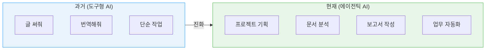

하지만 여기에 함정이 있습니다. **AI는 멍청하게 시키면 멍청하게 일합니다.** 반대로 제대로 시키면 엄청나게 잘합니다. 같은 AI를 쓰는데 한 사람은 10분 만에 끝내고, 다른 사람은 2시간 동안 삽질하는 차이가 바로 여기서 발생합니다. 이 차이를 만드는 것이 바로 이번에 소개할 **9가지 스킬**입니다.

---

## 1. 쪼개는 능력 (Task Decomposition)

AI에게 일을 시킬 때 가장 많이 하는 실수는 무엇일까요? 바로 **"이 프로젝트 다 해줘"**라고 말하는 것입니다. 이렇게 하면 AI가 적당히 무언가를 만들어내는데, 여러분이 원하는 것이 아닐 확률이 높습니다.

이것은 마치 신입사원에게 "이번 행사 준비해줘"라고 말하는 것과 같습니다. 그 신입사원은 어디서부터 시작해야 할지 모릅니다.

### 잘하는 사람들의 방식

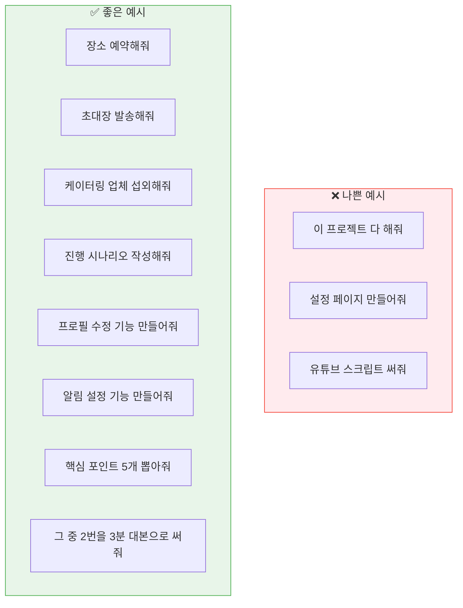

**실제 적용 예시** (콘텐츠 기획):
- ❌ "유튜브 스크립트 써줘"
- ✅ "먼저 이 주제의 핵심 포인트 다섯 개 뽑아줘"
- ✅ "그 중 2번 포인트를 3분짜리 대본으로 써줘"

> 💡 **핵심 팁**: 시작하기 전에 AI와 5분 대화하세요. 정확히 무엇을 원하는지 물어보면서요. 그 5분이 나중에 반나절 삽질을 막아줍니다.

---

## 2. 실패 복구 능력 (Failure Recovery)

AI가 엉뚱한 결과물을 가져왔을 때, 대부분의 사람들은 **"다시 해줘"**라고 말합니다. 하지만 이건 별로 효과가 없습니다. AI는 왜 실패했는지 모르기 때문에 또 비슷한 것을 가져옵니다.

### 실패 분석 프로세스

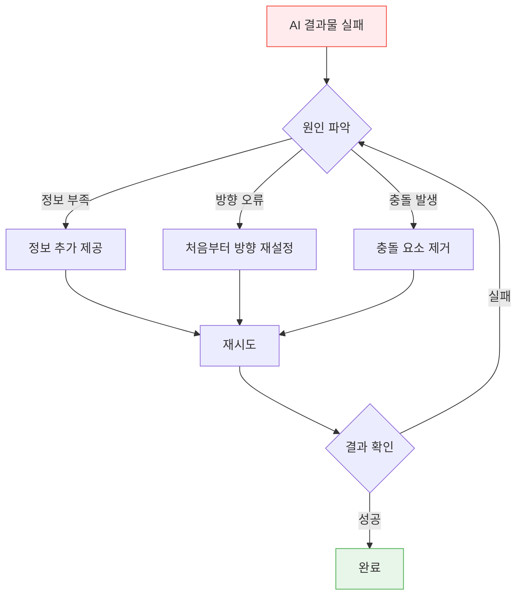

### 실제 예시

AI가 만든 마케팅 문구가 너무 딱딱하게 나왔을 때:

- ❌ "다시 해줘"
- ✅ "이 문구가 딱딱하게 느껴지는 이유가 뭔지 분석해줘"
- ✅ "우리 타겟은 20대 후반 직장인이야. 이들에게 맞는 톤으로 다시 써줘"

이것은 의사가 "증상이 뭔가요?"부터 물어보는 것과 같습니다. 무조건 "약 드세요"가 아니라 원인을 찾고 처방하는 것입니다.

---

## 3. 완료 기준 (Completion Criteria)

"잘해줘"라는 말은 함정입니다. 잘이란 얼마나 잘? 어떻게 잘? AI는 자기 나름대로 잘 해주는데, 그게 여러분의 잘과 다를 수 있습니다.

### 명확한 완료 기준 설정

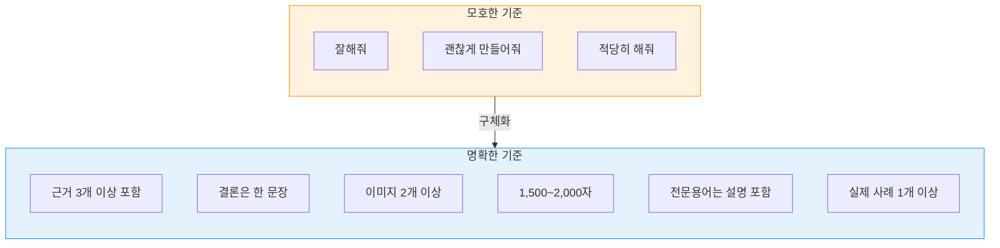

**보고서 작성 완료 기준 예시**:
- ✅ 근거 3개 이상 포함
- ✅ 결론은 한 문장
- ✅ 이미지 2개 이상
- ✅ 1,500자 이상, 2,000자 이하
- ✅ 전문 용어는 반드시 한 번씩 설명
- ✅ 실제 사례 한 개 이상 포함

이렇게 구체적으로 정해놔야 "다 했어요"라고 AI가 가져왔을 때 "이게 완성이야?"라는 상황을 막을 수 있습니다.

---

## 4. 컨텍스트 설계 (Context Design)

AI는 기억이 없습니다. 매번 처음 보는 사람처럼 됩니다. 따라서 AI에게 일을 시킬 때는 우리 회사가 어떤 회사고, 이 프로젝트가 어떤 프로젝트고, 내가 해야 할 역할이 뭔지 매번 설명해줘야 합니다.

### 온보딩 문서 활용

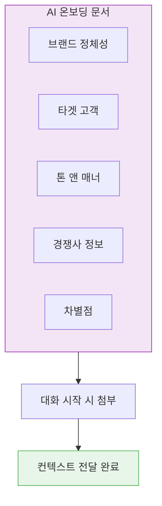

**컨텍스트 문서 예시**:
- 우리 브랜드는 2, 30대 직장인 대상
- 톤은 친근하지만 전문적이어야 함
- 경쟁사는 A, B, C가 있음
- 우리가 강조하는 차별점은 X, Y, Z

이런 내용을 한 파일에 정리해서 대화 시작할 때마다 붙여넣습니다. 처음 만드는 데 1시간 걸리지만, 이후 몇십 시간을 절약해줍니다.

---

## 5. 관찰 능력 (Observation)

AI에게 큰 작업을 맡기면 중간에 뭘 하고 있는지 놓치기 쉽습니다. 이것은 마치 공사 현장 감리와 같습니다. 다 지어놓고 보면 늦습니다. 벽 세우기 전에 기초 확인하고, 지붕 올리기 전에 구조 확인해야 합니다.

### 단계별 체크포인트

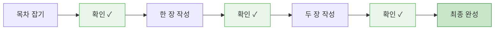

**보고서 작성 예시**:
1. 목차 먼저 잡아줘 → 확인
2. 한 장만 써줘 → 확인
3. 두 장 써줘 → 확인
4. (반복)

한 번에 다 해달라고 하면 나중에 엉키는 경우가 생깁니다. 작은 단위로 자주 확인하는 습관이 나중에 시간을 엄청 절약해줍니다.

---

## 중간 정리: AI 관리의 본질

지금까지 5가지를 살펴봤습니다.

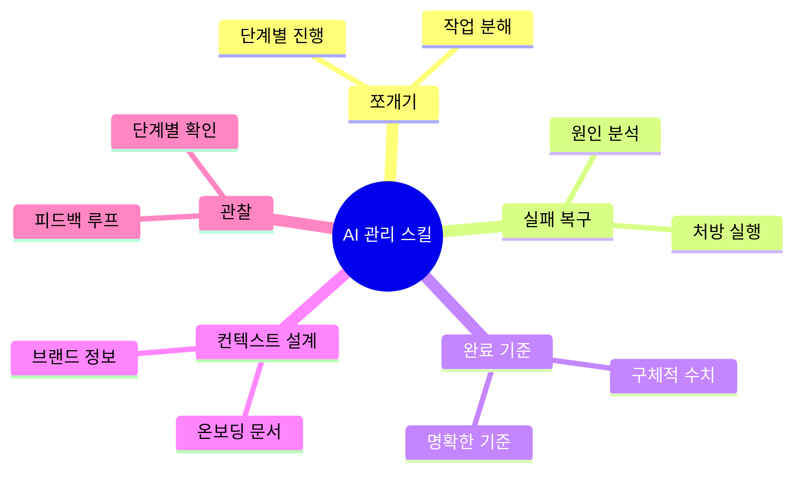

이게 다 무슨 얘기일까요? **결국 AI를 팀원처럼 잘 관리하는 능력**입니다.

놀라운 점은 AI 시대에 필요한 능력이 사실 예전부터 좋은 팀장, 좋은 관리자에게 필요했던 능력과 거의 똑같다는 것입니다.

- 명확한 지시
- 충분한 정보 제공
- 명확한 기준
- 피드백
- 점검

**AI가 강해질수록 사람의 능력이 더 중요해집니다.** 그리고 이것은 좋은 소식이기도 합니다. 완전히 새로운 능력을 처음부터 배울 필요는 없기 때문입니다. 이미 일 잘하는 사람들에게 익숙한 방식을 AI에게 그대로 적용하면 됩니다.

---

## 6. 기억 설계 (Memory Design)

AI와 일하다 보면 어제 했던 얘기를 오늘 또 해야 하는 상황이 생깁니다. 컨텍스트가 날라가기 때문입니다. 이것은 매일 아침 새 직원에게 회사 소개부터 다시 하는 것과 같습니다.

### 기억 파일 시스템

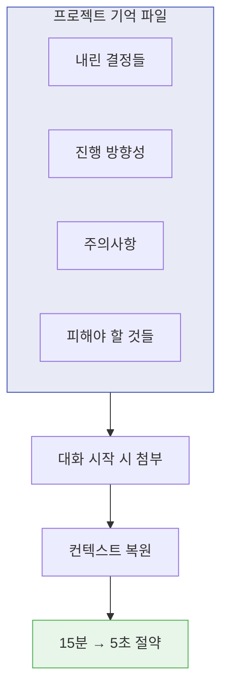

**실제 적용 예시** (콘텐츠 프로젝트):
- 채널 방향성
- 타겟 시청자
- 지금까지 결정한 것들
- 피해야 할 것들

이런 내용을 프로젝트 브리프로 만들어 대화 시작할 때마다 첨부합니다. 이렇게 하면 컨텍스트 복원 시간이 **15분에서 5초**로 줄어듭니다.

회사에서 업무 인수인계가 잘 된 팀이 얼마나 효율적인지 아시죠? 그것이 AI 세계에서도 똑같이 적용됩니다.

---

## 7. 병렬 관리 (Parallel Management)

잘하는 사람들은 AI 하나랑만 일하지 않습니다. 동시에 여러 개를 돌립니다. 이것은 팀장이 여러 팀원에게 동시에 일을 나눠주는 것과 같습니다.

### 병렬 작업 구조

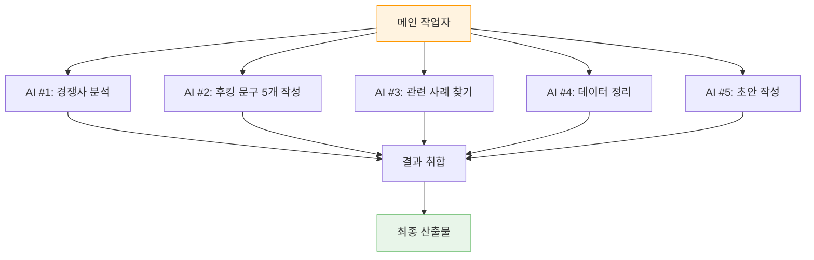

**콘텐츠 제작 예시**:
- AI #1: 경쟁사 분석해줘
- AI #2: 우리 주제로 후킹 문구 5개 써줘
- AI #3: 관련 사례 찾아줘

각각 다른 창에서 동시에 돌아갑니다. 처음에는 하나만 해보고 익숙해지면 두 개, 세 개, 네 개로 늘려갑니다. 저는 보통 5개의 창을 병렬로 사용합니다.

이게 제대로 되면 **혼자서도 팀 하나 분량의 일**을 할 수 있습니다. 처음에는 "이렇게까지 해야 해?" 싶지만, 한번 해보면 다시는 하나만 쓰기 힘들어집니다.

---

## 8. 큐레이션 (Curation)

어쩌면 가장 중요한 스킬일 수 있습니다. AI는 빠르게 괜찮은 것을 만듭니다. 80점짜리는 금방 나옵니다. 하지만 그게 진짜 좋은 건지, 그냥 그럭저럭한 건지, 뭔가 이상한 건지 아는 것이 큐레이션입니다.

### 큐레이션 능력 키우기

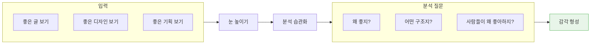

**큐레이션 능력 키우는 법**:

1. **좋은 것을 많이 보기**: 좋은 글, 좋은 디자인, 좋은 기획을 많이 보면 눈이 높아집니다.

2. **의식적으로 분석하기**: "좋다"로 끝내지 말고 "이게 왜 좋지?", "어떤 구조로 되어 있지?" 질문을 습관으로 만듭니다.

3. **사람들의 반응 관찰하기**: "사람들이 이걸 왜 좋아하지?", "이게 왜 안 되지?" 질문을 계속하다 보면 감각이 생깁니다.

**결국 AI가 아무리 좋아져도, 이게 좋은 건지 아닌지 판단하는 건 사람입니다.** 나머지 20점은 인간의 큐레이션 영역입니다.

---

## 9. 자동화의 자동화 (Automation of Automation)

처음에는 AI에게 직접 "이거 해줘" 합니다. 하지만 매번 같은 말 반복하는 게 귀찮습니다. 그래서 **반복되는 지시 자체를 자동화**합니다. "이런 상황에서는 항상 이렇게"라는 규칙을 만드는 것입니다.

### 자동화 레이어

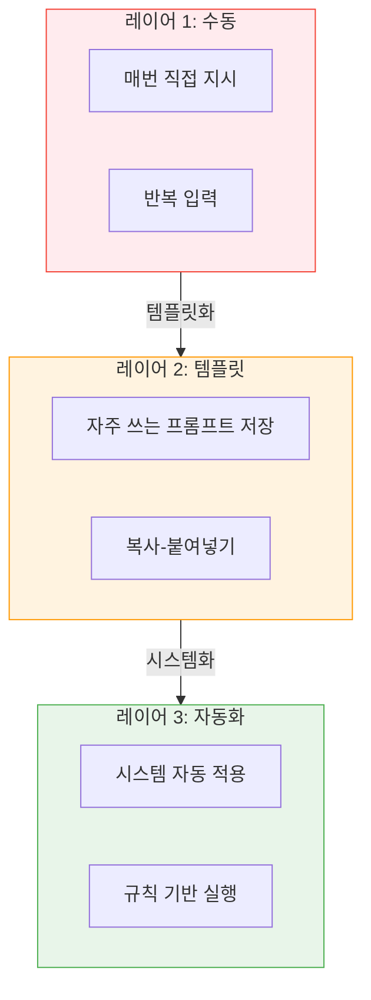

**실제 예시**:
저는 새 스크립트를 쓸 때마다 채널 스타일 지침을 붙이는 게 귀찮아졌습니다. 그래서 그걸 자동으로 붙여주는 시스템을 만들었습니다.

### 복리 효과

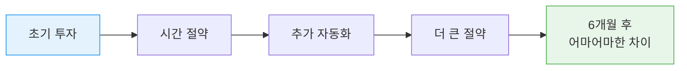

이게 쌓이면 쌓일수록 여러분이 할 일이 줄어듭니다. AI가 알아서 합니다. 이것은 **복리**입니다. 시간이 지날수록 효과가 커집니다.

- 처음에는 큰 차이 없을 수 있습니다
- 6개월, 1년 지나면 그 차이가 어마어마해집니다
- 지금 순간 조금 투자하면 나중에 몇 배로 돌아옵니다

---

## 핵심 요약

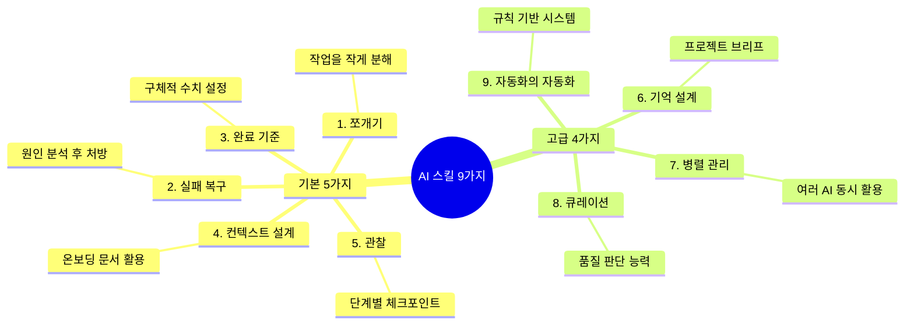

| 스킬 | 핵심 | 난이도 |
|------|------|--------|
| 쪼개기 | 큰 작업을 작게 분해 | ⭐ |
| 실패 복구 | 원인 분석 → 처방 | ⭐⭐ |
| 완료 기준 | 구체적 수치 설정 | ⭐ |
| 컨텍스트 설계 | 온보딩 문서 작성 | ⭐⭐ |
| 관찰 | 단계별 확인 습관 | ⭐ |
| 기억 설계 | 프로젝트 브리프 관리 | ⭐⭐⭐ |
| 병렬 관리 | 여러 AI 동시 활용 | ⭐⭐⭐ |
| 큐레이션 | 품질 판단 안목 | ⭐⭐⭐⭐ |
| 자동화의 자동화 | 규칙 기반 시스템 구축 | ⭐⭐⭐⭐ |

---

## 결론

오늘 살펴본 9가지 스킬은 완전히 새로운 능력이 아닙니다. 원래부터 일 잘하는 사람들, 팀 잘 이끄는 사람들에게 있던 능력입니다. 단지 그 대상이 **사람에서 AI로 변화했을 뿐**입니다.

차이가 있다면, 이 능력을 AI와 함께 쓰면 **레버리지가 어마어마하게 커진다**는 것입니다. 예전에는 혼자서 할 수 있는 일에 한계가 있었습니다. 하지만 이제 이 9가지 스킬이 있으면 그 한계 자체가 달라집니다.

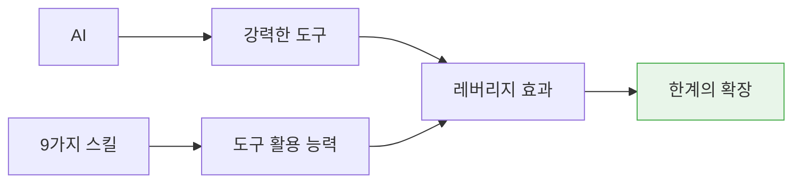

**AI는 도구입니다. 아주 강력한 도구. 하지만 도구를 잘 쓰는 건 결국 사람입니다.**

여러분이 9가지 능력을 갖추면 AI라는 도구가 여러분에게 어마어마한 레버리지가 됩니다. 갖추지 못하면 AI를 써도 별로 안 빨라지는 사람이 됩니다.

지금 당장 다 될 필요는 없습니다. **오늘부터 하나씩 시작해 보세요.** 오늘 AI에게 일시킬 때 일단 쪼개는 것부터요. 그 하나만 해도 내일이 달라집니다.

> **작은 변화가 6개월 뒤에 엄청난 차이를 만듭니다.**
