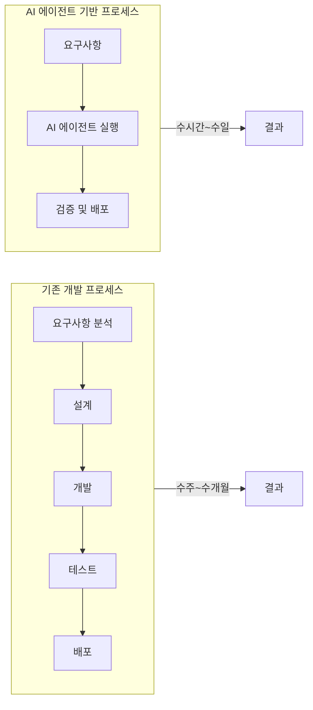
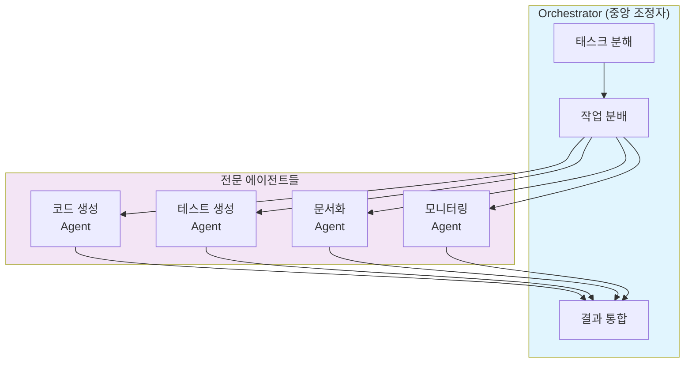
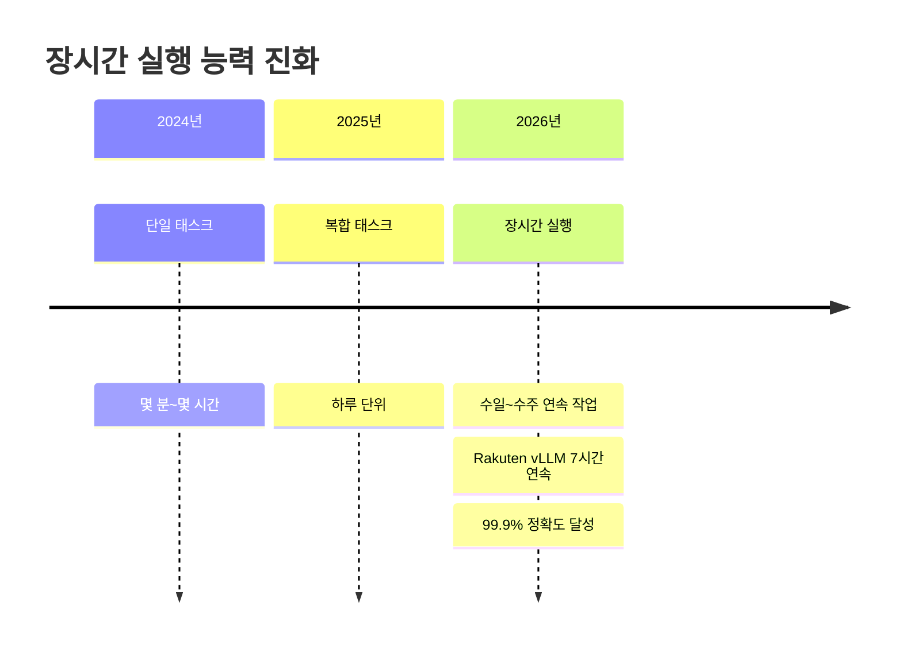
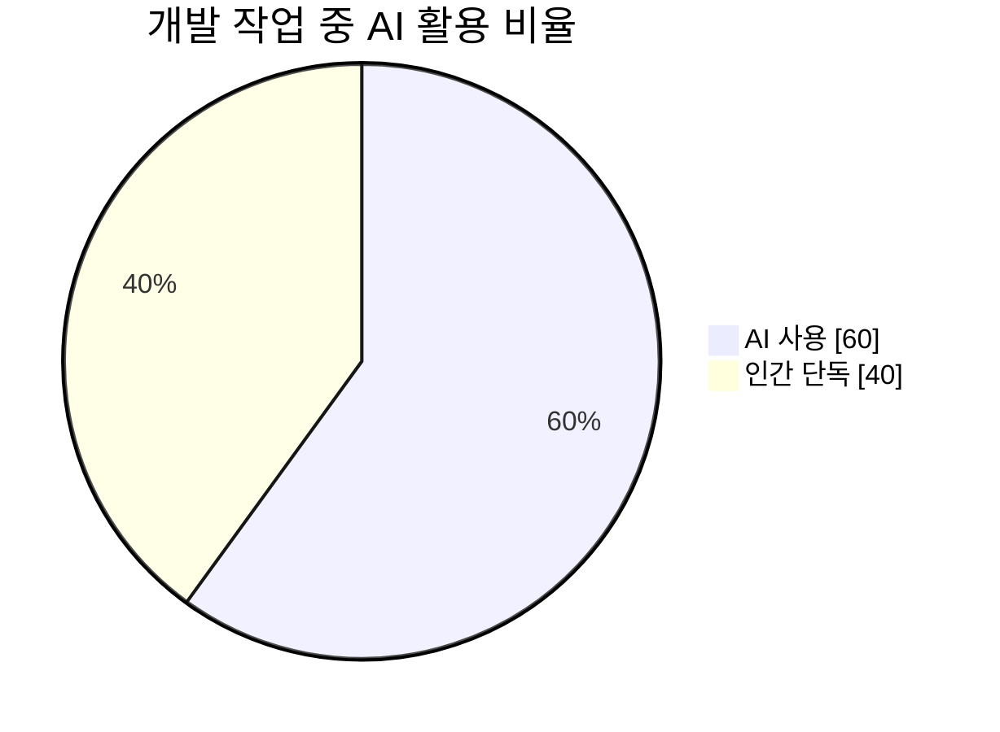
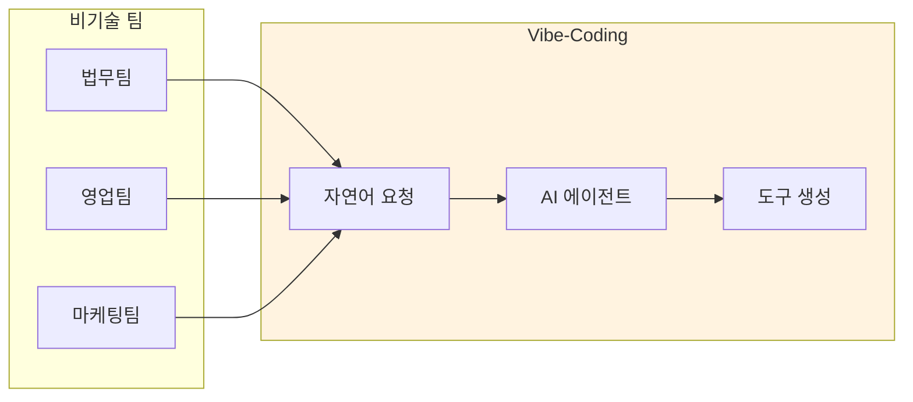
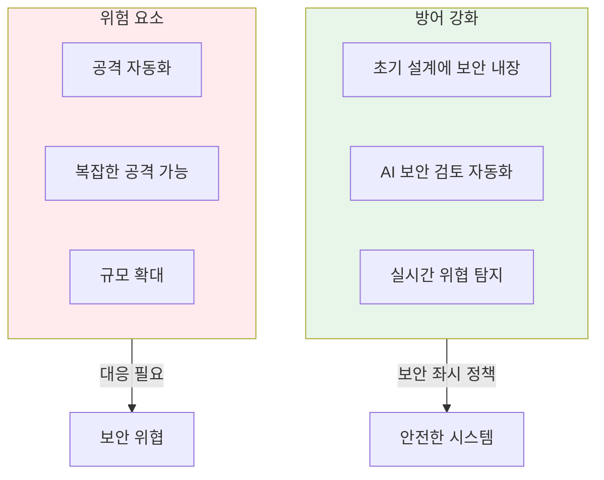
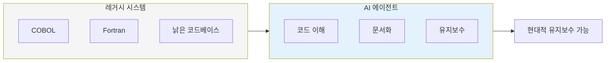

## 요약

Anthropic이 조용히 공개한 **2026 Agentic Coding Trends Report**는 AI가 코딩을 돕는 수준을 넘어, **코딩 자체가 바뀌고 있다**는 것을 보여줍니다.

> "AI가 코딩을 돕는 게 아니라, 코딩 자체가 바뀐다는 이야기입니다."

<!--more-->

## 핵심 통계

| 지표 | 수치 |
|------|------|
| 개발 작업 중 AI 사용 비율 | **60%** |
| 완전히 AI에 위임하는 작업 비율 | **0-20%** |
| 프로덕션에 AI 에이전트 배포한 기업 | **52%** |

## 1. SDLC 압축: 수주에서 수시간으로

개발 수명 주기(SDLC)가 극적으로 압축되고 있습니다.

### 실제 사례

| 기업 | 변화 |
|------|------|
| **Augment Code** | 4-8개월 프로젝트 → **2주** |
| **Rakuten** | vLLM(1,250만 라인)에서 **7시간 연속 작업**, 99.9% 정확도 |
| **Fountain** | 스태핑 사이클 1주 이상 → **72시간** |

## 2. Orchestrator 패턴: 멀티 에이전트 협업

복잡한 작업은 **중앙 조정자(Orchestrator)** 가 여러 전문 에이전트를 관리하는 패턴이 효과적입니다.

### Orchestrator 패턴 핵심 원칙

1. **명확한 역할 분담**: 각 에이전트가 무엇을 하고 하지 않을지 정의
2. **독립 컨텍스트**: 각 에이전트가 자신만의 컨텍스트 보유
3. **동기화 포인트 정의**: 예) API 문서 생성 후 구현 코드 작성
4. **버전 관리 활용**: Git으로 충돌 방지

## 3. 장시간 실행 능력

AI 에이전트가 **수시간, 심지어 수일** 동안 연속 작업할 수 있게 되었습니다.

### Claude Code 장시간 실행 예시

- **vLLM 프로젝트** (1,250만 라인): 7시간 연속 작업
- **정확도**: 99.9%
- **작업 방식**: 코드 작성 → 테스트 → 문서화 → 모니터링 일체화

## 4. 인간-AI 협업의 새로운 균형

하지만 **완전 위임 비율은 0-20%** 에 불과합니다. 이는 인간이 여전히 **핵심 의사결정** 을 담당하고 있음을 의미합니다.

### 인간 역할의 변화

| 기존 역할 | 새로운 역할 |
|-----------|-------------|
| 코드 구현 | 아키텍처 설계 |
| 디버깅 | 태스크 분해 |
| 테스트 작성 | 품질 보증 |
| 문서 작성 | 핵심 의사결정 |

## 5. Vibe-Coding: 프로그래밍 민주화

**Vibe-Coding** 은 자연어로 AI와 대화하며 개발하는 방식입니다.

### 활용 사례

- **법무팀**: 계약 조항 자동 검토
- **영업팀**: 고객 분류 시스템 구축
- **마케팅팀**: 데이터 시각화 대시보드

## 6. 보안: 양날의 검

AI는 보안을 강화할 수도, 공격 규모를 확대할 수도 있습니다.

### 보안 권장사항

1. **보안 좌시(Shift-Left)**: 설계 초기부터 보안 고려
2. **AI 보안 검토**: 자동화된 취약점 스캔
3. **핵심 의사결정점 검토**: 전체가 아닌 핵심 포인트만 인간 검토

## 7. 레거시 시스템 지원

AI가 레거시 언어를 이해하고 문서화하면서, **유지보수 비용이 대폭 감소**하고 있습니다.

## 조직을 위한 제언

### 1. 멀티 에이전트 조율 역량 확보

- Orchestrator 패턴 이해 및 적용
- 명확한 역할 분담과 동기화 포인트 정의

### 2. AI 보조 검토 체계 구축

- AI가 생성한 코드를 AI로 검토
- 인간은 핵심 의사결정점에 집중

### 3. 새로운 영역으로 확장

- 비기술 팀에 Vibe-Coding 도입
- 레거시 시스템 현대화

### 4. 보안 우선

- 설계 초기부터 보안 내장
- 자동화된 위협 탐지 및 대응

## 결론

**"대체가 아니라 협업 강화"** 가 AI 시대 성공의 열쇠입니다.

- 개발 주기: 수주 → 수시간
- 테스트 커버리지: 0% → 100%
- 인간 역할: 코드 구현자 → 조율자
- 실험 비용: 대폭 감소

AI가 코드를 작성하고, 테스트하고, 문서화하는 동안, 인간은 **전략적 의사결정** 에 집중할 수 있습니다.

---

## 참고 자료

- [Anthropic 2026 Agentic Coding Trends Report (PDF)](https://resources.anthropic.com/hubfs/2026%20Agentic%20Coding%20Trends%20Report.pdf)
- [원본 Threads 포스트](https://www.threads.com/@unclejobs.ai/post/DVaI1rsCX5a)
