Claude Code는 2025년 2월 출시 이후 AI와 함께 코딩하는 새로운 패러다임을 제시했습니다. 이 가이드는 바이브 코딩의 핵심 철학부터 최신 Agent Teams, Hooks 시스템, MCP 서버 활용까지 Claude Code의 모든 것을 다룹니다.

<!--more-->

## Sources

- [ClaudeGuide - Claude Code Complete Guide 2026](https://claudeguide-dv5ktqnq.manus.space/)

## 바이브 코딩이란?

**바이브 코딩(Vibe Coding)** 은 Andrej Karpathy가 2025년 2월 2일 처음 언급한 개념으로, LLM에게 프로젝트나 작업을 자연어로 설명하면 AI가 소스코드를 생성하는 개발 방식입니다. 개발자는 코드의 내부 구조를 면밀히 검토하기보다 **결과물과 직관(vibe)** 으로 방향을 조정합니다.

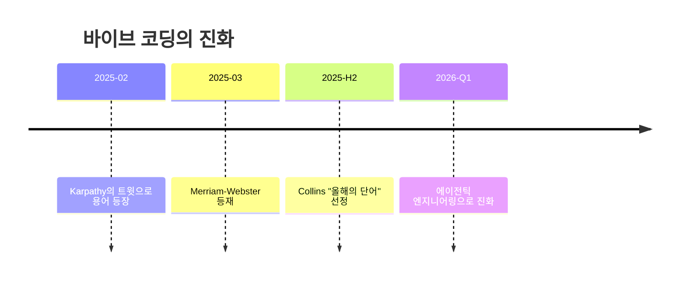

2026년 초, 바이브 코딩은 **"Stop Prompting, Start Governing"** 의 패러다임으로 진화했습니다. 프롬프트 엔지니어링에서 거버넌스 엔지니어링으로 전환하며 Hooks, Agent Teams, Skills를 통한 결정론적 제어가 핵심이 되었습니다.

## Claude Code의 5가지 시대

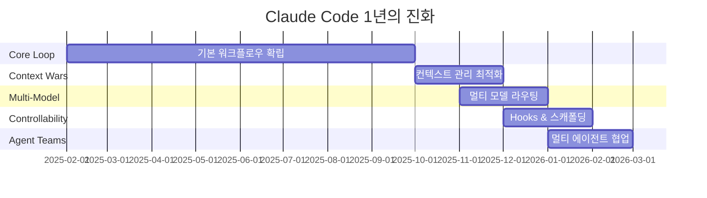

2025년 2월 출시 이후 Claude Code는 5번의 근본적 변화를 겪었지만, 핵심 원칙은 불변합니다: **Clean context, Explicit goals, Plan before executing, Read before editing, Verify before trusting.**

## 6대 핵심 철학

Claude Code를 효과적으로 활용하기 위한 6가지 핵심 철학입니다.

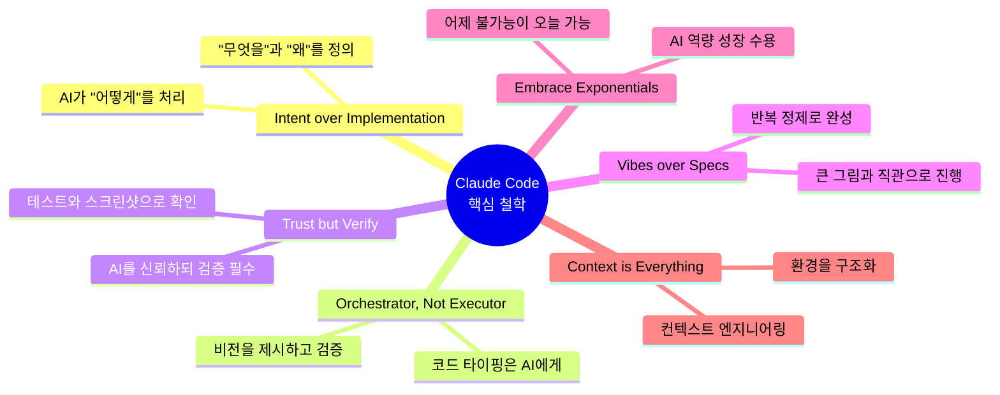

**2026년 핵심 트렌드** 는 컨텍스트 엔지니어링입니다. 영리한 프롬프트가 아닌, 올바른 답이 자명해지도록 환경을 구조화하는 것이 중요합니다.

## 4단계 황금 워크플로우

효과적인 Claude Code 활용을 위한 4단계 워크플로우입니다.

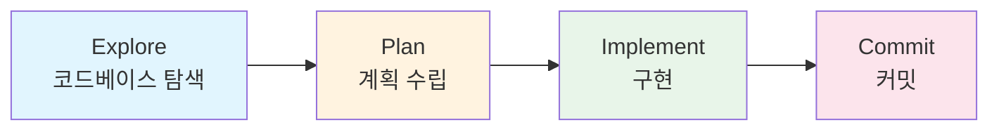

### 단계별 상세

| 단계 | 소요시간 | 활동 | 효과 |
|------|----------|------|------|
| **Explore** | ~30초 | AI가 코드베이스 탐색, 가정 표면화 | 잘못된 방향 사전 차단 |
| **Plan** | ~2분 | 단계별 구현 계획 작성 및 조정 | 일관된 아키텍처 보장 |
| **Implement** | 절약된 시간 | 승인된 계획에 따라 코드 작성 | 사후 디버깅 ~20분 절약 |
| **Commit** | - | 검증 후 커밋하고 PR 생성 | 안전한 버전 관리 |

**Plan Mode 활용 기준:** 접근법이 불확실할 때, 여러 파일을 수정할 때, 익숙하지 않은 코드를 수정할 때 사용하세요. 단순 오타 수정이나 로그 추가 같은 명확한 소규모 작업에는 불필요합니다.

## CLAUDE.md 완전 가이드

CLAUDE.md는 Claude의 **"헌법"** 역할을 하는 파일로, 프로젝트의 규칙, 컨벤션, 워크플로우를 정의합니다. Claude Code가 매 세션 시작 시 자동으로 읽어 컨텍스트로 사용합니다.

### 포함해야 할 것

- Claude가 추측할 수 없는 Bash 명령어
- 기본값과 다른 코드 스타일 규칙
- 테스트 실행 방법 및 선호 테스트 러너
- 브랜치 명명, PR 컨벤션 등 팀 에티켓
- 프로젝트 특유의 아키텍처 결정 사항
- 개발 환경 특이사항 (필수 환경 변수)
- 흔한 gotcha 및 비직관적 동작

### 제외해야 할 것

- 코드에서 이미 읽을 수 있는 것
- Claude가 이미 아는 언어 표준 규칙
- 상세 API 문서 (대신 링크 제공)
- 자주 바뀌는 정보
- "클린 코드 작성" 같은 자명한 지침
- 파일별 코드베이스 설명
- 장황한 설명이나 튜토리얼

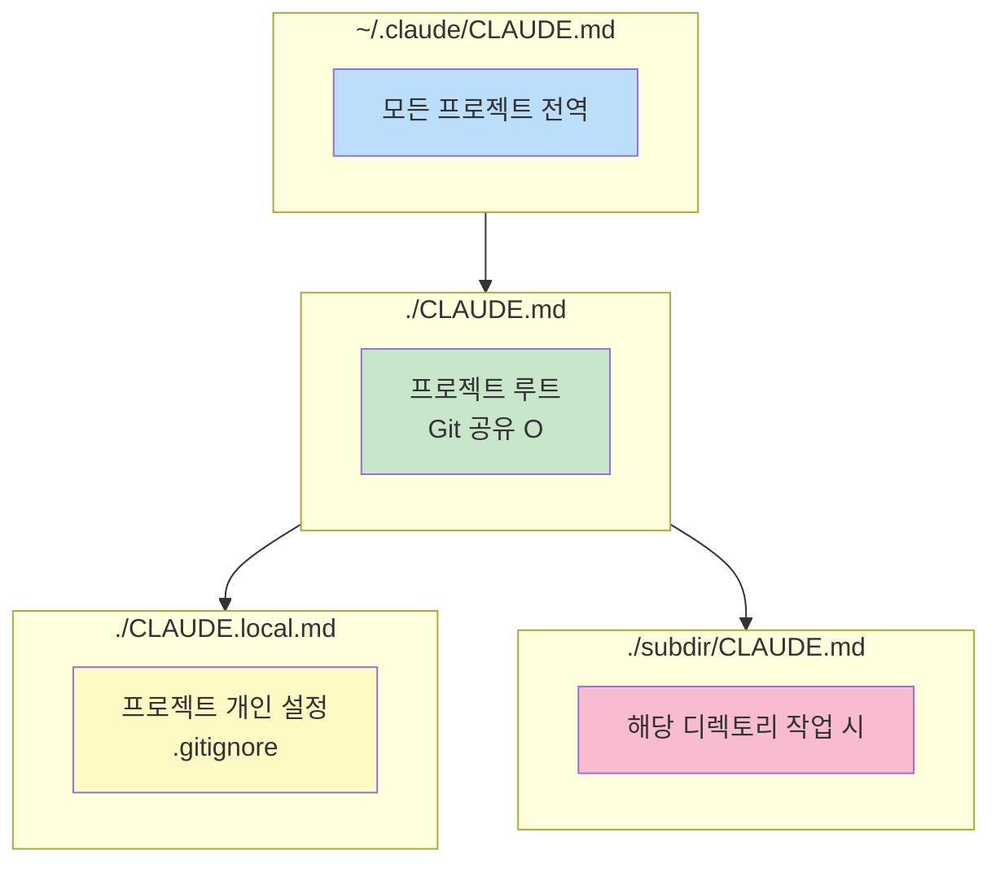

**Pro Tip:** "이 줄을 제거하면 Claude가 실수를 할까?" → **NO**이면 삭제하세요. 너무 긴 CLAUDE.md는 중요한 규칙이 묻혀 오히려 역효과를 냅니다.

## 컨텍스트 관리 전략

LLM 성능의 핵심은 컨텍스트 윈도우 관리에 있습니다. 전체 컨텍스트 윈도우는 **200K 토큰** (Opus 4.6: 1M 토큰 베타)이며, 자동 컴팩션은 ~80%에서 트리거됩니다.

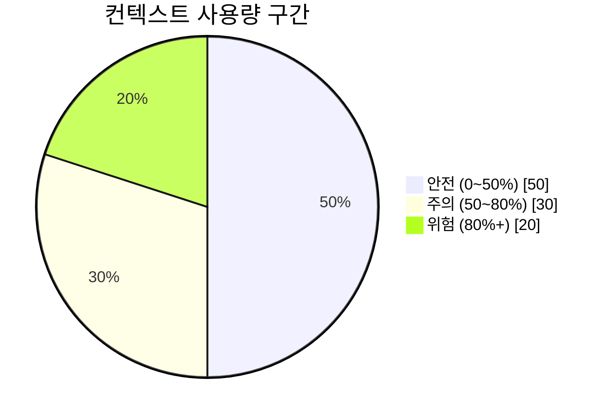

### 필수 명령어

| 명령어 | 기능 | 사용 시점 |
|--------|------|-----------|
| `/clear` | 컨텍스트 완전 초기화 | 새 작업 전, 성능 저하 시 |
| `/compact` | 지능형 압축 | 컨텍스트 50~60% 도달 시 |
| `/context` | 토큰 사용량 시각화 | 현재 상태 확인 |
| `/rewind` | 체크포인트 복원 | 잘못된 방향 되돌리기 |
| `claude --continue` | 최근 세션 이어서 시작 | 중단된 작업 재개 |
| `claude --resume` | 세션 목록에서 선택 | 특정 세션 복귀 |

**Handoff 문서 패턴:** 컨텍스트를 초기화하기 전에 HANDOFF.md를 작성하여 다음 세션이 즉시 이어받을 수 있도록 합니다.

## 프롬프팅 고급 기법

**검증 수단 제공이 단일 최고 레버리지 행동입니다.** 테스트, 스크린샷, expected output 없이 구현을 요청하지 마세요.

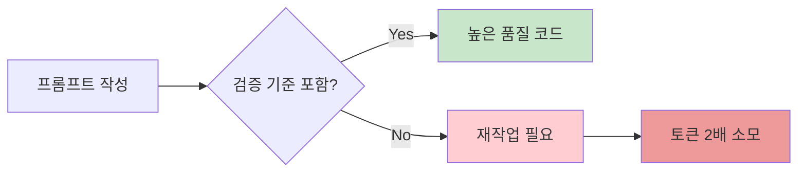

### 구조화된 프롬프팅 패턴

```
# 역할 정의 + 컨텍스트 + 제약조건 + 예상 출력 + 검증 기준

"당신은 시니어 백엔드 개발자입니다.
컨텍스트: PostgreSQL 16, Node.js 22, 기존 users 테이블 존재
요구사항: 사용자 인증 미들웨어 작성
제약조건: JWT 사용, refresh token 포함, rate limiting 필수
출력: 코드 + 테스트 + 보안 고려사항
검증 기준: SQL injection 방어, 401/403 적절한 분리"
```

### 인터뷰 기법

복잡한 기능을 구현하기 전에 Claude에게 인터뷰를 요청하면, 놓치기 쉬운 엣지 케이스와 트레이드오프를 사전에 발견할 수 있습니다.

```
"[간략한 설명]을 만들고 싶어.
자세히 인터뷰해줘.
기술 구현 방식, UI/UX,
엣지 케이스, 트레이드오프에 대해 질문해줘.
모든 내용을 다룰 때까지 계속 인터뷰하고,
완성된 스펙을 SPEC.md에 작성해줘."
```

## 서브에이전트 & 병렬 개발

서브에이전트를 활용하면 메인 컨텍스트를 보호하며 멀티태스킹이 가능합니다.

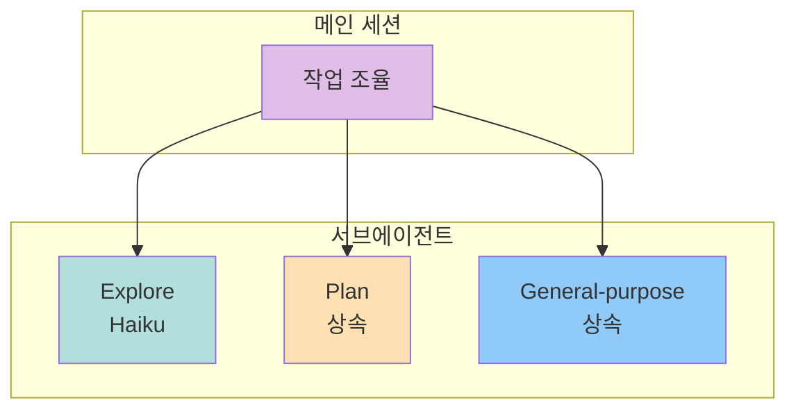

### 에이전트 유형

| 에이전트 | 모델 | 역할 | 도구 접근 |
|----------|------|------|-----------|
| **Explore** | Haiku (빠름) | 코드베이스 탐색 전용 | Read-only |
| **Plan** | 상속 | Plan Mode에서 컨텍스트 수집 | Read-only |
| **General-purpose** | 상속 | 복합 작업 수행 | Full access |

### Writer/Reviewer 패턴

Session A에서 구현, Session B에서 즉시 리뷰. 리뷰 결과를 다시 Session A에 전달하여 수정. 인간 코드 리뷰 대기 시간을 제거합니다.

## Agent Teams (2026 신기능)

Agent Teams는 여러 Claude Code 인스턴스가 **팀으로 협업**하는 기능입니다. Lead agent가 작업을 조율하고, 팀원들은 독립적으로 작업하며 서로 직접 소통합니다.

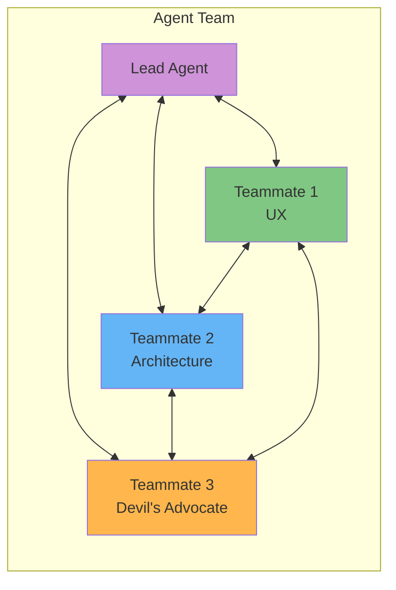

### 서브에이전트 vs Agent Teams

| 비교 항목 | 서브에이전트 | Agent Teams |
|-----------|--------------|-------------|
| **커뮤니케이션** | 메인에게만 보고 | 팀원 간 직접 소통 |
| **컨텍스트** | 메인 세션 내부 | 각자 독립 컨텍스트 윈도우 |
| **조율** | 메인 에이전트가 제어 | 공유 태스크 리스트로 자율 조율 |
| **토큰 사용** | 적음 | 많음 (병렬 세션) |
| **최적 용도** | 빠른 포커스 작업 | 리서치, 크로스 레이어, 경쟁 가설 |

### 활성화 방법

```json
// ~/.claude/settings.json
{
  "env": {
    "CLAUDE_CODE_EXPERIMENTAL_AGENT_TEAMS": "1"
  }
}
```

## Hooks 시스템

**Hooks** 는 Claude Code의 라이프사이클 이벤트에서 자동 실행되는 셸 명령입니다. CLAUDE.md 규칙은 확률적이지만, **Hooks는 결정론적으로 강제**합니다.

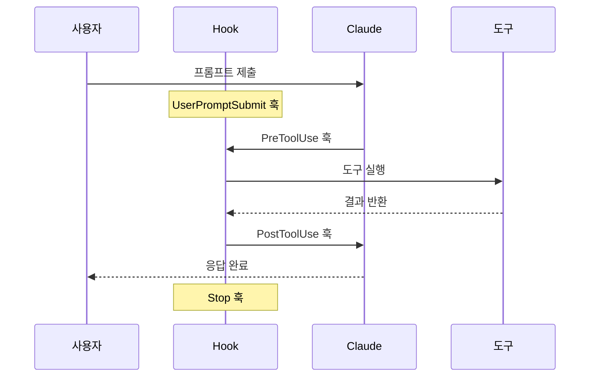

### 이벤트 유형

| 이벤트 | 트리거 시점 | 활용 예시 |
|--------|-------------|-----------|
| `PreToolUse` | 도구 실행 전 | 보호 파일 편집 차단, 위험 명령 필터링 |
| `PostToolUse` | 도구 실행 후 | 코드 자동 포맷 (Prettier), 린트 실행 |
| `Notification` | Claude가 입력 대기 | macOS/Linux 네이티브 알림 전송 |
| `SessionStart` | 세션 시작/재개 | 컴팩션 후 컨텍스트 재주입 |
| `Stop` | Claude 응답 완료 | 자동 커밋, 품질 체크 |

### Exit Code 의미

| 코드 | 의미 |
|------|------|
| `0` | 성공 — 계속 진행 |
| `2` | 차단 — 도구 실행 중단 |
| `기타` | 오류 — 경고 표시 후 계속 |

## 플러그인 & 확장 생태계

2026년 Claude Code 생태계는 **9,000개 이상**의 확장 옵션으로 폭발적으로 성장했습니다.

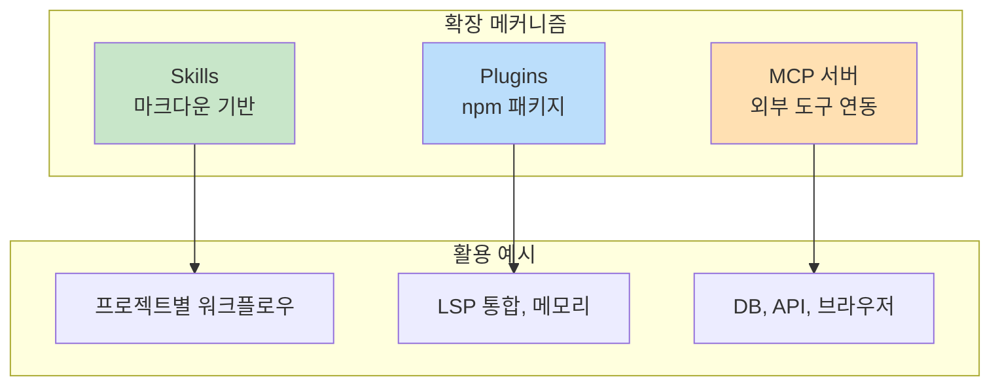

### 확장 유형 비교

| 확장 유형 | 설명 | 로드 방식 | 최적 용도 |
|-----------|------|-----------|-----------|
| **Skills** | 마크다운 기반 지식 + 실행 가능 명령 | 슬래시 명령 또는 자동 로드 | 프로젝트별 워크플로우, 코딩 패턴 |
| **Plugins** | npm 패키지로 배포되는 확장 | 설치 후 자동 활성화 | LSP 통합, 메모리, 브레인스토밍 |
| **MCP** | Model Context Protocol 서버 | 설정 파일에 등록 | 외부 도구/API 연동 |

### 커뮤니티 추천 필수 플러그인

- **LSP Plugin** — 실시간 타입 인텔리전스, 자동완성 정보 제공
- **Superpowers** — 20+ 프로덕션 검증 스킬 (브레인스토밍, 리팩토링 등)
- **chrome-devtools MCP** — AI가 브라우저에서 직접 디버깅
- **supermemory** — 세션 간 영구 메모리

## 보안 위험 & 필수 체크리스트

AI 생성 코드의 보안 취약점을 이해하고 방어하는 것이 중요합니다.

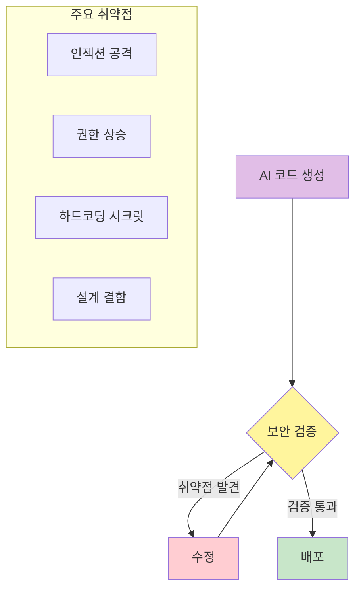

### 보안 통계

- **2.74x** — AI 코드 취약점 비율 (vs 인간 작성 코드)
- **+322%** — 권한 상승 경로 증가
- **45%** — OWASP Top 10 실패율
- **86%** — XSS(CWE-80) 실패율

### 슬롭스쿼팅(Slopsquatting) — 신종 공급망 공격

AI가 존재하지 않는 패키지 이름을 자신 있게 추천하는 "환각"을 악용합니다. 공격자가 미리 등록한 악성 패키지가 설치되어 API 키와 클라우드 토큰을 탈취합니다.

**방어:** 패키지 설치 전 반드시 npm/PyPI에서 게시자와 등록일을 직접 확인하세요. **Hooks로 자동화:** PreToolUse 훅으로 npm install 전 패키지 검증 스크립트를 실행하세요.

### 필수 보안 품질 게이트 8가지

1. **시크릿 스캐닝** — Gitleaks, TruffleHog, git-secrets로 커밋 전 자동 검출
2. **권한 상승 분석** — Semgrep, SonarQube로 인가 로직 검증
3. **의존성 취약점 검사** — Dependabot, Snyk으로 AI 추천 패키지 자동 스캔
4. **수동 보안 리뷰** — 인증/인가 코드는 반드시 사람이 검토
5. **AI 사용 감사 추적** — 어떤 코드가 AI 생성인지 기록
6. **80%+ 테스트 커버리지** — 신규 코드 기준 자동화된 테스트
7. **SAST/DAST 통합** — CodeQL, OWASP ZAP 파이프라인 연동
8. **사전 보안 인수 기준** — 코드 생성 전에 보안 요구사항 정의

## 바이브 코딩 7대 실수

### Critical 위험

**1. AI 출력 맹신** — AI 코드의 컴파일 성공률 90%는 품질이나 보안을 보장하지 않습니다. 개발자 66%가 "거의 맞지만 완전히 틀린" 문제를 경험합니다.

→ 모든 생성 코드를 라인별로 리뷰. "취약점이 있는가?", "스케일이 되는가?", "엣지 케이스가 처리되는가?"

**2. 아키텍처 없이 생성** — 격리된 기능을 계속 프롬프트로 요청하면 일관성 없는 스파게티 코드가 됩니다.

→ AI 사용 전에 데이터 모델, 모듈 경계, 네이밍 컨벤션을 먼저 설계하세요.

**7. AI 에이전트 과신** — "자율 루프는 판단이 필요한 작업에서 confident garbage를 생산한다." 특히 아키텍처, API 설계, UX 카피 같은 taste가 필요한 영역에서 위험합니다.

→ 기계적 작업(테스트 수정, 린트, 마이그레이션)은 자율화하되, 판단이 필요한 작업은 반드시 사람이 검토하세요.

### High 위험

**3. "거의 맞는" 코드 무시** — 초기 테스트를 통과하지만 프로덕션에서 실패하는 코드. 실사례: VC 계산기에서 37% 반올림 오류가 3주 후 발견.

→ 엣지 케이스 테스트를 명시적으로 요청하고 경계값 분석을 수행하세요.

**4. 기술 부채 축적** — 코드 생성 속도가 팀의 유지보수 능력을 초과합니다.

→ 주별 리팩토링 세션과 코딩 표준을 선제적으로 수립하세요.

**5. 격리된 개발** — AI를 이해의 대체제로 사용하면 장기적 역량이 훼손됩니다.

→ 생성된 코드를 철저히 읽고 모르는 패턴은 반드시 학습하세요.

### Medium 위험

**6. 스코프 크리프** — "한 문장으로 앱의 핵심 기능을 설명할 수 없다면" 스코프가 너무 넓습니다. 실사례: 100시간+, 월 $8,000 소비 후 미완성.

→ MVP를 먼저 정의하고, 한 번에 하나의 기능만 구현하세요.

## Git 버전 관리 전략

AI 에이전트와 안전하게 협업하는 Git 습관을 정립해야 합니다.

### 대규모 변경 전 백업

```bash
git checkout -b backup/before-ai-changes
git add .
git commit -m "chore: backup before AI changes"
git checkout - # 원래 브랜치로 복귀
```

### AI 실행 중 레드 플래그

- 동시에 5~10개 이상의 파일 생성
- `package.json`, `.env` 등 핵심 설정 파일 수정
- 낯선 의존성 추가
- 여러 디렉토리에 걸친 변경
- `rm -rf`, `git reset --hard` 등 위험 명령

**대응:** `Esc`로 즉시 중단하고 `git diff`로 변경사항 확인!

### 절대 금지 목록

`git reset --hard`, `git push --force`, `rm -rf`를 AI 에이전트에게 허용하지 마세요. `/permissions`로 안전한 명령어만 화이트리스트에 등록하세요.

## 10대 황금 원칙

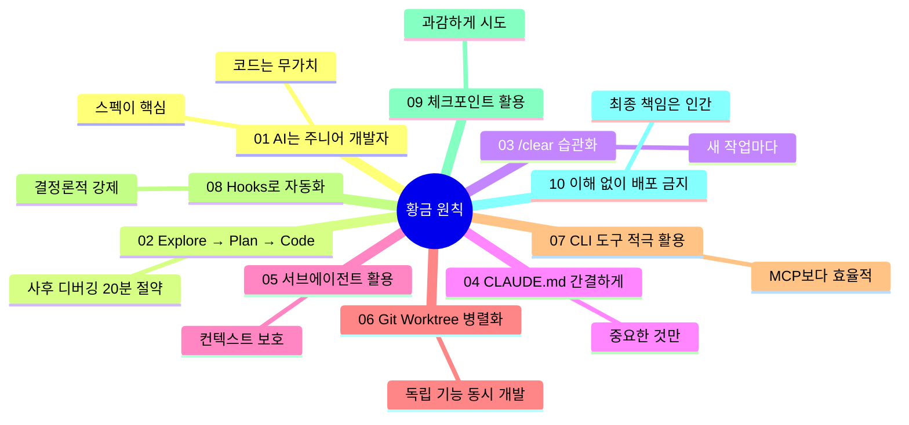

### 핵심 원칙 상세

1. **AI는 주니어 개발자** — "코드는 무가치하다. 스펙이 핵심이다." 버그 코드를 과감히 버리고, 스펙을 튜닝한 뒤 재빌드하세요.

2. **Explore → Plan → Code** — 바로 코딩하지 마세요. Plan Mode로 접근 방식을 확인한 후 구현하면 사후 디버깅 시간을 ~20분 절약합니다.

3. **/clear 습관화** — 새 작업마다, 같은 실수가 2번 반복될 때, 성능 저하가 느껴질 때 /clear하세요.

4. **CLAUDE.md 간결하게** — 길수록 무시됩니다. "이 줄을 제거하면 Claude가 실수하나?" → NO이면 삭제.

5. **서브에이전트로 탐색 격리** — 큰 탐색 작업은 서브에이전트에 위임하여 메인 컨텍스트를 보호하세요.

10. **이해 없이 배포하지 마라** — "AI가 모든 줄을 작성했더라도, 리뷰하고, 테스트하고, 이해했다면 그건 LLM을 타이핑 도우미로 사용한 것이다." 이해 없이 프로덕션에 배포하는 것만이 진짜 위험입니다.

## 디버깅 마스터 전략

Claude Code가 막혔을 때 해결하는 15가지 전략을 숙지하면 대부분의 막힌 상황을 돌파할 수 있습니다.

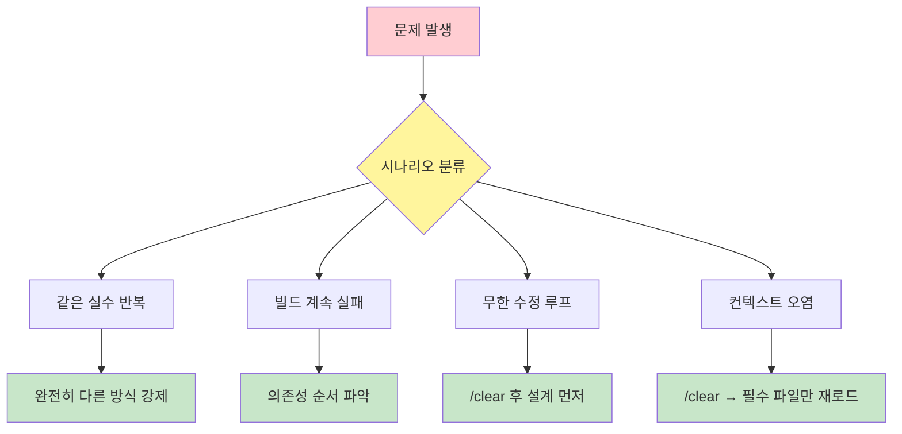

### 디버깅 4대 핵심 원칙

1. **/clear로 오염된 컨텍스트 리셋** — 막혔다면 먼저 깨끗하게 시작하라.
2. **계획을 먼저, 코드는 나중에** — 모든 구현 전 설계를 승인받아라.
3. **한 번에 하나만 수정** — 여러 변경을 동시에 하면 원인 파악이 불가능해진다.
4. **CLAUDE.md에 교훈 기록** — 만난 문제와 해결 방법을 기록해두면 다음 세션에서 반복하지 않는다.

## MCP 서버 실전 활용

MCP(Model Context Protocol)는 Claude Code가 외부 도구와 통신하는 표준 프로토콜입니다. Claude 자체의 능력은 변하지 않지만, **도달할 수 있는 세계** 가 극적으로 확장됩니다.

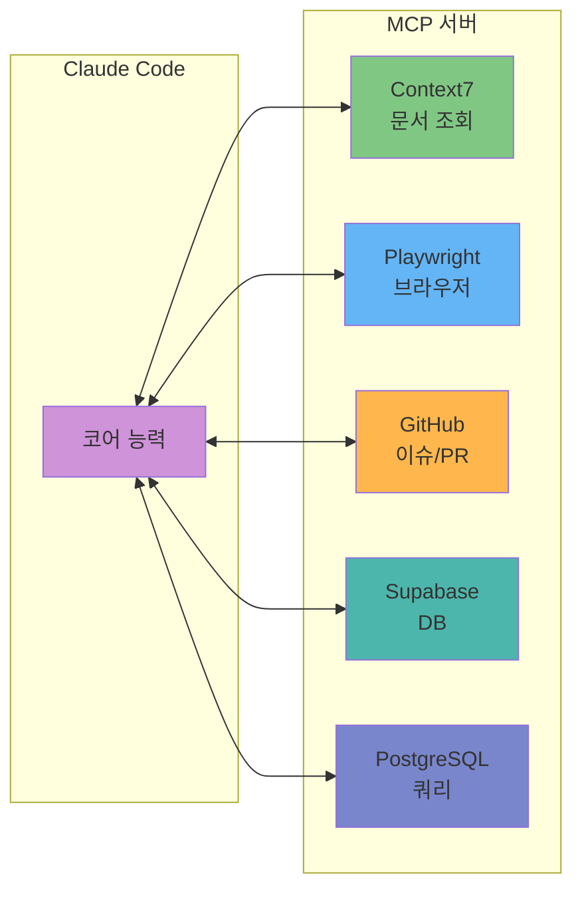

### 필수 MCP 서버 10선

1. **Context7** — NPM/PyPI 패키지의 최신 공식 문서 실시간 조회
2. **Playwright** — 웹 브라우저 조작, 스크린샷, E2E 테스트
3. **GitHub MCP** — Issues, PRs, 코드 검색 자동화
4. **Supabase MCP** — DB 스키마 관리, 쿼리 실행, 인증 설정
5. **PostgreSQL/SQLite** — 데이터베이스 직접 쿼리 및 스키마 관리
6. **Notion MCP** — 페이지 및 데이터베이스 읽기/쓰기
7. **Slack MCP** — 채널 메시지 읽기/쓰기, 팀 알림 자동화
8. **Figma MCP** — 디자인 파일을 React/Vue 컴포넌트로 변환
9. **Exa** — AI 시맨틱 웹 검색
10. **커스텀 MCP** — 회사 내부 API, 레거시 시스템 연동

### MCP 보안 주의사항

MCP 서버는 Claude에게 실제 시스템 접근 권한을 부여합니다. 프로덕션 DB에는 읽기 전용 계정을, 외부 서비스에는 최소 권한 토큰을 사용하세요.

## 핵심 요약

### Claude Code 활용의 핵심 포인트

**1. 패러다임 전환:** 바이브 코딩은 "프롬프트 엔지니어링"에서 "거버넌스 엔지니어링"으로 진화했습니다. Hooks, Agent Teams, Skills를 통한 결정론적 제어가 핵심입니다.

**2. 워크플로우:** 항상 **Explore → Plan → Implement → Commit** 순서를 따르세요. Plan Mode를 활용하면 사후 디버깅 시간을 약 20분 절약할 수 있습니다.

**3. 컨텍스트 관리:** LLM 성능의 핵심은 컨텍스트 윈도우 관리입니다. 50~60% 도달 시 `/compact`를 실행하고, 문제 발생 시 `/clear`로 초기화하세요.

**4. 검증 필수:** **"AI가 작성 → 인간이 검증 → 테스트가 증명"** 의 3단계 파이프라인을 반드시 지키세요. 특히 인증/인가, 암호화, 결제 관련 코드는 100% 수동 리뷰가 필요합니다.

**5. 보안:** AI 코드는 인간 작성 코드보다 2.74배 높은 취약점 비율을 보입니다. 8가지 필수 보안 품질 게이트를 항상 적용하세요.

**6. 확장:** MCP 서버, Skills, Plugins를 적극 활용하여 Claude Code의 능력을 확장하세요. 특히 Context7은 모든 프로젝트에서 필수입니다.

**7. 비용 최적화:** 잘 쓴 CLAUDE.md + 명확한 프롬프트 + 적절한 /compact로 같은 비용으로 2배의 결과를 얻을 수 있습니다.

## 결론

Claude Code는 AI와 함께 코딩하는 새로운 패러다임을 제시합니다. 하지만 도구 자체가 목적이 되어서는 안 됩니다. Claude Code는 훌륭한 코파일럿이지만, **최종 책임은 항상 개발자에게 있습니다.**

> "AI는 코드를 생성하는 도구일 뿐, 아키텍처 결정자가 아니다. 아키텍처, 테스트, 리스크 관리는 인간이 소유해야 한다."
>
> — 바이브 코딩 2026 컨센서스

**이해 없이 배포하지 마라.** AI가 모든 줄을 작성했더라도, 리뷰하고, 테스트하고, 이해했다면 그건 LLM을 타이핑 도우미로 사용한 것입니다. 이해 없이 프로덕션에 배포하는 것만이 진짜 위험입니다.

Claude Code를 효과적으로 활용하여 생산성을 극대화하되, 항상 검증하고 이해하며 개발하세요. 이것이 바이브 코딩 시대의 개발자가 가져야 할 올바른 자세입니다.
