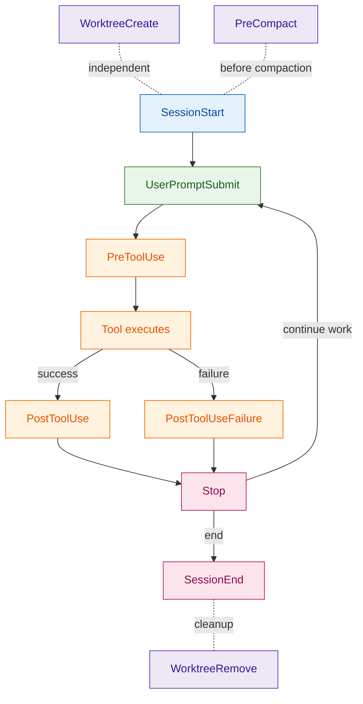
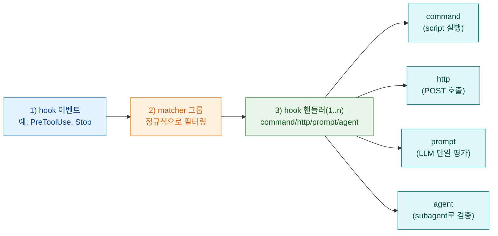
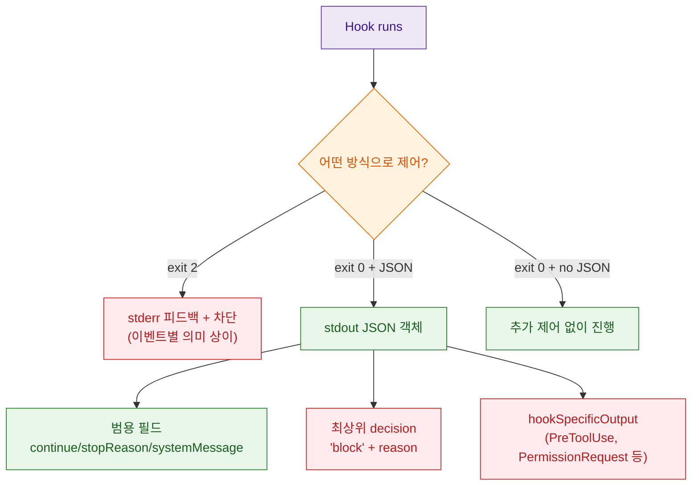

Claude Code의 hooks는 “언젠가 LLM이 알아서 하겠지”가 아니라, 특정 시점에 특정 검사를 반드시 실행하도록 만드는 장치입니다. 이 글은 공식 문서의 참조 스키마를 기준으로, 어떤 이벤트가 있고(언제 발화하고), matcher가 무엇을 필터링하며, 훅이 어떤 방식으로 Claude Code의 동작을 *허용/차단/계속 작업 유도* 할 수 있는지까지 한 번에 정리합니다.

핵심은 2가지입니다.

1) 훅은 **명령(Exit code)** 과 **구조화된 JSON 출력** 두 축으로 동작을 제어합니다.
2) “차단 가능 여부”는 이벤트마다 다릅니다. `PreToolUse`는 실행 전이라 차단이 되지만 `PostToolUse`는 실행 후라 차단이 아닌 *피드백* 으로 작동합니다.

<!--more-->

## Sources

- https://code.claude.com/docs/ko/hooks (http)

추가로 교차 검증/예제를 위해 아래 공식 자료도 함께 참고했습니다.

- https://code.claude.com/docs/ko/hooks-guide (http)
- https://code.claude.com/docs/ko/settings#hook-configuration (http)
- https://code.claude.com/docs/ko/plugins-reference#hooks (http)
- https://code.claude.com/docs/ko/skills (http)
- https://code.claude.com/docs/ko/sub-agents (http)
- https://github.com/anthropics/claude-code/blob/main/examples/hooks/bash_command_validator_example.py (http)

## Hook 라이프사이클: 언제 어떤 일이 일어나나

hooks는 Claude Code 세션 중 “특정 지점”에 발화하는 이벤트를 훅 핸들러로 연결하는 구조입니다. 이벤트가 발생하면, matcher가 일치하는 훅들이 실행되고, 입력(JSON)이 훅으로 전달됩니다(명령 훅은 stdin, HTTP 훅은 POST body).

근거:

> "Hook은 Claude Code의 라이프사이클의 특정 지점에서 자동으로 실행되는 사용자 정의 셸 명령, HTTP 엔드포인트 또는 LLM 프롬프트입니다." (https://code.claude.com/docs/ko/hooks)



위 흐름 외에도 `Notification`, `SubagentStart/Stop`, `ConfigChange`, `TeammateIdle`, `TaskCompleted` 등 이벤트가 추가로 존재합니다.

## 구성 스키마: 이벤트 -> matcher 그룹 -> 훅 핸들러

hooks 설정은 3층 구조로 정의됩니다.

근거:

> "Hook은 JSON 설정 파일에서 정의됩니다. 구성에는 세 가지 중첩 수준이 있습니다:" (https://code.claude.com/docs/ko/hooks)



### Hook 위치(스코프)

hooks는 여러 위치에 둘 수 있고, 위치가 곧 범위입니다.

근거(요약): `~/.claude/settings.json`(전체 프로젝트), `.claude/settings.json`(프로젝트 공유), `.claude/settings.local.json`(로컬), managed 정책, plugin의 `hooks/hooks.json`, skill/agent frontmatter 등 (https://code.claude.com/docs/ko/hooks)

엔터프라이즈에서는 `allowManagedHooksOnly`로 사용자/프로젝트/플러그인 훅을 차단할 수 있습니다.

근거:

> "`allowManagedHooksOnly`가 `true`일 때의 동작: Managed hooks 및 SDK hooks가 로드됨 / 사용자 hooks, 프로젝트 hooks 및 플러그인 hooks가 차단됨" (https://code.claude.com/docs/ko/settings#hook-configuration)

### /hooks 메뉴, 비활성화, 그리고 '설정 적용 타이밍'

현장에서 자주 겪는 함정은 두 가지입니다.

1) 훅을 설정 파일로 직접 편집했는데 바로 적용되지 않는 경우
2) 특정 훅만 끄고 싶은데 불가능한 경우

근거:

> "Claude Code는 시작 시 hook의 스냅샷을 캡처하고 세션 전체에서 사용합니다." (https://code.claude.com/docs/ko/hooks)
> "구성에 유지하면서 개별 hook을 비활성화할 수 있는 방법은 없습니다." (https://code.claude.com/docs/ko/hooks)

따라서 “지금 당장 반영”을 원하면 `/hooks` 메뉴를 통한 추가/삭제가 더 예측 가능합니다. 반대로 설정 파일을 직접 바꿨다면, `/hooks`에서 검토를 요구하거나 세션 재시작이 필요할 수 있습니다(가이드).

또한 `disableAllHooks`는 “전체 토글”입니다. managed 훅이 있는 환경에서는 사용자/프로젝트 레벨의 `disableAllHooks`가 managed 훅을 끄지 못합니다.

근거:

> "관리자가 ... hook을 구성한 경우 ... `disableAllHooks`는 ... 해당 관리형 hook을 비활성화할 수 없습니다." (https://code.claude.com/docs/ko/hooks)

마지막으로, HTTP 훅은 `/hooks` 메뉴에서 추가할 수 없고 설정 JSON을 직접 편집해야 합니다.

근거:

> "HTTP hook은 설정 JSON을 직접 편집하여 구성해야 합니다. `/hooks` 대화형 메뉴는 명령 hook 추가만 지원합니다." (https://code.claude.com/docs/ko/hooks)

### Matcher는 무엇을 필터링하나

`matcher`는 정규식 문자열이고, 이벤트 유형마다 “어떤 필드에 매칭하는지”가 달라집니다.

근거:

> "`matcher` 필드는 hook이 발생할 때를 필터링하는 정규식 문자열입니다." (https://code.claude.com/docs/ko/hooks)

특히 아래 이벤트들은 matcher를 지원하지 않아서, `matcher`를 넣어도 무시됩니다.

근거:

> "`UserPromptSubmit`, `Stop`, `TeammateIdle`, `TaskCompleted`, `WorktreeCreate`, `WorktreeRemove`는 matcher를 지원하지 않으며... `matcher` 필드를 추가하면 자동으로 무시됩니다." (https://code.claude.com/docs/ko/hooks)

또한 MCP 도구는 `mcp__<server>__<tool>` 이름으로 나타나므로 도구 이벤트에서 정규식으로 타게팅할 수 있습니다.

근거:

> "MCP 도구는 `mcp__<server>__<tool>` 패턴을 따릅니다." (https://code.claude.com/docs/ko/hooks)

## 실행 규칙: 병렬 실행 + 동일 핸들러 중복 제거

일치하는 모든 훅은 병렬로 실행되고, 동일 핸들러는 자동 중복 제거됩니다(명령 훅은 `command` 문자열 기준, HTTP 훅은 `url` 기준).

근거:

> "일치하는 모든 hook은 병렬로 실행되며 동일한 핸들러는 자동으로 중복 제거됩니다." (https://code.claude.com/docs/ko/hooks)

이 성질 때문에, “서로 의존하는 훅”을 여러 개 등록하는 경우에는 경쟁 조건이 생길 수 있습니다. 실전에서는 (1) 한 훅에서 필요한 작업을 모두 수행하거나, (2) 훅이 독립적으로 동작하도록 설계하는 편이 안전합니다.

## 입출력과 결정 제어: Exit code vs JSON

### 공통 입력

훅은 공통적으로 `session_id`, `transcript_path`, `cwd`, `permission_mode`, `hook_event_name` 등을 입력으로 받습니다.

근거:

> "모든 hook 이벤트는 ... JSON으로 이러한 필드를 받습니다." (https://code.claude.com/docs/ko/hooks)

### 종료 코드 의미(명령 훅)

명령 훅은 종료 코드로 “진행/차단/비차단 오류”를 신호합니다.

근거(핵심):

> "종료 0은 성공... 종료 2는 차단 오류... 다른 종료 코드는 차단하지 않는 오류" (https://code.claude.com/docs/ko/hooks)

실제 참조 구현에서도 동일하게 사용합니다.

근거:

> "Exit code 2 blocks tool call and shows stderr to Claude" (https://github.com/anthropics/claude-code/blob/main/examples/hooks/bash_command_validator_example.py)

### JSON 출력: 더 세밀한 제어

Exit code로 허용/차단만 표현할 수 있지만, `exit 0` + stdout JSON 객체를 출력하면 더 세밀한 제어가 가능합니다.

근거:

> "종료 코드를 사용하면 허용하거나 차단할 수 있지만 JSON 출력은 더 세밀한 제어를 제공합니다." (https://code.claude.com/docs/ko/hooks)

중요한 제약도 있습니다.

근거:

> "hook당 하나의 접근 방식을 선택해야 합니다... 종료 2를 하면 JSON은 무시됩니다." (https://code.claude.com/docs/ko/hooks)

그리고 stdout은 JSON만 있어야 합니다. 셸 프로필의 무조건 `echo` 같은 출력이 끼면 JSON 파싱이 실패할 수 있습니다.

근거:

> "hook의 stdout은 JSON 객체만 포함해야 합니다." (https://code.claude.com/docs/ko/hooks)
> "프로필에 무조건적인 `echo` 문이 포함되어 있으면 해당 출력이 hook의 JSON에 앞에 붙습니다" (https://code.claude.com/docs/ko/hooks-guide)

### HTTP hook의 응답 처리(차단을 원하면 2xx + JSON)

HTTP 훅은 종료 코드가 아니라 HTTP 상태 코드/응답 본문으로 처리됩니다. 여기서 중요한 건 “실패해도 기본적으로 계속 진행”한다는 점입니다.

근거:

> "2xx가 아닌 응답, 연결 실패, 시간 초과는 모두 실행을 계속하도록 허용하는 차단하지 않는 오류" (https://code.claude.com/docs/ko/hooks)
> "HTTP hook은 상태 코드만으로 차단 오류를 신호할 수 없습니다." (https://code.claude.com/docs/ko/hooks)

즉, HTTP 훅으로 차단을 하려면 반드시 2xx로 응답하면서, 이벤트에 맞는 결정 필드가 들어간 JSON 본문을 반환해야 합니다.

추가로 HTTP 훅 헤더의 환경 변수 보간은 `allowedEnvVars`에 명시된 변수만 치환되며, 목록에 없는 `$VAR` 참조는 빈 문자열이 됩니다.

근거:

> "값은 ... 환경 변수 보간을 지원합니다. `allowedEnvVars`에 나열된 변수만 해결됩니다" (https://code.claude.com/docs/ko/hooks)



## 이벤트별로 달라지는 '차단 가능성'

문서가 제공하는 "종료 코드 2의 이벤트별 동작" 표를 보면, 같은 `exit 2`여도 이벤트마다 효과가 다릅니다.

예를 들어 `PreToolUse`는 실행 전이라 도구 호출 자체를 차단할 수 있지만, `PostToolUse`는 도구가 이미 실행된 뒤라 "이미 실행됨" 상태에서 stderr를 Claude에게 보여주는 정도로 작동합니다.

근거:

> "PostToolUse: (도구가 이미 실행됨)" (https://code.claude.com/docs/ko/hooks)

실무에서의 해석은 다음처럼 가져가면 안전합니다.

| 목적 | 추천 이벤트 | 이유 |
|---|---|---|
| 위험한 도구 사용 막기 | `PreToolUse` | 실행 전 차단 가능 |
| 권한 프롬프트 자동 처리 | `PreToolUse` 또는 `PermissionRequest` | headless(-p)에서는 `PermissionRequest`가 발생하지 않을 수 있음(가이드) |
| 편집 후 포매팅/테스트 | `PostToolUse` | 실행 후 후처리 |
| 작업 완료 기준 강제 | `Stop`(prompt/agent) | 멈추기 전에 상태 점검 |

## Prompt/Agent hooks: '규칙'이 아니라 '판단'을 자동화

명령/HTTP 훅 외에 `type: "prompt"`와 `type: "agent"`가 있습니다.

프롬프트 훅은 LLM 단일 평가로 `{ "ok": true|false, "reason": "..." }`를 반환합니다.

근거:

> "LLM은 다음을 포함하는 JSON으로 응답해야 합니다" (https://code.claude.com/docs/ko/hooks)

에이전트 훅은 subagent를 생성해 도구(Read/Grep/Glob 등)를 사용한 뒤 같은 `{ok: ...}` 스키마로 결정을 반환합니다(최대 50턴).

근거:

> "최대 50 턴 후 subagent는 구조화된 `{ \"ok\": true/false }` 결정을 반환합니다" (https://code.claude.com/docs/ko/hooks)

핵심 차이는 "입력 데이터만으로 결정 가능한가" vs "코드/테스트를 직접 확인해야 하는가" 입니다.

## 비동기(async) hooks: 백그라운드 실행의 제약

`async: true`는 `type: "command"` 훅에서만 사용할 수 있고, 비동기 훅은 동작을 차단하거나 결정을 반환할 수 없습니다.

근거:

> "비동기 hook은 차단하거나 Claude의 동작을 제어할 수 없습니다" (https://code.claude.com/docs/ko/hooks)
> "`async`만 `type: "command"` hook을 지원합니다" (https://code.claude.com/docs/ko/hooks)

실무적으로는 다음 2가지만 기억하면 됩니다.

1) 비동기는 **후처리(테스트 실행/배포/로그 기록)** 용도
2) 차단/검증은 **동기 PreToolUse / Stop(prompt|agent)** 로 처리

## 보안/디버깅: 운영에서 꼭 챙길 것

명령 훅은 현재 사용자 권한으로 임의 셸 명령을 실행합니다. 보안 수칙은 단순하지만 반드시 지켜야 합니다.

근거:

> "명령 hook은 시스템 사용자의 전체 권한으로 실행됩니다." (https://code.claude.com/docs/ko/hooks)

문서가 제시하는 모범 사례 중, 실전에서 사고를 줄이는 핵심만 추리면 아래입니다.

- 입력을 신뢰하지 말고 검증/살균
- 셸 변수는 항상 따옴표로 감싸기
- 경로 순회(`..`) 차단
- 절대 경로 + `"$CLAUDE_PROJECT_DIR"` 활용
- `.env`, `.git/`, 키 같은 민감 파일을 훅 로직에서 피하기

디버깅은 `claude --debug`와 `Ctrl+O`(자세한 모드)가 기본입니다.

근거:

> "`claude --debug`를 실행하여 hook 실행 세부 정보를 확인합니다... `Ctrl+O`로 자세한 모드를 전환" (https://code.claude.com/docs/ko/hooks)

## 실전 적용 포인트 / 핵심 요약

### 1) 훅은 '정책 엔진'처럼 쓰는 게 가장 강력하다

가장 많이 쓰는 패턴은 `PreToolUse`로 위험 작업을 막고, `PostToolUse`로 후처리를 자동화하는 조합입니다.

예: `rm -rf` 같은 파괴적 커맨드 차단(PreToolUse).

```json
{
  "hooks": {
    "PreToolUse": [
      {
        "matcher": "Bash",
        "hooks": [
          {
            "type": "command",
            "command": "\"$CLAUDE_PROJECT_DIR\"/.claude/hooks/block-rm.sh"
          }
        ]
      }
    ]
  }
}
```

문서의 예시처럼 `permissionDecision: "deny"`를 반환하면 도구 호출을 취소하고 사유를 Claude에 피드백할 수 있습니다.

근거:

> "permissionDecision: \"deny\"" (https://code.claude.com/docs/ko/hooks)

### 2) `Stop`은 '완료 기준 게이트'로 쓰자

`Stop` 훅은 "작업이 완료되었는가"를 체크하는 마지막 관문으로 쓰기 좋습니다. 단, `Stop`은 "작업 완료"뿐 아니라 "Claude가 응답을 마칠 때"마다 발화한다는 점은 기억해야 합니다(가이드).

근거:

> "Stop hooks는 작업 완료 시에만이 아니라 Claude가 응답을 완료할 때마다 발생" (https://code.claude.com/docs/ko/hooks-guide)

실전에서는 prompt(빠름) / agent(정확) 중 하나를 택합니다.

```json
{
  "hooks": {
    "Stop": [
      {
        "hooks": [
          {
            "type": "agent",
            "prompt": "Verify that all unit tests pass. Run the test suite and check the results. $ARGUMENTS",
            "timeout": 120
          }
        ]
      }
    ]
  }
}
```

### 3) 엔터프라이즈/팀 환경은 '허용 목록'을 먼저 확인하자

HTTP 훅을 쓸 계획이면, 조직 정책에서 `allowedHttpHookUrls` / `httpHookAllowedEnvVars`가 제한될 수 있습니다.

근거:

> "HTTP hook URL 제한" / "HTTP hook 환경 변수 제한" (https://code.claude.com/docs/ko/settings#hook-configuration)

또한 managed 정책에서 `allowManagedHooksOnly`가 켜져 있으면 사용자/프로젝트/플러그인 훅 자체가 로드되지 않습니다.

근거:

> "사용자 hooks, 프로젝트 hooks 및 플러그인 hooks가 차단됨" (https://code.claude.com/docs/ko/settings#hook-configuration)

### 4) 운영 체크리스트(짧게)

- `PreToolUse`로 차단/권한을 다루고, `PostToolUse`는 후처리로 쓴다
- stdout은 JSON만(프로필의 echo 제거/가드)
- 비동기 훅은 차단 불가(테스트/배포 같은 후처리용)
- `claude --debug`로 매칭/실행/종료 코드 확인

## 결론

Claude Code hooks는 “자동화”라기보다 **거버넌스 레이어** 입니다. 어떤 이벤트에서 무엇을 검증할지(PreToolUse), 무엇을 자동 실행할지(PostToolUse), 언제 멈출지(Stop)를 분리해 설계하면, LLM의 변동성 위에 안정적인 개발 워크플로우를 얹을 수 있습니다.
