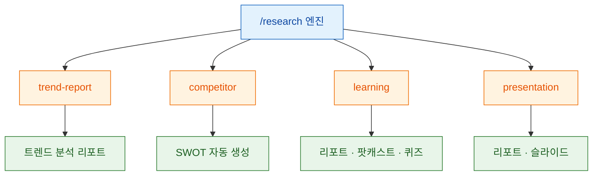
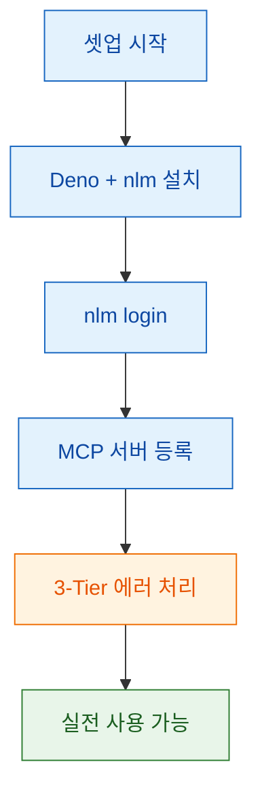

Claude Code에서 `/research` 를 한 번 실행하면 NotebookLM이 자료 수집과 분석을 맡고, 다시 Claude Code가 결과를 받아 글쓰기와 후속 작업까지 이어가는 흐름을 만들 수 있습니다. 이 글은 `qjc.ai` 의 Threads 연속 포스트(원글 + 1~7)를 기준으로, 왜 이런 연결이 필요한지와 실제 파이프라인이 어떤 식으로 작동하는지를 구조적으로 정리한 문서입니다. 문서 확인 시점은 **2026-03-06** 입니다.

<!--more-->

## Sources

- https://www.threads.com/@qjc.ai/post/DVgSfeUE_I2
- https://github.com/sangrokjung/nlm-research
- https://github.com/teng-lin/notebooklm-py
- https://www.builder.io/blog/claude-code-mcp-servers
- https://notebooklm.google/

> 참고: 이 글의 핵심 구조와 표현은 Threads 원문을 바탕으로 정리했습니다. 외부 링크는 Threads 본문에 등장한 참고 자료와 교차 검증 용도로 사용했습니다.

## 1) 왜 이 파이프라인이 필요한가: "컨텍스트 핑퐁" 제거

원문이 짚는 가장 큰 문제는 모델 성능 부족이 아니라 **도구 사이를 왕복하는 비용** 입니다. NotebookLM은 자료 수집과 정리에 강하고, Claude Code는 추론·코딩·글쓰기에 강한데, 둘을 따로 쓰면 사용자의 집중력이 끊깁니다. 결국 병목은 "어떤 모델이 더 똑똑한가"가 아니라 "작업 흐름이 한 줄로 이어지는가"에 가깝습니다.

### 증거 노트

- claim: NotebookLM은 리서치, Claude Code는 추론/코딩/글쓰기에 강하다고 구분한다.
  - quote: "NotebookLM = 리서치의 강자. Claude Code = 추론/코딩/글쓰기의 강자."
  - source: https://www.threads.com/@qjc.ai/post/DVgSfeUE_I2
  - confidence: high
- claim: 분리 사용 시 컨텍스트 왕복이 집중력을 무너뜨린다고 본다.
  - quote: "'컨텍스트 핑퐁'이 집중력을 완전히 파괴합니다."
  - source: https://www.threads.com/@qjc.ai/post/DVgSfeUE_I2
  - confidence: high

## 2) MCP는 무엇을 해결하나: 두 도구 사이의 전용 통로

원문은 MCP를 "보안 복도"에 비유합니다. 이 비유가 좋은 이유는, MCP를 단순 플러그인 목록이 아니라 **작업 컨텍스트를 안전하게 넘기는 연결 계층** 으로 이해하게 만들기 때문입니다. Claude Code가 NotebookLM을 직접 질의할 수 있으면, 사용자는 도구 전환 대신 사고 흐름 유지에 집중할 수 있습니다.

### 증거 노트

- claim: MCP를 두 도구를 연결하는 전용 통로로 설명한다.
  - quote: "MCP가 비유하면 보안 복도예요."
  - source: https://www.threads.com/@qjc.ai/post/DVgSfeUE_I2
  - confidence: high
- claim: 연결 후 Claude가 NotebookLM을 직접 질의한다고 설명한다.
  - quote: "이 복도만 연결하면 Claude가 NotebookLM을 직접 쿼리해요."
  - source: https://www.threads.com/@qjc.ai/post/DVgSfeUE_I2
  - confidence: high

## 3) 실제 구조: `/research` 한 줄 뒤에서 벌어지는 일

Threads 원문이 흥미로운 지점은 "자동화됐다"는 주장보다 **실행 순서가 분명하다** 는 점입니다. 키워드 입력 후 YouTube 검색, NotebookLM 수집, AI 분석, 파일 저장까지 이어지는 흐름이 이미 파이프라인으로 묶여 있습니다. 즉, 사용자는 리서치 절차를 매번 손으로 조합하지 않고, 상위 명령만 호출하면 됩니다.

### 증거 노트

- claim: 키워드 입력부터 파일 저장까지의 실행 순서를 제시한다.
  - quote: "키워드 입력 → YouTube 검색 → NotebookLM 수집 → AI 분석 → 파일 저장"
  - source: https://www.threads.com/@qjc.ai/post/DVgSfeUE_I2
  - confidence: high
- claim: 이 전체 흐름이 `/research` 한 줄로 실행된다고 설명한다.
  - quote: "이게 전부 /research 한 줄이에요."
  - source: https://www.threads.com/@qjc.ai/post/DVgSfeUE_I2
  - confidence: high

## 4) 프리셋이 중요한 이유: 자동화보다 '의도 고정'이 더 크다

원문은 `trend-report`, `competitor`, `learning`, `presentation` 같은 프리셋을 소개합니다. 이 포인트는 단순히 출력 형식을 바꾸는 것이 아니라, 같은 리서치 엔진에 **업무 목적을 미리 심어둔다** 는 데 있습니다. 즉 "경쟁사 분석", "학습", "발표 준비"가 프롬프트 재작성 없이 preset 수준에서 재사용 가능한 워크플로우가 됩니다.

### 증거 노트

- claim: 프리셋 기반으로 용도를 바꾸는 방식을 제시한다.
  - quote: "--preset 옵션 하나로 용도가 바뀌어요."
  - source: https://www.threads.com/@qjc.ai/post/DVgSfeUE_I2
  - confidence: high
- claim: `competitor` 프리셋으로 SWOT 자동 생성을 예시로 든다.
  - quote: "competitor: SWOT 자동 생성"
  - source: https://www.threads.com/@qjc.ai/post/DVgSfeUE_I2
  - confidence: high

## 5) 실전성은 에러 처리와 셋업 시간에서 갈린다

리서치 자동화는 데모보다 운영이 어렵습니다. 원문이 설득력 있는 이유는 "멋진 결과물"보다 먼저 **부분 실패 허용**, **인증 만료 자동 복구**, **치명적 오류만 중단** 같은 운영 규칙을 말하기 때문입니다. 또한 셋업 역시 Deno, `nlm` CLI, 로그인, MCP 서버 등록으로 요약해 진입 장벽을 낮추려 합니다.

### 증거 노트

- claim: 에러 처리를 3단계 계층으로 설명한다.
  - quote: "아니요. 3-Tier 에러 처리예요."
  - source: https://www.threads.com/@qjc.ai/post/DVgSfeUE_I2
  - confidence: high
- claim: 인증 만료 자동 복구와 부분 실패 지속을 핵심으로 둔다.
  - quote: "인증 만료? 자동 복구. 부분 실패? 나머지는 계속. 치명적 오류만 중단."
  - source: https://www.threads.com/@qjc.ai/post/DVgSfeUE_I2
  - confidence: high
- claim: 최초 도입 단계를 10분 셋업으로 압축한다.
  - quote: "Deno + nlm CLI 설치. nlm login 인증 (최초 1회). MCP 서버 등록. 끝."
  - source: https://www.threads.com/@qjc.ai/post/DVgSfeUE_I2
  - confidence: high

## 6) 교차 검증 메모: 무엇이 사실로 확인되나

Threads는 원래 짧은 포맷이라, 모든 수치를 장기적으로 사실로 고정해 읽으면 위험합니다. 그래서 실제 링크를 다시 보면 최소한 아래 정도는 현재 시점 기준으로 교차 확인할 수 있습니다.

- `notebooklm-py` 는 현재 GitHub에서 약 **3.1k stars** 로 보이며, README에서 스스로를 **공식이 아닌 비공식 Python API** 라고 명시합니다.
- `nlm-research` 저장소는 실제로 `/research` 흐름과 preset 개념, 그리고 보고서/팟캐스트/슬라이드 같은 산출물 설명을 README에 담고 있습니다.
- Builder의 글은 2026-03-04 기준으로 Claude Code MCP 서버의 연결/구성/운영 방식을 설명하고 있어, Threads의 "MCP 연결" 메시지와 맥락이 맞습니다.
- NotebookLM 공식 사이트는 NotebookLM이 실제 서비스로 존재한다는 점을 확인해주지만, Threads에서 말한 모든 자동화 방식이 공식 기능이라는 뜻은 아닙니다.

즉, **공식 서비스(NotebookLM)** + **비공식 연동 레이어(`notebooklm-py`, 커뮤니티 워크플로우)** + **Claude Code MCP 연결 방식** 이 합쳐져 현재의 자동화 경험을 만든다고 보는 편이 정확합니다.

## 핵심 요약

- 이 Threads 연속 포스트의 본질은 "더 좋은 프롬프트"가 아니라 **리서치 흐름의 단일화** 입니다.
- MCP의 가치는 기능 추가보다 **도구 간 컨텍스트 이동 비용 제거** 에 있습니다.
- `/research` 같은 상위 명령은 검색, 수집, 분석, 저장을 한 번에 묶어 **작업 의도를 재사용 가능한 워크플로우** 로 만듭니다.
- 실전에서는 프리셋과 3-Tier 에러 처리처럼 "예외 상황을 포함한 운영 설계"가 있어야 자동화가 오래 갑니다.

## 결론

이 Threads 포스트가 던지는 메시지는 명확합니다. Claude Code와 NotebookLM을 잘 붙이는 핵심은 모델 비교가 아니라, 리서치-분석-콘텐츠 생성을 한 줄 흐름으로 고정하는 것입니다. 결국 생산성을 올리는 건 AI 자체보다, **도구 사이의 끊김을 없애는 설계** 에 더 가깝습니다.

---

*원본: [Threads @qjc.ai](https://www.threads.com/@qjc.ai/post/DVgSfeUE_I2)*
