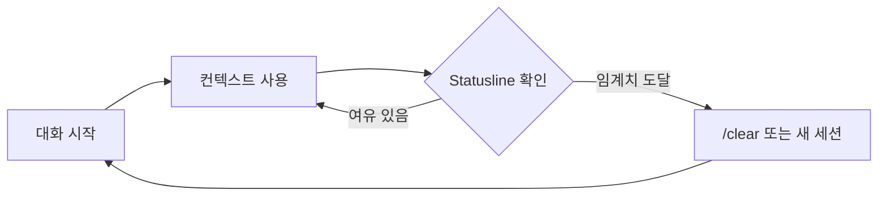

Claude Code 를 사용하다 보면 대화가 길어질수록 **컨텍스트** 가 차오릅니다. 이 컨텍스트가 가득 차면 응답 품질이 눈에 띄게 떨어지는데, 많은 사용자가 적절한 타이밍에 새 세션을 열거나 `/clear` 를 해주어야 한다는 것을 알면서도 정확히 언제 해야 할지 감을 잡지 못합니다.
<!--more-->

## 해결책: Statusline

Claude Code 에는 현재 **컨텍스트가 얼마나 찼는지 실시간으로 보여주는 기능** 이 있습니다. 바로 **statusline** 이라는 기능인데, 이걸 켜두면 세션 관리가 완전히 달라집니다.

## 설정 방법

1. Claude Code 설정에서 **statusline** 옵션을 활성화합니다
2. 상태바에서 실시간으로 컨텍스트 사용량을 확인합니다
3. 사용량이 높아지면 적절히 세션을 관리합니다

## 관련 프로젝트

커뮤니티에서는 Claude Code 의 컨텍스트 사용량, API 제한, 비용 추적을 종합적으로 보여주는 플러그인도 개발되었습니다:

- **claude-dashboard**: [GitHub - uppinote20/claude-dashboard](https://github.com/uppinote20/claude-dashboard)

이 플러그인을 사용하면 더 상세한 통계를 확인할 수 있습니다.

## 요약

| 기능 | 설명 |
|------|------|
| statusline | 컨텍스트 사용량 실시간 표시 |
| /clear | 현재 대화 컨텍스트 초기화 |
| 새 세션 | 완전히 새로운 대화 시작 |

**참고**: Claude Code 초보자의 99% 가 이 기능을 모른다고 합니다. 이 기능만 켜두어도 세션 관리 효율이 크게 향상됩니다.

---

*원본: [Threads @devdesign.kr](https://www.threads.com/@devdesign.kr/post/DVcgrtPkhxq)*
