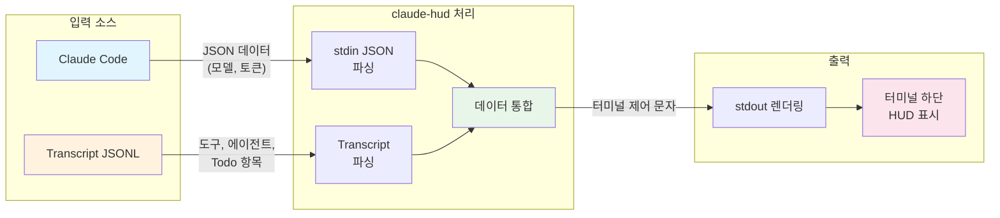
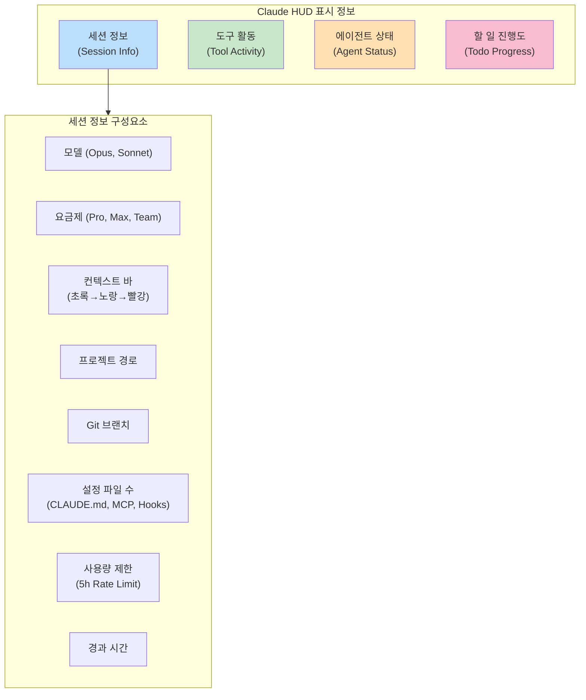
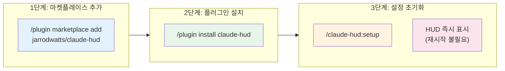

Claude Code와 같은 에이전트형 CLI 도구가 등장하면서, 개발자들은 터미널을 떠나지 않고 코딩 작업을 AI에게 위임하는 경우가 늘고 있습니다. 하지만 긴 세션을 유지하다 보면 **컨텍스트 윈도우가 얼마나 찼는지**, **에이전트가 무한 루프에 빠진 것은 아닌지** 파악해야 할 필요성이 커졌습니다. Claude HUD는 이러한 문제를 해결하는 실시간 모니터링 도구입니다.

<!--more-->

## Sources

- [Claude HUD: Claude Code를 위한 실시간 상태 표시줄(Statusline) 플러그인 - 파이토치 한국 사용자 모임](https://discuss.pytorch.kr/t/claude-hud-claude-code-statusline/8690)

## Claude HUD 소개

**Claude HUD** 는 Anthropic의 CLI 도구인 Claude Code 환경에서 실행되는 실시간 상태 표시줄(Statusline) 플러그인입니다. 터미널 하단에 항상 표시되며, 현재 AI 세션의 상태를 직관적으로 시각화해 줍니다.

Claude HUD는 개발자가 터미널에서 AI 에이전트와 협업할 때 발생하는 **"블랙박스"** 문제를 해결합니다. 보통 AI에게 작업을 시키면 "처리 중"이라는 메시지만 뜨고 구체적으로 어떤 파일을 읽고 있는지, 토큰은 얼마나 썼는지 알기 어렵습니다. Claude HUD는 이러한 정보를 실시간으로 렌더링하여 투명성을 제공합니다.

## Claude HUD 아키텍처



Claude HUD는 단순한 텍스트 출력이 아니라, Claude Code의 데이터 스트림을 가로채 분석하는 방식으로 작동합니다. 구체적인 처리 과정은 다음과 같습니다.

### 1. Input Stream (입력 스트림)

Claude Code로부터 **JSON 형태의 데이터** (모델 정보, 토큰 사용량 등) 를 `stdin` 으로 받습니다. 이를 통해 현재 세션의 기본 상태를 실시간으로 파악할 수 있습니다.

### 2. Transcript Parsing (트랜스크립트 파싱)

세션의 기록이 담긴 **JSONL(Transcript) 파일** 을 실시간으로 파싱하여 다음 정보를 추출합니다.

- 도구 사용 내역 (Read, Edit, Grep 등)
- 에이전트 활동 (서브 에이전트 실행 상태)
- Todo 항목 (할 일 진행 상황)

### 3. Rendering (렌더링)

수집된 데이터를 바탕으로 **터미널 제어 문자** 를 포함한 텍스트를 생성하여 `stdout` 으로 내보냅니다. Claude Code가 이를 화면 하단에 렌더링합니다.

### 4. Tech Stack (기술 스택)

- **TypeScript** 로 작성
- **Node.js** 환경에서 동작

## Claude HUD가 제공하는 정보



Claude HUD는 터미널 하단에 여러 줄의 정보를 표시합니다. 각 줄은 세션의 특정 측면을 모니터링합니다.

### 세션 정보 (Session Info)

가장 윗줄은 현재 AI 모델과 프로젝트 환경의 전반적인 상태를 요약하여 보여줍니다.

```
[Opus | Pro] █████░░░░░ 45% | my-project git:(main) | 2 CLAUDE.md | 5h: 25% | ⏱️ 5m
```

| 구성 요소 | 설명 |
|-----------|------|
| **모델 (Model)** | 현재 사용 중인 AI 모델 (예: Opus, Sonnet 등) |
| **요금제 (Plan)** | 사용자의 구독 등급 (예: Pro, Max, Team). 사용량 제한 기능이 활성화된 경우에만 표시 |
| **컨텍스트 바 (Context Bar)** | 현재 세션의 컨텍스트 윈도우 사용량을 시각적 게이지로 표시. 사용량이 늘어날수록 색상이 변함 (초록 → 노랑 → 빨강). 빨간색에 가까워지면 `/compact` 명령어로 대화 내용 정리 필요 |
| **프로젝트 경로 (Project Path)** | 현재 작업 중인 디렉토리 경로. 기본값은 1단계 깊이, 설정에 따라 1~3단계까지 표시 가능 |
| **현재 브랜치 (Git Branch)** | 현재 체크아웃된 Git 브랜치 이름 (설정으로 끄고 켤 수 있음) |
| **설정 파일 수 (Config Counts)** | 현재 로드된 CLAUDE.md 파일, 규칙(Rules), MCP 서버, 훅(Hooks) 등의 개수 |
| **사용량 제한 (Usage Limits)** | 5시간 동안의 메시지 전송량 제한 대비 현재 사용률 (Pro/Max/Team 플랜 전용) |
| **경과 시간 (Duration)** | 현재 세션이 시작된 후 경과한 시간 |

### 도구 활동 (Tool Activity)

Claude가 수행한 기술적인 작업 내역을 추적합니다.

```
✓ TaskOutput ×2 | ✓ mcp_context7 ×1 | ✓ Glob ×1 | ✓ Skill ×1
```

| 구성 요소 | 설명 |
|-----------|------|
| **Running Tools (실행 중)** | 현재 실행 중인 도구는 회전하는 스피너 아이콘과 함께 타겟 파일명 표시. 멈춘 것이 아니라 작업 중임을 알려줌 |
| **Completed Tools (완료됨)** | 이미 완료된 작업은 도구 유형별로 집계. 동일한 도구 사용은 ×2, ×3과 같이 숫자로 묶어서 간결하게 표시 |

### 에이전트 상태 (Agent Status)

메인 Claude 에이전트가 특정 작업을 위해 호출한 **하위 에이전트(Sub-agent)** 의 활동을 보여줍니다.

```
✓ Explore: Explore home directory structure (5s)
✓ open-source-librarian: Research React hooks patterns (2s)
```

| 구성 요소 | 설명 |
|-----------|------|
| **에이전트 종류 및 작업** | 현재 실행 중인 에이전트의 이름(예: Explore, open-source-librarian)과 해당 에이전트가 수행 중인 구체적인 작업 내용 |
| **진행 시간** | 각 에이전트가 해당 작업을 수행하는 데 걸린 시간(초 단위). 특정 작업이 비정상적으로 오래 걸리는지 파악 가능 |

### 할 일 진행도 (Todo Progress)

Claude에게 맡긴 작업 목록(Todo)의 진행 상황을 보여줍니다.

```
✓ All todos complete (5/5)
```

| 구성 요소 | 설명 |
|-----------|------|
| **현재 작업** | 현재 진행 중인 할 일 항목이나 전체 완료 상태 |
| **진행 개수** | 전체 할 일 개수 대비 완료된 개수를 (완료/전체) 형태로 표시 |

## Claude HUD 설치 및 사용 방법



Claude HUD 플러그인은 **Claude Code (v1.0.80 이상)** 이 설치된 환경에서 작동합니다. Claude Code 세션 내부에서 다음 명령어들을 순차적으로 입력하여 설치합니다.

### 1단계: 마켓플레이스 추가

먼저 플러그인 소스를 마켓플레이스에 등록합니다.

```
/plugin marketplace add jarrodwatts/claude-hud
```

### 2단계: 플러그인 설치

등록된 소스에서 플러그인을 설치합니다.

```
/plugin install claude-hud
```

### 3단계: 설정 초기화

설치 후 설정을 적용하면 즉시 하단에 HUD가 나타납니다. **재시작할 필요가 없습니다**.

```
/claude-hud:setup
```

## 라이선스

Claude HUD 프로젝트는 **MIT License** 로 공개 및 배포되고 있습니다.

- **GitHub 저장소**: [jarrodwatts/claude-hud](https://github.com/jarrodwatts/claude-hud)

## 핵심 요약

- **Claude HUD** 는 Claude Code용 실시간 상태 표시줄 플러그인으로, 터미널 하단에 AI 세션 상태를 시각화합니다.
- **stdin JSON** 으로 모델/토큰 정보를 받고, **JSONL Transcript** 를 파싱하여 도구/에이전트/Todo 정보를 추출합니다.
- **세션 정보**, **도구 활동**, **에이전트 상태**, **할 일 진행도** 를 실시간으로 모니터링합니다.
- **3단계 설치** (마켓플레이스 추가 → 플러그인 설치 → 설정 초기화) 로 즉시 사용 가능합니다.
- **MIT License** 로 공개된 오픈소스 프로젝트입니다.

## 결론

Claude HUD는 AI 에이전트와의 협업에서 발생하는 "블랙박스" 문제를 해결하는 실용적인 도구입니다. 컨텍스트 사용량, 실행 중인 도구, 에이전트 활동, 작업 진행 상황을 한눈에 파악할 수 있어, 긴 세션에서도 AI의 동작을 투명하게 모니터링할 수 있습니다. Claude Code를 적극적으로 활용하는 개발자라면 설치해 볼 가치가 있는 플러그인입니다.
