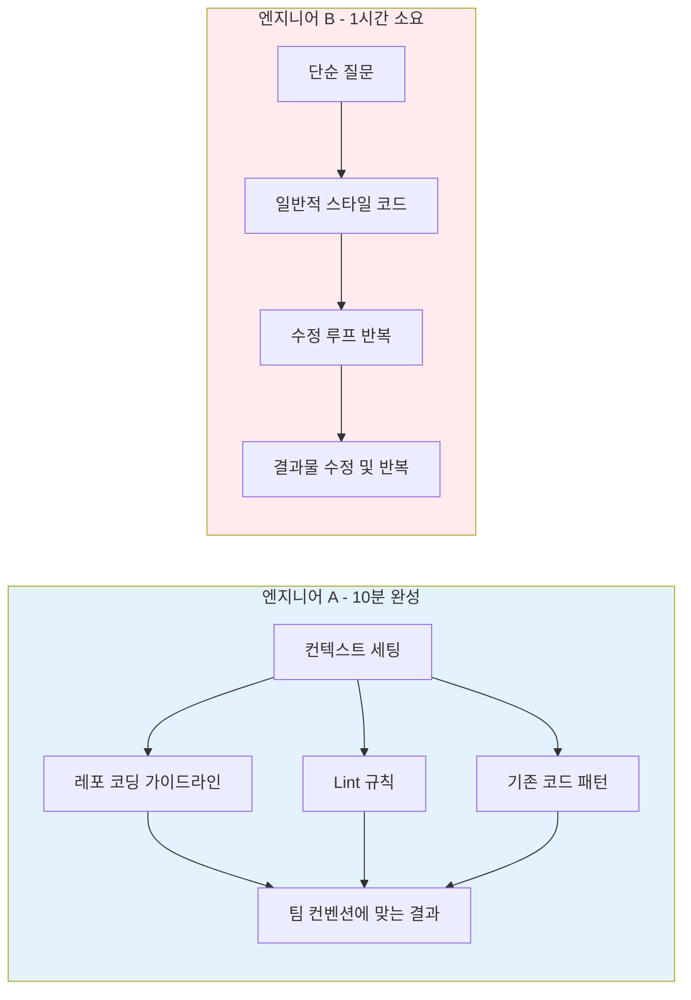
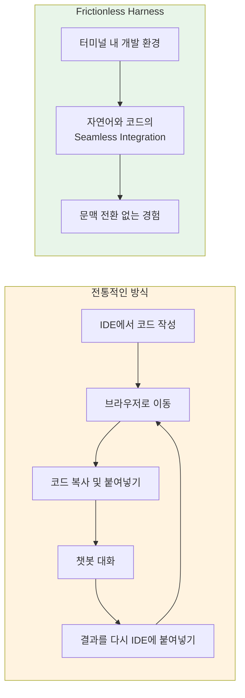
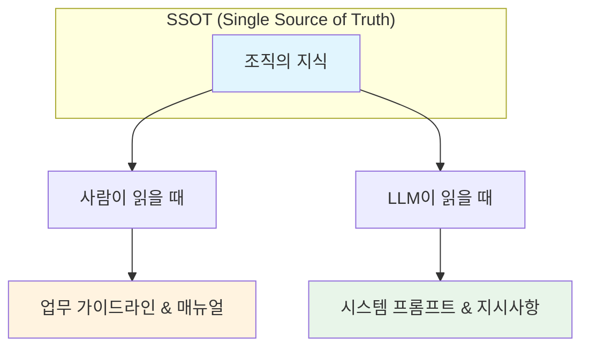
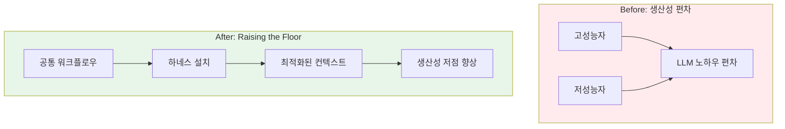
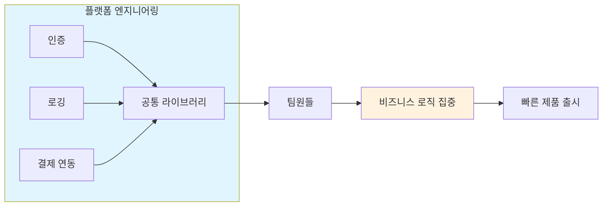
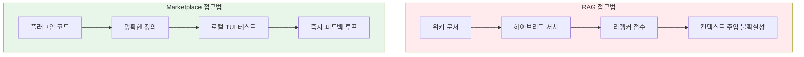
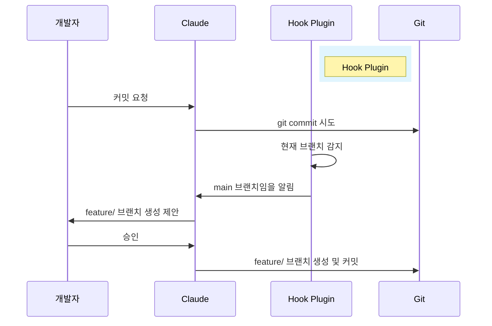
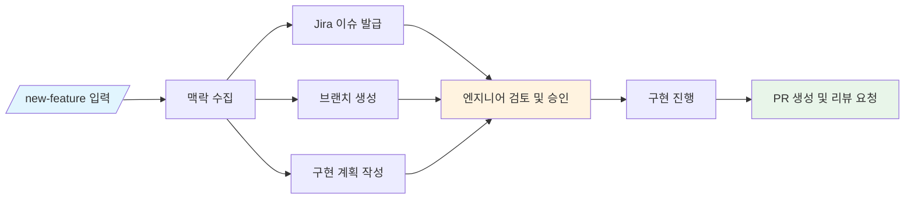
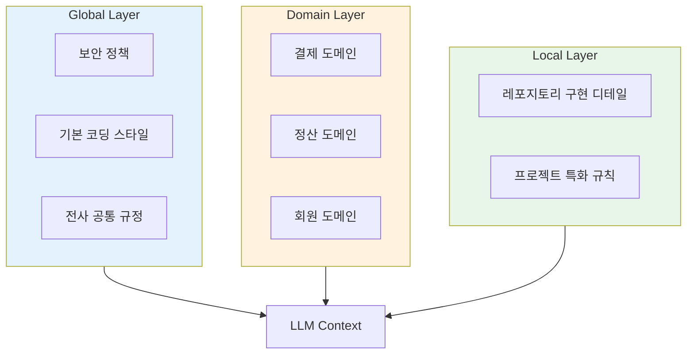
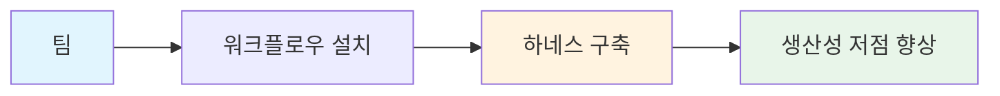

당신의 팀은 같은 LLM을 쓰고 있나요?

"현재 많은 개발팀이 LLM을 도입하고 있지만, 냉정하게 들여다보면 그것은 '각자도생'에 가깝습니다."
<!--more-->

같은 모델, 같은 IDE를 쓰는데도 결과물의 차이는 극심합니다. 어떤 엔지니어는 **컨텍스트 엔지니어링**에 대한 높은 이해도로 LLM에게 정확한 역할을 부여해 10분 만에 복잡한 리팩토링을 끝냅니다. 반면, 어떤 엔지니어는 단순한 질문과 답변을 반복하며 할루시네이션과 씨름하느라 1시간을 허비하죠.

A 엔지니어는 작업 전에 컨텍스트를 먼저 세팅합니다. 레포의 코딩 가이드라인, lint 규칙, 기존 코드 패턴을 LLM에게 주입한 뒤 작업을 시킵니다. 결과물은 처음부터 팀 컨벤션에 맞고, 10분이면 머지 가능한 상태가 됩니다.

B 엔지니어는 "이 함수 리팩토링해줘"로 시작합니다. AI는 일반적인 스타일로 코드를 뱉고, 이후 1시간 동안 "우리 팀은 이렇게 안 해"를 반복하며 수정 루프에 갇힙니다.

<!--more-->

## The Frictionless Harness: 맥락이 끊기지 않는 경험

Open Interpreter, OpenCode 등 훌륭한 시도들은 많았습니다. 하지만 개발자에게 '새로운 도구를 쓴다'는 감각은 여전히 미세한 마찰(Friction)을 일으킵니다. 브라우저로 나가서 챗봇에게 코드를 붙여넣는 순간, 문맥 교환(Context Switching) 비용이 발생하기 때문이죠.

Claude Code가 제공하는 TUI(Terminal User Interface) 환경의 가치는 바로 이 지점에 있다고 생각합니다. 호불호를 떠나, 개발자가 가장 많은 시간을 보내는 터미널 안에서 자연어와 코드가 끊김 없이 섞이는 경험(Seamless Integration)을 제공한다는 점입니다.

## Executable SSOT: 문서는 죽고, 코드는 산다

"우리는 항상 SSOT(Single Source of Truth)를 갈구하지만, 위키(Wiki)나 노션 문서는 작성되는 순간부터 낡은 정보가 됩니다. 사람이 읽기 위한 문서이기 때문입니다."

하지만 Claude Code의 플러그인 형태로 정의된 지식은 성격이 다릅니다. 이들은 '실행 가능한 SSOT(Executable SSOT)'가 될 수 있는 잠재력을 가지고 있습니다.

*   **사람이 읽으면:** 업무 가이드라인이자 매뉴얼이 되고,
*   **LLM이 읽으면:** 정확한 지시사항이 담긴 시스템 프롬프트가 됩니다.

## Raising the Floor: 범용 도구를 넘어, 도메인 최적화 하네스로

"팀 내에는 코딩 실력과 무관하게 'LLM 활용 노하우'의 편차가 존재합니다. 우리는 이 문제를 해결하기 위해 '팀 생산성의 저점(Floor)'을 높여야 합니다."

## Software 1.0의 시선: 익숙한 성공 방정식의 재현

"우리는 이미 Software 1.0 시대에 '플랫폼 엔지니어링'을 통해 팀의 생산성을 높여왔습니다."

인증(Auth), 로깅(Logging), 결제 연동 등 반복되는 기능을 사내 공통 라이브러리나 모듈로 만들었고, 이를 통해 팀원들이 '바퀴를 다시 발명하는(Reinvent the wheel)' 시간을 없앴습니다. 덕분에 우리는 비즈니스 로직에만 집중하며 빠르게 제품을 출시할 수 있었습니다.

## Why Marketplace? (Beyond RAG & Server)

"혹자는 '그냥 위키 문서를 RAG(Retrieval-Augmented Generation)로 구축해서 연동하면 되지 않나?'라고 반문할 수 있습니다."

### 1) 예측 가능성(Predictability)
RAG 시스템을 구축해 본 분들은 공감하실 겁니다. 가시성이 떨어집니다. 하이브리드 서치, 리랭커 점수 등 내부 로직에 의해 어떤 컨텍스트가 주입될지 예측하기 어렵습니다.

### 2) 빠른 실험과 Dev-Prod Parity (환경 일치)
서버에 배포하지 않고도 워크플로우를 검증할 수 있습니다. 로컬 TUI 환경에서 플러그인을 수정하고, 즉시 Claude와 대화하며 피드백 루프를 돌릴 수 있습니다.

## Marketplace 1.0: 워크플로우 배포 플랫폼

이 글에서 가장 하고 싶은 이야기는 여기에 있습니다. 저는 현재의 플러그인과 마켓플레이스가 단순한 기능 확장이 아니라고 봅니다. 이것은 "조직의 일하는 방식(Workflow)을 배포하는 플랫폼의 1.0 버전"이 될 수 있습니다.

### Scenario 1: 브랜치 가드
1. claude가 git commit을 시도합니다.
2. 플러그인에 등록된 Hook이 감지하고 개입합니다.
3. "잠시만요, 현재 main 브랜치입니다. 우리 팀 컨벤션에 따라 feature/ 브랜치를 생성하고 작성하겠습니다."

### Scenario 2: 피처 개발 자동화
1. `/new-feature` 입력 → Claude가 대화를 통해 구현할 기능의 맥락을 수집
2. Jira 이슈 발급, 브랜치 생성, 구현 계획 작성 → 엔지니어가 계획을 검토/승인
3. 구현 진행 → PR 생성 및 리뷰 요청

## Layered Architecture: 관심사별 컨텍스트 계층화

신입사원에게 회사 전체 문서를 한꺼번에 던져주지 않듯, LLM에게도 현재 작업에 필요한 지식만 명확하게 주입해야 합니다. 저는 지식을 세 가지 계층으로 분리하여 관리하는 것이 효과적일 거라 생각합니다.

*   **Global Layer:** 전사 공통 규정 (보안 정책, 기본 코딩 스타일)
*   **Domain Layer:** 팀/비즈니스별 지식 (결제, 정산, 회원 등 특정 도메인 로직)
*   **Local Layer:** 특정 레포지토리의 구현 디테일 및 프로젝트 특화 규칙

## Outlook: The Data Flywheel Hypothesis

"이 시스템이 정착된 이후, 우리는 조금 더 먼 미래를 그려볼 수 있습니다. 이것은 아직 가설(Hypothesis)의 영역이지만, AI 엔지니어링이 나아가야 할 필연적인 방향이기도 합니다."

## Conclusion: 우리만의 최적화된 하네스 구축을 향해

"결국 이 모든 흐름이 향하는 곳은 '우리 조직에 최적화된 하네스(Harness)의 구축'이라고 생각합니다."

도구는 준비되었습니다. 이제 여러분의 팀은 무엇을 '설치'하시겠습니까?

---

*원문: [Software 3.0 시대, Harness를 통한 조직 생산성 저점 높이기](https://toss.tech/article/harness-for-team-productivity)*
