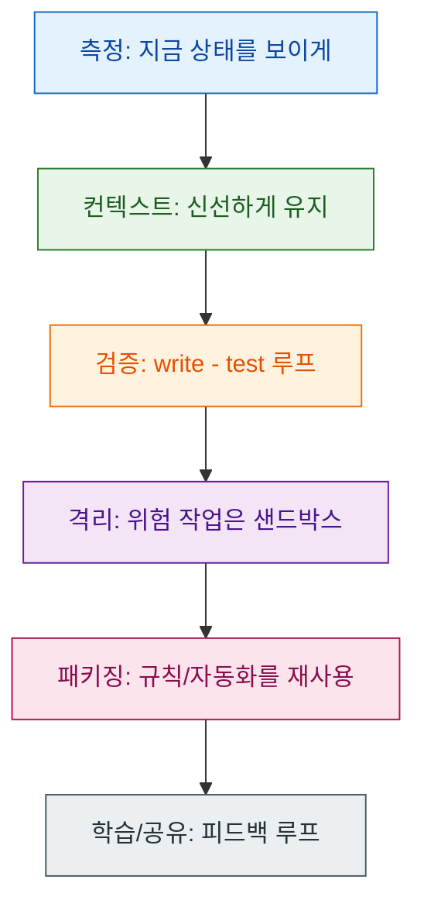
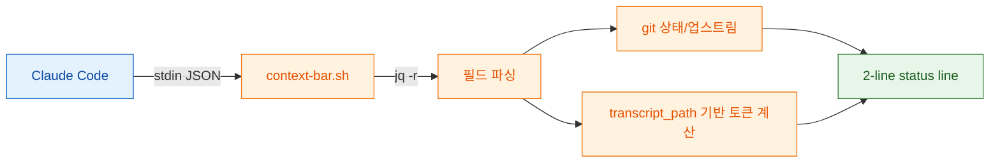
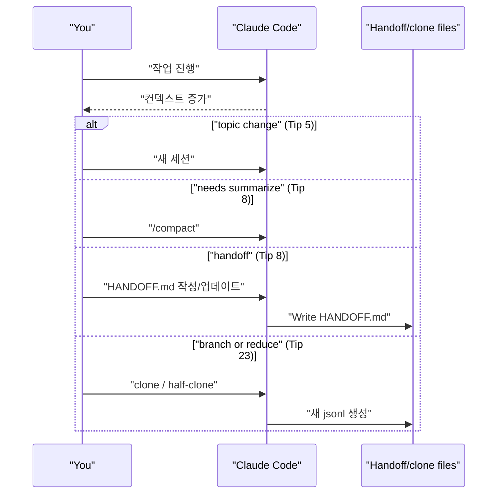
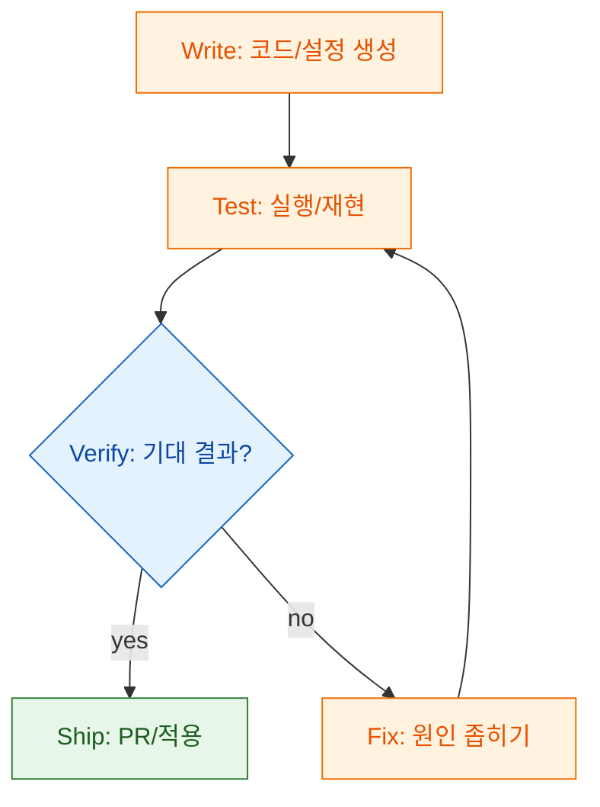
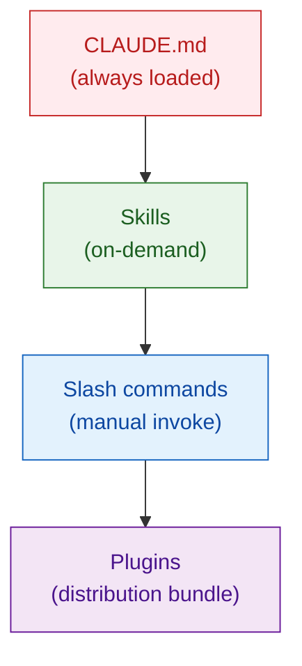
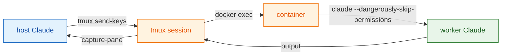
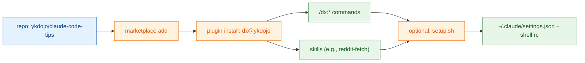

ykdojo/claude-code-tips는 Claude Code를 오래 쓰면서 생기는 문제(컨텍스트 비대화, 검증 루프 부재, 위험한 자동화, 반복 설정)를 46개의 팁(0-45)과 스크립트/스킬/플러그인 형태로 정리한 저장소입니다. 단순히 "팁을 많이 안다" 보다 중요한 건, 팁을 시스템으로 엮어서 매번 같은 품질로 실행하는 것인데, 이 글은 그 관점(측정 - 컨텍스트 - 검증 - 격리 - 패키징)으로 재구성합니다.

<!--more-->

## Sources

- https://github.com/ykdojo/claude-code-tips

## 이 저장소가 반복해서 강조하는 운영 원칙

README의 46개 항목을 그대로 외우기보다, "반복되는 패턴"으로 묶으면 적용/검증이 쉬워집니다.



이 원칙은 각각 README의 여러 팁을 관통합니다.

- 측정: status line 커스터마이징(Tip 0), /usage(Tip 1), 컨텍스트 사용량 추적(Tip 8, Tip 15)
- 컨텍스트: 짧은 세션(Tip 5), /compact + handoff(Tip 8), clone/half-clone(Tip 23)
- 검증: write-test cycle(Tip 9), PR 리뷰(Tip 26), 다양한 검증 전략(Tip 28), TDD(Tip 34)
- 격리: 컨테이너로 위험 작업 분리(Tip 21)
- 패키징: CLAUDE.md/Skills/Slash/Plugins 구조 이해(Tip 25), dx plugin(Tip 44), setup.sh(Tip 45)
- 학습/공유: 배우고 공유하기(Tip 42, Tip 43)

## tip 0: status line을 "측정기"로 만들기

이 저장소가 제공하는 가장 즉시 체감되는 개선은 status line 스크립트입니다. README는 status line에 모델/디렉터리/브랜치/미커밋 파일 수/원격 동기 상태/토큰 사용률/마지막 메시지를 보여주도록 구성했다고 설명합니다(Tip 0).

scripts/README.md는 context-bar.sh의 목적을 더 구체적으로 적습니다. Claude Code가 status line 커맨드에 세션 메타데이터를 stdin JSON으로 전달하고, 그 필드(model.display_name, cwd, context_window, transcript_path 등)를 사용해 컨텍스트 사용률을 계산한다고 설명합니다(`scripts/README.md#L56-L64`).



여기서 중요한 포인트는 "표시"가 아니라 "측정 가능한 루프"입니다.

- 토큰 사용량을 시각화하면(Tip 0) 언제 /compact 또는 half-clone을 해야 하는지 감으로가 아니라 숫자로 판단하기 쉬워집니다.
- 스크립트가 transcript를 읽어서 input_tokens/caching 관련 토큰을 합산하는 방식은, 단순히 "터미널 상태바"를 넘어 컨텍스트 관리 전략(Tip 5/8/23)을 실행으로 연결합니다.

설치 방법은 scripts/README.md에 그대로 나옵니다.

```bash
mkdir -p ~/.claude/scripts
cp context-bar.sh ~/.claude/scripts/
chmod +x ~/.claude/scripts/context-bar.sh
```

```json
{
  "statusLine": {
    "type": "command",
    "command": "~/.claude/scripts/context-bar.sh"
  }
}
```

Color 테마는 context-bar.sh 상단의 COLOR 변수를 바꿔서 적용합니다(`scripts/README.md#L34-L41`, `scripts/context-bar.sh#L3-L22`).

## 컨텍스트를 신선하게 유지하는 4가지 액션

README에서 컨텍스트를 "우유"에 비유합니다. 길어질수록 성능이 떨어지므로, 주제별로 새 세션을 여는 편이 유리하다는 주장입니다(Tip 5). 이 원칙을 실제 운영으로 옮기려면, "어떻게 끊고 이어갈지"가 필요합니다.

저장소는 크게 네 가지 액션을 제안합니다.

1) 새 세션으로 리셋(Tip 5)
2) "/compact"를 적극적으로 사용(Tip 8)
3) handoff 문서로 상태를 외부화(Tip 8, skills/handoff/SKILL.md)
4) clone/half-clone으로 대화를 분기/절단(Tip 23, scripts/clone-conversation.sh, scripts/half-clone-conversation.sh)



여기서 handoff와 half-clone은 비슷해 보이지만 용도가 다릅니다.

- handoff(Tip 8)는 "요약 + 다음 작업자에게 넘겨줄 구조"를 문서로 남겨, 다음 에이전트가 최소 컨텍스트로 시작하도록 합니다.
- half-clone(Tip 23)은 "대화를 절반만 남기는" 기계적 절단으로, 요약을 믿기 싫거나(또는 요약이 손실이 크다고 느낄 때) 최근 메시지를 그대로 유지하고 싶을 때 쓰는 패턴입니다.

Tip 23은 half-clone을 자동 제안하는 hook까지 제공합니다. scripts/check-context.sh는 컨텍스트 사용률이 85% 이상이면 stop hook에서 /half-clone 실행을 요청하는 block 결정을 출력하도록 되어 있습니다(`scripts/check-context.sh#L1-L52`).

```json
{
  "hooks": {
    "Stop": [
      {
        "hooks": [
          {
            "type": "command",
            "command": "~/.claude/scripts/check-context.sh"
          }
        ]
      }
    ]
  }
}
```

## 검증 루프를 기본값으로 만들기

Tip 9은 자율 실행을 안정화하려면 write-test cycle을 완성해야 한다고 말합니다. 예시로 tmux를 사용해 claude 세션을 띄우고, /context를 실행한 뒤 출력 캡처로 성공 여부를 확인하는 흐름을 보여줍니다(`README.md#L339-L364`).



Tip 4/26/28/29/34는 이 루프의 변형들입니다.

- Git/gh 작업은 초안을 만들고(draft PR) 사람이 검토한 뒤 진행(Tip 4)
- PR 리뷰는 one-shot 평가가 아니라 대화형 점검으로 운영(Tip 26)
- 검증 방법을 여러 겹으로 쌓기: 테스트, 시각적 Git 클라이언트, self-check 프롬프트(Tip 28)
- GitHub Actions 장애 분석을 반복 작업으로 고정(Tip 29, skills/gha/SKILL.md)
- 테스트를 많이 쓰고, TDD로 계약을 만들기(Tip 34)

여기서 중요한 메시지는 "모델이 똑똑해졌으니 덜 검증해도 된다"가 아니라 반대입니다. 모델이 빨라질수록, 검증 비용을 자동화해서 병목을 줄여야 전체 시스템이 빨라집니다.

## 규칙을 어디에 둘 것인가: CLAUDE.md - skills - slash commands - plugins

Tip 25는 기능이 비슷해 보여서 헷갈리는 네 가지를 구분합니다.

- CLAUDE.md: 매 대화 시작 시 항상 로드되는 기본 프롬프트(Tip 25)
- skills: 필요할 때만 로드되도록 구조화된 규칙 묶음(Tip 25)
- slash commands: 사용자가 의도적으로 호출하는 명령형 패키징(Tip 25)
- plugins: skills/commands/agents/hooks/MCP 등을 묶어 배포하는 포맷(Tip 25)



이 저장소의 dx 플러그인은 이 구조를 실제로 보여주는 예시입니다(Tip 44).

## 고급: 컨테이너 워커, 멀티 모델, system prompt 패치

Tip 21은 위험하거나 장시간 작업을 컨테이너로 분리하는 패턴을 설명합니다. 특히 "외부 Claude가 컨테이너 내부 Claude를 tmux로 제어"하는 방식(컨테이너 워커)을 제안합니다(`README.md#L593-L607`).



system-prompt 폴더는 Claude Code CLI의 system prompt/tool 정의 토큰 오버헤드를 줄이기 위한 패치 시스템을 담고 있고(Tip 15), UPGRADING.md는 새 버전이 나올 때 패치를 업데이트하는 절차를 문서화합니다(`system-prompt/UPGRADING.md#L1-L31`). 또한 patch-cli.js가 `${...}` 패턴을 regex로 매칭해 minified 변수명이 바뀌어도 적응한다는 설명이 들어 있습니다(`system-prompt/UPGRADING.md#L5-L6`).

참고로 공식 문서에서는 npm 설치가 deprecated라고 명시되어 있어, "npm 설치 기반 패치"의 실용성은 시간이 지날수록 떨어질 수 있습니다.

- deprecated npm installation: https://code.claude.com/docs/en/setup.md#deprecated-npm-installation

이 영역은 생산성 이득이 크지만, 작업 난이도와 리스크도 큽니다. README도 host에서 무작정 위험 플래그를 쓰기보다 컨테이너로 격리하라는 논지를 반복합니다(Tip 21).

## dx plugin과 setup.sh로 "패키징"을 완성하기

Tip 44는 이 저장소 자체가 Claude Code 플러그인(dx)로도 배포된다고 말하며, 플러그인이 묶는 기능 목록과 설치 커맨드를 제공합니다.

```bash
claude plugin marketplace add ykdojo/claude-code-tips
claude plugin install dx@ykdojo
```

위 명령은 이 저장소 README/scripts에서 사용되는 형태입니다. 다만 공식 문서에서는 마켓플레이스 추가를 대화 내 명령(`/plugin marketplace add ...`)로 설명하는 편이라, 사용 중인 Claude Code 버전에 따라 명령 형태가 다를 수 있습니다.

- 공식 문서(마켓플레이스 추가): https://code.claude.com/docs/en/discover-plugins.md#add-marketplaces
- 공식 문서(플러그인 설치/매니페스트): https://code.claude.com/docs/en/plugins-reference.md#plugin-install

또한 setup.sh는 `settings.json`의 env를 만지는데, `ENABLE_TOOL_SEARCH`와 `DISABLE_AUTOUPDATER`는 공식 문서에도 언급됩니다.

- DISABLE_AUTOUPDATER: https://code.claude.com/docs/en/setup.md#disable-auto-updates
- ENABLE_TOOL_SEARCH (Tool search): https://code.claude.com/docs/en/mcp#configure-tool-search



plugin.json/marketplace.json을 보면 dx의 설명과 버전(0.14.9)이 일치합니다(`.claude-plugin/plugin.json#L2-L11`, `.claude-plugin/marketplace.json#L8-L13`).

Tip 45의 setup.sh는 status line, auto-updates 비활성화, MCP lazy-load, 권한(읽기) 추가, attribution 제거, alias 추가 등 여러 권장 설정을 한번에 적용하는 스크립트입니다. 스크립트는 적용 항목을 번호로 보여주고, 건너뛸 항목을 입력받는 형태입니다(`scripts/setup.sh#L42-L66`).

## 46개 팁을 묶어서 적용하는 방법(그룹 해설)

46개 팁을 "랜덤하게 하나씩" 넣으면, 나중에 왜 좋아졌는지(혹은 왜 위험해졌는지)를 추적하기 어렵습니다. README가 보여주는 패턴을 기준으로 묶으면, 도입 순서와 검증 포인트가 선명해집니다.


### 1) 입력/조작: 빨라지는 것보다 "덜 새는 것"이 먼저

Tip 1은 슬래시 커맨드를 몇 개만 알아도 운영이 쉬워진다고 말합니다. 예시로 /usage(레이트리밋 확인), /chrome(브라우저 통합 토글), /mcp(MCP 서버 관리), /stats(사용량 그래프), /clear(세션 초기화)를 듭니다.

Tip 6은 "터미널 출력이 깨끗하게 복사되지 않는다"는 현실적인 문제를 다룹니다. /copy로 마지막 응답을 마크다운으로 복사하거나, pbcopy로 바로 클립보드에 넣거나, 파일로 저장 후 에디터에서 복사하는 방식 등을 제안합니다.

Tip 7은 alias를 통해 반복 실행 비용을 줄입니다. 예시로 c/ch/gb/co/q를 두고, c -c(continue), c -r(recent)로 최근 세션을 이어가는 방식을 듭니다.

Tip 38은 입력 상자의 readline 계열 단축키(Ctrl+A/E/W/U/K/G)와, 멀티라인 입력을 위한 "백슬래시 + Enter", /terminal-setup, 이미지 붙여넣기(Ctrl+V)까지 정리합니다. 긴 지시를 "정확하게" 넣는 능력은, 곧 수정 횟수를 줄여 전체 토큰을 절약하는 능력입니다.

Tip 2는 음성 입력을 본격적으로 추천합니다. superwhisper/MacWhisper/Super Voice Assistant 같은 로컬 전사 도구를 언급하고, 오탈자가 있어도 Claude가 의도를 추론해 준다고 설명합니다. (README에는 built-in voice mode 업데이트 링크도 포함됩니다.)

Tip 10은 막힌 URL이나 터미널 출력에 대해 "Cmd/Ctrl + A로 전체 선택 - 복사 - 붙여넣기"를 강조합니다. 이건 단순 요령이 아니라, "도구가 막힐 때도 컨텍스트를 잃지 않는 백업 경로"입니다.

Tip 24는 다른 폴더의 파일을 가리킬 때 realpath로 절대 경로를 전달하라고 합니다. 이 한 줄이, 잘못된 파일 편집/읽기 같은 실수를 줄여 줍니다.

### 2) 컨텍스트: /compact는 버튼이고, handoff는 프로토콜이다

Tip 5는 "세션은 짧고 선명하게"라는 원칙을 제시합니다.

Tip 8은 /compact를 수동으로 운영하는 이유와, handoff 문서(HANDOFF.md)로 상태를 넘기는 방법(그리고 /handoff 커맨드/스킬)을 설명합니다. 또한 plan mode(/plan 또는 Shift+Tab)로 다음 에이전트가 필요한 컨텍스트를 계획 형태로 넘기는 방식도 제안합니다.

Tip 13은 대화 기록이 로컬(~/.claude/projects)에 저장되며, 프로젝트 경로를 기반으로 폴더명이 만들어진다고 설명합니다. 이걸 알면 "어제 했던 말"을 다시 찾는 비용이 줄어듭니다.

Tip 23은 clone/half-clone을 통해 대화를 분기하거나 절반만 남기는 패턴을 제공합니다. 동시에 최근 버전에서는 /fork와 --fork-session 같은 내장 기능이 있다는 점도 언급합니다.

Tip 15는 컨텍스트 오버헤드를 줄이는 두 축을 말합니다.

- system prompt/tool 설명 자체를 패치해서 줄이기
- MCP 도구 정의를 lazy-load하도록 설정(ENABLE_TOOL_SEARCH)

추가로 DISABLE_AUTOUPDATER를 통해 자동 업데이트를 막고(패치 유지 목적), 필요할 때 수동 업데이트하는 전략을 제안합니다.

### 3) 검증/리뷰: 사람이 하는 건 "판단"이고, 반복은 자동화한다

Tip 9의 write-test cycle은, 자율 실행을 "검증 가능"하게 만드는 핵심입니다.

Tip 4는 git/gh를 Claude에게 맡기되, 특히 push는 리스크가 크니 보수적으로 운영한다는 관점을 보여줍니다. 또 기본적으로 커밋/PR에 붙는 attribution(Co-Authored-By 등)을 settings.json으로 끌 수 있다고 설명합니다.

Tip 26은 PR 리뷰를 대화형으로 진행할 수 있다는 점을 강조합니다.

Tip 28은 검증을 한 가지로 고정하지 말고(테스트만, 또는 눈으로만), 여러 레이어(테스트, 드래프트 PR, 시각적 Git 클라이언트, self-check 프롬프트)를 조합하라고 말합니다.

Tip 29는 GitHub Actions 장애 분석을 /gha 같은 커맨드로 스킬화할 수 있다고 설명합니다(저장소에는 skills/gha/SKILL.md가 있습니다).

Tip 34는 테스트와 TDD를 "AI가 빨라질수록 더 중요해진다"는 논리로 연결합니다.

### 4) 안전/격리: 위험 플래그는 기능이 아니라 경계선이다

Tip 21은 컨테이너 세션을 "위험하거나 장기 작업"에 사용하라고 권합니다. 특히 컨테이너 내부에서 --dangerously-skip-permissions 같은 모드를 쓰는 접근을 소개하며, tmux를 제어 레이어로 삼아 컨테이너 워커를 오케스트레이션하는 예시도 듭니다.

Tip 33은 승인된 명령을 정기적으로 감사하라고 말하며, cc-safe라는 CLI를 만들어 위험 패턴(rm -rf, sudo 등)을 탐지한다고 설명합니다.

### 5) 패키징/자동화: "자동화의 자동화"를 자산으로 남기기

Tip 41은 automation of automation이라는 관점을 직접적으로 말합니다. 반복을 발견하면 CLAUDE.md에 규칙을 넣거나(Tip 30), skills/commands로 분리하거나(Tip 25), 스크립트로 고정하고(Tip 45), 플러그인으로 묶어 배포(Tip 44)하는 식입니다.

Tip 12는 이 투자를 "내 워크플로를 제품처럼" 대하라는 메시지로 확장합니다.

### 6) 학습/공유: 기능이 바뀌면 습관도 바뀐다

Tip 42는 공유와 기여가 일방향이 아니라 피드백 루프라고 말합니다.

Tip 43은 학습 경로로 /release-notes, 커뮤니티, DevRel 콘텐츠를 언급합니다.

이 두 팁은 "설정 파일"보다 느리게 보이지만, 결국 시스템을 업데이트 가능한 상태로 유지합니다.

## 46개 팁(0-45) 빠른 인덱스

아래는 "빠르게 다시 찾기" 목적의 인덱스입니다. 각 항목은 원문 앵커로 연결됩니다.

| Tip | 원문 제목 | 한 줄 요약 |
|---:|---|---|
| 0 | [Customize your status line](https://github.com/ykdojo/claude-code-tips#tip-0-customize-your-status-line) | status line을 측정기로 만들어 컨텍스트/작업 상태를 상시 확인 |
| 1 | [Learn a few essential slash commands](https://github.com/ykdojo/claude-code-tips#tip-1-learn-a-few-essential-slash-commands) | /usage, /chrome, /mcp, /stats, /clear 같은 기본 명령 익히기 |
| 2 | [Talk to Claude Code with your voice](https://github.com/ykdojo/claude-code-tips#tip-2-talk-to-claude-code-with-your-voice) | 로컬 음성 인식으로 입력 속도/밀도를 높이기 |
| 3 | [Break down large problems into smaller ones](https://github.com/ykdojo/claude-code-tips#tip-3-break-down-large-problems-into-smaller-ones) | 큰 문제를 더 작은 문제로 계속 쪼개어 해결 가능 상태로 만들기 |
| 4 | [Using Git and GitHub CLI like a pro](https://github.com/ykdojo/claude-code-tips#tip-4-using-git-and-github-cli-like-a-pro) | git/gh 작업을 대화형으로 위임하되 위험도 높은 작업은 보수적으로 |
| 5 | [AI context is like milk](https://github.com/ykdojo/claude-code-tips#tip-5-ai-context-is-like-milk-its-best-served-fresh-and-condensed) | 길어진 세션을 끊고 신선한 컨텍스트로 운영 |
| 6 | [Getting output out of your terminal](https://github.com/ykdojo/claude-code-tips#tip-6-getting-output-out-of-your-terminal) | /copy, pbcopy, 파일 저장 등으로 출력 전달을 깔끔하게 |
| 7 | [Set up terminal aliases](https://github.com/ykdojo/claude-code-tips#tip-7-set-up-terminal-aliases-for-quick-access) | alias로 실행 비용 줄이기 |
| 8 | [Proactively compact your context](https://github.com/ykdojo/claude-code-tips#tip-8-proactively-compact-your-context) | /compact, handoff, plan mode로 컨텍스트 정리/교체 |
| 9 | [Complete the write-test cycle](https://github.com/ykdojo/claude-code-tips#tip-9-complete-the-write-test-cycle-for-autonomous-tasks) | 자율 실행은 write-test 루프가 없으면 불안정 |
| 10 | [Cmd+A and Ctrl+A](https://github.com/ykdojo/claude-code-tips#tip-10-cmda-and-ctrla-are-your-friends) | 접근 불가 페이지/출력은 선택-복사-붙여넣기로 컨텍스트 주입 |
| 11 | [Use Gemini CLI as a fallback](https://github.com/ykdojo/claude-code-tips#tip-11-use-gemini-cli-as-a-fallback-for-blocked-sites) | WebFetch가 막히면 Gemini CLI를 skill로 연결 |
| 12 | [Invest in your own workflow](https://github.com/ykdojo/claude-code-tips#tip-12-invest-in-your-own-workflow) | 내 워크플로 자체를 제품처럼 개선 |
| 13 | [Search conversation history](https://github.com/ykdojo/claude-code-tips#tip-13-search-through-your-conversation-history) | ~/.claude/projects의 대화 로그를 검색해 회수 |
| 14 | [Multitasking with terminal tabs](https://github.com/ykdojo/claude-code-tips#tip-14-multitasking-with-terminal-tabs) | 탭을 캐스케이드로 운영해 멀티태스킹 정돈 |
| 15 | [Slim down the system prompt](https://github.com/ykdojo/claude-code-tips#tip-15-slim-down-the-system-prompt) | system prompt/tool 오버헤드 절감(패치, MCP lazy-load) |
| 16 | [Git worktrees](https://github.com/ykdojo/claude-code-tips#tip-16-git-worktrees-for-parallel-branch-work) | 병렬 브랜치 작업을 worktree로 분리 |
| 17 | [Manual exponential backoff](https://github.com/ykdojo/claude-code-tips#tip-17-manual-exponential-backoff-for-long-running-jobs) | 장기 작업 상태 확인을 지수 백오프로 토큰 절약 |
| 18 | [Writing assistant](https://github.com/ykdojo/claude-code-tips#tip-18-claude-code-as-a-writing-assistant) | 글쓰기 초안 - 리뷰 루프를 Claude Code로 운영 |
| 19 | [Markdown](https://github.com/ykdojo/claude-code-tips#tip-19-markdown-is-the-st) | 문서 기본 포맷을 Markdown으로 두기 |
| 20 | [Notion to preserve links](https://github.com/ykdojo/claude-code-tips#tip-20-use-notion-to-preserve-links-when-pasting) | 링크 보존/변환을 Notion으로 우회 |
| 21 | [Containers for risky tasks](https://github.com/ykdojo/claude-code-tips#tip-21-containers-for-long-running-risky-tasks) | 위험/장기 작업은 컨테이너로 격리 |
| 22 | [Get better by using it](https://github.com/ykdojo/claude-code-tips#tip-22-the-best-way-to-get-better-at-using-claude-code-is-by-using-it) | 결국 많이 써서 감각을 만든다 |
| 23 | [Clone/fork and half-clone](https://github.com/ykdojo/claude-code-tips#tip-23-clonefork-and-half-clone-conversations) | 세션 분기/절단으로 컨텍스트를 가볍게 유지 |
| 24 | [realpath](https://github.com/ykdojo/claude-code-tips#tip-24-use-realpath-to-get-absolute-paths) | 다른 디렉터리 파일은 절대 경로로 전달 |
| 25 | [CLAUDE.md vs skills vs commands vs plugins](https://github.com/ykdojo/claude-code-tips#tip-25-understanding-claudemd-vs-skills-vs-slash-commands-vs-plugins) | 규칙의 "적재 시점" 기준으로 배치 |
| 26 | [Interactive PR reviews](https://github.com/ykdojo/claude-code-tips#tip-26-interactive-pr-reviews) | PR 리뷰를 대화형으로 운영 |
| 27 | [Research tool](https://github.com/ykdojo/claude-code-tips#tip-27-claude-code-as-a-research-tool) | 리서치/로그/코드 조사에 Claude Code 활용 |
| 28 | [Verify output](https://github.com/ykdojo/claude-code-tips#tip-28-mastering-different-ways-of-verifying-its-output) | 테스트/PR/시각적 diff/self-check 등 다층 검증 |
| 29 | [DevOps engineer](https://github.com/ykdojo/claude-code-tips#tip-29-claude-code-as-a-devops-engineer) | GHA 실패 분석을 자동화(스킬화) |
| 30 | [Keep CLAUDE.md simple](https://github.com/ykdojo/claude-code-tips#tip-30-keep-claudemd-simple-and-review-it-periodically) | CLAUDE.md를 짧게 유지하고 주기적으로 리뷰 |
| 31 | [Universal interface](https://github.com/ykdojo/claude-code-tips#tip-31-claude-code-as-the-universal-interface) | Claude Code를 컴퓨터 작업의 범용 인터페이스로 보기 |
| 32 | [Right abstraction level](https://github.com/ykdojo/claude-code-tips#tip-32-its-all-about-choosing-the-right-level-of-abstraction) | 상황에 따라 추상화 수준을 조절 |
| 33 | [Audit approved commands](https://github.com/ykdojo/claude-code-tips#tip-33-audit-your-approved-commands) | 승인된 위험 명령을 정기 감사(예: cc-safe) |
| 34 | [Write lots of tests](https://github.com/ykdojo/claude-code-tips#tip-34-write-lots-of-tests-and-use-tdd) | 테스트/TDD로 품질 계약 만들기 |
| 35 | [Be braver in the unknown](https://github.com/ykdojo/claude-code-tips#tip-35-be-braver-in-the-unknown-iterative-problem-solving) | 모르는 영역도 반복 탐색으로 접근 |
| 36 | [Background bash/subagents](https://github.com/ykdojo/claude-code-tips#tip-36-running-bash-commands-and-subagents-in-the-background) | 긴 작업은 백그라운드로 보내 병렬화 |
| 37 | [Personalized software era](https://github.com/ykdojo/claude-code-tips#tip-37-the-era-of-personalized-software-is-here) | 개인 맞춤 소프트웨어를 빠르게 만드는 시대 |
| 38 | [Input box shortcuts](https://github.com/ykdojo/claude-code-tips#tip-38-navigating-and-editing-your-input-box) | 입력 상자 단축키로 긴 프롬프트 편집 |
| 39 | [Plan then prototype](https://github.com/ykdojo/claude-code-tips#tip-39-spend-some-time-planning-but-also-prototype-quickly) | 계획과 프로토타입을 균형 있게 |
| 40 | [Simplify code](https://github.com/ykdojo/claude-code-tips#tip-40-simplify-overcomplicated-code) | 과한 구현을 단순화하고 의도를 캐묻기 |
| 41 | [Automation of automation](https://github.com/ykdojo/claude-code-tips#tip-41-automation-of-automation) | 반복을 자동화하는 자동화 |
| 42 | [Share and contribute](https://github.com/ykdojo/claude-code-tips#tip-42-share-your-knowledge-and-contribute-where-you-can) | 공유/기여로 피드백 루프 만들기 |
| 43 | [Keep learning](https://github.com/ykdojo/claude-code-tips#tip-43-keep-learning) | /release-notes, 커뮤니티, DevRel 채널로 학습 |
| 44 | [Install the dx plugin](https://github.com/ykdojo/claude-code-tips#tip-44-install-the-dx-plugin) | 반복 작업을 플러그인으로 묶어 설치 |
| 45 | [Quick setup script](https://github.com/ykdojo/claude-code-tips#tip-45-quick-setup-script) | setup.sh로 권장 셋업을 일괄 적용 |

원문 링크는 각 tip 앵커(예: `https://github.com/ykdojo/claude-code-tips#tip-0-customize-your-status-line`)로 접근하면 됩니다.

## repo의 content/ 폴더: 추가 읽을거리

이 저장소는 README 외에도 content/에 여러 글을 둡니다.

- 10-tips-for-newer-users.md: 터미널/VS Code/desktop/Cowork 비교, 특정 버전 설치 예시, 훅/브라우저 통합 등 입문자용 가이드
- 5-new-tips.md: /copy, /fork, plan mode handoff, CLAUDE.md 리뷰, Parakeet 음성 인식 같은 추가 팁
- spectrum-of-agentic-coding.md: vibe coding - discipline - software engineering - high-quality의 연속선(스펙트럼) 설명
- boris-claude-code-tips.md: Claude Code 제작자 Boris의 팁 10개 요약
- how-i-saved-10k-with-claude-code.md / how-i-got-a-job-with-claude-code.md: 사례 글
- dx-submissions.md: dx 플러그인 제출/등재 트래킹

## 핵심 요약

### 5줄 요약

1) status line으로 측정부터 붙인다(Tip 0, scripts/README.md).
2) 컨텍스트가 길어지면 handoff/half-clone으로 "끊고 이어"간다(Tip 8, Tip 23).
3) 자율 실행은 write-test 루프 없이는 금지한다(Tip 9).
4) 위험 작업은 컨테이너로 격리한다(Tip 21).
5) 반복은 dx plugin/setup.sh로 패키징한다(Tip 44, Tip 45).

### 최소 셋업(짧고 강하게)

- status line 설치(Tip 0)
- alias 2-3개만 추가(Tip 7)
- /copy로 출력 전달 표준화(Tip 6)
- /compact + handoff 중 하나를 기본 루틴으로(Tip 8)
- 승인 명령 감사 루틴 만들기(Tip 33)

### 고급 기능은 "격리"부터

system prompt 패치(Tip 15)나 `--dangerously-skip-permissions` 기반 자동화(Tip 21)는, 효과가 큰 만큼 리스크도 큽니다. README가 제안하는 방식대로 컨테이너 격리를 먼저 설계하고, 그 다음에 확장하는 편이 안전합니다.

## 결론

claude-code-tips의 요지는 "더 잘 프롬프트하기"가 아니라 "운영 체계를 만들기"에 가깝습니다. status line으로 측정하고, 컨텍스트를 신선하게 유지하며, write-test로 검증하고, 위험 작업을 격리하고, 재사용 가능한 패키지(dx/setup)로 묶으면, 팁이 지식이 아니라 시스템이 됩니다.
