Claude Code는 Anthropic에서 개발한 강력한 AI 코딩 에이전트입니다. 단순한 코드 자동완성을 넘어, 전체 개발 워크플로우를 자율적으로 수행할 수 있는 도구입니다. 이 글에서는 Claude Code의 모든 기능을 실무에서 어떻게 효과적으로 활용하는지 자세히 살펴보겠습니다.

<!--more-->

## Sources

- [How I Use Every Claude Code Feature](https://blog.sshh.io/p/how-i-use-every-claude-code-feature)

## CLAUDE.md: 에이전트의 헌법

### CLAUDE.md 파일의 중요성

Claude Code를 효과적으로 사용하기 위한 가장 중요한 파일은 루트 디렉토리의 `CLAUDE.md`입니다. 이 파일은 에이전트가 특정 저장소에서 어떻게 작동해야 하는지에 대한 **주요 정보원**이자 "헌법"과 같은 역할을 합니다.

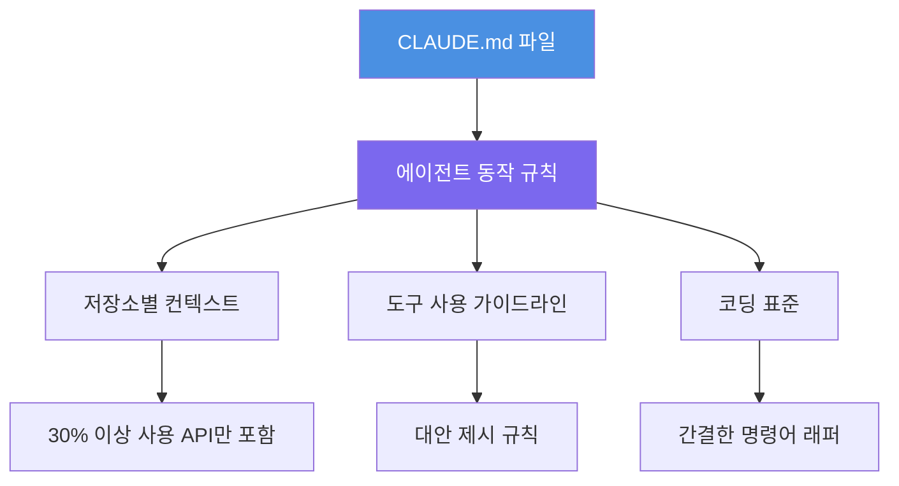

### 파일 크기와 관리 철학

파일 크기는 컨텍스트에 따라 다릅니다:

- **개인 프로젝트**: Claude가 원하는 대로 작성하도록 허용
- **기업 환경**: 13KB 크기로 엄격하게 관리 (25KB까지 성장 가능)

기업 모노레포에서는 **30% 이상의 엔지니어가 사용하는 도구와 API만 문서화**합니다. 각 내부 도구의 문서에는 토큰 수 제한을 두어, 마치 "광고 공간"을 판매하듯 관리합니다. 도구를 간결하게 설명할 수 없다면 `CLAUDE.md`에 추가할 준비가 되지 않은 것입니다.

### 효과적인 CLAUDE.md 작성 원칙

시간이 지나면서 강력하고 명확한 철학이 개발되었습니다:

1. **가드레일로 시작하세요**: Claude가 틀리는 것을 기반으로 문서화하며 작게 시작하세요. 매뉴얼이 아닙니다.

2. **`@`-파일 참조를 피하세요**: 다른 곳에 광범위한 문서가 있을 때 `CLAUDE.md`에서 파일을 `@`-멘션하는 것은 매번 전체 파일을 컨텍스트 윈도우에 포함시켜 블로트를 유발합니다. 대신 파일을 읽어야 하는 **이유와 시점**을 에이전트에게 설명하세요:

   ```
   복잡한 FooBarError가 발생하면 path/to/docs.md를 참조하세요
   ```

3. **"절대 하지 마세요"만 말하지 마세요**: `--foo-bar` 플래그를 사용하지 말라는 부정적 제약만 피하세요. 에이전트는 해당 플래그를 반드시 사용해야 한다고 생각할 때 멈춥니다. 항상 **대안을 제시**하세요:

   ```markdown
   # 나쁜 예
   --foo-bar 플래그를 절대 사용하지 마세요

   # 좋은 예
   --foo-bar 대신 --baz-qux를 사용하세요
   ```

4. **CLAUDE.md를 강제 함수로 사용하세요**: CLI 명령어가 복잡하고 장황하다면 문서화를 위해 여러 단락을 작성하지 마세요. 그것은 인간 문제를 패치하는 것입니다. 대신 명확하고 직관적인 API를 가진 간단한 bash 래퍼를 작성하고 **그것을** 문서화하세요.

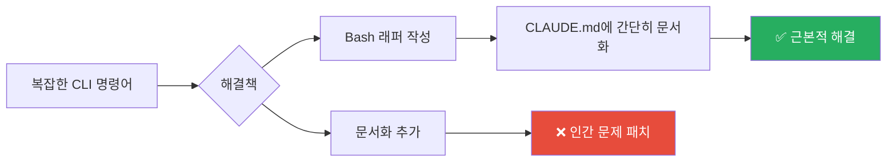

### 다른 AI IDE와의 호환성

`AGENTS.md` 파일과 동기화하여 엔지니어들이 사용할 수 있는 다른 AI IDE와의 호환성을 유지합니다.

**핵심 교훈**: `CLAUDE.md`를 고수준의 엄선된 가드레일과 포인터 집합으로 취급하세요. 포괄적인 매뉴얼이 아니라, 더 AI 친화적이고 인간 친화적인 도구에 투자해야 하는 곳을 안내하는 데 사용하세요.

## 컨텍스트 관리 전략

### /context 명령어로 현황 파악

코딩 세션 중에 최소 한 번은 `/context`를 실행하여 200k 토큰 컨텍스트 윈도우를 어떻게 사용하고 있는지 이해해야 합니다. Sonnet-1M을 사용하더라도 전체 컨텍스트 윈도우가 실제로 효과적으로 사용되는지 신뢰할 수 없습니다.

모노레포에서 새 세션은 기본적으로 약 20k 토큰 (10%)을 소비하며, 나머지 180k는 변경 작업을 위해 사용됩니다. 이는 꽤 빠르게 채워질 수 있습니다.

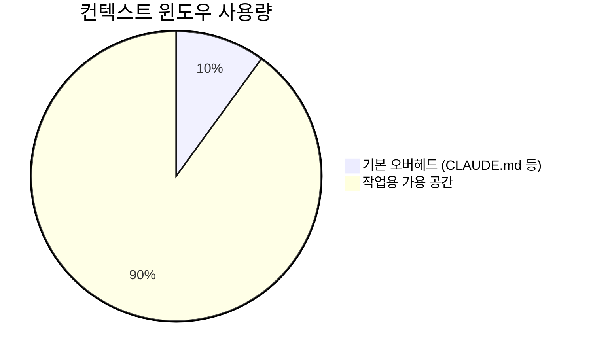

세션 중에 보라색 메시지가 컨텍스트를 채우기 시작하면, 작업을 계속하기 위해 공간을 확보해야 합니다.

### 세 가지 주요 워크플로우

1. **`/compact` (피하세요)**: 최대한 피하세요. 자동 압축은 불투명하고 오류가 발생하기 쉬우며 최적화되지 않았습니다.

2. **`/clear` + `/catchup` (간단한 재시작)**: 기본 재부팅 방식입니다. 상태를 `/clear`한 다음, 현재 git 브랜치에서 변경된 모든 파일을 Claude가 읽도록 하는 커스텀 `/catchup` 명령어를 실행합니다.

3. **"문서화 후 클리어" (복잡한 재시작)**: 대규모 작업용입니다. Claude가 계획과 진행 상황을 `.md` 파일에 덤프하도록 하고, 상태를 `/clear`한 다음, `.md` 파일을 읽고 계속하라고 지시하며 새 세션을 시작합니다.

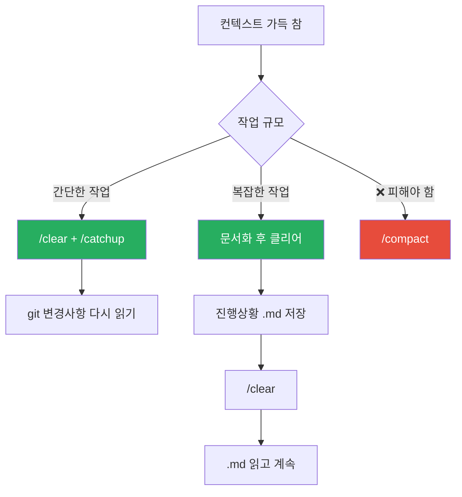

**핵심 교훈**: 자동 압축을 신뢰하지 마세요. 간단한 재부팅에는 `/clear`를, 복잡한 작업에는 "문서화 후 클리어" 방법을 사용하여 내구성 있는 외부 "메모리"를 만드세요.

## 슬래시 커맨드: 최소주의 접근

### 커맨드의 역할

슬래시 커맨드는 자주 사용하는 프롬프트를 위한 간단한 단축키로 생각하며, 그 이상이 아닙니다. 설정은 미니멀해야 합니다:

- **`/catchup`**: 앞서 언급한 명령어입니다. 현재 git 브랜치에서 변경된 모든 파일을 읽도록 Claude에 프롬프트합니다.
- **`/pr`**: 코드를 정리하고, 스테이징하고, 풀 리퀘스트를 준비하는 간단한 도우미입니다.

### 안티패턴 경고

복잡한 커스텀 슬래시 커맨드의 긴 목록이 있다면 안티패턴을 만든 것입니다. Claude 같은 에이전트의 요점은 거의 모든 것을 입력하고 유용하고 병합 가능한 결과를 얻을 수 있다는 것입니다.

엔지니어(또는 비엔지니어)가 작업을 수행하기 위해 어딘가에 문서화된 필수 매직 명령어의 새로운 목록을 배우도록 강요하는 순간, 실패한 것입니다.

**핵심 교훈**: 슬래시 커맨드를 복잡한 것이 아닌 개인용 단축키로 사용하세요. 더 직관적인 `CLAUDE.md`와 더 나은 도구를 갖춘 에이전트를 구축하는 대신이 되어서는 안 됩니다.

## 서브에이전트: 맞춤형 vs 범용

### 이론적 장점

서브에이전트는 Claude Code의 컨텍스트 관리를 위한 가장 강력한 기능입니다. 복잡한 작업에는 `X` 토큰의 입력 컨텍스트가 필요하고, `Y` 토큰의 작업 컨텍스트가 누적되며, `Z` 토큰의 답변을 생성합니다. `N`개의 작업을 실행하면 메인 윈도우에서 `(X + Y + Z) * N` 토큰이 필요합니다.

서브에이전트 솔루션은 `(X + Y) * N` 작업을 전문 에이전트에 위임하고, 최종 `Z` 토큰 답변만 반환하여 메인 컨텍스트를 깨끗하게 유지합니다.

### 실제 문제점

강력한 아이디어지만, 실제로 **커스텀** 서브에이전트는 두 가지 새로운 문제를 만듭니다:

1. **컨텍스트 게이트키퍼**: `PythonTests` 서브에이전트를 만들면 이제 모든 테스팅 컨텍스트를 메인 에이전트에서 숨깁니다. 더 이상 변경 사항에 대해 전체적으로 추론할 수 없습니다. 이제 자체 코드를 검증하는 방법을 알기 위해 서브에이전트를 호출해야 합니다.

2. **인간 워크플로우 강제**: 더 나쁜 것은 Claude를 엄격하고 인간이 정의한 워크플로우에 강제한다는 것입니다. 이제 에이전트가 대신 해결해 주길 원하는 문제인 위임 방법을 지시하고 있습니다.

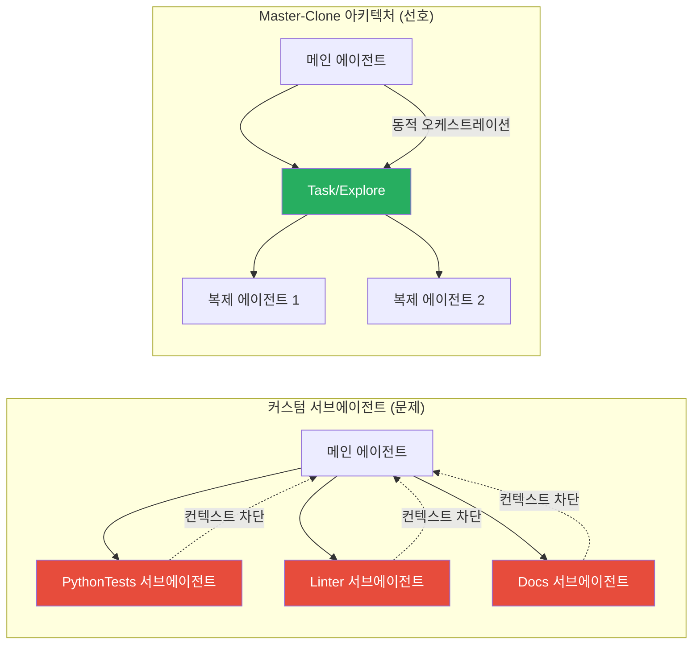

### 선호하는 대안

Claude의 내장 `Task(...)` 기능을 사용하여 **범용** 에이전트의 복제본을 생성합니다.

모든 핵심 컨텍스트를 `CLAUDE.md`에 넣습니다. 그런 다음 **메인 에이전트**가 언제 어떻게 자신의 복사본에 작업을 위임할지 결정하도록 합니다. 이렇게 하면 서브에이전트의 모든 컨텍스트 절약 이점을 얻으면서 단점은 피할 수 있습니다. 에이전트가 자체 오케스트레이션을 동적으로 관리합니다.

이것을 "Master-Clone" 아키텍처라고 하며, 커스텀 서브에이전트가 장려하는 "Lead-Specialist" 모델보다 훨씬 선호합니다.

**핵심 교훈**: 커스텀 서브에이전트는 취약한 솔루션입니다. 메인 에이전트에 컨텍스트(`CLAUDE.md`에서)를 제공하고 자체 `Task/Explore(...)` 기능을 사용하여 위임을 관리하도록 하세요.

## 세션 히스토리 활용

### 기본 재시작 명령어

`claude --resume`과 `claude --continue`를 자주 사용합니다. 버그가 있는 터미널을 재시작하거나 오래된 세션을 빠르게 재부팅하는 데 훌륭합니다.

종종 며칠 전 세션을 `claude --resume`하여 에이전트에게 특정 오류를 어떻게 극복했는지 요약하도록 요청하고, 이를 사용하여 `CLAUDE.md`와 내부 도구를 개선합니다.

### 고급 활용: 메타 분석

더 깊이 들어가면, Claude Code는 모든 세션 히스토리를 `~/.claude/projects/`에 저장하여 원시 과거 세션 데이터를 탭할 수 있습니다. 이러한 로그에서 메타 분석을 실행하는 스크립트가 있으며, 일반적인 예외, 권한 요청 및 오류 패턴을 찾아 에이전트 대면 컨텍스트를 개선하는 데 도움을 줍니다.

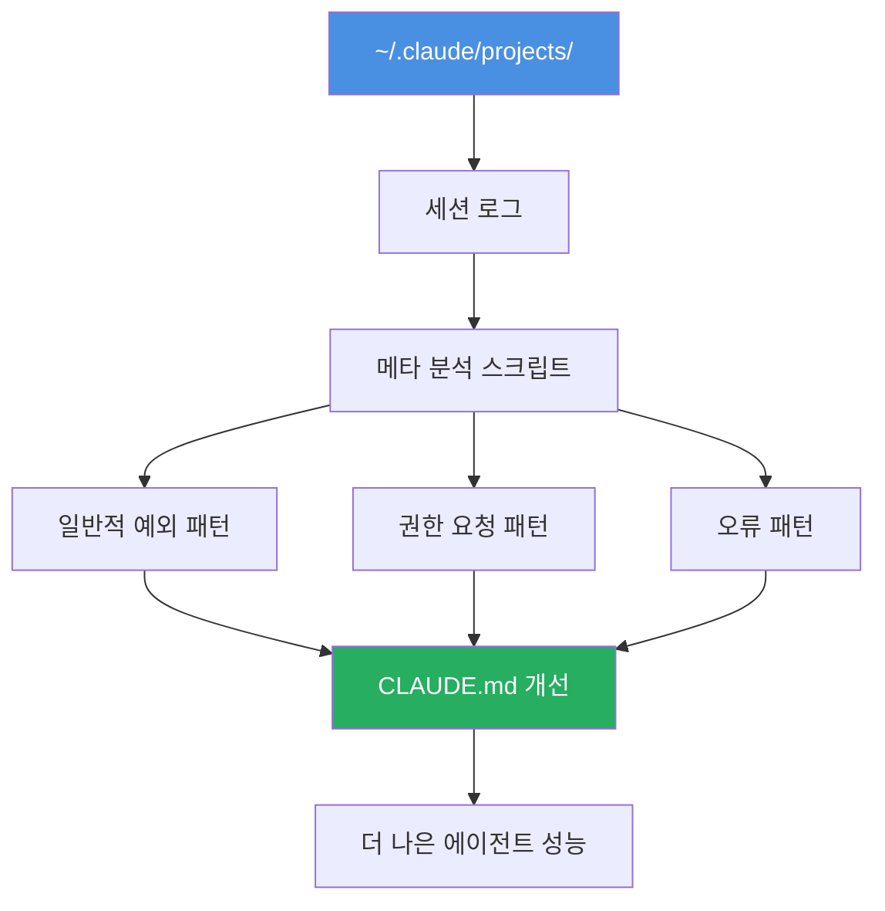

**핵심 교훈**: `claude --resume`과 `claude --continue`를 사용하여 세션을 재시작하고 묻혀있는 과거 컨텍스트를 발견하세요.

## Hooks: 결정적 규칙 실행

### Hooks의 중요성

Hooks는 엄청납니다. 취미 프로젝트에서는 사용하지 않지만, 복잡한 기업 저장소에서 Claude를 조종하는 데 **필수적**입니다. `CLAUDE.md`의 "해야 할 일" 제안을 보완하는 결정적 "반드시 해야 할 일" 규칙입니다.

### 두 가지 Hooks 유형

1. **제출 시 차단 Hooks (Block-at-Submit Hooks)**: 이것이 주요 전략입니다. `Bash(git commit)` 명령어를 래핑하는 `PreToolUse` 훅이 있습니다. 모든 테스트가 통과한 경우에만 테스트 스크립트가 생성하는 `/tmp/agent-pre-commit-pass` 파일을 확인합니다. 파일이 없으면 훅이 커밋을 차단하여 Claude가 빌드가 녹색이 될 때까지 "테스트 및 수정" 루프에 들어가도록 강제합니다.

2. **힌트 Hooks (Hint Hooks)**: 에이전트가 차선책인 작업을 수행하는 경우 "fire-and-forget" 피드백을 제공하는 간단하고 차단되지 않는 훅입니다.

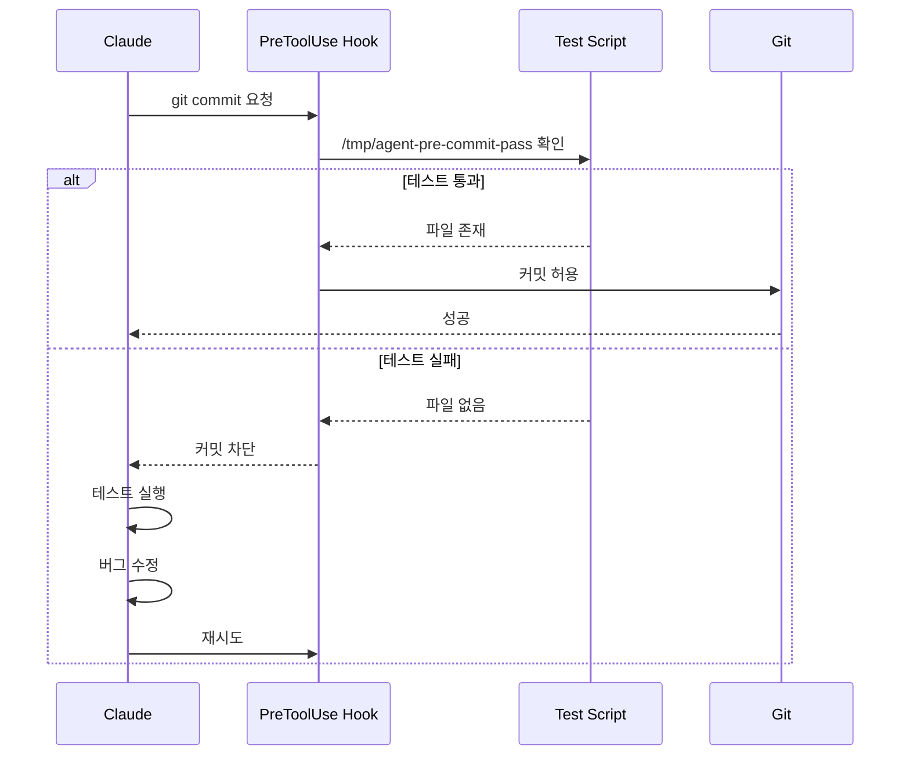

### 차단 위치 전략

의도적으로 "쓰기 시 차단" 훅(예: `Edit` 또는 `Write` 시)은 사용하지 않습니다. 계획 중간에 에이전트를 차단하면 혼란스럽거나 심지어 "좌절"시킵니다. 에이전트가 작업을 완료한 다음 커밋 단계에서 최종 완료된 결과를 확인하는 것이 훨씬 효과적입니다.

**핵심 교훈**: Hooks를 사용하여 커밋 시점에 상태 검증을 강제하세요 (`block-at-submit`). 쓰기 시점에 차단하지 마세요. 에이전트가 계획을 완료한 다음 최종 결과를 확인하세요.

## 플래닝: 복잡한 변경 사전 정렬

### 필수성

AI IDE를 사용한 모든 "대규모" 기능 변경에는 플래닝이 필수적입니다.

### 취미 프로젝트

취미 프로젝트에서는 독점적으로 내장 플래닝 모드를 사용합니다. Claude가 시작하기 전에 정렬하는 방법입니다. 무언가를 구축하는 **방법**과 작업을 중지하고 보여주어야 하는 "검사 체크포인트"를 모두 정의합니다.

이것을 정기적으로 사용하면 Claude가 구현을 망치지 않고 좋은 계획을 얻는 데 필요한 최소한의 컨텍스트에 대한 강력한 직관을 구축할 수 있습니다.

### 기업 모노레포

작업 모노레포에서는 Claude Code SDK를 기반으로 구축된 커스텀 플래닝 도구를 배포하기 시작했습니다. 네이티브 플랜 모드와 유사하지만 출력을 기존 기술 설계 형식과 정렬하도록 강력하게 프롬프트됩니다.

또한 코드 구조에서 데이터 프라이버시 및 보안에 이르기까지 내부 모범 사례를 즉시 시행합니다. 이를 통해 엔지니어가 시니어 아키텍트인 것처럼 새로운 기능을 "바이브 플랜"할 수 있습니다.

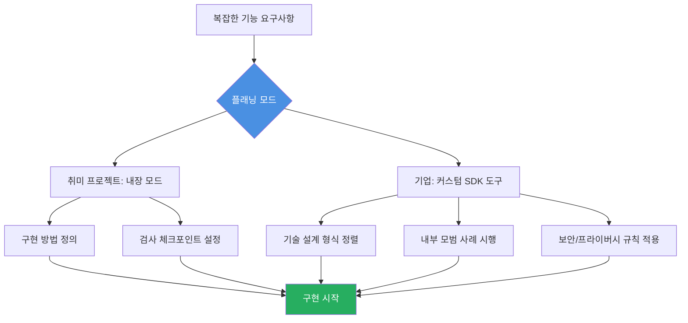

**핵심 교훈**: 복잡한 변경을 위해 항상 내장 플래닝 모드를 사용하여 에이전트가 작업을 시작하기 전에 계획에 정렬하세요.

## Skills: MCP보다 더 중요할 수 있는 것

### Simon Willison의 견해

Simon Willison의 말에 동의합니다: **Skills는 (아마도) MCP보다 더 큰 일입니다.**

### 에이전트 자율성의 진화

게시물을 따라왔다면 대부분의 개발 워크플로우에서 MCP에서 멀어져 **간단한 CLI를 선호**한다는 것을 알 것입니다. 에이전트 자율성에 대한 멘탈 모델은 세 단계로 진화했습니다:

1. **단일 프롬프트**: 모든 컨텍스트를 하나의 거대한 프롬프트에 제공 (취약하고 확장되지 않음)

2. **도구 호출**: "클래식" 에이전트 모델. 도구를 직접 만들고 에이전트를 위해 현실을 추상화 (더 낫지만, 새로운 추상화와 컨텍스트 병목 생성)

3. **스크립팅**: 에이전트에게 원시 환경(바이너리, 스크립트, 문서)에 대한 액세스를 제공하고 상호 작용하기 위해 즉석에서 코드를 작성


### Skills의 역할

이 모델을 염두에 두고 **Agent Skills**는 명백한 다음 기능입니다. "스크립팅" 계층의 공식적인 제품화입니다.

MCP보다 CLI를 선호해왔다면, 이미 암묵적으로 Skills의 이점을 누려왔습니다. `SKILL.md` 파일은 이러한 CLI와 스크립트를 문서화하고 에이전트에게 노출하는 더 조직적이고 공유 가능하며 발견 가능한 방법일 뿐입니다.

**핵심 교훈**: Skills는 올바른 추상화입니다. MCP가 나타내는 엄격하고 API와 같은 모델보다 더 강력하고 유연한 "스크립팅" 기반 에이전트 모델을 공식화합니다.

## MCP의 새로운 역할

### Skills가 MCP를 대체하지 않음

Skills가 MCP의 죽음을 의미하지는 않습니다. 이전에는 많은 사람들이 REST API를 미러링하는 수십 개의 도구가 있는 끔찍하고 컨텍스트가 많은 MCP를 구축했습니다 (`read_thing_a()`, `read_thing_b()`, `update_thing_c()`).

"스크립팅" 모델(이제 Skills로 공식화됨)이 더 낫지만, 환경에 안전하게 액세스할 수 있는 방법이 필요합니다. 이것이 MCP의 새롭고 더 집중된 역할입니다.

### 새로운 MCP 모델

블로트된 API 대신, MCP는 몇 가지 강력하고 고수준의 도구를 제공하는 **간단하고 안전한 게이트웨이**여야 합니다:

- `download_raw_data(filters…)` - 원시 데이터 다운로드
- `take_sensitive_gated_action(args…)` - 민감한 게이트된 작업 수행
- `execute_code_in_environment_with_state(code…)` - 상태가 있는 환경에서 코드 실행

이 모델에서 MCP의 작업은 에이전트를 위해 현실을 추상화하는 것이 아닙니다. 인증, 네트워킹 및 보안 경계를 관리한 다음 방해하지 않는 것입니다. 에이전트를 위한 **진입점**을 제공하고, 에이전트는 스크립팅과 `markdown` 컨텍스트를 사용하여 실제 작업을 수행합니다.

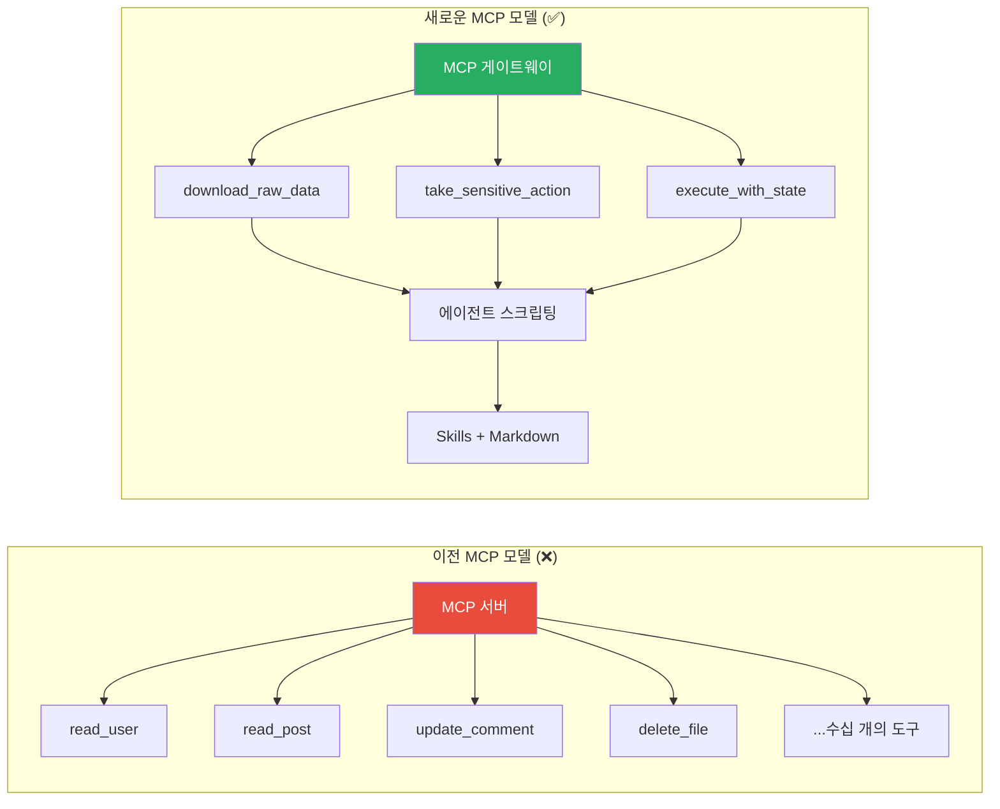

### 실제 사용 사례

여전히 사용하는 유일한 MCP는 Playwright용입니다. 이는 복잡하고 상태 저장 환경이기 때문에 이치에 맞습니다. 모든 상태 비저장 도구(Jira, AWS, GitHub 등)는 간단한 CLI로 마이그레이션되었습니다.

**핵심 교훈**: 데이터 게이트웨이 역할을 하는 MCP를 사용하세요. 에이전트에게 하나 또는 두 개의 고수준 도구(예: 원시 데이터 덤프 API)를 제공하여 스크립팅할 수 있도록 하세요.

## SDK: 에이전트 프레임워크로서의 Claude Code

### 대화형 CLI 이상

Claude Code는 대화형 CLI일 뿐만 아니라, 코딩 및 비코딩 작업 모두를 위한 완전히 새로운 에이전트를 구축하기 위한 강력한 SDK입니다. 대부분의 새로운 취미 프로젝트에서 LangChain/CrewAI와 같은 도구 대신 기본 에이전트 프레임워크로 사용하기 시작했습니다.

### 세 가지 주요 사용 방식

1. **대규모 병렬 스크립팅**: 대규모 리팩터링, 버그 수정 또는 마이그레이션의 경우 대화형 채팅을 사용하지 않습니다. 병렬로 `claude -p "in /pathA change all refs from foo to bar"`를 호출하는 간단한 bash 스크립트를 작성합니다. 이것이 메인 에이전트가 수십 개의 서브에이전트 작업을 관리하도록 하는 것보다 훨씬 더 확장 가능하고 제어 가능합니다.

2. **내부 채팅 도구 구축**: SDK는 복잡한 프로세스를 비기술적 사용자를 위한 간단한 채팅 인터페이스로 래핑하는 데 완벽합니다. 예를 들어, 오류 발생 시 Claude Code SDK로 폴백하여 사용자를 위해 문제를 **수정**하는 설치 프로그램. 또는 디자인 팀이 내부 UI 프레임워크에서 목업 프론트엔드를 바이브 코딩할 수 있게 해주는 인하우스 "v0-at-home" 도구.

3. **신속한 에이전트 프로토타이핑**: 이것이 가장 일반적인 용도입니다. 코딩에만 국한되지 않습니다. 에이전트 작업에 대한 아이디어가 있다면(예: 커스텀 CLI나 MCP를 사용하는 "위협 조사 에이전트"), Claude Code SDK를 사용하여 완전하고 배포된 스캐폴딩에 커밋하기 전에 프로토타입을 빠르게 구축하고 테스트합니다.

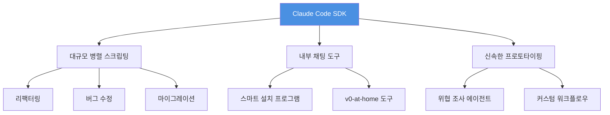

**핵심 교훈**: Claude Code SDK는 강력하고 범용적인 에이전트 프레임워크입니다. 배치 처리 코드, 내부 도구 구축 및 더 복잡한 프레임워크에 도달하기 전에 새로운 에이전트를 신속하게 프로토타이핑하는 데 사용하세요.

## GitHub Actions: Claude Code 운영화

### 가장 과소평가된 기능

Claude Code GitHub Action (GHA)은 아마도 가장 좋아하고 가장 잠들어 있는 기능 중 하나입니다. 단순한 개념입니다. GHA에서 Claude Code를 실행합니다. 하지만 이 단순함이 강력한 이유입니다.

### Cursor 및 Codex와의 차이점

Cursor의 백그라운드 에이전트나 Codex 관리형 웹 UI와 유사하지만 훨씬 더 커스터마이즈 가능합니다. 전체 컨테이너와 환경을 제어하여 다른 제품이 제공하는 것보다 데이터에 대한 더 많은 액세스와 결정적으로 훨씬 강력한 샌드박싱 및 감사 제어를 제공합니다. 또한 Hooks와 MCP와 같은 모든 고급 기능을 지원합니다.

### 실제 활용: 어디서나 PR 생성

이것을 사용하여 커스텀 "어디서나 PR" 도구를 구축했습니다. 사용자는 Slack, Jira 또는 CloudWatch 알림에서 PR을 트리거할 수 있으며, GHA가 버그를 수정하거나 기능을 추가하고 완전히 테스트된 PR을 반환합니다.

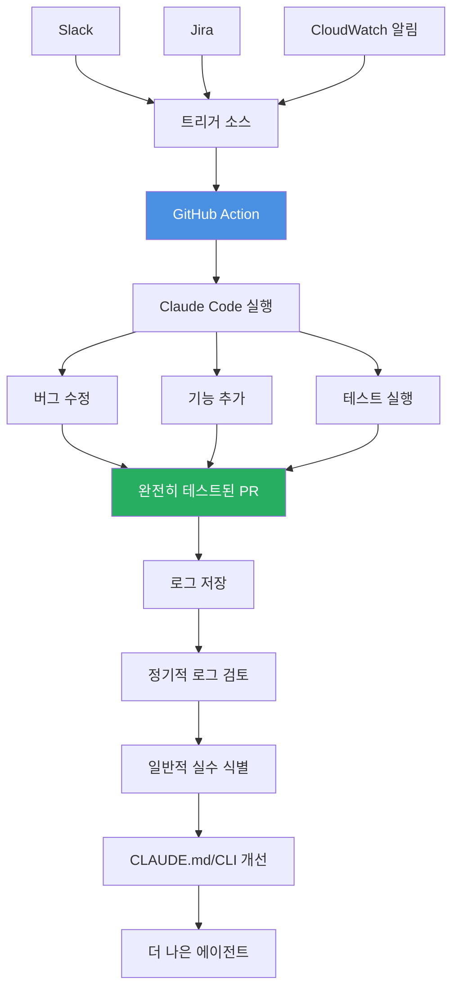

### 데이터 기반 개선 사이클

GHA 로그는 전체 에이전트 로그이므로 회사 수준에서 이러한 로그를 정기적으로 검토하는 운영 프로세스가 있습니다. 일반적인 실수, bash 오류 또는 정렬되지 않은 엔지니어링 관행을 찾습니다. 이것은 데이터 기반 플라이휠을 만듭니다:

**버그 → 개선된 CLAUDE.md / CLI → 더 나은 에이전트**

심지어 다음과 같이 쿼리할 수 있습니다:

```bash
$ query-claude-gha-logs --since 5d | claude -p "see what the other claudes were getting stuck on and fix it, then put up a PR"
```

**핵심 교훈**: GHA는 Claude Code를 운영화하는 궁극적인 방법입니다. 개인 도구에서 엔지니어링 시스템의 핵심적이고 감사 가능하며 자체 개선되는 부분으로 전환합니다.

## 설정 파일 커스터마이징

마지막으로, 취미와 전문 작업 모두에 필수적인 몇 가지 특정 `settings.json` 구성이 있습니다.

### 프록시 설정

`HTTPS_PROXY` / `HTTP_PROXY`: 디버깅에 훌륭합니다. Claude가 보내는 정확한 프롬프트를 보기 위해 원시 트래픽을 검사하는 데 사용합니다. 백그라운드 에이전트의 경우 세분화된 네트워크 샌드박싱을 위한 강력한 도구이기도 합니다.

### 타임아웃 설정

`MCP_TOOL_TIMEOUT` / `BASH_MAX_TIMEOUT_MS`: 이것들을 높입니다. 길고 복잡한 명령어를 실행하는 것을 좋아하며, 기본 타임아웃은 종종 너무 보수적입니다. bash 백그라운드 작업이 이제 존재하는지 확실하지 않지만, 만약을 위해 유지합니다.

### API 키 관리

`ANTHROPIC_API_KEY`: 직장에서는 엔터프라이즈 API 키(apiKeyHelper를 통해)를 사용합니다. "좌석당" 라이선스에서 "사용량 기반" 가격 책정으로 전환하여 작업 방식에 훨씬 더 적합한 모델입니다:

- 개발자 사용의 **대규모 variance**를 고려 (엔지니어 간 1:100x 차이를 본 적이 있음)
- 엔지니어가 단일 엔터프라이즈 계정 하에서 Claude Code가 아닌 LLM 스크립트를 가지고 놀 수 있게 함

### 권한 감사

`"permissions"`: Claude가 자동 실행하도록 허용한 명령어 목록을 가끔 셀프 감사합니다.

**핵심 교훈**: `settings.json`은 고급 커스터마이징을 위한 강력한 장소입니다.

## 핵심 요약

### CLAUDE.md 관리

- **가장 중요한 파일**: 저장소별 동작 규칙을 정의하는 "헌법"
- **간결하게 유지**: 30% 이상 사용 도구만 문서화, 토큰 제한 관리
- **가드레일 중심**: 매뉴얼이 아닌 "틀린 것"을 기반으로 한 규칙
- **대안 제시**: "하지 마세요"만 말하지 말고 "대신 이것을 하세요" 제공

### 컨텍스트 최적화

- **/context 모니터링**: 200k 토큰 사용량 정기적 확인
- **/compact 피하기**: 불투명하고 오류 발생 가능
- **/clear + /catchup**: 간단한 재시작용 기본 방법
- **문서화 후 클리어**: 복잡한 작업용 외부 메모리 생성

### 아키텍처 결정

- **커스텀 서브에이전트 피하기**: 컨텍스트 게이트키퍼 문제
- **Master-Clone 선호**: Task/Explore로 동적 오케스트레이션
- **Skills > MCP**: 스크립팅 기반 모델이 API 기반보다 유연
- **MCP는 게이트웨이**: 인증/보안 관리 후 스크립팅에 양보

### 운영화 전략

- **Hooks로 검증**: 커밋 시점에 상태 검증 (block-at-submit)
- **플래닝 필수**: 복잡한 변경 전 계획 정렬
- **GitHub Actions**: 감사 가능하고 자체 개선되는 시스템 구축
- **데이터 기반 개선**: 로그 분석으로 CLAUDE.md/CLI 개선

## 결론

Claude Code는 단순한 코딩 도구가 아니라, 전체 개발 워크플로우를 자율적으로 관리할 수 있는 강력한 에이전트 플랫폼입니다. 이 글에서 다룬 모든 기능을 효과적으로 활용하려면 다음 핵심 원칙을 기억해야 합니다:

**컨텍스트 관리가 핵심입니다**. CLAUDE.md를 신중하게 관리하고, 컨텍스트 윈도우를 모니터링하며, 적절한 시점에 세션을 재시작하세요.

**자동화보다 제어가 중요합니다**. 자동 압축보다는 명시적 재시작을, 커스텀 서브에이전트보다는 범용 에이전트 복제를 선호하세요.

**운영화를 고려하세요**. Hooks로 검증하고, GitHub Actions로 감사 가능한 시스템을 구축하며, 데이터 기반으로 지속적으로 개선하세요.

**Skills와 SDK가 미래입니다**. MCP의 엄격한 API 모델보다는 유연한 스크립팅 기반 접근이 더 효과적입니다.

이 가이드가 Claude Code를 더 효과적으로 활용하는 데 도움이 되기를 바랍니다. CLI 기반 에이전트를 아직 사용하지 않고 있다면, 지금 시작할 때입니다. 이러한 고급 기능에 대한 좋은 가이드가 거의 없으므로, 배우는 유일한 방법은 직접 뛰어드는 것입니다.
