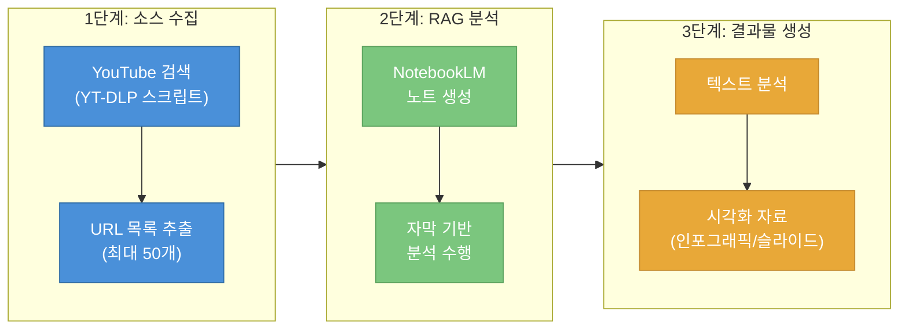
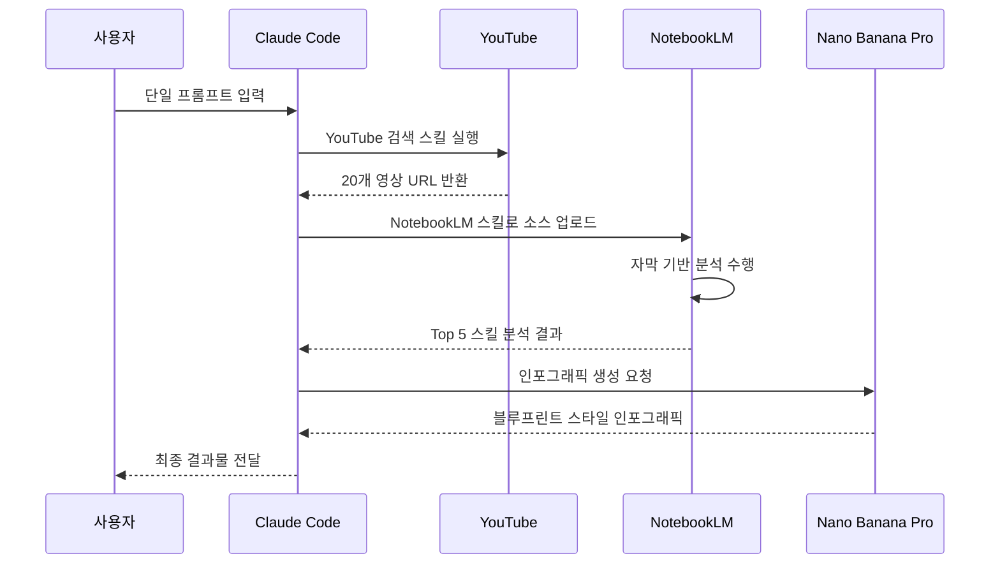
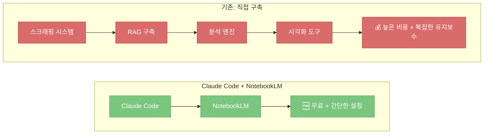
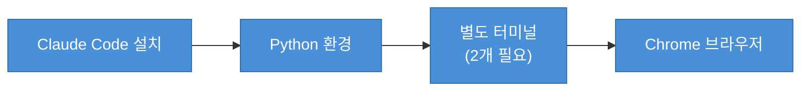
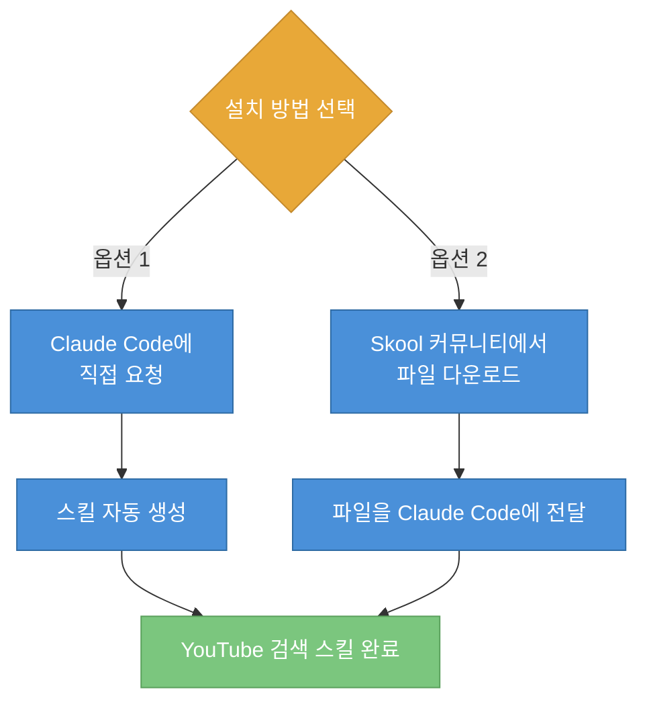
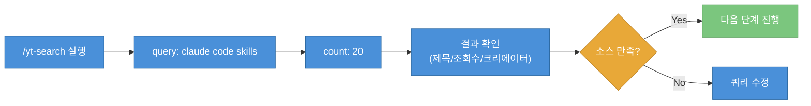
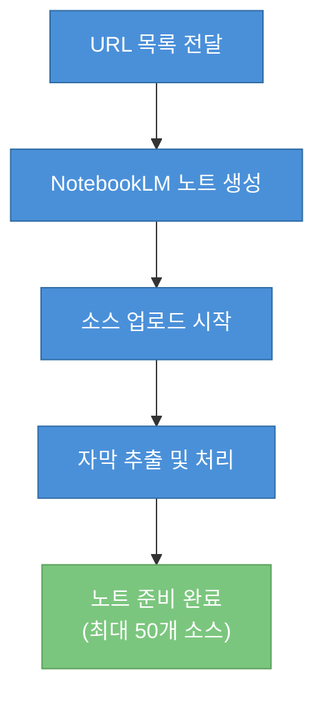
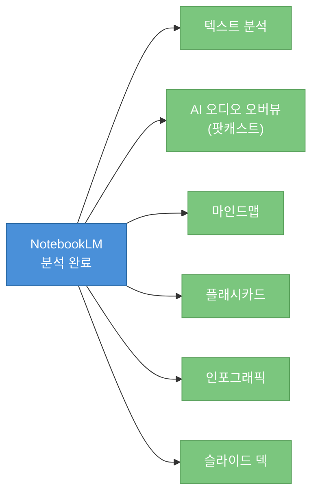
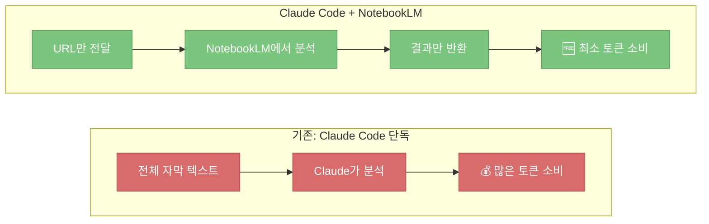

Claude Code는 강력한 리서치 에이전트지만, 단독으로 사용하면 웹 검색 결과에 의존하는 수준에 머물기 쉽습니다. Chase AI 채널의 영상에서는 Claude Code와 Google NotebookLM을 결합하여 **YouTube 자동 스크래핑 → RAG 분석 → 시각화 산출물**까지 처리하는 무료 워크플로우를 소개합니다. 이 글은 해당 영상을 바탕으로 전체 파이프라인을 단계별로 정리한 노트입니다.

<!--more-->

## Sources

- https://www.youtube.com/watch?v=usTeU4Uh0iM

## 전체 워크플로우 개요

이 워크플로우의 핵심은 **토큰 소비 없이** 대규모 리서치를 수행하는 것입니다. Claude Code는 YouTube URL 수집과 NotebookLM 요청만 담당하고, 실제 분석은 Google NotebookLM 서버에서 이루어집니다.



**주요 장점:**
- **무료:** NotebookLM은 Google에서 무료로 제공하는 RAG 시스템입니다 ([t=30](https://youtu.be/usTeU4Uh0iM?t=30))
- **토큰 절약:** 분석이 Claude Code가 아닌 Google 서버에서 수행되어 토큰 소비가 최소화됩니다 ([t=580](https://youtu.be/usTeU4Uh0iM?t=580))
- **다양한 산출물:** 인포그래픽, 슬라이드 덱, 팟캐스트, 플래시카드 등을 자동 생성합니다 ([t=40](https://youtu.be/usTeU4Uh0iM?t=40))

## 데모: 한 번의 프롬프트로 끝내는 리서치

영상에서 보여주는 데모는 다음과 같은 단일 프롬프트로 실행됩니다:

> "Claude Code skills 관련 최신 트렌딩 YouTube 영상을 찾아서 NotebookLM에 업로드하고, Top 5 Claude Code 스킬을 분석한 후 손글씨 블루프린트 스타일의 인포그래픽을 만들어 줘."



**실행 결과:**
- Claude Code가 YouTube에서 20개 영상 URL을 자동 수집
- NotebookLM에 소스로 업로드 (제목, 크리에이터, 조회수, 재생시간 포함)
- NotebookLM이 Top 5 Claude Code 스킬과 신흥 트렌드 분석
- Nano Banana Pro를 통해 요청한 스타일의 인포그래픽 자동 생성 ([t=80](https://youtu.be/usTeU4Uh0iM?t=80))

## 왜 Claude Code + NotebookLM 조합인가?

### 이유 1: 분석 비용 제로

기존 방식으로 YouTube 리서치 파이프라인을 구축하려면 다음이 필요합니다:
- 스크래핑 시스템
- RAG 시스템 구축
- 분석 엔진
- 시각화 도구

이 모든 것을 직접 구축하면 **시간과 비용이 많이 들고 유지보수가 어렵습니다**. 반면 NotebookLM은 이 모든 기능을 무료로 제공합니다 ([t=180](https://youtu.be/usTeU4Uh0iM?t=180)).



### 이유 2: Claude Code 생태계와의 통합

NotebookLM만 단독으로 사용해도 되지만, Claude Code와 결합하면 **분석 결과를 Claude Code 생태계로 바로 가져올 수 있습니다**. 이는 단순히 소스 입력 과정을 자동화하는 것 이상의 가치를 제공합니다 ([t=140](https://youtu.be/usTeU4Uh0iM?t=140)).

### 이유 3: API보다 더 많은 기능

NotebookLM-py를 사용하면 웹 UI에서 제공하는 기능 외에도 **배치 다운로드, 퀴즈/플래시카드 내보내기** 등 추가 기능을 사용할 수 있습니다 ([t=400](https://youtu.be/usTeU4Uh0iM?t=400)).

## 설정 가이드: 5분 만에 구축하기

### 전제 조건



### Step 1: YouTube 검색 스킬 설치

YouTube 검색 스킬은 **YT-DLP** 의존성을 사용하여 YouTube 메타데이터를 스크래핑합니다 ([t=320](https://youtu.be/usTeU4Uh0iM?t=320)).

**설치 방법 (두 가지 옵션):**

1. **Claude Code에게 구축 요청:** "YT-DLP 의존성을 사용해서 YouTube 스크래퍼 스킬을 만들어 줘"
2. **스킬 파일 다운로드:** Chase AI의 무료 Skool 커뮤니티에서 `youtube-search-skill-setup.md` 파일을 받아 Claude Code에 전달



### Step 2: NotebookLM-py 설치

NotebookLM은 공개 API를 제공하지 않지만, **Tang Ling** 이 만든 비공식 Python API를 사용할 수 있습니다 ([t=300](https://youtu.be/usTeU4Uh0iM?t=300)).

**설치 명령어 (별도 터미널에서 실행):**

```bash
# NotebookLM-py 설치
pip install notebooklm-py

# NotebookLM 로그인 (최초 1회만 필요)
notebooklm login
```

로그인 명령어를 실행하면 Chrome 창이 열리고 Google 계정으로 로그인하면 됩니다. 이 과정은 한 번만 수행하면 됩니다 ([t=360](https://youtu.be/usTeU4Uh0iM?t=360)).

### Step 3: NotebookLM 스킬 설치

NotebookLM 스킬은 Claude Code에게 NotebookLM을 어떻게 사용할지 알려주는 프롬프트 파일입니다.

```bash
# 스킬 설치 (터미널에서 실행 또는 Claude Code에 요청)
claude skill add notebooklm
```

**스킬이 포함하는 내용:**
- 노트 생성 방법
- 콘텐츠 생성 방법
- 분석 요청 방법
- 산출물 내보내기 방법

## 실전 사용법: 단계별 실행

### 1단계: YouTube 소스 수집

YouTube 검색 스킬을 사용하여 원하는 주제의 영상을 찾습니다.



**사용 예시:**
- 슬래시 커맨드: `/yt-search query="claude code skills" count=20`
- 자연어: "Claude Code 스킬 관련 최신 YouTube 영상 20개를 찾아 줘"

결과로 반환되는 정보:
- 영상 제목
- 크리에이터 이름
- 조회수
- 재생 시간
- 업로드 날짜
- YouTube URL

### 2단계: NotebookLM에 소스 업로드

수집한 URL을 NotebookLM 노트로 만듭니다.

> "이 소스들을 사용해서 'Claude Code Skills Analysis'라는 제목의 NotebookLM 노트를 생성해 줘."



**주의사항:** NotebookLM은 **최대 50개 소스**까지만 지원합니다 ([t=540](https://youtu.be/usTeU4Uh0iM?t=540)).

### 3단계: 분석 요청

노트가 준비되면 NotebookLM에 분석을 요청합니다.

> "이 영상들을 바탕으로 NotebookLM이 생각하는 최고의 Claude Code 스킬은 무엇인가?"

**핵심 포인트:** 모든 분석은 Google 서버에서 수행되므로 Claude Code는 **소량의 토큰만 소비**합니다. 요청을 보내고 결과를 받아오는 역할만 하기 때문입니다 ([t=580](https://youtu.be/usTeU4Uh0iM?t=580)).

### 4단계: 산출물 생성

NotebookLM에서 제공하는 다양한 산출물을 요청할 수 있습니다:



**요청 예시:**
- "이 분석을 바탕으로 인포그래픽을 만들어 줘"
- "슬라이드 덱을 생성해 줘"
- "플래시카드로 만들어 줘"
- "AI 오디오 오버뷰를 생성해 줘"

## 토큰 절약 메커니즘



**토큰 절약 원리:**
1. Claude Code는 YouTube URL만 NotebookLM에 전달
2. NotebookLM이 자막을 다운로드하고 분석 수행
3. 분석 결과만 Claude Code로 반환
4. Claude Code는 전체 자막을 처리하지 않음

이 방식으로 **수천 페이지 분량의 자막**도 처리할 수 있습니다.

## 활용 시나리오

### 시나리오 1: 기술 트렌드 리서치


### 시나리오 2: 경쟁사 분석

- 경쟁사 관련 YouTube 영상 수집
- NotebookLM으로 시장 반응 분석
- 인포그래픽으로 시각화

### 시나리오 3: 학습 자료 정리

- 특정 주제의 교육 영상 수집
- NotebookLM으로 핵심 개념 추출
- 플래시카드로 변환하여 학습

## 한계점과 주의사항

### 한계점

1. **소스 제한:** NotebookLM은 노트당 최대 50개 소스까지만 지원합니다 ([t=540](https://youtu.be/usTeU4Uh0iM?t=540))
2. **비공식 API:** NotebookLM-py는 Google에서 공식 지원하지 않는 비공식 라이브러리입니다
3. **YouTube 자막 의존:** 자막이 없는 영상은 분석할 수 없습니다

### 주의사항

1. **별도 터미널 필요:** NotebookLM-py 설치와 로그인은 Claude Code 터미널이 아닌 **별도 터미널**에서 수행해야 합니다 ([t=340](https://youtu.be/usTeU4Uh0iM?t=340))
2. **최초 1회 로그인:** `notebooklm login` 명령어로 Google 계정 인증이 필요합니다
3. **소스 검증:** NotebookLM 분석 결과는 언제든 NotebookLM 웹 UI에서 직접 확인할 수 있습니다

## 핵심 요약

| 항목 | 내용 |
|------|------|
| **핵심 도구** | Claude Code + NotebookLM-py + YouTube 검색 스킬 |
| **설정 시간** | 약 5분 ([t=20](https://youtu.be/usTeU4Uh0iM?t=20)) |
| **비용** | 무료 |
| **소스 제한** | 노트당 최대 50개 |
| **주요 산출물** | 텍스트 분석, 인포그래픽, 슬라이드, 팟캐스트, 플래시카드 |
| **토큰 절약** | 분석은 Google 서버에서 수행 |

## 결론

Claude Code와 NotebookLM의 조합은 **무료로 강력한 리서치 파이프라인**을 구축할 수 있게 해줍니다. 직접 RAG 시스템을 구축하는 것보다 훨씬 간단하고, 분석 비용도 들지 않습니다. 특히 YouTube 콘텐츠를 기반으로 지식 베이스를 구축하고 싶은 경우, 이 워크플로우는 매우 실용적인 선택입니다.

설정이 간단하고(약 5분), 일단 설정하면 자연어로 모든 작업을 수행할 수 있다는 점이 큰 장점입니다. YouTube 리서치를 자주 수행한다면 이 조합을 꼭 활용해 보시길 권장합니다.
