Claude Code, OpenAI Codex 같은 코딩 에이전트를 효과적으로 활용하기 위한 패턴들을 정리한 Simon Willison의 가이드를 소개합니다.

<!--more-->

## Sources

- [Agentic Engineering Patterns - Simon Willison's Weblog](https://simonwillison.net/guides/agentic-engineering-patterns/)

---

## 핵심 전제: 코드 작성 비용의 급격한 하락

에이전트 엔지니어링 관행을 채택할 때 가장 큰 도전은 **"코드 작성이 이제 저렴해졌다"**는 사실에 적응하는 것입니다.

### 과거의 코드 비용 구조

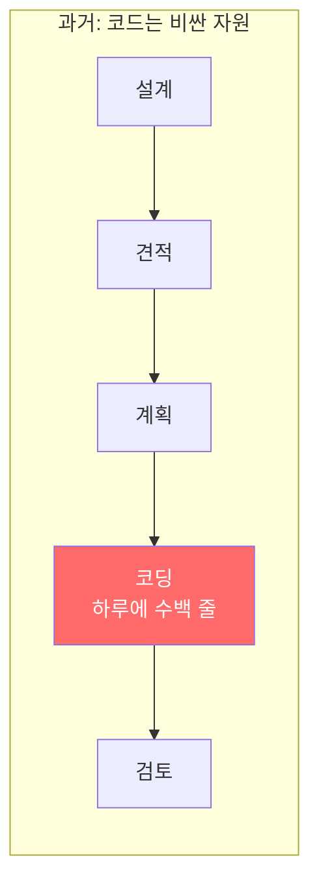

과거에는 깨끗하고 테스트된 코드 수백 줄을 작성하는 데 숙련된 개발자가 하루 이상 걸렸습니다. 이 핵심 제약을 중심으로 많은 엔지니어링 습관이 형성되었습니다.

**거시적 수준**: 프로젝트를 설계, 견적, 계획하는 데 많은 시간을 투자했습니다. 기능 아이디어는 개발 시간 대비 제공할 수 있는 가치로 평가되었습니다.

**미시적 수준**: 매일 수백 개의 결정을 내렸습니다. 함수를 더 우아하게 리팩토링할까? 문서화할 시간이 있을까? 이 엣지 케이스에 테스트를 추가할까? 디버그 인터페이스를 만들 가치가 있을까?

### 코딩 에이전트의 파괴적 영향

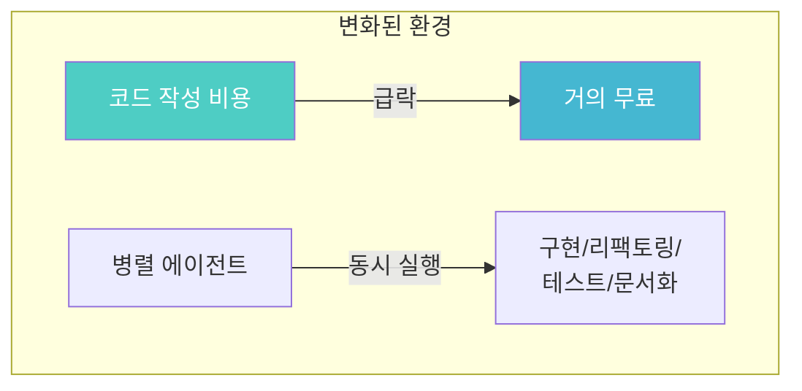

코딩 에이전트는 코드를 컴퓨터에 입력하는 비용을 극적으로 낮춥니다. 이는 기존의 개인적, 조직적 직관을 뒤집습니다.

병렬 에이전트 실행은 이를 더욱 복잡하게 만듭니다. 한 명의 엔지니어가 여러 위치에서 동시에 구현, 리팩토링, 테스트, 문서화할 수 있습니다.

### "좋은 코드"는 여전히 비용이 든다

새 코드를 작성하는 비용은 거의 무료로 떨어졌지만, **좋은 코드를 작성하는 비용**은 여전히 상당합니다.

Simon Willison이 정의한 "좋은 코드"의 기준:

| 기준 | 설명 |
|------|------|
| **작동함** | 버그 없이 의도한 대로 동작 |
| **작동함을 알음** | 코드가 목적에 부합함을 확인 |
| **올바른 문제 해결** | 진짜 문제를 해결 |
| **에러 처리** | 행복한 경로뿐만 아니라 에러 케이스도 우아하게 처리 |
| **단순함** | 필요한 것만 수행, 인간과 기계가 모두 이해 가능 |
| **테스트 보호** | 회귀 테스트 스위트 확보 |
| **적절한 문서화** | 현재 시스템 상태를 반영하는 문서 |
| **미래 변경 용이성** | YAGNI를 유지하면서도 미래 변경을 어렵게 만들지 않음 |
| **기타 품질 속성** | 접근성, 테스트 가능성, 신뢰성, 보안, 유지보수성, 관찰 가능성, 확장성, 사용성 |

코딩 에이전트는 이 중 대부분을 도울 수 있지만, 개발자가 생산된 코드가 현재 프로젝트에 필요한 "좋음"의 기준을 충족하는지 확인하는 책임은 여전히 존재합니다.

### 새로운 습관 형성

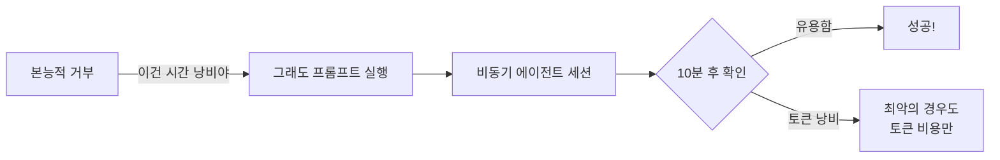

최선의 방법은 스스로를 되돌아보는 것입니다. 본능이 "그거 만들 시간 없어, 가치 없어"라고 말할 때마다, 어쨌든 프롬프트를 실행해보세요. 비동기 에이전트 세션에서 최악의 경우는 10분 후 확인했을 때 토큰 값만 낭비된 것뿐입니다.

---

## 원칙 1: 할 줄 아는 것을 축적하라

### 솔루션 수집의 가치

소프트웨어를 구축하는 기술의 큰 부분은 **무엇이 가능하고 불가능한지 이해**하고, 그것들을 어떻게 달성할 수 있는지 대략적인 아이디어를 갖는 것입니다.

- 웹 페이지에서 JavaScript만으로 OCR 작업을 실행할 수 있을까?
- iPhone 앱이 실행 중이지 않을 때도 Bluetooth 기기와 페어링할 수 있을까?
- Python에서 100GB JSON 파일을 메모리에 모두 로드하지 않고 처리할 수 있을까?

이런 질문에 대한 답을 많이 알수록, 다른 사람들은 생각하지 못한 방식으로 기술을 활용할 기회를 발견할 가능성이 높아집니다.

### 축적 방법

Simon Willison의 축적 방법들:

1. **블로그와 TIL 블로그**: 알아낸 것들을 기록한 노트들
2. **GitHub 리포지토리**: 1,000개 이상의 리포지토리, 많은 것이 핵심 아이디어를 보여주는 작은 PoC들
3. **LLM 활용 확장**: `tools.simonwillison.net` - HTML 도구 컬렉션
4. **research 리포지토리**: 더 복잡한 예제들과 보고서

### 축적한 것의 재조합

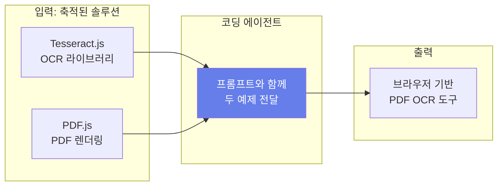

가장 좋아하는 프롬프팅 패턴 중 하나는 **에이전트에게 두 개 이상의 기존 작동 예제를 결합하여 새로운 것을 만들라고 지시**하는 것입니다.

**사례: 브라우저 기반 OCR 도구**
- Tesseract.js (WebAssembly 기반 OCR) 코드 조각 보유
- PDF.js (PDF 페이지를 이미지로 변환) 코드 조각 보유
- 두 예제를 Claude 3 Opus에 결합하여 전달
- 완벽하게 작동하는 PoC 페이지 생성

### 코딩 에이전트로 더욱 강력해진 축적

코딩 에이전트가 인터넷에 접근할 수 있다면:

```bash
# curl 사용 (WebFetch 도구는 요약만 반환하므로)
curl https://tools.simonwillison.net/...
```

로컬에서 실행할 때는 예제를 찾을 위치를 알려줄 수 있습니다:

```bash
# 로컬 검색 활용
~ - find and read my notes on ...
```

에이전트는 검색 하위 에이전트를 실행하여 필요한 세부 정보를 가져옵니다.

```bash
# 공개 리포지토리 클론
Clone my simonw/research repo to /tmp and use it as input
```

**핵심 아이디어**: 코딩 에이전트 덕분에 유용한 트릭을 한 번만 알아내면 됩니다. 그 트릭이 작동하는 코드 예제와 함께 문서화되면, 에이전트는 그 예제를 참조하여 미래에 유사한 모양의 프로젝트를 해결할 수 있습니다.

---

## 원칙 2: 안티 패턴 피하기

### 검토하지 않은 코드를 협업자에게 강요하지 말라

이 안티 패턴은 흔하고 매우 답답합니다.

**직접 검토하지 않은 코드로 PR을 제출하지 마세요.**

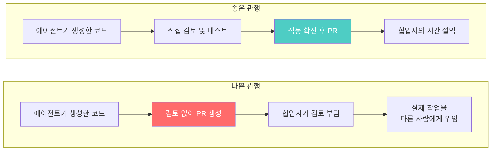

수백 또는 수천 줄의 에이전트 생성 코드를 검토하지 않고 PR을 열면, 실제 작업을 다른 사람에게 위임하는 것입니다. 그들은 스스로 에이전트에 프롬프트할 수 있었습니다. 당신은 어떤 가치를 제공하고 있나요?

### 좋은 에이전트 엔지니어링 PR의 특징

| 특징 | 설명 |
|------|------|
| **코드 작동** | 작동한다고 확신해야 함 |
| **적절한 크기** | 검토자에게 과도한 인지 부하를 주지 않는 크기 |
| **컨텍스트 포함** | 변경이 서비스하는 상위 수준 목표 설명 |
| **검토된 설명** | 에이전트가 작성한 PR 설명도 직접 검토 필요 |

### 검증 증거 제공하기

검토하지 않은 코드를 쉽게 덤프할 수 있기 때문에, 추가 작업을 했다는 **증거**를 포함하는 것이 좋습니다:

- 수동 테스트 방법에 대한 노트
- 특정 구현 선택에 대한 코멘트
- 기능 작동을 보여주는 스크린샷이나 비디오

---

## 테스트와 QA 전략

### Red/Green TDD

"**Red/Green TDD 사용**"은 코딩 에이전트에서 더 나은 결과를 얻는 간결한 방법입니다.

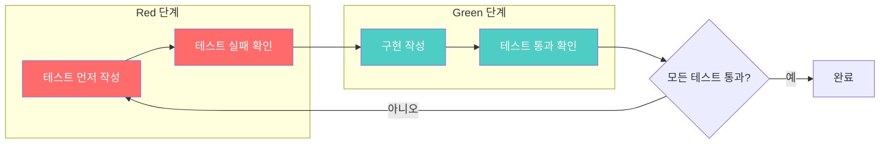

**TDD (Test Driven Development)**: 모든 코드 조각이 그것이 작동함을 보여주는 자동화된 테스트와 함께 작성되는 프로그래밍 스타일.

**Test-first 개발**: 자동화된 테스트를 먼저 작성하고, 실패를 확인한 다음, 테스트가 통과할 때까지 구현을 반복합니다.

### TDD가 코딩 에이전트에 완벽한 이유

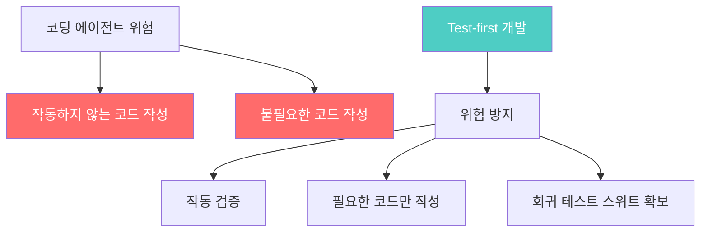

코딩 에이전트의 중요한 위험:
- 작동하지 않는 코드를 작성할 수 있음
- 필요 없고 사용되지 않는 코드를 작성할 수 있음

Test-first 개발은 이 두 가지 일반적인 실수를 방지하고, 미래의 회귀를 방지하는 견고한 자동화된 테스트 스위트를 보장합니다.

**중요**: 테스트가 통과하게 만드는 코드를 구현하기 전에 **테스트가 실패하는지 확인**해야 합니다. 그 단계를 건너뛰면 이미 통과하는 테스트를 만들 위험이 있습니다.

### 예시 프롬프트

```
Use red/green TDD to add a feature that...
```

모든 좋은 모델은 "red/green TDD"를 "테스트 주도 개발을 사용하고, 테스트를 먼저 작성하고, 통과하게 만드는 변경을 구현하기 전에 테스트가 실패하는지 확인하라"는 훨씬 긴 지시의 약어로 이해합니다.

---

## 테스트 먼저 실행하기

코딩 에이전트와 작업할 때 **자동화된 테스트는 더 이상 선택 사항이 아닙니다**.

### 과거의 변명은 더 이상 유효하지 않음

| 과거 변명 | 현재 상황 |
|----------|----------|
| 테스트 작성이 시간 소모적 | 에이전트가 몇 분 만에 작성 |
| 빠르게 변화하는 코드베이스에서 재작성 비용 | 에이전트가 빠르게 수정 |
| AI 생성 코드 검증 어려움 | 테스트로 검증 가능 |

테스트는 AI 생성 코드가 주장하는 대로 작동하는지 확인하는 데 필수적입니다. **코드가 실행된 적이 없다면 프로덕션에 배포했을 때 실제로 작동하는 것은 순전히 운입니다.**

### 새 세션 시작 시 프롬프트

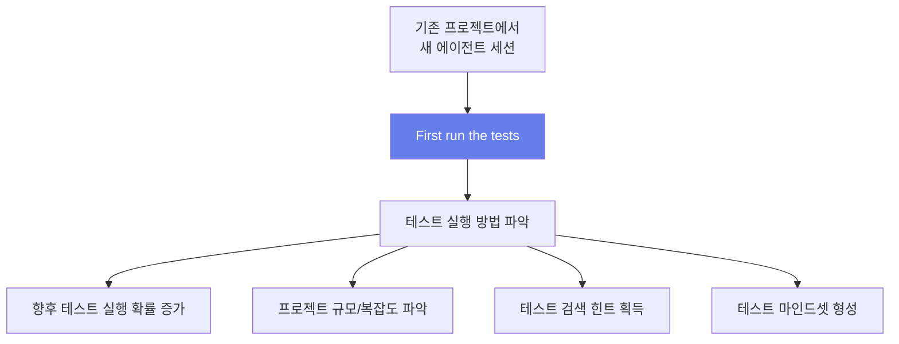

새 세션을 시작할 때마다 다음 변형을 프롬프트합니다:

```
First run the tests
```

또는 Python 프로젝트의 경우:

```
Run pytest
```

**이 네 단어 프롬프트의 목적들**:

1. **테스트 스위트 존재 알림**: 에이전트가 테스트 실행 방법을 파악하게 함
2. **프로젝트 규모 힌트**: 테스트 수가 프로젝트 크기와 복잡도의 대리 지표
3. **테스트 마인드셋**: 테스트를 실행한 후 나중에 직접 테스트를 확장하는 것이 자연스러워짐

---

## 에이전트 수동 테스트

### 코딩 에이전트의 결정적 특징

코딩 에이전트의 결정적 특징은 **작성한 코드를 실행할 수 있다**는 것입니다. 이것이 코딩 에이전트를 단순히 코드를 뱉어내기만 하는 LLM보다 훨씬 더 유용하게 만듭니다.

**LLM이 생성한 코드가 작동한다고 가정하지 마세요. 그 코드가 실행될 때까지는요.**

### 수동 테스트의 가치

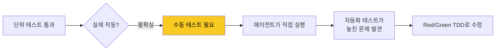

테스트가 통과한다고 코드가 의도대로 작동한다는 의미는 아닙니다:
- 서버 시작 시 크래시
- 중요한 UI 요소 표시 실패
- 테스트가 다루지 못한 세부 사항 누락

자동화된 테스트는 수동 테스트를 대체할 수 없습니다. 기능이 작동하는 것을 직접 눈으로 확인하고 싶습니다.

### 수동 테스트 메커니즘

**Python 라이브러리**:
```bash
python -c "... code ..."
```

**JSON API 웹 앱**:
```bash
# curl로 테스트
curl http://localhost:8000/api/endpoint
```

**"explore" 지시**:
```
Explore the API
```
→ 에이전트가 새 API의 다양한 측면을 시도

**웹 UI - 브라우저 자동화**:
```
Test that with Playwright
```

### 브라우저 자동화 도구

| 도구 | 설명 |
|------|------|
| **Playwright** | Microsoft 개발, 다중 언어 바인딩, 다중 브라우저 엔진 |
| **agent-browser** | Vercel의 Playwright CLI 래퍼, 코딩 에이전트 전용 |
| **Rodney** | Simon Willison의 프로젝트, Chrome DevTools Protocol 사용 |

### Rodney 예시 프롬프트

```
Run "uvx rodney --help" and use that tool to test your work - use this GIF for testing https://...
```

세 가지 트릭:
1. `uvx rodney --help` 실행 → 첫 호출 시 자동 설치
2. `--help` 출력이 에이전트에게 도구 이해와 사용법 제공
3. "look at screenshots" 힌트 → 비전 능력으로 페이지 시각적 평가

---

## 코드 이해하기: 선형 워크스루

### 인지 부채 (Cognitive Debt)

에이전트가 작성한 코드가 어떻게 작동하는지 잊어버리면 **인지 부채**를 떠안게 됩니다.

간단한 것들은 상관없지만, 핵심이 블랙박스가 되면:
- 새 기능 계획이 어려워짐
- 진행 속도가 느려짐 (기술 부채와 동일)

### 인지 부채 상환: 선형 워크스루

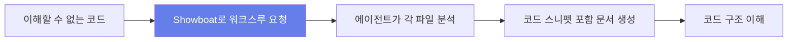

**예시 프롬프트**:
```
Use uvx showboat to write a linear walkthrough of how this code works to walkthrough.md - use sed or grep or cat or whatever you need to include snippets of code you are talking about
```

**Showboat의 핵심 명령**:
- `note`: Markdown 노트 추가
- `exec`: 명령 실행 + 명령과 출력 기록
- `image`: 이미지 추가 (스크린샷용)

**중요**: `sed`, `grep`, `cat` 등을 사용해 코드 스니펫을 포함하라고 지시하면, 에이전트가 수동으로 코드를 복사하지 않아 환각이나 실수 위험을 줄입니다.

---

## 코드 이해하기: 인터랙티브 설명

### 애니메이션으로 알고리즘 이해하기

때로는 선형 워크스루로도 충분하지 않습니다. 특히 복잡한 알고리즘의 경우.

**사례: 워드 클라우드 알고리즘**

Claude의 보고서: "아르키메데스 나선형 배치와 단어별 무작위 각도 오프셋을 사용하여 자연스러운 레이아웃 구현"

→ 이 설명은 도움이 되지 않았습니다!

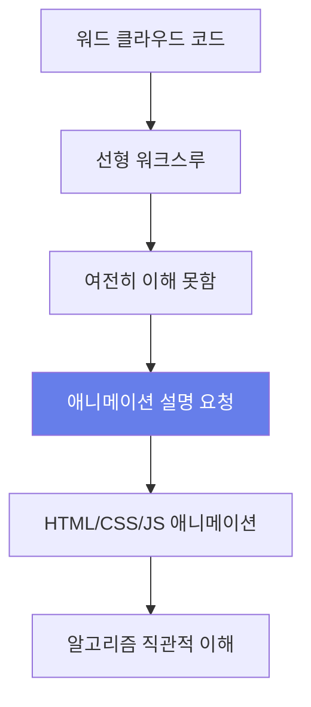

**애니메이션 설명 요청 프롬프트**:
```
Build an interactive HTML explanation of how the algorithm works, with an animated visualization
```

**결과**: 각 단어를 배치하기 위해 페이지 어딘가에 박스를 표시하고, 기존 단어와 교차하는지 확인. 교차하면 중심에서 나선형으로 바깥으로 이동하며 좋은 위치를 찾음.

**핵심**: 좋은 코딩 에이전트는 요청 시 설명용 애니메이션과 인터랙티브 인터페이스를 생성할 수 있습니다.

---

## 주석이 달린 프롬프트: 실전 사례

### GIF 최적화 도구 구축

Simon Willison은 블로그에 애니메이션 GIF 데모를 자주 포함합니다. 이 GIF들은 꽤 클 수 있습니다.

**Gifsicle**: Eddie Kohler의 GIF 최적화 도구. 변경되지 않은 프레임 영역을 식별하고 차이만 저장하여 압축.

**목표**: 웹 인터페이스로 다양한 설정을 시각적으로 미리보기

### 프롬프트 분석

```
gif-optimizer.html

Compile gifsicle to WASM, then build a web page that lets you open or drag-drop an animated GIF onto it and it then shows you that GIF compressed using gifsicle with a number of different settings, each preview with the size and a download button

Also include controls for the gifsicle options for manual use - each preview has a "tweak these settings" link which sets those manual settings to the ones used for that preview so the user can customize them further

Run "uvx rodney --help" and use that tool to test your work - use this GIF for testing https://...
```

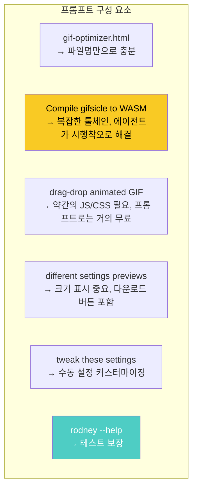

**핵심 포인트들**:

1. **파일명만으로 충분**: `ls`를 실행하면 모든 파일이 다른 도구임을 이해
2. **WASM 컴파일**: Emscripten 프로젝트가 필요한 복잡한 작업. 에이전트는 시행착오에 탁월
3. **드래그 앤 드롭**: 약간의 JS와 CSS가 필요하지만 프롬프트로는 거의 무료
4. **설정 미리보기**: 크기 표시가 핵심 (최적화가 목적이므로)
5. **테스트 도구**: Rodney의 `--help`가 에이전트에게 필요한 모든 것을 가르침

### 후속 프롬프트

```
Include the build script and diff against original gifsicle code in the commit in an appropriate subdirectory
The build script should clone the gifsicle repo to /tmp and switch to a known commit before applying the diff

You should include the wasm bundle

Make sure the HTML page credits gifsicle and links to the repo
```

---

## 부록: 자주 사용하는 프롬프트

### Artifacts (프로토타이핑)

Claude의 Artifacts 기능으로 작은 HTML 도구를 자주 만듭니다.

**문제**: 모델이 React를 좋아하지만, React는 빌드 단계가 필요해 정적 호스팅에 복사/붙여넣기가 어려움

**해결**: 프로젝트의 custom instructions에 추가:

```
When building artifacts, use vanilla HTML, CSS and JavaScript with no additional framework dependencies. Use Tailwind via CDN for styling. Avoid React, Vue or other frameworks that require a build step.
```

### 교정 (Proofreader)

LLM이 블로그 텍스트를 작성하는 것은 허용하지 않습니다. 의견을 표현하거나 "I" 대명사를 사용하는 것은 직접 작성해야 합니다.

**교정 프롬프트**:
```
Proofread the following text. Identify any spelling mistakes, grammatical errors or typos. Also identify sentences that could be clearer or better written, but note that I will manually decide whether to apply those suggestions or not.
```

### Alt Text (접근성)

이미지의 alt text 초안 작성을 위한 프롬프트:

```
Describe this image in detail, for use as the alt text attribute. Be succinct - try to keep it to a paragraph at most. Describe the contents of the image factually, without adding interpretation or emotion. If there is text in the image, transcribe it. Include the most relevant information first - the first sentence should be enough to serve as a shorter alt text if needed.
```

**참고**: Claude Opus가 alt text 취향이 매우 좋음. 차트에서 가장 흥미로운 숫자만 하이라이트하는 등 편집적 결정을 내리기도 함. 하지만 항상 올바른 것은 아니므로 직접 편집 필요.

---

## 핵심 요약

| 원칙 | 핵심 내용 |
|------|----------|
| **코드는 저렴함** | 작성은 무료, 좋은 코드는 여전히 비용 |
| **축적하라** | 작동하는 코드 예제를 수집하고 재조합 |
| **안티 패턴 회피** | 검토하지 않은 코드를 PR로 제출하지 말라 |
| **Red/Green TDD** | 테스트 먼저 작성, 실패 확인, 통과시키기 |
| **테스트 먼저 실행** | 새 세션에서 "First run the tests" |
| **수동 테스트** | 자동화 테스트만으로는 부족, 직접 확인 |
| **선형 워크스루** | Showboat로 코드 이해 문서화 |
| **인터랙티브 설명** | 복잡한 알고리즘은 애니메이션으로 |

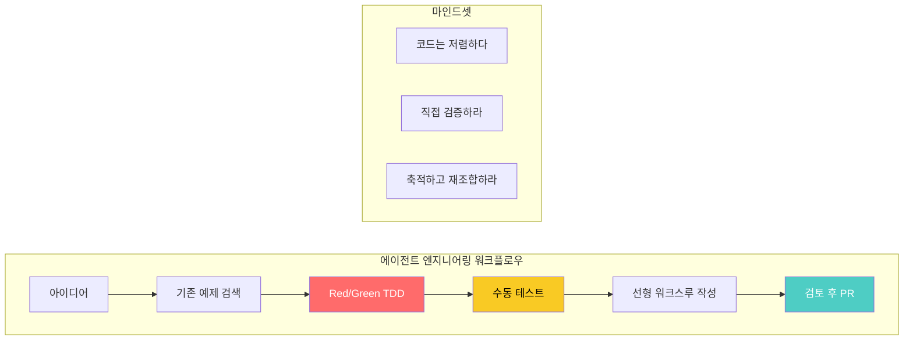

---

## 결론

Simon Willison의 Agentic Engineering Patterns은 코딩 에이전트 시대에 맞는 새로운 엔지니어링 습관을 제시합니다. 핵심은 **코드 작성 비용이 급락했지만 좋은 코드의 비용은 여전히 존재한다**는 사실을 받아들이는 것입니다.

가장 중요한 교훈들:

1. **습관을 재평가하라**: "시간 낭비"라고 본능적으로 거부하던 것들을 다시 시도해보라
2. **검증은 필수다**: 에이전트가 생성한 코드는 실행되기 전까지는 작동한다고 가정하지 말라
3. **축적이 힘이다**: 한 번 알아낸 트릭을 작동하는 코드와 함께 문서화하라
4. **테스트가 보호막이다**: Red/Green TDD와 수동 테스트를 결합하라
5. **이해를 문서화하라**: 선형 워크스루와 인터랙티브 설명으로 인지 부채를 상환하라

에이전트 엔지니어링의 모범 사례는 아직 업계 전반에 걸쳐 정립되고 있습니다. 우리가 할 수 있는 최선은 스스로를 되돌아보고, 새로운 가능성을 실험하는 것입니다.
