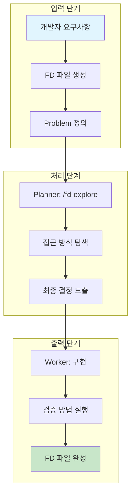
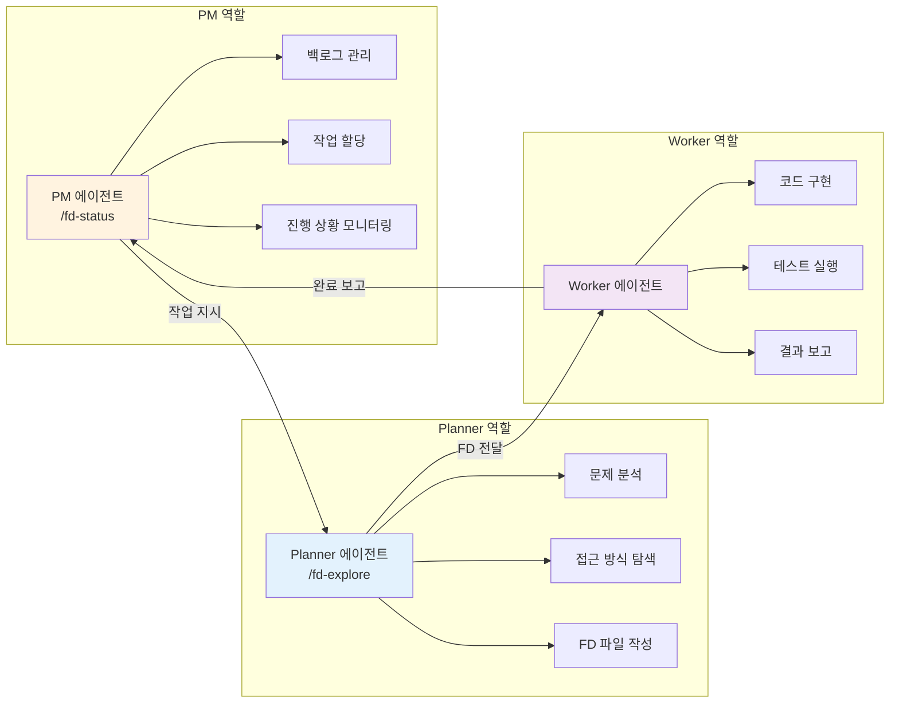
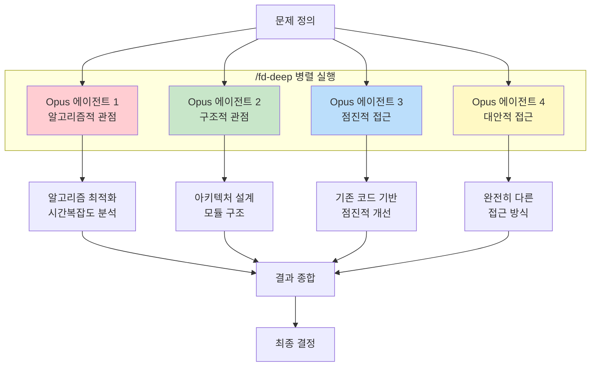
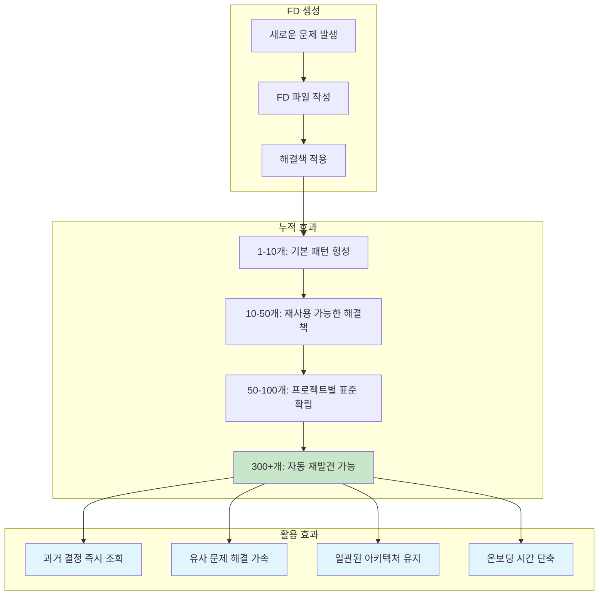
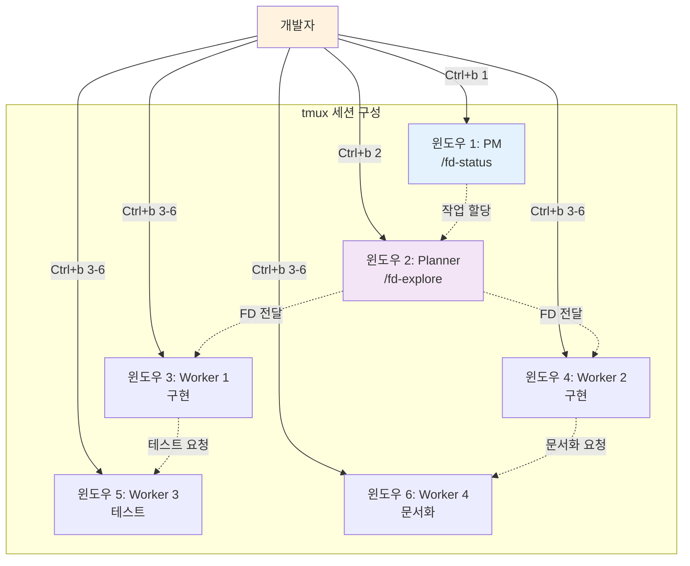
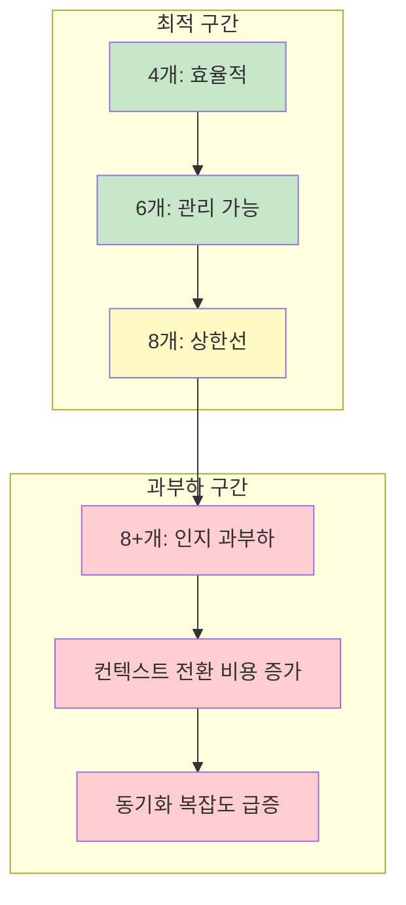

최근 AI 코딩 도구가 발전하면서 단일 에이전트 워크플로우를 넘어 여러 AI 에이전트를 병렬로 실행하는 방식이 주목받고 있습니다. Manuel Schipper가 공개한 **병렬 코딩 에이전트(Parallel Coding Agents)** 접근법은 tmux와 Feature Design(FD) 파일을 조합해 4-8개의 Claude Code 에이전트를 동시에 활용하는 독창적인 워크플로우입니다.

<!--more-->

## Sources

- [병렬 코딩 에이전트 - aisparkup.com](https://aisparkup.com/posts/9799)
- [GitHub Gist - \_\_fd-init.md\_\_](https://gist.github.com/manuelschipper/)

## 핵심 개념: 병렬 에이전트와 Feature Design

이 워크플로우의 핵심은 **Feature Design(FD) 파일**을 중심으로 한 구조화된 작업 방식입니다. 단순히 여러 에이전트를 실행하는 것이 아니라, 각 에이전트가 수행할 작업을 명확히 정의하고 그 결과를 체계적으로 기록하는 시스템입니다.

## Feature Design(FD) 파일 구조

FD 파일은 네 가지 핵심 섹션으로 구성됩니다:

| 섹션 | 설명 | 담당자 |
|------|------|--------|
| **Problem** | 해결해야 할 문제 정의 | Planner |
| **Approaches Reviewed** | 검토한 접근 방식들 | Planner |
| **Final Decision** | 선택한 최종 접근법 | Planner/PM |
| **Verification Method** | 검증 방법 | Worker |

이 구조는 대화가 끝나도 컨텍스트가 유지되는 **외부 메모리** 역할을 합니다. 새로운 대화를 시작할 때 FD 파일을 참조하면 이전 결정 사항을 즉시 파악할 수 있습니다.

## 역할 분리: PM, Planner, Worker

병렬 에이전트 환경에서는 명확한 역할 분리가 필수적입니다:

### PM (Product Manager) 역할

- **슬래시 커맨드**: `/fd-status`
- **주요 업무**: 백로그 관리, 작업 할당, 진행 상황 추적
- **tmux 윈도우**: 별도 윈도우에서 실행

### Planner 역할

- **슬래시 커맨드**: `/fd-explore`
- **주요 업무**: 문제 분석, 접근 방식 탐색, FD 파일 초안 작성
- **특징**: 여러 접근 방식을 비교 분석해 최적의 해결책 제시

### Worker 역할

- **주요 업무**: FD 파일에 따른 실제 코드 구현
- **검증**: 구현 완료 후 Verification Method 실행

## /fd-deep: 4개 Opus 에이전트 병렬 탐색

가장 강력한 기능 중 하나는 **`/fd-deep`** 커맨드입니다. 이 커맨드는 4개의 Claude Opus 에이전트를 병렬로 실행해 다각도에서 문제를 분석합니다:

### 각 에이전트의 분석 관점

1. **알고리즘적 관점**: 최적의 알고리즘, 시간/공간 복잡도 분석
2. **구조적 관점**: 아키텍처 설계, 모듈 구조, 확장성 고려
3. **점진적 접근**: 기존 코드를 기반으로 한 점진적 개선 방안
4. **대안적 접근**: 완전히 다른 관점에서의 해결책 모색

이 방식은 **OpenAI의 병렬 테스트 타임 컴퓨트(parallel test-time compute)** 개념에서 영감을 받았습니다. 하나의 에이전트가 긴 시간을 들여 분석하는 대신, 여러 에이전트가 동시에 다른 관점에서 접근해 더 빠르고 포괄적인 결과를 얻습니다.

## FD 파일의 장점: 의사결정 기록

Manuel Schipper는 이미 **300개 이상의 FD 파일**을 생성했다고 합니다. 이렇게 쌓인 FD 파일들은 다음과 같은 가치를 제공합니다:

### 의사결정 자동 재발견

300개 이상의 FD 파일이 쌓이면 흥미로운 현상이 발생합니다. 새로운 문제를 FD 파일로 정리할 때, **이전에 작성한 유사한 FD 파일들이 자동으로 참조**됩니다. 이를 통해:

- 과거에 내린 결정을 반복해서 내릴 필요 없음
- 이전에 검토한 접근 방식을 다시 검토할 필요 없음
- 프로젝트 전체에 일관된 아키텍처 패턴 유지

## tmux를 활용한 병렬 실행 환경

tmux는 여러 터미널 세션을 관리할 수 있는 도구로, 병렬 에이전트 실행에 이상적입니다:

### 권장 세션 구성

- **PM 윈도우**: 전체 진행 상황 모니터링
- **Planner 윈도우**: FD 파일 작성 및 탐색
- **Worker 윈도우들**: 4-8개의 구현 에이전트

개발자는 `Ctrl+b [번호]`로 윈도우 간 전환하며 각 에이전트의 작업을 감독합니다.

## 한계점과 주의사항

병렬 에이전트 접근법에도 명확한 한계가 있습니다:

### 에이전트 수 제한

**8개 이상의 에이전트**를 실행하면 인지 과부하(cognitive overload)가 발생합니다. 각 에이전트의 상태를 추적하고 컨텍스트를 전환하는 비용이 병렬 실행의 이점을 상쇄합니다.

### 의존적 작업의 순차 처리

모든 작업이 병렬로 처리될 수 있는 것은 아닙니다:

| 작업 유형 | 처리 방식 | 예시 |
|-----------|-----------|------|
| 독립적 작업 | 병렬 처리 | 여러 컴포넌트 동시 개발 |
| 의존적 작업 | 순차 처리 | API 설계 → 구현 → 테스트 |
| 부분 의존 | 하이브리드 | 공통 인터페이스 정의 후 병렬 구현 |

### 개발자 병목 현상

병렬 에이전트 환경에서는 **개발자가 병목**이 될 수 있습니다. 여러 에이전트가 동시에 결과를 보고하거나 결정을 요청하면, 개발자가 이를 처리하는 속도가 전체 진행 속도를 제한합니다.

### Claude Code 권한 시스템 이슈

Claude Code의 권한 시스템과 관련된 문제도 보고되었습니다. `--dangerously-skip-permissions` 플래그를 사용하면 권한 검사를 건너뛸 수 있지만, 이는 보안 위험을 수반합니다.

## 실제 적용 가이드

### 시작하기

1. **GitHub Gist**에서 `__fd-init.md__` 파일을 가져옵니다
2. 프로젝트에 FD 템플릿 구조를 설정합니다
3. tmux 세션을 생성하고 역할별 윈도우를 구성합니다
4. 첫 번째 FD 파일을 작성해 봅니다

### 권장 시작 규모

처음 시작할 때는 **2-3개의 에이전트**로 시작하는 것이 좋습니다:

- 1개 PM + 1개 Planner + 1개 Worker
- 워크플로우에 익숙해진 후 점진적으로 확장
- 최대 6-8개까지 증가 가능

## 핵심 요약

- **Feature Design(FD) 파일**은 Problem, Approaches Reviewed, Final Decision, Verification Method의 4단계 구조를 가진 의사결정 기록 문서입니다
- **역할 분리**(PM/Planner/Worker)를 통해 각 에이전트의 책임을 명확히 하고 효율적인 협업을 가능하게 합니다
- **`/fd-deep`** 커맨드는 4개의 Opus 에이전트를 병렬로 실행해 다각도에서 문제를 분석합니다
- **300개 이상의 FD 파일**이 쌓이면 과거 결정을 자동으로 재발견하고 유사 문제 해결을 가속화할 수 있습니다
- **8개 이상의 에이전트**는 인지 과부하를 유발하며, 의존적 작업은 순차 처리가 필요합니다
- **개발자가 병목**이 될 수 있으므로 적절한 에이전트 수와 작업 분배가 중요합니다

## 결론

tmux와 Feature Design 파일을 활용한 병렬 코딩 에이전트 접근법은 AI 코딩 도구의 활용 범위를 크게 확장합니다. 단일 에이전트의 순차적 작업에서 벗어나 여러 에이전트가 동시에 다른 관점에서 문제를 분석하고 해결하는 방식은 개발 생산성을 획기적으로 높일 수 있습니다.

다만, 이 방식이 만능은 아닙니다. 에이전트 수 제한, 의존적 작업의 순차 처리 필요성, 개발자 병목 현상 등의 한계를 이해하고 적절히 관리해야 합니다. 소규모로 시작해 워크플로우에 익숙해진 후 점진적으로 확장하는 전략이 권장됩니다.

FD 파일 시스템의 진정한 가치는 시간이 지나면서 드러납니다. 충분한 FD 파일이 쌓이면 과거의 의사결정이 현재의 문제 해결을 가속화하고, 프로젝트 전체에 일관된 아키텍처 패턴을 유지하는 데 도움이 됩니다.
