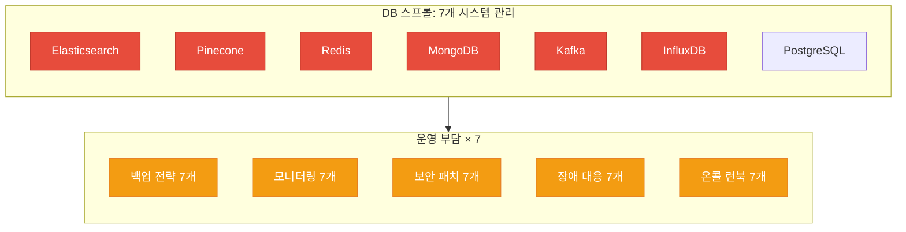
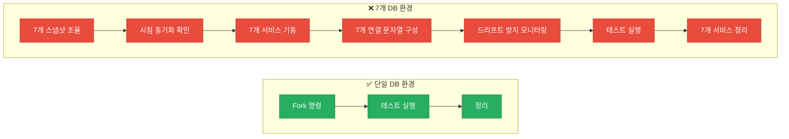
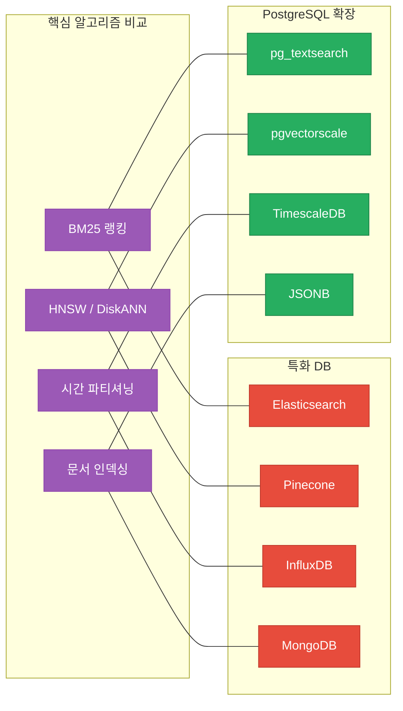
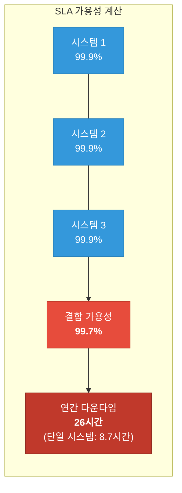
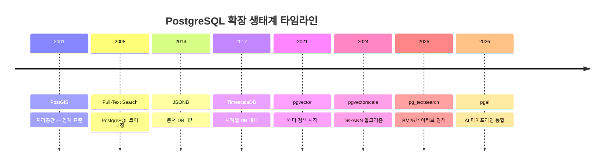
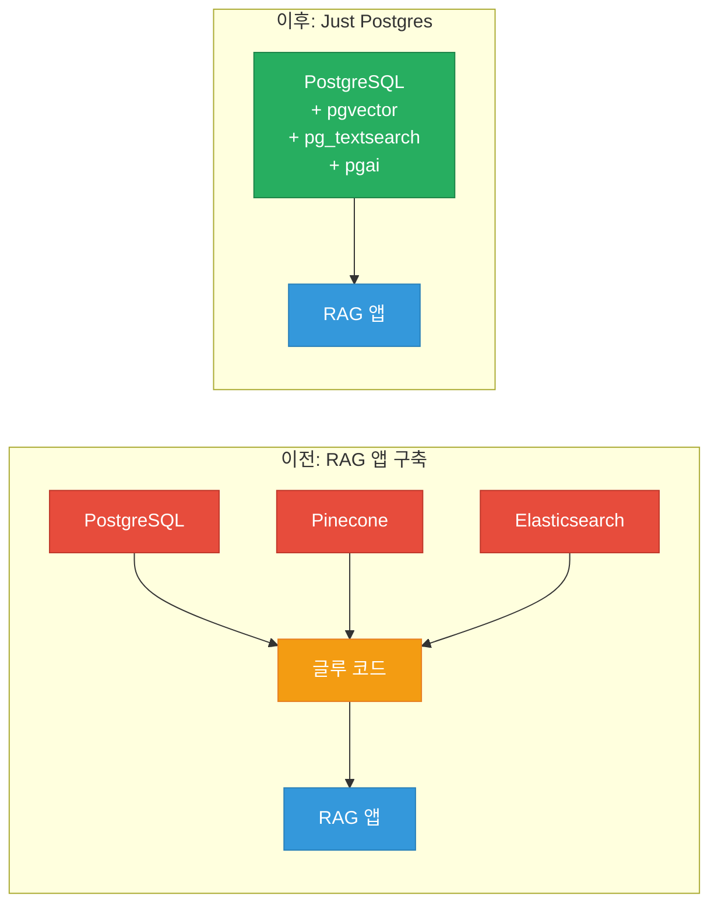
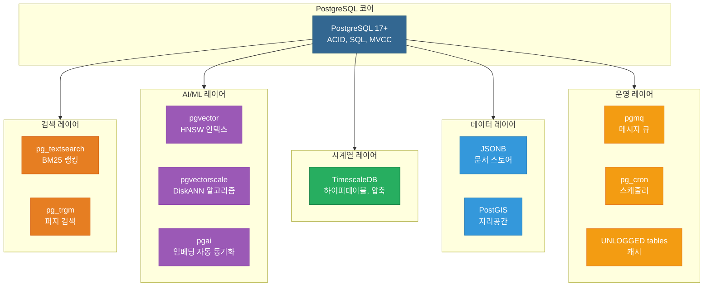

검색에는 Elasticsearch, 벡터에는 Pinecone, 캐시에는 Redis, 문서에는 MongoDB, 큐에는 Kafka, 시계열에는 InfluxDB — 그리고 나머지는 PostgreSQL. 축하합니다. 이제 관리해야 할 데이터베이스가 7개입니다. 7개의 쿼리 언어, 7개의 백업 전략, 7개의 보안 모델, 7개의 모니터링 대시보드. 새벽 3시에 뭔가 터지면? 디버깅을 위한 테스트 환경 구축부터 악몽입니다.

**다른 방법이 있습니다. 그냥 Postgres를 쓰세요.**

<!--more-->

## Sources

- [It's 2026, Just Use Postgres — Tiger Data (Raja Rao DV, 2026.02.02)](https://www.tigerdata.com/blog/its-2026-just-use-postgres) (http 추출)

---

## 집이라는 비유 — 왜 하나의 DB로 충분한가

원문은 데이터베이스를 **집** 에 비유합니다. 거실, 침실, 욕실, 주방, 차고 — 각 방은 다른 용도로 쓰이지만 모두 하나의 지붕 아래 복도와 문으로 연결되어 있습니다. 요리를 한다고 별도의 레스토랑 건물을 짓지 않고, 차를 세운다고 시내 반대편에 상업용 차고를 만들지 않습니다.

**PostgreSQL이 바로 그런 집입니다.** 검색, 벡터, 시계열, 큐 — 모두 하나의 지붕 아래 있습니다.


그런데 이것은 특화 데이터베이스 벤더들이 듣고 싶지 않은 이야기입니다. 그들의 마케팅 팀은 수년간 **"적합한 도구를 적합한 작업에 사용하라"** 는 메시지를 전파해왔습니다. 합리적으로 들리고, 현명하게 들리며, 데이터베이스를 많이 팔아줍니다.

---

## "적합한 도구" 함정

**"적합한 도구를 적합한 작업에 사용하라"** — 현명하게 들리는 이 조언의 결과를 봅시다.

| # | 용도 | 선택한 DB |
|---|------|----------|
| 1 | 검색 | Elasticsearch |
| 2 | 벡터 | Pinecone |
| 3 | 캐시 | Redis |
| 4 | 문서 | MongoDB |
| 5 | 큐 | Kafka |
| 6 | 시계열 | InfluxDB |
| 7 | 나머지 | PostgreSQL |

7개의 데이터베이스. 7개의 쿼리 언어. 7개의 백업 전략. 7개의 보안 감사 대상. 7개의 모니터링 대시보드. **새벽 3시에 장애가 발생하면?** 디버깅을 위한 테스트 환경 하나 띄우는 것도 쉽지 않습니다.



---

## AI 에이전트 시대에 이것이 중요한 이유

이것은 단순히 단순성의 문제가 아닙니다. **AI 에이전트가 데이터베이스 스프롤을 악몽으로 만들었습니다.**

AI 에이전트가 해야 하는 일을 생각해 봅시다:

1. 프로덕션 데이터로 테스트 데이터베이스를 빠르게 생성
2. 수정을 시도하거나 실험 수행
3. 작동 여부 확인
4. 환경 정리

**데이터베이스가 하나라면?** 단일 명령어로 끝납니다. Fork하고, 테스트하고, 완료.

**데이터베이스가 7개라면?** 이런 과정이 필요합니다:

- Postgres, Elasticsearch, Pinecone, Redis, MongoDB, Kafka 전체의 스냅샷 조율
- 모두 동일한 시점인지 확인
- 7개의 서로 다른 서비스 기동
- 7개의 서로 다른 연결 문자열 구성
- 테스트 중 아무것도 드리프트하지 않길 기도
- 완료 후 7개 서비스 정리



이것은 막대한 R&D 없이는 사실상 불가능합니다. AI 시대에 **단순성은 우아함이 아니라 필수** 입니다.

---

## "특화 데이터베이스가 더 좋지 않나?"에 대한 반론

### 신화 vs 현실

**신화**: 특화 데이터베이스는 특정 작업에서 훨씬 뛰어나다.

**현실**: 때때로 좁은 작업에서 약간 더 나을 수 있습니다. 하지만 불필요한 복잡성도 함께 가져옵니다. 매 끼니마다 전용 셰프를 고용하는 것과 같습니다 — 호화로워 보이지만 비용, 조율 오버헤드, 이전에 없던 문제를 만들어냅니다.

**핵심 사실**: 99%의 회사는 특화 데이터베이스가 필요하지 않습니다. 상위 1%는 수천만 사용자와 그에 맞는 대규모 엔지니어링 팀을 보유하고 있습니다. 그들의 블로그 포스트를 읽고 감탄했겠지만, 그것은 그들의 규모, 그들의 팀, 그들의 문제입니다.

### 동일한 알고리즘, 동일한 성능

대부분의 사람들이 모르는 사실이 있습니다. **PostgreSQL 확장은 특화 데이터베이스와 동일하거나 더 나은 알고리즘을 사용합니다.**

| 필요 기능 | 특화 도구 | PostgreSQL 확장 | 동일 알고리즘? |
|----------|---------|---------------|-------------|
| 전문 검색 | Elasticsearch | pg_textsearch | ✅ 모두 BM25 사용 |
| 벡터 검색 | Pinecone | pgvector + pgvectorscale | ✅ 모두 HNSW/DiskANN 사용 |
| 시계열 | InfluxDB | TimescaleDB | ✅ 모두 시간 파티셔닝 사용 |
| 캐싱 | Redis | UNLOGGED tables | ✅ 모두 인메모리 스토리지 사용 |
| 문서 | MongoDB | JSONB | ✅ 모두 문서 인덱싱 사용 |
| 지리공간 | 특화 GIS | PostGIS | ✅ 2001년부터 업계 표준 |

이것들은 희석된 버전이 아닙니다. **동일하거나 더 나은 알고리즘** 이며, 실전에서 검증되고, 오픈 소스이며, 종종 동일한 연구자들이 개발했습니다.



### 벤치마크가 이를 뒷받침합니다

- **pgvectorscale**: Pinecone 대비 **28배 낮은 p95 레이턴시**, 75% 낮은 비용 (99% recall 기준)
- **TimescaleDB**: InfluxDB와 동등하거나 능가하면서 완전한 SQL 지원
- **pg_textsearch**: Elasticsearch를 구동하는 것과 **정확히 동일한 BM25 랭킹** 알고리즘

---

## 숨겨진 비용의 복리 효과

AI/에이전트 문제를 넘어서, 데이터베이스 스프롤은 복리적으로 비용이 증가합니다.

| 작업 | DB 1개 | DB 7개 |
|------|--------|--------|
| 백업 전략 | 1 | 7 |
| 모니터링 대시보드 | 1 | 7 |
| 보안 패치 | 1 | 7 |
| 온콜 런북 | 1 | 7 |
| 장애 복구 테스트 | 1 | 7 |

### 인지 부하

팀이 알아야 할 것: SQL, Redis 명령어, Elasticsearch Query DSL, MongoDB 집계, Kafka 패턴, InfluxDB의 비네이티브 SQL 우회. 이것은 전문화가 아닙니다. **파편화** 입니다.

### 데이터 일관성

Elasticsearch를 Postgres와 동기화 상태로 유지하는 것을 생각해 봅시다. 동기화 작업을 만듭니다. 실패합니다. 데이터가 드리프트합니다. 조정 작업을 추가합니다. 그것도 실패합니다. 이제 기능을 만드는 대신 인프라를 유지보수하고 있습니다.

### SLA 수학



세 시스템이 각각 99.9% 가용성일 때 결합 가용성은 **99.7%** 입니다. 연간 8.7시간이 아니라 **26시간의 다운타임** 입니다. 모든 시스템이 장애 모드를 곱합니다.

---

## 현대 PostgreSQL 스택

이 확장들은 새로운 것이 아닙니다. 수년간 프로덕션에서 검증되었습니다.

| 확장 | 출시 연도 | 역사 | 주요 사용 사례 |
|------|---------|------|-------------|
| **PostGIS** | 2001년 | 24년 | OpenStreetMap, Uber |
| **전문 검색** | 2008년 | 17년 | PostgreSQL 코어 내장 |
| **JSONB** | 2014년 | 11년 | MongoDB급 성능 + ACID |
| **TimescaleDB** | 2017년 | 8년 | GitHub 21K+ 스타 |
| **pgvector** | 2021년 | 4년 | GitHub 19K+ 스타 |

48,000개 이상의 기업이 PostgreSQL을 사용하고 있으며, Netflix, Spotify, Uber, Reddit, Instagram, Discord가 포함됩니다.



### AI 시대의 새로운 확장들

| 확장 | 대체 대상 | 하이라이트 |
|------|---------|----------|
| **pgvectorscale** | Pinecone, Qdrant | Microsoft Research의 DiskANN 알고리즘. 28배 낮은 레이턴시, 75% 낮은 비용 |
| **pg_textsearch** | Elasticsearch | PostgreSQL 네이티브 BM25 랭킹 |
| **pgai** | 외부 AI 파이프라인 | 데이터 변경 시 임베딩 자동 동기화 |

**의미**: RAG 앱을 만들기 위해 Postgres + Pinecone + Elasticsearch + 글루 코드가 필요했던 시대는 끝났습니다.

이제는 **Just Postgres** 입니다. 하나의 데이터베이스. 하나의 쿼리 언어. 하나의 백업. AI 에이전트가 테스트 환경을 띄우기 위한 하나의 fork 명령어.



---

## 퀵 스타트: 확장 추가하기

필요한 모든 확장을 한 번에 추가할 수 있습니다:

```sql
-- BM25 전문 검색
CREATE EXTENSION pg_textsearch;

-- AI용 벡터 검색
CREATE EXTENSION vector;
CREATE EXTENSION vectorscale;

-- AI 임베딩 & RAG 워크플로
CREATE EXTENSION ai;

-- 시계열
CREATE EXTENSION timescaledb;

-- 메시지 큐
CREATE EXTENSION pgmq;

-- 스케줄 작업
CREATE EXTENSION pg_cron;

-- 지리공간
CREATE EXTENSION postgis;
```

이것으로 끝입니다. 7개의 별도 데이터베이스 대신 8줄의 SQL.

---

## 실전 코드: 용도별 구현

### 1. 전문 검색 (Elasticsearch 대체)

**확장**: pg_textsearch (진정한 BM25 랭킹)

**대체 대상**:
- **Elasticsearch**: 별도 JVM 클러스터, 복잡한 매핑, 동기화 파이프라인, Java 힙 튜닝
- **Solr**: 같은 문제, 다른 래퍼
- **Algolia**: 1,000건 검색당 과금, 외부 API 의존성

**얻는 것**: Elasticsearch를 구동하는 것과 **정확히 동일한 BM25 알고리즘** 을 PostgreSQL 안에서 직접 사용.

```sql
-- 테이블 생성
CREATE TABLE articles (
  id SERIAL PRIMARY KEY,
  title TEXT,
  content TEXT
);

-- BM25 인덱스 생성
CREATE INDEX idx_articles_bm25 ON articles USING bm25(content)
  WITH (text_config = 'english');

-- BM25 스코어링으로 검색
SELECT title, -(content <@> 'database optimization') as score
FROM articles
ORDER BY content <@> 'database optimization'
LIMIT 10;
```

### 2. 벡터 검색 (Pinecone 대체)

**확장**: pgvector + pgvectorscale

**대체 대상**:
- **Pinecone**: 월 최소 $70, 별도 인프라, 데이터 동기화 문제
- **Qdrant, Milvus, Weaviate**: 추가 인프라 관리

**얻는 것**: pgvectorscale은 Microsoft Research의 **DiskANN 알고리즘** 을 사용하여 99% recall 기준으로 Pinecone 대비 **28배 낮은 p95 레이턴시** 와 **16배 높은 처리량** 을 달성합니다.

```sql
-- 확장 활성화
CREATE EXTENSION vector;
CREATE EXTENSION vectorscale CASCADE;

-- 임베딩 포함 테이블
CREATE TABLE documents (
  id SERIAL PRIMARY KEY,
  content TEXT,
  embedding vector(1536)
);

-- 고성능 인덱스 (DiskANN)
CREATE INDEX idx_docs_embedding ON documents USING diskann(embedding);

-- 유사 문서 검색
SELECT content, embedding <=> '[0.1, 0.2, ...]'::vector as distance
FROM documents
ORDER BY embedding <=> '[0.1, 0.2, ...]'::vector
LIMIT 10;
```

**pgai로 임베딩 자동 동기화**:

```sql
SELECT ai.create_vectorizer(
  'documents'::regclass,
  loading => ai.loading_column(column_name=>'content'),
  embedding => ai.embedding_openai(
    model=>'text-embedding-3-small',
    dimensions=>'1536'
  )
);
```

이제 모든 INSERT/UPDATE가 자동으로 임베딩을 재생성합니다. 동기화 작업 없음. 드리프트 없음. 새벽 3시 페이지 없음.

### 3. 하이브리드 검색 (BM25 + 벡터)

AI 애플리케이션에서는 키워드 검색과 시맨틱 검색 **모두** 필요한 경우가 많습니다:

```sql
-- Reciprocal Rank Fusion: 키워드 + 시맨틱 검색 결합
WITH bm25 AS (
  SELECT id, ROW_NUMBER() OVER (
    ORDER BY content <@> $1
  ) as rank
  FROM documents LIMIT 20
),
vectors AS (
  SELECT id, ROW_NUMBER() OVER (
    ORDER BY embedding <=> $2
  ) as rank
  FROM documents LIMIT 20
)
SELECT d.*,
  1.0/(60 + COALESCE(b.rank, 1000)) +
  1.0/(60 + COALESCE(v.rank, 1000)) as score
FROM documents d
LEFT JOIN bm25 b ON d.id = b.id
LEFT JOIN vectors v ON d.id = v.id
WHERE b.id IS NOT NULL OR v.id IS NOT NULL
ORDER BY score DESC LIMIT 10;
```

Elasticsearch + Pinecone로 이것을 시도해 보세요. 두 개의 API 호출, 결과 병합, 실패 처리, 이중 레이턴시가 필요합니다.

PostgreSQL에서는: **하나의 쿼리, 하나의 트랜잭션, 하나의 결과** 입니다.

### 4. 시계열 (InfluxDB 대체)

**확장**: TimescaleDB (GitHub 21K+ 스타)

**대체 대상**:
- **InfluxDB**: 별도 데이터베이스, Flux 쿼리 언어 또는 비네이티브 SQL
- **Prometheus**: 메트릭에 좋지만 애플리케이션 데이터가 아님

**얻는 것**: 자동 시간 파티셔닝, 최대 90% 압축, 연속 집계. 완전한 SQL.

```sql
-- TimescaleDB 활성화
CREATE EXTENSION timescaledb;

-- 테이블 생성
CREATE TABLE metrics (
  time TIMESTAMPTZ NOT NULL,
  device_id TEXT,
  temperature DOUBLE PRECISION
);

-- 하이퍼테이블로 변환
SELECT create_hypertable('metrics', 'time');

-- 시간 버킷으로 쿼리
SELECT time_bucket('1 hour', time) as hour,
       AVG(temperature)
FROM metrics
WHERE time > NOW() - INTERVAL '24 hours'
GROUP BY hour;

-- 오래된 데이터 자동 삭제
SELECT add_retention_policy('metrics', INTERVAL '30 days');

-- 압축 (90% 스토리지 감소)
ALTER TABLE metrics SET (timescaledb.compress);
SELECT add_compression_policy('metrics', INTERVAL '7 days');
```

### 5. 캐싱 (Redis 대체)

**기능**: UNLOGGED 테이블 + JSONB

```sql
-- UNLOGGED = WAL 오버헤드 없음, 더 빠른 쓰기
CREATE UNLOGGED TABLE cache (
  key TEXT PRIMARY KEY,
  value JSONB,
  expires_at TIMESTAMPTZ
);

-- 만료 시간 포함 설정
INSERT INTO cache (key, value, expires_at)
VALUES ('user:123', '{"name": "Alice"}',
        NOW() + INTERVAL '1 hour')
ON CONFLICT (key) DO UPDATE
SET value = EXCLUDED.value;

-- 조회
SELECT value FROM cache
WHERE key = 'user:123' AND expires_at > NOW();

-- 정리 (pg_cron으로 스케줄)
DELETE FROM cache WHERE expires_at < NOW();
```

### 6. 메시지 큐 (Kafka 대체)

**확장**: pgmq

```sql
CREATE EXTENSION pgmq;
SELECT pgmq.create('my_queue');

-- 전송
SELECT pgmq.send('my_queue',
  '{"event": "signup", "user_id": 123}');

-- 수신 (visibility timeout 포함)
SELECT * FROM pgmq.read('my_queue', 30, 5);

-- 처리 후 삭제
SELECT pgmq.delete('my_queue', msg_id);
```

**또는 네이티브 SKIP LOCKED 패턴**:

```sql
CREATE TABLE jobs (
  id SERIAL PRIMARY KEY,
  payload JSONB,
  status TEXT DEFAULT 'pending'
);

-- 워커가 원자적으로 작업 획득
UPDATE jobs SET status = 'processing'
WHERE id = (
  SELECT id FROM jobs WHERE status = 'pending'
  FOR UPDATE SKIP LOCKED LIMIT 1
) RETURNING *;
```

### 7. 문서 (MongoDB 대체)

**기능**: 네이티브 JSONB

```sql
CREATE TABLE users (
  id SERIAL PRIMARY KEY,
  data JSONB
);

-- 중첩 문서 삽입
INSERT INTO users (data) VALUES ('{
  "name": "Alice",
  "profile": {
    "bio": "Developer",
    "links": ["github.com/alice"]
  }
}');

-- 중첩 필드 쿼리
SELECT data->>'name', data->'profile'->>'bio'
FROM users
WHERE data->'profile'->>'bio' LIKE '%Developer%';

-- JSON 필드 인덱스
CREATE INDEX idx_users_email ON users ((data->>'email'));
```

### 8. 지리공간 (전문 GIS 대체)

**확장**: PostGIS

```sql
CREATE EXTENSION postgis;

CREATE TABLE stores (
  id SERIAL PRIMARY KEY,
  name TEXT,
  location GEOGRAPHY(POINT, 4326)
);

-- 5km 이내 매장 검색
SELECT name,
  ST_Distance(
    location,
    ST_MakePoint(-122.4, 37.78)::geography
  ) as meters
FROM stores
WHERE ST_DWithin(
  location,
  ST_MakePoint(-122.4, 37.78)::geography,
  5000
);
```

### 9. 퍼지 검색 (오타 허용)

**확장**: pg_trgm (PostgreSQL 내장)

```sql
CREATE EXTENSION pg_trgm;

CREATE INDEX idx_name_trgm ON products
  USING GIN (name gin_trgm_ops);

-- 오타가 있어도 "PostgreSQL" 검색
SELECT name FROM products
WHERE name % 'posgresql'
ORDER BY similarity(name, 'posgresql') DESC;
```

### 10. 그래프 순회 (그래프 DB 대체)

**기능**: 재귀 CTE

```sql
-- 관리자 아래 모든 보고 체계 검색 (조직도)
WITH RECURSIVE org_tree AS (
  SELECT id, name, manager_id, 1 as depth
  FROM employees WHERE id = 42

  UNION ALL

  SELECT e.id, e.name, e.manager_id, t.depth + 1
  FROM employees e
  JOIN org_tree t ON e.manager_id = t.id
  WHERE t.depth < 10
)
SELECT * FROM org_tree;
```

### 11. 스케줄 작업 (Cron 대체)

**확장**: pg_cron

```sql
CREATE EXTENSION pg_cron;

-- 매 시간 실행
SELECT cron.schedule('cleanup', '0 * * * *',
  $$DELETE FROM cache WHERE expires_at < NOW()$$);

-- 야간 롤업
SELECT cron.schedule('rollup', '0 2 * * *',
  $$REFRESH MATERIALIZED VIEW CONCURRENTLY daily_stats$$);
```

---

## PostgreSQL 확장 아키텍처 전체 맵



---

## 핵심 요약

1. **"적합한 도구" 함정**: 특화 DB 벤더의 마케팅 메시지일 뿐, 99%의 회사에는 PostgreSQL이면 충분합니다
2. **동일한 알고리즘**: pg_textsearch는 Elasticsearch와 동일한 BM25, pgvectorscale은 DiskANN, TimescaleDB는 시간 파티셔닝 — 희석된 버전이 아닌 동일하거나 더 나은 구현입니다
3. **벤치마크 증거**: pgvectorscale은 Pinecone 대비 28배 낮은 p95 레이턴시에 75% 낮은 비용을 달성합니다
4. **AI 에이전트 시대의 필수**: 단일 DB는 fork → test → teardown이 한 명령어지만, 7개 DB는 조율 자체가 불가능에 가깝습니다
5. **복리적 운영 비용**: 백업, 모니터링, 보안, 온콜이 DB 수만큼 곱해지고, SLA는 시스템 수만큼 낮아집니다 (3개 시스템 99.9% → 결합 99.7%, 연간 26시간 다운타임)
6. **검증된 생태계**: PostGIS(24년), 전문 검색(17년), JSONB(11년), TimescaleDB(8년) — 48,000+ 기업이 사용 중

---

## 결론

99%의 회사에게 PostgreSQL은 필요한 모든 것을 처리합니다. 나머지 1%는 수백 개 노드에서 페타바이트 로그를 처리하거나, Kibana의 특정 대시보드가 필요하거나, PostgreSQL이 실제로 감당할 수 없는 이국적 요구사항이 있는 경우입니다.

하지만 핵심은 이것입니다: **1%에 해당한다면 스스로 알 수 있습니다.** 벤더의 마케팅 팀이 알려줄 필요가 없습니다. 직접 벤치마크를 돌리고 실제 벽에 부딪혀 봤을 것입니다.

그때까지는 누군가 "적합한 도구를 적합한 작업에 사용하라"고 했다는 이유로 데이터를 7개 건물에 흩뿌리지 마세요. 그 조언은 데이터베이스를 팔아줄 뿐, 여러분에게 도움이 되지 않습니다.

PostgreSQL로 시작하세요. PostgreSQL과 함께하세요. 복잡성은 그 필요를 직접 입증했을 때만 추가하세요.

**2026년, 그냥 Postgres를 쓰세요.**
