8억 명의 ChatGPT 사용자, 지난 1년간 10배 성장한 트래픽, 수백만 QPS — OpenAI는 이 모든 것을 **단일 Primary PostgreSQL** 인스턴스와 약 50개의 읽기 복제본으로 처리하고 있습니다. 샤딩 없이 이 규모를 달성한 비결은 무엇일까요? OpenAI 엔지니어 Bohan Zhang이 공유한 실전 전략을 분석합니다.

<!--more-->

## Sources

- [Scaling PostgreSQL to power 800 million ChatGPT users — OpenAI (2026.01.22)](https://openai.com/index/scaling-postgresql/)
- [The Part of PostgreSQL We Hate the Most — Andy Pavlo, CMU](https://www.cs.cmu.edu/~pavlo/blog/2023/04/the-part-of-postgresql-we-hate-the-most.html)
- [Cascading Replication — PostgreSQL 공식 문서](https://www.postgresql.org/docs/current/warm-standby.html#CASCADING-REPLICATION)
- [Azure Database for PostgreSQL Flexible Server — Microsoft Learn](https://learn.microsoft.com/en-us/azure/postgresql/flexible-server/overview)

## 전체 아키텍처 개요

OpenAI의 PostgreSQL 아키텍처를 한눈에 살펴보겠습니다.

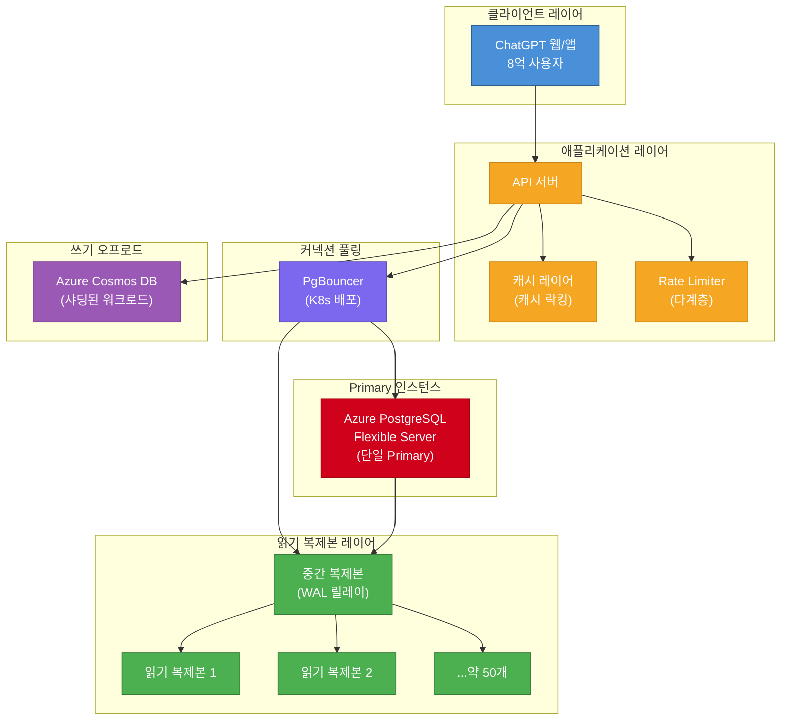

핵심은 **쓰기를 최소화하고, 읽기를 극대화하며, 장애에 선제적으로 대응하는** 다계층 전략입니다. 이제 각 전략을 하나씩 파헤쳐 보겠습니다.

## 초기 설계의 한계: MVCC의 양날의 검

### MVCC가 만드는 문제들

PostgreSQL의 MVCC(Multi-Version Concurrency Control) 는 동시성을 보장하는 핵심 메커니즘이지만, 대규모 환경에서는 심각한 부작용을 낳습니다.

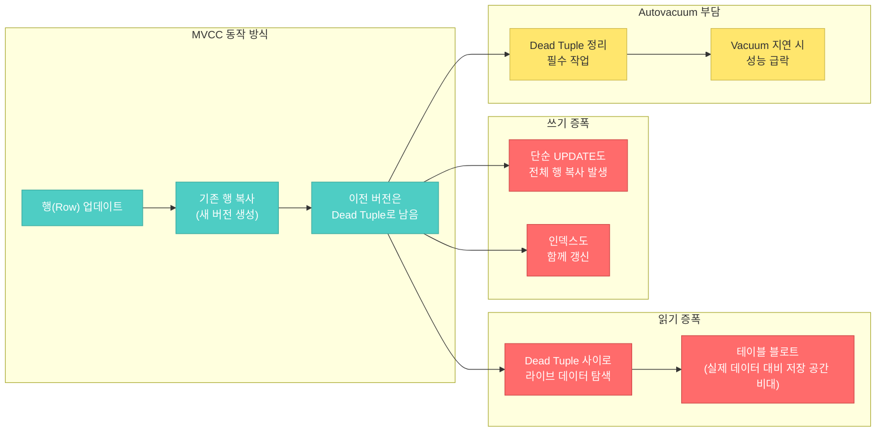

CMU의 Andy Pavlo 교수가 "[The Part of PostgreSQL We Hate the Most](https://www.cs.cmu.edu/~pavlo/blog/2023/04/the-part-of-postgresql-we-hate-the-most.html)"에서 지적한 것처럼, PostgreSQL의 MVCC 구현은 **쓰기 증폭**(Write Amplification) 과 **읽기 증폭**(Read Amplification) 을 동시에 유발합니다.

- **쓰기 증폭**: 단 하나의 컬럼만 변경해도 전체 행이 복사되고, 관련된 모든 인덱스도 새 행 위치를 반영하여 갱신됩니다.
- **읽기 증폭**: 축적된 Dead Tuple 사이에서 라이브 데이터를 찾아야 하므로, 시간이 지남에 따라 읽기 성능이 저하됩니다.
- **테이블 블로트**: Dead Tuple이 쌓이면 디스크 사용량이 실제 라이브 데이터 대비 훨씬 커지며, Autovacuum이 이를 제때 정리하지 못하면 악순환에 빠집니다.

### 악순환 사이클: 캐시 미스에서 전면 장애까지

MVCC 문제가 최악의 시나리오로 전개되는 과정을 살펴보겠습니다.

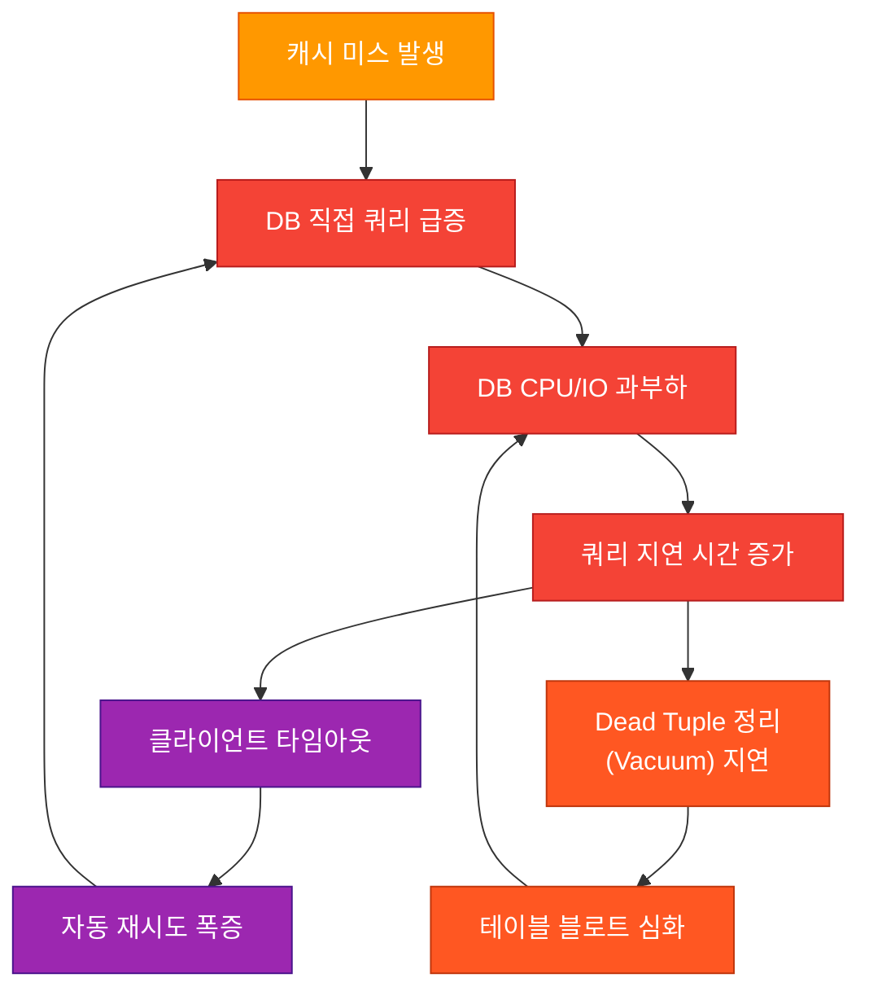

이 악순환은 OpenAI가 실제로 경험한 패턴입니다. 캐시가 무효화되는 순간 DB에 직접 쿼리가 몰리고, 이미 Dead Tuple로 비대해진 테이블에서 쿼리가 느려지면 타임아웃이 발생하고, 타임아웃된 요청은 재시도를 유발하여 부하를 더욱 가중시킵니다. 이 사이클을 끊기 위해 OpenAI는 아래의 다각적 전략을 도입했습니다.

## Primary 부하 최소화: 쓰기 오프로드 전략

### 샤딩 가능한 워크로드를 Cosmos DB로 이전

OpenAI가 선택한 첫 번째 전략은 **쓰기 부하가 높은 워크로드를 PostgreSQL 밖으로 빼내는 것** 입니다.

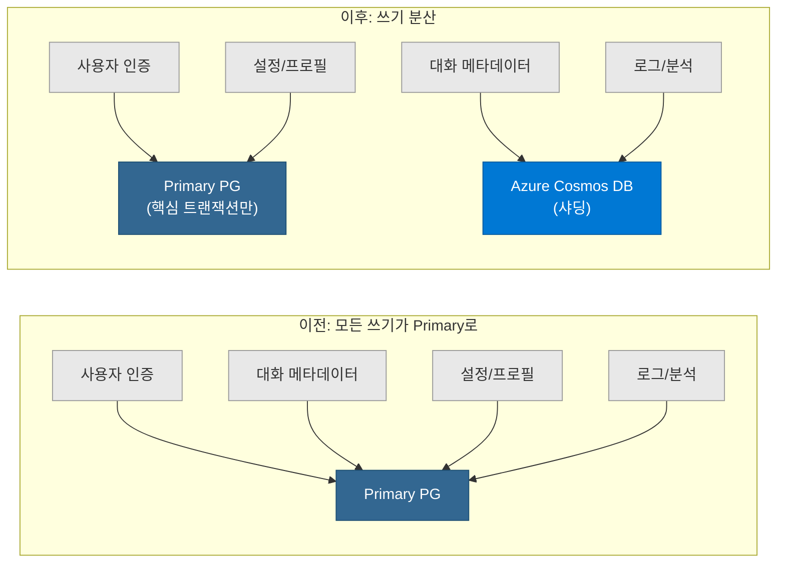

대화 메타데이터처럼 **샤딩이 용이하고 쓰기 비중이 높은** 워크로드는 Azure Cosmos DB로 이전했습니다. Cosmos DB는 파티션 키 기반의 수평 확장을 네이티브로 지원하므로, PostgreSQL 측의 MVCC 부담을 크게 줄일 수 있습니다.

### "새 테이블은 PostgreSQL에 만들지 않는다"

OpenAI는 한 단계 더 나아가 **신규 워크로드를 PostgreSQL에 추가하지 않는 정책** 을 세웠습니다. 새로운 기능을 개발할 때는 처음부터 샤딩 가능한 시스템을 기본 저장소로 선택합니다. 이렇게 하면 Primary의 부하가 시간이 지나도 자연적으로 증가하지 않습니다.

### 왜 PostgreSQL 자체를 샤딩하지 않았나?

PostgreSQL을 샤딩하는 것은 기술적으로 가능합니다. Citus 같은 확장을 사용하면 분산 테이블과 스키마 기반 샤딩도 가능합니다. 하지만 OpenAI가 이를 선택하지 않은 이유는 **엔지니어링 비용** 입니다.

- 수백 개의 API 엔드포인트에서 사용하는 쿼리를 모두 수정해야 합니다
- 트랜잭션 경계와 조인 로직을 재설계해야 합니다
- 마이그레이션에 수개월에서 수년이 소요될 수 있습니다
- 그 시간 동안 다른 전략으로 충분히 스케일링이 가능했습니다

결과적으로 OpenAI는 "PostgreSQL은 읽기 중심으로 유지하고, 쓰기가 많은 것은 밖으로 빼낸다"는 실용적 접근을 택했습니다.

## 커넥션 풀링: PgBouncer로 연결 병목 해소

대규모 환경에서 데이터베이스 커넥션은 가장 먼저 소진되는 자원 중 하나입니다. OpenAI는 **PgBouncer를 Kubernetes에 배포** 하여 이 문제를 해결했습니다.

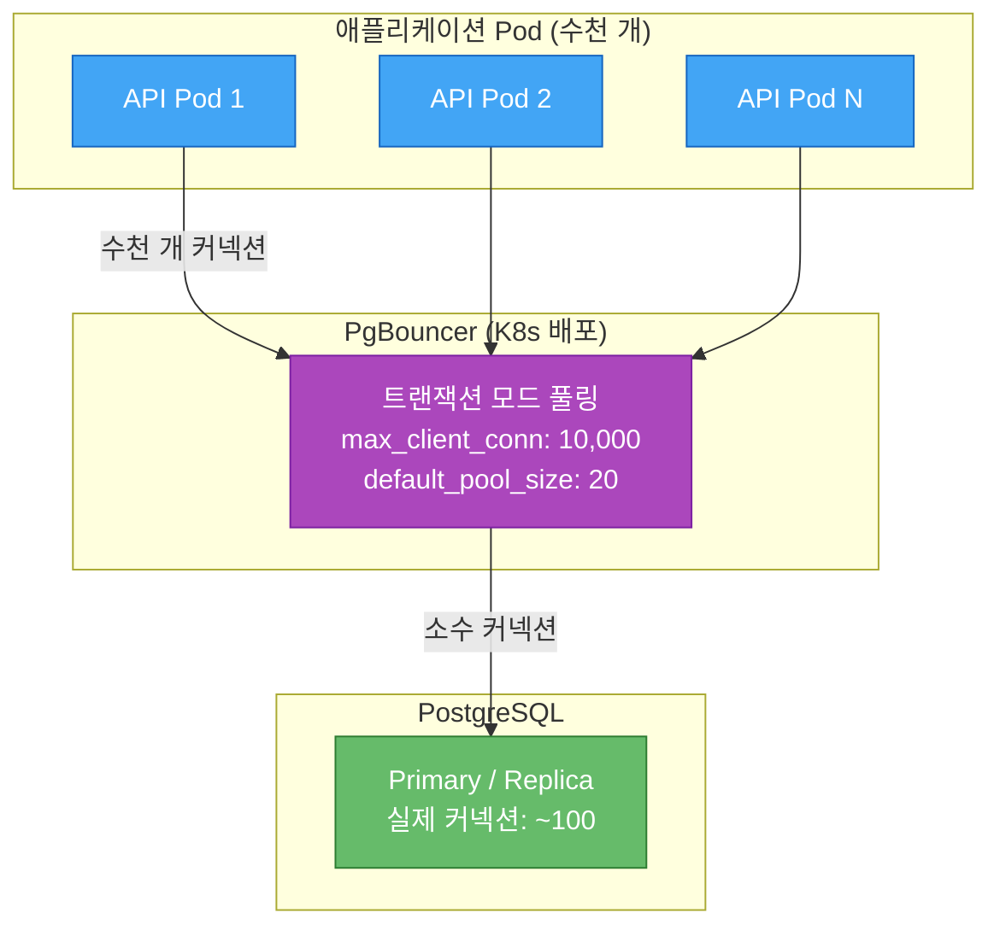

### PgBouncer의 핵심 효과

| 지표 | PgBouncer 도입 전 | PgBouncer 도입 후 |
|---|---|---|
| 커넥션 생성 시간 | ~50ms (TCP + TLS + PG 핸드셰이크) | ~5ms (이미 열린 커넥션 재사용) |
| 최대 클라이언트 커넥션 | Azure 제한에 묶임 | 10,000+ (PgBouncer에서 흡수) |
| DB 실제 커넥션 수 | 수천 개 (풀링 없이) | 수십~수백 개 (풀링된 커넥션) |

PgBouncer는 **트랜잭션 모드** 로 동작하여, 하나의 트랜잭션이 끝나면 해당 서버 커넥션을 즉시 다른 클라이언트에게 할당합니다. 이 방식은 수천 개의 애플리케이션 Pod가 동시에 접속하더라도 실제 PostgreSQL 커넥션 수를 낮게 유지할 수 있게 합니다.

> **참고**: PgBouncer는 극도로 안정적이고 메모리 효율이 높지만(커넥션당 약 2KB), 싱글 스레드라는 한계가 있습니다. 멀티 스레드 대안으로는 Rust 기반의 **pgcat** (읽기/쓰기 분리, 복제 지연 인식 지원) 이나 Yandex의 **Odyssey** (10만 이상 커넥션 처리 가능) 가 있습니다.

## 쿼리 최적화: ORM과 쿼리 패턴 점검

커넥션을 아무리 잘 관리해도 쿼리 자체가 비효율적이면 소용없습니다. OpenAI는 **ORM이 생성하는 쿼리를 체계적으로 검토** 하는 과정을 거쳤습니다.

### 12-테이블 조인 사건

가장 극적인 사례는 ORM이 자동으로 생성한 **12개 테이블을 조인하는 쿼리** 였습니다. 이 쿼리는 정상 상황에서는 큰 문제가 없었지만, 부하가 증가하면 실행 계획이 폭발적으로 복잡해지며 **SEV(심각도) 수준의 장애** 를 유발했습니다.

이를 계기로 OpenAI는 다음 조치를 취했습니다:

- **ORM 쿼리 리뷰 프로세스 도입**: 새로운 모델이나 관계가 추가될 때 생성되는 SQL을 반드시 확인
- **`idle_in_transaction_session_timeout` 설정**: 트랜잭션을 열어둔 채 대기하는 세션을 자동으로 종료하여 커넥션 누수 방지
- **쿼리 복잡도 기준 수립**: 조인 수, 서브쿼리 깊이 등에 대한 내부 가이드라인 마련

## 고가용성(HA): 단일 장애점 완화

단일 Primary 아키텍처의 가장 큰 리스크는 **SPOF(Single Point of Failure)** 입니다. OpenAI는 이를 다음과 같이 완화합니다.

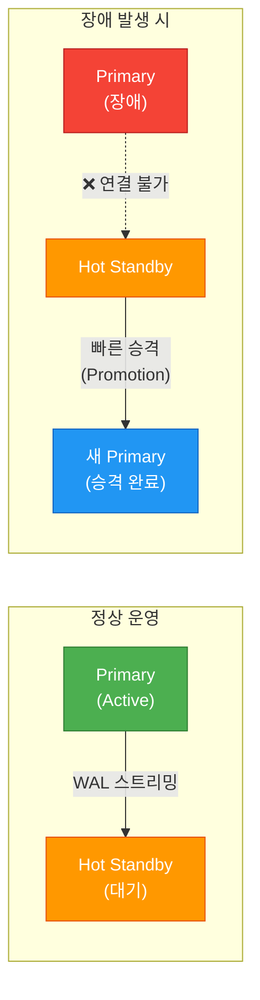

- **Hot Standby**: Primary와 동일한 데이터를 실시간으로 유지하는 대기 인스턴스를 항상 운영
- **빠른 승격(Promotion)**: Primary 장애 시 Hot Standby를 신속하게 새 Primary로 승격
- **Azure 지원 Safe Failover**: Azure PostgreSQL Flexible Server의 고가용성 기능을 활용하여, 자동 감지와 승격이 가능한 구조 유지

Azure PostgreSQL Flexible Server는 Premium SSD v2를 통한 HA와 지역 중복 백업을 지원하며, 거의 무중단에 가까운 스케일링이 가능합니다.

## 워크로드 격리: 우선순위별 트래픽 분리

모든 쿼리가 같은 중요도를 가지는 것은 아닙니다. OpenAI는 **워크로드를 우선순위에 따라 분리** 하여, 중요한 쿼리가 덜 중요한 작업에 의해 영향받지 않도록 합니다.

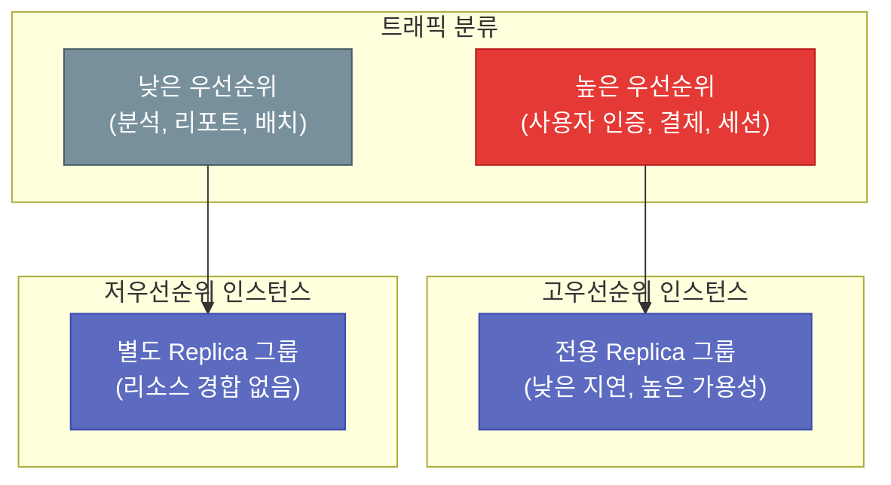

이 격리 전략의 핵심은:

- **높은 우선순위** 워크로드(사용자 인증, 세션 관리 등)는 전용 복제본 그룹에서 처리
- **낮은 우선순위** 워크로드(분석 쿼리, 배치 작업 등)는 별도의 복제본 그룹으로 라우팅
- 하나의 티어에서 과부하가 발생해도 **다른 티어에는 영향을 주지 않음**

이를 통해 배치 분석 쿼리가 무거운 스캔을 실행하더라도 실시간 사용자 요청의 응답 시간에는 영향이 없습니다.

## 캐싱 전략: 캐시 락킹으로 Thundering Herd 방지

대규모 읽기 워크로드에서 캐시는 필수이지만, 캐시가 만료되는 순간 발생하는 **Thundering Herd** 문제는 더 위험할 수 있습니다.

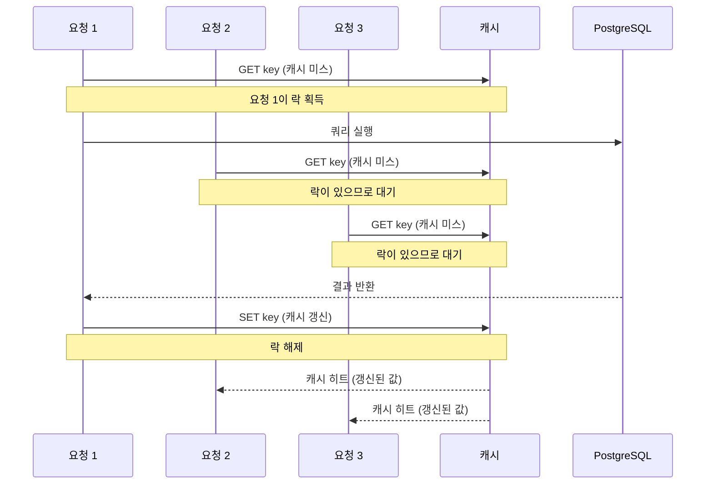

**캐시 락킹** 의 동작 방식:

1. 캐시 미스가 발생하면 **첫 번째 요청만** DB에 쿼리를 보냅니다
2. 동일한 키에 대한 후속 요청들은 **락을 확인하고 대기** 합니다
3. 첫 번째 요청이 DB에서 결과를 가져와 캐시를 갱신하면 **락을 해제** 합니다
4. 대기 중이던 요청들은 **갱신된 캐시에서 즉시 응답** 을 받습니다

이 전략이 없으면, 인기 키의 캐시가 만료될 때 수천 개의 동시 요청이 모두 DB로 직접 향하게 되어 앞서 설명한 악순환 사이클을 촉발합니다.

## 읽기 복제본 확장: 캐스케이딩 리플리케이션

약 50개의 읽기 복제본을 Primary에 직접 연결하면 Primary의 WAL(Write-Ahead Log) 전송 부담이 막대해집니다. OpenAI는 **캐스케이딩 리플리케이션** 으로 이 문제를 해결합니다.

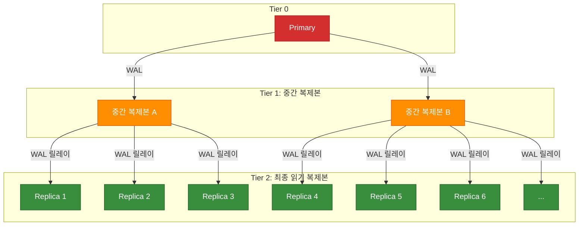

### 캐스케이딩 리플리케이션의 동작 원리

| 구분 | 직접 복제 (캐스케이딩 없이) | 캐스케이딩 복제 |
|---|---|---|
| Primary 부담 | 50개 복제본에 WAL 직접 전송 | 2~3개 중간 복제본에만 전송 |
| 확장성 | 복제본 추가마다 Primary 부하 증가 | 중간 복제본 추가로 100개 이상 가능 |
| 복제 지연 | 낮음 (직접 연결) | 약간 높음 (한 홉 추가) |
| Primary 장애 영향 | 모든 복제본 영향 | 동일하게 영향 |

PostgreSQL 공식 문서에 따르면, 캐스케이딩 복제는 `primary_conninfo`를 중간 복제본을 가리키도록 설정하는 것만으로 구성할 수 있습니다. 중간 복제본은 Primary로부터 받은 WAL 레코드를 자신의 하위 복제본들에게 릴레이합니다.

이 구조 덕분에 OpenAI는 Primary의 네트워크 대역폭과 CPU를 보존하면서도 **전 세계적으로 수십 개의 읽기 복제본을 운영** 할 수 있습니다.

## Rate Limiting: 다계층 방어

트래픽 폭증 상황에서 데이터베이스를 보호하기 위해, OpenAI는 **여러 계층에 걸친 Rate Limiting** 을 적용합니다.

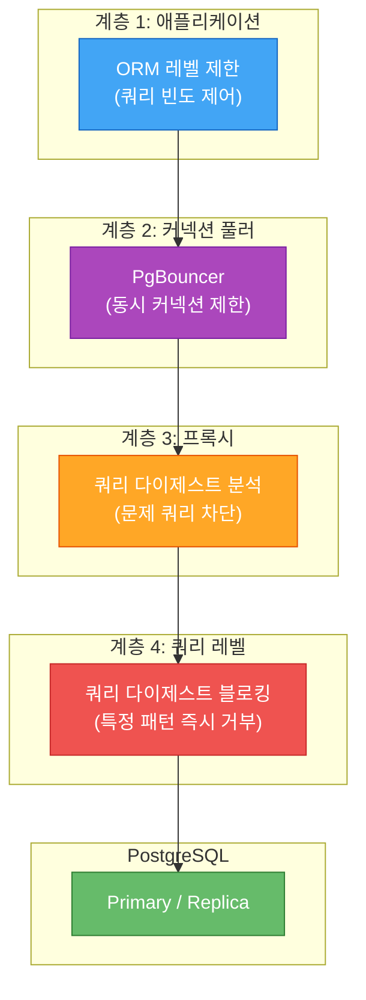

각 계층의 역할:

1. **애플리케이션 레벨**: ORM에서 쿼리 빈도를 제어하여 불필요한 반복 쿼리 차단
2. **커넥션 풀러**: PgBouncer에서 동시 커넥션 수를 제한하여 DB에 도달하는 요청 총량 통제
3. **프록시 레벨**: 쿼리 다이제스트(쿼리의 정규화된 패턴)를 분석하여, 비정상적으로 빈번하거나 무거운 패턴 감지
4. **쿼리 다이제스트 블로킹**: 이미 문제로 식별된 특정 쿼리 패턴을 즉시 거부

특히 **쿼리 다이제스트 블로킹** 은 장애 발생 시 핫픽스 배포 없이도 문제 쿼리를 즉시 차단할 수 있는 강력한 도구입니다. 이전에 SEV를 유발했던 12-테이블 조인 같은 쿼리를 패턴 매칭으로 사전에 차단할 수 있습니다.

## 스키마 관리: 무중단 변경 원칙

8억 사용자가 사용하는 서비스에서 데이터베이스 스키마를 변경하는 것은 그 자체가 리스크입니다. OpenAI는 **엄격한 스키마 변경 정책** 을 수립했습니다.

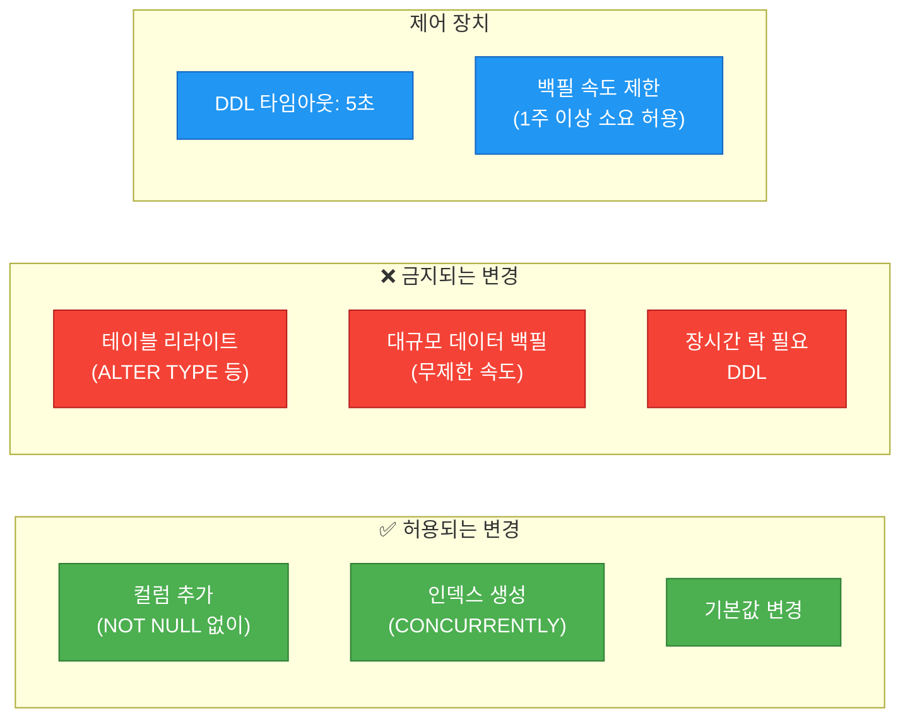

### 핵심 원칙

- **경량 변경만 허용**: 테이블 리라이트가 필요한 변경(예: 컬럼 타입 변경)은 금지. PostgreSQL에서 `ALTER COLUMN TYPE`은 전체 테이블을 다시 쓰므로, 대형 테이블에서는 수 시간의 락이 발생합니다.
- **DDL 타임아웃 5초**: 스키마 변경 DDL이 5초 내에 완료되지 않으면 자동 롤백. 이는 락 대기로 인한 쿼리 적체를 방지합니다.
- **백필은 속도 제한**: 대량의 데이터 백필(예: 새 컬럼에 기존 데이터 채우기)은 **1주 이상** 걸리더라도 속도를 제한하여 진행. 서비스 안정성이 마이그레이션 속도보다 우선합니다.

이 원칙은 제약이 크지만, 8억 사용자 규모의 서비스를 무중단으로 운영하기 위한 필수 트레이드오프입니다.

## 성과와 향후 계획

이 모든 전략의 결과는 인상적입니다.

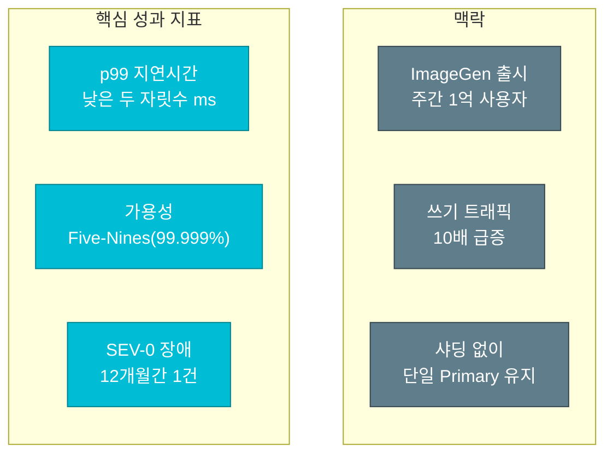

| 지표 | 수치 |
|---|---|
| **p99 지연시간** | 낮은 두 자릿수 밀리초 (low double-digit ms) |
| **가용성** | Five-Nines (99.999%) |
| **지난 12개월 SEV-0 수** | 1건 |
| **SEV-0 원인** | ImageGen 출시 (주간 1억 사용자, 쓰기 10배 급증) |

유일한 SEV-0 장애는 ImageGen 출시 시 발생했습니다. 주당 1억 명의 신규 사용자가 유입되면서 쓰기 트래픽이 10배 급증했고, 이는 기존 방어 계층으로도 완전히 흡수하지 못한 수준이었습니다. 하지만 이 경험 역시 위에서 설명한 전략들을 더욱 강화하는 계기가 되었습니다.

## 핵심 요약

OpenAI의 PostgreSQL 스케일링 전략을 한눈에 정리합니다.

| 전략 | 목적 | 핵심 기법 |
|---|---|---|
| **쓰기 오프로드** | Primary 부하 감소 | 샤딩 가능한 워크로드 → Cosmos DB, 신규 테이블 금지 정책 |
| **PgBouncer** | 커넥션 병목 해소 | K8s 배포, 트랜잭션 모드, 50ms → 5ms 연결 시간 |
| **쿼리 최적화** | 비효율 쿼리 제거 | ORM 리뷰, idle 세션 타임아웃, 조인 수 제한 |
| **고가용성** | SPOF 완화 | Hot Standby, 빠른 승격, Azure Safe Failover |
| **워크로드 격리** | 우선순위 보장 | 고/저 우선순위 복제본 그룹 분리 |
| **캐시 락킹** | Thundering Herd 방지 | 단일 리더 패턴, 후속 요청 대기 |
| **캐스케이딩 복제** | 복제본 확장 | 중간 복제본 WAL 릴레이, 100개 이상 가능 |
| **다계층 Rate Limiting** | 트래픽 폭증 방어 | 앱/풀러/프록시/쿼리 레벨 4중 제한 |
| **스키마 관리** | 무중단 운영 | 경량 DDL만 허용, 5초 타임아웃, 느린 백필 |

## 결론

OpenAI의 사례는 **"스케일링 = 반드시 샤딩"이라는 통념을 정면으로 반박** 합니다. 단일 Primary PostgreSQL로 8억 사용자를 지원하면서 99.999% 가용성과 낮은 두 자릿수 밀리초의 p99 지연시간을 달성한 것은, 데이터베이스 자체를 바꾸는 것이 아니라 **데이터베이스를 둘러싼 모든 계층을 최적화** 한 결과입니다.

쓰기를 줄이고, 읽기를 분산하고, 커넥션을 풀링하고, 캐시를 똑똑하게 관리하고, 장애에 선제적으로 대응하고, 스키마 변경을 엄격히 통제하는 — 이 모든 전략이 하나의 유기적인 시스템으로 작동할 때, 단일 PostgreSQL도 인터넷 규모의 서비스를 감당할 수 있습니다.

물론 이 접근이 모든 상황에 적합한 것은 아닙니다. 쓰기 비중이 매우 높거나 데이터 모델 자체가 분산에 적합한 경우라면 샤딩이 올바른 선택일 수 있습니다. 하지만 OpenAI의 경험은 **"샤딩 전에 할 수 있는 것이 아직 많다"** 는 중요한 교훈을 줍니다.
