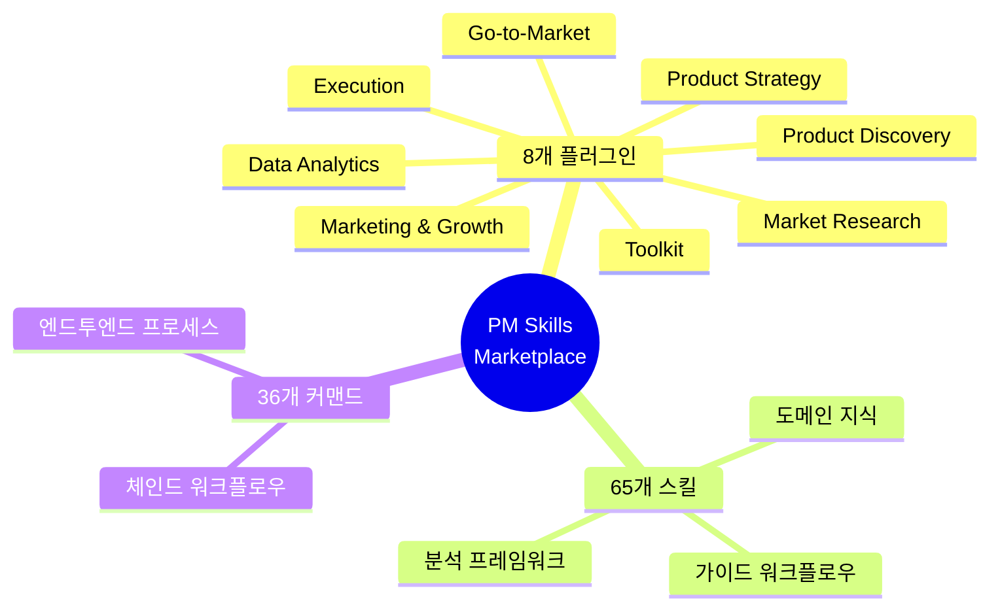
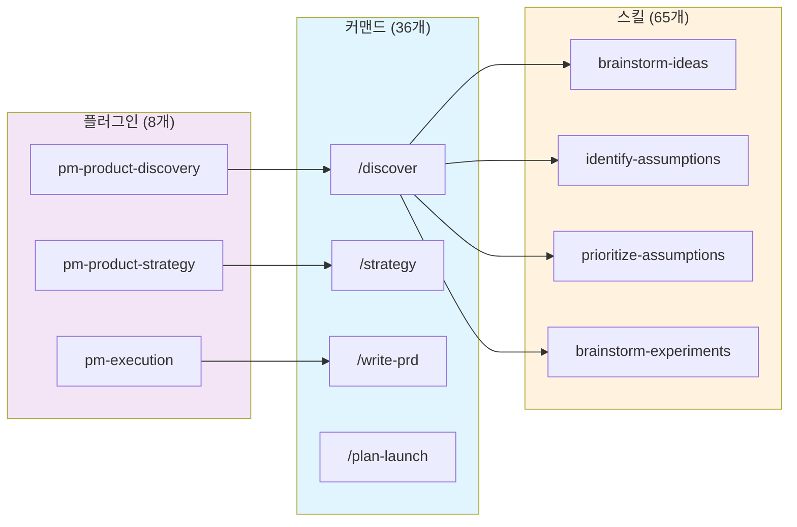
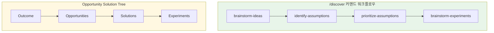
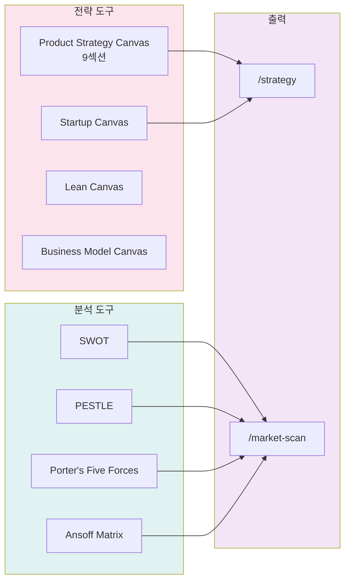
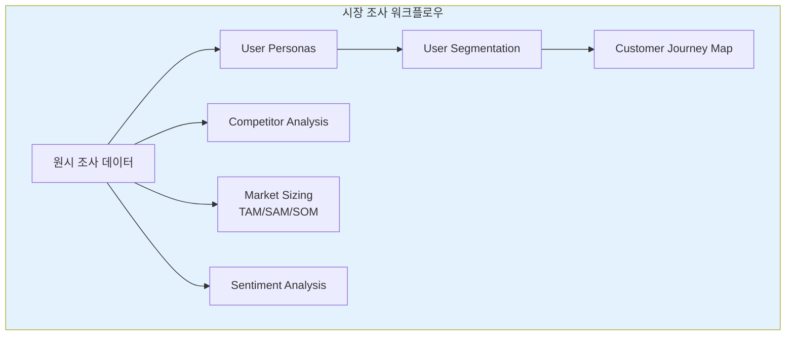
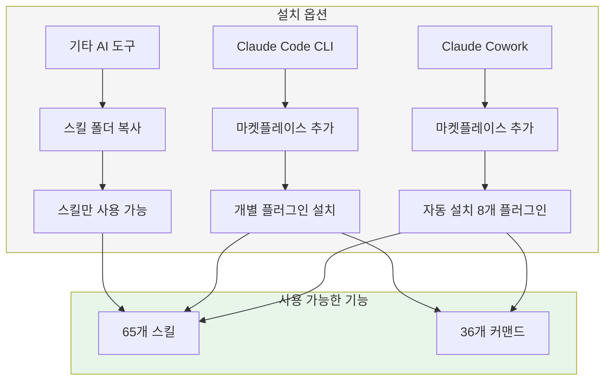

PM(제품 관리자)을 위한 AI 기반 스킬 마켓플레이스가 등장했다. PM Skills Marketplace는 65개 PM 스킬과 36개 체인드 워크플로우를 8개의 플러그인으로 제공하며, Claude Code와 Cowork를 비롯한 다양한 AI 어시스턴트에서 활용할 수 있다.

<!--more-->

## Sources

- [PM Skills Marketplace GitHub Repository](https://github.com/phuryn/pm-skills)

## PM Skills Marketplace란?

PM Skills Marketplace는 제품 관리자가 일상적으로 수행하는 작업을 AI와 함께 더 효과적으로 처리할 수 있도록 설계된 스킬 및 커맨드 모음이다. 이 마켓플레이스의 핵심 철학은 "일반적인 AI는 텍스트를 제공하지만, PM Skills Marketplace는 구조를 제공한다"는 것이다.

각 스킬은 검증된 PM 프레임워크를 인코딩한다. 발견(Discovery), 가정 매핑(Assumption Mapping), 우선순위 설정(Prioritization), 전략(Strategy) 등의 영역에서 단계별 가이드를 제공한다. Teresa Torres, Marty Cagan, Alberto Savoia와 같은 PM 분야의 권위자들이 정립한 방법론이 일상 워크플로우에 내장되어 있다.



## 작동 방식: 스킬, 커맨드, 플러그인

PM Skills Marketplace는 세 가지 계층 구조로 구성되어 있다.

### 스킬(Skills)

**스킬** 은 마켓플레이스의 기본 빌딩 블록이다. 각 스킬은 Claude에게 특정 PM 작업을 위한 도메인 지식, 분석 프레임워크, 또는 가이드 워크플로우를 제공한다. 일부 스킬은 여러 커맨드가 공유하는 재사용 가능한 기반으로 작동한다.

스킬은 대화와 관련성이 있을 때 자동으로 로드된다. 별도의 명시적 호출이 필요 없다. 필요한 경우 `/plugin-name:skill-name` 또는 `/skill-name` 형식으로 강제 로딩할 수 있다.

### 커맨드(Commands)

**커맨드** 는 `/command-name` 형식으로 사용자가 트리거하는 워크플로우다. 하나 이상의 스킬을 엔드투엔드 프로세스로 체인으로 연결한다. 예를 들어 `/discover` 커맨드는 네 가지 스킬을 연결한다: `brainstorm-ideas` → `identify-assumptions` → `prioritize-assumptions` → `brainstorm-experiments`.

### 플러그인(Plugins)

**플러그인** 은 관련 스킬과 커맨드를 설치 가능한 패키지로 그룹화한다. 각 플러그인은 하나의 PM 도메인을 커버한다. 마켓플레이스를 설치하면 8개 플러그인을 모두 한 번에 얻을 수 있다.



## 8개 플러그인 상세 분석

### 1. pm-product-discovery

지속적 제품 발견을 위한 플러그인이다. 아이데이션, 실험, 가정 테스트, 기능 우선순위 설정, Opportunity Solution Tree, 고객 인터뷰를 다룬다.

**13개 스킬:**

| 스킬명 | 설명 |
|--------|------|
| `brainstorm-ideas-existing` | 기존 제품을 위한 다각적 아이데이션 (PM, 디자이너, 엔지니어 관점) |
| `brainstorm-ideas-new` | 초기 발견 단계의 신규 제품 아이데이션 |
| `brainstorm-experiments-existing` | 기존 제품의 가정을 테스트하기 위한 실험 설계 |
| `brainstorm-experiments-new` | 신규 제품을 위한 린 스타트업 프리토타입 (Alberto Savoia) |
| `identify-assumptions-existing` | 가치, 사용성, 실현가능성, 실행가능성 영역의 위험한 가정 식별 |
| `identify-assumptions-new` | GTM, 전략, 팀을 포함한 8개 위험 카테고리의 가정 식별 |
| `prioritize-assumptions` | 영향도 × 리스크 매트릭스를 사용한 가정 우선순위 설정 |
| `prioritize-features` | 영향도, 노력, 리스크, 전략적 정렬 기반 기능 백로그 우선순위 |
| `analyze-feature-requests` | 테마와 전략적 적합성별 고객 기능 요청 분석 및 분류 |
| `opportunity-solution-tree` | Teresa Torres의 Opportunity Solution Tree 구축 |
| `interview-script` | JTBD 탐색 질문이 포함된 구조화된 고객 인터뷰 스크립트 |
| `summarize-interview` | 인터뷰 녹취록을 JTBD, 만족도 신호, 액션 아이템으로 요약 |
| `metrics-dashboard` | North Star, 입력 지표, 알림 임계값이 있는 메트릭 대시보드 설계 |

**5개 커맨드:**

| 커맨드 | 설명 |
|--------|------|
| `/discover` | 전체 발견 사이클: 아이데이션 → 가정 매핑 → 우선순위 → 실험 설계 |
| `/brainstorm` | 다각적 아이데이션 (`ideas|experiments` × `existing|new`) |
| `/triage-requests` | 기능 요청 배치 분석 및 우선순위 설정 |
| `/interview` | 인터뷰 스크립트 준비 또는 녹취록 요약 (`prep|summarize`) |
| `/setup-metrics` | 제품 메트릭 대시보드 설계 |



### 2. pm-product-strategy

제품 전략, 비전, 비즈니스 모델, 가격 책정, 거시 환경 분석을 다룬다. 비전 수립부터 경쟁 환경 스캐닝까지 전체 전략 툴킷을 커버한다.

**12개 스킬:**

| 스킬명 | 설명 |
|--------|------|
| `product-strategy` | 종합적인 9섹션 Product Strategy Canvas (비전 → 방어가능성) |
| `startup-canvas` | Product Strategy (9섹션) + Business Model 결합 |
| `product-vision` | 영감을 주고 달성 가능하며 감정적인 제품 비전 수립 |
| `value-proposition` | 6파트 JTBD 가치 제안 |
| `lean-canvas` | 스타트업과 신규 제품을 위한 Lean Canvas 비즈니스 모델 |
| `business-model` | 9개 빌딩 블록이 있는 Business Model Canvas |
| `monetization-strategy` | 검증 실험이 포함된 3-5개 수익화 전략 브레인스토밍 |
| `pricing-strategy` | 가격 모델, 경쟁 분석, 지불 의사, 가격 탄력성 |
| `swot-analysis` | 실행 가능한 권장사항이 포함된 SWOT 분석 |
| `pestle-analysis` | 거시 환경: 정치, 경제, 사회, 기술, 법률, 환경 |
| `porters-five-forces` | 경쟁 세력 분석 (경쟁, 공급자, 구매자, 대체재, 신규 진입자) |
| `ansoff-matrix` | 시장과 제품에 따른 성장 전략 매핑 |

**5개 커맨드:**

| 커맨드 | 설명 |
|--------|------|
| `/strategy` | 완전한 9섹션 Product Strategy Canvas 생성 |
| `/business-model` | 비즈니스 모델 탐색 (`lean|full|startup|value-prop|all`) |
| `/value-proposition` | 6파트 JTBD 템플릿을 사용한 가치 제안 설계 |
| `/market-scan` | SWOT + PESTLE + Porter's + Ansoff 결합 거시 환경 분석 |
| `/pricing` | 경쟁 분석과 실험이 포함된 가격 전략 설계 |



### 3. pm-execution

일상적인 제품 관리 작업을 다룬다. PRD, OKR, 로드맵, 스프린트, 회고, 릴리스 노트, 프리모템, 이해관계자 관리, 유저 스토리, 우선순위 프레임워크 등을 포함한다.

**15개 스킬:**

| 스킬명 | 설명 |
|--------|------|
| `create-prd` | 종합적인 8섹션 PRD 템플릿 |
| `brainstorm-okrs` | 회사 목표와 정렬된 팀 수준 OKR |
| `outcome-roadmap` | 기능 목록을 결과 중심 로드맵으로 변환 |
| `sprint-plan` | 용량 추정, 스토리 선택, 리스크 식별이 포함된 스프린트 계획 |
| `retro` | 구조화된 스프린트 회고 진행 |
| `release-notes` | 티켓, PRD, 변경 로그에서 사용자 대면 릴리스 노트 작성 |
| `pre-mortem` | Tigers/Paper Tigers/Elephants 분류를 사용한 리스크 분석 |
| `stakeholder-map` | Power × Interest 그리드와 맞춤형 커뮤니케이션 계획 |
| `summarize-meeting` | 회의 녹취록 → 결정사항 + 액션 아이템 |
| `user-stories` | 3 C's와 INVEST 기준을 따르는 유저 스토리 |
| `job-stories` | Job Stories: When [상황], I want to [동기], so I can [결과] |
| `wwas` | Why-What-Acceptance 형식의 제품 백로그 아이템 |
| `test-scenarios` | 테스트 시나리오: 해피 패스, 엣지 케이스, 에러 처리 |
| `dummy-dataset` | CSV, JSON, SQL, Python 형식의 현실적인 더미 데이터셋 |
| `prioritization-frameworks` | 9개 우선순위 프레임워크 참조 가이드 |

**10개 커맨드:**

| 커맨드 | 설명 |
|--------|------|
| `/write-prd` | 기능 아이디어나 문제 진술에서 PRD 생성 |
| `/plan-okrs` | 팀 수준 OKR 브레인스토밍 |
| `/transform-roadmap` | 기능 기반 로드맵을 결과 중심으로 변환 |
| `/sprint` | 스프린트 라이프사이클 (`plan|retro|release`) |
| `/pre-mortem` | PRD나 출시 계획에 대한 프리모템 리스크 분석 |
| `/meeting-notes` | 회의 녹취록을 구조화된 노트로 요약 |
| `/stakeholder-map` | 이해관계자 매핑 및 커뮤니케이션 계획 수립 |
| `/write-stories` | 기능을 백로그 아이템으로 분해 (`user|job|wwa`) |
| `/test-scenarios` | 유저 스토리에서 테스트 시나리오 생성 |
| `/generate-data` | 현실적인 더미 데이터셋 생성 |

### 4. pm-market-research

사용자 조사와 경쟁 분석을 다룬다. 페르소나, 세분화, 고객 여정 맵, 시장 규모 추정, 경쟁사 분석, 피드백 분석을 포함한다.

**7개 스킬:**

| 스킬명 | 설명 |
|--------|------|
| `user-personas` | 조사 데이터에서 정제된 사용자 페르소나 생성 |
| `market-segments` | 인구통계, JTBD, 제품 적합성이 있는 3-5개 고객 세그먼트 식별 |
| `user-segmentation` | 행동, JTBD, 니즈 기반 피드백 데이터에서 사용자 세분화 |
| `customer-journey-map` | 단계, 터치포인트, 감정, 페인 포인트가 있는 엔드투엔드 여정 맵 |
| `market-sizing` | 하향식 및 상향식 접근법을 사용한 TAM, SAM, SOM |
| `competitor-analysis` | 경쟁사 강점, 약점, 차별화 기회 |
| `sentiment-analysis` | 사용자 피드백에서 감정 분석 및 테마 추출 |

**3개 커맨드:**

| 커맨드 | 설명 |
|--------|------|
| `/research-users` | 페르소나 구축, 사용자 세분화, 고객 여정 매핑 |
| `/competitive-analysis` | 경쟁 환경 분석 |
| `/analyze-feedback` | 사용자 피드백에서 감정 분석 및 세그먼트 인사이트 |



### 5. pm-data-analytics

PM을 위한 데이터 분석을 다룬다. SQL 쿼리 생성, 코호트 분석, A/B 테스트 분석을 포함한다.

**3개 스킬:**

| 스킬명 | 설명 |
|--------|------|
| `sql-queries` | 자연어에서 SQL 생성 (BigQuery, PostgreSQL, MySQL) |
| `cohort-analysis` | 리텐션 곡선, 기능 채택, 코호트별 참여 트렌드 |
| `ab-test-analysis` | 통계적 유의성, 샘플 크기 검증, ship/extend/stop 권장사항 |

**3개 커맨드:**

| 커맨드 | 설명 |
|--------|------|
| `/write-query` | 자연어에서 SQL 쿼리 생성 |
| `/analyze-cohorts` | 사용자 참여 데이터에 대한 코호트 분석 |
| `/analyze-test` | A/B 테스트 결과 분석 |

### 6. pm-go-to-market

GTM 전략을 다룬다. 비치헤드 세그먼트, 이상적 고객 프로필, 메시징, 성장 루프, GTM 모션, 경쟁사 배틀카드를 포함한다.

**6개 스킬:**

| 스킬명 | 설명 |
|--------|------|
| `gtm-strategy` | 전체 GTM 전략: 채널, 메시징, 성공 지표, 출시 계획 |
| `beachhead-segment` | 첫 번째 비치헤드 시장 세그먼트 식별 |
| `ideal-customer-profile` | 인구통계, 행동, JTBD, 니즈가 포함된 ICP |
| `growth-loops` | 지속 가능한 성장 루프(플라이휠) 설계 |
| `gtm-motions` | GTM 모션 및 도구 평가 (product-led, sales-led 등) |
| `competitive-battlecard` | 이의 처리 및 승리 전략이 포함된 세일즈용 배틀카드 |

**3개 커맨드:**

| 커맨드 | 설명 |
|--------|------|
| `/plan-launch` | 비치헤드에서 출시 계획까지 전체 GTM 전략 |
| `/growth-strategy` | 성장 루프 설계 및 GTM 모션 평가 |
| `/battlecard` | 경쟁사 배틀카드 생성 |

### 7. pm-marketing-growth

제품 마케팅과 성장을 다룬다. 마케팅 아이디어, 포지셔닝, 가치 제안 문구, 제품 네이밍, North Star 메트릭을 포함한다.

**5개 스킬:**

| 스킬명 | 설명 |
|--------|------|
| `marketing-ideas` | 채널과 메시징이 포함된 창의적이고 비용 효율적인 마케팅 아이디어 |
| `positioning-ideas` | 경쟁사와 차별화된 제품 포지셔닝 |
| `value-prop-statements` | 마케팅, 세일즈, 온보딩을 위한 가치 제안 문구 |
| `product-name` | 브랜드 가치와 타겟 오디언스에 맞는 제품명 브레인스토밍 |
| `north-star-metric` | North Star Metric + 비즈니스 게임 분류가 포함된 입력 지표 |

**2개 커맨드:**

| 커맨드 | 설명 |
|--------|------|
| `/market-product` | 마케팅 아이디어, 포지셔닝, 가치 제안, 제품명 브레인스토밍 |
| `/north-star` | North Star Metric 및 지원 입력 지표 정의 |

### 8. pm-toolkit

핵심 제품 작업 외의 PM 유틸리티를 다룬다. 이력서 검토, 법적 문서, 교정을 포함한다.

**4개 스킬:**

| 스킬명 | 설명 |
|--------|------|
| `review-resume` | 10가지 모범 사례에 따른 PM 이력서 검토 및 맞춤화 |
| `draft-nda` | 관할 구역에 적합한 조항이 포함된 비공개 계약서 |
| `privacy-policy` | GDPR/CCPA 규정 준수를 다루는 개인정보 처리방침 |
| `grammar-check` | 대상 수정이 포함된 문법, 논리, 흐름 검사 |

**5개 커맨드:**

| 커맨드 | 설명 |
|--------|------|
| `/review-resume` | 종합적인 PM 이력서 검토 |
| `/tailor-resume` | 특정 직무 기술에 맞게 이력서 맞춤화 |
| `/draft-nda` | NDA 초안 작성 |
| `/privacy-policy` | 개인정보 처리방침 초안 작성 |
| `/proofread` | 문법, 논리, 흐름 검사 |

## 설치 방법

### Claude Cowork (비개발자 권장)

1. 좌측 하단의 **Customize** 열기
2. **Browse plugins** → **Personal** → **+** 이동
3. **Add marketplace from GitHub** 선택
4. `phuryn/pm-skills` 입력

모든 8개 플러그인이 자동으로 설치된다. 커맨드(`/discover`, `/strategy` 등)와 스킬을 모두 사용할 수 있다.

### Claude Code (CLI)

```bash
# Step 1: 마켓플레이스 추가
claude plugin marketplace add phuryn/pm-skills

# Step 2: 개별 플러그인 설치
claude plugin install pm-toolkit@pm-skills
claude plugin install pm-product-strategy@pm-skills
claude plugin install pm-product-discovery@pm-skills
claude plugin install pm-market-research@pm-skills
claude plugin install pm-data-analytics@pm-skills
claude plugin install pm-marketing-growth@pm-skills
claude plugin install pm-go-to-market@pm-skills
claude plugin install pm-execution@pm-skills
```

### 다른 AI 어시스턴트 (스킬만)

`skills/*/SKILL.md` 파일은 범용 스킬 형식을 따르며, 이를 읽을 수 있는 모든 도구에서 작동한다. 커맨드(`/slash-commands`)는 Claude 전용이다.

| 도구 | 사용 방법 | 작동 범위 |
|------|-----------|-----------|
| **Gemini CLI** | 스킬 폴더를 `.gemini/skills/`에 복사 | 스킬만 |
| **Cursor** | 스킬 폴더를 `.cursor/skills/`에 복사 | 스킬만 |
| **Codex CLI** | 스킬 폴더를 `.codex/skills/`에 복사 | 스킬만 |
| **Kiro** | 스킬 폴더를 `.kiro/skills/`에 복사 | 스킬만 |

```bash
# 예: Gemini CLI를 위한 모든 스킬 복사
for plugin in pm-*/; do
  cp -r "$plugin/skills/"* ~/.gemini/skills/ 2>/dev/null
done
```



## 빠른 시작 가이드

새로운 아이디어가 있다면 → `/discover`<br/>
전략적 명확성이 필요하다면 → `/strategy`<br/>
PRD를 작성 중이라면 → `/write-prd`<br/>
출시를 계획 중이라면 → `/plan-launch`<br/>
메트릭을 정의해야 한다면 → `/north-star`

## 기반 PM 프레임워크

PM Skills Marketplace는 다음 PM 분야 권위자들의 저작을 기반으로 한다:

| 저자 | 저서 | 기여 영역 |
|------|------|-----------|
| Teresa Torres | Continuous Discovery Habits | Opportunity Solution Tree, 발견 프로세스 |
| Marty Cagan | INSPIRED, TRANSFORMED | 제품 발견, 제품 팀 운영 |
| Alberto Savoia | The Right It | 프리토타이핑, 가정 테스트 |
| Dan Olsen | The Lean Product Playbook | 린 제품 프로세스 |
| Roger L. Martin | Playing to Win | 전략 프레임워크 |
| Ash Maurya | Running Lean | 린 캔버스, 실험 설계 |
| Strategyzer | Business Model Generation | 비즈니스 모델 캔버스 |
| Christina Wodtke | Radical Focus | OKR, 목표 설정 |
| Anthony W. Ulwick | Jobs to Be Done | JTBD 프레임워크 |
| Alistair Croll & Benjamin Yoskovitz | Lean Analytics | 메트릭스, 분석 |
| Sean Ellis | Hacking Growth | 성장 해킹, North Star |
| Maja Voje | Go-To-Market Strategist | GTM 전략 |

## 핵심 요약

| 항목 | 내용 |
|------|------|
| **총 스킬 수** | 65개 |
| **총 커맨드 수** | 36개 |
| **플러그인 수** | 8개 |
| **지원 도구** | Claude Code, Claude Cowork, Gemini CLI, Cursor, Codex CLI, Kiro |
| **커버리지** | 발견 → 전략 → 실행 → 출시 → 성장 |
| **라이선스** | MIT |
| **핵심 철학** | 일반 AI는 텍스트를, PM Skills는 구조를 제공 |

## 결론

PM Skills Marketplace는 제품 관리자가 AI와 함께 일할 때 겪는 "어디서부터 시작해야 할지 모르겠다"는 문제를 해결한다. 65개의 구조화된 스킬과 36개의 엔드투엔드 워크플로우를 통해, PM은 검증된 프레임워크를 바로 적용할 수 있다.

특히 Teresa Torres의 Opportunity Solution Tree, Marty Cagan의 제품 발견 방법론, Alberto Savoia의 프리토타이핑과 같은 실전 검증된 기법들이 AI 워크플로우에 내장되어 있다는 점이 인상적이다. 이론으로만 접했던 PM 프레임워크를 일상 업무에 즉시 적용할 수 있는 실용적인 도구다.

Claude Code와 Claude Cowork 사용자라면 전체 기능을, 다른 AI 도구 사용자라면 스킬 기능을 활용할 수 있다. 제품 관리 업무를 AI와 함께 더 체계적으로 수행하고 싶은 PM이라면 한 번 사용해볼 만하다.
