## 소개

**UI UX Pro Max Skill** 은 AI 어시스턴트가 전문적인 UI/UX를 구축할 수 있도록 설계된 오픈소스 스킬입니다. 이 도구는 단순한 스타일 가이드가 아니라, 프로젝트 요구사항을 분석하여 맞춤형 디자인 시스템을 생성하는 **AI 기반 추론 엔진** 입니다.

<!--more-->

## Sources

- [GitHub - nextlevelbuilder/ui-ux-pro-max-skill](https://github.com/nextlevelbuilder/ui-ux-pro-max-skill)

## UI UX Pro Max Skill 이란?

UI UX Pro Max Skill은 Claude Code, Cursor, Windsurf, GitHub Copilot 등 다양한 AI 코딩 어시스턴트에서 사용할 수 있는 디자인 인텔리전스 스킬입니다. v2.0에서는 **Design System Generator** 라는 핵심 기능이 도입되어, 사용자의 요청을 분석하고 최적의 디자인 시스템을 자동으로 생성합니다.

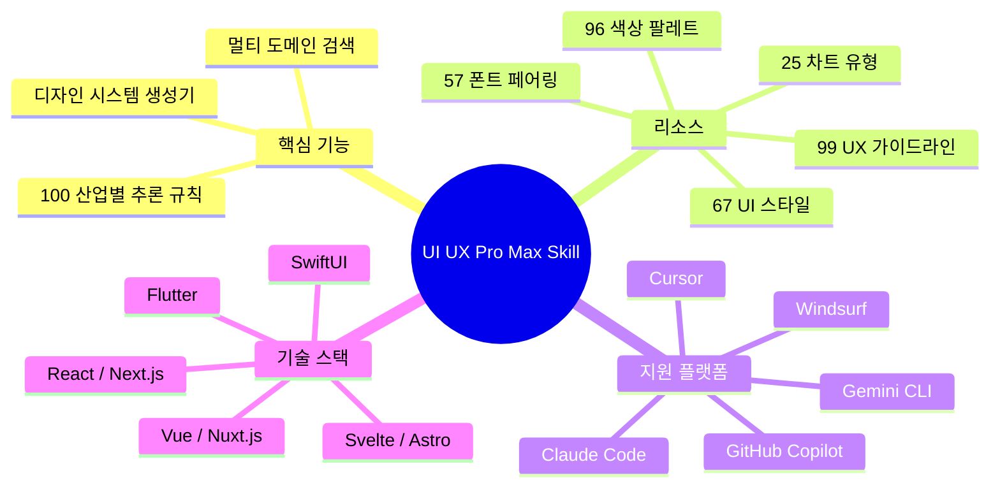

### v2.0의 핵심 특징

v2.0의 가장 중요한 변화는 **지능형 디자인 시스템 생성** 기능입니다. 이전 버전이 단순히 스타일과 색상을 추천했다면, v2.0은 다음을 포함한 완전한 디자인 시스템을 생성합니다:

- **랜딩 페이지 패턴**: 제품 유형에 맞는 최적의 섹션 구조
- **스타일 추천**: 67개 스타일 중 BM25 랭킹 기반 최적 선택
- **색상 팔레트**: 산업별 적합한 색상 조합
- **타이포그래피**: 57개 폰트 페어링 중 무드에 맞는 선택
- **안티 패턴 경고**: 피해야 할 디자인 실수
- **사전 전달 체크리스트**: 접근성, 반응형, 인터랙션 검증

## v2.0 디자인 시스템 생성기 핵심 기능

### Design System Generator 작동 예시

사용자가 "뷰티 스파를 위한 랜딩 페이지를 만들어줘"라고 요청하면, 시스템은 다음과 같은 완전한 디자인 시스템을 생성합니다:

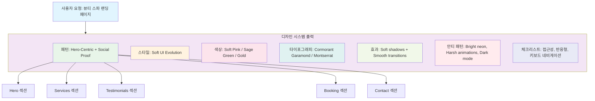

### 100개 산업별 추론 규칙

추론 엔진은 다양한 산업 분야에 특화된 규칙을 포함합니다:

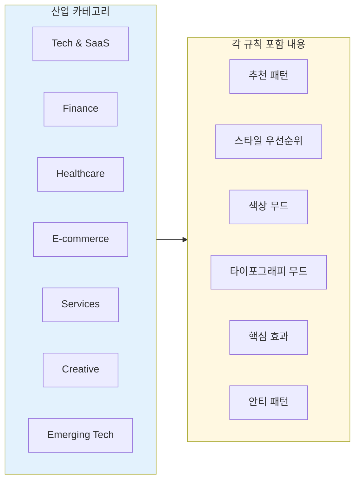

| 카테고리 | 예시 산업 |
|---------|----------|
| **Tech & SaaS** | SaaS, Micro SaaS, B2B Enterprise, Developer Tools, AI/Chatbot Platform |
| **Finance** | Fintech, Banking, Crypto, Insurance, Trading Dashboard |
| **Healthcare** | Medical Clinic, Pharmacy, Dental, Veterinary, Mental Health |
| **E-commerce** | General, Luxury, Marketplace, Subscription Box |
| **Services** | Beauty/Spa, Restaurant, Hotel, Legal, Consulting |
| **Creative** | Portfolio, Agency, Photography, Gaming, Music Streaming |
| **Emerging Tech** | Web3/NFT, Spatial Computing, Quantum Computing, Autonomous Systems |

### 안티 패턴 예시

각 산업 규칙은 **피해야 할 디자인** 도 명시합니다. 예를 들어:

- **뱅킹 앱**: "AI purple/pink gradients" 사용 금지
- **헬스케어**: "과도한 애니메이션" 금지
- **뷰티/스파**: "Bright neon colors" 금지

## 작동 방식 (4단계 워크플로우)

디자인 시스템 생성은 4단계 프로세스로 동작합니다:

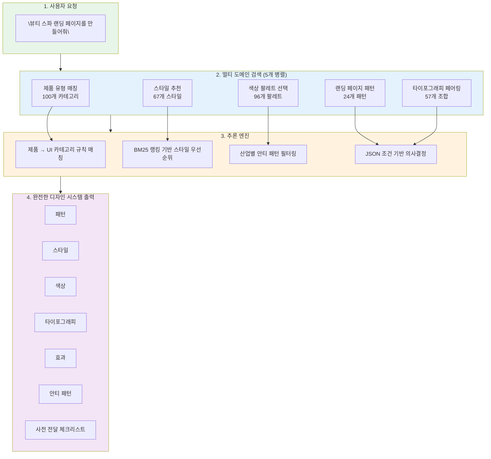

### 1단계: 사용자 요청

자연어로 UI/UX 작업을 요청합니다:

```
Build a landing page for my SaaS product
Create a dashboard for healthcare analytics
Design a portfolio website with dark mode
```

### 2단계: 멀티 도메인 검색

5개의 병렬 검색이 실행됩니다:

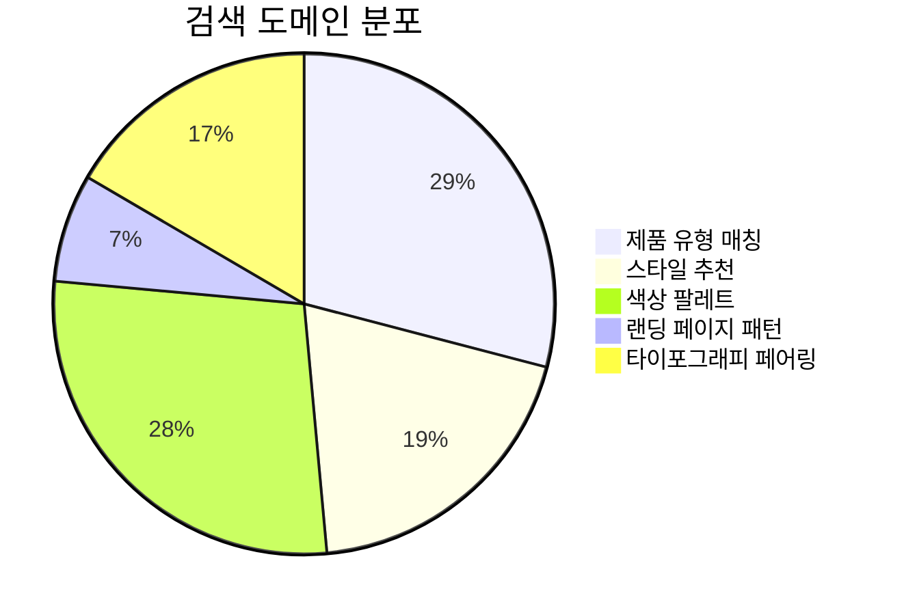

### 3단계: 추론 엔진

검색 결과를 바탕으로 추론 엔진이 작동합니다:

- **BM25 랭킹**: 관련성 점수 기반 스타일 우선순위 결정
- **안티 패턴 필터링**: 산업에 부적합한 디자인 제거
- **JSON 조건 처리**: 구조화된 의사결정 규칙 적용

### 4단계: 완전한 디자인 시스템 출력

최종 출력에는 다음이 포함됩니다:

- **Pattern**: 랜딩 페이지 구조 (섹션 구성)
- **Style**: 추천 UI 스타일과 키워드
- **Colors**: Primary, Secondary, CTA, Background, Text 색상
- **Typography**: 헤딩/본문 폰트 조합
- **Key Effects**: 애니메이션 및 인터랙션
- **Anti-patterns**: 피해야 할 요소들
- **Pre-delivery Checklist**: 품질 검증 항목

## 주요 리소스 상세

### 67개 UI 스타일

UI UX Pro Max Skill은 총 67개의 UI 스타일을 제공하며, 크게 세 카테고리로 분류됩니다:

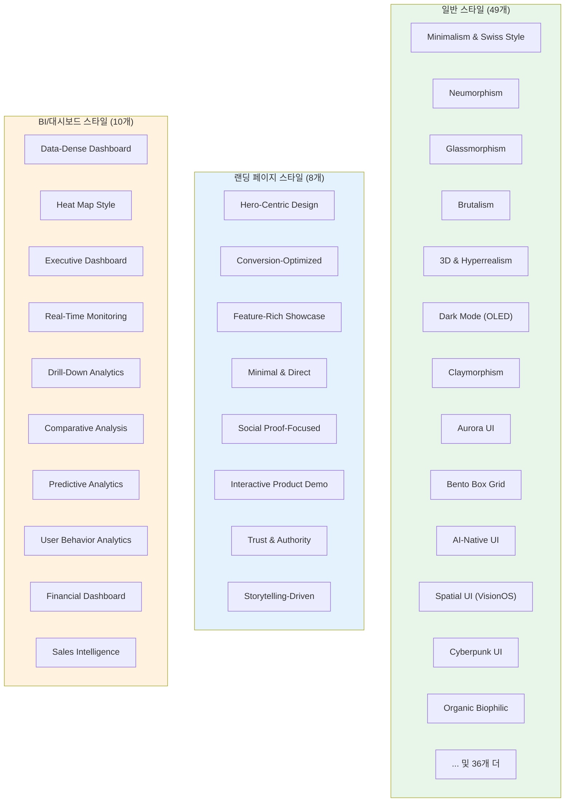

#### 일반 스타일 주요 예시 (49개)

| # | 스타일 | 최적 용도 |
|---|-------|----------|
| 1 | Minimalism & Swiss Style | 엔터프라이즈 앱, 대시보드, 문서 |
| 2 | Neumorphism | 헬스/웰니스 앱, 명상 플랫폼 |
| 3 | Glassmorphism | 모던 SaaS, 금융 대시보드 |
| 4 | Brutalism | 디자인 포트폴리오, 아트 프로젝트 |
| 5 | 3D & Hyperrealism | 게임, 제품 쇼케이스, 몰입형 경험 |
| 6 | Dark Mode (OLED) | 야간 모드 앱, 코딩 플랫폼 |
| 7 | Claymorphism | 교육 앱, 아동용 앱, SaaS |
| 8 | Aurora UI | 모던 SaaS, 크리에이티브 에이전시 |
| 9 | Bento Box Grid | 대시보드, 제품 페이지, 포트폴리오 |
| 10 | AI-Native UI | AI 제품, 챗봇, 코파일럿 |
| 11 | Spatial UI (VisionOS) | 공간 컴퓨팅 앱, VR/AR |
| 12 | Cyberpunk UI | 게임, 테크 제품, 크립토 앱 |
| 13 | Organic Biophilic | 웰니스 앱, 지속가능성 브랜드 |
| 14 | Y2K Aesthetic | 패션 브랜드, 음악, Gen Z |
| 15 | Pixel Art | 인디 게임, 레트로 도구 |

#### 랜딩 페이지 스타일 (8개)

| # | 스타일 | 최적 용도 |
|---|-------|----------|
| 1 | Hero-Centric Design | 강력한 비주얼 아이덴티티를 가진 제품 |
| 2 | Conversion-Optimized | 리드 생성, 세일즈 페이지 |
| 3 | Feature-Rich Showcase | SaaS, 복잡한 제품 |
| 4 | Minimal & Direct | 단순 제품, 앱 |
| 5 | Social Proof-Focused | 서비스, B2C 제품 |
| 6 | Interactive Product Demo | 소프트웨어, 도구 |
| 7 | Trust & Authority | B2B, 엔터프라이즈, 컨설팅 |
| 8 | Storytelling-Driven | 브랜드, 에이전시, 비영리 |

### 96개 색상 팔레트

산업별 최적화된 색상 팔레트를 제공합니다:

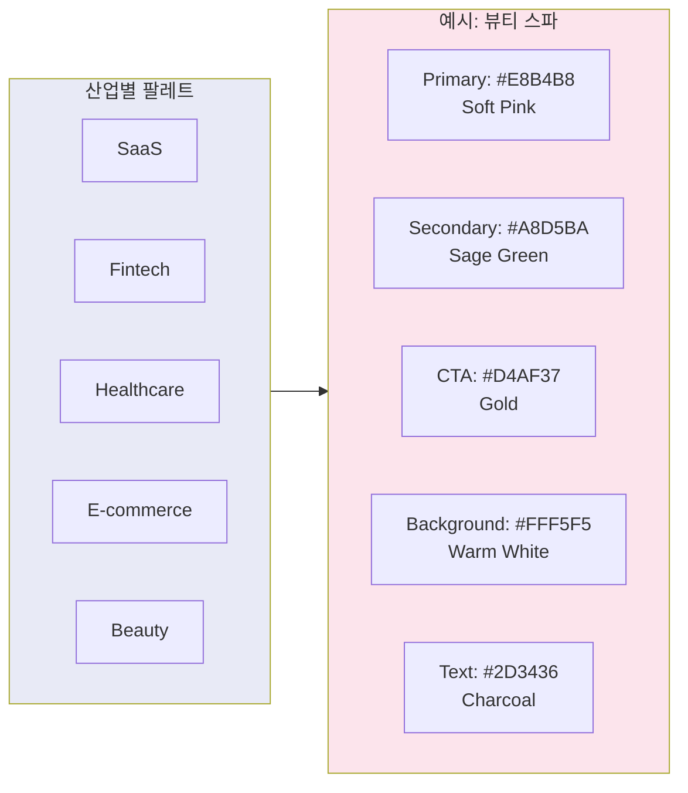

### 57개 폰트 페어링

Google Fonts 임포트가 포함된 큐레이션된 타이포그래피 조합:

| 페어링 | 무드 | 최적 용도 |
|-------|------|----------|
| Cormorant Garamond / Montserrat | 우아함, 차분함, 세련됨 | 럭셔리 브랜드, 웰니스, 뷰티, 에디토리얼 |
| Inter / Space Grotesk | 모던함, 기술적, 깔끔함 | SaaS, 스타트업, 테크 제품 |
| Playfair Display / Lato | 클래식, 신뢰감 | 법률, 컨설팅, 금융 |

### 25개 차트 유형

대시보드 및 분석을 위한 차트 추천:

- **Data-Dense Dashboard**: 복잡한 데이터 분석
- **Heat Map Style**: 지리/행동 데이터
- **Executive Dashboard**: C-suite 요약
- **Real-Time Monitoring**: 운영, DevOps
- **Financial Dashboard**: 금융, 회계

## 지원 기술 스택 (13개)

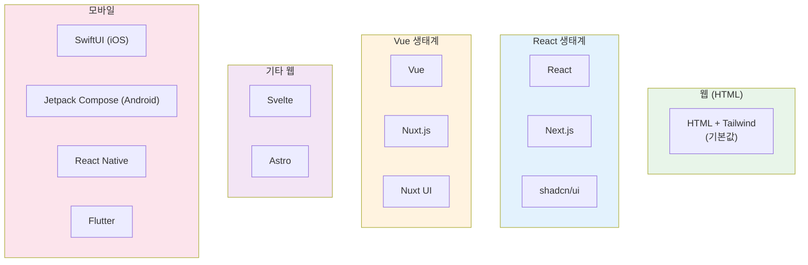

| 카테고리 | 스택 |
|---------|------|
| **Web (HTML)** | HTML + Tailwind (기본값) |
| **React Ecosystem** | React, Next.js, shadcn/ui |
| **Vue Ecosystem** | Vue, Nuxt.js, Nuxt UI |
| **Other Web** | Svelte, Astro |
| **iOS** | SwiftUI |
| **Android** | Jetpack Compose |
| **Cross-Platform** | React Native, Flutter |

## 설치 및 사용법

### Claude Marketplace (Claude Code)

```bash
/plugin marketplace add nextlevelbuilder/ui-ux-pro-max-skill
/plugin install ui-ux-pro-max@ui-ux-pro-max-skill
```

### CLI 설치 (권장)

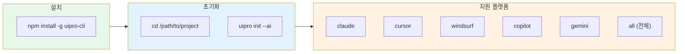

```bash
# CLI 전역 설치
npm install -g uipro-cli

# 프로젝트로 이동
cd /path/to/your/project

# AI 어시스턴트별 설치
uipro init --ai claude      # Claude Code
uipro init --ai cursor      # Cursor
uipro init --ai windsurf    # Windsurf
uipro init --ai antigravity # Antigravity
uipro init --ai copilot     # GitHub Copilot
uipro init --ai kiro        # Kiro
uipro init --ai codex       # Codex CLI
uipro init --ai gemini      # Gemini CLI
uipro init --ai all         # 모든 어시스턴트
```

### 기타 CLI 명령어

```bash
uipro versions              # 사용 가능한 버전 목록
uipro update                # 최신 버전으로 업데이트
uipro init --offline        # GitHub 다운로드 건너뛰기
```

### 사전 요구사항

Python 3.x가 필요합니다:

```bash
# Python 설치 확인
python3 --version

# macOS
brew install python3

# Ubuntu/Debian
sudo apt update && sudo apt install python3

# Windows
winget install Python.Python.3.12
```

### 사용 예시

**Skill Mode (자동 활성화)**

지원: Claude Code, Cursor, Windsurf, Antigravity, Codex CLI, Continue, Gemini CLI, OpenCode, Qoder, CodeBuddy, Droid

```
Build a landing page for my SaaS product

Create a dashboard for healthcare analytics

Design a portfolio website with dark mode

Make a mobile app UI for e-commerce

Build a fintech banking app with dark theme
```

**Workflow Mode (슬래시 명령어)**

지원: Kiro, GitHub Copilot, Roo Code

```
/ui-ux-pro-max Build a landing page for my SaaS product
```

## 고급 기능: 디자인 시스템 명령어

### 직접 디자인 시스템 생성

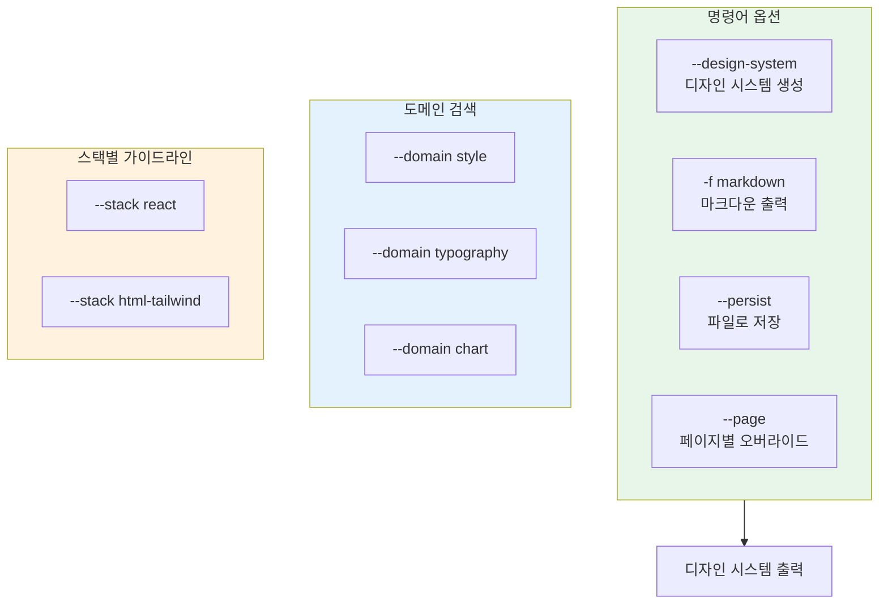

```bash
# ASCII 출력으로 디자인 시스템 생성
python3 .claude/skills/ui-ux-pro-max/scripts/search.py "beauty spa wellness" --design-system -p "Serenity Spa"

# 마크다운 출력으로 생성
python3 .claude/skills/ui-ux-pro-max/scripts/search.py "fintech banking" --design-system -f markdown

# 도메인별 검색
python3 .claude/skills/ui-ux-pro-max/scripts/search.py "glassmorphism" --domain style
python3 .claude/skills/ui-ux-pro-max/scripts/search.py "elegant serif" --domain typography
python3 .claude/skills/ui-ux-pro-max/scripts/search.py "dashboard" --domain chart

# 스택별 가이드라인
python3 .claude/skills/ui-ux-pro-max/scripts/search.py "form validation" --stack react
python3 .claude/skills/ui-ux-pro-max/scripts/search.py "responsive layout" --stack html-tailwind
```

### Master + Overrides 패턴

디자인 시스템을 파일로 저장하여 **세션 간 계층적 검색** 이 가능합니다:

```bash
# MASTER.md로 저장
python3 .claude/skills/ui-ux-pro-max/scripts/search.py "SaaS dashboard" --design-system --persist -p "MyApp"

# 페이지별 오버라이드 파일도 생성
python3 .claude/skills/ui-ux-pro-max/scripts/search.py "SaaS dashboard" --design-system --persist -p "MyApp" --page "dashboard"
```

생성되는 폴더 구조:

```
design-system/
├── MASTER.md           # 전역 소스 오브 트루스 (색상, 타이포그래피, 간격, 컴포넌트)
└── pages/
    └── dashboard.md    # 페이지별 오버라이드 (Master에서 벗어나는 부분만)
```

**계층적 검색 작동 방식:**

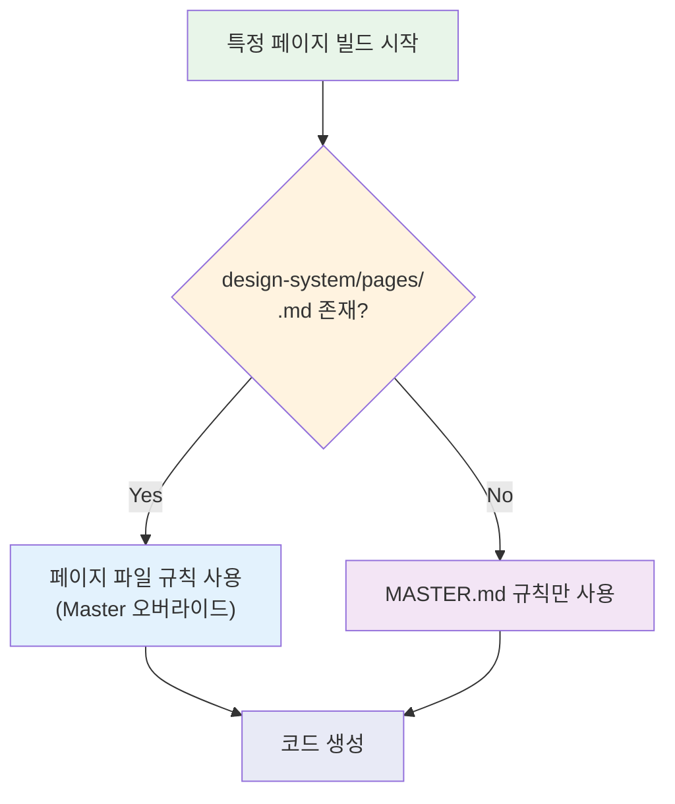

1. 특정 페이지(예: "Checkout")를 빌드할 때, 먼저 `design-system/pages/checkout.md` 확인
2. 페이지 파일이 존재하면, 해당 규칙이 **Master 파일을 오버라이드**
3. 없으면 `design-system/MASTER.md` 만 사용

**컨텍스트 인식 검색 프롬프트:**

```
I am building the [Page Name] page. Please read design-system/MASTER.md.
Also check if design-system/pages/[page-name].md exists.
If the page file exists, prioritize its rules.
If not, use the Master rules exclusively.
Now, generate the code...
```

## 아키텍처 및 기여 방법

### 프로젝트 구조

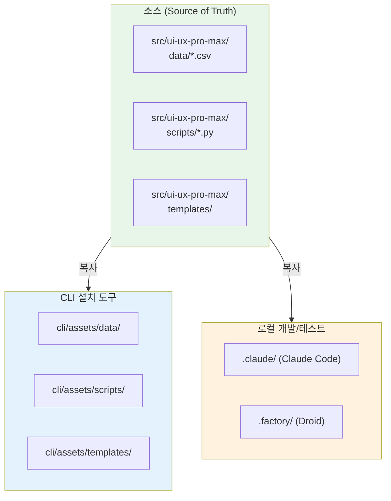

### 기여자를 위한 가이드

```bash
# 1. 저장소 클론
git clone https://github.com/nextlevelbuilder/ui-ux-pro-max-skill.git
cd ui-ux-pro-max-skill

# 2. 구조 이해
src/ui-ux-pro-max/           # 소스 오브 트루스 (데이터, 스크립트, 템플릿)
cli/                         # CLI 설치 도구 (템플릿에서 파일 생성)
.claude/                     # Claude Code 스킬 로컬 개발/테스트
.factory/                    # Droid (Factory) 스킬 로컬 개발/테스트

# 3. src/ui-ux-pro-max/에서 수정
# - data/*.csv              → 데이터베이스 파일
# - scripts/*.py            → 검색 엔진 & 디자인 시스템
# - templates/              → 플랫폼별 템플릿

# 4. CLI로 동기화 및 로컬 테스트
cp -r src/ui-ux-pro-max/data/* cli/assets/data/
cp -r src/ui-ux-pro-max/scripts/* cli/assets/scripts/
cp -r src/ui-ux-pro-max/templates/* cli/assets/templates/

# 5. CLI 빌드 및 테스트
cd cli && bun run build
node dist/index.js init --ai claude --offline  # 임시 폴더에서 테스트

# 6. PR 생성 (main에 직접 푸시 금지)
git checkout -b feat/your-feature
git commit -m "feat: description"
git push -u origin feat/your-feature
gh pr create
```

### 템플릿 기반 생성 시스템

모든 플랫폼별 파일(`.cursor/`, `.windsurf/`, `.kiro/`, `.factory/` 등)은 CLI에 의해 동적으로 생성됩니다. **항상 CLI를 사용하여 설치** 해야 최신 템플릿과 올바른 파일 구조를 얻을 수 있습니다.

## 핵심 요약

| 항목 | 내용 |
|------|------|
| **제품명** | UI UX Pro Max Skill |
| **버전** | v2.0 |
| **핵심 기능** | AI 기반 디자인 시스템 생성기 |
| **UI 스타일** | 67개 (일반 49개, 랜딩 8개, 대시보드 10개) |
| **추론 규칙** | 100개 산업별 규칙 |
| **색상 팔레트** | 96개 산업별 팔레트 |
| **폰트 페어링** | 57개 Google Fonts 조합 |
| **차트 유형** | 25개 |
| **기술 스택** | 13개 (React, Vue, Svelte, Flutter, SwiftUI 등) |
| **UX 가이드라인** | 99개 |
| **라이선스** | MIT |
| **CLI 설치** | `npm install -g uipro-cli` |

## 결론

UI UX Pro Max Skill은 AI 어시스턴트를 위한 강력한 디자인 인텔리전스 도구입니다. v2.0의 **Design System Generator** 는 단순한 스타일 추천을 넘어, 산업별 맞춤형 디자인 시스템을 자동으로 생성합니다.

특히 **100개의 산업별 추론 규칙** 과 **멀티 도메인 검색** 을 통해, 사용자가 "뷰티 스파 랜딩 페이지를 만들어줘"라고 요청하면, 해당 산업에 적합한 패턴, 스타일, 색상, 타이포그래피, 안티 패턴까지 포함한 완전한 디자인 시스템을 제공합니다.

**Master + Overrides 패턴** 을 통한 계층적 디자인 시스템 관리와 **13개 기술 스택** 지원으로, 다양한 프로젝트에서 일관된 디자인 품질을 유지할 수 있습니다.

Claude Code, Cursor, Windsurf, GitHub Copilot 등 주요 AI 코딩 어시스턴트를 사용하는 개발자라면, `npm install -g uipro-cli` 한 줄로 설치하여 즉시 활용할 수 있습니다.
