Java 21에서 정식 도입된 Virtual Threads(JEP 444) 는 "가벼운 스레드를 수백만 개 만들 수 있다"는 개념만으로도 관심을 끌었습니다. 하지만 실제 프로덕션에서 어떤 문제가 생기고, 프레임워크 수준에서 어떻게 설계해야 하는지를 다루는 자료는 많지 않습니다. 이 글은 Oracle Helidon 팀 Joe DiPalma의 발표를 기반으로, Virtual Threads를 **프레임워크 설계 중심** 에 놓았을 때 무엇이 달라지는지, 그리고 운영에서 반드시 알아야 할 핀닝·동시성 제어·Thread Local 이슈를 정리합니다.

<!--more-->

## Sources

- https://www.youtube.com/watch?v=2vhq2I5bSG0
- https://openjdk.org/jeps/444 (JEP 444: Virtual Threads)
- https://openjdk.org/jeps/491 (JEP 491: Synchronize Virtual Threads without Pinning)
- https://openjdk.org/jeps/487 (JEP 487: Scoped Values)
- https://openjdk.org/jeps/499 (JEP 499: Structured Concurrency, 4th Preview)
- https://helidon.io

## 1. Virtual Threads 핵심 개념과 Helidon의 설계 철학

### Virtual Threads가 해결하는 문제

기존 Java의 플랫폼 스레드(Platform Thread)는 OS 스레드와 1:1로 매핑됩니다. 스레드 하나가 약 1MB의 스택 메모리를 차지하므로, 수천 개의 동시 요청을 처리하려면 스레드 풀 크기에 물리적 한계가 생깁니다. 이 한계를 돌파하기 위해 등장한 것이 리액티브/비동기 프로그래밍이지만, 코드 복잡도와 디버깅 난이도라는 새로운 비용이 발생합니다.

Virtual Threads는 JVM이 관리하는 경량 스레드입니다. OS 스레드가 아니라 JVM 내부 스케줄러가 소수의 캐리어 스레드(carrier thread) 위에 수백만 개의 Virtual Thread를 멀티플렉싱합니다. I/O 블로킹이 발생하면 Virtual Thread는 캐리어 스레드에서 **언마운트(unmount)** 되어 다른 Virtual Thread가 올라올 수 있습니다.

- 근거(영상): https://youtu.be/2vhq2I5bSG0?t=120
- 신뢰도: 높음

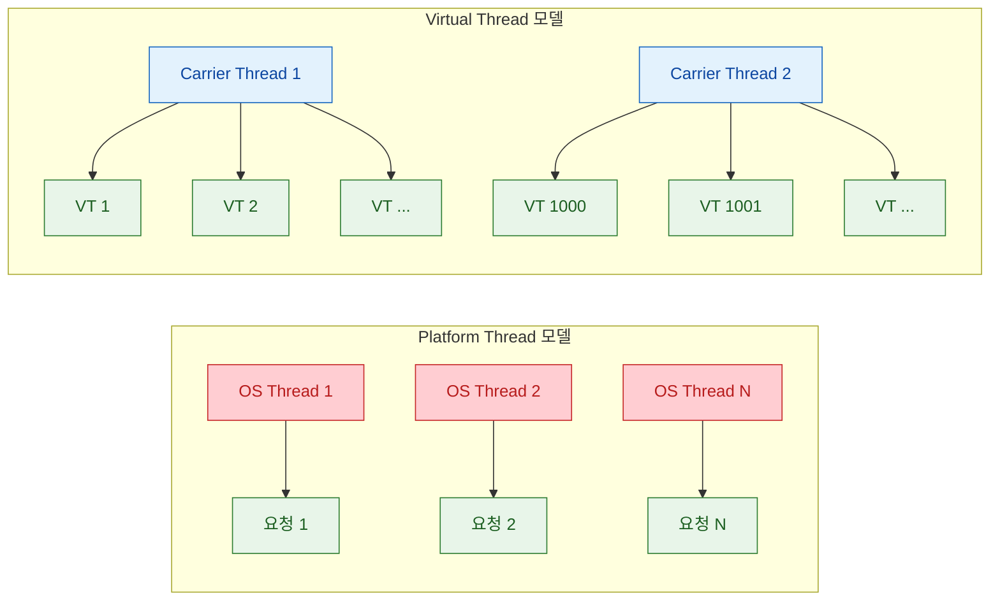

### Virtual Threads 타임라인

발표에서는 Virtual Threads의 발전 과정을 다음과 같이 정리합니다.

| 버전 | 상태 | 주요 변화 |
|------|------|----------|
| Java 19 | Preview | JEP 425 — 첫 프리뷰 |
| Java 21 | **정식(GA)** | JEP 444 — 정식 도입 |
| Java 24 | 개선 | JEP 491 — synchronized 핀닝 해결 |

- 근거(영상): https://youtu.be/2vhq2I5bSG0?t=155
- 신뢰도: 높음

### Helidon이란?

**Helidon** 은 Oracle이 만든 Java 마이크로서비스 프레임워크로, 100% 오픈소스(Apache 2.0 라이선스)입니다. 두 가지 프로그래밍 모델을 제공합니다.

- **Helidon SE**: 함수형/빌더 기반, 블로킹 스타일
- **Helidon MP**: MicroProfile 기반, 선언적(어노테이션) 스타일

발표자 Joe DiPalma는 Helidon 팀의 수석 개발자로, Helidon 4에서 Virtual Threads를 **설계의 중심(design center)** 으로 놓고 웹 서버 자체를 처음부터 다시 작성했다고 설명합니다. 이것이 다른 프레임워크가 기존 비동기 엔진 위에 Virtual Threads를 "얹는" 접근과 근본적으로 다른 지점입니다.

- 근거(영상): https://youtu.be/2vhq2I5bSG0?t=210
- 신뢰도: 높음

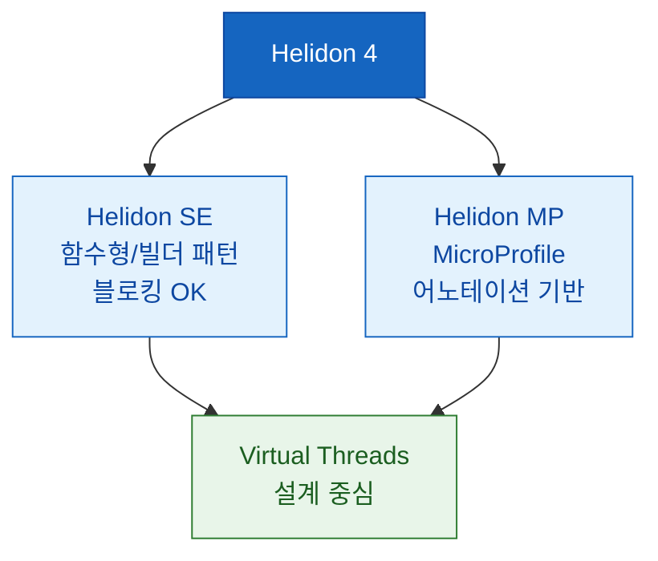

## 2. Helidon 3→4 아키텍처 전환: Netty에서 Nima로

### 왜 Netty를 버렸는가

Helidon 3까지는 Netty 기반 웹 서버를 사용했습니다. Netty는 이벤트 루프 + 비동기 I/O 모델로, **"절대 블로킹하지 마라"** 가 핵심 규칙입니다. Netty의 워커 스레드를 블로킹하면 전체 서버 처리량이 급감합니다.

Helidon 4에서는 Netty를 완전히 제거하고, **Nima** 라는 이름의 새 웹 서버를 소켓 레벨부터 직접 구현했습니다. Nima의 설계 원칙은 정반대입니다: **"블로킹해도 괜찮다(blocking is OK)"**. 요청마다 Virtual Thread 하나를 생성하고, 그 안에서 자유롭게 블로킹 I/O를 수행합니다.

- 근거(영상): https://youtu.be/2vhq2I5bSG0?t=420
- 신뢰도: 높음

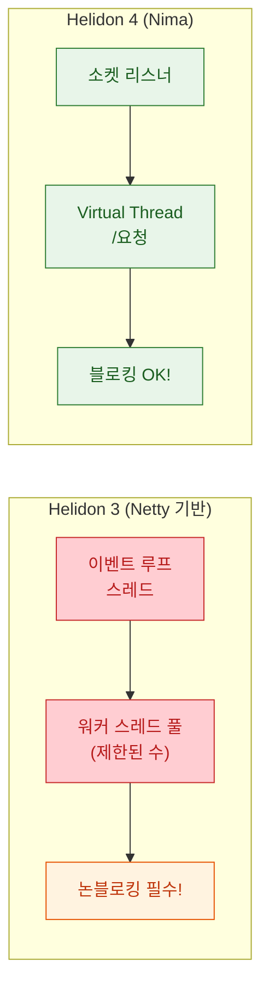

### 코드 비교: 리액티브 vs 블로킹

발표에서 가장 인상적인 부분 중 하나는 같은 기능을 리액티브 코드와 블로킹 코드로 비교하는 장면입니다.

**리액티브 코드 (Helidon 3 스타일)**:
- `flatMap`, `onErrorResume`, `subscribeOn` 등 체이닝
- 콜백 지옥에 가까운 에러 처리
- 스택 트레이스가 불완전 — 디버깅이 어려움

**블로킹 코드 (Helidon 4 스타일)**:
- 일반적인 `try-catch` 블록
- 순차적으로 읽히는 코드 흐름
- 완전한 스택 트레이스 — 디버깅이 쉬움

발표자는 "제대로 최적화된 리액티브 코드가 이론적으로 더 빠를 수 있지만, 현실에서 그런 코드를 작성하는 사람은 거의 없다"고 강조합니다. Virtual Threads는 **대부분의 개발자에게 더 나은 성능과 안정적인 레이턴시를 동시에 제공** 합니다.

- 근거(영상): https://youtu.be/2vhq2I5bSG0?t=620
- 신뢰도: 높음

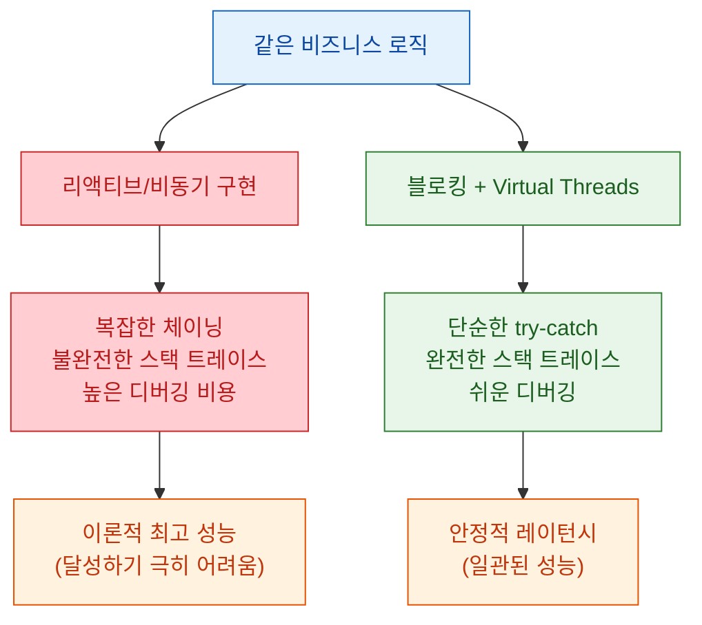

### Nima의 기술적 특징

발표 중 Q&A에서 Oracle의 Richard Bear는 Nima 웹 서버의 코드 품질을 높이 평가합니다. "소스 코드가 매우 깔끔하고, 전체 Virtual Thread 웹 서버가 수백 KB 수준"이라는 것입니다. 이는 Netty의 복잡한 채널 파이프라인과 대비됩니다.

- 근거(영상): https://youtu.be/2vhq2I5bSG0?t=2450
- 신뢰도: 중간 (Q&A 맥락의 개인 의견이지만, Oracle 내부 개발자 관점이므로 참고 가치 있음)

## 3. 핀닝(Pinning): Virtual Threads의 가장 큰 운영 이슈

### 핀닝이란?

Virtual Thread가 캐리어 스레드에서 **언마운트되지 못하고 고정(pin)** 되는 현상입니다. 핀닝이 발생하면 해당 캐리어 스레드가 블로킹되어 다른 Virtual Thread가 스케줄링되지 못합니다. 결과적으로 Virtual Threads의 핵심 이점이 사라지고, 기존 플랫폼 스레드 모델과 다를 바 없어집니다.

- 근거(영상): https://youtu.be/2vhq2I5bSG0?t=920
- 신뢰도: 높음

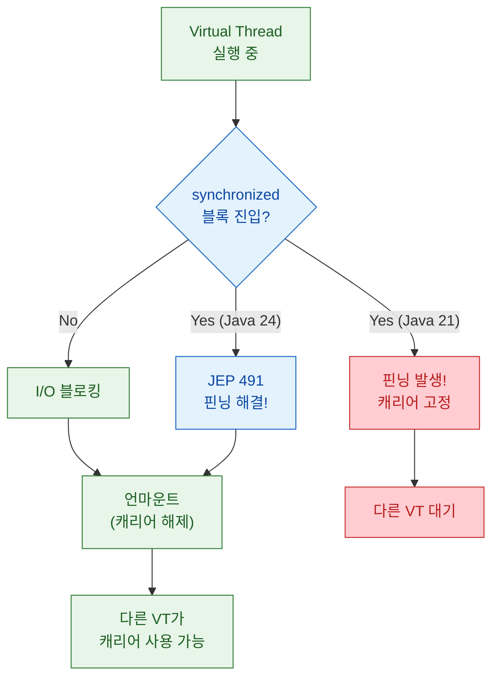

### Java 21에서의 주범: `synchronized`

Java 21에서 핀닝의 1번 원인은 `synchronized` 키워드입니다. `synchronized` 블록/메서드 안에서 블로킹 I/O가 발생하면 Virtual Thread가 캐리어에 고정됩니다. 문제는 개발자 코드뿐 아니라 서드파티 라이브러리, 심지어 JDK 자체에도 `synchronized`가 광범위하게 사용된다는 점입니다.

### Java 24의 해결: JEP 491

**JEP 491** 은 `synchronized` 블록 안에서도 Virtual Thread가 언마운트될 수 있도록 JVM 내부를 수정합니다. 발표자는 이를 "Virtual Threads의 실전 적용에서 가장 큰 변화"로 평가합니다.

- 근거(영상): https://youtu.be/2vhq2I5bSG0?t=1010
- 신뢰도: 높음

### 핀닝 감지 도구

발표에서 소개하는 핀닝 감지 방법은 다음과 같습니다.

| 방법 | 설명 | 적용 시점 |
|------|------|----------|
| 시스템 프로퍼티 | `-Djdk.tracePinnedThreads=full` | 개발/테스트 |
| JFR 이벤트 | `jdk.VirtualThreadPinned` | 개발/운영 |
| Helidon 4.2 테스트 지원 | 테스트 실행 시 자동 핀닝 감지 | CI/테스트 |
| Helidon 메트릭스 | 런타임 핀닝 카운터 | 운영 모니터링 |

- 근거(영상): https://youtu.be/2vhq2I5bSG0?t=1100
- 신뢰도: 높음

### 핀닝 대응 실전 팁

1. **Java 24로 업그레이드** — JEP 491로 `synchronized` 핀닝이 근본적으로 해결됩니다.
2. **`synchronized` → `ReentrantLock`** — Java 24 이전 버전에서는 `synchronized`를 `ReentrantLock`으로 교체하면 핀닝을 회피할 수 있습니다.
3. **`ConcurrentHashMap.compute*` 메서드 주의** — 내부적으로 `synchronized`를 사용하므로 핀닝을 유발할 수 있습니다.
4. **서드파티 라이브러리 점검** — JDBC 드라이버 등 외부 라이브러리의 `synchronized` 사용 여부를 확인합니다.

- 근거(영상): https://youtu.be/2vhq2I5bSG0?t=1180
- 신뢰도: 높음

## 4. 동시성 제어와 부하 관리 전략

### Fork Join Pool 튜닝

Virtual Threads는 기본적으로 ForkJoinPool을 캐리어 스레드 풀로 사용합니다. 기본 풀 크기는 CPU 코어 수와 같지만, 발표자는 머신 환경에 따라 튜닝이 필요하다고 설명합니다.

- **고코어 머신** (예: 64코어): 기본값이 적절한 경우가 많음
- **저코어 머신** (예: 2코어 컨테이너): 풀 크기를 늘려야 할 수 있음 — I/O 대기 중 사용 가능한 캐리어가 부족해질 수 있기 때문

- 근거(영상): https://youtu.be/2vhq2I5bSG0?t=1380
- 신뢰도: 높음

### Rate Limiting: 무제한 스레드의 함정

Virtual Threads의 가장 큰 함정 중 하나는 **"스레드를 무제한으로 만들 수 있다"는 착각** 입니다. 스레드 자체는 가벼워도, 각 스레드가 사용하는 DB 커넥션, 외부 API 호출, 메모리 등 하류 리소스(downstream resource)에는 제한이 있습니다.

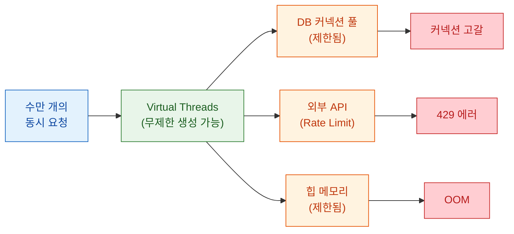

### 동시성 제어 도구

발표에서 제시하는 해법은 다층적입니다.

**1. Semaphore**

Java 표준 `Semaphore`를 사용해 동시 실행 수를 직접 제한합니다.

**2. Helidon max concurrent requests**

Helidon 4는 서버 레벨에서 최대 동시 요청 수를 설정할 수 있으며, 초과 시 **503 Service Unavailable** 을 반환합니다.

**3. 고정/적응형 Rate Limiting 알고리즘**

요청 속도를 고정 윈도우 또는 적응형으로 제한합니다.

**4. Bulkhead (MicroProfile Fault Tolerance)**

Helidon MP에서는 `@Bulkhead` 어노테이션으로 특정 메서드의 동시 실행을 격리합니다. 한 서비스의 과부하가 다른 서비스로 전파되는 것을 방지하는 핵심 패턴입니다.

- 근거(영상): https://youtu.be/2vhq2I5bSG0?t=1550
- 신뢰도: 높음

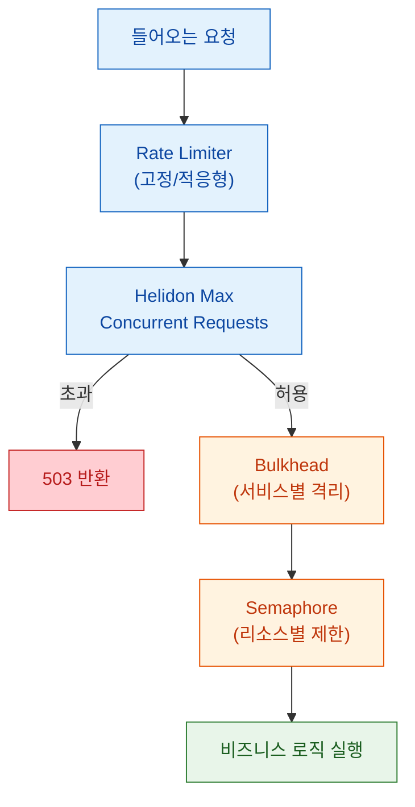

## 5. Thread Local, Scoped Values, 그리고 미래 JEP

### Thread Local의 문제

`ThreadLocal`은 Virtual Threads에서도 기술적으로 동작합니다. 하지만 수백만 개의 Virtual Thread가 생성되는 환경에서는 심각한 문제가 됩니다.

- **메모리 낭비**: Thread마다 ThreadLocal 값의 복사본이 존재 — 수백만 개면 메모리 폭증
- **캐싱 무의미**: 전통적으로 ThreadLocal에 비싼 객체를 캐시하는 패턴이 있었으나, Virtual Thread는 수명이 짧고 수가 많아 캐싱 효과가 없음
- **수명 관리**: ThreadLocal 값의 정리(cleanup)가 누락되면 메모리 누수 발생

- 근거(영상): https://youtu.be/2vhq2I5bSG0?t=1800
- 신뢰도: 높음

### Scoped Values (JEP 487)

**Scoped Values** 는 ThreadLocal의 대안으로 설계되었습니다. 핵심 차이점은 다음과 같습니다.

| 특성 | ThreadLocal | Scoped Values |
|------|------------|---------------|
| 변경 가능성 | 가변(mutable) | **불변(immutable)** |
| 상속 | InheritableThreadLocal 필요 | 자식 스레드에 자동 상속 |
| 수명 | 명시적 정리 필요 | 스코프 종료 시 자동 해제 |
| 메모리 | Thread당 복사본 | 공유 참조 |
| 상태 | Java 24에서 정식 출시 | **JEP 487** |

- 근거(영상): https://youtu.be/2vhq2I5bSG0?t=1880
- 신뢰도: 높음

### Structured Concurrency (JEP 499, 4th Preview)

**Structured Concurrency** 는 여러 Virtual Thread로 분기한 동시 작업을 하나의 구조적 단위로 관리하는 API입니다. 부모 태스크가 취소되면 자식 태스크도 자동으로 취소되고, 에러가 부모로 전파됩니다. Java 24에서 네 번째 프리뷰 단계입니다.

- 근거(영상): https://youtu.be/2vhq2I5bSG0?t=1950
- 신뢰도: 높음

### Project Leiden

발표에서는 **Project Leiden** 도 간략히 언급됩니다. AOT(Ahead-of-Time) 컴파일과 CDS(Class Data Sharing)를 결합해 Java 애플리케이션의 시작 시간과 메모리 사용량을 줄이는 프로젝트입니다. Virtual Threads와 직접 관련은 없지만, 마이크로서비스 배포 시 시작 시간 단축에 기여할 수 있습니다.

- 근거(영상): https://youtu.be/2vhq2I5bSG0?t=2000
- 신뢰도: 중간 (발표에서 간략 언급 수준)

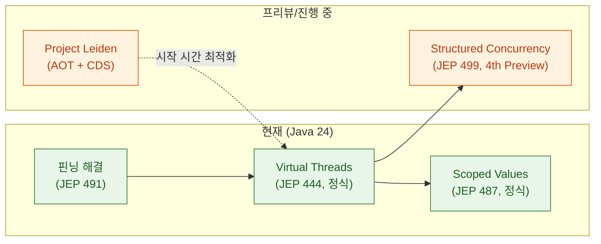

## 6. 패키징과 배포 옵션

Helidon 4는 다양한 패키징 방식을 지원합니다.

### Simple JAR

가장 기본적인 방식입니다. `java -jar` 으로 실행하며, JVM의 모든 기능(JIT, JFR, 디버깅)을 사용할 수 있습니다.

### JLink 런타임 이미지

JLink로 필요한 JDK 모듈만 포함한 커스텀 런타임을 만들 수 있습니다. **CDS(Class Data Sharing)** 를 결합하면 시작 시간이 크게 단축됩니다.

### GraalVM Native Image

AOT 컴파일로 네이티브 바이너리를 생성합니다. 시작 시간이 밀리초 단위로 줄어들지만, 일부 리플렉션 기반 기능에 제약이 있을 수 있습니다.

### CRaC (Coordinated Restore at Checkpoint)

Helidon 4.2에서 **CRaC** 지원이 추가되었습니다. 애플리케이션을 워밍업한 후 체크포인트를 저장하고, 이후 복원(restore)하면 거의 즉시 시작됩니다. JVM의 전체 기능을 유지하면서도 네이티브 이미지에 가까운 시작 시간을 달성할 수 있습니다.

- 근거(영상): https://youtu.be/2vhq2I5bSG0?t=2100
- 신뢰도: 높음

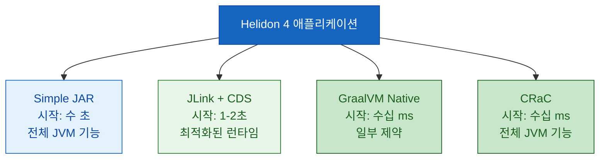

### Helidon 4.2 주요 업데이트

발표에서 소개하는 Helidon 4.2의 주요 변경 사항입니다.

- **Java 24 지원**
- **Helidon Injection**: 소스 코드 우선(source-code-first), 빌드 타임 의존성 주입 — 런타임 리플렉션을 줄여 시작 시간 개선
- **LangChain4j 통합**: AI/LLM 워크로드 지원
- **CRaC 지원**: 체크포인트 기반 빠른 시작

- 근거(영상): https://youtu.be/2vhq2I5bSG0?t=2200
- 신뢰도: 높음

## 7. 성능 특성: Virtual Threads vs 리액티브

발표의 Q&A 세션에서 Virtual Threads와 리액티브(Vert.x, Quarkus 등) 프레임워크의 성능 비교에 대한 흥미로운 논의가 있습니다.

발표자의 핵심 주장은 다음과 같습니다.

- **최대 처리량(peak throughput)**: 완벽하게 최적화된 리액티브 코드가 이론적으로 더 높을 수 있음
- **현실적 레이턴시**: Virtual Threads가 **부하 증가 시에도 안정적인 레이턴시** 를 유지. 리액티브 프레임워크는 부하가 높아지면 레이턴시 스파이크가 발생하는 경향
- **개발자 생산성**: 블로킹 코드가 훨씬 쉽게 작성·디버깅·유지보수 가능

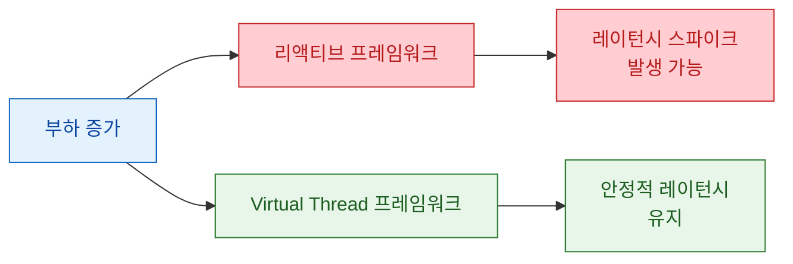

- 근거(영상): https://youtu.be/2vhq2I5bSG0?t=2500
- 신뢰도: 중간 (발표자 관점의 비교이며, 구체적 벤치마크 수치는 제시되지 않음. 단, 프레임워크 개발자로서의 경험적 근거)

## 실전 적용 포인트

### Virtual Threads 도입 체크리스트

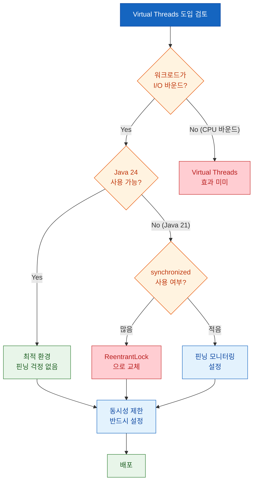

### 핵심 실전 규칙

1. **"무제한 스레드 = 무제한 자원" 이 아님** — Virtual Threads는 가볍지만, 하류 리소스(DB, API)에는 항상 제한이 있습니다. Semaphore, Bulkhead, Max Concurrent Requests 중 적어도 하나는 반드시 설정하세요.

2. **Java 24가 게임 체인저** — JEP 491로 `synchronized` 핀닝이 해결됩니다. 가능하면 Java 24로 업그레이드하는 것이 가장 효과적인 최적화입니다.

3. **ThreadLocal → Scoped Values 전환 준비** — 당장 ThreadLocal이 동작하더라도, 수백만 Virtual Thread 환경에서는 메모리 문제가 발생할 수 있습니다. Scoped Values(JEP 487)로의 점진적 전환을 계획하세요.

4. **핀닝 감지를 CI에 통합** — Helidon 4.2의 테스트 핀닝 감지 또는 `-Djdk.tracePinnedThreads=full` 옵션을 CI 파이프라인에 포함시켜, 핀닝을 조기에 발견하세요.

5. **프레임워크 선택 시 "설계 중심"을 확인** — Virtual Threads를 단순히 "지원"하는 것과, 설계의 중심에 놓는 것은 다릅니다. Helidon 4처럼 처음부터 Virtual Threads를 위해 설계된 프레임워크가 호환성 문제가 적습니다.

## 결론

Virtual Threads는 Java 동시성 프로그래밍의 패러다임을 바꾸고 있지만, "Thread.startVirtualThread()를 호출하면 끝"이 아닙니다. 핀닝 관리, 동시성 제한, ThreadLocal 대체, 그리고 프레임워크 수준의 설계 변화가 함께 필요합니다.

Helidon 4는 이 변화를 프레임워크 설계 자체에 반영한 사례입니다. Netty를 버리고 소켓부터 다시 작성한 Nima 웹 서버, 블로킹을 기본으로 하는 프로그래밍 모델, 그리고 핀닝 감지·동시성 제어를 프레임워크 레벨에서 지원하는 것은 Virtual Threads의 "올바른 사용법"을 보여주는 참고 모델이 됩니다.

Java 24와 함께 JEP 491(핀닝 해결), JEP 487(Scoped Values), JEP 499(Structured Concurrency 4th Preview)가 제공되면서, Virtual Threads 생태계는 빠르게 성숙하고 있습니다. 새 프로젝트를 시작하거나 기존 프로젝트를 리액티브에서 전환하려는 팀이라면, 지금이 Virtual Threads를 진지하게 검토할 적기입니다.
