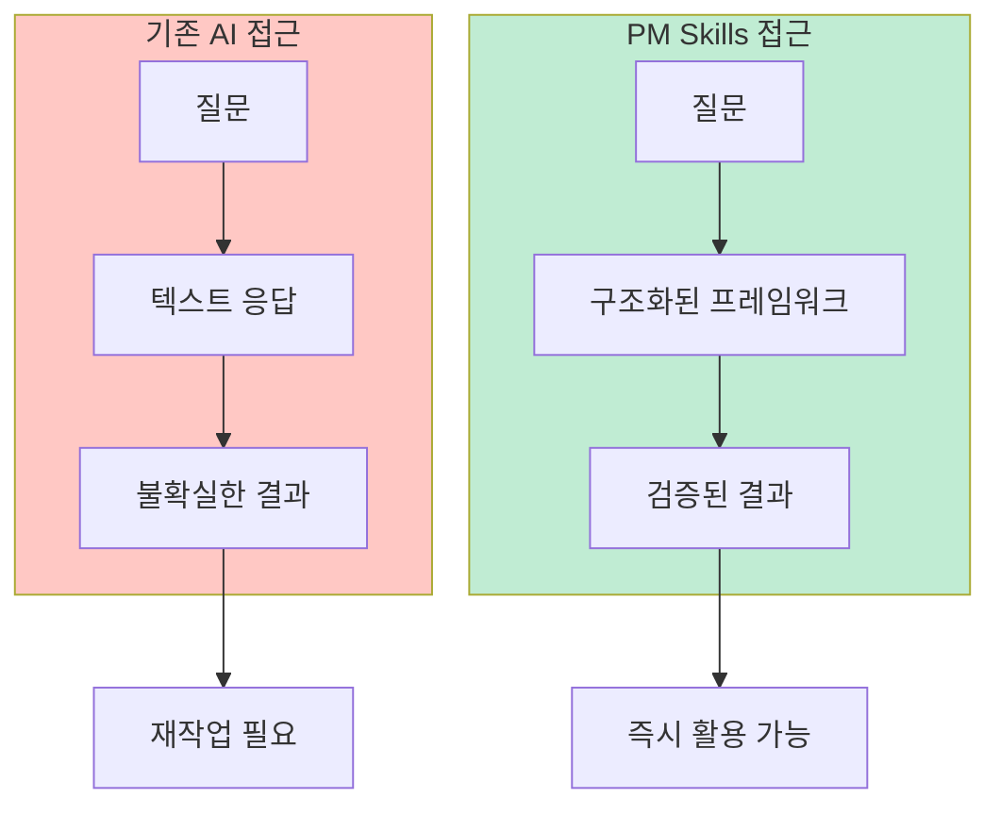
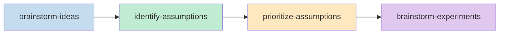
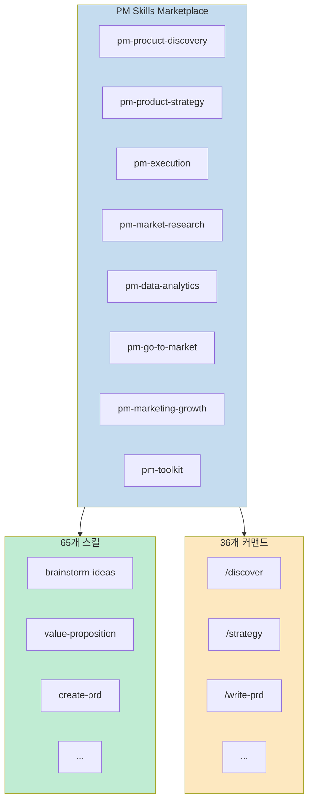
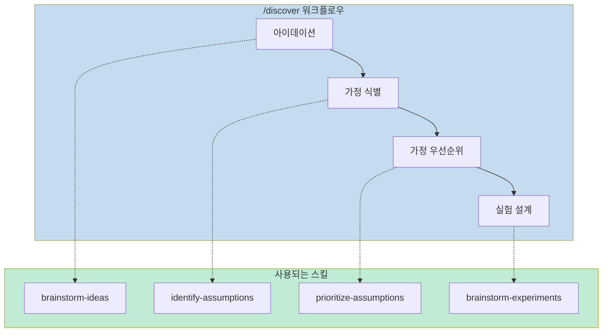
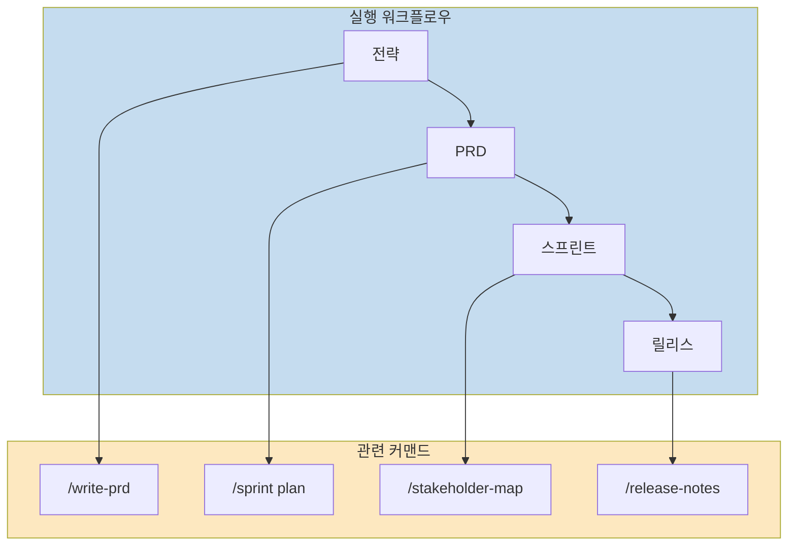
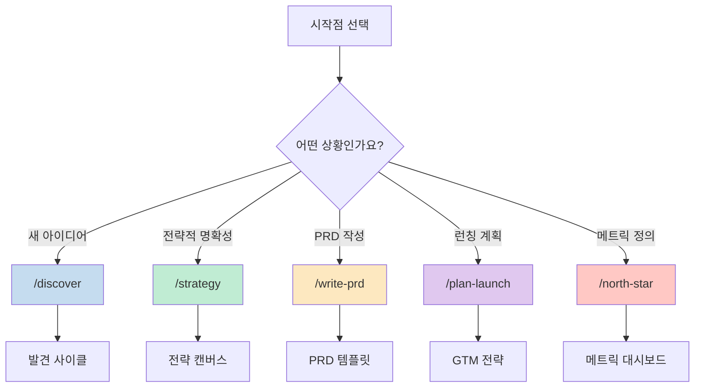

PM(제품 관리자)를 위한 AI 기반 도구가 점점 늘어나고 있습니다. 그중에서도 PM Skills Marketplace는 65개 이상의 PM 스킬과 36개의 체인 워크플로우를 8개의 플러그인으로 묶어 제공하는 종합 솔루션입니다. Claude Code와 Cowork를 위해 설계되었으며, 다른 AI 어시스턴트와도 호환됩니다.

<!--more-->

## Sources

- https://github.com/phuryn/pm-skills

---

## PM Skills Marketplace란 무엇인가

PM Skills Marketplace는 PM의 일상 업무를 AI가 수행할 수 있도록 돕는 스킬, 커맨드, 플러그인의 모음입니다. 일반적인 AI가 단순히 텍스트를 생성하는 것과 달리, PM Skills Marketplace는 **검증된 PM 프레임워크**를 구조화된 워크플로우로 제공합니다.

> "Generic AI gives you text. PM Skills Marketplace gives you structure."
>
> — PM Skills Marketplace

이 마켓플레이스는 Teresa Torres, Marty Cagan, Alberto Savoia 같은 PM 분야의 권위자들의 프레임워크를 일상 워크플로우에 내장합니다. 결과는 더 빠른 문서가 아니라 **더 나은 제품 의사결정**입니다.

### 핵심 철학



---

## 동작 원리: 스킬, 커맨드, 플러그인

PM Skills Marketplace는 세 가지 계층으로 구성됩니다.

### 스킬 (Skills): 빌딩 블록

스킬은 마켓플레이스의 기본 구성 요소입니다. 각 스킬은 Claude에게 도메인 지식, 분석 프레임워크, 또는 특정 PM 작업을 위한 가이드 워크플로우를 제공합니다.

**특징:**
- 대화와 관련성이 높을 때 자동으로 로드됨
- `/plugin-name:skill-name` 또는 `/skill-name`으로 강제 로드 가능
- 여러 커맨드에서 재사용 가능한 기반 역할

### 커맨드 (Commands): 엔드투엔드 워크플로우

커맨드는 `/command-name` 형식으로 호출하는 사용자 트리거 워크플로우입니다. 하나 이상의 스킬을 체인으로 연결해 완전한 프로세스를 만듭니다.

**예시:** `/discover` 커맨드는 4개 스킬을 체인으로 연결:


### 플러그인 (Plugins): 도메인 패키지

플러그인은 관련 스킬과 커맨드를 설치 가능한 패키지로 묶습니다. 각 플러그인은 특정 PM 도메인을 다룹니다.



---

## 8개 플러그인 상세 분석

### 1. pm-product-discovery: 아이디어부터 검증까지

**영역:** 아이데이션, 실험, 가정 검증, OST, 인터뷰

**규모:** 13개 스킬, 5개 커맨드

**주요 스킬:**
| 스킬 | 설명 |
|------|------|
| `brainstorm-ideas-existing` | 기존 제품에 대한 다각적 아이데이션 (PM, 디자이너, 엔지니어 관점) |
| `brainstorm-ideas-new` | 신제품 초기 발견 단계 아이데이션 |
| `identify-assumptions-existing` | Value, Usability, Viability, Feasibility 위험 가정 식별 |
| `opportunity-solution-tree` | Teresa Torres의 OST 구축 |
| `interview-script` | JTBD 탐색 질문이 포함된 구조화된 인터뷰 스크립트 |

**커맨드:**
- `/discover` — 전체 발견 사이클: 아이데이션 → 가정 매핑 → 우선순위 → 실험 설계
- `/brainstorm` — 다각적 아이데이션
- `/triage-requests` — 기능 요청 배치 분석 및 우선순위 지정
- `/interview` — 인터뷰 스크립트 준비 또는 기록 요약
- `/setup-metrics` — 제품 메트릭 대시보드 설계



### 2. pm-product-strategy: 비전부터 경쟁 환경까지

**영역:** 비전, 비즈니스 모델, 가격 설정, 경쟁 환경 분석

**규모:** 12개 스킬, 5개 커맨드

**주요 스킬:**
| 스킬 | 설명 |
|------|------|
| `product-strategy` | 9개 섹션 제품 전략 캔버스 (비전 → 방어 가능성) |
| `startup-canvas` | Product Strategy + Business Model 결합 — BMC/Lean Canvas 대안 |
| `value-proposition` | 6부 JTBD 가치 제안 (Who, Why, What before, How, What after, Alternatives) |
| `porters-five-forces` | 경쟁 세력 분석 (경쟁, 공급자, 구매자, 대체재, 신규 진입자) |
| `ansoff-matrix` | 시장/제품 간 성장 전략 매핑 |

**커맨드:**
- `/strategy` — 완전한 9개 섹션 제품 전략 캔버스 생성
- `/business-model` — 비즈니스 모델 탐색 (`lean|full|startup|value-prop|all`)
- `/value-proposition` — 6부 JTBD 템플릿으로 가치 제안 설계
- `/market-scan` — SWOT + PESTLE + Porter's + Ansoff 결합 거시 환경 분석
- `/pricing` — 경쟁 분석과 실험이 포함된 가격 전략 설계

### 3. pm-execution: 일상 PM 운영

**영역:** PRD, OKR, 로드맵, 스프린트, 회고, 릴리스 노트

**규모:** 15개 스킬, 10개 커맨드

**주요 스킬:**
| 스킬 | 설명 |
|------|------|
| `create-prd` | 종합 8개 섹션 PRD 템플릿 |
| `outcome-roadmap` | 기능 목록을 결과 중심 로드맵으로 변환 |
| `sprint-plan` | 용량 추정, 스토리 선택, 리스크 식별이 포함된 스프린트 계획 |
| `pre-mortem` | Tigers/Paper Tigers/Elephants 분류로 리스크 분석 |
| `prioritization-frameworks` | 9개 우선순위 프레임워크 참조 가이드 (Opportunity Score, ICE, RICE, MoSCoW, Kano 등) |

**커맨드:**
- `/write-prd` — 기능 아이디어나 문제 진술에서 PRD 생성
- `/plan-okrs` — 팀 수준 OKR 브레인스토밍
- `/transform-roadmap` — 기능 중심 로드맵을 결과 중심으로 변환
- `/sprint` — 스프린트 라이프사이클 (`plan|retro|release`)
- `/pre-mortem` — PRD 또는 런칭 계획에 대한 프리모템 리스크 분석
- `/meeting-notes` — 회의 기록을 구조화된 노트로 요약
- `/stakeholder-map` — 이해관계자 매핑 및 커뮤니케이션 계획 수립
- `/write-stories` — 기능을 백로그 항목으로 분해 (`user|job|wwa`)
- `/test-scenarios` — 사용자 스토리에서 테스트 시나리오 생성
- `/generate-data` — 현실적인 더미 데이터셋 생성



### 4. pm-market-research: 사용자와 시장 이해

**영역:** 페르소나, 세분화, 여정 맵, 시장 규모, 경쟁사 분석

**규모:** 7개 스킬, 3개 커맨드

**주요 스킬:**
| 스킬 | 설명 |
|------|------|
| `user-personas` | 연구 데이터에서 정제된 사용자 페르소나 생성 |
| `customer-journey-map` | 단계, 터치포인트, 감정, 페인 포인트가 포함된 엔드투엔드 여정 맵 |
| `market-sizing` | TAM, SAM, SOM — 하향식/상향식 접근법 |
| `competitor-analysis` | 경쟁사 강점, 약점, 차별화 기회 |
| `sentiment-analysis` | 사용자 피드백에서 감정 분석 및 테마 추출 |

**커맨드:**
- `/research-users` — 페르소나 구축, 사용자 세분화, 고객 여정 매핑
- `/competitive-analysis` — 경쟁 환경 분석
- `/analyze-feedback` — 사용자 피드백에서 감정 분석 및 세그먼트 인사이트

### 5. pm-data-analytics: 데이터 기반 의사결정

**영역:** SQL 생성, 코호트 분석, A/B 테스트 분석

**규모:** 3개 스킬, 3개 커맨드

**주요 스킬:**
| 스킬 | 설명 |
|------|------|
| `sql-queries` | 자연어에서 SQL 생성 (BigQuery, PostgreSQL, MySQL) |
| `cohort-analysis` | 코호트별 리텐션 곡선, 기능 채택, 참여 트렌드 |
| `ab-test-analysis` | 통계적 유의성, 표본 크기 검증, ship/extend/stop 권장사항 |

**커맨드:**
- `/write-query` — 자연어에서 SQL 쿼리 생성
- `/analyze-cohorts` — 사용자 참여 데이터에 대한 코호트 분석
- `/analyze-test` — A/B 테스트 결과 분석

### 6. pm-go-to-market: 런칭 전략

**영역:** 비치헤드 세그먼트, ICP, 메시징, 성장 루프, GTM 모션, 배틀카드

**규모:** 6개 스킬, 3개 커맨드

**주요 스킬:**
| 스킬 | 설명 |
|------|------|
| `gtm-strategy` | 전체 GTM 전략: 채널, 메시징, 성공 메트릭, 런칭 계획 |
| `beachhead-segment` | 첫 번째 비치헤드 시장 세그먼트 식별 |
| `ideal-customer-profile` | 인구통계, 행동, JTBD, 니즈가 포함된 ICP |
| `growth-loops` | 지속 가능한 성장 루프(플라이휠) 설계 |
| `competitive-battlecard` | 이의 제기 처리 및 승리 전략이 포함된 영업용 배틀카드 |

**커맨드:**
- `/plan-launch` — 비치헤드부터 런칭 계획까지 전체 GTM 전략
- `/growth-strategy` — 성장 루프 설계 및 GTM 모션 평가
- `/battlecard` — 경쟁 배틀카드 생성

### 7. pm-marketing-growth: 마케팅과 성장

**영역:** 마케팅 아이디어, 포지셔닝, 가치 제안, 네이밍, North Star 메트릭

**규모:** 5개 스킬, 2개 커맨드

**주요 스킬:**
| 스킬 | 설명 |
|------|------|
| `marketing-ideas` | 채널과 메시징이 포함된 창의적이고 비용 효율적인 마케팅 아이디어 |
| `positioning-ideas` | 경쟁사와 차별화된 제품 포지셔닝 |
| `value-prop-statements` | 마케팅, 영업, 온보딩을 위한 가치 제안 문구 |
| `product-name` | 브랜드 가치와 타겟 오디언스에 맞는 제품명 브레인스토밍 |
| `north-star-metric` | North Star 메트릭 + 비즈니스 게임 분류가 포함된 입력 메트릭 |

**커맨드:**
- `/market-product` — 마케팅 아이디어, 포지셔닝, 가치 제안, 제품명 브레인스토밍
- `/north-star` — North Star 메트릭과 지원 입력 메트릭 정의

### 8. pm-toolkit: PM 유틸리티

**영역:** 이력서 검토, 법률 문서, 교정

**규모:** 4개 스킬, 5개 커맨드

**주요 스킬:**
| 스킬 | 설명 |
|------|------|
| `review-resume` | PM 이력서 검토 및 10가지 모범 사례에 맞춤 (XYZ+S 공식, 키워드, 구조) |
| `draft-nda` | 관할 구역에 적절한 조항이 포함된 비공개 계약서 |
| `privacy-policy` | GDPR/CCPA 규정 준수를 다루는 개인정보 처리방침 |
| `grammar-check` | 문법, 논리, 흐름 검사 및 대상 수정 |

**커맨드:**
- `/review-resume` — 종합 PM 이력서 검토
- `/tailor-resume` — 특정 직무 기술서에 맞게 이력서 조정
- `/draft-nda` — NDA 초안 작성
- `/privacy-policy` — 개인정보 처리방침 초안 작성
- `/proofread` — 문법, 논리, 흐름 검사

---

## 설치 방법

### Claude Cowork (비개발자 권장)


### Claude Code (CLI)

```bash
# Step 1: 마켓플레이스 추가
claude plugin marketplace add phuryn/pm-skills

# Step 2: 개별 플러그인 설치
claude plugin install pm-toolkit@pm-skills
claude plugin install pm-product-strategy@pm-skills
claude plugin install pm-product-discovery@pm-skills
claude plugin install pm-market-research@pm-skills
claude plugin install pm-data-analytics@pm-skills
claude plugin install pm-marketing-growth@pm-skills
claude plugin install pm-go-to-market@pm-skills
claude plugin install pm-execution@pm-skills
```

### 다른 AI 어시스턴트 (스킬만)

`skills/*/SKILL.md` 파일은 범용 스킬 형식을 따르며, 이를 읽을 수 있는 모든 도구에서 작동합니다. 커맨드(`/slash-commands`)는 Claude 전용입니다.

| 도구 | 사용 방법 | 작동 범위 |
|------|-----------|-----------|
| **Gemini CLI** | 스킬 폴더를 `.gemini/skills/`에 복사 | 스킬만 |
| **OpenCode** | 스킬 폴더를 `.opencode/skills/`에 복사 | 스킬만 |
| **Cursor** | 스킬 폴더를 `.cursor/skills/`에 복사 | 스킬만 |
| **Codex CLI** | 스킬 폴더를 `.codex/skills/`에 복사 | 스킬만 |
| **Kiro** | 스킬 폴더를 `.kiro/skills/`에 복사 | 스킬만 |

```bash
# 예시: Gemini CLI용 모든 스킬 복사 (전역)
for plugin in pm-*/; do
  cp -r "$plugin/skills/"* ~/.gemini/skills/ 2>/dev/null
done
```

---

## 시작하기: 5가지 진입점

새로운 아이디어가 있나요? 전략적 명확성이 필요한가요? PM Skills Marketplace는 5가지 핵심 진입점을 제공합니다.



| 상황 | 커맨드 | 결과물 |
|------|--------|--------|
| 새로운 제품 아이디어 | `/discover` | 아이디어 → 가정 → 우선순위 → 실험 |
| 전략적 방향성 필요 | `/strategy` | 9개 섹션 제품 전략 캔버스 |
| PRD 작성 | `/write-prd` | 8개 섹션 PRD |
| 제품 런칭 계획 | `/plan-launch` | 비치헤드부터 런칭까지 GTM 전략 |
| 메트릭 정의 | `/north-star` | North Star + 입력 메트릭 |

---

## 이론적 기반

PM Skills Marketplace는 검증된 PM 이론과 실무를 기반으로 합니다.

| 저자 | 저서 | 적용 스킬 |
|------|------|-----------|
| Teresa Torres | Continuous Discovery Habits | opportunity-solution-tree, discovery 워크플로우 |
| Marty Cagan | INSPIRED, TRANSFORMED | 제품 전략, 발견 프로세스 |
| Alberto Savoia | The Right It | brainstorm-experiments-new (프리토타입) |
| Dan Olsen | The Lean Product Playbook | 가정 검증, 실험 설계 |
| Roger L. Martin | Playing to Win | product-strategy 캔버스 |
| Ash Maurya | Running Lean | lean-canvas, 가정 매핑 |
| Strategyzer | Business Model Generation, Value Proposition Design | business-model, value-proposition |
| Christina Wodtke | Radical Focus | OKR, 스프린트 계획 |
| Anthony W. Ulwick | Jobs to Be Done | JTBD 기반 스킬들 |
| Alistair Croll & Benjamin Yoskovitz | Lean Analytics | 메트릭, 코호트 분석 |
| Sean Ellis | Hacking Growth | 성장 루프, North Star |
| Maja Voje | Go-To-Market Strategist | GTM 전략 |

이 마켓플레이스는 Paweł Huryn이 The Product Compass Newsletter를 통해 큐레이션했습니다.

---

## 핵심 요약

1. **종합성**: 65개 스킬과 36개 커맨드로 PM의 전 영역(Discovery → Strategy → Execution → Launch → Growth)을 커버
2. **구조화**: 일반 AI의 텍스트 생성이 아닌 검증된 프레임워크 기반 구조화된 결과물
3. **유연성**: Claude Code/Cowork에 최적화되었으나 다른 AI 어시스턴트에서도 스킬 활용 가능
4. **체인 가능**: 커맨드가 서로 연결되어 PM 워크플로우를 자연스럽게 따라감
5. **이론적 기반**: Teresa Torres, Marty Cagan, Alberto Savoia 등 PM 권위자들의 프레임워크 내장

---

## 결론

PM Skills Marketplace는 AI 시대의 PM을 위한 종합 도구 세트입니다. 단순히 문서를 더 빨리 작성하는 것이 아니라, 검증된 프레임워크를 통해 더 나은 제품 의사결정을 내리는 데 도움을 줍니다.

65개의 스킬과 36개의 워크플로우가 8개의 플러그인으로 정리되어 있어, PM 업무의 어느 단계에서든 적절한 도구를 찾을 수 있습니다. 새로운 아이디어를 발견하는 단계부터 제품을 런칭하고 성장시키는 단계까지, AI와 협업하여 체계적이고 검증된 접근법을 적용할 수 있습니다.

이 프로젝트가 도움이 되었다면 GitHub 저장소에 ⭐를 남겨주세요.
