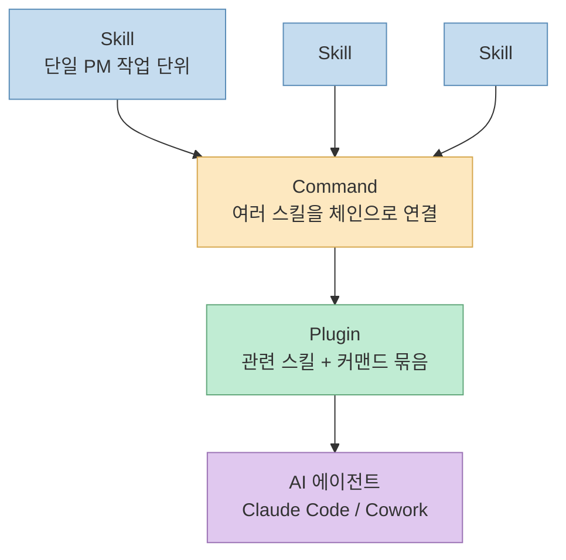
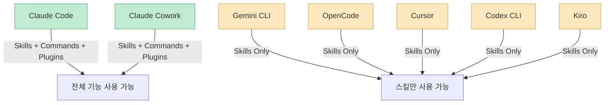
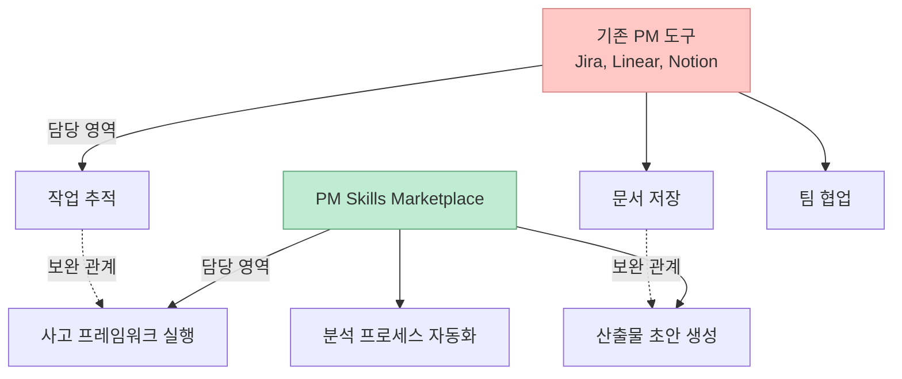
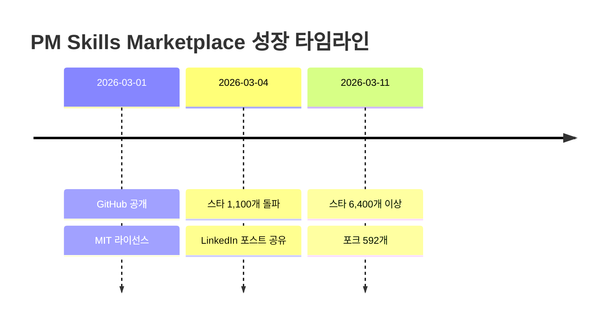

PM이 일상적으로 반복하는 작업 — PRD 작성, 경쟁사 분석, 사용자 인터뷰 스크립트 준비, OKR 설정, A/B 테스트 결과 해석 — 을 AI 에이전트가 대신 수행할 수 있다면 어떨까요. **PM Skills Marketplace** 는 이 질문에 대한 구체적인 답을 오픈소스로 내놓은 프로젝트입니다. 65개의 개별 스킬, 36개의 체인 워크플로, 8개의 설치 가능한 플러그인으로 구성되어 있으며, 공개 3일 만에 GitHub 스타 1,100개를 넘기고 현재 6,400개 이상의 스타를 기록하고 있습니다.

<!--more-->

## Sources

- [GitHub - phuryn/pm-skills](https://github.com/phuryn/pm-skills)
- [Product Compass - PM Skills Marketplace for Claude](https://www.productcompass.pm/p/pm-skills-marketplace-claude)

## PM Skills Marketplace란 무엇인가

PM Skills Marketplace는 **Paweł Huryn** 이 만든 오픈소스 프로젝트로, AI 코딩 에이전트(특히 Claude Code와 Claude Cowork)에 PM 전문 역량을 부여하는 스킬 컬렉션입니다. Huryn은 구독자 10만 명 이상의 뉴스레터 **The Product Compass** 를 운영하며, 자신을 "#1 AI Newsletter for Product People"로 소개합니다.

이 프로젝트의 핵심 아이디어는 단순합니다. PM이 매일 수행하는 업무를 **구조화된 프롬프트 + 워크플로** 로 변환하여, AI 에이전트가 일관되고 재현 가능한 방식으로 실행하도록 만드는 것입니다. 단순한 프롬프트 모음이 아니라, 실무에서 검증된 PM 프레임워크를 AI가 이해할 수 있는 구조적 명세로 인코딩한 것이 차별점입니다.



이 3-레이어 구조가 PM Skills Marketplace의 아키텍처 전체를 관통합니다.

- **Skill** (65개): 가장 작은 빌딩 블록. 하나의 PM 작업을 수행합니다. 예를 들어 "사용자 페르소나 생성", "경쟁사 분석", "PRD 작성" 같은 개별 태스크입니다.
- **Command** (36개): 여러 스킬을 순차적으로 엮은 체인 워크플로입니다. 예를 들어 "discovery" 커맨드는 아이디어 발상 → 가정 식별 → 실험 설계를 한 번에 실행합니다.
- **Plugin** (8개): 관련 스킬과 커맨드를 하나의 설치 가능한 패키지로 묶은 것입니다. `claude plugin add` 한 줄로 설치합니다.

## 8개 플러그인의 구조와 역할

PM Skills Marketplace는 PM 업무를 8개의 도메인으로 분류하고, 각각을 독립적인 플러그인으로 패키징했습니다.

```mermaid
flowchart TD
    classDef discovery fill:#c5dcef,stroke:#5b8db8,color:#333
    classDef strategy fill:#fde8c0,stroke:#d6a84f,color:#333
    classDef execution fill:#c0ecd3,stroke:#63a87c,color:#333
    classDef research fill:#ffc8c4,stroke:#d98686,color:#333
    classDef analytics fill:#e0c8ef,stroke:#9b73b5,color:#333
    classDef gtm fill:#d4edda,stroke:#6dbb8a,color:#333
    classDef growth fill:#fff3cd,stroke:#c9a842,color:#333
    classDef toolkit fill:#d6d6d6,stroke:#999,color:#333

    M["PM Skills Marketplace<br/>65 Skills · 36 Commands · 8 Plugins"]

    D["pm-product-discovery<br/>13 Skills · 5 Commands"]:::discovery
    S["pm-product-strategy<br/>12 Skills · 5 Commands"]:::strategy
    E["pm-execution<br/>15 Skills · 10 Commands"]:::execution
    R["pm-market-research<br/>7 Skills · 3 Commands"]:::research
    A["pm-data-analytics<br/>3 Skills · 3 Commands"]:::analytics
    G["pm-go-to-market<br/>6 Skills · 3 Commands"]:::gtm
    GR["pm-marketing-growth<br/>5 Skills · 2 Commands"]:::growth
    T["pm-toolkit<br/>4 Skills · 5 Commands"]:::toolkit

    M --> D
    M --> S
    M --> E
    M --> R
    M --> A
    M --> G
    M --> GR
    M --> T
```



각 플러그인이 담당하는 영역을 구체적으로 살펴보겠습니다.

### pm-product-discovery (13 Skills, 5 Commands)

제품 발견 단계의 핵심 활동을 다룹니다. Teresa Torres의 **Continuous Discovery Habits** 프레임워크가 직접 반영되어 있습니다.

주요 스킬:
- **opportunity-solution-tree**: Teresa Torres의 OST(Opportunity Solution Tree) 기법으로 목표 → 기회 → 솔루션 → 실험을 구조화합니다.
- **interview-script**: The Mom Test 원칙에 따라 유도 질문을 배제한 고객 인터뷰 스크립트를 생성합니다.
- **brainstorm-ideas-existing / brainstorm-ideas-new**: PM, 디자이너, 엔지니어 3인 관점에서 아이디어를 발산합니다.
- **identify-assumptions-existing / identify-assumptions-new**: Value, Usability, Viability, Feasibility 4축으로 리스크 가정을 분류합니다.
- **prioritize-assumptions**: 영향도 × 리스크 매트릭스로 어떤 가정을 먼저 검증할지 정합니다.

체인 워크플로 예시:
- **discover**: 아이디어 발상 → 가정 매핑 → 실험 설계를 순차 실행합니다.
- **interview**: 인터뷰 스크립트 작성 또는 인터뷰 트랜스크립트를 구조화된 인사이트로 요약합니다.

### pm-product-strategy (12 Skills, 5 Commands)

제품 전략 수립에 필요한 분석 프레임워크를 인코딩합니다.

주요 스킬:
- **business-model**: Business Model Canvas 9개 빌딩 블록을 생성합니다.
- **lean-canvas**: Ash Maurya의 Lean Canvas를 구조화합니다.
- **product-strategy**: 비전, 세그먼트, 비용, 가치 제안, 트레이드오프, 지표, 성장, 역량, 방어력 등 9개 섹션의 전략 캔버스를 작성합니다.
- **swot-analysis / pestle-analysis / porters-five-forces**: 전통적인 전략 분석 프레임워크를 실행합니다.
- **value-proposition**: JTBD(Jobs-to-be-Done) 6파트 템플릿으로 가치 제안을 설계합니다.

체인 워크플로 예시:
- **market-scan**: SWOT, PESTLE, Porter's Five Forces, Ansoff Matrix를 한 번에 실행하는 종합 매크로 환경 분석입니다.
- **strategy**: 9개 섹션 전략 캔버스를 비전부터 방어력까지 순차적으로 완성합니다.

### pm-execution (15 Skills, 10 Commands)

실행 단계의 구체적인 산출물을 다룹니다. 가장 스킬과 커맨드 수가 많은 플러그인입니다.

주요 스킬:
- **create-prd**: 8개 섹션 템플릿으로 PRD(Product Requirements Document)를 작성합니다.
- **user-stories / job-stories / wwas**: 각각 User Story(3C + INVEST), Job Story(When-I want-So I can), WWA(Why-What-Acceptance) 형식으로 백로그 항목을 생성합니다.
- **brainstorm-okrs**: 회사 목표와 정렬된 팀 OKR을 발산합니다.
- **test-scenarios**: 사용자 스토리로부터 테스트 시나리오를 자동 생성합니다.
- **pre-mortem**: PRD나 런칭 계획에 대해 Tiger(실제 문제), Paper Tiger(과장된 우려), Elephant(말 못하는 걱정) 3분류 리스크 분석을 수행합니다.
- **stakeholder-map**: Power/Interest 그리드로 이해관계자 맵을 구축하고 커뮤니케이션 계획을 생성합니다.

체인 워크플로 예시:
- **sprint**: 스프린트 계획, 회고, 릴리스 노트 생성을 하나의 워크플로로 엮습니다.
- **write-stories**: 기능을 백로그 항목으로 쪼개되, 선호 형식(User Story, Job Story, WWA)을 선택할 수 있습니다.

### pm-market-research (7 Skills, 3 Commands)

시장과 사용자 이해에 초점을 맞춥니다.

주요 스킬:
- **user-personas**: 리서치 데이터로부터 3개 이상의 사용자 페르소나를 JTBD, 페인 포인트, 게인과 함께 생성합니다.
- **competitor-analysis**: 경쟁사 강점, 약점, 차별화 기회를 분석합니다.
- **customer-journey-map**: 터치포인트, 감정, 페인 포인트, 기회가 포함된 종단간 고객 여정 맵을 만듭니다.
- **market-sizing**: TAM, SAM, SOM을 Top-down과 Bottom-up 양방향으로 추정합니다.
- **sentiment-analysis**: 피드백 데이터에서 세그먼트별 감성 점수와 JTBD를 추출합니다.

체인 워크플로 예시:
- **research-users**: 페르소나 빌드 → 사용자 세그먼테이션 → 고객 여정 매핑을 순차 실행합니다.

### pm-data-analytics (3 Skills, 3 Commands)

데이터 분석과 실험 해석을 담당합니다.

주요 스킬:
- **sql-queries**: 자연어 설명을 BigQuery, PostgreSQL, MySQL 등의 SQL 쿼리로 변환합니다.
- **ab-test-analysis**: A/B 테스트 결과의 통계적 유의성, 표본 크기 검증, 신뢰 구간을 분석하고 Ship/Extend/Stop 의사결정을 권고합니다.
- **cohort-analysis**: 코호트별 리텐션 커브, 기능 채택률, 참여 트렌드를 분석합니다.

### pm-go-to-market (6 Skills, 3 Commands)

시장 진입 전략 수립을 지원합니다.

주요 스킬:
- **beachhead-segment**: Burning Pain, 지불 의향, 시장 점유 가능성, 추천 잠재력을 평가해 첫 시장 세그먼트를 선정합니다.
- **growth-loops**: Viral, Usage, Collaboration, UGC, Referral 5가지 성장 루프를 평가합니다.
- **competitive-battlecard**: 포지셔닝, 기능 비교, 반론 대응, 승리 전략이 담긴 영업용 배틀카드를 생성합니다.
- **ideal-customer-profile**: PMF 서베이 데이터에서 ICP를 추출합니다.

체인 워크플로 예시:
- **plan-launch**: Beachhead 세그먼트 → ICP → 메시징 → 채널 → 런칭 플랜을 순차적으로 완성합니다.

### pm-marketing-growth (5 Skills, 2 Commands)

마케팅과 성장 지표에 집중합니다.

주요 스킬:
- **north-star-metric**: 비즈니스 유형(Attention, Transaction, Productivity)을 분류하고 7개 기준으로 North Star Metric을 검증합니다.
- **marketing-ideas**: 비용 효율적인 5개 마케팅 아이디어를 채널, 메시징, 근거와 함께 생성합니다.
- **positioning-ideas**: 경쟁사 대비 차별화된 포지셔닝 아이디어를 발산합니다.
- **product-name**: 브랜드 가치와 타겟 오디언스에 정렬된 5개 제품명 후보를 생성합니다.

### pm-toolkit (4 Skills, 5 Commands)

범용 유틸리티 성격의 스킬입니다.

주요 스킬:
- **grammar-check**: 문법, 논리, 흐름 오류를 잡되 전체 재작성은 하지 않습니다.
- **review-resume**: PM 이력서를 10가지 베스트 프랙티스(XYZ+S 공식, 키워드 최적화 등)로 리뷰합니다.
- **draft-nda**: 비밀유지계약서 초안을 생성합니다.
- **privacy-policy**: GDPR 등 컴플라이언스를 고려한 개인정보 처리방침 초안을 생성합니다.

## 인코딩된 PM 프레임워크

PM Skills Marketplace의 가장 중요한 특징은 **프레임워크 인코딩** 입니다. 단순히 "PRD를 써줘"가 아니라, 검증된 PM 방법론의 구조와 판단 기준을 스킬 명세에 직접 심어 놓은 것입니다.

```mermaid
flowchart TD
    classDef discovery fill:#c5dcef,stroke:#5b8db8,color:#333
    classDef strategy fill:#fde8c0,stroke:#d6a84f,color:#333
    classDef execution fill:#c0ecd3,stroke:#63a87c,color:#333
    classDef growth fill:#e0c8ef,stroke:#9b73b5,color:#333

    TT["Teresa Torres<br/>Continuous Discovery Habits"]:::discovery --> OST["opportunity-solution-tree"]
    TT --> INT["interview-script"]
    TT --> ASM["prioritize-assumptions"]

    MC["Marty Cagan<br/>INSPIRED / TRANSFORMED"]:::strategy --> PRD["create-prd"]
    MC --> RISK["identify-assumptions"]

    AS["Alberto Savoia<br/>The Right It"]:::execution --> EXP["brainstorm-experiments-new"]
    AS --> PRE["pretotyping 실험 설계"]

    DO["Dan Olsen<br/>The Lean Product Playbook"]:::growth --> VP["value-proposition"]
    DO --> MVP["lean-canvas"]

    ST["Strategyzer<br/>Business Model Canvas"]:::strategy --> BM["business-model"]
    ST --> VP2["value-proposition"]

    AM["Ash Maurya<br/>Running Lean"]:::execution --> LC["lean-canvas"]

    MOM["Rob Fitzpatrick<br/>The Mom Test"]:::discovery --> INT2["interview-script"]
```



이 프레임워크 인코딩이 의미하는 바는 다음과 같습니다.

1. **재현성**: 같은 스킬을 실행하면 같은 프레임워크 구조를 따르므로, 산출물의 품질 편차가 줄어듭니다.
2. **교육 효과**: 주니어 PM이 스킬을 실행하면서 자연스럽게 프레임워크를 학습합니다.
3. **판단 기준 내장**: 예를 들어 `interview-script` 스킬은 The Mom Test 원칙에 따라 유도 질문을 자동으로 배제합니다. 단순 생성이 아니라 "이렇게 하면 안 된다"는 제약 조건까지 인코딩되어 있습니다.
4. **조합 가능성**: 개별 프레임워크가 스킬 단위로 분리되어 있어, 커맨드를 통해 자유롭게 조합할 수 있습니다.

## 설치 방법

설치 방법은 사용하는 AI 도구에 따라 3가지로 나뉩니다.

### Claude Cowork (GUI 방식)

Claude Cowork은 가장 간편한 설치 경로를 제공합니다.

1. Cowork 앱 실행
2. Skills 탭에서 **+ Add skill** 클릭
3. 마켓플레이스에서 원하는 플러그인 선택
4. 설치 완료

Cowork에서는 슬래시 커맨드(`/discover`, `/write-prd` 등)로 즉시 사용할 수 있습니다.

### Claude Code (CLI 방식)

Claude Code에서는 CLI를 통해 플러그인을 설치합니다.

```bash
# 개별 플러그인 설치
claude plugin add phuryn/pm-skills --plugin pm-product-discovery
claude plugin add phuryn/pm-skills --plugin pm-product-strategy
claude plugin add phuryn/pm-skills --plugin pm-execution

# 전체 플러그인 한 번에 설치
claude plugin add phuryn/pm-skills --plugin pm-product-discovery
claude plugin add phuryn/pm-skills --plugin pm-product-strategy
claude plugin add phuryn/pm-skills --plugin pm-execution
claude plugin add phuryn/pm-skills --plugin pm-market-research
claude plugin add phuryn/pm-skills --plugin pm-data-analytics
claude plugin add phuryn/pm-skills --plugin pm-go-to-market
claude plugin add phuryn/pm-skills --plugin pm-marketing-growth
claude plugin add phuryn/pm-skills --plugin pm-toolkit
```

설치 후에는 슬래시 커맨드로 호출합니다.

```
/pm-execution:write-prd "모바일 결제 서비스 PRD를 작성해줘"
/pm-product-discovery:discover "신규 구독 모델 아이디어를 탐색해줘"
```

### 기타 AI 도구 (수동 설치)

Gemini CLI, OpenCode, Cursor, Codex CLI, Kiro 등에서는 스킬 폴더를 프로젝트에 직접 복사하는 방식으로 사용합니다. 다만 이 경우에는 **스킬만 사용 가능** 하고, 체인 커맨드와 플러그인 기능은 Claude Code/Cowork 전용입니다.

```bash
# 스킬 폴더 복사 예시
cp -r pm-skills/skills/pm-product-discovery/ .claude/skills/
```



## 호환성과 생태계

PM Skills Marketplace는 Anthropic의 Claude Code 플러그인 생태계 위에 구축되어 있습니다. Claude Code의 플러그인 시스템은 **Skills** (단일 작업 명세), **Commands** (슬래시 커맨드로 호출하는 체인 워크플로), **Plugins** (Skills + Commands를 묶은 설치 단위) 세 계층으로 이루어져 있으며, PM Skills는 이 구조를 충실하게 따릅니다.

현재 Claude Code 플러그인 생태계에는 270개 이상의 플러그인이 등록되어 있고, PM Skills는 그중에서 가장 빠른 성장세를 보인 프로젝트 중 하나입니다. Firecrawl이 선정한 "Top Claude Code Plugins" 목록에도 포함되어 있습니다.

### 다른 PM 도구와의 차이점

기존 PM 도구(Jira, Linear, Notion, ProductBoard 등)는 **작업 관리와 문서 저장** 에 초점을 맞춥니다. PM Skills Marketplace는 이와 다른 층위에서 작동합니다.



PM Skills는 기존 도구를 대체하는 것이 아니라, PM의 **사고 과정 자체를 구조화하고 가속** 하는 역할을 합니다. PRD를 쓸 때 Notion에 저장하는 것은 기존 도구의 몫이고, PRD의 구조와 내용을 어떤 프레임워크로 채울지는 PM Skills의 몫입니다.

## 성장과 커뮤니티 반응

PM Skills Marketplace의 성장 속도는 오픈소스 PM 도구로서는 이례적입니다.

- **2026년 3월 1일**: GitHub 공개
- **3일 만에**: 스타 1,100개 돌파 (Huryn의 LinkedIn 포스트 기준)
- **현재**: 스타 6,400개 이상, 포크 592개
- **라이선스**: MIT (완전 오픈소스)



이 성장을 견인한 요인을 분석하면 다음과 같습니다.

1. **The Product Compass 뉴스레터의 유통력**: 10만 명 이상의 PM 구독자에게 직접 소개되었습니다.
2. **Claude Code 생태계의 타이밍**: Claude Code 플러그인 시스템이 성숙해지는 시점에 가장 완성도 높은 PM 특화 플러그인으로 등장했습니다.
3. **실무 즉시 적용 가능성**: 설치 후 바로 `/write-prd`, `/discover` 같은 커맨드로 실행할 수 있어 진입 장벽이 낮습니다.
4. **프레임워크 인코딩의 가치**: 단순한 프롬프트 모음이 아니라, 검증된 방법론이 구조적으로 내장되어 있어 산출물의 품질이 일관적입니다.

## 핵심 요약

- **PM Skills Marketplace** 는 65개 스킬, 36개 커맨드, 8개 플러그인으로 구성된 오픈소스 PM 스킬 생태계입니다.
- **3-레이어 아키텍처**: Skill(단일 작업) → Command(체인 워크플로) → Plugin(설치 단위)으로 계층화되어 있습니다.
- **8개 도메인**: Product Discovery, Product Strategy, Execution, Market Research, Data Analytics, Go-to-Market, Marketing & Growth, Toolkit으로 PM 업무 전체를 커버합니다.
- **프레임워크 인코딩**: Teresa Torres, Marty Cagan, Alberto Savoia 등 검증된 PM 방법론이 스킬 명세에 직접 내장되어 있습니다.
- **호환성**: Claude Code와 Cowork에서 전체 기능을 사용할 수 있고, Gemini CLI, OpenCode, Cursor 등에서는 스킬 단위로 사용 가능합니다.
- **성장**: 공개 3일 만에 스타 1,100개, 현재 6,400개 이상으로 Claude Code 생태계에서 가장 빠르게 성장한 PM 도구 중 하나입니다.

## 결론

PM Skills Marketplace는 "AI가 PM 업무를 대체하는가"라는 추상적 논의를 넘어서, "AI 에이전트가 PM의 어떤 구체적 작업을 어떤 프레임워크로 실행할 수 있는가"에 대한 실증적 답변을 제시합니다. 65개 스킬 각각이 검증된 PM 방법론을 구조화한 명세이며, 이를 체인과 플러그인으로 조합해 실무에 바로 적용할 수 있도록 설계되어 있습니다.

오픈소스라는 점도 중요합니다. 스킬 명세 자체가 공개되어 있으므로, 자사 맥락에 맞게 프레임워크를 수정하거나 새로운 스킬을 추가할 수 있습니다. PM 도구의 미래가 "작업 관리 소프트웨어"에서 "AI 에이전트에 PM 판단력을 부여하는 구조화된 명세"로 확장되고 있다면, PM Skills Marketplace는 그 방향의 첫 번째 대규모 오픈소스 구현으로 기록될 것입니다.
