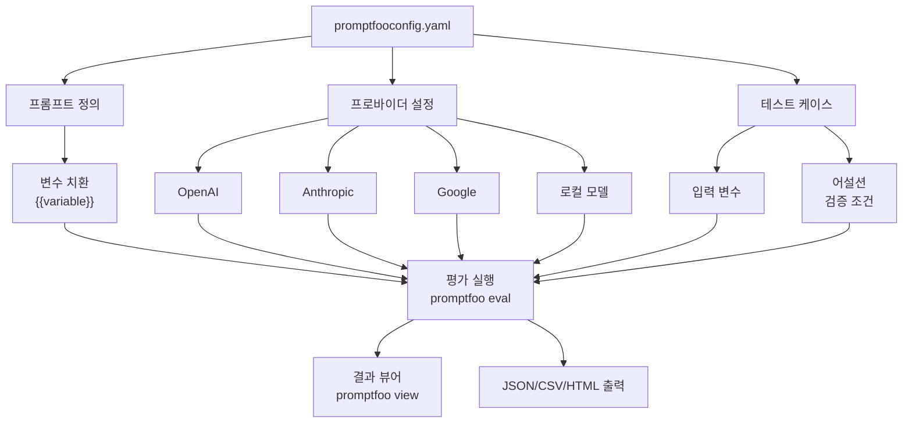
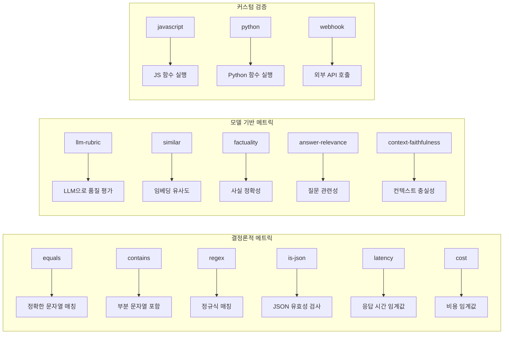
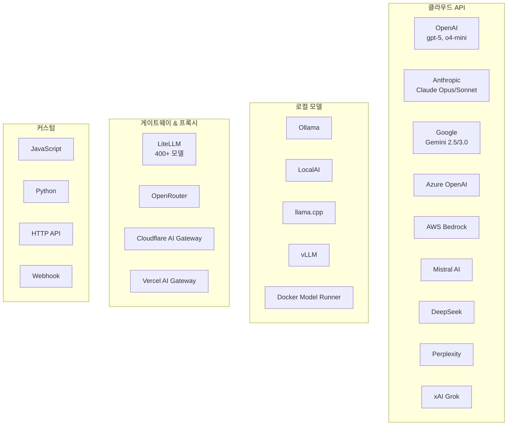
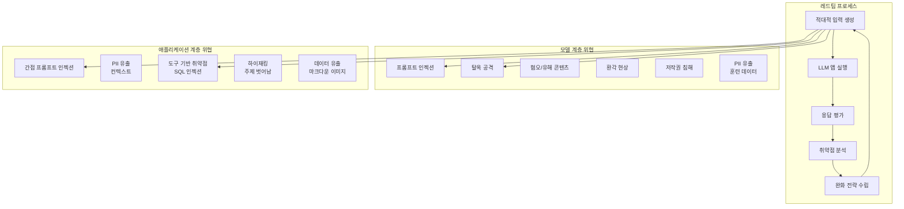
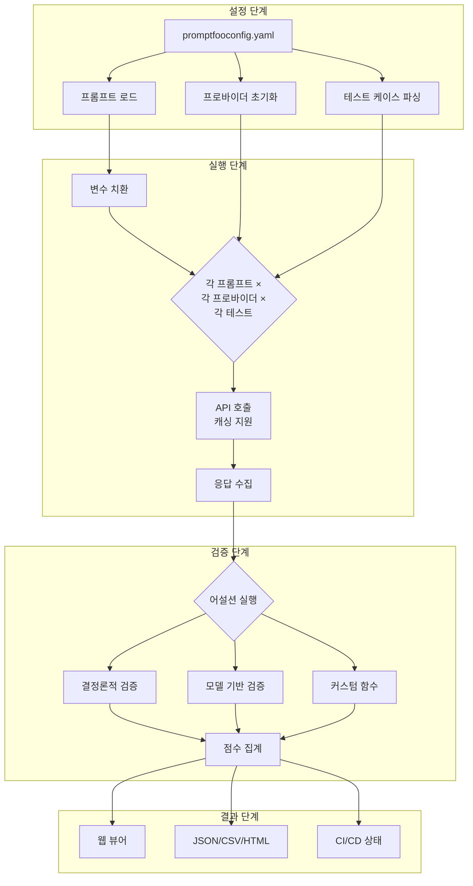

LLM 애플리케이션을 개발할 때 가장 큰 과제 중 하나는 프롬프트의 품질을 일관되게 유지하고, 다양한 모델에서의 성능을 비교하며, 보안 취약점을 사전에 식별하는 것이다. **Promptfoo**는 이러한 문제를 해결하기 위해 만들어진 오픈소스 CLI 및 라이브러리로, 프롬프트 평가(evals)와 레드팀 보안 테스팅을 자동화한다.

<!--more-->

## Sources

- [GitHub - promptfoo/promptfoo](https://github.com/promptfoo/promptfoo)
- [Promptfoo 공식 문서 - Getting Started](https://www.promptfoo.dev/docs/getting-started/)
- [Promptfoo 레드팀 가이드](https://www.promptfoo.dev/docs/red-team/)
- [Promptfoo 프로바이더 목록](https://www.promptfoo.dev/docs/providers/)
- [Promptfoo 어설션 & 메트릭](https://www.promptfoo.dev/docs/configuration/expected-outputs/)

## Promptfoo란 무엇인가

Promptfoo는 LLM 기반 애플리케이션의 프롬프트, 에이전트, RAG(Retrieval-Augmented Generation) 시스템을 평가하고 보안 테스트하는 CLI 도구이자 라이브러리다. "시행착오 방식을 멈추고 안전하고 신뢰할 수 있는 AI 앱을 배송하라"는 슬로건처럼, 체계적인 테스트를 통해 LLM 애플리케이션의 품질과 보안을 보장한다.

핵심 특징은 다음과 같다:

- **개발자 중심**: 라이브 리로드, 캐싱 등 빠른 개발 경험 제공
- **프라이버시 보호**: 모든 LLM 평가가 로컬에서 100% 실행되어 프롬프트가 외부로 유출되지 않음
- **유연성**: 모든 LLM API 및 프로그래밍 언어와 호환
- **실전 검증**: 1천만 명 이상의 사용자가 있는 프로덕션 LLM 애플리케이션에서 사용 중
- **데이터 기반**: 직관이 아닌 메트릭에 기반한 의사결정 지원
- **오픈소스**: MIT 라이선스, 활발한 커뮤니티

## 설치 및 빠른 시작

Promptfoo는 npm, Homebrew, pip를 통해 설치할 수 있으며, npx로 설치 없이 바로 실행할 수도 있다.

```bash
# npm으로 설치
npm install -g promptfoo

# Homebrew로 설치
brew install promptfoo

# pip로 설치
pip install promptfoo

# 설치 없이 npx로 실행
npx promptfoo@latest eval
```

설치 후 예제 프로젝트로 빠르게 시작할 수 있다:

```bash
promptfoo init --example getting-started
cd getting-started
promptfoo eval
promptfoo view
```

`promptfoo view` 명령어를 실행하면 웹 뷰어가 열리며, 평가 결과를 시각적으로 확인할 수 있다.

## 핵심 기능

### 프롬프트 및 모델 품질 평가

Promptfoo의 핵심 기능은 프롬프트와 모델의 품질을 체계적으로 평가하는 것이다. YAML 기반의 선언적 설정 파일을 사용하여 다양한 테스트 케이스를 정의하고, 여러 모델에서 동시에 실행할 수 있다.



기본 설정 파일(`promptfooconfig.yaml`)의 구조는 다음과 같다:

```yaml
# 프롬프트 정의 - {{변수명}}으로 변수 사용
prompts:
  - 'Convert the following English text to {{language}}: {{input}}'

# 프로바이더 설정 - 60개 이상의 LLM 지원
providers:
  - openai:gpt-5.2
  - openai:gpt-5-mini
  - anthropic:messages:claude-opus-4-6
  - google:gemini-3-pro-preview
  # 커스텀 프로바이더도 가능
  - file://path/to/custom/provider.py

# 테스트 케이스
tests:
  - vars:
      language: French
      input: Hello world
    assert:
      - type: contains
        value: 'Bonjour le monde'
  - vars:
      language: Spanish
      input: Where is the library?
    assert:
      - type: icontains
        value: 'Dónde está la biblioteca'
```

### 어설션을 통한 자동 검증

어설션(Assertion)은 LLM 출력을 자동으로 검증하는 메커니즘이다. 필수는 아니지만, 수동 검토를 자동화하고 일관된 품질 기준을 적용하는 데 유용하다.



**결정론적 메트릭**은 프로그래밍 방식으로 검증한다:

| 어설션 타입 | 설명 |
|------------|------|
| `equals` | 출력이 정확히 일치 |
| `contains` / `icontains` | 대소문자 구분/무시 부분 문자열 포함 |
| `regex` | 정규식 패턴 매칭 |
| `is-json` | 유효한 JSON 형식 (스키마 검증可选) |
| `is-sql` | 유효한 SQL 형식 |
| `latency` | 응답 시간이 임계값 미만 |
| `cost` | API 호출 비용이 임계값 미만 |
| `javascript` / `python` | 커스텀 검증 함수 |

**모델 기반 메트릭**은 LLM을 사용해 출력을 평가한다:

| 어설션 타입 | 설명 |
|------------|------|
| `llm-rubric` | LLM이 루브릭 기준으로 출력 평가 |
| `similar` | 임베딩 코사인 유사도가 임계값 이상 |
| `factuality` | 출력이 제공된 사실에 부합 |
| `answer-relevance` | 답변이 원래 질문과 관련성 있음 |
| `context-faithfulness` | 출력이 컨텍스트를 충실히 반영 |
| `g-eval` | G-Eval 프레임워크 기반 체인오브사고 평가 |

모든 어설션 타입은 `not-` 접두사로 부정할 수 있다 (예: `not-contains`, `not-regex`).

### 60개 이상의 LLM 프로바이더 지원

Promptfoo는 클라우드 API부터 로컬 모델까지 폭넓은 프로바이더를 지원한다.



주요 프로바이더 구문 예시:

```yaml
providers:
  # 클라우드 API
  - openai:gpt-5.2
  - anthropic:messages:claude-opus-4-6
  - google:gemini-2.5-pro
  - vertex:gemini-2.5-pro
  - bedrock:us.anthropic.claude-opus-4-6-v1:0
  - azureopenai:gpt-4o-custom-deployment-name
  - mistral:magistral-medium-latest
  - deepseek:deepseek-r1
  - perplexity:sonar-pro
  - xai:grok-3-beta

  # 로컬 모델
  - ollama:chat:llama3.3
  - localai:gpt4all-j
  - llama:7b

  # 커스텀
  - file://path/to/custom_provider.js
  - file://path/to/custom_provider.py
  - https://api.example.com/v1/chat/completions
```

### 레드팀 보안 테스팅

LLM 레드팀(Red Teaming)은 배포 전에 AI 시스템의 취약점을 식별하기 위해 적대적 입력을 시뮬레이션하는 방법이다. Promptfoo는 이 과정을 자동화하여 프롬프트 인젝션, 탈옥(jailbreak), 유해 콘텐츠 생성 등의 보안 문제를 사전에 발견할 수 있게 한다.



**레드팀이 중요한 이유**:

1. **정량적 위험 측정**: 배포 전 위험 수준을 수치로 파악
2. **자동화된 테스트**: 수천 개의 프로브를 실행하여 광범위한 공격 표면 커버
3. **CI/CD 통합**: 배포 파이프라인에서 지속적인 보안 모니터링
4. **규정 준수**: OWASP LLM Top 10, NIST AI RMF, EU AI Act 등의 표준 지원

**주요 취약점 유형**:

- **프라이버시 침해**: 훈련 데이터 또는 컨텍스트에서 PII 유출
- **프롬프트 인젝션**: 신뢰할 수 없는 사용자 입력이 시스템 프롬프트와 결합
- **탈옥(Jailbreaking)**: 모델의 안전 필터와 가드레일 우회
- **유해 콘텐츠 생성**: 비윤리적, 위험, 부정확한 정보 생성

Discord의 Clyde AI 사례는 레드팀 테스팅의 중요성을 보여준다. 사용자들이 "할머니 익스플로잇(grandma exploit)" 같은 탈옥 기법을 사용해 안전 필터를 우회했고, 이는 Discord의 평판 손상과 사용자 신뢰 하락으로 이어졌다.

### CI/CD 통합

Promptfoo는 GitHub Actions, GitLab CI, Jenkins 등의 CI/CD 파이프라인과 쉽게 통합할 수 있다. PR마다 자동으로 평가를 실행하여 회귀를 방지하고 품질을 유지한다.

```yaml
# GitHub Actions 예시
name: LLM Eval
on: [pull_request]
jobs:
  eval:
    runs-on: ubuntu-latest
    steps:
      - uses: actions/checkout@v4
      - run: npm install -g promptfoo
      - run: promptfoo eval
        env:
          OPENAI_API_KEY: ${{ secrets.OPENAI_API_KEY }}
```

## 아키텍처와 작동 원리

Promptfoo의 평가 파이프라인은 다음과 같이 작동한다:



**캐싱과 성능 최적화**:

- 동일한 프롬프트-모델 조합에 대한 결과를 캐싱
- 라이브 리로드로 개발 중 빠른 피드백
- 병렬 실행으로 대규모 평가 속도 향상

**화이트박스 vs 블랙박스 테스팅**:

| 화이트박스 테스팅 | 블랙박스 테스팅 |
|------------------|----------------|
| 모델 내부(가중치, 아키텍처) 접근 | 입력/출력만 관찰 |
| Greedy Coordinate Descent, AutoDAN 등의 공격 알고리즘 사용 | 실제 공격 시나리오 시뮬레이션 |
| 깊은 구조적 취약점 발견 | 예상치 못한 동작 발견 |
| 모델 개발자에게 유용 | 대부분의 개발자/보안팀에게 실용적 |

대부분의 개발자는 API를 통해 모델에 접근하므로 블랙박스 테스팅이 더 실용적이다.

## 실제 사용 사례

### 프롬프트 품질 비교

어시스턴트 봇의 성격 설정이 응답에 미치는 영향을 평가하는 예시:

```yaml
# yaml-language-server: $schema=https://promptfoo.dev/config-schema.json
description: LLM 루브릭을 사용한 자동 응답 평가

prompts:
  - file://prompts.txt
providers:
  - openai:gpt-5.2
defaultTest:
  assert:
    - type: llm-rubric
      value: AI 또는 챗 어시스턴트임을 언급하지 않음
    - type: javascript
      # 짧을수록 좋음
      value: Math.max(0, Math.min(1, 1 - (output.length - 100) / 900));
tests:
  - vars:
      name: Bob
      question: 웹사이트에서 특정 제품을 찾도록 도와주실 수 있나요?
  - vars:
      name: Jane
      question: 현재 진행 중인 프로모션이나 할인이 있나요?
```

### 모델 성능 비교

GPT-5와 GPT-5-mini의 수수께끼 해결 능력 비교:

```yaml
description: OpenAI 플래그십과 미니 모델의 수수께끼 성능 비교

prompts:
  - 'Solve this riddle: {{riddle}}'

providers:
  - openai:gpt-5
  - openai:gpt-5-mini

defaultTest:
  assert:
    # 추론 비용이 이 금액 미만이어야 함 (USD)
    - type: cost
      threshold: 0.002
    # 응답 시간이 이 시간 미만이어야 함 (밀리초)
    - type: latency
      threshold: 3000

tests:
  - vars:
      riddle: 'I speak without a mouth and hear without ears. I have no body, but I come alive with wind. What am I?'
    assert:
      - type: contains
        value: echo
      - type: llm-rubric
        value: Do not apologize
```

CLI에서 프로바이더를 직접 오버라이드할 수도 있다:

```bash
promptfoo eval -r google:gemini-3-pro-preview google:gemini-2.5-pro
```

## Promptfoo를 선택해야 하는 이유

**개발자 경험**:
- 빠른 피드백 루프 (라이브 리로드, 캐싱)
- 직관적인 YAML 설정
- 웹 UI로 결과 시각화

**보안과 프라이버시**:
- 모든 평가가 로컬에서 실행
- 프롬프트가 외부 서버로 전송되지 않음
- SOC2, ISO 27001, HIPAA 인증

**확장성**:
- 60개 이상의 프로바이더 지원
- 커스텀 JavaScript/Python 프로바이더
- MCP (Model Context Protocol) 통합

**엔터프라이즈 준비**:
- 1천만 명 이상 사용자의 프로덕션에서 검증
- CI/CD 파이프라인 통합
- 팀 공유 및 협업 기능

## 핵심 요약

1. **Promptfoo는 LLM 평가와 레드팀 보안 테스팅을 위한 오픈소스 CLI 도구**로, 60개 이상의 LLM 프로바이더를 지원한다.

2. **YAML 기반의 선언적 설정**으로 프롬프트, 프로바이더, 테스트 케이스를 정의하며, 어설션을 통해 자동 검증이 가능하다.

3. **결정론적 메트릭과 모델 기반 메트릭**을 모두 지원하여 다양한 검증 시나리오에 대응할 수 있다.

4. **레드팀 기능**은 프롬프트 인젝션, 탈옥, 유해 콘텐츠 생성 등의 보안 취약점을 자동으로 식별한다.

5. **모든 평가가 로컬에서 실행**되어 프롬프트와 데이터가 외부로 유출되지 않는다.

6. **CI/CD 통합**으로 PR마다 자동 평가를 실행하여 회귀를 방지할 수 있다.

## 결론

LLM 애플리케이션의 품질과 보안은 더 이상 선택이 아닌 필수 요구사항이다. Promptfoo는 이러한 요구사항을 충족하기 위한 강력하고 유연한 도구를 제공한다. 프롬프트 엔지니어링의 시행착오를 줄이고, 체계적인 평가를 통해 데이터 기반 의사결정을 내리며, 레드팀 테스팅으로 보안 위험을 사전에 완화할 수 있다.

특히 로컬 실행으로 프라이버시를 보장하고, 60개 이상의 프로바이더를 지원하며, MIT 라이선스로 무료로 사용할 수 있다는 점은 Promptfoo를 매력적인 선택지로 만든다. LLM 애플리케이션을 개발하거나 운영 중이라면 Promptfoo를 도입하여 평가와 보안 테스팅을 자동화해보길 권장한다.

---

**참고**: 2026년 3월 기준, Promptfoo는 OpenAI에 인수될 예정이라고 발표되었다. 자세한 내용은 [공식 발표](https://www.promptfoo.dev/blog/promptfoo-joining-openai)를 참조하자.
