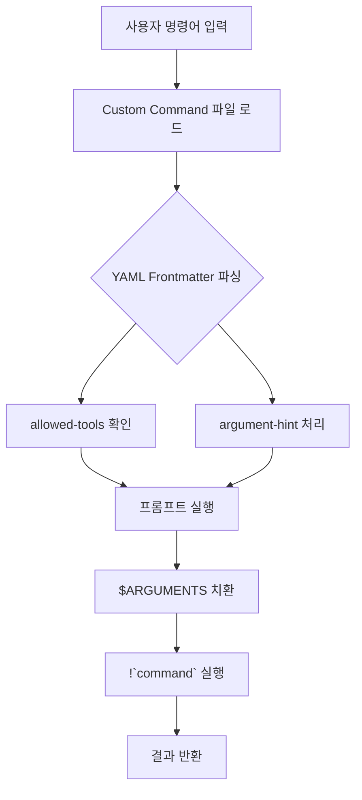
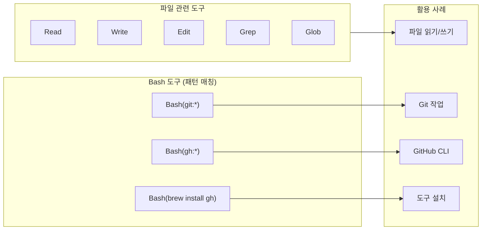
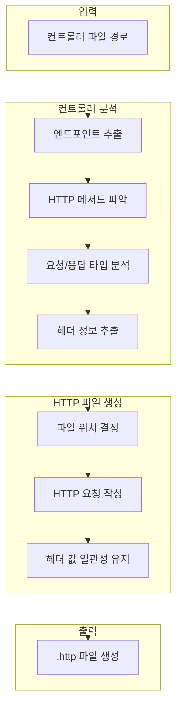
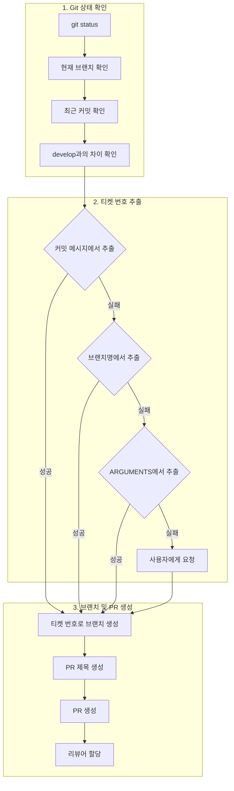
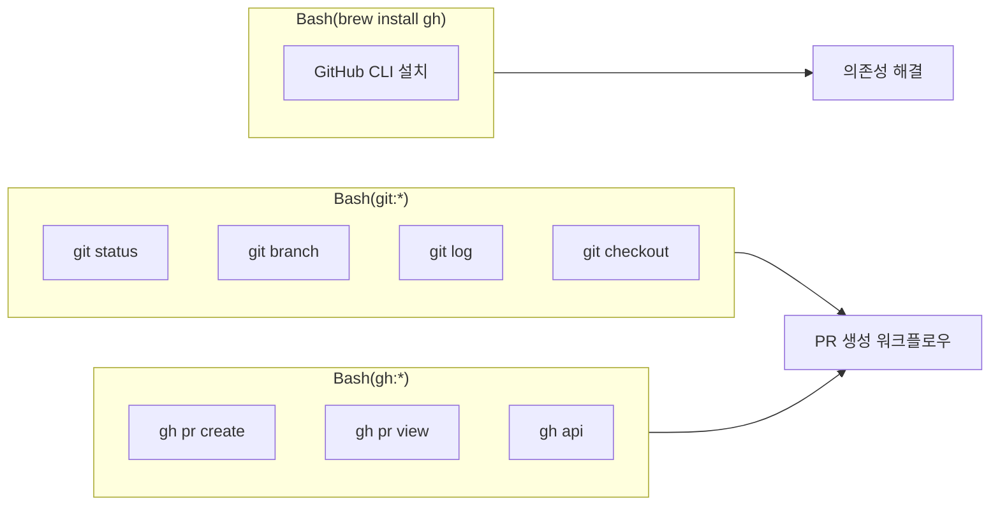
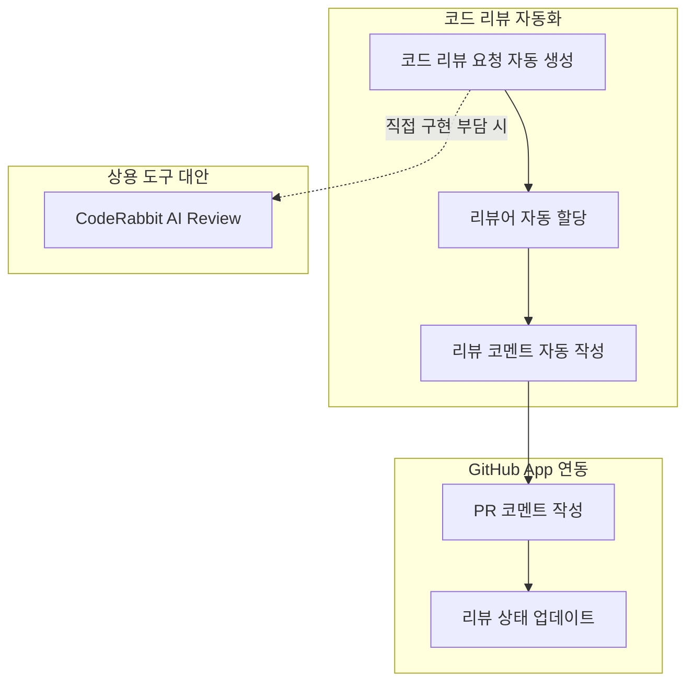
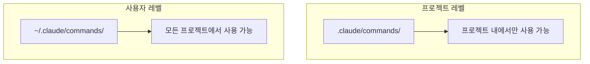

Claude Code, Gemini CLI와 같은 AI 기반 코딩 도구들이 개발 생산성을 높이는 데 큰 역할을 하고 있습니다. 이러한 도구들 중에서도 특히 강력한 기능 중 하나가 바로 Custom Command입니다. Custom Command를 활용하면 반복적인 개발 작업을 자동화하여 개발 효율성을 크게 향상시킬 수 있습니다.

<!--more-->

## Sources

- [https://mangkyu.tistory.com/451](https://mangkyu.tistory.com/451) - Claude Code Custom Command 활용 사례 및 예시

## Custom Command란?

Claude Code의 **Custom Command** 는 사용자가 자신만의 명령어를 정의하고 실행할 수 있는 기능입니다. Markdown 파일 형식으로 작성되며, YAML Frontmatter를 통해 명령어의 동작을 세밀하게 제어할 수 있습니다.



### YAML Frontmatter 구조

Custom Command 파일은 다음과 같은 YAML Frontmatter 구조를 가집니다:

```markdown
---
description: 명령어 설명
allowed-tools: Read, Write, Edit, Grep, Glob
argument-hint: [인자1] [인자2]
---

# 명령어 프롬프트 내용
```

**주요 필드 설명:**

| 필드 | 설명 | 예시 |
|------|------|------|
| `description` | 명령어에 대한 간략한 설명 | `IntelliJ HTTP 파일 생성` |
| `allowed-tools` | 명령어가 사용할 수 있는 도구 목록 | `Read, Write, Edit, Grep, Glob` |
| `argument-hint` | 인자 형식에 대한 힌트 | `[controller-file-path]` |

### allowed-tools 패턴

`allowed-tools` 필드는 다양한 패턴을 지원하여 도구 접근을 세밀하게 제어할 수 있습니다:



### 동적 인자 처리

Custom Command에서는 `$ARGUMENTS` 플레이스홀더를 통해 사용자 입력을 받을 수 있습니다:

```markdown
---
argument-hint: [controller-file-path]
---

컨트롤러 파일 경로: $ARGUMENTS
```

또한 `!`command`` 문법을 사용하여 Bash 명령어를 실행하고 그 결과를 프롬프트에 포함할 수 있습니다:

```markdown
현재 git 상태: !`git status`
현재 브랜치: !`git branch --show-current`
```

## 활용 사례 1: IntelliJ HTTP 파일 생성 자동화

IntelliJ IDE의 **HttpClient** 는 HTTP 요청을 간편하게 보낼 수 있는 도구로, Postman과 유사한 기능을 제공합니다. 버전 관리가 가능하고 IDE에 통합되어 있다는 장점이 있습니다.

### 문제 상황

매번 컨트롤러 클래스를 생성할 때마다 수동으로 HTTP 파일을 생성하는 것은 번거로운 반복 작업입니다.

### 자동화 솔루션

Custom Command를 활용하여 컨트롤러 파일을 기반으로 HTTP 테스트 파일을 자동 생성할 수 있습니다.



### Custom Command 구현

```markdown
---
description: IntelliJ HTTP 파일 생성
allowed-tools: Read, Write, Edit, Grep, Glob
argument-hint: [controller-file-path]
---

# IntelliJ HTTP 파일 생성

컨트롤러 파일을 기반으로 HTTP 테스트 파일을 자동 생성합니다.

## 작업 흐름

### 1. 컨트롤러 파일 입력 처리
컨트롤러 파일 경로를 다음 순서로 결정합니다:

1. **직접 제공된 파일 사용**: `$ARGUMENTS`로 제공된 컨트롤러 파일 경로 사용
2. **사용자 입력 요청**: 파일이 제공되지 않으면 개발자에게 컨트롤러 파일 경로 요청

### 2. 컨트롤러 파일 분석

#### 컨트롤러 파일 정보 추출
제공된 컨트롤러 파일에서 다음 정보를 추출합니다:

1. **파일 경로**: 절대 경로로 변환
2. **디렉토리**: 컨트롤러 파일이 위치한 디렉토리
3. **파일명**: 확장자 제거 후 HTTP 파일명 생성

#### 컨트롤러 파일 경로 형식
- 상대 경로: `test-api/src/main/kotlin/.../DebuggingTestController.kt`
- 절대 경로: `/Users/.../DebuggingTestController.kt`
- 모노레포 스타일: `@test-api/src/main/kotlin/.../DebuggingTestController.kt`

### 3. HTTP 파일 위치 결정

**HTTP 파일 생성 규칙:**
- 컨트롤러 파일과 동일한 디렉토리에 생성
- 컨트롤러 파일명의 확장자만 `.http`로 변경
- 예: `DebuggingTestController.kt` → `DebuggingTestController.http`

**기존 HTTP 파일 처리:**
- 동일한 위치에 HTTP 파일이 이미 존재하면 기존 파일에 API 추가
- 중복되지 않는 새로운 API만 추가

### 4. 컨트롤러 분석 및 HTTP 요청 생성

#### HTTP 요청 생성
다음 정보를 이용하여 HTTP 요청 작성:
- **HTTP 메서드**: `@PostMapping`, `@GetMapping` 등에서 추출
- **엔드포인트**: `@PostMapping("/api/1.0/...")` 에서 URL 추출
- **요청 본문**: `@RequestBody` 매개변수 타입 분석
- **헤더**: `@RequestHeader` 매개변수 분석
- **설명**: `@Operation(summary = "...")` 또는 주석에서 추출

### 5. 헤더 값 일관성 유지

**헤더 값 결정 우선순위:**
1. **기존 HTTP 파일의 값 사용**: 같은 디렉토리나 근처 HTTP 파일에서 발견된 값
2. **패턴 일관성 유지**: 프로젝트 내에서 사용되는 헤더 타입 일관성
3. **기본값 사용**: 기존 값이 없는 경우에만 기본값 적용
```

### 생성된 HTTP 파일 예시

```http
### 사용자 여권 정보 삭제
POST {{host}}/api/1.0/test/debugging/delete-passport
Content-Type: application/json
user-id: 29048025

### 기존 API (헤더 값 참고)
GET {{host}}/api/v1/users
User-Id: 28603805

### 새로 추가되는 API (동일한 헤더 값 사용)
POST {{host}}/api/v1/users
Content-Type: application/json
User-Id: 28603805

{
    "name": "사용자명"
}
```

### 사용 방법

```bash
# 컨트롤러 파일 경로와 함께 실행
/back:http @test-api/src/main/kotlin/.../DebuggingTestController.kt

# 절대 경로로 실행
/back:http /Users/.../DebuggingTestController.kt

# 파일 경로 없이 실행 (자동 검색 또는 사용자 입력 요청)
/back:http
```

## 활용 사례 2: PR 생성 자동화

GitHub에서 Pull Request를 생성하는 과정은 커밋, 스쿼시, 브랜치 생성, 커밋 메시지 작성, PR 제목 및 설명 작성 등 여러 단계를 거쳐야 합니다.

### 자동화 접근 방식



### Custom Command 구현

```markdown
---
description: 커밋 없이 Pull Request 생성
allowed-tools: Bash(git *), Bash(gh *), Bash(brew install gh)
argument-hint: [PR-title]
---

# Pull Request 생성 (커밋 없음)

현재 변경사항으로 Pull Request를 생성합니다. 추가 커밋은 하지 않습니다.

## 작업 흐름

### 1. Git 상태 확인
현재 git 상태를 확인합니다:
- Current git status: !`git status`
- Current branch: !`git branch --show-current`
- Recent commits: !`git log --oneline -5`
- Commits ahead of develop: !`git rev-list --count HEAD ^develop 2>/dev/null || echo "0"`

### 2. 커밋 이력 확인 및 브랜치 처리

1. **develop과의 커밋 차이 확인**: `git rev-list --count HEAD ^develop`로 앞선 커밋 수 확인
2. **커밋이 있는 경우**:
    - 최신 커밋 메시지에서 티켓 번호 추출 (예: `[MKU-51]`, `MKU-51:` 등)
    - 추출된 티켓 번호로 새 브랜치 생성하여 전환
3. **커밋이 없는 경우**: 기존 로직대로 티켓 번호 확인

### 3. 티켓 번호 확인

티켓 번호를 다음 순서로 확인합니다:

1. **커밋 메시지에서 추출**: 커밋이 있는 경우 최신 커밋 메시지에서 추출
2. **현재 브랜치명에서 추출**: 브랜치명이 `MKU-51`, `PROJ-123` 등의 형식인 경우
3. **ARGUMENTS에서 추출**: `$ARGUMENTS`에 `[MKU-51]` 형식이 포함된 경우
4. **사용자에게 요청**: 위 방법들로 찾을 수 없는 경우 사용자에게 입력 요청

### 4. 브랜치 생성 및 PR 생성

- **중요**: `git add` 또는 `git commit`을 절대 실행하지 마세요.
- **커밋이 있고 티켓 번호가 추출된 경우**: 추출된 티켓 번호로 새 브랜치 생성
- **현재 브랜치가 `develop`인 경우**: 확인된 티켓 번호로 새 브랜치 생성
- **현재 브랜치가 이미 티켓 번호 형식인 경우**: 현재 브랜치에서 바로 PR 생성

### 5. PR 제목 규칙
- 형식: `[TICKET-ID] Korean description`
- 예시: `[MKU-51] IP 정보로 countryCode 조회 API 구현`
- 커밋 메시지를 기반으로 PR 제목 생성

### 6. PR 완료 작업
- 대상 브랜치는 항상 `develop`
- PR 생성 후 리뷰어 할당
- PR 페이지를 브라우저에서 열기

## GitHub CLI 요구사항

이 명령어는 GitHub CLI (`gh`)가 필요합니다. 설치되지 않은 경우 자동으로 설치를 시도합니다.
```

### allowed-tools 상세 분석



### 사용 방법

```bash
# 티켓 번호와 제목을 함께 제공
/pr-without-commit [MKU-51] IP 정보로 countryCode 조회 API 구현

# 제목만 제공 (티켓 번호는 브랜치명에서 추출)
/pr-without-commit API 성능 개선 작업

# 인수 없이 실행 (티켓 번호와 제목 모두 자동 처리)
/pr-without-commit
```

### 티켓 번호 처리 시나리오

| 상황 | 티켓 번호 출처 | 동작 |
|------|---------------|------|
| 커밋 메시지가 `[MKU-51] API 구현` | 커밋 메시지 | `MKU-51` 브랜치 생성 후 PR |
| 브랜치 `MKU-51`에서 실행 | 브랜치명 | `MKU-51` 사용 |
| `feature/new-api`에서 `/pr-without-commit [PROJ-123]` 실행 | ARGUMENTS | `PROJ-123` 사용 |
| `main`에서 `/pr-without-commit 버그 수정` 실행 | 없음 | 사용자에게 요청 |

## 활용 사례 3: 코드 리뷰 자동화

코드 리뷰 역시 자동화를 통해 생산성을 높일 수 있는 영역입니다.

### 자동화 가능 항목



### GitHub App 연동

Custom Command와 GitHub App을 연동하면 코드 리뷰된 항목을 PR에 코멘트로 남기는 작업도 자동화할 수 있습니다.

### CodeRabbit 대안

직접 구현하는 것이 부담스럽다면, **CodeRabbit** 의 AI Review 도구를 사용할 수 있습니다. CodeRabbit은 개선할 여지가 있는 코드에 자동으로 코드 리뷰 코멘트를 달아줍니다.

## Custom Command 파일 저장 위치

Custom Command는 다음 위치에 저장할 수 있습니다:



## 핵심 요약

- **Custom Command** 는 Claude Code에서 사용자 정의 명령어를 만들 수 있는 기능입니다.
- **YAML Frontmatter** 를 통해 `description`, `allowed-tools`, `argument-hint` 등을 설정할 수 있습니다.
- **allowed-tools 패턴** (`Bash(git:*)`, `Bash(gh:*)`) 을 통해 도구 접근을 세밀하게 제어할 수 있습니다.
- **$ARGUMENTS** 플레이스홀더와 **!`command`** 문법으로 동적 처리가 가능합니다.
- **IntelliJ HTTP 파일 생성**, **PR 생성**, **코드 리뷰** 등 다양한 작업을 자동화할 수 있습니다.

## 결론

Claude Code의 Custom Command는 반복적인 개발 작업을 자동화하는 강력한 도구입니다. IntelliJ HTTP 파일 생성, PR 생성, 코드 리뷰 자동화 등 다양한 활용 사례를 통해 개발 프로세스를 더욱 효율적으로 만들 수 있습니다. 팀 전반에 걸쳐 일관된 워크플로우를 유지하고 싶다면, Custom Command를 적극적으로 활용해 보시기 바랍니다.
